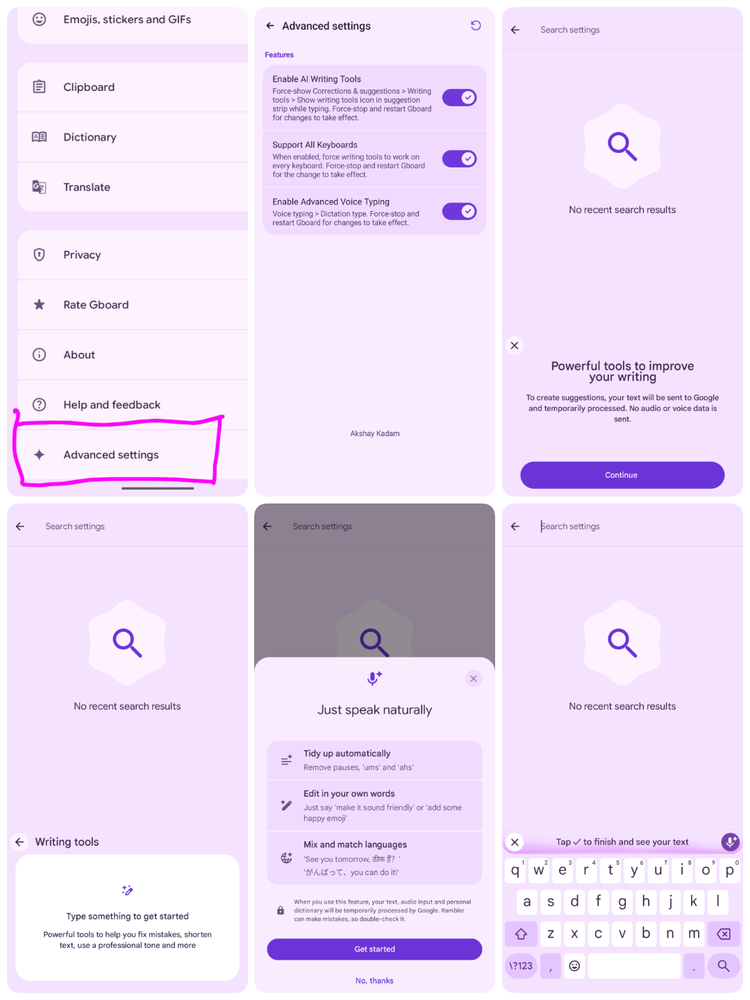

# PixelBoard

<div align="center">

**Supercharged Gboard Mod featuring Google Pixel 11 series's Rambler Voice Typing & AI Writing Assistant [No Root].**

<p>
  <a href="https://github.com/Akshayykadam/PixelBoard/raw/main/output/PixelBoard.apk">
    
  </a>
  &nbsp;&nbsp;
  <a href="https://github.com/Akshayykadam/PixelBoard/raw/main/patches/PixelBoard.mpp">
    
  </a>
</p>

</div>

---

## Visual Tour & Screenshots

<div align="center">
  
</div>

---

## Overview

**PixelBoard** is a sleek, ultra-clean enhancement of Google's flagship keyboard. Tailored for pure productivity, PixelBoard strips away unnecessary bloatware and focuses strictly on two powerhouse features: **Gemini Rambler Voice Dictation** and **AI Writing Assistant**.

PixelBoard is engineered with an independent coexistence package ID (`com.akshaykadam.pixelboard`), allowing you to install and use it **side-by-side with your factory Gboard** without replacing, uninstalling, or risking system keyboard stability.

---

## Key Features

### 1. Gemini "Rambler" Natural Voice Typing
Traditional voice-to-text transcribes every hesitation literally. PixelBoard unlocks Google's state-of-the-art **Rambler** model:
- **Speech Cleanup**: Speak naturally stutters, false starts, and filler words (*"um"*, *"ah"*, *"like"*, *"you know"*) are filtered out in real-time.
- **Thought Completion**: Seamlessly fixes self corrections on the fly (e.g. *"let's meet at two no, three PM"* &rarr; *"Let's meet at 3:00 PM"*).
- **Auto-Punctuation & Capitalization**: Adds context-aware periods, commas, and proper noun capitalization without requiring voice commands.
- **Multilingual Fluidity**: Mix and match languages seamlessly in a single sentence.
- **Battery-Friendly Lifecycle**: Cleanly releases speech recognition bindings (`GoogleAsrService`) as soon as the keyboard is hidden, eliminating screen-off battery drain.

### 2. In-Line AI Writing Assistant
Access Google's Gemini-driven writing suite directly above your keys across any app:
- **One-Tap Proofread**: Correct spelling, grammatical quirks, and punctuation in an instant.
- **Tone & Style Switcher**: Rephrase sentences into Professional, Casual, Concise, or Emotive tones.
- **Smart Edit**: Context-aware editing and quick rephrasing tailored to your conversation.
- **Universal Support**: Works across all keyboard languages and input modes.

### 3. Safe Coexistence & Instant Bypass
- **Side-by-Side Installation**: Installs with app label `PixelBoard` alongside stock Google Keyboard.
- **Signature Whitelist Bypass**: Pre-patched to bypass Google Play signature checks and integrity verifications.

---

## How to Enable Rambler Voice Typing

Follow these quick steps to activate Google's Gemini-powered **Rambler** natural voice typing:

1. **Open PixelBoard Settings**:
   - Tap the **Gear (`⚙️`)** icon in the keyboard suggestion strip, or go to Android **Settings > System > Languages & input > On-screen keyboard > PixelBoard**.
2. **Select Rambler Dictation**:
   - Tap **Voice typing**.
   - Under **Dictation type**, choose **Rambler** (switch selection from *Standard* to *Rambler*).
3. **Apply & Restart Gboard**:
   - Go back to the main PixelBoard settings list and scroll down to the bottom.
   - Tap **★ Advanced settings**.
   - Ensure **Enable Advanced Voice Typing** is toggled **ON** (enabled by default).
   - Tap the **Restart (`↻`)** button in the top-right corner of the toolbar.
   > [!IMPORTANT]
   > Tapping the **Restart button (`↻`)** is required so Gboard restarts its background dictation service and loads the Rambler Gemini model.
4. **Start Speaking Naturally**:
   - Tap any text box and hit the **Microphone** icon on PixelBoard.
   - You will see the **"Just speak naturally"** setup screen.
   - Tap **Get started** and speak freely PixelBoard handles the cleanup automatically!

---

## Where to Find & Use AI Writing Tools

Google's **AI Writing Tools** allow you to proofread, rephrase, and adjust the tone of any text on the fly.

### 1. Where to Configure
- **In Advanced Settings**:
  - Open **★ Advanced settings** from the bottom of PixelBoard Settings.
  - Make sure **Enable AI Writing Tools** and **Support All Keyboards** are toggled **ON** (both are ON by default).
- **In Corrections & Suggestions**:
  - In PixelBoard Settings, go to **Corrections & suggestions > Writing tools**.
  - Ensure **Show writing tools icon in suggestion strip while typing** is enabled.

### 2. Where to Access While Typing
- **Suggestion Strip (Quick Bar)**:
  - When typing in any text box across any app, the **Writing tools icon** (pen sparkle ✨) appears in the keyboard suggestion strip above your keys.
- **Keyboard Tools Menu**:
  - If the icon is hidden, tap the **4-squares / arrow icon** on the left of the suggestion strip to open the tools drawer and tap **Writing tools**.
- **Actions Available**:
  - **Proofread**: One tap fix for grammar and spelling.
  - **Rewrite / Rephrase**: Adjust tone between *Professional*, *Casual*, *Concise*, and *Emotive*.

---

## ⚙️ Advanced Settings Screen

PixelBoard features a clean, minimal preference screen modeled directly after stock Google Gboard UI:

- **Enable AI Writing Tools**: Force-shows the Writing tools icon in the suggestion strip across all apps.
- **Support All Keyboards**: Extends AI writing assistance beyond English to all keyboard layouts.
- **Enable Advanced Voice Typing**: Unlocks the *Rambler* dictation engine in Voice typing settings.
- **Toolbar Restart Button (`↻`)**: One-tap process restart to instantly apply feature flag changes without restarting your device.
- **Custom Attribution**: Dedicated credit footer (*Akshay Kadam*).

---

## Installation Guide

### Option A: Direct Download on Your Phone (Easiest)
1. Download directly to your device:
   - [**PixelBoard Stable APK (v18.3.1 Base, 82 MB)**](https://github.com/Akshayykadam/PixelBoard/raw/main/output/PixelBoard.apk) — ready-to-install signed APK.
   - [**PixelBoard Patch Bundle (PixelBoard.mpp, 1.4 MB)**](https://github.com/Akshayykadam/PixelBoard/raw/main/patches/PixelBoard.mpp) — for patching via Morphe Manager.
2. Tap the downloaded `.apk` in your notification drawer or File Manager (e.g., **Files by Google**).
3. If prompted, toggle **"Allow from this source"** to permit installation.
4. Tap **Install**.

### Option B: Sideload via ADB (For Developers)
Connect your Android phone via USB with USB Debugging enabled:
```bash
adb install -r output/PixelBoard.apk
```

### Option C: Patch via Morphe Manager (Custom Source & Auto-Updates)
You can include PixelBoard as a custom patch source directly in **Morphe Manager** on Android to patch yourself and receive automatic update notifications:
1. In **Morphe Manager**, go to **Patch Sources** (or **Settings > Sources**).
2. Tap **Add (+)** and enter the custom repository URL:
   ```text
   https://raw.githubusercontent.com/Akshayykadam/PixelBoard/main/patches-bundle.json
   ```
    *(or add `Akshayykadam/PixelBoard` directly)*
3. Pick your stock Gboard APK (`v18.3.1` or `v18.0.3` `arm64-v8a`), select your patches, and tap **Patch**!

### First-Time Setup on Device
1. On your phone, go to **Settings > System > Languages & input > On-screen keyboard** (or **Manage Keyboards**).
2. Toggle on **PixelBoard**.
3. Tap the keyboard switch icon (or spacebar selector) and pick **PixelBoard** as your active input method.
4. Follow the [**Rambler Setup Guide**](#-how-to-enable-rambler-voice-typing) to select Rambler dictation and tap restart.
5. Access the [**AI Writing Tools**](#-where-to-find--use-ai-writing-tools) right from your suggestion strip!

---

## 📁 Project Structure

```text
GBoardMod/
├── README.md                  # Project documentation & direct download links
├── build.sh                   # 1-click automated build & patching script (100% offline)
├── options.json               # Clean patch configuration profile (Minimal Profile)
├── patches/
│   └── PixelBoard.mpp         # Pre-bundled offline patch pack (~1.4 MB)
├── input/
│   └── gboard.apk             # Base stock Gboard APK (v18.3.1 Release, 81.2 MB)
├── output/
│   ├── PixelBoard.apk         # Ready-to-install signed Stable APK (v18.3.1 Base, 82 MB)
│   ├── gboard-patched.apk     # Patched binary alias
│   └── patching-result.json   # Patch verification report
├── tools/
│   ├── patcher.jar            # Standalone patch compiler CLI (Java 21)
│   └── patcher-data/          # Signing keystore & local storage
├── LICENSE                    # GNU General Public License v3.0
└── pixelboard-patches/        # PixelBoard patch source repository (Kotlin/Smali)
    ├── gradle/
    ├── patches/               # Patch definitions & Kotlin bytecode modifications
    └── extensions/            # Extension APK bytecode & runtime hooks
```

---

## 🛠️ Building & Patching

### 1. Instant 1-Click Build (100% Offline)
Place your stock Gboard APK at `input/gboard.apk`, then simply run:
```bash
./build.sh
```
This runs completely offline using the pre-bundled `patches/PixelBoard.mpp` and `tools/patcher.jar`. It instantly patches, aligns, and signs `output/PixelBoard.apk`.

### 2. Rebuilding Patch Bundle from Source (Optional)
If you modify any Smali or Kotlin patch code inside `pixelboard-patches/`:
```bash
./build.sh --rebuild
```
This recompiles the `.mpp` patch pack using Gradle and immediately applies it.

### 3. Manual CLI Usage (Requires Java 21)
```bash
java -jar tools/patcher.jar patch \
  --patches=patches/PixelBoard.mpp \
  --options-file=options.json \
  --striplibs=arm64-v8a \
  -o=output/PixelBoard.apk \
  -r=output/patching-result.json \
  input/gboard.apk
```

### 3. Verify Signature & Alignment
```bash
zipalign -c -v 4 output/PixelBoard.apk
apksigner verify --verbose output/PixelBoard.apk
```

---

## Developer & Maintainer

**Akshay Kadam**
- GitHub: [@Akshayykadam](https://github.com/Akshayykadam)
- Project Repository: [PixelBoard](https://github.com/Akshayykadam/PixelBoard)

---


## Acknowledgements & Credits

Special thanks and sincere appreciation to:
- **JasonWu** — The pioneering author of the original Gboard patch project whose foundational reverse-engineering research and Smali patch framework made this specialized mod possible.
- **Paolo Del Casale** ([@PaoloDelCasale](https://github.com/PaoloDelCasale)) — For the comprehensive BatteryStats investigation and candidate fix resolving background `GoogleAsrService` persistence in Rambler dictation ([Issue #3](https://github.com/Akshayykadam/PixelBoard/issues/3)).
- **The ReVanced & Open-Source Android Modding Communities** — For the open-source decompilation toolchains, patch compilers, and continuous ecosystem contributions.

---

## Legal Disclaimer

> [!CAUTION]
> **PLEASE READ THIS LEGAL DISCLAIMER CAREFULLY BEFORE DOWNLOADING, COMPILING, OR USING THIS SOFTWARE.**

1. **Non-Affiliation & Endorsement**: **PixelBoard** is an independent, non-commercial open-source modification project developed for interoperability and accessibility research. It is **not** affiliated with, sponsored by, authorized by, maintained by, or in any way associated with **Google LLC**, **Alphabet Inc.**, or any of their subsidiaries.
2. **Intellectual Property & Trademarks**: "Google", "Gboard", "Pixel", "Android", "Gemini", and all related logos, product names, and brand identifiers are trademarks or registered trademarks of Google LLC. All trademarks, service marks, and trade names referenced herein remain the property of their respective owners. Their mention in this repository is strictly for product identification and nominative fair-use purposes.
3. **Personal & Educational Use Only**: This software, including all patch definitions and compiled binaries, is provided solely for **personal education, private study, and experimental research**. It is not intended for commercial distribution or monetization.
4. **No Warranty ("AS IS")**: This software is distributed under an open-source license on an **"AS IS" BASIS, WITHOUT WARRANTIES OR CONDITIONS OF ANY KIND**, either express or implied, including, without limitation, any implied warranties of merchantability, fitness for a particular purpose, non-infringement, or system stability.
5. **Limitation of Liability**: Under no circumstances shall the author, contributors, maintainers, or distributors be held liable for any direct, indirect, incidental, special, exemplary, or consequential damages (including, but not limited to, data loss, device malfunction, service interruption, account penalties, or legal claims) resulting from the download, installation, execution, or misuse of this software.
6. **User Responsibility**: Users assume all risks associated with sideloading or executing third-party modified software on their devices and are individually responsible for complying with applicable local laws, regulations, and third-party terms of service.

---

<div align="center">
  <sub>Built with ❤️ for Google Pixel </sub>
</div>

