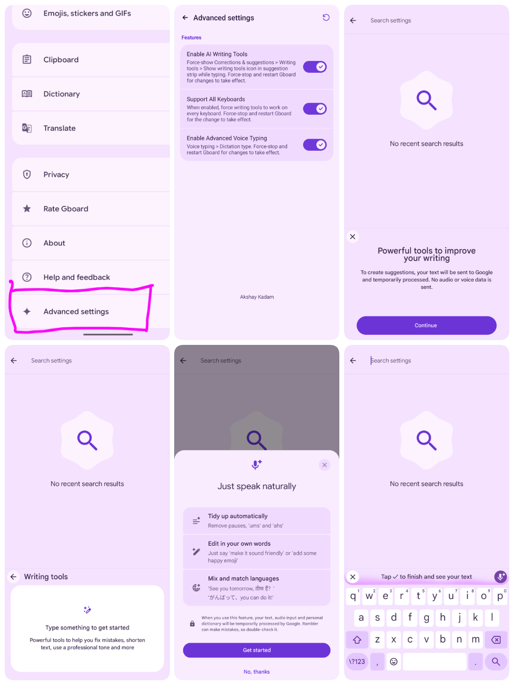

# PixelBoard

<div align="center">

**Supercharged Gboard Mod featuring Google Pixel 11 series's Rambler Voice Typing, AI Writing Assistant & Writing Tools V2 [No Root].**

<p>
  <a href="https://github.com/Akshayykadam/PixelBoard/releases/download/v18.4.1-Stable/PixelBoard-18.4.1.apk">
    
  </a>
  &nbsp;&nbsp;
  <a href="https://www.apkmirror.com/apk/google-inc/gboard/gboard-the-google-keyboard-18-4-1-985164140-release/">
    
  </a>
  &nbsp;&nbsp;
  <a href="https://github.com/Akshayykadam/PixelBoard/raw/main/patches/PixelBoard.mpp">
    
  </a>
</p>

<p>
  
  
  
  
  
</p>

</div>

---

## Visual Tour & Screenshots

<div align="center">
  
</div>

---

## Overview

**PixelBoard** is a sleek, ultra-clean enhancement of Google's flagship keyboard. Tailored for pure productivity, PixelBoard strips away unnecessary bloatware and focuses strictly on powerhouse capabilities: **Gemini Rambler Natural Voice Dictation**, **AI Writing Assistant**, **Writing Tools V2 Gating**, **Device-Gated Inference Backend Selection**, and **Automatic Zero-Restart Instant Activation**.

PixelBoard is engineered with an independent coexistence package ID (`com.akshaykadam.pixelboard`), allowing you to install and use it **side-by-side with your factory Gboard** without replacing, uninstalling, or risking system keyboard stability.

---

## Key Features

### 1. Gemini "Rambler" Natural Voice Typing
Traditional voice-to-text transcribes every hesitation literally. PixelBoard unlocks Google's state-of-the-art **Rambler** model:
- **Speech Cleanup**: Speak naturally — stutters, false starts, and filler words (*"um"*, *"ah"*, *"like"*, *"you know"*) are filtered out in real-time.
- **Thought Completion**: Seamlessly fixes self-corrections on the fly (e.g., *"let's meet at two no, three PM"* &rarr; *"Let's meet at 3:00 PM"*).
- **Auto-Punctuation & Capitalization**: Adds context-aware periods, commas, and proper noun capitalization without requiring voice commands.
- **Multilingual Fluidity**: Mix and match languages seamlessly in a single sentence.
- **Battery-Friendly Lifecycle**: Cleanly releases speech recognition bindings (`GoogleAsrService`) as soon as the keyboard is hidden, eliminating screen-off battery drain ([#3](https://github.com/Akshayykadam/PixelBoard/issues/3)).
- **Cold Boot & Direct Boot Readiness**: Powered by Device-Protected Storage (DE), ensuring Rambler voice typing is ready immediately after device reboots without needing manual Gboard restarts ([#4](https://github.com/Akshayykadam/PixelBoard/issues/4)).

### 2. In-Line AI Writing Assistant
Access Google's Gemini-driven writing suite directly above your keys across any app:
- **One-Tap Proofread**: Correct spelling, grammatical quirks, and punctuation in an instant.
- **Tone & Style Switcher**: Rephrase sentences into *Professional*, *Casual*, *Concise*, or *Emotive* tones.
- **Smart Edit**: Context-aware editing and quick rephrasing tailored to your conversation.
- **Universal Support**: Works across all keyboard languages and input modes.

### 3. Writing Tools V2 Gating (New in v18.4)
- **Suggested Style Chips & Prompt Bar**: Unlocks Google's modern "Suggested" style chips and the freeform "Describe your edit" prompt bar.
- **Intelligent Hardware Gating**: Integrated with hardware/model eligibility checks to prevent unexpected errors or crashes on unsupported devices.
- **Dedicated In-App Control**: Toggle Writing Tools V2 on/off directly inside Advanced Settings with a clean Material You **BETA** badge.

### 4. Device-Gated AI Inference Backend Selector (New in v18.4)
On supported devices (such as Google Pixel 8 Pro / 9 series), choose your preferred inference pipeline directly under Advanced Settings:
- `GBOARD_SERVER` (Google Cloud Server Inference)
- `PRIVATE_INFERENCE_AICORE` (On-Device Private Android AICore)
- `PRIVATE_INFERENCE_ASTREA` (On-Device Astrea Framework)
- Dynamically hidden on unsupported hardware to maintain a clutter-free, native experience.

### 5. Automatic Live Activation — Zero Restarts Required (New)
- **Instant Hot-Reload**: Toggling Rambler Voice Typing, switching AI Writing Tools preferences, or changing inference backend options applies automatically in real time without restarting Gboard, force-closing the app, or rebooting your phone.
- **Zero-Friction Workflow**: Features are synchronized across the keyboard process dynamically — simply configure your desired options and start typing or dictating right away.
- **Optional Manual Reload**: Advanced Settings retains an optional Restart (`↻`) button solely as a convenience tool, but manual restarts are no longer mandatory.

### 6. Safe Coexistence & Instant Bypass
- **Side-by-Side Installation**: Installs with app label `PixelBoard` alongside stock Google Keyboard.
- **Signature Whitelist Bypass**: Pre-patched bytecode ensures Google Play signature checks and integrity verifications pass cleanly without root.

> [!NOTE]
> **Google Pixel Device Requirement**: New advanced features (such as **Writing Tools V2** and the **On-Device AI Inference Backend Selector**) are available **only on Google Pixel devices** (e.g., Pixel 8 Pro / Pixel 9 series) due to system AICore and hardware model requirements. On non-Pixel Android devices, these specific options are automatically hidden or gated to ensure complete stability, while core features like **Gemini Rambler Natural Voice Typing**, **AI Proofread**, and **Tone Rewriting** work across all supported devices.

---

## How to Enable Rambler Voice Typing

Follow these quick steps to activate Google's Gemini-powered **Rambler** natural voice typing:

1. **Open PixelBoard Settings**:
   - Tap the **Gear (`⚙️`)** icon in the keyboard suggestion strip, or go to Android **Settings > System > Languages & input > On-screen keyboard > PixelBoard**.
2. **Select Rambler Dictation**:
   - Tap **Voice typing**.
   - Under **Dictation type**, choose **Rambler** (switch selection from *Standard* to *Rambler*).
3. **Instant Automatic Activation (No Restart Needed)**:
   - Your selection activates automatically in real-time — **no app restart or device reboot required**!
   - *(Optional)*: You can verify that **Enable Advanced Voice Typing** is toggled **ON** under **★ Advanced settings** (enabled by default). The toolbar **Restart (`↻`)** button remains available as an optional manual fallback if ever needed.
   > [!TIP]
   > Thanks to recent runtime enhancements, Rambler dictation initializes dynamically on the fly. You can immediately tap the microphone icon without needing to restart Gboard or kill the app process!
4. **Start Speaking Naturally**:
   - Tap any text box and hit the **Microphone** icon on PixelBoard.
   - You will see the **"Just speak naturally"** setup screen.
   - Tap **Get started** and speak freely — PixelBoard handles the cleanup automatically!

---

## Where to Find & Use AI Writing Tools

Google's **AI Writing Tools** allow you to proofread, rephrase, and adjust the tone of any text on the fly.

### 1. Where to Configure
- **In Advanced Settings**:
  - Open **★ Advanced settings** from the bottom of PixelBoard Settings.
  - Make sure **Enable AI Writing Tools** and **Support All Keyboards** are toggled **ON** (both ON by default).
  - For supported hardware, optionally toggle **Writing Tools V2 (Beta)**.
- **In Corrections & Suggestions**:
  - In PixelBoard Settings, go to **Corrections & suggestions > Writing tools**.
  - Ensure **Show writing tools icon in suggestion strip while typing** is enabled.

### 2. Where to Access While Typing
- **Suggestion Strip (Quick Bar)**:
  - When typing in any text box across any app, the **Writing tools icon** (pen sparkle ✨) appears in the keyboard suggestion strip above your keys.
- **Keyboard Tools Menu**:
  - If the icon is hidden, tap the **4-squares / arrow icon** on the left of the suggestion strip to open the tools drawer and tap **Writing tools**.
- **Actions Available**:
  - **Proofread**: One-tap fix for grammar and spelling.
  - **Rewrite / Rephrase**: Adjust tone between *Professional*, *Casual*, *Concise*, and *Emotive*.
  - **Suggested & Custom Edit (V2)**: Tap quick suggestions or describe edits in freeform.

---

## ⚙️ Advanced Settings Screen

PixelBoard features a clean, minimal preference screen modeled directly after the native Material You Gboard UI:

- **Enable AI Writing Tools**: Force-shows the Writing tools icon in the suggestion strip across all apps and text views.
- **Support All Keyboards**: Extends AI writing assistance beyond English to all keyboard layouts.
- **Writing Tools V2 (Beta)**: Enables modern "Suggested" style chips and freeform edit prompts with device safety gating.
- **Inference Backend Type**: On supported hardware, select between `GBOARD_SERVER`, `PRIVATE_INFERENCE_AICORE`, and `PRIVATE_INFERENCE_ASTREA`.
- **Enable Advanced Voice Typing**: Unlocks the *Rambler* dictation engine in Voice typing settings.
- **Toolbar Restart Button (`↻`)**: Optional one-tap process reload utility in the toolbar if you ever want to force a refresh, though all settings and toggles now apply automatically in real time.
- **Custom Attribution**: Dedicated credit footer (*Akshay Kadam*).

---

## Installation Guide

### Option A: Direct Download on Your Phone (Easiest)
1. Download directly from the [**PixelBoard v18.4.1 Release**](https://github.com/Akshayykadam/PixelBoard/releases/tag/v18.4.1-Stable):
   - [**PixelBoard Stable APK (v18.4.1, 127 MB)**](https://github.com/Akshayykadam/PixelBoard/releases/download/v18.4.1-Stable/PixelBoard-18.4.1.apk) — ready-to-install signed APK.
   - [**Stock Gboard Base APK (122 MB)**](https://www.apkmirror.com/apk/google-inc/gboard/gboard-the-google-keyboard-18-4-1-985164140-release/) — download the official bundle from APKMirror for patching.
   - [**PixelBoard Patch Bundle (PixelBoard.mpp, 1.5 MB)**](https://github.com/Akshayykadam/PixelBoard/raw/main/patches/PixelBoard.mpp) — for patching via Morphe Manager.
2. Tap the downloaded `.apk` in your notification drawer or File Manager (e.g., **Files by Google**).
3. If prompted, toggle **"Allow from this source"** to permit installation.
4. Tap **Install**.

### Option B: Sideload via ADB (For Developers)
Connect your Android phone via USB with USB Debugging enabled:
```bash
adb install -r output/PixelBoard.apk
```

### Option C: Patch via Morphe Manager (On-Device Patcher)
You can patch your stock Gboard APK directly on your phone using **Morphe Manager**:
1. Install **Morphe Manager** on your Android device.
2. Get the two required files:
   - **Patch Bundle**: [**PixelBoard.mpp**](https://github.com/Akshayykadam/PixelBoard/raw/main/patches/PixelBoard.mpp)
   - **Stock Base APK**: Download the official base bundle from [**APKMirror (Gboard v18.4.1 Release)**](https://www.apkmirror.com/apk/google-inc/gboard/gboard-the-google-keyboard-18-4-1-985164140-release/).
3. In Morphe Manager, select **Storage**, choose the stock Gboard APK, and load `PixelBoard.mpp` as the patch source.
4. Tap **Patch** and then **Install**!

> [!TIP]
> You can also add PixelBoard as a custom auto-updating patch source in Morphe Manager by adding:
> ```text
> https://raw.githubusercontent.com/Akshayykadam/PixelBoard/main/patches-bundle.json
> ```

---

## First-Time Setup on Device

1. On your phone, go to **Settings > System > Languages & input > On-screen keyboard** (or **Manage Keyboards**).
2. Toggle on **PixelBoard**.
3. Tap the keyboard switch icon (or spacebar selector) and pick **PixelBoard** as your active input method.
4. Follow the [**Rambler Setup Guide**](#how-to-enable-rambler-voice-typing) to select Rambler dictation (activates automatically — no restart needed!).
5. Access the [**AI Writing Tools**](#where-to-find--use-ai-writing-tools) right from your suggestion strip!

---

## 📁 Project Structure

```text
GBoardMod/
├── README.md                  # Project documentation & direct download links
├── build.sh                   # 1-click automated build & patching script (100% offline)
├── options.json               # Patch configuration profile
├── patches/
│   ├── PixelBoard.mpp         # Pre-bundled offline patch pack (~1.4 MB)
│   └── patches-bundle.json    # Morphe Manager repository metadata
├── input/
│   └── gboard.apk             # Base stock Gboard APK (v18.4.1 Release, ~122 MB)
├── output/
│   ├── PixelBoard.apk         # Compiled APK (local build output / hosted on GitHub Releases)
│   └── patching-result.json   # Patch verification report
├── tools/
│   ├── patcher.jar            # Standalone patch compiler CLI (Java 21)
│   └── patcher-data/          # Signing keystore & local storage
├── LICENSE                    # GNU General Public License v3.0
└── pixelboard-patches/        # PixelBoard patch source repository (Kotlin/Smali)
    ├── gradle/
    ├── patches/               # Patch definitions & Kotlin bytecode modifications
    └── extensions/            # Extension APK bytecode & runtime hooks
```

---

## 🛠️ Building & Patching

### 1. Instant 1-Click Build (100% Offline)
Place your stock Gboard APK at `input/gboard.apk`, then run:
```bash
./build.sh
```
This runs completely offline using the pre-bundled `patches/PixelBoard.mpp` and `tools/patcher.jar`. It automatically patches, aligns, and signs `output/PixelBoard.apk`.

### 2. Rebuilding Patch Bundle from Source (Optional)
If you modify any Smali or Kotlin patch code inside `pixelboard-patches/`:
```bash
./build.sh --rebuild
```
This recompiles the `.mpp` patch pack using Gradle and immediately applies it to the stock APK.

### 3. Running Test Suite
Verify patch bytecode transformations and contract integrity:
```bash
cd pixelboard-patches
JAVA_HOME=/opt/homebrew/opt/openjdk@21 ./gradlew test
```

### 4. Manual CLI Usage (Requires Java 21)
```bash
java -jar tools/patcher.jar patch \
  --patches=patches/PixelBoard.mpp \
  --options-file=options.json \
  --striplibs=arm64-v8a \
  -o=output/PixelBoard.apk \
  -r=output/patching-result.json \
  input/gboard.apk
```

---

## Compatibility Matrix

| Property | Requirement |
| :--- | :--- |
| **Target Package** | `com.google.android.inputmethod.latin` |
| **Primary Base Version** | `18.4.1.985164140-release-arm64-v8a` (Recommended) |
| **Compatible Versions** | `18.4.1.985164140-beta-arm64-v8a`<br>`18.3.1.977415014-release-arm64-v8a` |
| **Architecture** | `arm64-v8a` |
| **Android Version** | Android 10 (API 29) through Android 16 Preview |
| **Root Required** | **No** (Standalone side-by-side coexistence) |

> [!NOTE]
> **Google Pixel Device Support**: The new v18.4 features (**Writing Tools V2** and **On-Device Private AICore / Astrea inference**) are available **only on Google Pixel devices**. Core **Rambler Natural Voice Typing**, **AI Writing Assistant**, proofreading, and tone rewrite work across all Android devices.

---

## Developer & Maintainer

**Akshay Kadam**
- GitHub: [@Akshayykadam](https://github.com/Akshayykadam)
- Project Repository: [PixelBoard](https://github.com/Akshayykadam/PixelBoard)

---

## Acknowledgements & Credits

Special thanks and sincere appreciation to:
- **JasonWu** — The pioneering author of the original Gboard patch project whose foundational reverse-engineering research and Smali patch framework made this mod possible.
- **Paolo Del Casale** ([@PaoloDelCasale](https://github.com/PaoloDelCasale)) — For deep BatteryStats investigations and candidate fixes resolving background `GoogleAsrService` persistence ([#3](https://github.com/Akshayykadam/PixelBoard/issues/3)) and the offline language pack download loop ([#5](https://github.com/Akshayykadam/PixelBoard/issues/5)).
- **The ReVanced & Morphe Open-Source Android Modding Communities** — For the open-source decompilation toolchains, patch compilers, and continuous ecosystem contributions.

---

## Legal Disclaimer

> [!CAUTION]
> **PLEASE READ THIS LEGAL DISCLAIMER CAREFULLY BEFORE DOWNLOADING, COMPILING, OR USING THIS SOFTWARE.**

1. **Non-Affiliation & Endorsement**: **PixelBoard** is an independent, non-commercial open-source modification project developed for interoperability and accessibility research. It is **not** affiliated with, sponsored by, authorized by, maintained by, or in any way associated with **Google LLC**, **Alphabet Inc.**, or any of their subsidiaries.
2. **Intellectual Property & Trademarks**: "Google", "Gboard", "Pixel", "Android", "Gemini", and all related logos, product names, and brand identifiers are trademarks or registered trademarks of Google LLC. All trademarks, service marks, and trade names referenced herein remain the property of their respective owners. Their mention in this repository is strictly for product identification and nominative fair-use purposes.
3. **Personal & Educational Use Only**: This software, including all patch definitions and compiled binaries, is provided solely for **personal education, private study, and experimental research**. It is not intended for commercial distribution or monetization.
4. **No Warranty ("AS IS")**: This software is distributed under an open-source license on an **"AS IS" BASIS, WITHOUT WARRANTIES OR CONDITIONS OF ANY KIND**, either express or implied, including, without limitation, any implied warranties of merchantability, fitness for a particular purpose, non-infringement, or system stability.
5. **Limitation of Liability**: Under no circumstances shall the author, contributors, maintainers, or distributors be held liable for any direct, indirect, incidental, special, exemplary, or consequential damages (including, but not limited to, data loss, device malfunction, service interruption, account penalties, or legal claims) resulting from the download, installation, execution, or misuse of this software.
6. **User Responsibility**: Users assume all risks associated with sideloading or executing third-party modified software on their devices and are individually responsible for complying with applicable local laws, regulations, and third-party terms of service.

---

<div align="center">
  <sub>Built with ❤️ for Google Pixel & Android Community</sub>
</div>
