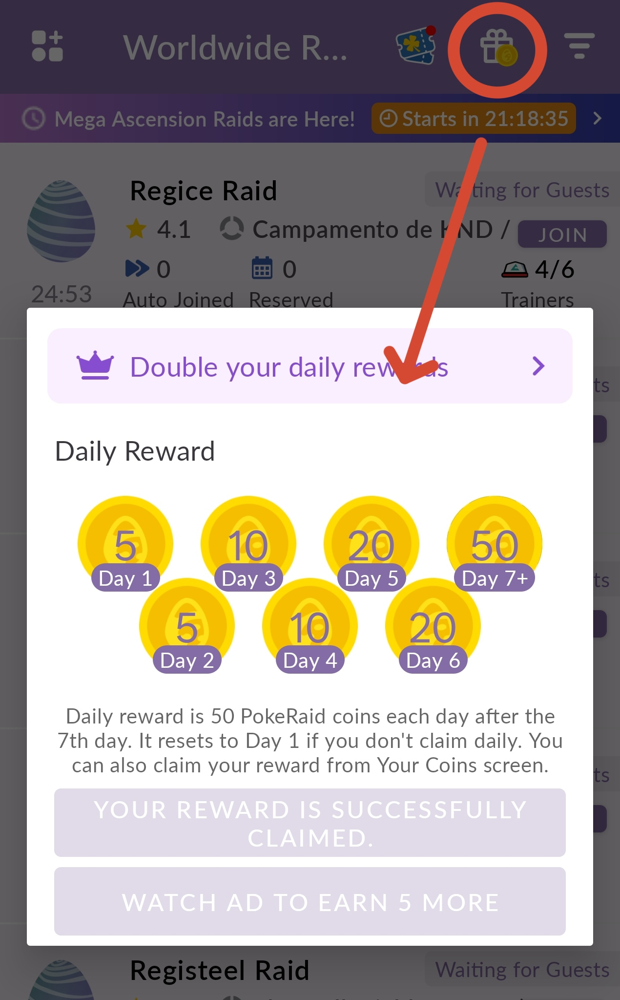
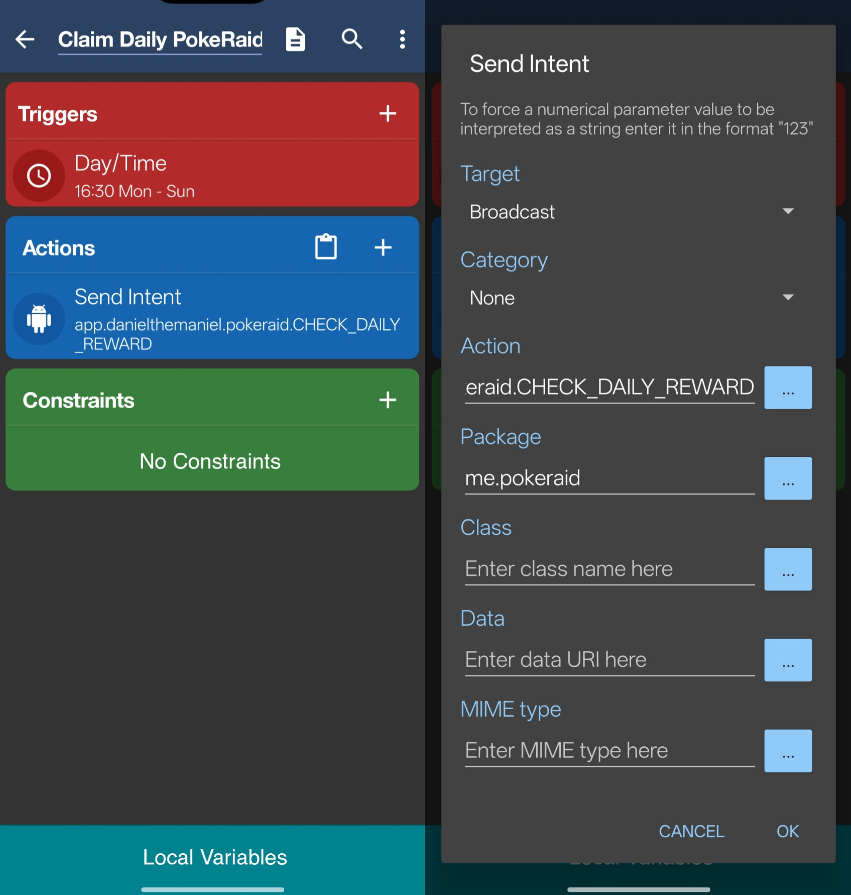
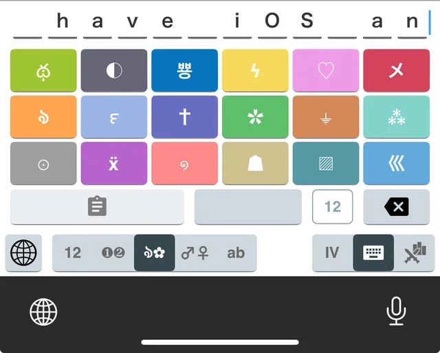
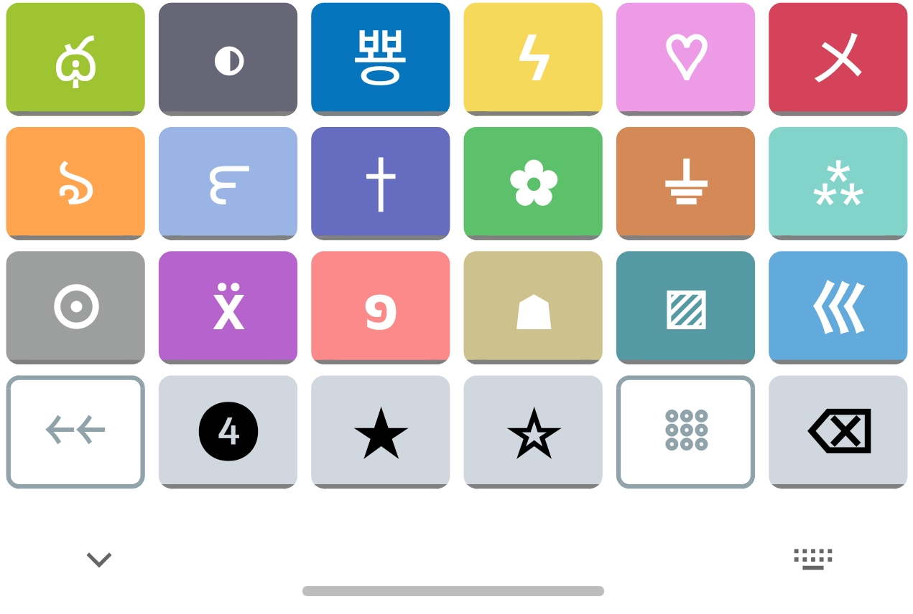

# DanielTheManiel's Morphe Patches

Pokémon GO related patches for apps I use. Made with the help of AI.

Click here to add these patches to Morphe: https://morphe.software/add-source?github=Dan1elTheMan1el/Morphe-Patches

## ❓ About / Recommendations

Right now, this repo supports **PokeRaid**, **DeFit**, and **Custom Keyboard Designer**. Here are some more notes about some of my patches:

- ### PokeRaid
  - I recommend pairing my patches with [Nai64's patch](https://github.com/Nai64/Nai64Patches) called `Ads Free Reward (Experimental)`. The default settings work for skipping ads for daily coins or sweepstake tickets.
  - Simply remaps the bounty button to the daily coins - you can long press the button to open the original menu.

    

       
      <em>Figure 1: Bounty Daily Reward Shortcut</em>
    

  - If you want to automatically claim your daily coins without opening the app, use the **Daily Reward Background Auto Claim** patch. I use **MacroDroid**, but apps like Tasker or equivalent could also acheive the same. 

    

       
      <em>Figure 2: MacroDroid setup to claim daily rewards</em>
    

    I have it run every day at 4:30PM, and all it does is send a **Broadcast** to the package `me.pokeraid` with the action `app.danielthemaniel.pokeraid.CHECK_DAILY_REWARD`.
  - I though of adding quick join buttons for when lots of people are trying to join raid rooms at the same time. I didn't like that you need to tap into the raid details before joining, and by the time it loads it can already be full. This patch adds **JOIN** buttons accessible from the main list.
- ### DeFit
  - This app is used to fake Adventure Sync distance while Pokemon GO is not running. To use, close the game (including from app history), then start syncing in DeFit. I find that *9km/h* with *Human* behavior works best.
  - I added a tutorial for how to setup Google login/API on your own signing signature. If it's not clear enough let me know, otherwise use my [pre-built version](https://github.com/Dan1elTheMan1el/Morphe-Patches/releases/download/v1.0.0/DeFit_-v0.8.2a-patches-v1.0.0.apk).
- ### Custom Keyboard Designer
  - This app is a bit difficult to start using, but offers a ton of customization options for creating custom keyboards. Having used PokeGenie on iOS, I wanted an equivalent keyboard on Android, so I designed this one.
    <table align="center">
      <tr>
        <td>
          

             
            <em><b>Figure 3a:</b> PokeGenie iOS's keyboard</em>
          

        </td>
        <td>
          

             
            <em><b>Figure 3b:</b> My adaptation</em>
          

        </td>
      </tr>
    </table>

  - If you already have the app installed and just want to import my PokeGenie keyboard, you can manually import the [keyboard file](https://github.com/Dan1elTheMan1el/Morphe-Patches/releases/download/v1.2.0/PokemonTypesKeyboard.txt).
  - If you want to change the symbols / layout, you can! It's a keyboard designer app of course.
  

## 🩹 Patches list

<!-- PATCHES_START -->
> **[v1.5.0](https://github.com/Dan1elTheMan1el/Morphe-Patches/releases/tag/v1.5.0)**&nbsp;&nbsp;•&nbsp;&nbsp;`main`&nbsp;&nbsp;•&nbsp;&nbsp;15 patches total

📦 PokeRaid - for Pokémon GO Raid&nbsp;&nbsp;•&nbsp;&nbsp;7 patches

 

**🎯 Supported versions:**

| 0.48.9 |
| :---: |

| 💊&nbsp;Patch | 📜&nbsp;Description | ⚙️&nbsp;Options |
|----------|----------------|-----------|
| [Bounty Daily Reward Shortcut](#bounty-daily-reward-shortcut) | Tap Bounty to open Daily Reward; long press it to open Bounty. |  |
| [Daily Reward Background Auto-Claim](#daily-reward-background-auto-claim) | Checks daily reward eligibility and automatically claims it (bypassing ads) if available. Invoke by sending intent as broadcast, with action app.danielthemaniel.pokeraid.CHECK_DAILY_REWARD, and package me.pokeraid. |  |
| [Disable Ads](#disable-ads) | Disables ads locally using PokeRaid's built-in Disabled ad strategy. |  |
| [Disable Analytics](#disable-analytics) | Disables Firebase Analytics, Crashlytics, Performance Monitoring, and Advertising ID collection while preserving app functionality. |  |
| [Hide News Banners](#hide-news-banners) | Hides PokeRaid announcement carousels without breaking Data Binding. |  |
| [Material You Theme](#material-you-theme) | Uses Android 12+ wallpaper-derived Material You colors throughout PokeRaid while preserving semantic status and raid-type colors. |  |
| [Quick Join Button](#quick-join-button) | Adds an optimistic JOIN button to room cards using PokeRaid's stock authenticated join request. |  |

📦 Custom Keyboard Designer&nbsp;&nbsp;•&nbsp;&nbsp;3 patches

 

**🎯 Supported versions:**

| 5.B8.8 |
| :---: |

| 💊&nbsp;Patch | 📜&nbsp;Description | ⚙️&nbsp;Options |
|----------|----------------|-----------|
| [Change keyboard name](#change-keyboard-name) | Changes the name shown for Keyboard Designer in Android's keyboard/input-method switcher. | • Keyboard name |
| [Start with PokeGenie keyboard](#start-with-pokegenie-keyboard) | Adds my PokeGenie-inspired keyboard design on fresh setup and makes it the portrait text-input default. |  |
| [Unlock Premium](#unlock-premium) | Unlocks all premium features, extended design package, and extended keyboard package. |  |

📦 DeFit&nbsp;&nbsp;•&nbsp;&nbsp;5 patches

 

**🎯 Supported versions:**

| 0.8.2a | 🧪&nbsp;0.9.3 |
| :---: | :---: |

| 💊&nbsp;Patch | 📜&nbsp;Description | ⚙️&nbsp;Options |
|----------|----------------|-----------|
| [Custom Branding](#custom-branding) | Changes DeFit's app name, header title, and displayed version. | • App name • Top bar text • Version |
| [Login Fix Tutorial](#login-fix-tutorial) | Adds an in-app Google Fit login setup guide and a button to copy the installed APK's signing SHA-1. |  |
| [Material You Theme](#material-you-theme) | Uses Android 12+ wallpaper-derived colors and enables safe system Force Dark without changing DeFit's AppCompat theme parent. |  |
| [Remove Bottom Banner Ad](#remove-bottom-banner-ad) | Removes DeFit's bottom banner-ad container from the main layout. |  |
| [Unlimited Time Bypass](#unlimited-time-bypass) | Removes the ad requirement and grants the target DeFit version's maximum active time when the button is pressed. |  |

<!-- PATCHES_END -->

### 🛠️ Building locally

- Run `./gradlew buildAndroid`
- The built patches .mpp file is found in `patches/build/libs/patches-*.mpp`
- Patch the mpp file using [Morphe-Desktop](https://github.com/MorpheApp/morphe-desktop)
  like any other patch bundle.

See the [Morphe documentation](https://github.com/MorpheApp/morphe-documentation) for more information.

## 📜 License

DanielTheManiel's Morphe Patches are licensed under the [GNU General Public License v3.0](LICENSE)
