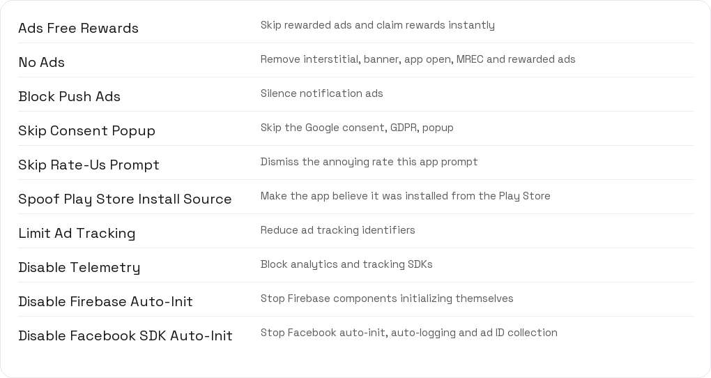
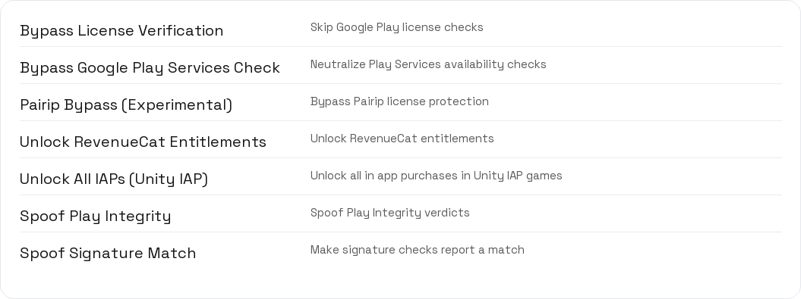
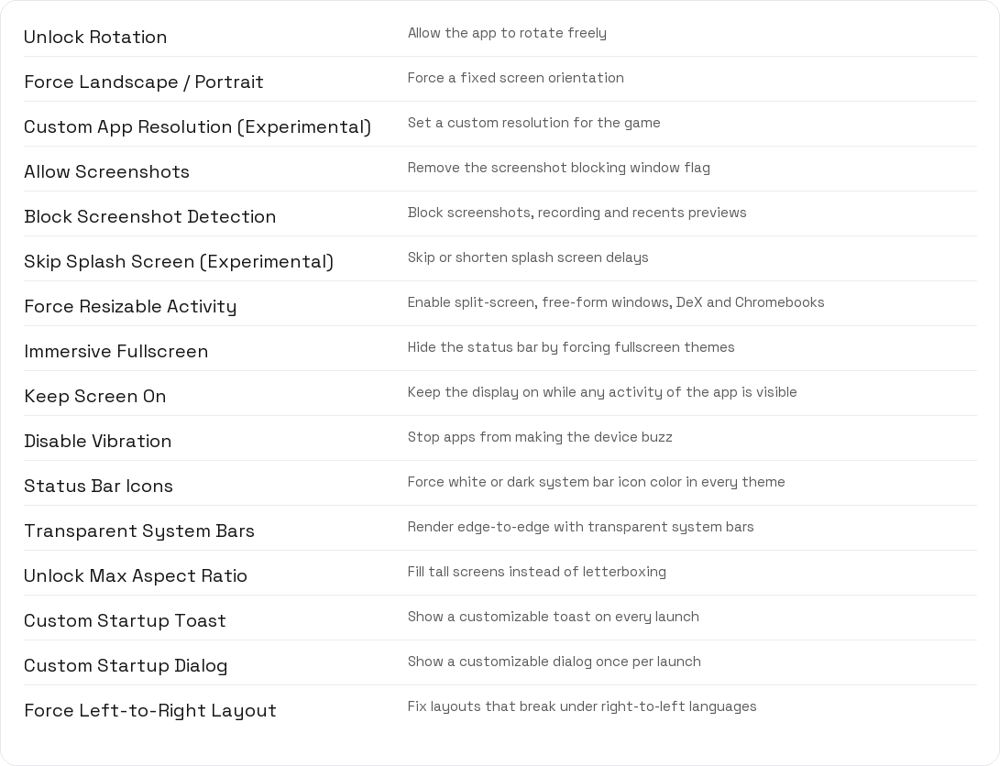
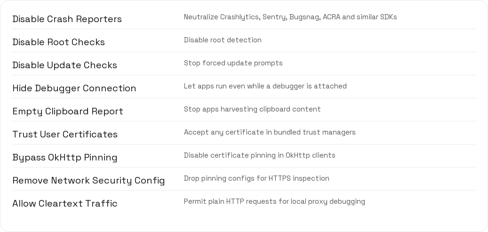
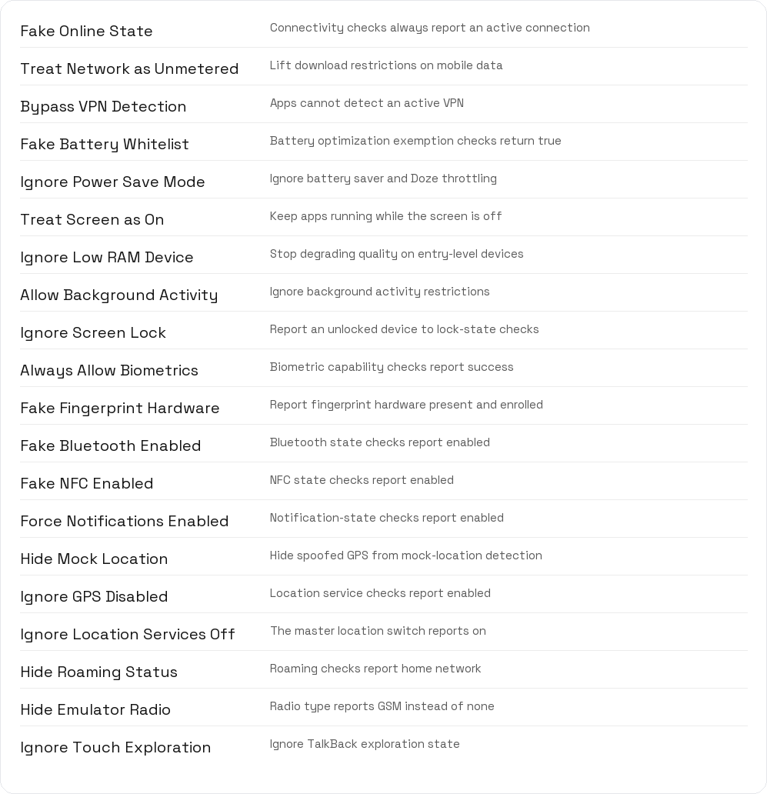
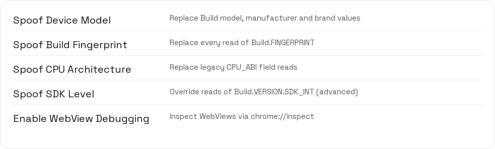
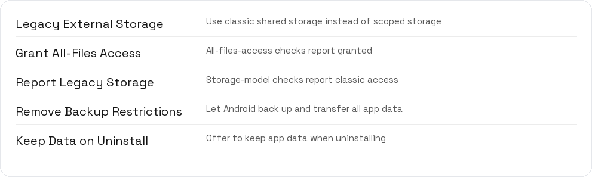
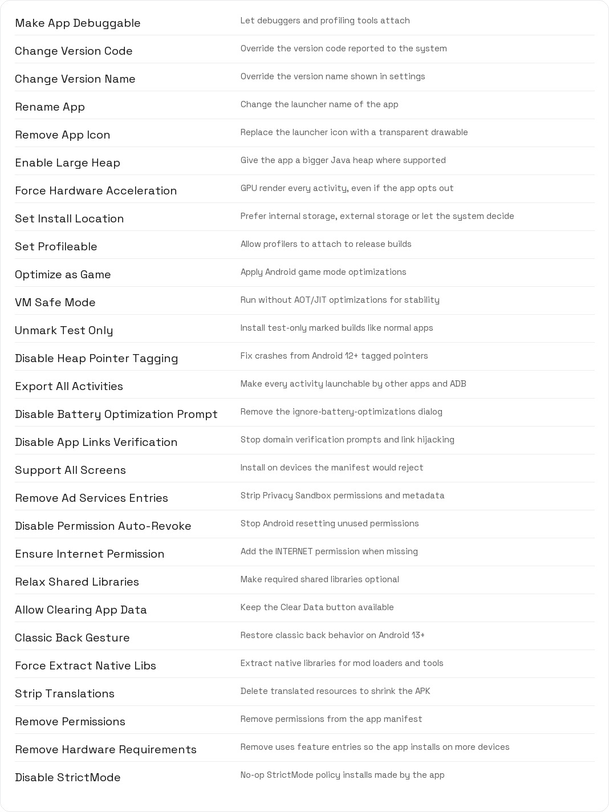

  

# Nai's Patches

A curated collection of Morphe patches that tune, unlock and declutter Android apps and games. Skip ads, bypass license checks, hide root, force orientations, tweak manifest behavior, strip translations and more, all from a single patcher.

---

- [Overview](#overview)
- [Features](#features)
- [How to Use](#how-to-use)
- [Patch Options](#patch-options)
- [Tips](#tips)
- [Warnings](#warnings)
- [Compatibility](#compatibility)
- [Disclaimer](#disclaimer)

---

Nai's Patches is a set of ready made patches built for the [Morphe](https://github.com/MorpheApp) patcher. Each patch targets a common annoyance found in modern Android apps and games: rewarded ad walls, forced splash screens, license popups, root and integrity detection, and locked in app purchases.

> [!NOTE]
> Every patch is optional. Enable only what you need for a given app or game. Most patches work independently, and several can be combined for a cleaner experience.

The project is open source and community driven. New patches and fixes land through standard pull requests, and releases are produced automatically.

---

Add Nai's Patches as a source inside the Morphe patcher.

| Method | Link |
| :--- | :--- |
| Deep link | [morphe.software/add-source?github=Nai64/Nai64Patches](https://morphe.software/add-source?github=Nai64/Nai64Patches) |
| Manual | `https://github.com/Nai64/Nai64Patches` |

> [!TIP]
> Tap the deep link on a device that already has Morphe installed to add the source in one step.

Patches are grouped by what they affect. The table below lists every available patch and a short description.

<b>Ads, Tracking and Consent</b>

<b>Unlocks and Licensing</b>

<b>Display and Interface</b>

<b>Privacy and Security</b>

<b>Device State Spoofs</b>

<b>Hardware and System Spoofs</b>

<b>Storage and Backups</b>

<b>Manifest and App Tweaks</b>

> [!TIP]
> Combine **No Ads** with **Disable Telemetry** for the quietest possible session, and add **Ads Free Rewards** only when an app gates progress behind rewarded ads.

---

1. Open your app or game APK in the Morphe patcher.
2. Browse the patch list and toggle the patches you want.
3. Expand a patch to review its options and adjust them.
4. Run the patch and install the rebuilt APK.

> [!IMPORTANT]
> Always keep a copy of the original APK. If a patched build misbehaves, you can fall back to the unmodified version and try a different combination of patches.

Most patches expose friendly dropdowns or toggles instead of raw text fields, so you rarely need to type anything by hand.

---

Some patches are highly configurable. Expand a section to see its options.

<b>Ads Free Rewards</b>

| Option | Type | Default | Notes |
| :--- | :--- | :--- | :--- |
| Patch version | Dropdown | 1.19.0 (Current) | Pick a historical implementation, useful when an app only works with an older approach |
| Reward Strategy | Dropdown | Auto (all networks) | AppLovin MAX, Unity Ads, ironSource or every supported network |
| Instant reward | Toggle | On | Claim the reward immediately without showing an ad, applies to the current version |

<b>Force Landscape / Portrait</b>

| Option | Type | Default | Notes |
| :--- | :--- | :--- | :--- |
| Orientation | Dropdown | Landscape | Landscape, Portrait, Sensor Landscape, Sensor Portrait, User Landscape, User Portrait |

<b>No Ads</b>

| Option | Type | Default | Notes |
| :--- | :--- | :--- | :--- |
| Block Interstitials | Toggle | On | Full screen ads between content |
| Block Banners | Toggle | On | Top or bottom banner ads |
| Block App Open | Toggle | On | Ads shown on app start |
| Block MREC | Toggle | On | Medium rectangle banner ads |
| Block Rewarded | Toggle | On | Rewarded ads, may disable features that require watching them |

<b>Custom App Resolution (Experimental)</b>

| Option | Type | Default | Notes |
| :--- | :--- | :--- | :--- |
| Enable Custom Resolution | Toggle | Off | Override the app window size with the values below |
| Resolution width | Number | 1920 | Horizontal resolution in pixels |
| Resolution height | Number | 1080 | Vertical resolution in pixels |

<b>Disable Telemetry</b>

Twelve independent toggles let you block each analytics SDK on its own. All default to On.

| Option | Blocks |
| :--- | :--- |
| Block Firebase Analytics | Google analytics and crash reporting |
| Block AppsFlyer | Mobile attribution and marketing analytics |
| Block Adjust | Mobile attribution analytics |
| Block Amplitude | Product analytics |
| Block Mixpanel | Product analytics |
| Block CleverTap | User engagement and analytics |
| Block Segment | Customer data pipeline |
| Block Facebook Analytics | Meta analytics and event logging |
| Block Branch.io | Deep linking and attribution |
| Block Unity Analytics | Unity engine analytics |
| Block Flurry | Yahoo analytics |
| Block GameAnalytics | Game focused analytics |

<b>Version and identity patches</b>

| Patch | Option | Default | Notes |
| :--- | :--- | :--- | :--- |
| Change Version Code | Version code | -1, keeps original | Any positive number |
| Change Version Name | Version name | Empty, keeps original | e.g. 2.5.1 |
| Rename App | App name | Empty, keeps original | New launcher label |
| Set Install Location | Install location | Auto | Auto, Prefer external storage or Internal storage only |
| Spoof Device Model | Model / Manufacturer / Brand | Empty, keeps original | Replaces Build field reads |
| Spoof Build Fingerprint | Fingerprint | Empty, keeps original | Full build fingerprint string |
| Spoof CPU Architecture | CPU ABI dropdown | Keep original | arm64-v8a, armeabi-v7a, x86_64, x86 |
| Spoof SDK Level | SDK level | -1, keeps original | Advanced: wrong values crash apps calling newer APIs |

<b>Interface patches with options</b>

| Patch | Option | Default | Notes |
| :--- | :--- | :--- | :--- |
| Custom Startup Toast | Toast message | Patched by Nai's Patches | Shown on every launch |
| Custom Startup Toast | Duration | Long | Short or long toast |
| Custom Startup Dialog | Dialog title | Patched App | Title of the startup dialog |
| Custom Startup Dialog | Dialog message | This app has been modified... | Body of the dialog |
| Custom Startup Dialog | Dismissable | On | Allow closing via back button or outside tap |
| Status Bar Icons | Icon color | White | White icons on dark backgrounds or dark icons on light ones |

<b>Manifest cleanup patches</b>

| Patch | Option | Default | Notes |
| :--- | :--- | :--- | :--- |
| Remove Permissions | Permissions to remove | SMS, RECORD_AUDIO, CAMERA and similar | Comma separated permission names |
| Remove Hardware Requirements | Features to remove | Empty, removes all | Comma separated feature names, leave empty to remove every uses feature entry |

---

- Start with a minimal set of patches, then add more only if needed. Smaller changes are easier to debug.
- If an app crashes after patching, disable the most recent patch you enabled and test again.
- Use the Patch version option in Ads Free Rewards to roll back to an older implementation when a newer app build stops working.
- Spoof Play Store Install Source can help with apps that restrict features to Play Store installs.
- Force Landscape or Portrait is great for apps that ignore device rotation or feel wrong in one orientation.

> [!TIP]
> Keep the patcher log open while testing. Patches that find nothing simply report a warning and move on, so a clean log with no errors usually means the app just did not contain that code path.

---

> [!WARNING]
> Patches marked Experimental, such as Pairip Bypass, Custom App Resolution and Skip Splash Screen, hook deeper into app internals. They may not work on every app and can cause crashes or visual glitches.

> [!CAUTION]
> Modifying applications can violate the terms of service of the apps you patch. Use these patches only on apps you own, for personal and educational purposes. The authors are not responsible for bans, data loss or other consequences.

- Do not enable every patch at once. Over patching raises the chance of conflicts.
- Some anti cheat systems or strongly protected apps detect tampering regardless of these patches.
- Always back up your save data before installing a patched build.

---

- Targets Android apps and games packaged as APK or XAPK.
- Requires the Morphe patcher and a Java runtime.
- Works best on standard Unity, native and ad SDK based apps.
- Patch behavior depends on the exact app build. A patch that works today may need an option tweak after an app update.

> [!NOTE]
> Because each app is different, no single configuration fits all titles. Treat the patch list as a toolkit and tune it per app.

- **Compatibility reports (community):** the maintainer does not test every app — search and contribute via [`COMPATIBILITY.md`](COMPATIBILITY.md) and the [Compatibility Report](.github/ISSUE_TEMPLATE/compatibility-report.yml) issue template ([label:compatibility](https://github.com/Nai64/Nai64Patches/issues?q=label%3Acompatibility) issues).
- **Troubleshooting:** see [`TROUBLESHOOTING.md`](TROUBLESHOOTING.md) — `Got this error? Try enabling x patch.` Common install errors, save-data preservation (`Preserve App Data` / `Keep Data on Uninstall`), Unity/Il2Cpp limits.

---

Nai's Patches is provided as is, without warranty of any kind. It is intended for learning, accessibility and personal customization of software you legally own. It is not a piracy tool and should not be used to bypass paid content you have not licensed.

---

Made with the Morphe patcher. Contributions welcome.

<a href="#top">Back to top</a>

