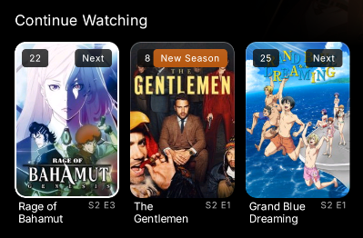
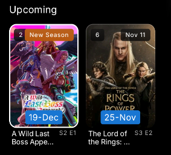
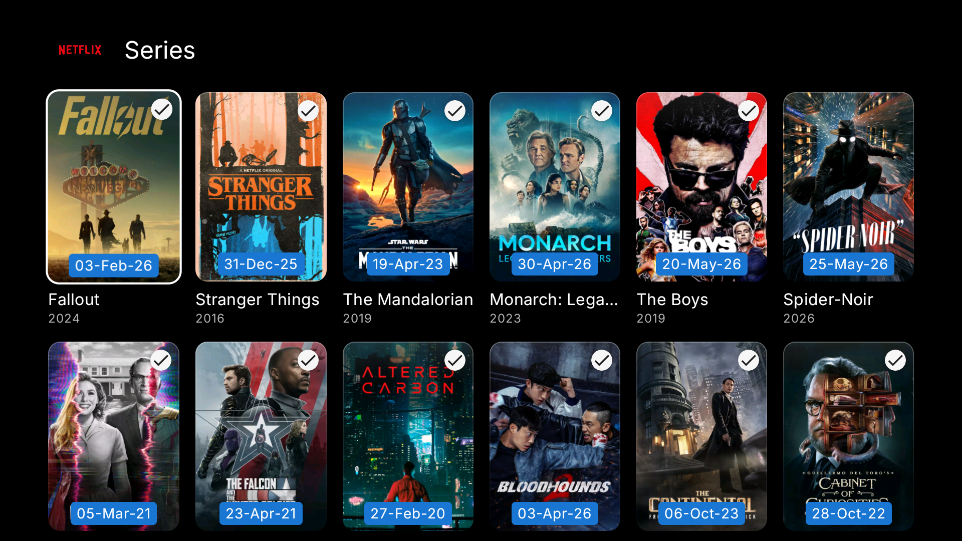
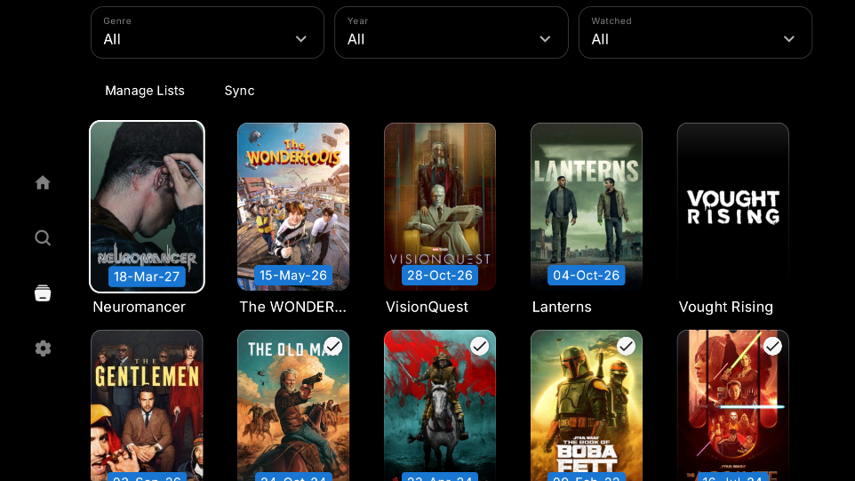
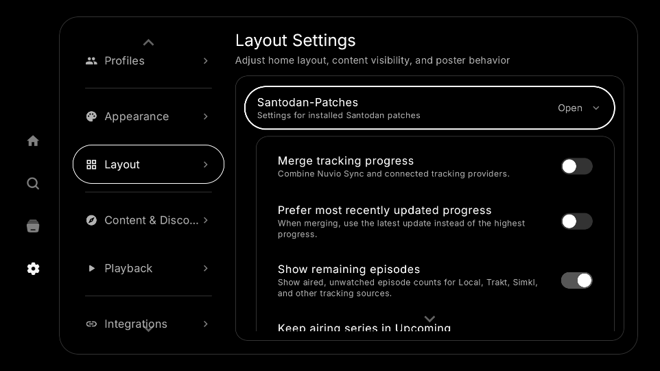

# Santodan Patches

Independent patches for the [Morphe](https://morphe.software/) patcher.

[Add Santodan Patches to Morphe](https://morphe.software/add-source?github=Santodan/santodan-patches), or add this source manually:

```text
https://github.com/Santodan/santodan-patches
```

## Patches

<!-- PATCHES_START -->
> **[v0.9.0](https://github.com/Santodan/santodan-patches/releases/tag/v0.9.0)**&nbsp;&nbsp;•&nbsp;&nbsp;`main`&nbsp;&nbsp;•&nbsp;&nbsp;15 patches total
<details>
<summary>📦 MEO (Android TV)&nbsp;&nbsp;•&nbsp;&nbsp;2 patches</summary>
<br>

MEO 5.7.0 patches provide a separately installable clone and compatibility handling for unverified Android TV hardware. The side-by-side patch renames the package, launcher label, task affinity, app-owned permission, and every provider authority. The device patch reports a Sagemcom DIW3930 during provisioning and skips only MEO's non-fatal equipment-verification warning; authentication and fatal provisioning errors remain unchanged.

**🎯 Supported versions:**

| 5.7.0 |
| :---: |

| 💊&nbsp;Patch | 📜&nbsp;Description | ⚙️&nbsp;Options |
|----------|----------------|-----------|
| [MEO - Side-by-side installation](#meo-side-by-side-installation) | Installs a separately named MEO clone using a configurable package name and app name. | • Package name<br>• App name |
| [MEO - Spoof supported device](#meo-spoof-supported-device) | Reports a Sagemcom DIW3930 to MEO provisioning and skips the server's non-blocking device-verification warning. |  |

</details>

<details>
<summary>📦 NuvioTV&nbsp;&nbsp;•&nbsp;&nbsp;8 patches</summary>
<br>

These are the available patches for NuvioTV:

### Continue Watching

- **Merge tracking progress**: Combines Nuvio Sync and connected tracking-provider progress and watched-show history, with a choice between highest progress and the most recent update. Library and collection Watched labels follow the selected provider for each show. Cached progress and watched history load without waiting for provider refresh; synchronization continues in the background. Incremental Watched badge updates process changed cached metadata and limit progress logging.

- **Remaining episodes in Continue Watching**: Adds a setting to show the number of aired, unwatched episodes on Continue Watching cards. Counting runs in the background for recently displayed cards and stops when disabled.<br>



- **Keep airing series in Upcoming**: Adds a setting to keep series in the separate Upcoming row until their latest scheduled episode airs, with a finale-date badge.<br>



### UI

- **Finale dates in library and collections**: Adds separate settings to show the latest scheduled episode date on library and collection posters in `dd-MMM-yy` format.

| Collections | Library |
| -- | -- |
|  |  |

- **Upcoming movie dates in library and collections**: Adds two independent, disabled-by-default switches under **UI** to show known release dates on unreleased movie posters in `dd-MMM-yy` format. Dates come from the poster metadata, with a background catalog lookup when an exact date is missing. Already released movies and unknown dates have no badge. Movies with a past release year skip unnecessary catalog requests; current/future years still need an exact date.

### Streams

- **Preload streams in Continue Watching**: Searches sources in the background for visible, playable episodes and movies, so opening playback can reuse the search results.

- **Preload streams on detail page**: Searches sources for the current Play or Resume movie or episode, following changes to the next episode on the detail page.

### Installation

- **Side-by-side installation**: Lets you choose a different package name and launcher name so the patched app can coexist with the official app.

On NuvioTV **1.1.0-beta.4 and beta.5**, patch settings are under **Layout > Santodan-Patches**, grouped under **Continue Watching**, **UI**, and **Streams** labels. Labels appear only for installed patch groups. Airing-series, finale-date, upcoming-movie-date, and stream-preloading patches support beta.4 and beta.5; merged progress, remaining episodes, and side-by-side installation also support beta.2. Package and launcher names are configured when patching the APK.

The two **Streams** switches are independent and disabled by default. Preloading uses Nuvio's native search cache and installed addons/plugins, with bounded background work. It pauses new preloads while native playback pauses source searches. Source results retain Nuvio's profile/configuration checks and cache expiration; media playback begins when you press Play.

Include `"SantodanMovieRelease:V"` for movie-date diagnostics. Toggle messages identify the library or collections setting; routine settings recompositions stay silent.

Include `"SantodanStreams:V"` in your logcat filters to see preload starts, completion times, source counts, and timeout/cancellation events. Repeated composition hits stay silent, and diagnostics omit stream URLs and redact custom video IDs.



**🎯 Supported versions:**

| 1.1.0-beta.4 | 1.1.0-beta.5 |
| :---: | :---: |

| 💊&nbsp;Patch | 📜&nbsp;Description | ⚙️&nbsp;Options |
|----------|----------------|-----------|
| [NuvioTV - Finale dates in library and collections](#nuviotv-finale-dates-in-library-and-collections) | Adds separate disabled-by-default settings to show the latest scheduled episode date in library and collection posters. |  |
| [NuvioTV - Keep airing series in Upcoming](#nuviotv-keep-airing-series-in-upcoming) | Adds a disabled-by-default setting that keeps currently-airing library series in Upcoming until the scheduled finale. |  |
| [NuvioTV - Merge tracking progress](#nuviotv-merge-tracking-progress) | Merges Nuvio Sync and connected tracking-provider progress, preserving the previous snapshot while providers refresh. |  |
| [NuvioTV - Preload streams in Continue Watching](#nuviotv-preload-streams-in-continue-watching) | Adds an opt-in Streams setting to search sources in the background for visible Continue Watching episodes and movies, reusing Nuvio's native search cache. |  |
| [NuvioTV - Preload streams on detail page](#nuviotv-preload-streams-on-detail-page) | Adds an opt-in Streams setting to search sources for the detail page's Play or Resume episode or movie, reusing Nuvio's native search cache. |  |
| [NuvioTV - Remaining episodes in Continue Watching](#nuviotv-remaining-episodes-in-continue-watching) | Adds a disabled-by-default setting that displays aired, unwatched episode counts for every tracking integration. Controlled by Layout > Santodan-Patches on beta4 and beta5. |  |
| [NuvioTV - Side-by-side installation](#nuviotv-side-by-side-installation) | Installs a separately named NuvioTV clone using a configurable package name and app name. | • Package name<br>• App name |
| [NuvioTV - Upcoming movie dates in library and collections](#nuviotv-upcoming-movie-dates-in-library-and-collections) | Adds separate disabled-by-default settings to show known release dates on unreleased movie posters in library and collections. |  |

</details>

<details>
<summary>📦 Peafowl Theme Maker for EMUI&nbsp;&nbsp;•&nbsp;&nbsp;1 patch</summary>
<br>

**🎯 Supported versions:**

| GMS_27.5.1 |
| :---: |

| 💊&nbsp;Patch | 📜&nbsp;Description | ⚙️&nbsp;Options |
|----------|----------------|-----------|
| [Peafowl - Unlock Theme Ownership (Experimental)](#peafowl-unlock-theme-ownership-experimental) | Use Peafowl's local free-theme path without the billing preflight. Experimental; server downloads are not guaranteed. |  |

</details>

<details>
<summary>📦 Pillo&nbsp;&nbsp;•&nbsp;&nbsp;1 patch</summary>
<br>

Pillo's hybrid notification patch supports both 0.6.19 and 0.6.20. In Pillo's Banner/Light mode, it keeps fullscreen alarms while the device is locked and uses banner notifications while the device is unlocked.

**🎯 Supported versions:**

| 0.6.20 | 0.6.19 |
| :---: | :---: |

| 💊&nbsp;Patch | 📜&nbsp;Description | ⚙️&nbsp;Options |
|----------|----------------|-----------|
| [Pillo - Hybrid Lock-Screen Notifications](#pillo-hybrid-lock-screen-notifications) | Use fullscreen alarms while the phone is locked and banner notifications while it is unlocked. Select Pillo's Banner/Light notification mode. |  |

</details>

<details>
<summary>📦 Reddit&nbsp;&nbsp;•&nbsp;&nbsp;3 patches</summary>
<br>

**🎯 Supported versions:**

| 2026.37.0 |
| :---: |

| 💊&nbsp;Patch | 📜&nbsp;Description | ⚙️&nbsp;Options |
|----------|----------------|-----------|
| [Reddit - Content filters (Experimental)](#reddit-content-filters-experimental) | Adds keyword and per-community flair filters under Morphe > Filters. Home-feed flair filtering requires Show flairs in home feed, which is installed automatically. |  |
| [Reddit - Show flairs in home feed (Experimental)](#reddit-show-flairs-in-home-feed-experimental) | Shows native post flair badges below titles in the home feed, including cached and joined-community posts. Controlled by Morphe > Layout. |  |
| [Reddit - Start as guest](#reddit-start-as-guest) | Skips the forced startup login screen using Reddit's native browse-logged-out action. Login remains available from the account menu. Already included upstream in Morphe Patches PR #3109: https://github.com/MorpheApp/morphe-patches/pull/3109 |  |

</details>

<!-- PATCHES_END -->

## Building

This repository uses the official Morphe Gradle plugin and release layout. GitHub credentials with package-read access must be available as `GITHUB_ACTOR` and `GITHUB_TOKEN` for local builds.

For local Windows builds, copy `.env.example` to the ignored `.env` file, insert a GitHub token with `read:packages` access, and run:

```powershell
.\build-local.ps1
```

On Windows, if you use the `.env` file, run the wrapper through `build-local.ps1` so the GitHub package credentials are loaded:

```powershell
.\build-local.ps1 :patches:buildAndroid
.\build-local.ps1 :patches:generatePatchesList
```

You can run `gradlew.bat` directly only when `GITHUB_ACTOR` and `GITHUB_TOKEN` (or the equivalent Gradle properties) are already set in that terminal.

On Linux or macOS:

```bash
./gradlew :patches:buildAndroid
./gradlew :patches:generatePatchesList
```

The generated bundle is written to `patches/build/libs/patches-<version>.mpp`. `patches-list.json`, `patches-bundle.json`, and the generated section of this README are release-owned files and should not be edited manually. App introductions are maintained in `.github/readme-apps/<packageName>.md` and included inside the collapsed app sections by the README generator.

## Patch targets

| App | Package | Supported version | Patch |
| --- | --- | --- | --- |
| MEO (Android TV) | `com.alticelabs.meo.androidtv` | `5.7.0` | Side-by-side installation; Spoof supported device |
| NuvioTV | `com.nuvio.tv` | `1.1.0-beta.2`, `1.1.0-beta.4`, `1.1.0-beta.5` | Merge tracking progress; Remaining episodes in Continue Watching; Side-by-side installation |
| NuvioTV | `com.nuvio.tv` | `1.1.0-beta.4`, `1.1.0-beta.5` | Keep airing series in Upcoming; Finale dates in library and collections; Preload streams in Continue Watching; Preload streams on detail page |
| Reddit | `com.reddit.frontpage` | `2026.37.0` | Content filters (Experimental); Show flairs in home feed (Experimental); Start as guest |
| Peafowl Theme Maker for EMUI | `h7.hamzio.emuithemeotg` | `GMS_27.5.1` | Unlock Theme Ownership (Experimental) |
| Pillo | `xyz.rtrvr.pillo` | `0.6.19`, `0.6.20` | Hybrid Lock-Screen Notifications |

See [AI_Guide.md](AI_Guide.md) for implementation details and device-testing notes.
