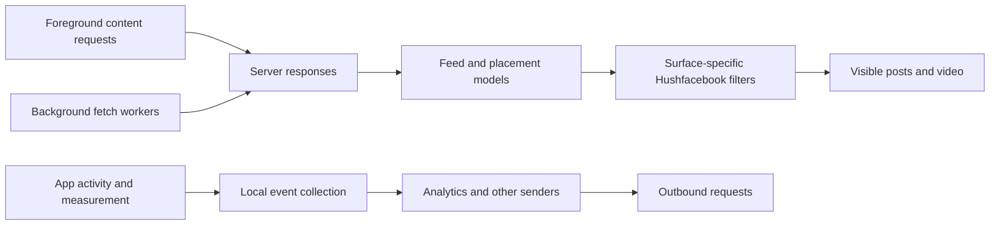

# Contributing

Bug reports, fixes for a new Facebook build, new patches and pull requests are all welcome.

Not sure it's a bug, or just have a question? Start in [Discussions](https://github.com/SysAdminDoc/Hushfacebook/discussions). If it turns out to be a bug, it moves to an issue from there.

If you open an issue, include:

- the Facebook version and variant you patched (APKMirror names the variant, for example arm64-v8a, Android 11+)
- the Morphe Manager version and the Hushfacebook version
- the patches you selected
- what you expected and what happened, with steps to get there
- a diagnostic report or screenshots if it's visual or a crash. Remove private messages and account details from screenshots first.

GitHub doesn't let the person who opened an issue reopen it once a maintainer closes it, so a closing comment always says how to get it reopened: comment there and we'll reopen it.

## What this repository produces

Hushfacebook is a Morphe patch source for Facebook's Android app, package `com.facebook.katana`. It publishes a `.mpp` bundle for Morphe Manager. The bundle contains patch definitions and extension code, not Facebook's source or a ready-to-install Facebook APK. Manager starts from Facebook's original APKM, applies the selected patches and signs the result with its existing key. Keep that key when updating the installed copy.

The current declared target is Facebook 582.0.0.50.54 on Android 11 or newer. `AppCompatibilities.kt` holds its version codes and the Facebook signing certificates. It declares build 475417104 for arm64-v8a and 475417036 for armeabi-v7a. Fixtures for older builds can still help when tracing a rename, but the current catalog declares only 582. Read the README's unsupported-version section before promising that an undeclared build works, and rerun the full fixture check before changing that claim.

The v0.8.0 bundle uses Morphe patcher 1.15.1 and needs Morphe Manager 1.34.0 or newer. The Gradle wrapper, dependency pins, and verification data live under `gradle/`. The Morphe plugin version is in `settings.gradle.kts`. Keep those pins aligned when updating the patcher.

## Source map

| Path | What lives there |
|---|---|
| `patches/src/main/kotlin/app/morphe/patches/facebook/` | Morphe bytecode and resource patches, grouped by Facebook feature area. A `*Patch.kt` file defines a patch. Nearby `*Anchors.kt` and `Fingerprints.kt` files locate the code it changes. |
| `patches/src/main/kotlin/app/morphe/patches/shared/` | Compatibility metadata and patcher helpers shared by feature patches. |
| `patches/src/main/kotlin/app/morphe/util/` | DEX utilities, register allocation and liveness checks, catalog generation, and bundle identity checks. |
| `extensions/facebook/src/main/java/app/morphe/extension/facebook/` | Java code that runs inside Facebook, including the settings screen and the runtime side of enabled features. |
| `extensions/shared/library/src/main/java/app/morphe/extension/shared/` and `extensions/shared/library/src/main/l10n/` | Shared settings and preference types, translation tables, logging, diagnostics, and resource helpers. |
| `extensions/facebook/src/main/AndroidManifest.xml` | A minimal extension manifest. Feature patches add any Facebook manifest changes they need. |
| `patches/src/test/kotlin/` | Patch structure tests and fixture tests that inspect real Facebook DEX. |
| `extensions/facebook/src/test/` | Runtime tests. Android resources are enabled for these tests. |
| `patches-list.json` | Generated patch catalog consumed by Morphe Manager. Regenerate it from the bundle instead of editing it by hand. |
| `patches-bundle.json` | Published bundle index read by the add-source link and release flow. |
| `settings.gradle.kts`, `gradle/libs.versions.toml`, and `gradle/verification-metadata.xml` | Morphe plugin setup, dependency pins, and dependency verification. `gradle.properties` holds the patch bundle version and Gradle memory settings. |
| `sources/facebook-sources.json` and `docs/sources.md` | Patch provenance, upstream ideas, and source research. |
| `provenance.json` and `NOTICE` | Per-file origin and license notices carried into the patch bundle. `ProvenanceTest` checks the source headers against this record. |
| `scripts/` and `fixtures/` | Build, compatibility, release, and device helpers. The Facebook APK and APKM fixtures are local inputs and are not committed. |

Patch folders follow implementation areas. Morphe's visible categories come from each patch's `category()` declaration, so one category can draw patches from several folders. In v0.8.0 the release notes count 85 user-facing features. The generated 86-row catalog also includes the required `Hushfacebook settings` patch.

Patch and runtime directories are grouped by behavior. Their names don't always match, so start from the Morphe patch declaration and follow its injected extension class, status method, or setting key into Java.

| Patch area under `patches/.../facebook/` | Runtime area under `extensions/.../facebook/` | Typical work |
|---|---|---|
| `ads/` | `ads/` | Ad surfaces, background ad requests, and telemetry. |
| `feed/` | `feed/`, `stories/` | Feed units, post filters, story trays, and feed refresh. |
| `reels/` | `reels/` | Reel controls, prompts, and viewer cleanup. |
| `downloads/` | `download/` | Media source selection, saving, file naming, and conversion. |
| `media/` | `media/` | Playback quality, resume, picture-in-picture, and HDR. |
| `navigation/` | `navigation/` | Tabs, badges, start location, and tab filtering. |
| `chats/` | `chats/` | Read receipts, typing, and chat media. |
| `comments/`, `composer/` | `comments/`, `composer/` | Comment sheets, ordering, and tag suggestions. |
| `layout/theme/`, `font/`, `emoji/` | `theme/`, `font/`, `emoji/` | Colors, text, and emoji rendering. |
| `menu/` | `menu/` | Menu rows and sections. |
| `notifications/`, `updates/` | `notifications/`, `updates/` | Promotional notifications and Facebook or Hushfacebook update prompts. |
| `search/` | `search/` | Search results and Meta AI surfaces. |
| `misc/` | `misc/`, `settings/`, `coexist/` | Startup, settings, app links, screenshots, diagnostics, and compatibility with Meta apps. |

The full patch paths start at `patches/src/main/kotlin/app/morphe/patches/facebook/`. The full runtime path starts at `extensions/facebook/src/main/java/app/morphe/extension/facebook/`.

## How a patch reaches Facebook

Morphe reads the generated catalog, resolves each selected patch's dependencies, and applies bytecode or resource changes to the chosen Facebook build. Extension patches add the Java payloads to the rebuilt APK. `facebookExtensionPatch` brings in the shared and Facebook extensions and gives them the application context early in Facebook startup.

The `Hushfacebook settings` patch is the entry point for the in-app settings page. It adds no activity or provider to Facebook's manifest. The screen opens from a long press on the Facebook logo at the top of Home or from the shortcut on Facebook's launcher icon. At build time, each selected feature rewrites its `SettingsStatus` method from `false` to `true`. The screen uses those methods to show only controls the APK contains. Saved switch values use the shared setting classes under `extensions/shared/library/`.

The settings page sections are Opening Facebook, News feed, Stories, Reels and Watch, Playback, Downloads, Writing, Chats, Menu, Search, Marketplace, Notifications, Links, Privacy, Updates, Appearance, Set when you patched, Pause, backup and diagnostics, and About. `SettingsNavigation` orders and links the sections. `FeedPages`, `VideoPages`, `AppPages`, and `HushfacebookPages` build their rows. A section checks `PatchFamily` before adding feature controls, so a build without a patch doesn't show a dead switch. If a control is missing, trace its patch selection, generated `SettingsStatus` method, `PatchFamily` entry, and page builder in that order.

Patch presence, a saved switch value, and global Pause are separate states. `SettingsStatus` records which code is in the APK, typed setting classes store the user's choices, and `HushfacebookPause` is the runtime-wide gate. The extension sets its application context before Facebook startup. `SettingsPatch` registers its lifecycle work after Facebook's application startup and at the main activity's create and new-intent entry points. `SettingsEntry` coordinates the runtime extensions from those callbacks. Pause is decided once per process. It can come from the Pause setting, a marker file in Facebook's external app folder, or safe mode after three consecutive starts that crash within one minute. Pausing doesn't erase saved feature switches. `SettingsBackup` exports and imports settings, using `SettingsJson` for bounded JSON parsing. Translated strings live in TSV tables and are generated by `scripts/gen-l10n.py`.

Most runtime features need the patch selected and their setting on. The Pause control gates runtime behavior separately. It does not undo bytecode or resource changes already installed, and patches that change colors or other build-time resources stay in place while paused.

Patch success has two separate checks. A successful apply shows that the patch found its targets and produced an APK. It doesn't show that Facebook served the screen or content the hook expects. Runtime hooks report missing, ambiguous, or thrown states through `HookStatus`, and `scripts/phone-smoke.ps1` checks those reports while opening common screens.

## Adding or changing a patch

Start from the stock Facebook build that the patch should support. Facebook renames much of its code between releases, so an obfuscated class name from one APK is not a reliable anchor for the next one.

1. Put the patch under the closest feature family in `patches/src/main/kotlin/app/morphe/patches/facebook/`. Define its user-facing name, description, category, default selection, compatibility, options, and dependencies in the Morphe patch declaration. The generated catalog takes these fields from the declaration.
2. Locate the target with evidence that survives obfuscation, such as a kept API, a distinctive trace string, a call shape, or a fingerprint built from more than one signal. Keep the search in an adjacent anchor or fingerprint file when it needs its own tests. If the target is missing or ambiguous, fail with a `PatchException` that names what the build could not resolve.
3. Put behavior that must run after installation in `extensions/facebook/`. For a settings switch, wire the patch's `enableStatus` value to a method in `SettingsStatus`, register its family in `PatchFamily`, add the preference to the appropriate `*Pages` builder, and define its switch label in `SwitchLabels` when it uses a standard row. Store the user's choice through the setting classes. Keep the patch name, family, status method, setting key, row, and translations aligned. `PatchStatusWiringTest` and the runtime family tests cover those links.
4. Use `dependsOn` for required hooks and shared payloads. If two visible patches need the same hook, put that hook in one internal patch and depend on it from both, so it is inserted once. `ShareSheetHookPatch.kt` and `ShareSheetItemsPatch.kt` are a small example.
5. Add a focused patch test. `PatchContexts` runs a patch against a small in-memory DEX class pool. `Fixtures` and `FixtureDex` inspect the real Facebook builds named by `HUSHFACEBOOK_FIXTURE_DIR`. Runtime behavior belongs in `extensions/facebook/src/test/java/`, close to its extension code.
6. Regenerate `patches-list.json`, then run the relevant fixture and extension checks. Update the README patch table, CHANGELOG, and release facts when a user-visible name, description, option, default, category, or target changes.

For DEX edits, check the utilities in `patches/src/main/kotlin/app/morphe/util/` before writing register numbers by hand. `FreeRegisterProvider` and `RegisterLiveness` help keep injected instructions from overwriting values Facebook still needs. The register tests and `scripts/test-injected-registers.ps1` catch invalid injected code. Resource changes need a resource fixture check as well, since APKM bundles can hold resources in splits that a merged base APK does not show.

## Inspecting stock Facebook

Install the original signed APKM in a fresh test profile and don't add the Hushfacebook `.mpp` bundle. Check the package, version code, ABI, density split, and signer before comparing screenshots or behavior. This separates Facebook's own screens from injected settings and hooks. APKM files contain several splits, so install a device-matching set rather than only `base.apk`.

The stock 581 arm64 build is package `com.facebook.katana`, version `581.0.0.45.58`, version code 475215365, minimum Android API 30, and target API 36. The arm64 base APK's Meta signing certificate has SHA-256 fingerprint `911d604446084ca7f4760b775bfc160fa8702441240a7258645d7a72c4312d27`. AppCompatibilities also records its older rotated certificate. The matching armeabi-v7a build is version code 475215364. An x86_64 emulator without ARMv7 translation can't install the 32-bit bundle. Use the arm64 bundle on a profile that exposes arm64-v8a, and choose the density split nearest the emulator's display density.

On a clean Android 16 profile with the stock arm64 build installed, Facebook opened to its unauthenticated welcome screen. It defaulted to English (US), showed the title “Join Facebook,” a short description, and the actions “Get started” and “I already have a profile.” The existing-profile action opened a login page with mobile-number-or-email and password fields, “Log in,” “Forgot password?,” and “Create new account.”

Android reported `com.facebook.bloks.facebook.loggedout.FbExperimentalLoggedOutBloksActivity` as the resumed activity on both the welcome and login pages. This is separate from `com.facebook.katana.activity.FbMainTabActivity`, the main tab activity the settings patch hooks after login. Keep logged-out navigation evidence separate from authenticated Home and tab behavior.

“Get started” opened account creation. Its first page asked “What's your name?” and requested a first and last name. Before showing that page, Android asked whether Facebook could access contacts. Contacts access was denied on the empty test profile, and the survey stopped before entering personal information or creating an account. The page also had a “Find my account” action.

These screens confirm the stock package launches, but they don't show the signed-in feed, comments, Reels, Marketplace, profiles, or account settings. Those surfaces need a signed-in test account. Don't treat the pre-login screen as evidence for them. The local APKM files are Meta's vendor binaries used for development, not Facebook source.

## Facebook 581 ads, tracking, and promotion surfaces

This section separates three kinds of evidence: the stock APK's manifest and model names, the code Hushfacebook changes, and Meta's public description of its ad system. It doesn't treat a manifest permission as proof that the app called an API or sent a particular event.

### How Facebook supplies ads

Meta describes Reels ad delivery as a dynamic auction that considers advertiser targeting and the value an ad may deliver. Its U.S. privacy notice says Meta can use activity on its products, device and app information, and partner data for uses that include advertising. Those are company-level descriptions, not a capture of the requests made by Facebook 581. See [Meta's Reels ads overview](https://www.facebook.com/business/ads/facebook-instagram-reels-ads), [Meta's U.S. Privacy Notice](https://www.facebook.com/privacy/policies/uso/), and [Accounts Center](https://www.facebook.com/help/943858526073065).

In the Facebook 581 source that ships in the local fixture, sponsored posts arrive alongside regular server content. Models and page responses carry ad categories, roles, or sponsored data. Hushfacebook usually filters a row before Facebook draws it. That can make the screen cleaner, but it doesn't prove the request was never made, the auction didn't run, or Meta received no event about the ad.



This is a map of code boundaries. It isn't a decoded traffic trace. Request gates act before selected requests, surface filters act on models or components, and upload gates act on selected senders. The table below names the exceptions and the exact patch files. A blocked row and a blocked upload are different measurements.

### Ad routes and patch coverage

Path key: `P/` is `patches/src/main/kotlin/app/morphe/patches/facebook/`. `F/` is `extensions/facebook/src/main/java/app/morphe/extension/facebook/`. Paths in this table are relative to the repository root.

| Surface | Facebook's route | Hushfacebook's hook and boundary |
|---|---|---|
| News feed | Feed edges carry categories such as SPONSORED and PROMOTION. Engagement quick promotions, multi-ad units, and suggested or promoted rows have separate model types or story fields. | Hide sponsored posts (`P/ads/sponsoredposts/HideSponsoredPostsPatch.kt`) and Hide suggested and promoted posts (`P/feed/suggested/HideSuggestedPostsPatch.kt`) share the collection guard in `F/feed/FeedFilter.java`. The patch hooks the feed collection point once and the runtime class decides whether to keep each edge. A removed edge leaves no blank row. This is a display filter, not a general ad-request blocker. |
| Profile and Page timelines | Sponsored timeline stories expose sponsored_data on their GraphQL story. | Hide sponsored profile posts asks that field before Facebook builds the row. The feed, the person's own posts, and other profile rows use separate paths. See `P/ads/sponsoredprofile/ProfilePostAnchors.kt` and `F/ads/ProfileAdFilter.java`. |
| Search | Search results are modules. Facebook assigns module roles, including ad roles, before it builds the results page. | Hide sponsored search results filters only ad modules from the page constructor's module list. Search tabs, filters, and normal modules stay. See `P/ads/sponsoredsearch/SearchResultAnchors.kt` and `F/ads/SearchAdFilter.java`. |
| Story viewer | Several data sources can insert ad cards. One source can fetch after the viewer opens, which can make an ad appear only during that session. | Hide sponsored stories makes each of four sources return the empty-list answer Facebook uses when a source has nothing to add. It doesn't depend on an obfuscated numeric list type. See `P/ads/sponsoredstories/HideSponsoredStoriesPatch.kt` and `P/ads/sponsoredstories/Fingerprints.kt`. Background Story ad downloads are a separate patch. |
| Reels and Watch | Reels ads can arrive inside a fetched page, in an ad-pool slot, in a section's item list, as a mid-roll break, or as an overlay on a video. The Reels page and its section each hold lists the screen reads. | Hide sponsored reels filters at the page and section boundaries, at the newer one-item insert path, and before the ad pool returns an item. It also blocks the extended ad-break fetch and ad overlay checks. This multi-level coverage exists because removing an item from a later listener notification did not remove it from the list the player actually displayed. See `P/ads/sponsoredreels/HideSponsoredReelsPatch.kt`, `P/ads/sponsoredreels/Fingerprints.kt`, `F/ads/ReelsAdFilter.java`, and `F/reels/ReelSections.java`. |
| Marketplace feed and detail pages | Marketplace uses React Native requests with Relay tracking names. Some requests fetch only ads. Other requests can ask the server to skip ad slots. Product-detail pages have their own related-ad queries. | Hide sponsored Marketplace listings can set the feed query's ad-skip variables, decline known ads-only queries, remove sponsored stories from streamed responses before JavaScript receives them, and prevent Marketplace video-ad components from drawing. Organic listings stay. New query names or renamed response fields need fixture or signed-in evidence before they can be added safely. See `F/ads/MarketplaceAdFilter.java`, `F/ads/MarketplaceSearchAds.java`, `P/ads/sponsoredmarketplace/MarketplaceRequestAnchors.kt`, and `P/ads/sponsoredmarketplace/MarketplaceResponseAnchors.kt`. |
| Affiliate and shop cards | Product cards can come from creator storefronts, tagged products, affiliate links, Shop now actions, or comment plugins. They aren't all marked as sponsored posts. | Hide affiliate product links filters these cards separately from sponsored posts. The 581 implementation covers four paths, including the Shop now overlay above a Reel creator's name. Issue #89 reported that overlay after 0.7.2. A fix shipped in 0.8.0, but the issue is still open for the reporter's confirmation. See `P/ads/affiliate/HideAffiliateLinksPatch.kt` and `F/ads/AffiliateLinks.java`. |
| Instant Games | A game asks the Facebook bridge for an ad through a web message and expects a promise response. | Block Instant Games ads answers the bridge as Facebook does when no ad is available. A separate setting can count a blocked rewarded ad as watched. The bridge response may affect how the game grants rewards. See `P/ads/games/BlockInstantGamesAdsPatch.kt`, `P/ads/games/GameAdAnchors.kt`, and `F/ads/GameAds.java`. |
| Other apps using Audience Network | Facebook exposes `com.facebook.ads.internal.ipc.AudienceNetworkRemoteService`, `AudienceNetworkRemoteActivity`, `AudienceNetworkExportedActivity`, `com.facebook.ads.AudienceNetworkActivity`, and `com.facebook.audiencenetwork.AudienceNetworkService`. Apps using the SDK can bind to the service or launch its activities. The remote components use the separate `:adnw` process. | Disable Audience Network changes the matching manifest components to `android:enabled=false`. It prevents those Facebook entry points from serving ads to other apps. It doesn't disable other apps' own ad SDKs. Some rewarded ads in those apps may stop working. See `P/ads/audiencenetwork/DisableAudienceNetworkPatch.kt` and its manifest tests. |
| Background ad work | WorkManager jobs schedule feed, emerging-surface, Reels and Story prefetch, cached-ad checks, and an ad-ranking model download. | Block background ad prefetch disables the schedulers. Work already queued by an earlier install can remain in WorkManager, and the patch doesn't block foreground requests or every background network call. It has no runtime switch. See `P/ads/prefetch/BlockAdPrefetchPatch.kt`. |

Marketplace's request boundary is unusually clear. Relay posts form-encoded GraphQL bodies with JSON `variables` and a tracking name prefixed `RelayFBNetwork_`. The feed can set `shouldSkipAdRequest` and `shouldSkipBoostedListingAdRequest`. Four ads-only feed names are retained for the 577 and 580 routes: `MarketplaceHomeFeedAdsQueryRendererQuery`, `MarketplaceHomeFeedAdsPaginationQuery`, `MarketplaceHomeFeedBoostedListingAdsQuery`, and `MarketplaceHomeFeedBoostedListingAdsPaginationQuery`. Don't assume those older names describe every 581 route. On 581, the implementation notes record ad stories in `MarketplaceProductDetailsPageRelatedAdsDetailQuery` and `MarketplacePDPBoostedListingAdsQuery`, with `MarketplacePDPPersonalizedAdsQuery` as a fallback. The first two query names live in compressed JavaScript and have no fixture, so they deserve a stable device capture or fixture before their anchors change. The debug-only observer in `F/ads/MarketplaceResponseDiagnostics.java` records only a fixed list of query, model, and field names. Arbitrary keys and scalar values are omitted.

The ad filters are separate by surface. Most visible filters have an independent switch in Hushfacebook settings, so turning off sponsored posts doesn't restore sponsored Stories or Marketplace listings. Block background ad prefetch, Block ad telemetry, and Disable Audience Network have no runtime switch. To restore one of those paths, leave that patch out when building the next APK.

### Tracking and privacy boundaries

The clean Facebook 581 arm64 base APK declares `com.google.android.gms.permission.AD_ID`, `android.permission.ACCESS_ADSERVICES_AD_ID`, `android.permission.ACCESS_ADSERVICES_CUSTOM_AUDIENCE`, `android.permission.ACCESS_ADSERVICES_TOPICS`, and `android.permission.ACCESS_ADSERVICES_ATTRIBUTION`. It also declares the screen-capture and screen-recording detection permissions. These declarations show available integrations. They don't establish that each API is called, which identifiers are read, whether the result is sent, or which server events are stored.

A bounded instruction scan went further than the manifest. The [versioned ad API map](docs/audits/facebook-581-ad-api-map.json) records direct invoke sites, full prototypes and offsets against arm64 base SHA-256 `1e54332d5e9dd3daa942098148b3035897374f43f3684ce819a2ea39875f1aa6`.

| Integration | Static evidence in 581 arm64 | What remains unknown |
|---|---|---|
| Google advertising ID | `AdvertisingIdClient` and its `Info` class are defined in `classes5.dex`. The renamed `A00(Context): Info` accessor has ten callers outside that library class, across DEX 4, 5, 6, 16 and 18. Named callers include `AttributionIdProvider$Impl.doQueryGMSWithAttributionId` and `LatStatusJob.A00`. Nearby strings include the GMS identifier service, `limit_ad_tracking` and `gaid`. | Runtime calls, consent/config gates, returned values and downstream sends weren't measured. The public names `getAdvertisingIdInfo` and `getId` weren't retained, so searching only those names misses this path. |
| Privacy Sandbox source registration | In `classes5.dex`, `LX/7uL;->A01` directly invokes both `MeasurementManager.registerSource` overloads, one with `OutcomeReceiver` and one with `AdServicesOutcomeReceiver`. | The wrapper's runtime use, input source and consent checks need inspection. An invoke in the fixture doesn't prove an attribution source was registered during the survey. |
| Custom audiences | In `classes10.dex`, `TestPACustomAudienceAppJob.A00` invokes `CustomAudienceManager.joinCustomAudience`. It has a direct caller in `classes5.dex`, `LX/8Ku;->A2g(I)V`. Its strings include `test_custom_audience_` and `isRealAd=false`. | This is a wired test-style path. It isn't evidence of ordinary production audience enrollment on this account. |
| Other named Ad Services APIs | No named references were found for `AdIdManager.getAdId`, `TopicsManager.getTopics` or `MeasurementManager.registerTrigger` in this bounded scan. | Reflection, wrappers, native code and alternate implementations remain possible. Absence from this lookup doesn't establish absence of tracking. |

Obfuscated caller names and offsets above identify this exact fixture. Future patches should anchor on kept APIs and verified call shapes, then inspect the callers' gates and return handling. These findings narrow the investigation without making a runtime tracking claim.

The runtime audit below records network metadata and exact-UID traffic counters. It doesn't decrypt Facebook's requests. Obfuscated DEX makes package-name searches an incomplete way to inventory analytics SDKs, too. Exact identifiers inside requests, event payloads, and server retention remain unverified. This guide doesn't claim a complete tracker inventory.

Hushfacebook's ad-privacy patches cover specific code paths:

- `P/ads/telemetry/BlockAdTelemetryPatch.kt` disables `AdsScreenshotController`, `AdsScreenshotDetector`, `AppInstallTrackerScheduler`, and `AppInstallService` paths. It does not disable every analytics or ad event. `AdVisualQualityEngine`, `OcrPreprocessor`, and `PigeonFeedUnitSponsoredImpressionLogger` remain. The impression logger is deliberately left intact because making it report success without logging can cause a later duplicate report.
- `P/misc/analytics/HoldAnalyticsUploadsPatch.kt`, `P/misc/analytics/AnalyticsUploadAnchors.kt`, and `F/misc/AnalyticsUploads.java` implement a separate Privacy patch with a switch that starts off. When enabled, its hooks stop XAnalytics `kickOffUpload` or `resumeUploading` calls and prevent Papaya learning jobs from running. Facebook still collects events locally, and the XAnalytics buffer still flushes. Restart after changing the switch so the startup uploader state is reset. This patch doesn't intercept Facebook's normal content requests, every analytics sender, crash or trace uploads, push notifications, or third-party apps.
- `P/misc/screenshots/BlockScreenshotDetectionPatch.kt` is separate from ad telemetry. It suppresses Facebook's photo-library checks and supported Android screenshot or recording callbacks across more surfaces than ads. It does not remove the ad screenshot classes from Facebook.
- `P/reels/watchhistory/DontSendReelWatchHistoryPatch.kt` targets Facebook's Reels watch-history path. It doesn't stop Facebook recording other app activity such as feed impressions, searches, likes, or clicks.
- `P/misc/sharelinks/SanitizeSharingLinksPatch.kt` and `F/misc/LinkCleaner.java` clean links locally without contacting a filtering service. They remove reviewed tracking query keys such as `fbclid` and `mibextid` across hosts, plus Facebook-only keys such as `__tn__`, `__so__`, and numbered `__cft__[n]` or `__xts__[n]` on Facebook links. They deliberately keep route keys such as `story_fbid`, `id`, and `comment_id`, and keep `ref` values other than `ref=share` because some values change the destination or content. A cleaned link can still identify its post, story, comment, or destination.
- `P/misc/externalbrowser/OpenLinksExternallyPatch.kt` and `F/misc/ExternalBrowser.java` unwrap Facebook's outbound link shim and clean known tracking tags before sending the destination to another browser. Facebook and Meta login, checkout, and short-link hosts stay in Facebook's browser. If Android has no enabled browser that accepts the link, the patch leaves it in Facebook and reports that fallback. Issue #108's diagnostic showed ActivityNotFoundException, so it did not demonstrate a missing hook. The device had no browser handler for the intent.

The useful distinction is between less ad content on screen and less data sent to Meta. The placement filters mostly change rendering. The specific telemetry and history patches change selected send or record paths. None is a universal network filter or an account-wide opt-out. Meta's Ad Preferences and Accounts Center are where the account's ad preferences live.

### Annoyances and controls

| What feels noisy | Existing control | What to check |
|---|---|---|
| Sponsored cards in the feed, on profiles, in search, Stories, Reels, or Marketplace | The matching Hide sponsored patch for that surface | Check the selected patch and its switch separately. Use the diagnostics section's per-family counters when one format gets through. |
| Suggested friends, groups, stories, Vibes, or posts | Hide suggested and promoted posts, Hide suggested stories, and the relevant switches under News feed or Stories | Recommendations and sponsored ads can share a feed location but have different model types. Keep those rules separate so a new recommendation type doesn't hide ordinary posts. |
| Shopping prompts and product cards | Hide affiliate product links, plus Hide sponsored reels for sponsored video ads | A shop card can be present without the sponsored flag. Test creator storefront, tagged product, Shop now overlay, feed card, and comment plugin paths separately. |
| Menu and cross-app sales pitches | Hide Menu promotions and Hide Meta upsells | These cover different rows and surfaces. A Facebook update prompt is another path, handled by Stop update prompts. |
| Repeated account setup, birthday, memory, or trend notifications | Block promotional notifications under Notifications | It has separate notification-kind switches. Account setup reminders starts off. Issue #57 led to that control in 0.7.2. The report remains open without confirmation that the switch stopped the reporter's notices. |
| Mobile data banners, shipping listings, or follow prompts | These are not sponsored-ad filters | Marketplace shipping/local-pickup filtering is tracked by Discussion #31 and the Marketplace acceptance gate. The Data mode banner is tracked by issue #70. Issue #107 asks for more control over Follow buttons. Clean up Reels already covers the Reel follow button, but not every post surface. |
| Facebook tracking clicks on shared or opened links | Sanitize sharing links and Open links in external browser | Check that Android has an enabled browser. A fallback to Facebook's own browser is expected when no other app can accept the link. |

### Patch opportunities

1. Follow the advertising-ID and Privacy Sandbox call sites mapped above through their consent/config gates and downstream senders. Runtime use is still unmeasured. If a call is active, find a narrow interception point and fixture coverage before changing it. Don't present the current telemetry patches as removing those identifiers.
2. Recheck impression measurement and ad visual-quality paths when studying ad telemetry. Keep the logger's return and retry semantics intact. The current patch comments explain why the obvious impression logger is unsafe to neuter.
3. Keep a versioned surface map for new server-delivered ad and promotion types. Use sanitized model names, categories, query tracking names, and counter reasons. Don't log post text, user IDs, ad IDs, or full GraphQL responses to diagnose a miss.
4. Consider a single user-facing ad controls map that links each surface to its existing switch. Keep placement hiding, background downloads, telemetry, and Audience Network distinct because they have different effects and currently different runtime controls.
5. Continue Marketplace work on shipping and local pickup as a separate listing preference. The current sponsored filter intentionally keeps ordinary listings and doesn't infer that a listing is an ad from its delivery fees.
6. Investigate the App icon screen described below for issue #109. The stock screen links its locked alternatives to Facebook Plus. The existing Messenger icon patch only changes where its top-bar button opens. Icon subscription jobs and rollback strings need inspection before assuming an alternate launcher icon will persist.

For every signed-in stock survey, record which surfaces actually served an ad, the exact label and placement, the Facebook version and account state, and whether the stock UI offered a hide or ad-preference action. A surface with no ad during the visit is unverified, not a pass. The ad route descriptions above come from the arm64 581 fixture and patch source. The following survey adds separate runtime evidence.

## Stock runtime audit, October 9, 2026

### Build identity and conditions

The signed-in survey used Meta's original Facebook 581.0.0.45.58, with no Hushfacebook bundle or injected settings. It ran on an Android 16/API 36 Pixel 7 emulator with two virtual CPUs and 2,560 MB of guest RAM. The emulator raised the requested 2,048 MB to that minimum, as confirmed by its launch log and generated hardware configuration. An existing account was used. Existing account settings and server experiments may influence these screens, so the observed choices aren't universal fresh-account defaults.

The original arm64 build, 475215365, reached login but repeatedly crashed after authentication on this x86_64 image. Native traces crossed `libndk_translation.so`. There was also a failed `bloks_gpu_query` initialization. Those attempts were excluded from normal-use measurements. The same Facebook release's native x86_64 variant, 475215367, then installed as a signed update and retained the login. The subsequent survey ran on that variant without those crashes. Switching vendor variants changes more than the ABI, so the exact cause remains unisolated. This does **not** establish arm64 patch compatibility.

| Input | Verified identity |
|---|---|
| Runtime package | `com.facebook.katana`, 581.0.0.45.58, code 475215367, `primaryCpuAbi=x86_64`, min API 28, target API 36 |
| Vendor archive | [APKPure version-specific XAPK](https://d.apkpure.net/b/XAPK/com.facebook.katana?versionCode=475215367), 99,249,853 bytes |
| Archive SHA-256 | `a14a6b5798acbb6b00aa9e2c8ec6642e7991bbcce81c128d66ae403ff2b20bd1` |
| Base APK SHA-256 | `8ea536c5c61f354fb38c78a2a41b9217eaa20b731e14b3ce1fcb012ad72f4c51` |
| Density split SHA-256 | `config.mdpi.apk`, `c6f9d60fec2f306b4e653efb6f94cbef950cbea9cd42d33cc9c675d0fceb0bff` |
| Signer | Both APKs passed `apksigner verify`. API 33+ signer SHA-256 `911d604446084ca7f4760b775bfc160fa8702441240a7258645d7a72c4312d27`, with the older Meta certificate in the rotation lineage |
| Permissions during survey | Notifications granted. Contacts, precise location, and image-library access denied. Location onboarding was skipped. |
| Code-layout difference | Native x86_64 variant has bootstrap `classes.dex` and `assets/secondary-program-dex-jars/store-0.dex.spo`. Don't feed it to arm64 fingerprints and assume equivalent DEX layout. |

The account's login-backup prompt was declined. Contacts and media permissions stayed denied, and no posting, messaging, following, joining, purchasing, or preference changes were performed. Raw captures, screenshots containing account content, UI dumps, and process logs stay local. The two screenshots linked here contain only generic settings controls.

### Screens and routes actually visited

The layout in this account used a left-side Menu button and a drawer. It didn't present the usual full tab row on Home. Feature routes and settings labels are better survey anchors than assuming a fixed tab position. The existing smoke helper also uses `fb://feed`, `fb://marketplace`, and `fb://fb_shorts/viewer`. All three opened their intended surfaces in this run.

| Surface or route | Observed stock behavior | What it means for patch work |
|---|---|---|
| Login and first-run prompts | Login opened a save-login-to-cloud-backup prompt, followed by a location explanation. The location page said IP information can still estimate general location when location services are off. | Location permission denial doesn't establish that location-related personalization stopped. Keep login/onboarding hooks separate from the main activity. |
| Home | Composer, suggested Stories, an informational card, ordinary posts and recommended group content appeared. A later feed pass also showed a row of Meta AI question pills below a photo. | Distinguish recommendation types from sponsored models. The question pills give `HideMetaAiQuestionsPatch.kt` and `MetaAiQuestions.java` a stock visual reference, but this run didn't exercise the patched filter. |
| Menu | Feeds, Marketplace, Reels, Groups and Meta AI shortcuts appeared. Upgrades and Also from Meta were separate sections. Settings and privacy contained App icon, Link history, Your Ad Activity, Device requests and other rows. | Menu cleanup needs section-aware matching. A settings-row upsell can sit outside the two promotion groups already filtered. |
| Composer, opened without entering content | Music, People, Location, Feeling/activity, Gallery, AI images, GIF, Life update and Live controls appeared. | Composer suggestions and buttons have distinct entry points. Opening the composer is not proof that upload or posting paths work. |
| Search entry | A recent-history section and a search field labelled Search with Meta AI appeared. No query was submitted. | Search-entry branding and results modules are separate targets. Sponsored search results remain unobserved. |
| Marketplace | For you and Local tabs, a More menu, shopping notifications, location control, and a two-column listing grid appeared. Two further scrolls were recorded. | A shipping recommendation can be a notification rather than a sponsored listing. Local preference, notification cleanup and ad filtering need separate acceptance checks. No seller was contacted and no listing detail was opened. |
| Reels | Seven viewer items were visited. The first showed a Follow button and an interest-feedback prompt. The menu offered playback speed, automatic next-reel scrolling, transcript, audio/language, saving, copying a link, reporting and a recommendation explanation. | Current Reels cleanup and playback controls address distinct stock surfaces. The source still needs separate checks for ad-pool inserts, mid-rolls, overlays and affiliate cards. |
| Settings > Content preferences | Political and sensitive content controls, Favorites, Snooze, Unfollow and Reconnect appeared. | Account ranking controls are different from local feed model filters. Their rows can be documented without changing the user's relationships or preferences. |
| Settings > Notifications | Categories covered comments, tags, reminders, activity, friend updates, requests, suggested people, birthdays, groups, Reels, events, Pages, Marketplace, fundraisers, voting reminders, messaging, memories and other notifications. Delivery channels were listed separately. | A patch filtering Android notifications doesn't change email or SMS preferences. Stock text also reserves important account/content notifications outside preferred settings. |
| Settings > Tab bar | Customize the bar and Manage notification dots were available, despite this account's drawer layout. | Preserve the distinction between tab selection, badges and the experiment that chooses the navigation layout. |
| Settings > Media | Optimized/Data saver, three feed-and-Story autoplay choices, reel auto-scroll, sound, 3D-photo motion, automatic sharing to Stories and in-app sound controls appeared. | Stock controls don't replace every Hushfacebook playback patch. The stock external-browser switch explicitly described links shared in messages, a narrower promise than all outbound links. |
| Accounts Center > Ad preferences | Customize ads and Manage info were separate tabs. Manage info exposed profile categories, activity from other businesses, audience-based advertising, ads in other apps and ads about Meta elsewhere. | Keep these account controls distinct from APK hooks. The recent-ad area was empty in this visit. Its state doesn't establish that no ad requests occurred. |

The initial survey sampled Home's first view and four further scrolls, three Marketplace views and seven Reels items. After the measured windows, a separate pass sampled 25 feed viewports and 20 more Reels viewports. UI labels were inspected at each step, with periodic screenshots checked visually. No Sponsored or Paid partnership label was confirmed. These are viewports, not a deduplicated count of posts or videos, and labels outside the sampled viewport or absent from the accessibility tree can be missed.

The absence of a confirmed label is a coverage limit, not evidence that stock Facebook is ad-free. Stories playback, profile/Page ads, search-result ads, Marketplace detail ads, Instant Games, Audience Network integration with another app, and actual notification delivery remain runtime gaps. A notification category being listed is not a delivered-notification test. The extra ad-sampling pass is excluded from the three measured intervals below.

### Privacy and customization targets found in the stock UI

**Browser settings.** Settings > Browser exposed Enhanced browsing, cookies/cache clearing, contact/payment autofill and a CVV-save control. The disclosure ties Enhanced browsing to link history and shopping recommendations and says information from those features can affect ads. A separate disclosure ties autofill activity to ads and other personalization. The Enhanced browsing switch appeared unchecked and disabled in this capture. That UI state alone is not evidence of a server opt-out or of no history collection. See the [stock browser settings screenshot](docs/images/stock-581-browser-settings.png).

The arm64 fixture contains `IABEnhancedBrowsingSettingsQuery`, `IABEnhancedBrowsingSettingsMutation`, `are_all_features_enabled`, and `getEnhancedBrowsingConfig` in `classes16.dex`. It also contains named `LinkHistorySignalsWriter` and `LinkHistoryUiDataWriter` classes. The preference path `in_app_browser/enhanced_browsing_settings/are_all_features_enabled` appears in `classes4.dex`, and the name string `EnhancedBrowsingSettingsNetworkDataSource` in `classes15.dex`. That name is not a preserved class descriptor. These are search candidates, not verified hook methods. Follow the setting read, network mutation, and writer callers before proposing a narrow gate. `OpenLinksExternallyPatch.kt` redirects browser activity entry points. It doesn't enforce this setting or intercept these writers. Its Meta-page exclusions and no-handler fallback still matter.

**Camera-roll suggestions.** Settings > Camera roll sharing suggestions distinguished suggestions based on local media metadata from cloud processing. The page said granting media access enables ordinary suggestions, while cloud processing stays a separate opt-in. Its cloud-processing explanation described selecting and uploading media over time, including analysis of media and facial features. Both controls were disabled because the test profile had no media-library permission. No camera-roll upload was exercised or attributed in this audit.

The arm64 fixture has `CameraRollPrivacySettingsQuery` in `classes5.dex` and the name string `CameraRollPrivacySettingsUtil` plus `camera_roll_privacy_settings_query_failure` in `classes11.dex`. The named Util callback is defined in `classes14.dex`. `MediaUploadHelper`, `SecondaryUploadHelper` and `VistaOptionalMediaProcessingWorker` are defined in `classes17.dex`, with names referring to photo uploads, video metadata and inference/upload work. `UploadStreamWorker` is defined in `classes5.dex`. Its `doWork` continuation is in `classes17.dex`. Inspect consent checks and callers first. A useful new control would need to hold optional suggestion processing while keeping explicit photo selection and posting intact. `Hold back analytics uploads` gates XAnalytics and Papaya. It doesn't claim to block this media pipeline.

**App icons and Facebook Plus.** Menu > Settings and privacy > App icon showed the normal blue icon and six locked alternatives. Opening the information control on a locked tile displayed a Facebook Plus promotion. No icon was saved and no subscription was purchased. The [stock icon screen](docs/images/stock-581-app-icons.png) gives issue #109 a reproducible entry point.

Candidate arm64 anchors include `com.facebook.appicon.ChangeAppIconActivity`, `ChangeAppIconFragment` and `fb_app_icon_selection_screen` in `classes15.dex`. `AppIconSwitchManager`, `bk.action.fb.GetCustomAppIcon` and `bk.action.fb.SetCustomAppIcon` in `classes4.dex`. And `app_icon_upsell` plus `com.bloks.www.aura.app_icon_upsell.bottom_sheet_screen_query` in `classes13.dex`. The activity is a kept class definition. The Fragment and SwitchManager names are strings, not preserved class descriptors. `AppIconSubscriptionAppJob` is defined in `classes6.dex` and referenced from `classes19.dex`. The `change_app_icon?entry_point=settings_bookmark` route appears in `classes2.dex`, while `AURA_APP_ICON_FREE_TRIAL_CHECK` and `AURA_APP_ICON_ROLLBACK` appear in `classes18.dex`. This scan hasn't established the caller relationship between those strings and the job. Hiding the upsell, supplying a local icon option and changing subscription behavior need separate investigation. Assets being present doesn't prove entitlement is local or that a changed icon survives a restart. `MenuSections.java` filters `UPSELL` and `PRODUCTS_FROM_FACEBOOK`, while this row lives under settings. Current `MetaUpsellAnchors.kt` has no App icon/Facebook Plus match.

### Measurement method

Traffic was observed at two boundaries. Android's live `mAppUidStatsMap` supplied cumulative receive/transmit bytes and packet counts for Facebook's exact installed UID. A small root capture helper recorded Ethernet frames from the emulator's `wlan0` interface into a local PCAP, without changing the app or decrypting TLS. The capture includes other Android processes, so its total is **not** Facebook's total. Socket snapshots for the Facebook UID provide a narrower connection correlation. Unconnected UDP sockets cannot identify a remote endpoint from a full tuple.

CPU measurements subtract the exact UID's user and system microseconds in `/proc/uid_cputime/show_uid_stat`. Unlike a single-PID snapshot, that counter covers Facebook processes that exit between samples. Boundaries also retain `dumpsys jobscheduler`, `alarm`, `power`, `deviceidle`, `meminfo` and package-filtered `batterystats`. Pending work is distinguished from work that actually ran. Job registration alone doesn't establish a wakeup or upload.

The foreground survey, Home-background interval and screen-off interval are separate windows. Backgrounding uses the Home key. It does not force-stop Facebook or force its jobs. The emulator's battery service was temporarily set to unplugged so battery-accounting counters could advance, then restored. No forced Doze state was used. Capture and observation overhead, ARM-to-x86 variant differences, account state and host load limit reproducibility. Emulator mAh or battery percentage is not a physical battery-drain measurement.

These commands ran on a development emulator after `adb -s <serial> root`. A retail phone normally can't expose the same kernel counters or raw sockets to ADB. Check access before choosing this method, and report missing counters as unavailable. Don't treat an access error as zero activity. To repeat the counters, resolve the current UID rather than copying one from a previous install:

```text
adb -s <serial> shell cmd package list packages -U --user 0 com.facebook.katana
adb -s <serial> shell dumpsys netstats
adb -s <serial> shell cat /proc/uid_cputime/show_uid_stat
adb -s <serial> shell cat /proc/uptime
adb -s <serial> shell dumpsys batterystats --charged com.facebook.katana
adb -s <serial> shell dumpsys jobscheduler
adb -s <serial> shell dumpsys alarm
adb -s <serial> shell dumpsys power
adb -s <serial> shell dumpsys deviceidle
adb -s <serial> shell dumpsys meminfo com.facebook.katana
```

Read only the live `mAppUidStatsMap` row when computing UID traffic deltas. Other sections repeat historical or rotating map data. A `dumpsys netstats --poll` call returns after forcing a poll, so it cannot also be treated as the counter dump. Record actual monotonic interval lengths and CPU/traffic snapshot times rather than assuming each collection took exactly ten minutes. Check the device/host clock offset before joining packet timestamps to observation windows.

Newer emulator Wi-Fi can use netsim instead of the legacy console capture path. The installed shared daemon didn't expose its capture-control RPCs during this run, so guest-interface capture was used. An empty legacy PCAP would not have proved no Wi-Fi traffic. See [Android's emulator networking documentation](https://developer.android.com/studio/run/emulator-networking-advanced), [AOSP network statistics implementation](https://android.googlesource.com/platform/packages/modules/Connectivity/+/311feaff8b4a66b0c8a7bc5ed72f916d666c683e/service-t/src/com/android/server/net/NetworkStatsService.java), [UID CPU accounting](https://android.googlesource.com/platform/frameworks/base/+/master/core/java/com/android/internal/os/KernelCpuUidTimeReader.java), and [wake-lock diagnostics](https://developer.android.com/develop/background-work/background-tasks/awake/wakelock/debug-locally).

### Measured activity

The [sanitized measurement data](docs/audits/facebook-581-stock-runtime.json) preserves exact counters, UTC boundaries, capture totals, DNS names and Android state. It contains no account content, device serial, endpoint IP or raw payload. Opaque prefixes in the network-association DNS names are redacted. Each condition was measured once, so this is a baseline observation rather than a statistical comparison.

| Condition | Actual traffic interval | Facebook RX bytes / packets | Facebook TX bytes / packets | UID CPU time |
|---|---:|---:|---:|---:|
| Mixed foreground survey | 601.59 s | 41,192,992 / 35,317 | 2,513,796 / 5,554 | 77.293748 s |
| Home screen, Facebook in background | 601.22 s | 1,946,273 / 1,909 | 278,823 / 619 | 11.401835 s |
| Screen off | 600.95 s | 0 / 0 | 0 / 0 | 0.370020 s |

Foreground traffic was about 39.28 MiB received and 2.40 MiB sent. Background traffic was about 1.86 MiB received and 272 KiB sent. CPU collection intervals were 601.57, 601.20 and 600.94 seconds respectively. Dividing CPU seconds by those intervals gives 12.85%, 1.90% and 0.062% of one logical CPU core. These are CPU-accounting ratios, not battery-drain percentages.

The foreground interval ran from 22:04:44.549 to 22:14:46.141 UTC. Background ran from 22:15:48.294 to 22:25:49.499 UTC, followed by screen off from 22:25:50.643 to 22:35:51.589 UTC. Time between windows is excluded. Boundary diagnostics were collected sequentially, so job and power snapshots differ slightly from the traffic snapshot time.

| Diagnostic | Foreground | Background | Screen off |
|---|---|---|---|
| Recorded job executions added | FCM token registrar once (44 ms), push finish-notified once (39 ms), WorkManager once (2 ms, canceled) | WorkManager twice (110 ms total), ConditionalWorker once (1.702 s) | No additional recorded executions |
| Delivered Facebook wakeup-type alarms | None recorded in the interval | Two `MQTT_Wakeup` alarms, 166 ms combined recorded alarm runtime | No additional deliveries |
| Device idle state at end | Screen on, deep/light ACTIVE | Screen on, deep/light ACTIVE, launcher resumed and Facebook not visible | Screen off, PowerManager Asleep, light IDLE, deep INACTIVE |
| Registered Facebook jobs | 17 to 15 | 15 to 15 | 15 to 15 |

The AlarmManager delivery history recorded the two background alarms even though the per-app batterystats wakeup counter displayed zero. Use the evidence source that actually records the event. An alarm of a wakeup type doesn't prove a physical wake from suspend when the screen was already on. Papaya and analytics upload services were registered but unready at the inspected boundaries, so registration isn't evidence that either uploaded during the window. It also doesn't rule out another sender.

Foreground per-UID full WindowManager lock time increased by 149.259 seconds, and full Wi-Fi lock time by 129.169 seconds. Neither counter increased during the background or screen-off intervals. Partial-lock summaries lacked numeric duration fields. The power event log also reused tags such as AudioMix and alarm across UIDs, so it cannot safely supply a duration for those tags without a lock-instance identity. No total wake-time or energy claim is derived from them. No Facebook power-log event was recorded during the screen-off window, subject to the log's bounded history.

The same Facebook process remained present at the memory boundaries:

| Condition | TOTAL PSS, start to end (KiB) | RSS, start to end (KiB) | SwapPSS, start to end (KiB) |
|---|---:|---:|---:|
| Foreground | 537,999 to 614,331 | 637,964 to 695,048 | 5,321 to 28,632 |
| Background | 589,665 to 516,022 | 656,376 to 317,260 | 42,178 to 315,657 |
| Screen off | 512,628 to 503,137 | 456,252 to 317,568 | 173,583 to 303,356 |

These are endpoint snapshots with collection gaps between phases. They don't establish a leak or show that a patch freed memory. Android's TOTAL PSS includes SwapPSS, so adding the two would double-count that component. See [AOSP's MemoryInfo accounting](https://android.googlesource.com/platform/frameworks/base/+/HEAD/core/java/android/os/Debug.java).

### Observed network metadata

The packet collector ran for 1,817.664 seconds and saved 43,420 frames, totaling 46,595,532 Ethernet bytes. Its kernel counters reported 43,475 packets and **55 drops**. All saved packets had kernel timestamps. File hashes matched after copying the capture off the emulator. Drops cannot be assigned retrospectively to a particular phase. The capture started about 54.1 seconds after the foreground counter window began, but ran across both complete background windows. The last packet's timestamp is not the recording stop time.

The host clock was 1.981629 seconds ahead of the guest at the initial check, with about 0.0172 seconds of round-trip uncertainty. The final check differed by about 0.0022 seconds. Packet times were shifted by the initial offset before matching the windows.

| Observation window | Device-wide captured packets | Packets correlated to Facebook's complete socket tuple within 15 s | Correlated Ethernet bytes |
|---|---:|---:|---:|
| Captured foreground portion | 40,335 | 1,665 | 738,375 |
| Background | 3,032 | 70 | 19,444 |
| Screen off | 13 | 0 | 0 |

Correlated packets here were TCP traffic. The foreground sampler retained ports and remote addresses but omitted the local address, so matching inferred it from the separately verified emulator interface address. The parser recorded 450 such socket observations. Background and screen-off samples retained local addresses directly. Most captured traffic used UDP port 443: 38,387 packets in the captured foreground portion and 2,392 in background. Facebook's sampled UDP sockets commonly had wildcard destinations, so this method did **not** assign those packets to Facebook. It also didn't decode QUIC. Sparse socket snapshots miss short-lived connections, and a tuple can be reused between snapshots. These correlated counts are an observed subset, not a complete app packet inventory. Ethernet counters and Android UID counters also count different layers, so subtracting them would not produce a meaningful missing-traffic total.

| Metadata | Observed names or response | Attribution limit |
|---|---|---|
| Facebook-correlated TLS ClientHello | `scontent-mia3-2.xx.fbcdn.net`, `scontent-mia3-3.xx.fbcdn.net` | These handshakes matched Facebook's sampled socket tuples. They don't identify the media, whether it was an ad, or its request body. |
| Foreground device-wide DNS | `graph.facebook.com`, `lookaside.facebook.com`, `payments-graph.facebook.com`, `scontent-mia5-1.xx.fbcdn.net`, `static-mia5-1.xx.fbcdn.net` | No DNS packet matched a complete Facebook-owned socket tuple. These are device observations, not proved per-request app attribution. |
| Additional background device-wide DNS | `b-graph.facebook.com`, `edge-mqtt.facebook.com`, `z-m-gateway.facebook.com`, `chat-e2ee-mini-fallback.facebook.com`, redacted `netseer-ipaddr-assoc` names under `xy.fbcdn.net` and `xz.fbcdn.net` | The names are investigation leads. They don't reveal a message, event or identifier value. The background alarm history separately names MQTT. |
| Background `cx.atdmt.com` lookup | A and AAAA questions received NXDOMAIN, with no answer records | A DNS question is not a successful upload. A contemporaneous [Google Public DNS lookup](https://dns.google/resolve?name=cx.atdmt.com&type=A) also returned NXDOMAIN. |
| Android/Google traffic | Names included `android.googleapis.com`, `phonedeviceverification-pa.googleapis.com`, `connectivitycheck.gstatic.com`, `www.googleapis.com` and `www.google.com` | The emulator includes Google services. Device-wide Google traffic must not be called Facebook tracking without app attribution. |

The host/network retained its existing DNS filtering. No relevant entry was found in the host's hosts file, and the observed Graph/CDN lookups received answers, but this wasn't a controlled comparison against an unfiltered Internet connection. That is another reason the absence of a visible ad cannot pass an ad-delivery check.

TLS remained encrypted. No advertising-ID value, GraphQL body, impression event, uploaded photo, chat content or server retention policy was observed in this capture. Zero Facebook bytes in one screen-off window means only that its measured counters didn't increase during those 600.95 seconds. It doesn't establish that the app never transfers data while the screen is off.

### Using the audit for patch work

Start with the smallest observable change. A feed filter should prove which model it removed and that the next ordinary post still appears. An upload gate should prove that its sender didn't run, then measure the resulting traffic. Fewer bytes by themselves don't identify the cause. The account can receive different videos, experiments or ads on the next visit.

| Candidate change | Evidence needed before choosing a hook | Acceptance that catches a false success |
|---|---|---|
| Another sponsored placement | Served stock card, its surface and model family, request or insertion caller | The same family is counted and hidden, ordinary neighbors remain, and off/paused restores stock behavior. A visit without an ad doesn't pass. |
| Background ad downloads | Job or direct sender that actually runs, its constraints, and the caller that schedules or dispatches it | Compare fresh scheduling and already queued work. Check normal feed/video loading and real push delivery separately. A registered but unready job doesn't prove blocking works. |
| Enhanced browsing or autofill telemetry | Consent/config reads, event writers and upload callers | Login, checkout and explicit form filling still work. Off/paused restores behavior. Redirection to another browser must not be counted as proof that every internal writer stopped. |
| Optional camera-roll processing | Local suggestions versus cloud processing, consent gates and worker entry points | Use disposable media. Explicit picking and posting still work, optional workers are observed, and denied permission or absent media doesn't produce a false pass. |
| Alternate icons or icon promotions | Activity route, launcher components, stored choice and subscription rollback caller | Check restart, launcher refresh and update persistence. Hiding a promotion doesn't establish that a paid choice is available or persistent. |
| Notification cleanup | A delivered notification's kind and dispatch route | The selected promotion disappears while a controlled message/account notification still arrives. A settings category alone isn't a delivery test. |

For a measured comparison, keep the Facebook variant, Android build, account, permissions, network and app settings fixed. Record cold versus warm start, repeat a fixed surface sequence, then run separate Home-background and screen-off windows. Use multiple runs per condition and report their range. Keep cache preparation explicit, because a warm media cache can dwarf the effect of a patch. Change one patch or switch at a time, including an off/paused control. Check both byte and packet counters, CPU time, completed jobs and wake-lock evidence. Never label a raw PCAP total as app traffic.

The native x86_64 survey is a stock behavior reference. The supported arm64 patch fixtures need their own matched runtime comparison on compatible hardware. Physical battery work needs an unplugged device, known screen brightness and radio conditions, a sufficiently long interval, and a check that the device really entered the intended idle state. Root capture and frequent ADB polling can change that state. A screen being off doesn't establish suspend or Doze, and this audit doesn't estimate battery savings from emulator counters.

## When Facebook updates

Facebook ships a new version about once a week and renames most of its code each time. A patch that finds what it needs by a kept name, a log string or a method's shape usually carries over, and a patch that doesn't fails at patch time with a message saying what it couldn't find. Fixing it for the new build goes like this:

1. Get the new build's arm64-v8a bundle from APKMirror and put it in your fixture folder.
2. Run `scripts/verify-all-patches.ps1 -Apk <new .apkm> -Force -DesktopJar <jar> -WorkDir <scratch>`. `-Force` lets the CLI patch a version the bundle doesn't declare yet, and the result names every patch that failed.
3. Find where the failing patch's anchor went (the tool below helps), change the patch to find it on both the new build and the ones already declared, and never write down a name the obfuscator gave one build: `ObfuscatedIdentityTest` fails on one.
4. Add the build to `AppCompatibilities.kt` with its arm64 version code, regenerate the patch list, and run the checks again on every retained build.

For a patch change, say which Facebook build you tested against and what you checked.

### Finding where a method went

`scripts/fingerprint-candidates.ps1` ranks the methods of the new build by how much each one looks like the method the patch found on the old one. Give it the method as the old build names it and both builds, as a path or as a version your fixture folder has:

```powershell
scripts/fingerprint-candidates.ps1 -OldApk 580 -Method 'LX/7z9;->A0a(LX/6uh;I)J' -NewApk <new .apkm>
```

It only compares what survives a rebuild. That means the strings a method loads, its literals, the framework and kept-class calls it makes, an opcode sketch, its prototype, its class and who calls it. Facebook's config ids change a few bytes every build, so those bytes are masked before literals are compared. A shared string or call counts for more the rarer it is in the new build. The report lists the five closest methods, and for each one it sets the old method's prototype, strings and literals, opcode sketch, references and callers beside the candidate's.

The tool changes nothing. When one candidate is clearly ahead it says so and still leaves the patch to you. When two are close, or none scores well enough, it exits 1 and names no candidate on the console. The report still lists the closest ones, and a near tie tells you the fingerprint needs something that sets them apart. Comparing callers is the slow part, so it does that for the closest 200 or so methods first. While a method it left out could still catch the leader once its callers count, it takes in four times as many and tries again, and if one still could after 51,200 it fails closed too.

`-SignaturePath` saves what the tool captured about a method, and `-Signature` ranks a later build against a saved one, so you can capture a patch's targets while today's build is still in your fixture folder. `scripts/fingerprint-signature.schema.json` describes that file.

`scripts/fingerprint-calibration.txt` holds 36 transitions from 577 to 580 that the patches resolve on both builds, among them the ones that broke when 580 came out. The Reels ad-break state lost its naming method to the abstract base class and the AMOLED colour resolver split in two, while the reel button factory gained a parameter. `scripts/test-fingerprint-candidates.ps1` fails unless every one ranks its known 580 method in the top five, so it needs both bundles in `HUSHFACEBOOK_FIXTURE_DIR`. `-Calibrate` runs the same check by hand. With `-CalibrationPath` it runs a list of your own instead, and `-OldApk` and `-NewApk` name the two builds that list describes, so once you've confirmed where a few methods went on a newer build you can hold the ranker to those too.

## Building and checking

Read the README's build section first. Gradle needs `GITHUB_ACTOR` and `GITHUB_TOKEN` (a token with `read:packages`) to fetch the Morphe patcher. Run `:patches:generatePatchesList` before `:patches:buildAndroid`. A test run afterwards replaces the jar in `patches/build/libs`, which is why the release bundle is copied to `patches/build/release`.

The checks that matter before a release:

- `:patches:test` and `:extensions:facebook:testDebugUnitTest`, with `HUSHFACEBOOK_FIXTURE_DIR` set so the tests that read real Facebook builds run instead of skipping. Those tests are the ones whose source calls `Fixtures` or `FixtureDex`, and they run in their own task, `:patches:fixtureTest`, which `:patches:test` runs first. Add `-x :patches:fixtureTest -x :patches:verifyPatchTestSelection` for a quick pass without them.
- `scripts/verify-all-patches.ps1` on every retained fixture. It merges the split bundle into one APK the way the CLI does, applies all patches to that merge in one run, checks the CLI's own report and holds the rebuilt resource table to the merge's, so the resources only the splits carry are compared too.
- `scripts/build-release-receipt.ps1`, which writes the release receipt from those runs, and `scripts/validate-release-facts.ps1`, which holds the README, `patches-bundle.json`, the CHANGELOG and the bug form to the generated patch list. `verify-all-patches.ps1 -KeepIn <folder>` keeps a passing run with a stamp naming the bundle, APK, patch list and CLI it used, and `build-release-receipt.ps1 -AppliedDir patches/build/fixture-apply` reads a kept run whose stamp matches instead of patching that fixture a second time.
- The advisory check inside the receipt script. It reads the SBOM `buildAndroid` writes beside the bundle and asks [OSV](https://osv.dev) about every library in it, and a high or critical advisory stops the release before anything gets patched. If one doesn't apply to what the bundle does with that library, accept it in `scripts/advisory-exceptions.txt` with the reason and a date at most 90 days out. With no network, `-SkipAdvisoryCheck` gets you a receipt anyway, and the index push asks OSV again.

`scripts/install-hooks.ps1` installs a pre-push hook that runs the tests when a push changes `extensions/` or `patches/`, and the release check when it changes a published file. It runs Gradle twice: the quick pass without the fixture tests first, so a slip there stops the push in minutes, then the full run. When the patch sources or the version in `gradle.properties` change, it also builds the release bundle, patches every declared fixture with it and keeps each passing run in `patches/build/fixture-apply` for the receipt. Set `HUSHFACEBOOK_SKIP_PRE_PUSH=1` to push without it.

A release goes out in two commits. The first carries the new version with `patches-bundle.json` still naming the previous release. The bundle is built from that exact commit and published with its SBOM and its receipt, all three listed in `SHA256SUMS.txt`, and the second commit points `patches-bundle.json` at it. Pushing that second commit downloads all three back from the release and holds each to what your checkout built and checked, the receipt byte for byte. Morphe Manager reads only `patches-bundle.json`, so a release isn't out until that second commit is pushed.

`scripts/release/release.ps1` walks through all of that one stage at a time: `source` (with `-Summary`, a file holding the release's one-paragraph summary), `preflight`, `bundle`, `publish` (with `-Checked`, the What was checked paragraph) and `index` (with `-ReadmeSummary` and `-BundleSummary`). Commit after `source`, push after `preflight` so the full gate runs, and commit and push again after `index`. Each stage refuses to run until the one before it is done, so you can fix a failure and run just that stage again. The text steps run `tools/release_text.py`, and `py -3.13 -I -m unittest discover -s tools -p "test_*.py"` runs its tests.

## Settings for your machine

Nothing in the repository points at a folder or a phone on anybody's machine. These variables do that instead, and none of them has a default:

- `HUSHFACEBOOK_FIXTURE_DIR` is the folder holding the Facebook bundles the fixture tests and scripts read. They're hundreds of megabytes each, so they aren't in the repository.
- `HUSHFACEBOOK_DESKTOP_JAR` is the Morphe desktop CLI jar. `HUSHFACEBOOK_WORKDIR` or a jar under `build/morphe-tools` works too.
- `HUSHFACEBOOK_BUILD_WRAPPER` names a PowerShell script the pre-push hook runs Gradle through, called as `<wrapper> -ProjectDir <repository> -Tasks <task>...`. Unset, the hook runs `gradlew.bat` itself.
- `HUSHFACEBOOK_DEVICE_SERIAL` is the adb serial of a test phone for `scripts/patch-for-device.ps1` and `scripts/phone-smoke.ps1`. Keep your own phone out of it: a re-signed Facebook can't install over the Play Store copy without uninstalling it, which signs you out.

## Source notices

Keep every existing copyright, license, author credit and source-origin notice when you modify or move a file, and don't remove a notice unless the code it covers is gone from the file. Andrew Liang's and FroggoMorphePatches' code is GPL-3.0, and in this ecosystem a missing notice has already ended in DMCA takedowns more than once.

New source written for this project may use:

```text
/*
 * Copyright <year> Hushfacebook contributors
 * https://github.com/SysAdminDoc/Hushfacebook
 */
```

Code taken from another project keeps its notices and gets a `Forked from:` line with the file's URL at the commit it came from. Record it in `provenance.json` too. A rule naming a single file wins over the folder rule around it, which is how a file written here can sit among ported code. `ProvenanceTest` fails when a shipped file matches no rule or two, or when a rule names an upstream that NOTICE doesn't. It also holds every header to its rule. The header has to link a repository of that rule's chain, and each `Forked from` source has to be one of them. A file under a rule for code written here can't say it came from anywhere, however it words that, and every rule has to state its licence.

Code can only come from a source that `sources/facebook-sources.json` lists as adopted. That takes the commit the code came from, a licence that works with GPL-3.0, the source in NOTICE, its rule in `provenance.json`, and a release receipt showing both Facebook fixtures patched. `scripts/test-facebook-sources.ps1` refuses the ledger without any of them. A source the ledger calls behavior-only is never copied from, only read for what it does. When you find a new source, run `scripts/audit-facebook-sources.ps1`, which reports what moved and stamps the census once nothing has. A release won't go out on a census more than 14 days old.
