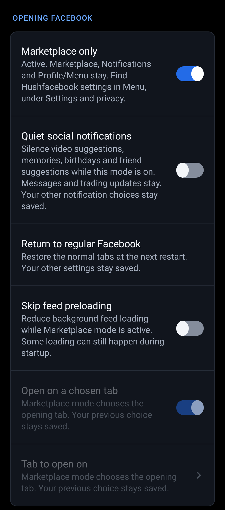
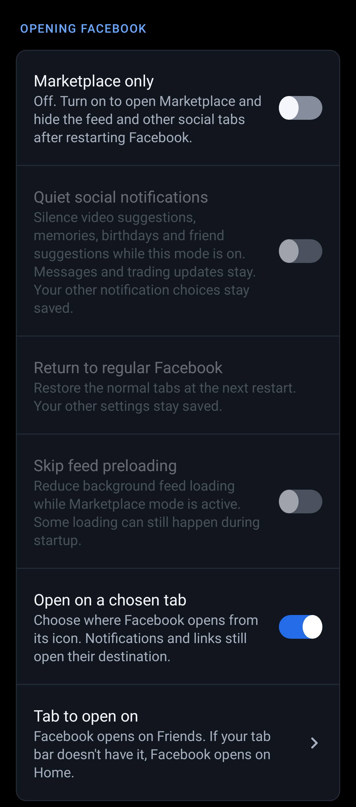
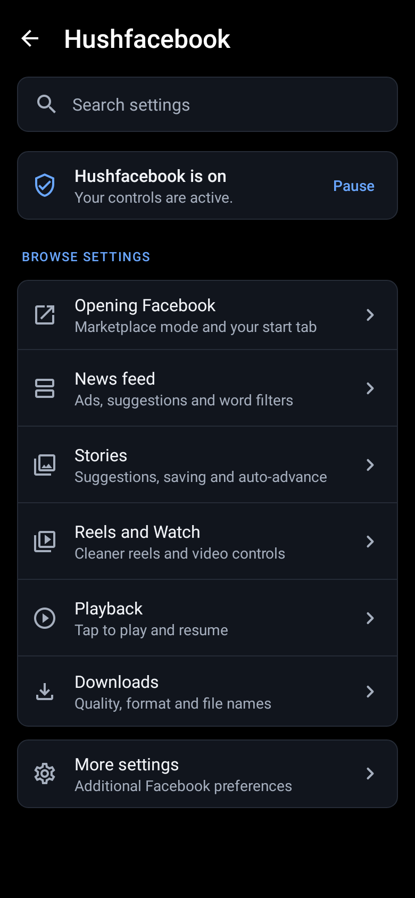
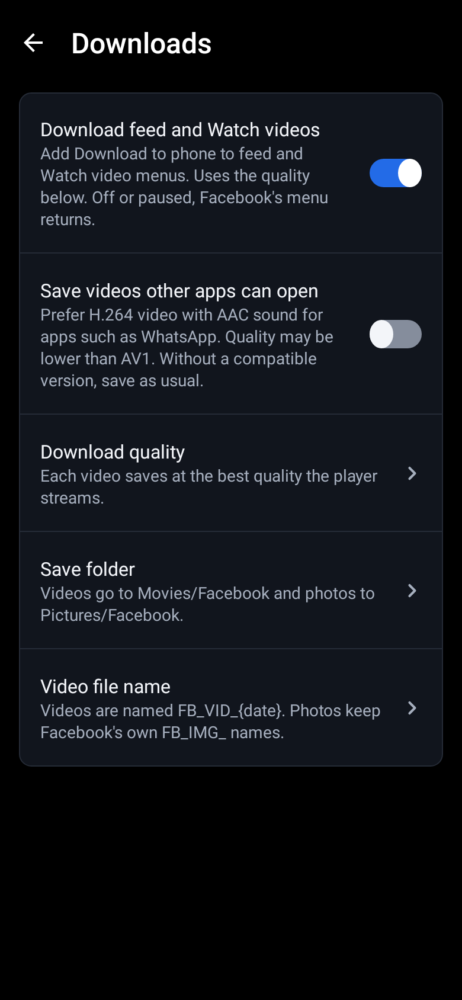

<p align="center">
  <a href="https://github.com/SysAdminDoc/Hushfacebook/releases"></a>
  <a href="LICENSE"></a>
  
  
  
</p>

<p align="center">
  <a href="https://ko-fi.com/X8K126YVER">
    
  </a>
</p>

# Hushfacebook

Hushfacebook is a Morphe patch bundle for Android that takes the clutter out of Facebook and puts useful controls back in your hands.

The latest release is [v0.7.2](https://github.com/SysAdminDoc/Hushfacebook/releases/tag/v0.7.2), with 70 patches. It includes all changes since v0.7.1, among them View profile on every Marketplace seller, picture-in-picture for Reels, a switch for each tab in Hide tabs and support for 581's 32-bit build, as the [changelog](CHANGELOG.md) describes.

[Add to Morphe](https://morphe.software/add-source?github=SysAdminDoc%2FHushfacebook) | [Download a release](https://github.com/SysAdminDoc/Hushfacebook/releases/latest) | [Browse the patches](#patches)

## Why use it

- **A quieter feed.** Sponsored and suggested posts disappear, along with ads in Stories, Reels, and Watch.
- **Less tracking.** Selected ad telemetry and background ad downloads stop. Common trackers also come off links you open or share.
- **Media you can keep.** Save videos from stories, Reels, your feed and Watch at the best quality Facebook streams, or cap them at a lower one to save space. Photos save at the biggest size Facebook sends, even where the poster turned saving off. A save shows its progress and you can cancel it.
- **Controls that recover.** Every runtime feature has a switch. Pause mode, automatic safe mode, settings backups, and privacy-filtered diagnostics help when Facebook changes.

The project brings the Facebook patches from Morphe sources into one maintained bundle. Most started with [Andrew Liang's patches](https://github.com/andrewliang25/morphe-patches) and were rewritten here with fixes. The feed filter also removes promoted posts using the approach from [FroggoMorphePatches](https://github.com/SapitoSucio/FroggoMorphePatches). Its build, settings screen, and release checks share a foundation with the sister project [Hushfeed](https://github.com/SysAdminDoc/hushfeed). See [Where the patches come from](#where-the-patches-come-from) for the full provenance.

This project has no connection to Meta or to the Morphe project. Neither endorses it, and neither wrote it.

## Install

1. Install [Morphe Manager](https://github.com/MorpheApp/morphe-manager) 1.34.0 or newer.
2. Add Hushfacebook as a patch source: https://morphe.software/add-source?github=SysAdminDoc%2FHushfacebook
3. Get Facebook 581.0.0.45.58 from [APKMirror](https://www.apkmirror.com/apk/facebook-2/facebook/) and take the bundle labelled (arm64-v8a) (320-640dpi) (Android 11+), a .apkm file. That's build 475215365, the one these patches are checked against. On a phone with a 32-bit processor, take the (armeabi-v7a) (320dpi) (Android 11+) bundle with build number 475215364 instead. APKMirror lists three of those, so check the number. APKMirror has several other arm64-v8a builds of the same version, and Morphe Manager warns about those ([Unsupported Version](#unsupported-version) explains why). Facebook 580.0.0.51.74 works too, in its (arm64-v8a) (240-640dpi) (Android 11+) bundle, and so does 577.0.0.50.72 in its (arm64-v8a) (360-480dpi) (Android 11+) bundle.
4. In Morphe Manager, tap **Select other apps**, then **Open APK file**, and choose that file. To review the selection first, turn on **Settings → Advanced → Expert mode** before opening the file. Without Expert mode, Manager starts patching with its saved or recommended selection.
5. In Expert mode, open the **Hushfacebook** tab and choose its patches. Check the selected count on every other source tab too. If you added another Facebook patch source, [check for overlapping patches](#patching-stops-on-one-patch) before tapping **Patch**. Android may ask for file access when you open Manager's file browser.

There are 73 patches for `com.facebook.katana`. They're checked against the arm64-v8a builds for Android 11 and newer, and since 581 against the 32-bit armeabi-v7a build for Android 11 and newer too. That's the range Hushfacebook supports. Meta's builds for Android 9 (arm64-v8a) and Android 8 (armeabi-v7a), and every 32-bit build of 580, keep all of their code except a small startup part in a compressed archive. The patcher can't read it, so not one of the patches applies to them.

Facebook releases a new version about once a week, and each one renames most of its code. Every patch here finds what it changes by names Facebook keeps (its GraphQL model classes, log strings, enum names, manifest components) rather than by the names that change, which is why most of them carry over from one build to the next. When one doesn't, patching stops with a message naming what it couldn't find, instead of producing an app that quietly does nothing. Four patches work down a list of separate targets instead: Block background ad prefetch, Block ad telemetry, Disable Audience Network and Hide suggested and promoted posts. They stop only when a build has none of the list. If it has some, they apply to what's there and name each missing target in the patch log. Facebook 580 dropped six of the feed units the suggested posts patch looks for, so patching 580 lists those six. Please report a stop, or a missing target beyond those six.

## Keep your signing key

Morphe Manager signs the patched Facebook with a key it makes on your phone. Android installs an update over your patched Facebook only when the update carries that same key, so the key is what lets you update without losing Facebook's data.

- **Back it up right after your first patch.** In Morphe Manager, open Settings → System → Import & export → Signing key and tap Export. The Export button only appears once you've patched something. Keep the `Morphe.keystore` file somewhere private, because anyone who has it can sign an APK your phone will accept as an update. Morphe's settings backup doesn't include the key.
- **On a new phone, import it before you patch anything.** It's the same dialog. Reinstalling Morphe Manager or clearing its storage makes a new key, and without your exported copy nothing you patched earlier can be updated in place.
- **A different key means starting over.** Android refuses an update signed with another key. Unless you use Root Mount, the only way forward is to uninstall the patched Facebook, and that deletes its data. You'll have to sign in again, and anything kept only in the app is gone. A Root Mount install sits over Meta's own Facebook, so a key change doesn't touch its data.

Morphe's own guide is [Backup and keystore](https://github.com/MorpheApp/morphe-manager/blob/main/docs/backup-and-keystore.md).

## Android developer verification

Google is starting to require that Android apps come from registered developers. From September 30, 2026 the check runs in Brazil, Indonesia, Singapore and Thailand, and only on installs from seven app stores: Google Play, HONOR App Market, OPPO App Market, Galaxy Store, Palm Store, V-Appstore and GetApps ([Google's overview](https://developer.android.com/developer-verification)). Google's [FAQ](https://developer.android.com/developer-verification/guides/faq) says apps that are sideloaded aren't covered yet, and an install from Morphe Manager is a sideload. In 2027 Google plans to take the check global, to all apps on certified Android devices. Installs over ADB stay exempt.

Once it does reach sideloads, a patched Facebook won't count as registered. It keeps Meta's package name but carries your key, and for a package name someone else already holds, Google's answer is to use a different name or to file a request that goes through extra review, with no promised outcome. Two ways in stay open:

- **The advanced flow.** For people who accept the risk, Google added a setting to allow apps from unverified developers, under Settings → System → Developer options → Allow apps from unverified developers ([Google's help page](https://support.google.com/android/answer/17588095)). Turning it on takes a one-time 24-hour wait, and each install afterwards still shows a warning with an Install anyway button. When the wait is over, your phone asks whether to keep the setting on for seven days or indefinitely. Pick indefinitely, because once it lapses, updates to the patched Facebook fail. Google's pages describe the steps a little differently, so follow what your phone shows.
- **ADB from a computer.** Google says apps installed with `adb install` don't need verification and the 24-hour wait doesn't apply to them. In Morphe Manager, turn on Keep patched APKs under Settings → System, export the patched copy, and install it with `adb install -r <file>.apk`. The same-key rule above still applies.

Neither path can be tried against a real block until the check reaches sideloads, so neither has been tested here. If you get to try one, please open an issue saying what happened.

## Patches

| Patch | What it does |
|---|---|
| `Allow screenshots` | Lets you take screenshots and record the screen on the pages Facebook blocks them on. Its switch starts on, under Privacy. |
| `AMOLED black theme` | Makes Facebook's dark mode black, or a dark colour you pick, instead of dark grey. Turn on dark mode in Facebook first. |
| `Block ad telemetry` | Stops Facebook watching for screenshots of ads and reporting which apps you install for ad attribution. |
| `Block background ad prefetch` | Stops Facebook downloading ads and its ad model in the background. That saves data and battery. The ads don't take up storage either. |
| `Block background-return feed refresh` | Keeps your feed position when you return to Facebook within ten minutes, or for any time away with No time limit on. Pull to refresh and a fresh launch still work. |
| `Block Instant Games ads` | Games you play in Facebook get no ads. A game that asks for one is told there's none to show, so a rewarded ad gives no reward, and the game carries on. |
| `Block promotional notifications` | Keeps the kinds of notification you pick off your phone, such as trending videos, memories and birthdays. Each kind has its own switch, and they all start off. Messages, friend requests, comments, mentions and login alerts always come through. |
| `Block screenshot detection` | Stops Facebook noticing when you take a screenshot or record the screen, in the feed, Reels, chats, games and everywhere else. Its switch starts on, under Privacy. |
| `Hide typing indicator` | Others don't see that you're typing, in chats that open inside Facebook and in comment boxes. What you write sends as usual. Its switches start on, under Privacy. |
| `Hide read receipts` | People you chat with in a chat that opens inside Facebook don't see that you've read their messages. The chat can stay unread on this phone, and replying may still show you've read it. Its switch starts on, under Privacy. |
| `Clean up Reels` | Hides the Follow button on reels and the comment and reaction previews under them. Buttons such as Remix, Use template, Add yours and Stars go too, and each part has its own switch. |
| `Default playback quality` | Plays videos, reels and video stories at the quality you choose in Hushfacebook's settings, such as Data saver or up to 720p, instead of the one Facebook picks as it plays. A quality you pick in a video's own menu still wins for that video. |
| `Default comment order` | Opens comments in the order you choose in Hushfacebook's settings, Most relevant, Newest or All comments, instead of the one Facebook picks. An order you pick in a post's comments stays for that post, and links to a comment still open on it. |
| `Disable Audience Network` | Stops Facebook serving ads to other apps. Those apps then show their own ads or none, and rewarded ads can fail. |
| `Don't send reel watch history` | Stops sending Facebook the list of reels you've watched. It's used to rank your Reels feed, and nobody else sees it. Reels you've already watched may come back in the feed. |
| `Download any reel` | Adds a Download button beside every reel. Videos save at the Download quality you set, best by default. |
| `Download any video` | Adds Download to phone to the menu of videos in the feed and in Watch, below Facebook's own items. Videos save at the Download quality you set, best by default. |
| `Download any story` | Adds Save to the menu of any story, including stories with music. Videos save at the Download quality you set, best by default. |
| `Download any photo` | Shows Save photo on every photo you open, even where the poster turned saving off, and saves the biggest size where your downloads go. Its switch is under Downloads. |
| `Force dark mode` | Keeps Facebook in dark mode whatever its own setting says, for tablets where Facebook's settings have no Dark mode. Its switch starts off, so turn it on under Appearance and restart Facebook. |
| `Hide affiliate product links` | Removes the product cards of affiliate shop links from reels, feed posts and the comment sheet. The "Commission eligible" label stays. |
| `Hide AI-detected posts` | Removes feed posts that Facebook's own detection marked as made with AI, and the reels and Watch videos it flagged the same way. A third switch also removes posts their creator labelled as AI, a fourth takes out the Meta AI cards Facebook adds between posts, and a fifth removes posts featuring Meta's AI characters. The Meta AI cards switch starts on. The others start off, so turn them on in Hushfacebook's settings. |
| `Hide sponsored Marketplace listings` | Removes the ads and boosted listings from Marketplace's feed and search results. The feed's request asks Facebook to leave them out and the requests that fetch only ads don't go out. Ads that come back among search results are taken out before Marketplace shows them, and a video ad that reaches the feed anyway isn't drawn. The listings people post stay. |
| `Hide posts by words` | Hides feed posts whose text has a word or phrase you list, unless it also has one from your keep list, and posts from people, Pages and sites you list. Hushfacebook never sends your lists anywhere. The switches start off, so turn one on and fill in its list in Hushfacebook's settings. |
| `Hide post prompts` | Removes the strip Facebook adds to some posts, like "Are you interested in this post?", "Show less", who recently commented, or follow and chat suggestions, with no gap left behind. The post stays. |
| `Hide Meta AI questions under posts` | Removes the row of Meta AI questions Facebook adds under some posts. The post, its link card and its buttons stay. |
| `Hide the Feeds header` | Takes the title row and the All, Favorites, Friends, Groups and Pages filters off the top of the Feeds tab, so it opens on its posts. Its switch starts off, so turn it on under News feed and restart Facebook. |
| `Keep post dates` | Keeps the date under the poster's name. Facebook's newer post header can swap that line for rotating details a moment after a post shows, and on some phones the line goes blank. With this on, the line stays put. |
| `Hide sponsored posts` | Removes sponsored and promoted posts from the news feed, with no gap left behind, and keeps the floating ad button off an ad's comments. |
| `Hide sponsored profile posts` | Removes the ads between the posts on someone's profile or a Page. The profile's own posts stay. |
| `Hide sponsored reels` | Removes ads from Reels and Watch, including product banners over a reel and ads inside a video. |
| `Hide sponsored search results` | Removes the ads from Facebook's search results, the sponsored posts and ad cards between the people, pages and posts you searched for. |
| `Hide sponsored stories` | Removes ad cards from the story viewer, so swiping through stories only shows stories people posted. |
| `Hide Stories tray` | Adds separate controls for the row of stories at the top of the news feed, Create story included, and the rows of stories Facebook puts between posts. |
| `Hide suggested stories` | Removes the stories Facebook suggests from people and Pages you don't follow, the ones marked Suggested in the Stories tray, and the tray's Find friends from contacts card. With Hide suggested and promoted posts in the build too, the tray's People you may know cards go as well. Your friends' stories, the Pages you follow and Create story stay. |
| `Hide Reels in the feed` | Removes the rows of reels between posts in the news feed, and the reels Facebook adds where your feed ends. A reel a friend posts stays. |
| `Hide tabs` | Takes the tabs you pick off the tab bar: Feeds, Friends, Marketplace, Groups, Gaming or Events, and Dating, Professional dashboard, Saved, Ad Center, Create, Explore or Jobs where Facebook gives you one. Each page stays in the Menu. Every switch starts off, and a change shows once Facebook restarts. |
| `Hide the Reels tab` | Takes the Reels tab, which some accounts call Video, off the tab bar, and its shortcut out of the long-press menu of Facebook's icon. Reel links and the reels in your feed still open. Facebook's own Hide in its tab bar settings keeps working, and a change to the switch shows once Facebook restarts. |
| `Hide the Reels tab dot` | Takes the new-item dot and count off the Reels tab, which some accounts call Video. Every other tab keeps its own. |
| `Hide reel interest prompts` | Removes the "Are you interested in this reel?" prompt from reels. The reel plays as usual. |
| `Hide suggested and promoted posts` | Removes what Facebook adds to the feed besides ads: "Suggested for you" posts, "People you may know", suggested groups, "Stories you might like", "Pages you may like" and its own upsells. In-feed surveys go too, and so does the "People you may know" row on your own profile. Each kind has its own switch. Memories, friend requests and friends' locations between posts have switches too, off until you pick them. |
| `Hide Meta AI in search` | Removes the Meta AI answer and the Ask Meta AI prompts Facebook adds to search results, and stops search suggestions from opening Meta AI by themselves. People, groups, pages and posts stay, and the Meta AI button still works. |
| `Hide the Get Messenger card` | Hides the "Get the Messenger app" card at the top of Chats while Messenger is installed. Facebook only counts a Messenger signed with its own key, so a re-signed Facebook shows the card even with Messenger right there. Without Messenger the card stays. |
| `Hide Menu promotions` | Hides the Upgrades and Also from Meta sections of Facebook's Menu. Each has its own switch. Settings, Help and support, your shortcuts and the rest of the Menu stay. |
| `Hold a reel for 2x` | Holding a reel plays it at double speed until you let go. The hold takes the place of Facebook's long-press menu, which the reel's more button still opens. |
| `Hold back analytics uploads` | Stops Facebook uploading its app analytics in the background and skips its on-device learning jobs. Its switch starts on, under Privacy. Restart Facebook after changing it. |
| `Hushfacebook in the Menu` | Adds a Hushfacebook settings row to Facebook's Menu, at the end of Settings and privacy, with a Saved row above it while the Saved shortcut switch is on. The logo long press and the launcher shortcut still open the settings too. |
| `Hushfacebook settings` | Adds Hushfacebook settings to Facebook. Long-press the Facebook logo at the top of your feed, or Facebook's launcher icon, to turn features on or off, pause Hushfacebook, save your switches to a file or load them, and export diagnostics. The licenses are there too. |
| `Install beside Meta's apps` | Lets the official Messenger, Facebook Lite, Business Suite and Workplace install beside the patched Facebook. Facebook shares two permissions with them, and Android lets only one signing key own a permission, so this patch renames Facebook's. A Root Mount install doesn't need it. |
| `Keep the reel speed` | A playback speed you pick in a reel's menu stays for the next reels until you pick another or Facebook restarts. |
| `Marketplace only` | Leaves only Marketplace, Notifications and your profile or Menu in the tab bar, and opens Facebook on Marketplace. Home with the news feed, Video, Friends, Feeds, Groups, Gaming and Events go. Notifications and links still open where they lead. Its switch starts off, so turn it on under Opening Facebook in Hushfacebook's settings. |
| `Material You theme` | Gives Facebook's dark mode the colours of your wallpaper on Android 12 and newer, and a fixed blue palette on Android 11. Light mode stays as it is. Turn on dark mode in Facebook first. |
| `Open links in external browser` | Opens web links in your default browser instead of Facebook's in-app browser, without Facebook's click tracker or the fbclid tag it adds. Facebook pages still open in the app. |
| `Open Messenger from the top bar` | Lets the Messenger icon at the top of Facebook open the Messenger app instead of Facebook's own Chats. Without Messenger installed, Chats opens as before, and a long press on the icon still does what Facebook does with it. Its switch starts off, so turn it on under Chats in Hushfacebook's settings. |
| `Open on a chosen tab` | Opens Facebook on the tab you pick in Hushfacebook's settings when you start it from its icon. It's Marketplace unless you change it. Notifications and links still open where they lead. Its switch starts off, so turn it on under Opening Facebook. |
| `Picture-in-picture` | A reel playing in the Reels tab keeps going in a small window when you leave Facebook, through the picture-in-picture Facebook already has for Reels. Needs Android 12 or later. |
| `Restore screens on re-signed builds` | Makes profiles and some Settings pages open again on a re-signed build, and lets a Messenger, Messenger Lite or Facebook Lite you patch with this build's own key sign in through it, the same as the real Meta app would. A Root Mount install doesn't need this patch. |
| `Resume long videos` | A video longer than two minutes that you left partway picks up where you left it the next time it plays, in the feed or full screen. Short reels, live videos and ads start as usual. Its switch starts off. |
| `Sanitize sharing links` | Takes Facebook's tracking tags, such as mibextid, off the links you share or copy. The post or reel a link opens stays the same. A facebook.com/share/ link is made for one share, so Facebook can still trace it back to you. |
| `Show View profile on Marketplace sellers` | Every seller's page in Marketplace gets View profile, which opens the seller's regular Facebook profile so you can check who you're buying from. Facebook shows that button to only some accounts. Its switch starts on, under Marketplace. |
| `Start on x86 devices` | Keeps Facebook from crashing or freezing as it starts on an x86 device that runs its arm code through a translator, such as an emulator or an x86 Chromebook, by skipping the one start-up step that breaks there. Phones and tablets with arm chips start as before. |
| `Stop Story auto-advance` | Keeps each Story on screen until you tap or swipe. Turn the switch off for Facebook's timing. |
| `Stop update prompts` | Stops Facebook's own update prompts on a patched build, which can't install Meta's updates anyway. Meta App Manager's update promotions and the push message that has it look for an update go, and so do chat promotions aimed at older versions. |
| `Tab bar at the bottom` | Moves Facebook's tab bar to the bottom of the screen on accounts that have it at the top. Its switch starts off, so turn it on under Appearance and restart Facebook. |
| `Tag suggestions only after @` | Stops Facebook offering people to tag while you type ordinary words in posts and comments. Typing @ still brings up the list. Photo tags and your text aren't touched. |
| `Tap to play` | Videos, reels, stories and music wait for your tap instead of starting by themselves. A tap plays as usual. While its switch is on, Facebook's own Autoplay setting reads Off. |
| `Turn off double tap to like` | Stops a double tap on a reel or a video from liking it, and the heart doesn't show. A single tap still plays or pauses, and the Like button still likes. |
| `Turn off haptics` | Stops the short vibrations Facebook plays on its own taps and gestures. The keyboard and your phone's own haptics stay. Its switch starts on, under Appearance. |
| `Turn off HDR brightness` | Keeps HDR videos and photos from turning your screen up to full brightness. They play at the same resolution, in the screen's usual range. Its switch starts on, under Playback. |
| `Turn off screen transitions` | Shows Facebook's tabs, the tab strips inside its screens, its Menu and the screens that open over it at once, without the slide between them. Swiping and animations inside a page stay. Its switch starts on, under Appearance. |
| `Use the phone's emoji` | Draws emoji with your phone's own emoji font instead of Meta's, so the ones in posts, comments and chats look like the ones on your keyboard, big chat emoji included. Reactions and stickers stay as they are. Restart Facebook after changing the switch. |
| `Use the system font` | Draws Facebook's own text in your phone's font instead of Meta's Optimistic typeface, or in a TrueType or OpenType file you pick in Hushfacebook's settings. Icons and emoji keep their fonts, and so does the text you put on a story. Restart Facebook after changing the font. |
| `View stories anonymously` | Keeps you off the viewer list of the stories you watch, because Facebook isn't told which ones you've seen. Replying or reacting still shows you, and stories you've watched keep the ring that marks them as new. |

`Download any video`, `AMOLED black theme`, `Material You theme`, `Hide Stories tray`, `Hide Reels in the feed`, `Hide the Reels tab`, `Block background-return feed refresh`, `Stop Story auto-advance`, `View stories anonymously`, `Clean up Reels`, `Don't send reel watch history`, `Hold back analytics uploads`, `Allow screenshots`, `Block screenshot detection`, `Use the system font`, `Use the phone's emoji`, `Open on a chosen tab`, `Tap to play`, `Turn off double tap to like`, `Turn off haptics`, `Turn off HDR brightness`, `Turn off screen transitions`, `Picture-in-picture`, `Hold a reel for 2x`, `Default comment order`, `Default playback quality` and `Tag suggestions only after @` are off by default. Everything else is on, though a few go in with their switches off. `Hide AI-detected posts` has three of them, two under News feed and the reels one under Reels and Watch, `Resume long videos` has one, under Playback, `Open Messenger from the top bar` has one, under Chats, `Hide the Feeds header` has one, under News feed, and `Tab bar at the bottom` and `Force dark mode` have one each, under Appearance. `Block background-return feed refresh` keeps the ten-minute limit until you turn on No time limit under News feed. Each waits until you turn it on in Hushfacebook's settings. The creator-label switch still needs a signed-in check, and the Reels filter still needs a reel Facebook has flagged. `Hide posts by words` has nothing to hide until you list some words, so its switch and its two lists wait for you under News feed. `Block promotional notifications` goes in with all six of its switches off as well, since each one drops a whole kind of notification. They're under Notifications.

Since v0.7.1, `Hide Stories tray` is split into **Hide the Stories tray**, for the top row, and **Hide Stories between posts** under News feed. Both start on when the patch is selected. Upgrading carries the old choice to both, preserving any independent choice you've already saved. Imports still read the old combined key, while exports use the two new keys.

v0.7.1 also adds **Match whole words** below the post-filter lists. It starts off, keeping the existing substring behavior. Turn it on and `hat` matches `hat!`, while `what` and `hats` stay. The rule applies to both lists, and a matching keep phrase still wins. Settings imports now name every changed switch and show its saved current and incoming states before you apply the file, even while Hushfacebook is paused. Word-list previews keep the phrases private.

### Dark mode themes

Both themes show in Facebook's dark mode. If your Facebook's settings have no Dark mode row, as on some tablets, turn on Force dark mode under Appearance.

`Material You theme` colours Facebook's dark mode with the palette Android 12 and newer take from your wallpaper. Each grey keeps how light it is and picks up the palette's tint, so text stays as easy to read as Facebook made it. Facebook's blue takes the palette's accent colour in links and tagged names, buttons like Confirm and Add to story, the selected chip, story rings, the verified badge, unread notifications and the Like button once you've liked something. Facebook's exact blues change when a server sends them for a screen too, while the Facebook logo, maps, charts and pictures keep their own colours. Android 11 has no wallpaper palette, so there it uses a fixed one built from Facebook's own blue. A wallpaper palette whose accent is almost grey gets that blue for its accent too, so an unseen story ring, an unread dot and a badge still stand out from the grey of a watched or read one. The greys stay your palette's. Marketplace takes it too, on its home, a listing's page, the search field and search results. Light mode keeps Facebook's colours, and a colour the patch doesn't recognise is left as it came.

`AMOLED black theme` has one option, Background colour, for anyone who finds pure black too harsh (issue #34). Leave it blank for black, or give a dark colour as #RRGGBB, such as #0D1117. Pages, bars and the Video tab take it, and cards, popovers and search fields sit a small step lighter than it, the same step they sit above black. Facebook's own black, behind a video for one, stays black. A colour that's too light gets refused. Facebook's white text has to keep a contrast of at least 4.5:1 on the lightest surface the theme makes from it, so no grey lighter than #3A3A3A gets through. You set it in Morphe Manager when you patch, and changing it means patching again.

The two themes work alone or together. With both, backgrounds stay true black and the palette colours the cards, text, icons and dividers on top. A Background colour you picked works the same way. The page keeps it, and the palette colours what sits on top. The Hushfacebook settings screen follows the palette as well, dark or light to match your phone. Without `Material You theme` it stays black.

### Saving videos

While a save runs, a notification shows how far it's got, with a Cancel button. Facebook has to be allowed to post notifications for it. You can also turn off its "Hushfacebook saves" channel in Facebook's notification settings, and a save then runs with just a message when it starts and one when it ends. Either way, every save that's running is listed at the top of Downloads in Hushfacebook's settings, with what it's doing and a Cancel button of its own. In source builds after v0.7.0, Cancel stays available through the final copy and flush. Once gallery publication starts, Cancel is disabled and progress stays visible until it finishes. A successful save also leaves a finished notification with Open and Share actions for the committed gallery file. It stays generic and grants read access only for that action. A cancelled save leaves nothing behind. One that Android stops halfway leaves nothing in the gallery either. The next time Facebook starts, it clears what that save left in its cache and takes down its notification.

## Marketplace settings preview

Marketplace only brings in Open on a chosen tab as a dependency. Both runtime switches start off, so keeping the default patch selection leaves Facebook's usual navigation in place.

The Opening Facebook section, rendered offscreen at phone width. On a Galaxy S22 test phone, Marketplace opens at startup, listings and seller profiles open, and the message composer keeps the selected listing. Returning to regular Facebook restores all six tabs after a restart. Incoming notifications, shared-listing links and a signed-in Facebook 577 session still need checks.

<p></p>

## Settings

<p></p>

There are three ways in. Inside Facebook, long-press the Facebook logo at the top of your feed. A tap on it still does what Facebook made it do. Or open Facebook's Menu, expand Settings and privacy and tap **Hushfacebook settings**, the last row there, when `Hushfacebook in the Menu` is in. From your home screen or app list, long-press Facebook's icon and tap **Hushfacebook**, the first item in that menu. If that item isn't there, open Facebook once so it can add it, then try again. Some launchers have no long-press menu at all, and the logo works there. When Facebook puts a long press of its own on the logo, such as the World Cup game it can open from there, Facebook's comes first and the icon is the way in. Related controls sit in rounded groups, with the build's status at the top. The screen lists the features this build carries:

- **A searchable overview.** Open a category to see its controls. The six main categories are on the overview. The rest are under More settings. Search finds matching settings across every category, with switches you can change directly in the results. Back clears a search or returns to the category index before closing the screen. Your page and search survive rotation.
- **Pause on the overview.** Pause or resume without hunting through the list. Changes take effect when Facebook restarts, and Undo cancels a pending change. Your saved choices stay in place. While Hushfacebook is paused, or a pause or its end is waiting on a restart, category pages and search results that show affected switches open with a short line saying so, with Resume or Undo right there.
- **A live file name example.** The Video file name and Photo file name dialogs show how your format looks as you type. The example has no post details, so the actual author, post date and video ID can change the saved name.
- A switch for each filter. Opening links in your browser and the download features have switches too. They take effect straight away, with no restart and no new patching, though a reel already on screen keeps the buttons it was built with, and a row of reels already in the feed stays until the feed loads fresh posts. A suggested story already in the Stories tray stays until Facebook loads the tray again. In Reels and Watch, the sponsored and AI filters work on each batch of reels as Facebook loads it, so reels already loaded stay as they are until the next batch. The Stories tray switch shows the next time you pull the feed down to refresh. Facebook still builds the tray while it's hidden, so it can come back without a restart. Text already on screen keeps its font until Facebook restarts, so the font and emoji switches wait for a restart instead. While Hushfacebook is paused, a change waits until it's back on.
- **Hide posts with words you choose**, under News feed, when `Hide posts by words` is in, with **Words to hide** and **Words that keep a post** below it. Each list takes one word or phrase per line, up to 1,000, each 2 to 60 characters long. The two lists also share 56 KB of room, which is enough for 1,000 short phrases in each, so both always fit in an exported settings file. A single character is enough for an emoji, a Chinese character, a kana or a Hangul syllable. A lone letter or digit isn't, since nearly every post has one. A post in the news feed goes when its own text, or the text of a post it shares, has one of your words to hide anywhere in it, even inside a longer word, and none of the words that keep a post. Capital letters don't matter, so `SPOILER` and `spoiler` are the same word. There are no wildcards or patterns, and every character means itself. A post with no text, like a photo on its own, always stays, and so does one whose text Hushfacebook can't read. It reads the words the author wrote rather than Facebook's translation of them, so it works the same whatever language Facebook is in. The switch starts off and both lists start empty. Each editor scrolls its explanation, phrase count and whole list together above the keyboard, with Save and Cancel below. The count updates as you type, along with how full the shared room would be. Save turns down a list with too many phrases, or one that would overfill the room, and says why while the editor stays open with everything you typed, so nothing gets cut off. Cancel keeps the saved list. Each post's text is read once however long the lists get. Your words never go into the diagnostic report or a log. The report only counts how many posts each list matched, and the Words to hide row says how many posts it has hidden since Facebook started.
- **Hide posts from people, Pages and sites**, under News feed, when `Hide posts by words` is in, with **People, Pages and sites to hide** below it. Each line is one entry, up to 200, each up to 80 characters long: a name as Facebook shows it, a profile or Page id (only digits), or a site like `example.com`. A site takes its subdomains too, so `example.com` also covers `news.example.com`, and you can paste a whole link, since only its site is kept. A link to a Facebook profile or Page counts as the id in it, like `facebook.com/profile.php?id=` followed by the number, and it can run longer than 80 characters when Facebook adds tracking to it. One without a number, such as `facebook.com/DailyBugle`, is left out, because posts carry their authors' ids and names but not those addresses. Something like `Booking.com` or `Mr.Beast` with no slash counts as a site and as a name, even when the list also has a link to that site. A site in another script, like `bücher.de`, matches its links in either form. A post goes when someone who wrote it matches, or when one of its links goes to a listed site, and a share of such a post goes too. A link Facebook sends through its own redirect counts as the site it leads to. Names match whole, with capital letters and extra spaces ignored, so `Daily Bugle` won't catch `Daily Bugle Sports`. A post Hushfacebook can't read stays. The switch starts off and the list starts empty. Your list never goes into the diagnostic report or a log. The report counts the posts each line hid by its line number.
- **Hide post prompts**, under News feed, when that patch is in. Its switch starts on. The strip Facebook adds to some posts goes, and so does the room it takes. That covers "Are you interested in this post?", "Show less", the line above a post saying who recently commented, and the follow, chat and post suggestions Facebook shows in the same place. The post itself, its likes and its comments stay. Hushfacebook only answers Facebook's own question of whether a post has one of these, so it never taps a prompt for you or tells Facebook anything. Turn the switch off, or pause Hushfacebook, and the strip comes back on the posts drawn after that.
- **Hide Meta AI questions under posts**, under News feed, when that patch is in. Its switch starts on. Under some posts, often a shared news link, Facebook adds a row of questions you could ask Meta AI about it, like "How to earn Mythic Achievements?". With the switch on, that row is gone. The post, its link card and its buttons stay, and if Facebook has a different row for that spot, that one shows instead. Hushfacebook only answers Facebook's own questions of whether the post gets Meta AI's row and whether to draw a row Facebook marks as Meta AI's, so nothing is tapped or sent. Turn the switch off, or pause Hushfacebook, and the row comes back on the posts drawn after that.
- **Keep post dates**, under News feed, when that patch is in. Its switch starts on. Facebook gives some accounts a newer post header that can swap the line under the poster's name, the date and who can see the post, for details that take turns on that line, a moment after the post shows. On some phones the line goes blank instead. With the switch on, every post header keeps the one line with the date. Hushfacebook only answers Facebook's own question of whether a header rotates that line, so nothing is tapped or sent. Turn the switch off, or pause Hushfacebook, and the rotating line comes back on the headers drawn after that.
- **Hide the Feeds header**, under News feed, when that patch is in. It's in Morphe Manager's default selection with its switch off. At the top of the Feeds tab Facebook puts a title row, with Feeds, the menu and search, and under it the filters All, Favorites, Friends, Groups and Pages. Turn the switch on and restart Facebook, and the tab opens straight on its posts. Opened from the menu instead, Feeds keeps a slim bar of Facebook's own, titled Most recent, with back and search, since that screen needs a way out, and the posts start right under it. Hushfacebook only answers Facebook's own questions, whether that tab gets a title row and whether the filters are showing, and gives the filters a place that's never on screen, so nothing is tapped or sent. Turn the switch off, or pause Hushfacebook, and both come back after a restart.
- **Hide affiliate product links**, under News feed, when that patch is in. Its switch starts on, and it covers reels and the comment sheet too. A creator can add a shop link to a post and earn a commission on what people buy through it, and Facebook then shows a product card on the reel, under the feed post and floating over the comment box. With the switch on, all three are gone. The "Commission eligible" label stays, because it tells you the creator gets paid. Hushfacebook only answers Facebook's own questions of whether a post has a card, so nothing is tapped or sent. Turn the switch off, or pause Hushfacebook, and the cards come back on what loads after that.
- **Also hide posts labelled as AI**, under News feed right below Hide AI-detected posts, when that patch is in. It starts off. Facebook puts its AI label next to the poster's name for one of two reasons: its own detection found AI in the post, or the person who posted it said so. Hide AI-detected posts goes by the first alone. With this switch on, a post goes for either, whether the switch above is on or not. Hushfacebook reads the same two flags Facebook's label reads, and a post whose flags it can't read stays. The diagnostic report counts the posts it read under Creator AI label flag.
- **Hide Meta AI in the feed**, under News feed below the two AI switches, when Hide AI-detected posts is in. It starts on. Facebook adds Meta AI cards to the feed between posts, and this takes them out by the card's own type, so nobody's post can match it and the feed closes up with no gap. The diagnostic report counts them under their type name. Turn the switch off, or pause Hushfacebook, and the cards come back on what loads after that.
- **Hide AI character posts**, right below Hide Meta AI in the feed, when Hide AI-detected posts is in. It starts off. Some posts feature one of Meta's AI characters, the Creator AI and AI Studio characters people make and you can chat with. With this on, a post goes when one of its attachments carries the style Facebook draws a character with. These are still someone's posts, a creator's or a character's own account's, so it's yours to turn on. The diagnostic report counts each removed post under that style's name, and what the rule read on a route of its own, by kind only. Turn it off, or pause Hushfacebook, and those posts come back on what loads after that.
- **Marketplace only** is included in the default patch selection, with its switch off. Turn it on under Opening Facebook to keep Marketplace, Notifications and Profile/Menu in the tab bar. Home, Video/Reels, Friends, Feeds, Groups, Gaming and Events go after Facebook restarts. The switch shows whether the mode is active, needs a restart or is waiting for the tab bar. If Marketplace is hidden in Facebook's tab settings or Facebook hasn't supplied it for the account, the normal bar stays and the switch explains why. The chosen-start-tab controls are disabled while this mode is selected, and their values stay saved. **Return to regular Facebook** turns the mode off without changing other preferences. Restart to restore the tabs. The patch includes the Menu settings entry, so open Menu, then Settings and privacy, then Hushfacebook settings. The launcher shortcut works too. Unknown tabs and incoming links stay available.
- **Quiet social notifications**, below Marketplace only, is optional and starts off. While Marketplace mode is selected, it silences trending videos, memories, birthdays and friend suggestions. Messages and direct trading updates stay, as do unknown notification types. Group highlights and nearby-place alerts aren't added to this filter. The individual notification switches keep their saved values and work as before when Marketplace mode is off.
- **Skip feed preloading** is an optional Marketplace setting. Once the tab bar has applied the mode, it skips the friendly-feed startup task and the screen-on feed prefetch task. It leaves both running when the mode is off, paused, waiting for a restart or unable to use Marketplace. Fetches that run before the tab bar is ready still go ahead. This does not block listing pages, profiles or conversations, and no data or battery saving has been measured.
- **Upgrading an older development build:** Marketplace only and Open on a chosen tab now start off when no value was saved. Explicitly saved values and imported settings keep their choices. Older builds removed a switch's stored value when it matched their default, so an old default-on choice can't be distinguished from a feature that was never selected. Turn the desired switch back on once after upgrading, or import a settings backup that includes it.
- **Open on a chosen tab** and **Tab to open on**, when that patch is in. Its runtime switch starts off, so turn it on to use the saved choice. Starting Facebook from its icon opens the tab you pick, which is Marketplace unless you change it. Home, Feeds, Video, Friends, Notifications and Menu are the others. Hushfacebook asks Facebook for the tab the way Facebook's own shortcuts do, so notifications and links still open where they lead, and a tab your tab bar doesn't have opens Home instead. With Feeds picked, **Feeds opens on** picks the filter it opens on too: All, Favorites, Friends, Groups or Pages. All leaves it to Facebook. Friends, Groups and Pages are only on the Feeds tab that opens on the most recent posts, so the usual Feeds tab, with All, Favorites and Recent, opens as it always does for those. When your tab bar has no Feeds tab, Facebook opens Home, and the filter is picked the first time you open Feeds from the Menu. A link to the Feeds tab still opens where it leads. It only acts as Facebook starts. Once Facebook is open, the tab you tap stays, and coming back to a Facebook that's still running picks up where you were. To take the Reels tab off the bar altogether, use `Hide the Reels tab` below, or Facebook's own setting: Settings, Tab bar, Customize the bar, then Hide next to Reels.
- **Hide the Reels tab**, under Reels and Watch, when that patch is in. Its switch starts on, since picking the patch is the choice. After Facebook restarts, the Reels tab, which some accounts call Video, is gone from the tab bar, and every other tab stays where it was. Reel links, the reels in your feed and the Reels viewer still open. It works with Facebook's own Hide left alone, and it never undoes that Hide, so a Reels tab you hid in Facebook's tab bar settings stays hidden with the switch off too. When Tab to open on is set to Video, Facebook opens on Home while the tab is hidden, and that row says so. Turn the switch off, or pause Hushfacebook, and the tab comes back the next time Facebook starts. Facebook's Reels shortcut, the one you get by pressing and holding its icon, goes with the tab, and Facebook puts it back the next time it sends its shortcuts after the switch is off.
- **Hide the Reels tab dot**, under Reels and Watch, when that patch is in. Its switch starts on. The Reels tab, called Video on some accounts, stops showing a dot or a number for new reels, and its label no longer reads as having new items. Friends, Notifications and the other tabs keep their counts. Facebook still keeps its own count, so turning the switch off, or pausing Hushfacebook, brings the dot back the next time the tab bar checks.
- **Hide reel interest prompts**, under Reels and Watch, when that patch is in. Its switch starts on. Reels come without the "Are you interested in this reel?" prompt and without the space kept for it. The reel, its buttons and its caption stay, and nothing is sent to Facebook in place of an answer. Turn the switch off, or pause Hushfacebook, and the prompt can show again on the reels that load after that.
- **Keep the reel speed**, under Reels and Watch, when that patch is in. Its switch starts on. Pick a speed in a reel's menu and the reels after it play at that speed too, until you pick another one or Facebook restarts. Picking Normal goes back to Facebook's way, where every new reel starts at normal speed. The speed sticks to the place you picked it, so a speed picked in Reels carries on through Reels, whether your account has them in their own tab or in the Video tab, and a speed picked on a reel in your feed carries on through the feed's reels. Ads and live videos play at Facebook's own speed, and so does anything that isn't a reel. A reel you pause and start again stays at whatever it's at. Nothing is saved, so a restart always begins at normal speed.
- **Hold a reel for 2x**, under Reels and Watch, when that patch is in. Its switch starts on, since picking the patch is the choice. Press and hold a playing reel anywhere and it plays at double speed until you lift your finger, then goes back to the speed it had. Pull your finger down while you hold and Facebook locks the reel at double speed, with a "Locked at 2x speed" note, until you move on to the next reel. A tap still plays or pauses, and a double tap and the buttons on the side work as before. The hold takes the place of Facebook's long-press menu on reels, and the reel's more button still opens that menu. Ads keep the long-press menu.
- **Default comment order** and **Comment order**, under Comments, when that patch is in. A post's comments open in the order you pick in the list: Most relevant, Newest or All comments, the names Facebook's own sort menu uses. The list starts at Facebook's choice, so nothing changes until you pick one. Hushfacebook asks for your order only where Facebook would otherwise pick one, so an order you pick in a post's comments still wins. That pick then stays with the post when its comments reload or you open them again, until Facebook restarts. A link to one comment, like a notification about a reply, opens in Facebook's order so the comment is where Facebook puts it, and a post opened on its own page keeps Facebook's order too. Facebook answers with the order it used, and that's the one the sort menu shows. What it does with a post that doesn't offer the order you picked hasn't been checked on a phone yet. With Debug logging on, the diagnostic report has a line for each of the first 40 comment requests saying what was asked for, and a count for every 50 after that.
- **Tag suggestions only after @**, under Writing, when that patch is in. Facebook looks up people to tag for any longer word it takes for a name while you write a post or a comment, with or without an @ in front, and opens a list of them over your text. One tap in the wrong place and the word becomes a tag. With the switch on, only a word that starts with @ asks for people. Hashtags still come up after #, and tagging people in a photo or with Tag people happens on a screen of its own, which this doesn't touch. Your text is never changed. A list of people an earlier @ left open closes as soon as you type on, so it can't be tapped by mistake. That goes for words in any language. With Debug logging on, the diagnostic report has a line for each of the first 40 lookups it skipped and a count for every 50 after that.
- **Tap to play**, under Playback, when that patch is in. Videos, reels, stories and music wait for you. The initial Reels play button clears when playback starts. A start goes ahead within a second of your tap, when you use the media controls in the notification or on the lock screen, when you drag the seek bar, and when the music picker you opened while making a post loops your song. A video a link from another app, like your browser, opens in Facebook's full-screen player plays too, since that player has no play button. The first start Facebook makes for you within 15 seconds of the link goes ahead, once, unless you tap or swipe first. Once something you tapped is playing, Facebook's own restarts of it go ahead too, until it's paused or the player moves on to another video. A swipe cancels the previous tap, so the next video waits even if you swipe immediately after pressing Play. A start through Facebook's visibility or resume triggers still waits. Opening the Reels tab can count as your tap and play the first reel. Facebook's own Autoplay setting reads Off while the switch is on, which is what makes the feed, Watch and the Reels controls draw their own play button. In Reels, a reel that's waiting shows that play button from the start, and one tap on it plays the reel. Nothing is written to that setting, so it reads what you chose again once the switch is off. With Debug logging on, the diagnostic report has a line for each of the first 40 starts, saying whether it went ahead, what Facebook called it and how long after your tap it came, and a count for every 50 after that.
- **Hide suggested stories**, under Stories, when that patch is in. The Stories tray loses the stories Facebook suggests from people and Pages you don't follow, the ones with Suggested under the name. Hushfacebook goes by the two marks Facebook's own tray reads before it writes that word, a flag on the story and a label, not by the text, so it works in any language. Your friends' stories, the Pages you follow, your own story and Create story stay, and so does anything in the tray Hushfacebook doesn't recognise. Facebook also puts cards in the tray, picked by a type each one carries rather than by what it says. **Hide "Find friends from contacts"** beside it takes out the card asking to upload your contacts. The People you may know cards, the ones with an Add button, go with **Hide "People you may know"** under Feed, so they need `Hide suggested and promoted posts` in the build too. Friend requests stay. **Hide story prompts** is off until you turn it on. It takes out the cards next to Create story that suggest a story to make, like Share music you love. Those come in a list of their own, so Hushfacebook asks Facebook's server to leave that list out, which Facebook already does for the Video tab's tray. The tray is filtered as Facebook loads it, so a change shows the next time it does. With Debug logging on, the diagnostic report counts each tray's stories by kind, never by whose they are.
- **Resume long videos**, under Playback, when that patch is in. It starts off. Once it's on, a video longer than two minutes that you stop partway, by pausing it, closing it or moving on to something else, is remembered. The next time a player starts that video from the beginning, it jumps back to where you were. That happens once each time the video opens. Drag the seek bar before it happens and your spot wins, and so does a place Facebook carries over itself, like a feed video you tap into full screen or a link to a moment in a video. A stop in the first 15 seconds changes nothing, and one in the last 10 seconds counts as finishing, so the video starts from the beginning next time. Since 581 Facebook plays a long video you open full screen in its reels viewer, which loops what it plays, so a reel of two minutes or more resumes like any other long video. Shorter reels, live videos, ads, other looping videos and songs are left alone. Hushfacebook keeps up to 200 videos for 30 days, each as the video's id and a position, in Facebook's own storage on your phone. They don't go into a settings file you save or into the diagnostic report, which only counts what was saved and resumed. With Debug logging on, the report also says where each resume landed and how long the video is, never which video it was.
- **Default playback quality** and **Playback quality**, under Playback, when that patch is in. Videos, reels and video stories play at the quality you pick in the list. Data saver takes the lowest quality Facebook offers for a video, Up to 480p and Up to 720p the best at or under that, and Highest the best there is. A video with nothing at or under your pick plays the closest quality above it. The list starts at Auto, which leaves the choice to Facebook as a video plays, so nothing changes until you pick one. The qualities are the ones Facebook's own quality menu offers for each video, counted by the labels it gives them, so 720p means what that menu calls 720p. A quality you pick in a video's own menu still wins for that video, and a change here takes effect from the next video that starts. That menu may still show Auto for a video playing at your pick. With Debug logging on, the diagnostic report has a line for each of the first 40 videos saying which quality it started at out of the ones on offer.
- **Picture-in-picture**, under Playback, when that patch is in. Its switch starts on, since picking the patch is the choice. A reel playing in the Reels tab keeps going in a small window when you go Home or switch apps. A paused reel doesn't open one, and after a swipe the window plays the reel you swiped to. With Tap to play on, the reel you were watching keeps playing in the window. It's the picture-in-picture Facebook built for its Reels viewer and keeps for some accounts, so the window and its buttons are Facebook's own. It needs Android 12 or later and a phone with picture-in-picture, and Android's own Picture-in-picture permission for Facebook, under the app's settings, has to stay on. The diagnostic report counts each time it answered Facebook's checks, held the window back for a paused reel and armed it again after a swipe.
- **Turn off HDR brightness**, under Playback, when that patch is in. Its switch starts on, since picking the patch is the choice. When Facebook shows an HDR video or photo, in the feed, a story or Reels, it asks Android to turn the screen up for it. With the switch on, Android draws it in the screen's usual range instead, at the same resolution, so scrolling past one doesn't flash the screen brighter. On Android 15 and newer that covers videos Facebook plays on a surface of their own too. A change takes effect from the next screen you open. The diagnostic report counts the HDR requests held back.
- **Open the Messenger app**, under Chats, when `Open Messenger from the top bar` is in. It starts off. Once it's on, a tap on the Messenger icon at the top of Facebook opens the Messenger app the way its icon on your home screen does, instead of Facebook's own Chats. It doesn't matter which key Messenger is signed with, so the Messenger from the Play Store works beside a patched Facebook. Without Messenger installed, or when Messenger won't start, Chats opens as before. A long press on the icon still does what Facebook does with it, so Facebook's own chats are one gesture away. Messenger opens on its own chat list, not on a particular chat.
- **Hide Upgrades** and **Hide Also from Meta**, under Menu, when `Hide Menu promotions` is in. Each takes its own section out of Facebook's Menu, the list you open from the Menu tab or from the corner of your profile. Upgrades holds Facebook's offers, and Also from Meta links to Meta's other apps and shows ads for its headsets and glasses. Settings and privacy, Help and support, Log out and your shortcuts stay. Hushfacebook finds the two sections by the names Facebook's own code gives them, not by their titles, so the switches work whatever language Facebook is in. If a section still shows after you change its switch, restart Facebook.
- **Block Instant Games ads**, under Menu, when that patch is in. It starts on. Instant Games are the games you play inside Facebook, from Gaming in the Menu or from a post. A game asks Facebook for its ads, and with the switch on every one of those asks is answered the way Facebook answers when it has no ad to show, so nothing is fetched or played. A rewarded ad, the kind a game offers an extra life or a bonus for watching, gives no reward, since none plays. The game hears there's no ad and carries on. A change takes effect with the next ad a game asks for. The diagnostic report counts the asks on its `Instant Games ads` line, by kind.
- **Saved shortcut**, under Menu, in every build. It starts off and follows Pause. Once it's on, Saved goes in the long-press menu of Facebook's icon when Android has room, without replacing existing shortcuts. Your launcher decides which entries it shows, so it may not appear there. Samsung's launcher, for one, doesn't show it. With `Hushfacebook in the Menu` in, a Saved row also goes at the end of Settings and privacy in Facebook's Menu, right above Hushfacebook settings, and it opens your saved items inside Facebook on any phone.
- **Block trending video notifications**, **Block memory notifications**, **Block birthday notifications**, **Block group and Page highlights**, **Block "People you may know"**, **Block nearby and weather notifications** and **Block account setup reminders**, under Notifications, when `Block promotional notifications` is in. All seven start off. Each keeps one kind of push notification from reaching your phone: trending videos and the reels Facebook picked for you, "On this day" memories, friends' birthdays, digests from the groups, Pages and creators you follow, friend suggestions, alerts about places nearby and the weather, and the "finish setting up your account" reminders some people keep getting while they're signed in. Hushfacebook tells them apart by the type Facebook gives each notification, never by its text, so the switches work in any language. A type it doesn't know always comes through, and so do messages, friend requests, comments, replies, mentions, calls and login alerts. Android's own settings for Facebook's notification categories work too, since Facebook drops a notification whose category you've turned off there. Facebook's server decides which categories your account gets, though, and they don't always split these kinds out. With Debug logging on, the diagnostic report counts each kind of notification that arrived and the ones that were blocked.
- **Save Facebook's notification sound**, under Notifications, in every build. Android keeps a notification category's sound with the category, and once a category shows None there, which can happen after a fresh install of a re-signed copy on a phone that still had an older copy's categories, neither Facebook nor Android offers the app's own sound again. A tap on this row copies Facebook's chime into your phone's Notifications folder, once, and a message says what it's called. Then open Android's notification settings for Facebook, pick the category, tap Sound and choose Facebook notification from the list.
- **Hide sponsored Marketplace listings**, under Marketplace, when that patch is in. Marketplace asks Facebook for its feed and, in requests of their own, for the ads that go in it. With the switch on, the feed's request asks for no ads or boosted listings, and the requests for ads alone aren't sent, so Marketplace never gets them. A video ad that reaches the feed anyway isn't drawn, and the diagnostic report counts it as a `video ad` on its `Marketplace ads` line. It takes effect the next time Marketplace loads its feed, so pull the feed down to refresh it after you change the switch. With Debug logging on, the diagnostic report has a line for each of the first 40 Marketplace requests, naming the request and what was done to it, and a count for every 50 after that. Search works differently, since a search gets its ads back mixed in with the listings. With the switch on, those ads come out of the search's answer before Marketplace draws it, and the listings close up with no empty tile. The typeahead suggestions and your search history aren't touched. The next search you run shows a change of the switch. The diagnostic report counts what came out on its `Marketplace search ads` line, and with Debug logging on it has a line for each part of a search answer saying how many listings it held and how many ads came out, never what they were. The unreleased build also limits how much one search answer can parse. If a limit is reached, filtering stops for that answer. Its listings stay available, and later results still line up with any ads already removed.
- **Show View profile on Marketplace sellers**, under Marketplace, when that patch is in. It starts on. A seller's Marketplace page has Facebook's own View profile button, which opens the seller's regular Facebook profile, but Facebook only gives it to the accounts in one of its experiments. Everyone else gets Follow, Message and a More button, and no way from there to the seller's profile. With the switch on, every seller's page has View profile next to More, and in the More sheet too. A change shows on the next seller page you open.
- **Save any photo**, under Downloads, when `Download any photo` is in. It starts on. Every photo you open full screen gets Facebook's Save photo item, even where the poster turned saving off. A tap saves the biggest size Facebook sends to your Save folder, named the way **Photo file name** says. If Hushfacebook can't start the save, Facebook's own runs. Off or paused, the item shows only where the poster allows it.
- **Download quality**, for every video you save: Best (the default), 1080p, 720p, 480p, 360p or Smallest. A save takes the best version at or under the one you pick, the way Facebook's own quality menu labels them. When a video has nothing that low, it takes the closest one above, so a save never fails over it. Photos always save at full size.
- **Save videos other apps can open**, a switch above Download quality that starts off. With it off, a video saves in whatever format Facebook streams its best picture in, and that can be AV1 or VP9 video in an MP4 file, which Android itself has read since Android 10. Some players and sharing apps reject AV1 or VP9 video, or xHE-AAC sound. Try it when WhatsApp won't take a saved video, when CapCut or InShot won't open one or can't export it, or when a gallery or player plays one without sound. In a test, CapCut opened AV1 video as an empty black clip, and xHE-AAC sound left CapCut's export stuck near the end and made InShot's export silent, while H.264 or VP9 video with AAC sound opened and exported fine in both. With the switch on, saves from Reels, Stories, the feed and Watch prefer a known H.264 video and AAC-LC or HE-AAC audio pair within your Download quality. That pair wins over a single MP4 whose codecs aren't known, even if the MP4 has a higher resolution. Some reels and stories come with no H.264 picture at all, only AV1 or VP9, and with xHE-AAC as their only sound. For those the phone converts what's missing before the tracks are joined, the picture to H.264 and the sound to AAC-LC, whenever that gives a sharper picture than Facebook's single MP4. A 1080p reel takes a few seconds. Conversion covers 8-bit pictures up to 10 minutes long, so an HDR video keeps the single MP4. When Facebook offers no such pair otherwise, or the conversion can't run, the save tries Facebook's single MP4 instead. That MP4's codecs aren't known, so it may not play everywhere either. With neither available, it keeps the original formats and records that fallback in diagnostics. Even with the switch off, downloads prefer AAC-LC or HE-AAC sound when available without reducing the picture's resolution. If the only sound can't be joined, the save falls back to the complete MP4 instead of making a silent video.
- **Save to**, right above Save folder (issue #42). Movies and Pictures, the default, keeps videos in `Movies` and photos in `Pictures`, where Facebook's own saves go. Some galleries don't show `Movies`, so DCIM puts both next to the camera's photos, and Download puts both with the phone's other downloads. Saves you already have stay where they are.
- **Save folder**, the one folder every save goes to, under the one Save to picks. Videos land in `Movies/Facebook` and photos in `Pictures/Facebook` until you pick another name, or both in `DCIM/Facebook` or `Download/Facebook`. It takes a folder name, not a path, so slashes and other characters a folder can't hold become underscores, and dots or spaces at either end are dropped.
- **Video file name**, the name each saved video gets. It starts as `FB_VID_{date}`, Facebook's own naming, so nothing changes until you edit it. `{date}` becomes the date and time of the save, like `20260925_143005`, `{video_id}` the video's number on Facebook, `{owner}` the name of whoever posted it, `{owner_id}` the number of their profile or Page, which stays the same when a Page renames itself, and `{posted}` the day it went up, like `20260925`. A video a friend shared counts as their post, so it takes their name, their number and the day they shared it. So `{owner}_{posted}` saves a reel or a feed video as `Some Page_20260925.mp4`, and `{owner}_{owner_id}_{posted}` as `Some Page_100064123456789_20260925.mp4`. When a save doesn't know one of them, it's left out. Android only numbers a repeated name so many times before it refuses the save, so a name with no token gets `_{date}` added, and one that counts on something the save doesn't know gets the date and time on the end. A name that's already in the save folder gets the time of the save on the end, so the second video one person posted that day saves as `Some Page_20260925_143005.mp4`. The poster's name is cleaned the way the folder is, and so is the whole name. A typed extension such as `.mp4` is dropped, since the saved file's type decides it, and a video's name can't start with `FB_IMG_`, which is how photos start.
- **Photo file name**, under Downloads, when `Download any photo` is in. It works like Video file name for the photos Save any photo keeps, with `{photo_id}`, the photo's number on Facebook, where a video has `{video_id}`. It starts as `FB_IMG_{date}`, the name Facebook's own photo saves get, and a photo's name can't start with `FB_VID_`. Export settings carries it.
- **When you tap Download** and **App to send to**, under Downloads, when `Download any reel` or `Download any video` is in (issue #41). Save to phone, the default, keeps everything as it was. Send the link to an app hands the reel or video's facebook.com link to another app as plain text instead, so a downloader like YTDLnis or Seal can queue it, pick a format or pull out the audio. The reel button and the video menu item then read Send to app. Type the app's package name, like `com.deniscerri.ytdl` for YTDLnis or `com.junkfood.seal` for Seal, and links go straight to it. Leave it blank, or name an app that isn't installed, and Android asks which app each time. The link is built from the video's number on Facebook and nothing else, so no caption or other text from the post goes with it. Press and hold the reel Download button to copy the link instead. Stories still save to your phone, since a story's link only opens for someone signed in. Export settings carries both rows.
- **Font file**, under Appearance with the `Use the system font` switch. Until you pick one, Facebook's text is drawn in your phone's font. The row opens Android's file picker. Choose a TrueType or OpenType font of up to 20 MB, a `.ttc` collection included, and Hushfacebook keeps a copy in Facebook's own storage, so the file you picked can move or go afterwards. On an account where Facebook draws posts and menus in Roboto instead of Optimistic, the file takes Roboto's place too, comments included, along with the bold and medium names at the top of a post or in a notification. Text boxes like the search field take the file as well. Hushfacebook's own settings keep your phone's font, so you can always read them to undo a pick. A font with a weight axis is drawn at each weight Facebook asks for, and one without a bold or italic of its own gets Android's. A file Android can't draw with is turned down with a message and your font stays as it was. If the copy ever stops loading, your phone's font takes over. **Use your phone's font** drops the copy. Restart Facebook to see either change.
- **Tab bar at the bottom**, under Appearance, when that patch is in. It's in Morphe Manager's default selection with its switch off. Facebook puts the tab bar at the top of the screen on some accounts and at the bottom on others. Turn the switch on and restart Facebook, and the bar sits at the bottom with the same tabs in the same order. On an account that already has it at the bottom, nothing changes. Hushfacebook only answers Facebook's own setting for where the bar goes, so nothing is tapped or sent. If your account has Facebook's own option to move the bar, it does nothing while the switch is on. Turn the switch off, or pause Hushfacebook, and the bar goes back where Facebook puts it after a restart.
- **Hide the Feeds tab**, **Friends**, **Marketplace**, **Groups**, **Gaming** and **Events**, under Appearance, when Hide tabs is in. Facebook gives some accounts more tabs, and those get switches too: **Dating**, **Professional dashboard**, **Saved**, **Ad Center**, **Create**, **Explore** and **Jobs**. Each switch starts off. Turn one on and that tab comes off the tab bar the next time Facebook starts, and its page stays in the Menu. Home and Menu always stay. If Open on a chosen tab points at a tab you hid, Facebook opens on Home, and Marketplace only keeps Marketplace whatever its switch says.
- **Force dark mode**, under Appearance, when that patch is in (issue #64). It's in Morphe Manager's default selection with its switch off. Facebook's Settings page comes from its server, and on some tablets it has no Dark mode row, so there's no way to turn dark mode on there. Turn the switch on and restart Facebook, and it stays in dark mode whatever its own setting says. `AMOLED black theme` and `Material You theme` work on top of it. Hushfacebook only answers Facebook's own question of whether dark mode is on, the same place Meta's own tests turn it on, so nothing is tapped or sent. Turn the switch off, or pause Hushfacebook, and Facebook follows its own setting again.
- **Supported links**, under Links, in every build. Android opens facebook.com links in an app straight away only when facebook.com lists that app's signing key, and it lists Meta's, not yours. On Android 12 and later the row says what Android reports for this app: verified, all or some of Facebook's addresses selected by hand, none selected, or opening supported links turned off. A tap opens Android's Open by default page for the app, where you can select them. That sends the links here again, but it isn't Meta's verification and doesn't bring it back. Your browser and tracking switches stay as they are. Android 11 doesn't report any of this, so there the row opens the app's info page. When Android's answer can't be read, the row says so rather than guessing. On a Galaxy S22 Ultra with Android 16, a facebook.com/share/r/ link from another app opened straight in Hushfacebook once its addresses were selected, with no browser in between.
- **Meta App Manager**, **Messenger** and **Instagram**, under Supported links. Each one shows only when that app is on your phone and some of Facebook's addresses it can hold don't open here (issues #30 and #78). Android verifies Meta's own apps for those addresses with Meta's key: App Manager for facebook.com, Messenger for facebook.com, www.facebook.com, m.me and www.m.me, and Instagram for facebook.com, www.facebook.com and m.facebook.com. Android won't let you select an address another app is verified for, so those switches on Hushfacebook's Open by default page keep turning themselves back off. A tap opens that app's own page. Turn off **Open supported links** there, then select the addresses for Hushfacebook under Supported links. Until then, links to those addresses go through your browser first. Development builds refresh these rows together when you return from Android settings. A row says its addresses open here only when link handling is enabled and Android reports every relevant address as selected or verified.
- **Hold back analytics uploads**, under Privacy, when that patch is in. Its switch starts on, since picking the patch is the choice. Facebook logs how you use the app through its XAnalytics logger and uploads the log in the background, every three minutes while it's open. With the switch on those uploads don't start, and Facebook's Papaya jobs, which run on-device learning tasks and report their results, end as soon as they start, the way they do when Facebook's own config turns Papaya off. Facebook still writes its log on the phone. The uploader is set up once as Facebook starts, so restart Facebook after changing the switch. The diagnostic report counts the uploads and jobs held back.
- **Allow screenshots**, under Privacy, when that patch is in. Its switch starts on, since picking the patch is the choice. Android blacks out a page an app marks secure in screenshots, screen recordings and the recent apps view, and Facebook marks a few that way. With the switch on, Facebook's request to mark a page secure goes through without it, so those pages show up like any other. A page that's already open changes the next time you open it.
- **Block screenshot detection**, under Privacy, when that patch is in. Its switch starts on. Facebook watches your photo library for new screenshots, in the feed, Reels, chats, games, Marketplace and ads, and on Android 14 and newer it can also ask Android to tell it about a screenshot or a screen recording. With the switch on, it doesn't look at new pictures and never asks, so whatever it would do about a screenshot, from logging it to telling someone in a chat, doesn't happen.
- **Hide typing in chats** and **Hide typing in comments**, under Privacy, when Hide typing indicator is in. Both start on, since picking the patch is the choice. In a chat that opens inside Facebook, the person you're writing to doesn't see you typing, and people looking at a post don't see that you're writing a comment. Your messages and comments send as usual.
- **Hide read receipts**, under Privacy, when Hide read receipts is in. It starts on. In a chat that opens inside Facebook, the person who wrote to you doesn't see that you've read it. Facebook doesn't mark the chat read on this phone either, so it can stay unread until you switch this off. Replying may still show you've read it. Dating chats mark read their own way and aren't held.
- **Turn off haptics**, under Appearance, when that patch is in. Its switch starts on, since picking the patch is the choice. Facebook plays a short vibration on many of its own taps and gestures, like a like, the reactions bar or scrubbing a reel. With the switch on, Facebook's requests for those go through Hushfacebook and don't play. Your keyboard, your phone's own haptics and a call's ring aren't Facebook's taps, so they stay. The diagnostic report counts the haptics it held back under Haptics.
- **Turn off screen transitions**, under Appearance, when that patch is in. Its switch starts on, since picking the patch is the choice. A tap on a tab or the Menu button shows that page at once instead of sliding to it, and so does a tap on a tab strip inside a screen, like Feelings and Activities in the composer. A screen that opens over Facebook, like the post composer, appears and closes without its slide. Swiping between tabs still follows your finger. A change takes effect from your next tap, with no restart. The diagnostic report counts the tabs, panels, pages and screens shown this way.
- **Check for new Hushfacebook releases**, under Updates. It's off until you turn it on. Then, once a day when Facebook starts, Hushfacebook asks GitHub for its latest release. When that's newer than yours, the status card at the top of the screen says so, along with the Facebook version it targets if that isn't the one you have. Update through Morphe Manager as usual. **Check now** asks straight away, with the switch on or off. Neither one downloads anything or posts a notification.
- **Pause Hushfacebook**. From the next start, every one of those switches acts as if it were off and Facebook's own code runs in its place. That includes the release check, so a paused Facebook doesn't ask GitHub by itself, though Check now still works. Debug logging keeps working, and your settings stay as they are. Pause can't undo what was set when you patched, and the screen lists what stays in.
- **Debug logging** and **Export diagnostic report**, for bug reports. The report leaves out web addresses, Facebook host names, @handles, numbers of 15 to 21 digits and the names Hushfacebook writes into its own messages. It also drops the value of any name it knows as a token, session, password, API key, cookie, signature or device ID, or as the ID of an account, post, story, comment, message or video, however short. That holds in plain text, JSON, escaped JSON and HAR-style name and value pairs, and a list or object under one of those names goes whole. After an account ID, the rest of its line goes too, up to the next name with an equals sign or colon, so a list of IDs written with spaces doesn't leave any behind. Whole Cookie and Authorization headers go, including a Bearer or Basic credential that carries on alone on the next line. A Bearer, OAuth or Basic credential written without a header goes too, when it has a digit or a symbol in it the way real ones do. It can't recognise a name or message written anywhere else, or a secret stored under a name it doesn't know, so read the report and remove anything private before sharing it. You don't need Debug logging for a report. Even with nothing logged it names the app's package and version code, the Android version and profile, the ABI, your Hushfacebook version and whether Hushfacebook is paused. It says, for every patch but the settings entry itself, whether this build has it and whether a switch runs it. For each of those whose hooks have run, it gives how often they ran, what they decided and the first thing they couldn't find. Debug logging adds a log of what happened, which helps with anything the counts don't explain. Failed saves and links no browser opened are in it too, and once the release check has been used, when it last asked and what it found.
- **Test the Messenger link**, under Pause, backup and diagnostics, while Debug logging is on and `Restore screens on re-signed builds` is in. It shows up the next time you open settings after turning Debug logging on. At startup Facebook reads two flags that it can ask Messenger for, once, and then remembers it did. This row runs both reads again right away and tells you whether each one answered, so you can check that a Messenger you patched with the same key lets your Facebook in. It never shows or logs what a read answered.
- **Licenses**, under More settings and About, has the notices of every project this is built on, with links you can open from the screen.

Morphe Manager can export your patch choices and your signing key, but not the switches on this screen. **Export settings** saves them, along with your download settings, what a Download tap does and the app it sends links to, the tab Facebook opens on and its Feeds filter, the order comments open in, the playback quality, your two word lists and the people, Pages and sites list, to a JSON file wherever you pick, and **Import settings** reads one back, on this phone or a new one. Before anything changes, the screen says how many switches the file would change, what it does to the download settings, the start tab and its Feeds filter, the comment order and the playback quality, how many words each word list will hold, and how many entries in it this version doesn't know, which it skips. It never shows the words themselves. A damaged file or one from a newer Hushfacebook changes nothing, and so does one whose word lists wouldn't fit in the room the two share. If the phone can't save an import, the message says whether your earlier settings are back, and the switches on the screen show what was kept. After an export, Hushfacebook reads the file back and tells you if it won't import, or if the app holding it wouldn't let it check. When that app takes longer than 30 seconds, the screen stops waiting and says so, though the app may still be working on the file. Pause and Debug logging stay out of the file, and so does anything about you or your phone. The release check stays out too, since a file someone shares shouldn't be able to put your phone online. So does the font file you picked, because a settings file can't carry the font itself.

Everything Hushfacebook shows, from the settings screen to the save notification and the launcher shortcut, is in the language Facebook itself shows. That's the one you picked in Facebook's language settings, or your phone's if you never picked one. German, Spanish, Indonesian, Brazilian Portuguese and Turkish are translated, and any other language gets English. Hushfacebook never changes Facebook's language. The diagnostic report stays in English, so whoever reads it can, and so do the error toasts Debug logging shows. With TalkBack on, section titles are headings you can jump between, and each switch says it's a switch and whether it's on. A settings search says how many settings it found once you stop typing, and Back puts TalkBack's focus on the category you opened. Every row's text wraps in full, even at the largest text size.

Hushfacebook pauses itself when Facebook crashes or freezes within a minute of starting three times in a row, and the screen says so. If you can't reach the screen at all, an empty file named `hushfacebook-safe-mode` in `Android/data/com.facebook.katana/files` pauses it too. It has to be in that `files` folder, not the one above it. Resume removes that file first. When it can't, your Pause and safe mode switches stay as they were, and the screen tells you to delete the file yourself. Safe mode is the same pause. It changes what the switches answer, but every patch's code stays in place, so if Facebook keeps closing in safe mode, the cause can be Facebook itself or any patch, whichever row of the table below it's in. To find it, patch again without the patch you suspect, or with fewer patches.

### Blocking Reels

Reels turn up in four places, and no one switch covers them all. The Reels and Watch page opens with a short map of which control does what, and searching the settings for "block reels" finds it. Tap a line to jump straight to its setting. Looking doesn't change anything you've saved.

| Where Reels show up | What blocks them |
|---|---|
| Rows of reels between posts in your feed | **Hide Reels in the feed**, under News feed. |
| Reels and videos that start playing by themselves | **Tap to play**, under Playback. |
| The Reels tab in Facebook's tab bar | **Hide the Reels tab**, under Reels and Watch, after a restart. Facebook's own setting works too: Settings, Tab bar, Customize the bar, then Hide next to Reels. Some accounts call that tab Video. |
| The dot or new count on the Reels tab | **Hide the Reels tab dot**, under Reels and Watch. |
| The "Are you interested in this reel?" prompt | **Hide reel interest prompts**, under Reels and Watch. |
| Everything except Marketplace | **Marketplace only**, under Opening Facebook. After a restart it keeps Marketplace, Notifications and Profile/Menu and drops the feed, the Reels tab and the other social tabs. |

`Hide the Reels tab` doesn't need Facebook's own Hide, which some accounts don't get, and it doesn't fight it either. When a patch from the table isn't in your build, its line on the map says so and names the patch to pick in Morphe Manager before you patch again. Ads inside Reels, the buttons under a reel and AI-flagged reels have switches further down the same page.

### What Pause turns off

| Patch | While paused |
|---|---|
| Hide sponsored posts | Off. Sponsored and promoted posts come back, and so does the ad button on their comments. |
| Hide suggested and promoted posts | Off. |
| Hide Stories tray | Off. The row of stories at the top and the rows of stories between posts come back. |
| Hide Reels in the feed | Off. The rows of reels come back. |
| Hide AI-detected posts | Off. Posts Facebook detected as made with AI come back, and so do the posts their creator labelled as AI, the reels and videos Facebook flagged, the Meta AI cards between posts and the posts featuring Meta's AI characters. |
| Hide posts by words | Off. Posts with your words, and posts from the people, Pages and sites you listed, come back. Your lists stay as you left them. |
| Hide post prompts | Off. The strip on some posts comes back. |
| Hide Meta AI questions under posts | Off. The row of Meta AI questions under some posts comes back. |
| Keep post dates | Off. Facebook's rotating line under the poster's name comes back on the posts that get it. |
| Hide the Feeds header | Off. The Feeds tab's title row and filters come back after restarting while paused. |
| Hide sponsored stories | Off. |
| Hide suggested stories | Off. Suggested stories, the tray's Find friends from contacts and People you may know cards, and any story prompts you hid come back to the Stories tray the next time it loads. |
| Stop Story auto-advance | Off. Stories use Facebook's timing. |
| View stories anonymously | Off. The stories you watch put you on their viewer lists again. |
| Hide sponsored reels | Partly. Ads inside a page of reels come back. Banners over a reel and mid-roll ads stay blocked, and so do ads the app adds on its own. |
| Hide sponsored search results | Off. Ads come back between your search results. |
| Hide sponsored profile posts | Off. Ads come back between the posts on profiles and Pages. |
| Hide sponsored Marketplace listings | Off. Ads and boosted listings come back to Marketplace's feed and search results. |
| Show View profile on Marketplace sellers | Off. A seller's page shows View profile only when Facebook gives it to your account. |
| Hide affiliate product links | Off. Product cards come back on reels, under feed posts and in the comment sheet. |
| Clean up Reels | Off. Reels look the way Facebook draws them. |
| Don't send reel watch history | Off. Facebook gets the list of reels you watch again. |
| Turn off double tap to like | Off. A double tap likes reels and videos again. |
| Turn off haptics | Off. Facebook's taps and gestures vibrate again. |
| Turn off screen transitions | Off. Facebook's tabs, tab strips, Menu and screens slide in again. |
| Keep the reel speed | Off. Every new reel starts at normal speed, as Facebook starts it. |
| Hold a reel for 2x | Off. A long press on a reel opens Facebook's long-press menu again. |
| Use the system font | Off. Text goes back to Meta's font once Facebook restarts. |
| Use the phone's emoji | Off. Emoji go back to Meta's once Facebook restarts. |
| Open links in external browser | Off. Links open in Facebook's own browser. |
| Sanitize sharing links | Off. Links you share keep Facebook's tracking tags. |
| Stop update prompts | Off. Facebook's own update prompts come back. |
| Download any story | Off. Only your own stories have Save, and it's Facebook's own. |
| Download any reel | Off. Reels show only Facebook's own buttons. |
| Download any photo | Off. Save photo shows only where the poster allows it, and it's Facebook's own. |
| Download any video | Off. Post menus show only Facebook's own items. |
| Open on a chosen tab | Off. Facebook opens on the tab it chooses. |
| Marketplace only | Off. Feed preloading and the quiet-notification overlay go back to normal. The whole tab bar returns after restarting while paused. |
| Hide the Reels tab | Off. The Reels tab comes back after restarting while paused, unless Facebook's own tab bar settings hide it. Its shortcut on Facebook's icon comes back when Facebook next sends its shortcuts. |
| Hide tabs | Off. Every tab you hid comes back once Facebook restarts. |
| Hide the Reels tab dot | Off. The Reels tab shows Facebook's dot and count again. |
| Tab bar at the bottom | Off. The tab bar goes back where Facebook puts it after restarting while paused. |
| Force dark mode | Off. Facebook follows its own Dark mode setting again, fully once it restarts. |
| Hide reel interest prompts | Off. The interest prompt can show again on reels. |
| Hide the Get Messenger card | Off. The Get Messenger card comes back at the top of Chats. |
| Open Messenger from the top bar | Off. The Messenger icon opens Facebook's own Chats again. |
| Hide Menu promotions | Off. The Upgrades and Also from Meta sections come back to the Menu. |
| Hide Meta AI in search | Off. Search shows Meta AI's answer and prompts again, and a suggestion Facebook sets to open Meta AI opens it. |
| Block Instant Games ads | Off. Games get their ads again, from the next one they ask for. |
| Hold back analytics uploads | Off. Facebook uploads its app analytics and runs its on-device learning jobs again once it restarts. |
| Allow screenshots | Off. A page Facebook blocks screenshots on is blocked again the next time it opens. |
| Block screenshot detection | Off. Facebook notices screenshots and screen recordings again. Its Android 14 and 15 checks come back the next time each page opens. |
| Hide typing indicator | Off. Chats and comment boxes show others that you're typing again. |
| Hide read receipts | Off. Chats you open show the sender that you've read them again. |
| Block promotional notifications | Off. Every kind of notification comes through again. |
| Default comment order | Off. Comments open in the order Facebook picks. |
| Tag suggestions only after @ | Off. Facebook offers people to tag for plain words again. |
| Tap to play | Off. Media starts the way Facebook starts it, and its Autoplay setting reads what you chose. |
| Hushfacebook in the Menu | Stays. It's a way into the settings, and the settings are where you turn Pause off. |
| Default playback quality | Off. Facebook picks the quality as each video plays. |
| Picture-in-picture | Off. Leaving Facebook stops a reel the way it did before, unless Facebook turned its picture-in-picture on for your account. |
| Turn off HDR brightness | Off. HDR videos and photos turn the screen up again, from the next screen you open. |
| Resume long videos | Off. Videos start where Facebook starts them, and nothing new is remembered. The places already saved stay until they're 30 days old. |
| Block ad telemetry, Block background ad prefetch, Disable Audience Network, AMOLED black theme, Material You theme, Restore screens on re-signed builds, Start on x86 devices, Install beside Meta's apps | Stay. They were set when you patched, and changing one means patching again. |

## Known limitations

- **Other Meta apps.** A patched Facebook carries your key, not Meta's, and Android lets only one key own a permission. Messenger, Facebook Lite, Meta Business Suite and Workplace declare two of the permissions Facebook declares, so without `Install beside Meta's apps` whichever of them you install second fails with `INSTALL_FAILED_DUPLICATE_PERMISSION`. The patch is on by default and gives Facebook's two their own names. Instagram, Threads, WhatsApp and Messenger Kids don't declare either, so they were never affected. If you patched without it, patch again with it and install over the top. That's an ordinary update with the same key, so Facebook keeps its data, and Messenger installs afterwards. What a re-signed Facebook still can't share with Meta's own apps is what they only allow each other, so signing in to one of them through your Facebook account may not work. A Messenger, Messenger Lite or Facebook Lite you patch yourself with the same key is the exception: `Restore screens on re-signed builds`, on by default, lets it sign in through your patched Facebook whether or not you also pick `Install beside Meta's apps`. For the same reason Facebook treats Meta's Messenger as missing and keeps a Get Messenger card at the top of Chats. `Hide the Get Messenger card` takes that card away. It looks for Messenger once each time Facebook starts, so after you install or remove Messenger, restart Facebook. Morphe Manager's Root Mount keeps Meta's signature and has neither problem.
- **Marketplace ads.** `Hide sponsored Marketplace listings` works mostly on the requests Marketplace sends, not on what it draws. Marketplace is drawn by React Native, and its sponsored listings arrive in answers that never pass through a list Hushfacebook could filter. So the feed's own request asks Facebook to leave them out, and the requests that fetch only ads aren't sent. Video ads are the one part drawn by Facebook's own components, which the patch tells to draw nothing, before they ask for the ad's video. That part hasn't been seen on a phone yet, since the test account hasn't been shown a Marketplace video ad. The home feed passed a limited phone check. A listing's details page asks for its ad rows, "Ads inspired by your views", "Ads from sellers" and "Suggested ad products", in requests of their own, and those aren't sent either. On a phone with 581 the page kept its description, seller, details and location, and its related items, groups and searches. Search is the exception: a search asks for its listings and its ads in one request, so there the patch reads the answer on its way back and takes the ads out. That part hasn't been checked on a phone yet. It goes by the names Facebook's web search gives its ads, so a report from someone who still sees an Ad tile in search results, with its diagnostic report, helps. Category pages still need checking. Ads inside videos, in the feed and in Watch as well as in Reels, are blocked by `Hide sponsored reels`.
- **Affiliate product cards.** `Hide affiliate product links` is checked against the code of both Facebook builds, but none of the accounts I test with get shop links, so it hasn't been seen on a live post yet. If a card still shows, the diagnostic report's Hide affiliate product links line says which of the three places answered, and an issue with that line helps a lot.
- **Feed units found by type name.** The Memories, friend requests and friends' locations switches, the promotions and prompts `Hide suggested and promoted posts` takes by type name, and the multi-ad carousel `Hide sponsored posts` takes are checked against the code of every declared Facebook build. None of them has come up in the feed of the accounts I test with, so they haven't been seen on a live feed yet. The diagnostic report counts each unit the feed filter takes out by its type name, so a report from a feed that still shows one helps.
- **Meta AI's AI Mode.** `Hide Meta AI in search` was checked on Facebook 580. With it on, a search showed no Meta AI answer and the diagnostic report counted what it took out, and with it off the answer came back. The AI mode card Meta began adding to search in June 2026 never came up for the account I test with, so its hide is checked only against the result types in Facebook's code. The search box's "Search with Meta AI" hint and the Meta AI tab stay, since those are ways in you pick yourself.
- **Links from other apps.** Android may stop sending facebook.com links to a re-signed Facebook, because the app's link verification is tied to Meta's signature. **Supported links** under Links shows what Android reports and opens the page where you can select Facebook's addresses by hand, as [Settings](#settings) describes. Selecting them doesn't restore that verification. If they won't stay selected, another Meta app is verified for them. Meta App Manager, Meta Ads Manager, the official Messenger and Instagram can each hold facebook.com. Turn off **Open supported links** on that app's Open by default page (the **Meta App Manager**, **Messenger** and **Instagram** rows take you straight to theirs), then select the addresses again.
- **Notifications.** `Block promotional notifications` knows twelve of the notification types Facebook's code names, and Facebook may send a promotion under a type it doesn't know. That one still comes through. The diagnostic report lists every type that arrived, so a report with one in it helps add it. The switches haven't been checked against real notifications on a phone yet.
- **Update notices from outside Facebook.** `Stop update prompts` reaches what Facebook's own code shows. Meta App Manager, the updater that ships on Samsung and some other phones, can still post its own notices about a Facebook it can't update, and those come from that app rather than from Facebook. Turn off its notifications in Android's settings, or disable it. Google Play won't update an app signed with another key, so a patched Facebook stays on the version you patched until you patch a newer one.
- **Google Play offering a Facebook update.** Play can still offer one, and it can't install over a Facebook signed with your key. To stop the offer, also pick `Disable Play Store updates` from Morphe Patches, the source that comes with Morphe Manager. Turn on Expert mode under Settings → Advanced, patch Facebook, and on the patch screen open the Morphe Patches tab and enable it. If there's no such tab, tap the notice above the list saying a source is hidden. Manager asks you to confirm patching from two sources, which is expected here. The patch gives Facebook the highest version number Android allows, so Play never sees a newer one, while Facebook's own code still reads its real version. With Hushfacebook's default selection on Facebook 580.0.0.51.74, Facebook stayed signed in and loaded the feed. Once a Facebook with it is installed, a build without it counts as an older version, and Android won't install that without uninstalling Facebook first, so keep picking it each time you patch.
- **Three Facebook builds.** Patches are checked on one build each of Facebook 581.0.0.45.58, 580.0.0.51.74 and 577.0.0.50.72, the bundles [Install](#install) names. Another build will often work, and Morphe Manager patches it once you tap Proceed anyway at its [Unsupported Version](#unsupported-version) warning, but it hasn't been checked.
- **System font.** `Use the system font` swaps the typefaces Facebook's own text engine hands out, which is where the feed, comments, menus and Bloks screens get theirs. It also swaps the fonts that screens built with React Native, such as parts of Marketplace, ask for by name. Some accounts get Roboto from that engine instead of Optimistic. Facebook builds that Roboto from your phone's own sans-serif, so the phone's font is already there, and a font file you pick replaces it as well. A picked file also replaces Android's sans-serif wherever Facebook asks for it, as Android's default or default bold or by a weight's name like `sans-serif-medium`, at the weight Facebook asked for. That covers the bold of a name at the top of a post and the medium names in comments. Each of Android's text views Facebook builds itself or through its layout inflater gets the file too when it has no font of its own or the phone's sans-serif, so text boxes like the search field match. Text Facebook sets in another of Android's fonts, such as its monospace, keeps your phone's font. A screen that loads a font another way keeps Meta's, and so do the icons and the text you add to a story.
- **Emoji.** `Use the phone's emoji` swaps the emoji font Facebook draws its text with. An emoji newer than your phone's emoji font shows up as a box, or as the emoji it's built from, the way it would in any other app. The big emoji a chat shows on its own is a picture Meta sends, and with the patch Facebook draws it with your phone's emoji font instead, the way it shows that emoji while the picture loads.
- **Tap to play.** It holds the starts that go through Facebook's two video players, which is where the feed, Watch, Reels, stories, songs on posts and notes, and Marketplace videos start. A few widgets built on Meta's music player play through a player of their own that it doesn't reach. A story that takes more than a second to open after your tap can wait for a second tap, and in the story viewer a tap moves to the next story, so press and hold, then let go, to start one that's waiting. With Facebook's Autoplay setting reading Off, the row of stories Facebook sometimes puts between posts can be left out, as it is when you turn Autoplay off yourself. On a signed-in test phone, feed videos and swiped-to reels waited for a tap and coming back to Facebook didn't restart them, and a shared video opened from the browser played. That last one hasn't been checked on Facebook 577 yet. Stories, Marketplace videos and songs haven't been checked on a phone yet.
- **Double tap to like.** `Turn off double tap to like` covers the double tap in Reels, in the reels you open from the feed, in Watch and the video viewer, and in the reels Facebook chains from a post in the feed. A double tap there doesn't like anything or show the heart, while a single tap and the player's other gestures work as before. A double tap on a live video still sends a floating reaction to the broadcast, and a double tap on a comment still reacts to it, since neither likes the video itself. The first double tap on a player can still give a short buzz. It was checked on a phone in the Reels tab. The reels you open from the feed, Watch and the double tap that skips on a long video's edges haven't been checked yet.
- **Reel speed.** `Keep the reel speed` follows the speed you pick in a reel's own menu. That's the picker that shows Facebook's speed toast, or, on some accounts, the Playback speed list under the reel's More menu. A speed picked in a Watch video's gear menu stays with that video. Accounts with Facebook's own hold-to-speed-up for reels used to lose the speed on a tap, because Facebook put a reel back to its starting speed whenever a finger lifted. Now a lift only does that when it ends one of those holds. It was checked on a phone: after a pick of 2x in a reel's menu, each next reel in the Video tab started at 2x. On an account with the More menu's list, 1.5x stayed through taps and swipes and carried over to the next reels, and picking Normal went back to Facebook's own speed.
- **Hold for 2x.** `Hold a reel for 2x` turns on the hold-to-speed-up Facebook already built into its Reels player for some accounts, so Facebook picks the speed. It's double speed unless its servers set a faster one. In the Video tab the hold speed comes from a server setting, and if that says normal speed, the patch holds at double speed anyway. Facebook's own lock comes with it: pulling down while you hold keeps the reel at double speed until the next one. It was checked on a phone: on a reel playing at a kept 2x, a long hold and a short one each went to 2x, and letting go put 2x back.
- **Resume long videos.** It works in Facebook's main video player, which the feed, Watch and the video viewer use. A video the older player plays starts from the beginning. A long video autoplaying in the feed counts as a start too, so one you left partway picks up there, muted, as it scrolls into view. A video's length comes from the player, or from what Facebook sent with the video when the player doesn't know it yet. Nobody has checked the patch on a phone yet.
- **Playback quality.** `Default playback quality` works in Facebook's DASH player, which the feed, Watch, Reels and stories use, and it chooses among the qualities Facebook sends for each video. A video Facebook sends as a single file has only one, so it plays as it comes. Videos Facebook loads ahead of time, and videos you save to watch offline, still come at the quality Facebook picks, so Data saver lowers what you watch rather than everything Facebook downloads. It's been checked with reels, with the Video tab that Watch's links open, and with videos in the feed. Up to 480p started them at 480p, or at 360p for a video that had no 480p, Data saver at each video's lowest, and Highest at its best, 1080p or 720p. Video stories haven't been checked yet.
- **Downloads.** A feed or Watch video saves at the quality you set once Facebook has built its player, which happens when it starts playing. Until then Download to phone falls back to the single file the post names. When there's none, it asks you to play the video for a moment and try again. Stories Facebook sends only as AV1 save at the lower single-file quality on a phone that can't decode AV1. The message after a save like that says it's lower quality than on Facebook. A photo saves from the full-screen viewer it opens in when you tap it, not from the post's own menu.

### Reports still under investigation

- [Sponsored reels after v0.5.0 (#47, #35)](https://github.com/SysAdminDoc/Hushfacebook/issues/47). Two people see sponsored reels in the Reels tab again, one of them an app install ad. A diagnostic report from a phone on 0.7.1 showed where they come from: the Reels tab asks Facebook's own ad pool for an ad one slot at a time, so the page filter only saw the ad after the pool had already handed it out. The next release holds that pool to no ad while the switch is on. The accounts I test with aren't shown reel ads, so the hold hasn't been seen catching one yet. The diagnostic report counts each ad it holds back, so a report from the next release will say.
- [Settings fail in a cloned app (#16)](https://github.com/SysAdminDoc/Hushfacebook/issues/16). A renamed Facebook package could leave Dark mode and Active status screens unresponsive. `Restore screens on re-signed builds` now recognises a copy renamed by Morphe's Clone app patch as itself, and still no other app. A clone installed beside the Facebook it came from also crashed as it opened, because Facebook's code reached the original app's content providers by name. The copy now reaches its own, and its manifest only asks for permissions and provider names it owns. Turn on both of Clone app's options, Update permissions and Update providers, and keep Hushfacebook's default patches selected with it: the rename is only followed when a selected patch whose name sorts before Clone app, such as Block ad telemetry, comes along. On a phone, a copy made this way opens to Facebook's sign-in screen and its Hushfacebook settings open. Signing in to it, its Dark mode and Active status screens, notifications and links haven't been checked yet, so full clone support remains unverified.
- [Reel Download button missing (#18)](https://github.com/SysAdminDoc/Hushfacebook/issues/18). Reported on Facebook 577 and 580 while the Story Save button is visible. Facebook draws a reel's side buttons with one of two components, and the Download button only goes in one of them. Each of them counts itself on the diagnostic report's Hook status line for `Download any reel`, but a report from an affected phone shows neither, so those Reels draw their buttons some other way. The report now has a Last screen left section that names the views at the right edge of the last Facebook screen you left, by class and resource name only. To fill it in, open a reel that has no Download button and press Home while it's on screen. Then long-press Facebook's launcher icon, open Hushfacebook settings from there and export the report. This stays open until a report like that shows what draws those buttons.
- [Silent 1080p saves in Xiaomi Gallery (#14)](https://github.com/SysAdminDoc/Hushfacebook/issues/14). The reporter's screenshots show H.264 and HE-AAC at 720p, and AV1 with an unspecified AAC profile at 1080p. They [confirmed on 2026-10-01](https://github.com/SysAdminDoc/HushFacebook/issues/14#issuecomment-5933762852) that **Save videos other apps can open** restores sound, with lower picture quality. That switch prefers a known H.264/AAC pair even when its resolution is lower. If Facebook offers no compatible pair, the single MP4 fallback has unknown codecs and may still fail in another app. The original best-quality 1080p file's Gallery behavior remains unresolved. A diagnostic report records the saved file's codecs, profiles and sound details. The original file is still needed to identify that cause.

The original Media settings report [was confirmed working on 2026-09-30](https://github.com/SysAdminDoc/HushFacebook/issues/12#issuecomment-5907076417). Its [separate logo long-press report after an RTL language change](https://github.com/SysAdminDoc/HushFacebook/issues/12#issuecomment-5867299223) still needs a check. The WhatsApp save reporter [confirmed compatible output on 2026-10-01](https://github.com/SysAdminDoc/HushFacebook/issues/11#issuecomment-5927300073). For the top tab-bar layout, the reporter [confirmed Reels tab removal on 2026-09-30](https://github.com/SysAdminDoc/HushFacebook/issues/33#issuecomment-5905192260). Dots, switch-off behavior and the other tab controls still need checks on that layout.

## Troubleshooting

Morphe Manager does the patching and the install, so most of these messages come from it or from Android. They're the ones people have run into so far. If yours isn't here, see [Getting help](#getting-help).

### Unsupported Version

Manager shows this before it patches, usually with "This is a different build of the same version. The patches require a specific build" and a build number under the version. Facebook 581.0.0.45.58 comes in seven arm64-v8a builds for Android 11 and newer on APKMirror, plus more for older Android versions and other processors, and Google Play hands each phone the one that fits its screen and Android version. Each build is compiled separately, with code of its own. Hushfacebook declares only the builds its patches are checked against: 475215365 for 64-bit phones and 475215364 for 32-bit ones. Morphe's format takes one build per processor type for each version, so the others all get this warning. On 580.0.0.51.74 the declared build is 475019344, and on 577.0.0.50.72 it's 474426275.

To get rid of it, download the (arm64-v8a) (320-640dpi) (Android 11+) bundle of 581 from APKMirror, or on a 32-bit phone its (armeabi-v7a) (320dpi) (Android 11+) bundle with build number 475215364, and pick that file. **Proceed anyway** patches the build you have with every patch you chose. One of them, 580's build 475019283, took every patch and worked on a Galaxy S25, but the other builds haven't been tried. If a patch can't find what it changes, patching stops and names it.

The same check is why Manager won't offer the Facebook you installed from Google Play as the app to patch, unless it's that exact build.

### Unexpected end of ZLIB input stream

The full line is `java.io.EOFException: Unexpected end of ZLIB input stream`, with `SplitApkPreparer` a few lines below it. A .apkm is a zip holding several APKs. Manager could read its list of contents, but one of the APKs inside ends before it should, so the file is damaged. An interrupted or half-finished download is the usual cause. Delete the file and download the bundle again, and before you pick it, check that its size matches the one APKMirror's download page gives.

### No space left on device

The log says `ENOSPC (No space left on device)`: the phone ran out of storage partway through. Manager only warns when less than 1 GB is free, and Facebook needs more than that. One patch ran out with 1.08 GB left. Keep at least 2 GB free while you patch. On a computer, patching the 580 bundle with every patch takes about 1.3 GB of working space, and on a phone Manager also keeps its own copies of the bundle.

### Update required

Manager says the Hushfacebook bundle needs a newer patcher version. Your Morphe Manager is older than this bundle can work with, so update it to the version [Install](#install) names and patch again.

### Package conflict

At install, Manager says the Facebook already on your phone has to be uninstalled first ("Package conflict" or "Uninstall required"). Android only installs an update signed with the same key as the app it replaces, and Meta's Facebook carries Meta's key. Uninstalling deletes what Facebook keeps on the phone, so you'll sign in again afterwards. Your account itself isn't touched. A Facebook you patched before with a different key hits the same wall, and [Keep your signing key](#keep-your-signing-key) covers that. A Root Mount install on a rooted phone goes over Meta's app and doesn't ask.

### INSTALL_FAILED_DUPLICATE_PERMISSION

Messenger, Facebook Lite, Meta Business Suite and Workplace declare two permissions under the same names as Facebook, and Android lets only one signing key own each name, so whichever of the two is installed second fails. `Install beside Meta's apps` renames Facebook's two, and it's on by default. If you patched without it, patch again with it and install the update over the top, then install the other app. [Known limitations](#known-limitations) has more.

### Patching stops on one patch

A patch couldn't find the code it changes. Check both the Facebook file and the source that owns the failing patch. The log's `Source:` lines name the bundles and their versions, and the exception below them names the patch that stopped.

For example, [issue #79](https://github.com/SysAdminDoc/Hushfacebook/issues/79) selected De-ReVanced 1.5.0 alongside Hushfacebook on Facebook 581. Its `AMOLED dark theme` failed with `Facebook 576 AMOLED attribute` in `app.morphe.patches.facebook.theme.AmoledThemePatchKt`. That is De-ReVanced's theme table. Hushfacebook's corresponding patch is named **AMOLED black theme** and supports the exact 581 bundle listed under [Install](#install).

To isolate a failure like that, turn on **Settings → Advanced → Expert mode**, then use **Select other apps → Open APK file** with the supported bundle. Open each extra Facebook-specific source tab, such as De-ReVanced, and use **Disable all**. The selected count on that tab should become zero. Choose the patches you want on the **Hushfacebook** tab and patch again. Changing Hushfacebook's theme selection alone doesn't clear a theme selected in another source.

Universal patches can still be useful. Keep **Disable Play Store updates** in the **Morphe Patches** tab if your installed copy already uses it. The [update guidance](#known-limitations) explains why it must stay on later builds. Don't uninstall Facebook or replace your signing key to resolve a patch-selection error.

If Hushfacebook still stops on the exact supported bundle with the other Facebook sources deselected, please [report it](https://github.com/SysAdminDoc/Hushfacebook/issues/new?template=bug_report.yml). Include the full patching error, every `Source:` line with its version, and the selected patches for each source.

### The log says a patch goes on without something

A line like `WARNING: Block ad telemetry: com.facebook.ads.AdsScreenshotDetector isn't in this Facebook build. The patch goes on with the 3 of 4 ad telemetry classes it found.` comes from one of the four patches that work down a list of separate targets. That patch still applied, and it covers the rest of its list. Patching Facebook 580 gives six of these from Hide suggested and promoted posts, for feed units Facebook took out of that version. Any other one on a declared bundle is worth [reporting](https://github.com/SysAdminDoc/Hushfacebook/issues/new?template=bug_report.yml) with the log.

## Your Facebook account

People ask whether a patched Facebook puts their account at risk. Here's what we know.

**Can Meta tell?** Assume it can. A patched Facebook is signed with your key rather than Meta's, and Facebook's own code checks that signature in places, which is why `Restore screens on re-signed builds` exists. Some of what Facebook normally sends home stops too, like the ad reports `Block ad telemetry` turns off and the click tracker on links you open in your browser. Pick `Don't send reel watch history` and the list of reels you've watched stops as well, `Hold back analytics uploads` holds back Facebook's app analytics, and with `View stories anonymously` so do the reports of the stories you view. Meta could notice those going quiet.

**What stays the same?** Your feed, stories and reels still come from Meta's servers, ads included, and Hushfacebook hides things on your phone after they arrive. It doesn't post, like, follow or message on your behalf, and it doesn't change how you sign in. A video you save comes from the same Meta server the player streams it from, and Hushfacebook itself sends nothing anywhere, apart from asking GitHub about new releases if you turn that check on (see [Privacy](#privacy)).

**Could my account be suspended?** Nobody can promise it won't be. Meta's [Terms of Service](https://www.facebook.com/terms/) ask for its written permission before anyone modifies its apps (section 3.4), and they let Meta suspend or disable an account it decides has seriously or repeatedly broken them (section 4.2). We haven't heard of an account suspended over Hushfacebook. It's a young project, though, so that doesn't prove much.

**Is it safe to make a new account in the patched app?** It carries the same risk as using any account there. The sign-up screens are Facebook's own and no patch changes them, but a brand-new account may be asked to confirm a phone number or who you are, whatever app it's made in. If you'd rather not risk the account you care about, try Hushfacebook with a fresh test account first. That's the safer way to find out.

## Getting help

Questions about setting up or whether a Facebook build works belong in [Discussions](https://github.com/SysAdminDoc/Hushfacebook/discussions), where an answer helps the next person too. For something that's broken, use the [bug form](https://github.com/SysAdminDoc/Hushfacebook/issues/new?template=bug_report.yml) and add the diagnostic report it asks for, since that answers most of what we'd ask. Ideas go on the [feature form](https://github.com/SysAdminDoc/Hushfacebook/issues/new?template=feature_request.yml). When Morphe Manager itself misbehaves with every app, not only Facebook, [Morphe's own tracker](https://github.com/MorpheApp/morphe-manager/issues) is the place. Releases are published here, and the add-source link under [Install](#install) always fetches the newest one.

## Privacy

Since v0.7.1 there are also Marketplace shape diagnostics when Debug logging is enabled. They record only fixed query/model names, field types and bounded counts. Listing text, IDs, prices, location values and URLs stay out of the report, and incomplete captures are identified. These diagnostics don't block additional queries or listings.

Development builds include a Supported links section in diagnostic reports. On Android 12 and later, both Copy and Save list the app's declared domains in order, each as verified, selected, none or unknown, plus whether link handling is allowed and whether Meta App Manager, Messenger and Instagram are each installed and enabled. Android 11 says the state isn't reported. Only these manifest-domain state lines retain host names. Visited URLs and private event data keep their existing redaction. They also have a Last screen left section, read each time you leave a Facebook screen: the views under two points at its right edge, each by class and resource name, so a reel whose buttons Hushfacebook can't reach shows what draws them. Nothing the screen says goes in.

Android generally assigns a selected domain to one app at a time. The report reads that choice and leaves ownership alone. Selecting a domain doesn't restore Meta's signing verification, and this API doesn't expose verifier-specific error codes. See [Android's domain-state API](https://developer.android.com/reference/android/content/pm/verify/domain/DomainVerificationUserState).

Hushfacebook doesn't collect anything and has no server. The patched app goes online on Hushfacebook's behalf for two things only. The first is downloading something you asked it to save, from the same Facebook address the player streams it from. A save only follows HTTPS addresses on Meta's media servers (fbcdn.net, fbsbx.com and cdninstagram.com), redirects included, and the file lands in Facebook's cache first. It goes to your gallery only once it's whole and under 512 MB, and only if it's really a photo or video. Those cache files always leave at least 128 MB of your phone's storage free, counting every save that's running.

The second is the release check, and it's off until you turn it on. Once it's on, Hushfacebook asks `api.github.com` for its latest release at most once a day, when Facebook starts, and again whenever you tap Check now. That's a plain HTTPS request with `Hushfacebook/<version>` as its User-Agent, and it carries no cookies and nothing about you or your phone. It only follows a redirect that stays on api.github.com, and it reads at most 256 KB of the answer. GitHub sees your IP address, as any site you visit does. From the answer, Hushfacebook keeps the version number and, if the notes name one, the Facebook version the release targets. Nothing else is kept.

Send the link to an app, under Downloads, doesn't go online either. It hands a `www.facebook.com` link, built from the video's number and nothing else, to the app you named or the one you pick, and that app fetches it on its own.

## Where the patches come from

| Source | What came from it |
|---|---|
| [andrewliang25/morphe-patches](https://github.com/andrewliang25/morphe-patches) at `5db2e57` | Every Facebook patch here, from the ad filters to the story and reel downloads, except Sanitize sharing links, Hide Stories tray, Hide Reels in the feed, Clean up Reels, Hide AI-detected posts, Download any video, Material You theme, Block background-return feed refresh, Stop Story auto-advance, Stop update prompts, Use the system font, Use the phone's emoji, Don't send reel watch history, Install beside Meta's apps, Hide the Get Messenger card, Open on a chosen tab, Tap to play, Marketplace only, Hide Menu promotions, Hide Meta AI in search, Hide Meta AI questions under posts, Keep post dates, Hide the Feeds header, Default comment order, Hide sponsored search results, Hide sponsored profile posts, Block promotional notifications, Hushfacebook in the Menu, Hide suggested stories, Hide sponsored Marketplace listings, Hide posts by words, Tag suggestions only after @, Resume long videos, View stories anonymously, Turn off double tap to like, Default playback quality, Keep the reel speed, Hold a reel for 2x, Hide the Reels tab, Hide the Reels tab dot, Tab bar at the bottom, Open Messenger from the top bar and Hushfacebook settings, which were written here. The ported ones were rewritten rather than copied commit by commit, and the fixes are listed in the [changelog](CHANGELOG.md). Hide post prompts and Hide reel interest prompts came later, from its commit `16464b2`, and Hide affiliate product links from `a934b40`, with a switch put in front of each. |
| [SapitoSucio/FroggoMorphePatches](https://github.com/SapitoSucio/FroggoMorphePatches) | The idea of dropping promoted posts beside sponsored ones, and of hiding posts Facebook detected as AI, which its 573 filter reads from the same flag. Andrew Liang credits it for some ideas and implementations too. |
| [SysAdminDoc/hushfeed](https://github.com/SysAdminDoc/hushfeed) at `1f1f81a` | The Gradle build, the shared extension library with its settings screen and diagnostics, the pause, the bytecode helpers, and the checks that apply every patch to real Facebook builds before a release. The settings export and import came later, from `bcc57ee`. |
| [Morphe](https://github.com/MorpheApp) and [ReVanced](https://gitlab.com/ReVanced/revanced-patches) | The patcher and the patch template. Both of the above grew from their code. |

Every source file says where it came from in its header, and [provenance.json](provenance.json) maps each file to the project and commit it came from, with its licence. [docs/sources.md](docs/sources.md) covers the other Facebook and Messenger patch sources: what each one does and what this bundle took from it. The ledger behind that page, [sources/facebook-sources.json](sources/facebook-sources.json), pins every source's branches and licence, and code is only ported from a source it lists as adopted.

## Building from source

Since v0.7.1, builds show a build identity in diagnostic reports and in status and About. It identifies the packaged patch and runtime bytes, with the producer's source commit, tree and input digest. The patcher checks that binding before writing it into Facebook. A clean claim requires the complete input set to match the committed tree, even when Git hides a removal. Dirty inputs are marked dirty. Archives keep their source unknown, and missing or inconsistent metadata stays unknown or unverified. The overview shows the version and a short identity, marked modified, source known or source unknown. About and diagnostic reports keep the full identity. It isn't a signature or a safety verdict.

You need JDK 17 or newer and the Android SDK. The Morphe patcher comes from GitHub Packages, so you also need a GitHub token with `read:packages`. On Windows, run the unit tests on JDK 25 or newer, such as the JBR that comes with Android Studio. Older JDKs there can't rename a file over an existing one, and one of the tests needs that.

Codec fixture tests also need FFmpeg and ffprobe on PATH. Each tool's process tree is owned before execution. Windows uses a Job object. Linux uses a private process group. Their cleanup checks include an immediately exiting parent and preserve unrelated processes. JNA belongs only to the host tests and isn't included in the Android bundle. macOS process ownership hasn't been verified.

```bash
export GITHUB_ACTOR=<your GitHub user>
export GITHUB_TOKEN=<a token with read:packages>
./gradlew :patches:generatePatchesList
./gradlew :patches:buildAndroid
```

The bundle lands in `patches/build/release/patches-<version>.mpp`, beside its SHA-256 and `patches-<version>.cdx.json`. That's a CycloneDX SBOM of every library that goes into the bundle, at the version Gradle resolved, and releases from 0.1.3 on publish it beside the bundle. Run `generatePatchesList` before `buildAndroid`, or the bundle loses its Android payload.

Source builds also write `patches-<version>.tooling.json`. It records the resolved settings-plugin, project build and test dependencies, with their graphs and artifact hashes. The report binds to the bundle hash, source commit and `gradle/tooling-scopes.txt`. The payload SBOM keeps its existing shipping scope.

Dependency changes also run `pwsh -File scripts/test-tooling-classpaths.ps1` after `:patches:releaseTooling`. This check loads the report's hash-matched cached JARs, sends a real loopback request through both resolved gRPC/Netty transports and exercises Jetifier's JDOM parser API. It also rejects malformed HttpClient URI authorities and checks ordinary host routing and HttpMime multipart construction. It needs a JDK and no device. Pre-push runs it when the tooling inputs change. Netty overrides stay in six UTP transport configurations, HttpClient/HttpMime alignment stays in three UTP result-listener configurations, and JDOM stays in the settings-plugin classpath.

New schema-3 release receipts require this tooling report and a completed advisory audit. Publish the report beside the bundle and list its hash in `SHA256SUMS.txt`. The publication check downloads and audits it again. HIGH, CRITICAL and unscored findings require remediation or an explained applicability review in `scripts/tooling-advisory-exceptions.txt`, expiring within 90 days. Affected Guava versions require the same review despite the vendor's Moderate rating, even when OSV has no match. Skipping the tooling audit permits a local receipt, but that receipt cannot authorize publication. Older releases retain their receipt's original schema.

Tests: `./gradlew :patches:test :extensions:facebook:testDebugUnitTest`. Set `HUSHFACEBOOK_FIXTURE_DIR` to a folder holding the Facebook bundles to run the tests that read real builds. Without it they skip and say so.

Patch tests read regular files at that folder's top level. Nested extraction files aren't test inputs. Run `python scripts/test-fixture-inputs.py` with the build's JDK and registry credentials to check actual Gradle input changes and skipped or invalid setups in a private copy.

Run `python scripts/test-build-identity-producer.py` with the build's JDK and registry credentials to check the actual producer's clean and dirty source claims. It uses a private copied checkout, including removals hidden by Git index flags, and leaves your checkout untouched. This matrix has been verified on Windows.

Fixture anchor scans reuse expanded DEX files in the test worker's temporary directory. The cache checks bundle content and reused DEX bytes, never relies on file names or timestamps, and removes its own files at worker shutdown. Every scan still reads one DEX at a time and runs the same anchor checks.

Real-codec subprocesses have a 120-second deadline. Their output goes to a temporary file, remains in a failure's diagnostic text and is cleaned afterward. The runner doesn't wait for pipe EOF. Cleanup terminates only the process tree the runner owns, including descendants of an already exited parent on Windows and Linux.

The MP4 join test also reads packets and decodes real H.264, AV1, VP9 and AAC tracks. Install FFmpeg with the `libx264`, `libsvtav1` and `libvpx-vp9` encoders, and put `ffmpeg` and `ffprobe` on PATH. To choose executable files explicitly, set `HUSHFACEBOOK_TEST_FFMPEG` and `HUSHFACEBOOK_TEST_FFPROBE` to their full paths. An explicit path that doesn't exist or isn't executable fails the test. Missing optional tools on a local checkout skip the named codec test and count as one skipped test. Release validation refuses skipped runtime tests, including this one.

To apply every patch to a real build and check the result, run `scripts/verify-all-patches.ps1 -Apk <facebook .apkm> -DesktopJar <morphe-desktop jar> -WorkDir <scratch folder>`. It holds the patched resource table to Meta's. It also checks the code the patches inject for the shapes Android's verifier rejects, such as branches into the middle of an instruction, calls with the wrong registers, values read at the wrong width and broken try ranges. And it requires exactly one feed guard where Facebook adds a post to the feed, since two stacked there broke builds before, and exactly one more where Facebook swaps a post in over another one, because those swaps never pass the first. These rules are this project's, not the verifier's. [CONTRIBUTING.md](CONTRIBUTING.md) has the rest.

## License

[GPL-3.0](LICENSE), with the Morphe section 7 notices carried in [NOTICE](NOTICE). Facebook, Messenger and Meta are trademarks of Meta Platforms, Inc.
