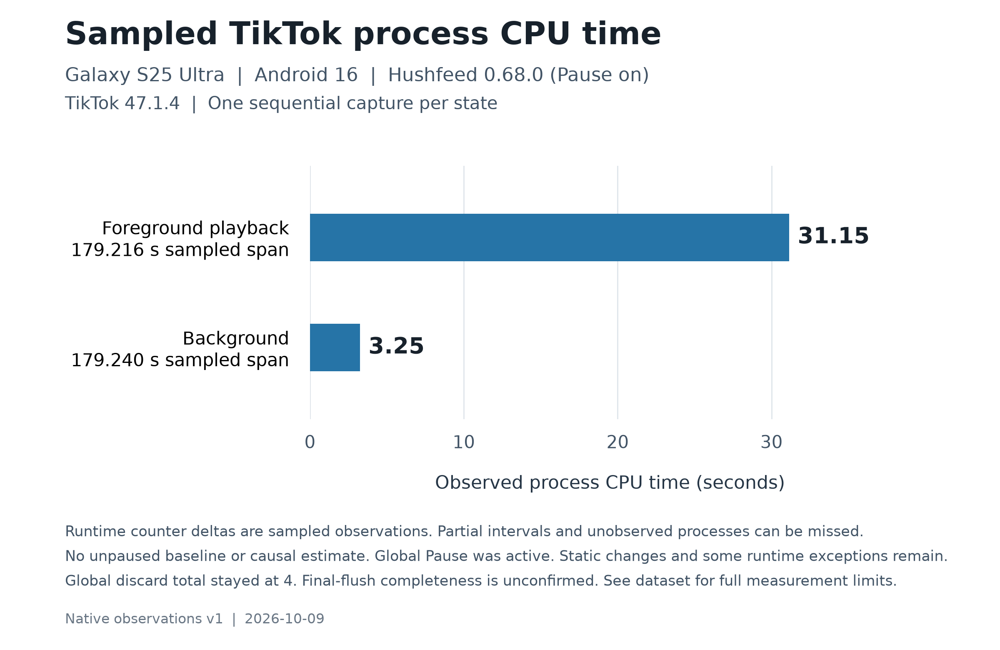

# TikTok runtime observation, October 9, 2026

This observation used TikTok 47.1.4 with Hushfeed 0.68.0 installed on Android 16. `Pause Hushfeed` was enabled and verified after restarting the app. The correct baseline label is **patched APK, runtime paused**. Static APK changes can survive Pause, and their full installed inventory has not been established.

The source review covers Hushfeed 0.70.0. Its controls explain possible mechanisms to investigate, but these measurements do not validate that version. They also don't compare an authentic factory APK with an enabled Hushfeed build.

## Installed build and comparison limits

| Property | Observed installation |
|---|---|
| Phone | Samsung Galaxy S25 Ultra, SM-S938B |
| Android | Android 16, API 36, build S938BXXUACZF1 |
| Package | `com.zhiliaoapp.musically`, Android user 0 |
| TikTok version | 47.1.4, target SDK 36 |
| Installed version code | 2147483647, the applied update-offer override |
| Original target code recorded in build metadata | 2024701040 |
| Hushfeed bundle recorded in the APK | 0.68.0 |
| Source recorded in the APK | [05edd439483d8e3bd331905b82aee7317ba5e754](https://github.com/SysAdminDoc/HushFeed/tree/05edd439483d8e3bd331905b82aee7317ba5e754), clean source |
| Patcher recorded in the APK | 1.15.1 |
| Effective runtime state | Pause enabled and confirmed after a setup restart |
| Logging | Persistent diagnostics and timed logging off |
| Route outside packet capture | Wi-Fi, with a wireless ADB connection retained |
| Power during accepted intervals | Physically unplugged, battery service reporting discharging |

The APK's `assets/hushfeed-build-v1.txt` records AMOLED black, retained language packs and native locales, and stripped `tool_p2p_relay`, `tool_core_assets`, `tool_creation` and `tool_live_extras` groups. Those removals and the version-code change remain while runtime controls are paused. This metadata isn't a complete patch-selection manifest. Don't fill its gaps from the current default patch list or a settings backup.

The installed 0.68.0 build also predates changes in the reviewed 0.70.0 source. Selected motion, contact, location, clipboard, installed-app and search-history controls had different defaults in 0.68.0. Its early device-access guards could refuse access before the extension context existed, while the current guards let that early call continue. A paused cold start therefore isn't proof of original startup behavior. Later profiling-asset removal and LIVE or player fixes must not be credited to this older APK.

The account and saved settings were preserved. There was no data clear, reinstall or signing-key change. The first setup restart applied Pause before collection. Measurements did not use a force-stopped app as a background baseline. Adaptive brightness, the existing screen timeout and power-saving settings were left in place, so this isn't a controlled display-energy comparison.

The For You screen showed the normal five bottom tabs, a floating **Free gift** promotion, a Shop tab badge and a related-search strip. These are current-build UI observations from a modified APK. No promotion, suggested profile or social action was opened. Raw screenshots and account content stay private. The separate [app audit](tiktok-app-audit.md) records the earlier official 38.3.3 onboarding and signed-in pass.

The [original 47.1.4 manifest review](tiktok-app-audit.md#original-4714-manifest-and-resource-review) records the signed fixture's permissions, exported components, SDK declarations and network policy. That static fixture was not the installed measurement artifact.

## Current-build settings UI

A read-only settings pass at 22:57 to 22:59 UTC followed the measurements. It used the same modified TikTok 47.1.4 installation with Hushfeed 0.68.0 paused. Fresh UI hierarchy captures showed these routes.

| Screen | Visible headings or routes |
|---|---|
| Settings and privacy | Activity, Account, Visibility, Interactions, Content & Display, Cache & Cellular, Support & About, Login |
| Content preferences | Filter keywords, Restricted Mode, STEM feed, Manage topics, Refresh your For You feed, Muted accounts |
| Ads, titled **Plan and ads** | Manage ad topics, Edit personal details, Mute advertisers, Share feedback, Targeted ads outside of TikTok, Targeted ads, Disconnect advertisers, Clear off-TikTok data |

The two targeted-ad rows describe ads outside TikTok and ads shown inside TikTok. The six content-preference rows and the listed ad controls were observed without opening their action pages or changing them. Account preference values and counts are omitted. The account was preserved, and raw screenshots and UI captures remain private.

TikTok's native Ads route opened `AdPersonalizationActivity`, the same activity reused by Hushfeed settings. The native route carried TikTok's ads-page intent data, while the Hushfeed route used the `morphe_settings` action. Record the visible screen and launch intent together, as described in the [settings implementation notes](patch-development.md#how-the-in-app-settings-connect). An earlier direct shell launch was denied because the activity wasn't exported. Opening it through TikTok's own settings route worked.

## Conditions and timing

The foreground observation began with an ordinary For You video playing. No UI input was issued during its native capture. Home was pressed at about 22:04:01 UTC for the background observation. The display remained on during both completed phases. Saved power boundaries show AC, USB, wireless and dock power disconnected. Battery service reported discharging.

All times below are UTC on October 9, 2026. Host command times bracket collection. They are not exact kernel sampling boundaries.

| Native capture | Capture command window | Command duration | Recorded trace span |
|---|---|---:|---:|
| Foreground | 22:00:52.472367 to 22:03:52.624061 | 180.151694 s | 179.218868890 s |
| Background | 22:04:07.482905 to 22:07:07.634602 | 180.151697 s | 179.297706286 s |

| Counter readout | Before readout window | After readout window | Start-to-start interval |
|---|---|---|---:|
| Foreground network | 22:00:47.714459 to 22:00:48.032824 | 22:03:57.834872 to 22:03:58.192866 | 190.120413 s |
| Foreground BatteryStats | 22:00:48.032824 to 22:00:48.434799 | 22:03:58.192866 to 22:03:58.649026 | 190.160042 s |
| Background network | 22:04:02.622013 to 22:04:02.984305 | 22:09:11.817449 to 22:09:12.047490 | 309.195436 s |
| Background BatteryStats | 22:04:02.984305 to 22:04:03.394818 | 22:09:12.048489 to 22:09:12.432009 | 309.064184 s |

Whole snapshot start-to-start intervals were 190.053357 seconds foreground and 309.181341 seconds background. Forced network polling succeeded before each network readout. The compared BatteryStats dumps retain the same statistics epoch.

The background after-snapshot was delayed. Its network readout began 124.182847 seconds after the native capture command ended. The 309-second counter changes must not be assigned to the 180-second capture. Messenger was in the foreground by 22:09:24. The reason and exact transition time are unknown, so the later transition is mixed activity. It doesn't establish that another app was active during the earlier native capture, or that the entire wider interval remained on the home screen.

## Native CPU and whole-phone battery samples

| Measurement | Foreground | Background |
|---|---:|---:|
| Observed app-process CPU | 31.150 s | 3.250 s |
| User CPU | 20.610 s | 2.170 s |
| Kernel CPU | 10.540 s | 1.080 s |
| CPU sample endpoint span | 179.216001911 s | 179.240032119 s |
| Whole-phone charge decrease | 9.8 mAh | 9.8 mAh |
| Charge sample endpoint span | 179.211639463 s | 179.297706286 s |
| Battery level | 77% to 76% | 76% to 76% |
| Battery temperature at boundaries | 87.44°F to 87.80°F | 87.80°F to 87.62°F |

Each native phase contains one observed app process, with 181 samples for each CPU counter and 180 complete sample intervals. No decreasing CPU counter step was found. These are sampled process-runtime totals. Partial endpoints, short-lived processes and unobserved work can be missed. They are not scheduler-complete CPU totals for the requested 180 seconds.

CPU time sums execution across threads. It isn't elapsed playback time or utilization of the whole processor. Work in shared media, graphics or system services can sit outside the observed app process. A decoder change needs those other workloads checked as well.

Both charge series contain 181 samples but only three distinct charge values. The 9.8 mAh values are recorded whole-phone charge-counter decreases. They include other phone activity and collection overhead. Equal short-run counter decreases don't establish equal power use, and they cannot establish patch savings.

The arithmetic mean of sampled whole-phone discharge current was about 227.86 mA foreground and 131.71 mA background. These are sample means, not continuous or time-weighted measurements. Temperature was collected at boundaries only.

The [native dataset](assets/runtime-2026-10-09/native-observations.v1.json) keeps exact sample timing and trace digests. The [SVG chart](assets/runtime-2026-10-09/native-sampled-cpu.svg) is available for reuse. These are observations from two different app states, not a patch-on versus patch-off experiment.

## Wider app counter differences

| Counter change | Foreground counter window | Background counter window |
|---|---:|---:|
| Wi-Fi received | 4,528,571 bytes in 3,518 packets | 8,277 bytes in 48 packets |
| Wi-Fi sent | 264,455 bytes in 1,302 packets | 25,272 bytes in 68 packets |
| Android network accounting set | FOREGROUND | DEFAULT |
| Other accounting set byte change | 0 | 0 |
| App CPU | 32.962 s | 3.326 s |
| User CPU | 22.104 s | 2.199 s |
| Kernel CPU | 10.858 s | 1.127 s |
| App foreground/top timer | 190.207 s | 0 s |
| App background-state timer | 0 s | 58.062 s |
| App cached-state timer | 0 s | 251.010 s |
| System screen-on timer | 190.207 s | 309.072 s |
| System battery screen-off timer | 0 s | 0 s |
| App full-wakelock timer | 190.207 s | 0 s |
| App partial-wakelock timer | 0 s | 0 s |
| Wi-Fi access-point wakeups | 0 | 0 |

The network parser uses the target app's untagged UID histories and preserves foreground and background sets separately. It excludes tagged subtotals and checks for missing or decreasing history buckets. These comparisons found no reset or changing transport-overlap indication. The resulting byte sums are Android counter differences, not an independently verified count of unique packets on the wire. They don't identify destinations, request purpose or energy cost.

The foreground full-wakelock growth matches the screen and foreground timers. It should not be described as a background partial-wakelock leak. The same app process remained present through both pairs of snapshots, with no new retained exit record.

Whole-phone battery-service charge readouts fell 9.8 mAh across the foreground pair and 14.7 mAh across the background pair. Their own readout start-to-start intervals were 190.061697 and 309.154495 seconds. Android's rounded app energy estimate changed from 765 to 776 mAh foreground, an increase of 11 mAh, and from 776 to 780 mAh background, an increase of 4 mAh. Those modeled app estimates must stay separate from the measured whole-phone charge-counter differences.

In particular, the background native trace recorded 9.8 mAh over roughly 179 seconds of charge samples. The later snapshot comparison recorded 14.7 mAh over roughly 309 seconds. These are different windows, not conflicting measurements.

## Sensors, scheduled work and lifecycle

The foreground snapshots show an ambient-light sensor connection with a requested 200,000 microsecond sampling period, nominally 5 Hz. Its BatteryStats active timer increased 190.207 seconds. The historical accelerometer timer did not increase. Sensorservice recorded a successful ambient-light disable at about 22:04:01 UTC, after Home. No target sensor connection remained at either background boundary, and neither sensor timer increased in the background pair.

A listener registration, sensorservice active state and BatteryStats sensor timer are different evidence. None directly counts delivered callbacks or measures their CPU cost. The ambient-light finding is also outside the six motion-sensor types covered by the examined 0.70.0 motion block. It isn't evidence that a motion block failed, and Pause was effective during this observation.

The retained job counter stayed at one historical execution with 906 milliseconds of runtime and one successful completion. Neither phase added execution time, starts or completions to that counter. No target execution-history entry, active job, registered job header or alarm package record appeared in either pair. These results describe retained counters and bounded histories. They don't prove every possible background mechanism was idle.

A started push service was present at the background baseline and absent at the later snapshot. The app's state moved from active service to a cached state while its process remained. A service registration alone doesn't establish continuous execution or power cost.

## Trace coverage and source interpretation

CPU and battery sampling are available in these native captures. Network packet data and power-rail samples are unavailable, so absent rows cannot be reported as zero activity or zero energy.

Both summaries contain the global cumulative discarded-chunk value 4. It remained unchanged through the recorded service-stat snapshots. That doesn't establish lossless traces. The last retained service statistics show 18 requested flushes and 17 completed flushes, with no failed flush recorded. A fully completed final flush is not established by those snapshots. Preserve these limits with the measured sample coverage.

The current source review supplies specific hypotheses for further comparisons.

- `Stop analytics and tracking` guards selected collectors and senders. It doesn't cover every network client or establish that all telemetry has stopped.
- `Stop recording watch history` changes covered view-report creation and flushing, including a feed-pause path. Bytes alone can't identify such reports.
- `Block motion sensors` covers accelerometer, gyroscope, magnetic field, rotation vector, linear acceleration and gravity registrations. Ambient light is a different type, and the guard doesn't unregister listeners already active.
- Static options, including preload and relay changes, can remain in a paused APK. Their installed selection must be established before interpreting a comparison.

Request diagnostics, when available, also cover a narrower path than total network traffic. A host name or source-code endpoint string alone doesn't identify an observed connection's payload purpose. No endpoint or telemetry classification has been established by these native counters.

This is an observation of a paused 0.68.0 installation. No causal drain reduction, enabled-patch benefit or 0.70.0 runtime result can be calculated from the completed phases.

## Screen-off observation

### Quiet collection with mixed screen activity

The installed APK was TikTok 47.1.4 with Hushfeed 0.68.0. Runtime Pause remained enabled after the verified restart. The source review covers Hushfeed 0.70.0, so these measurements describe the installed build. They aren't a stock-build comparison.

The runner issued no device commands or capture during its 1,800.006615-second quiet interval. Wireless debugging stayed connected. The battery charge counter fell from 3,724,000 to 3,679,900 microampere-hours, a whole-phone decrease of **44.1 mAh**. Both readings showed 75%, discharging status and all external-power flags off. Temperature fell from 86.36°F to 83.12°F, while voltage changed from 4.093 V to 4.083 V.

| Measurement window, October 9, 2026 UTC | Start | End | Elapsed |
|---|---|---|---:|
| Quiet runner | 22:24:51.917614 | 22:54:51.924229 | 1,800.006615 s |
| Minimal battery command starts | 22:24:51.466312 | 22:54:51.924229 | 1,800.457917 s |
| Full snapshot starts | 22:23:48.111585 | 22:54:52.548385 | 1,864.436800 s |
| BatteryStats command starts | 22:23:49.103185 | 22:54:53.720428 | 1,864.617243 s |
| Network-history command starts | 22:23:48.743080 | 22:54:53.200146 | 1,864.457066 s |

The battery commands bracket a possible readout separation of 1,800.141863 to 1,800.696927 seconds. Their start-to-start interval gives an endpoint-derived whole-phone mean of about **88.18 mA**. The exact hardware sampling instants aren't known. Counter resolution and measurement uncertainty weren't characterized with an external meter. This value describes this interval's mixed screen activity, not an app drain rate or deep-idle benchmark.

**The phone wasn't continuously screen-off.** The wider BatteryStats interval accumulated 601.867 seconds of screen-on time and 601.830 seconds of interactive time, despite both endpoint power snapshots saying Dozing. Its roughly 65 extra seconds cannot account for all that screen activity. The saved evidence doesn't establish what woke the screen.

| Whole-phone counter growth in the wider BatteryStats interval | Time |
|---|---:|
| Total realtime and on-battery realtime, each | 1,864.639 s |
| Screen on | 601.867 s |
| Screen off | 1,262.772 s |
| Uptime | 942.191 s |
| Light-idle mode | 1,036.148 s |
| Light-idling | 1,041.186 s |
| Full-idle mode, full-idling and screen-doze, each | 0 s |
| Global partial wakelock | 12.900 s |

Idle categories can overlap. They shouldn't be added as disjoint durations. The final deep-idle state was INACTIVE and the final light-idle state was IDLE. The retained battery power-event list was unchanged, with its latest event a disconnection at 22:16:26.704 UTC. This agrees with the unpowered endpoints and equal on-battery and total realtime, but it remains a bounded event log.

BatteryStats target CPU counters increased by **5 ms** in the wider interval, comprising 3 ms user time and 2 ms kernel time. Its entire 1,864.639 seconds of process-state growth was cached time. Parsed Wi-Fi and historical VPN counters each changed by zero bytes and zero packets. Target wakelock and sensor timers didn't increase. Historical job execution/completion and six service lifecycle records were unchanged. There were no target scheduled or active jobs, running service records, sensor connections or alarm records at either endpoint. Matching process identities and retained exit histories support no observed lifecycle change, not proof that every transient event was captured.

Android's rounded cumulative app energy estimate rose from 789 to 793 mAh over the wider interval. That **4 mAh estimate** is separate from the **44.1 mAh measured whole-phone charge decrease**. These observations don't establish the app's share of discharge or any battery saving caused by a patch. Unchanged counters also don't prove zero app energy use.

The [quiet-observation dataset](assets/runtime-2026-10-09/quiet-observations.v1.json) retains all command windows, endpoint conditions, counter deltas and SHA-256 hashes for the 42 private raw source files. Raw dumps and identifying device or account data are excluded.

### Excluded transition trace

An earlier attempt is retained privately as a diagnostic, outside the accepted phase totals. It began while another app was foreground, then entered Samsung's dozing state after Home and the sleep command. USB charging later resumed. Its net charge change mixes discharge and charging and is unsuitable for a drain comparison.

That trace also exposed a timing trap. A requested 300 seconds covered about 389.460 seconds of `CLOCK_BOOTTIME` but 299.963 seconds of `CLOCK_MONOTONIC`, including 89.498 seconds suspended. The original configuration used Perfetto's default active-time duration. A nominal wall-clock timeout did not cleanly bound the resulting host operation. The trace contains sample gaps of about nine seconds and a sustained charging reversal near 22:14:46.658 UTC.

The [protocol now documents suspend-aware duration](runtime-observation.md#trace-duration-during-suspend). The corrected configuration was checked locally against the supported schema, but was not validated by another device trace in this audit. A separate quiet collection supplies the later unplugged battery evidence, with its mixed screen activity reported above.

## Packet capture and destination evidence

A separate PCAPdroid VPN capture selected TikTok. The verified VPN allowlist included the app and its SDK sandbox. Capture settings used IPv4 and IPv6, without root capture, TLS decryption or QUIC blocking. This is a different measurement setup from the earlier native traces. The feed received two ordinary vertical swipes at about 22:19:43 and 22:20:34 UTC, with no other feed interaction during the measured foreground phase.

Capture started at about 22:18:00 UTC. Stop was requested at about 22:22:31, but capture continued until the stop approval at about 22:23:29. The service was absent and the VPN was disabled by 22:23:37. Packet timestamps cover a narrower span than those control actions. The first saved packet is at 22:19:10.163024 and the last at 22:22:00.911772. Those packet endpoints don't establish the capture's full uptime or prove there was no traffic outside the saved records.

The file contains 3,564 complete raw-IP records, all IPv4, in 7,514,838 file bytes. Packet bytes total 7,457,790, including IP and transport headers. Observed transport payload totals 7,334,202 bytes. These counts include both directions and retransmissions. File, packet and payload bytes are different quantities, and none is a count of unique application requests.

### Matched packet windows

Packet filters use the successful network readout start times, inclusive at the beginning and exclusive at the end. Readout times bracket collection and are not exact kernel polling instants.

| Phase | UTC filter on October 9, 2026 | Filter duration | Selected packets | Captured IP packet bytes |
|---|---|---:|---:|---:|
| Foreground | 22:19:06.927580 to 22:20:53.719642 | 106.792062 s | 3,375 | 7,374,486 |
| Background | 22:20:56.280197 to 22:22:28.871288 | 92.591091 s | 118 | 32,705 |

The selected foreground packet timestamps run from 22:19:10.163024 to 22:20:50.111921. Background packet timestamps run from 22:20:56.570995 to 22:22:00.911772. Another 71 saved packets fall between the two filters. Neither phase should be relabeled as a full 180-second observation.

| App counter row | Received bytes | Received packets | Sent bytes | Sent packets |
|---|---:|---:|---:|---:|
| Foreground VPN, FOREGROUND set | 7,084,473 | 1,995 | 308,589 | 1,387 |
| Foreground Wi-Fi, FOREGROUND set | 7,084,473 | 1,994 | 290,523 | 1,375 |
| Background VPN, DEFAULT set | 6,994 | 54 | 25,711 | 64 |
| Background Wi-Fi, DEFAULT set | 6,994 | 54 | 25,615 | 61 |

The other accounting set did not grow in either phase. VPN and Wi-Fi rows both changed, so the parser marks both intervals as ambiguous transport accounting and withholds a combined total. Adding these rows can count the same traffic twice. No history decrease or disappearance was detected. The SDK sandbox had no matching history row in these dumps, which does not establish zero sandbox traffic.

The background packet-byte total happens to equal the sum of that phase's VPN received and sent counters. The foreground packet total differs from its VPN counters by 18,576 bytes and seven packets. Collection timing and different accounting surfaces limit direct reconciliation. Neither agreement nor disagreement proves complete capture coverage.

### Visible domains

The whole file and foreground slice contain 34 cleartext DNS questions across 17 hostnames, plus 19 visible TLS ClientHello messages across 11 server names. The table groups those names by domain. Query and handshake counts are metadata observations, not request counts or proof of successful transfers.

| Domain | Hostnames in DNS | DNS questions | Hostnames in visible SNI | ClientHello messages |
|---|---:|---:|---:|---:|
| `tiktokv.us` | 8 | 16 | 6 | 10 |
| `tiktokcdn-us.com` | 6 | 12 | 4 | 8 |
| `appsflyersdk.com` | 1 | 2 | 1 | 1 |
| `ibyteimg.com` | 1 | 2 | 0 | 0 |
| `akamai.net` | 1 | 2 | 0 | 0 |

Visible SNI includes `log-dr16-normal-useast5.tiktokv.us` and `log-dr16-normal-useast8.tiktokv.us`, alongside API, frontier and media-style names. These names identify advertised destinations. They do not reveal HTTP paths, posted fields or payload purpose. A log-style name or the presence of `appsflyersdk.com` alone cannot establish an advertising request, a particular tracking event, or a failed privacy control. Runtime Pause remained the baseline for this observation.

AppsFlyer's [SDK integration guide](https://dev.appsflyer.com/hc/docs/sdk-integration) describes app attribution as a purpose of its SDK. Hushfeed's [telemetry patch](../patches/src/main/kotlin/app/morphe/patches/tiktok/misc/telemetry/DisableTelemetryPatch.kt#L101) guards named AppsFlyer initialization and event paths. Together, that source and the observed SDK-family destination make this a useful lead for a controlled tracking check. They still don't identify the encrypted event or show whether a privacy switch would block it. The request-count feature covers TikTok's Retrofit path and excludes third-party SDK clients, so its count is not a substitute for this capture.

The background slice contains 118 packets but no new DNS question or visible TLS hostname. Four directional TCP streams lack an observed SYN and don't begin with an initial TLS handshake in that slice. Existing encrypted connections can continue without another DNS lookup or ClientHello. Background destinations therefore remain unclassified by this slice's DNS/SNI evidence. Shared IP addresses are not used to assign them a domain.

### Parsing limits

All three parses, whole file, foreground and background, completed without recorded parse failures. The whole file and foreground slice each omit 58 DNS answer records outside the parser's A/AAAA answer scope. Three directional TCP streams reached the bounded reassembly limit. The background slice reports four streams without an observed SYN and four without an initial TLS handshake. These categories can describe the same streams and must not be added as separate connection counts.

The file contains 1,934 TCP and 1,630 UDP packets. Of the UDP packets, 1,562 use port 443, including 1,427 in the foreground slice and 92 in the background slice. The parser does not decode QUIC, so port 443 alone is not labeled as a confirmed QUIC session or a named destination.

Encrypted payloads, QUIC, encrypted DNS and ECH inner names remain unavailable. Filtering before TCP reassembly can also cut through a handshake. Missing DNS/SNI is not evidence that a domain was absent. App attribution comes from the separately verified capture selection and VPN policy, since raw packet records do not independently prove UID ownership.

The [sanitized packet dataset](assets/runtime-2026-10-09/packet-observations.v1.json) preserves aggregate counts and domain groups without raw addresses or payloads.

This capture establishes visible destination metadata and measured packet activity under the selected configuration. It does not establish how much traffic was advertising or telemetry, what would have happened with privacy controls enabled, or how much battery those requests consumed.

## What these results support

The accepted samples establish that the observed installation transfers data, uses CPU and registers an ambient-light listener during a foreground feed session. The wider background counters still increase after Home, while the light listener has been released. Neither counter set identifies a payload as an ad, telemetry or a watch-history report.

No matched enabled-versus-paused comparison was made. There is no measured battery benefit for an individual switch, no official 47.1.4 factory baseline, and no runtime acceptance result for Hushfeed 0.70.0. Keep those checks open. A different video, cached media, display mode or server response can change the workload without a patch change.

## Patch opportunities and follow-up checks

| Area | Evidence from this audit | Next useful check |
|---|---|---|
| Pause wording | A paused APK retains removed files and changed metadata. Some startup guards differ between installed and current source | Make the in-app explanation distinguish runtime Pause from restoring an official APK. Keep its state in every diagnostic export |
| Build provenance | The APK records selected static groups but not every applied patch and option | Record a bounded, nonsecret patch-selection manifest at patch time, with the source version and target identity. Don't infer an old selection from today's defaults |
| Sensor diagnostics | Ambient light was registered at a requested 5 Hz and released after Home | Identify its call site and purpose on the declared target. Count actual callbacks and compare equal content before proposing another sensor switch |
| Background transfers | DEFAULT-set bytes increased without new retained job or partial-wakelock counters | Correlate a bounded trace with app request diagnostics and visible connection metadata. Preserve DNS and handshake coverage across the Home transition |
| Ad filtering and transport | Existing hooks often remove items after a response arrives | Compare a confirmed ad route with its control on and off. Record both the rendered result and actual transfer evidence. Don't equate hiding a card with stopping delivery or impression reporting |
| Playback cost | Foreground CPU and audio accounting increased, while the video power timer didn't | Verify player and decoder activity directly. Compare the same media and codec on the same phone. An unchanged video timer isn't evidence that decoding stopped |
| Packet accounting | A capture VPN can produce both VPN and underlying Wi-Fi histories | Keep per-transport observations and packet-capture bytes separate. A parser must refuse an ambiguous unique-byte total |
| Power claims | Short battery samples changed in coarse steps and include other phone activity | Repeat matched, unpowered runs with fixed content and recorded screen conditions. Use whole-phone charge and app estimates as separate measurements |

The [measurement protocol](runtime-observation.md) maps these hypotheses to current source. [ROADMAP.md](../ROADMAP.md) remains the work tracker. This report records evidence and acceptance ideas, not a claim that these changes have been implemented.

## Device restoration

After measurement, Pause was turned off and TikTok was restarted. The status page confirmed Hushfeed 0.68.0 active on TikTok 47.1.4. The original adaptive-brightness mode, screen timeout and power settings were verified. The capture service had stopped, and owned temporary capture files were copied and hash-checked before removal from the phone. The temporary wireless ADB listener was closed after switching back to USB mode. Accounts, app data and signing keys were preserved.
