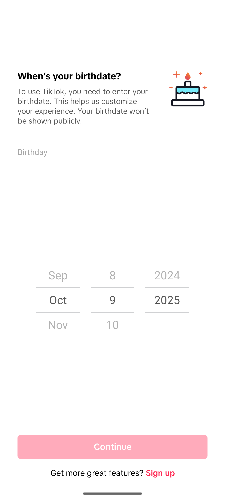
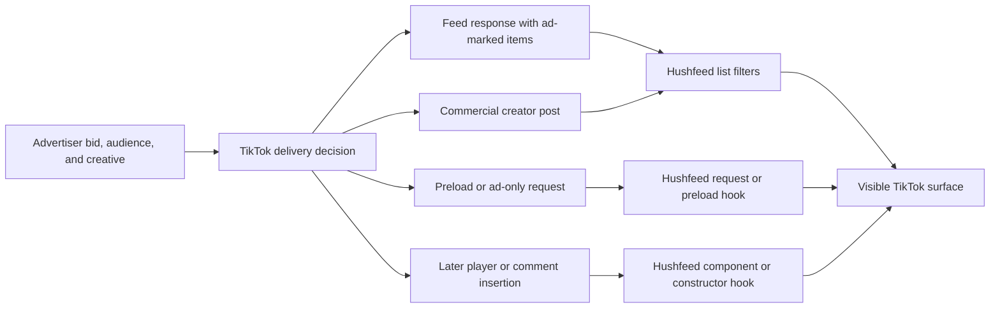

# TikTok app audit for Hushfeed patch work

This audit records what an unpatched factory install showed during onboarding and a later signed-in check, what the original 47.1.4 manifest declares, what Hushfeed's supported-build source proves about delivery and tracking paths, and where future patch work could improve control or diagnostics. It is a working reference for maintainers. It does not claim that every screen or server behavior was observed.

Reviewed on 2026-10-09 against Hushfeed 0.70.0 source. The supported target in this checkout is global TikTok 47.1.4, version code 2024701040. The clean factory APK used for the first-run check was TikTok 38.3.3, version code 2023803030. The older APK was installed into a separate emulator data image and was not patched. It is useful for onboarding observations only, not for checking patch anchors.

| Build | Verified identity |
| --- | --- |
| Clean factory app | Package com.zhiliaoapp.musically, version 38.3.3, code 2023803030, min SDK 21, target SDK 34, 429,047,484 bytes |
| Factory APK digest | SHA-256 AB8D9394D87CA046BDA8F49031791CFAF75588A0830B5D54766E1BCF8CCDD6BC |
| APK signer | SHA-256 9041803e91bcb814b4b4399fb5c85a91640b755e5e8ba76813814bf4cf2ab5ba, matching the signer recorded for the supported target |
| Supported Hushfeed target | Global TikTok 47.1.4, version code 2024701040 |

## Evidence and limits

| Label | Meaning in this document |
| --- | --- |
| **Observed** | Captured directly in the isolated, unpatched TikTok 38.3.3 install, including onboarding and a user-authorized signed-in session |
| **APK confirmed** | Read from the original signed 47.1.4 fixture, without executing it |
| **Source confirmed** | Implemented or described in the current Hushfeed source for the declared 47.1.4 target |
| **TikTok published** | Described in a first-party TikTok policy, help page, or business resource |
| **Needs a live check** | The code or policy gives a strong lead, but a current signed-in target session is needed to confirm delivery or presentation |

The clean install first stopped at the birthday gate. The account holder later completed sign-in on the visible emulator. The signed-in pass inspected the For You feed, Profile, Settings and privacy, Ads, the ad-topic page, Content preferences, Privacy, account suggestions, and contact and Facebook sync controls. One in-feed ad appeared in a short feed sample. No ad action was opened, no like, follow, comment, or share was made, no preference was changed, and no synced data was removed. We did not capture or decode network traffic. One account session cannot establish ad frequency or explain why TikTok selected that ad. Account credentials, identifiers, feed content, inferred topic values, and personal preference values are intentionally omitted.

The first-run observations are version-specific. TikTok's UI and server responses change independently of Hushfeed's patch source. Recheck the app after each supported-target move.

The [network and power measurement protocol](runtime-observation.md) documents how to collect physical-device evidence and interpret it against the patch source. It includes traffic-counter checks, destination metadata, background execution and quiet battery intervals. The later [physical-device results](runtime-results-2026-10-09.md) contain actual network and power observations from TikTok 47.1.4 with Hushfeed 0.68.0 paused. That remains a modified APK and is separate from the factory 38.3.3 observations here.

## First-run flow

1. The clean app first displayed an account-entry screen. It offered Skip, phone or email, Facebook, Google, and Log in. No account action was taken.
2. On a later launch, TikTok opened its birthday gate. The screen says the date is needed to use TikTok, says it helps customize the experience, and promises it will not be shown publicly.
3. The date wheel initially showed October 9, 2025. The Continue button was disabled in the accessibility tree. The screen exposed a Birthday field and month, day, and year picker labels. A Sign up action remained available at the bottom.
4. The clean onboarding pass ended at the birthday gate. The account holder later completed onboarding and sign-in in a separate visible pass. The resulting feed and settings observations are recorded below.

### UX and accessibility notes

The explanation is short and gives a privacy reassurance next to the date request. The date wheels are visually clear, and the automation tree exposes the Birthday field and month, day, and year labels.

The initial wheel value is under age 13 relative to the audit date, and Continue is disabled. The screen does not show a nearby explanation for the disabled action. That creates a small first-use hurdle because the person has to infer that changing the year is required. Confirm whether the app intentionally uses this default on a current install.

The screenshot alone cannot establish TalkBack reading order, spoken date values, focus movement between picker columns, text scaling, or exact contrast ratios. Those checks remain open. The pale disabled button and the pink Sign up label are worth measuring at the device's default scale before calling them accessibility failures.

## Signed-in surfaces and ad controls

The logged-in For You screen used a full-screen vertical feed. Its top row exposed LIVE, Explore, Following, Shop, For You, and Search. The bottom row exposed Home, Friends, Create, Inbox, and Profile. A post placed its creator and description near the bottom, with follow, like, comment, save, and share controls along the right edge. A search suggestion strip could appear above the bottom navigation.

During a short scroll sample, a full-screen video ad appeared in the same feed stack as creator posts. The observed ad showed a verified-advertiser marker, an Ad disclosure, and a Shop now button along the bottom. The button was not tapped. This confirms one presentation route in this session only. It does not establish a fixed ratio, schedule, or targeting cause.

Settings and privacy exposed an Ads page with How your ads are personalized, Mute advertisers, Share feedback, Targeted ads outside of TikTok, Targeted ads, and Clear off-TikTok data. The page explains that off-TikTok targeting controls ads partners ask TikTok to show on other sites and apps. Its Targeted ads copy says TikTok ads will still be based on in-app activity and other information in the privacy policy. These are ad-personalization controls, not an ad-free mode or a guarantee that ad requests stop.

How your ads are personalized separates Inferred by TikTok from Your choices, with Topics and Gender tabs. Its copy says changes can take up to 48 hours and do not affect whether TikTok can otherwise use collected information to personalize ads. The account's inferred topics and current settings are account-specific and are not recorded here.

The Privacy page groups Discoverability and Interactions controls. It exposes private-account and activity-status switches, account suggestions, contact and Facebook friend syncing, comment and mention audiences, direct messages, content reuse, profile display when sharing links, and downloads. Account suggestions have separate Contacts and Facebook friends sources. The sync page says phone contacts and Facebook friends may be synced periodically to help people find each other and get discovered. It also shows separate controls for removing previously synced contacts and Facebook friends, which the copy describes as removing server-side synced data and stopping sync across devices. No sync or removal control was changed.

Content preferences exposed Filter keywords, Restricted Mode, STEM feed, Manage topics, Refresh your For You feed, and Muted accounts. These overlap with feed filtering and topic controls, but their account values were left untouched. The live app surface can move or rename rows across versions, so use these observations as a versioned map, not a permanent UI contract.

## Original 47.1.4 manifest and resource review

This static pass covers the original declared-target TikTok 47.1.4 APK, package `com.zhiliaoapp.musically`, version code `2024701040`, min SDK 23 and target SDK 36. Its SHA-256 is `4226ed5d3031b68208c29f62d80ac421b281fc74201bc4163d98e442d0991a40`. Offline `apksigner` verification passed v1, v2 and v3 with one APK signer. The signer certificate SHA-256 is `9041803e91bcb814b4b4399fb5c85a91640b755e5e8ba76813814bf4cf2ab5ba`, matching the declared target certificate. The source stamp is separate from the APK signer.

The signer receipt contains 150 warning lines. There are 146 warnings about protection of `META-INF` JAR entries, including licenses, library version metadata and service descriptors. Four lines concern Java native access in the verification tool. Scheme verification succeeded despite those warnings. It doesn't establish that the artifact is warning-free or generally safe.

This fixture wasn't run for the measurements. The measured installed TikTok 47.1.4 artifact contains Hushfeed 0.68.0 with Pause enabled. The factory UI observation used a separate, unpatched 38.3.3 artifact. Keep those three identities attached to their evidence.

### Components and permission guards

The manifest declares 650 components. These counts distinguish literal `android:exported` values from an omitted attribute. They don't count components proven reachable at runtime.

| Component | Total | Exported true | Exported false | Attribute absent |
| --- | ---: | ---: | ---: | ---: |
| Activity | 498 | 30 | 57 | 411 |
| Activity alias | 2 | 2 | 0 | 0 |
| Service | 87 | 17 | 48 | 22 |
| Receiver | 52 | 12 | 37 | 3 |
| Provider | 11 | 6 | 5 | 0 |

Of the 67 explicit exported declarations, 18 have a component permission, read permission or write permission attribute. Five also declare `enabled=false`. One uses a resource-backed enabled value. There is no application-wide permission attribute. Preserve those distinctions when comparing a patched manifest.

The six exported providers deserve separate checks. `WallPaperDataProvider` uses the app's signature-level wallpaper permission. `OneTapLoginTokenProvider` and `AccountInfoProvider` declare the signature-level `WRITE_OTL_TOKEN` write permission, with no general or read permission attribute. `ExportedShellProvider`, `FacebookContentProvider` and `SecShareDataProvider` have none of those permission attributes. None of these six contains a nested `path-permission` or `grant-uri-permission` declaration. This is a review list, not evidence of readable account data. Check enabled state and caller validation in each implementation before describing reachability or access. [Android provider permission rules](https://developer.android.com/guide/topics/manifest/provider-element) explain the separate read, write and URI-grant controls.

Exported service guards include `BIND_JOB_SERVICE` for upload jobs and WorkManager, `BIND_QUICK_SETTINGS_TILE` for the two disabled tile services, and `BIND_WALLPAPER` for the wallpaper service. OEM push handlers declare their vendor permissions. `TiktokAuthService`, `NotifyService`, the Custom Tabs post-message service, Samsung's browser service and the Heytap data-message service have no component permission attribute. Receiver guards include Google and Amazon push sender permissions, `DUMP` for WorkManager diagnostics, and `INSTALL_PACKAGES` for the asset-pack receiver. The dataset retains every explicit exported declaration and its filters so a maintainer can inspect the exact entry points before changing them.

### Startup, push and SDK leads

The declarations include AppsFlyer's two install-referrer receivers, Firebase messaging and component-discovery services, Google measurement services, AndroidX startup and WorkManager components, OEM push handlers, and ByteDance message and WebSocket services. The startup provider lists `ProcessLifecycleInitializer`. `FirebaseInitProvider` is explicitly disabled. Some names match runtime investigation leads, but names alone don't prove that code ran.

Application metadata keys reference Google ads, Facebook integration and Firebase analytics. Values are omitted from the sanitized dataset. The fixture requests 65 permission entries with 64 unique names, including location, contacts, microphone, camera, media access, advertising ID and AdServices permissions. Those declarations don't establish grants or collection. It doesn't request `RECEIVE_BOOT_COMPLETED` or either exact-alarm permission, even though the WorkManager reschedule receiver includes a boot action. Keep permission and receiver checks together when maintaining background-work patches.

### Network and backup policy

`debuggable` and `testOnly` are absent. Android's default for `debuggable` is false. `usesCleartextTraffic=true` is present, but Android 7 and later use the referenced Network Security Configuration when one is supplied. [Application attribute rules](https://developer.android.com/guide/topics/manifest/application-element)

The decoded network XML permits cleartext in its base configuration and explicitly permits `zero-rating.tiktok.com` without subdomains. It denies cleartext for 52 listed domain suffixes, including `tiktok.com`, `tiktokv.com` and `tiktokcdn.com`. Its base system trust anchor explicitly sets `overridePins=true`. The base configuration disables certificate transparency, and the XML contains no `pin-set`. Its user-CA debug override applies only to debuggable builds. These are declared policies for clients that honor Android's configuration. They don't prove a cleartext transfer, enforcement by every networking stack, or absence of pinning in native or application code. Preserve the exact domain spellings when comparing changes. [Network Security Configuration](https://developer.android.com/privacy-and-security/security-config)

`allowBackup=true`, `fullBackupOnly=true` and a custom `AutoBackupAgent` are declared. The referenced legacy full-backup XML has one include, shared preferences file `tpc_sp.xml`, and no excludes. `dataExtractionRules` is absent. Actual cloud backup and device transfer still depend on Android version, device policy and the unreviewed backup-agent implementation. No backup or exposed file was observed.

### Package visibility and maintenance use

The query section lists 94 packages, 26 intent queries and one provider query. It doesn't request `QUERY_ALL_PACKAGES`. The list includes browser, sharing, login, payment and OEM integrations. Some queries use broad `VIEW` or sharing filters. These entries allow matching packages or handlers to be visible under Android's rules; they don't prove enumeration or an uploaded app inventory. A visibility patch should check share targets, browser selection and authentication flows before removing entries. [Package visibility declarations](https://developer.android.com/training/package-visibility/declaring)

Use this inventory as a baseline for a separate patched-artifact manifest comparison. Prioritize provider caller checks, exported intent handling, SDK startup controls and backup-agent behavior before making claims about their effects. No executable code was decompiled in this pass. The companion JSON contains code identifiers and source hashes, with embedded application identifiers redacted and metadata values omitted.

The [sanitized manifest dataset](assets/tiktok-47.1.4/manifest-observations.v1.json) preserves the permission list, exported entry points, SDK component inventory and decoded resource policy. Its source digests identify the exact inputs.

## How ad delivery appears to work

TikTok's business documentation describes auction ads as real-time bidding. Advertisers supply a bid strategy, creative, audience settings, and campaign structure. TikTok says its system dynamically optimizes delivery. This is a campaign-side description. It does not disclose a universal consumer feed cadence, so Hushfeed should not rely on a fixed rule such as one ad after every fixed number of videos. See [About Auction Ads](https://ads.tiktok.com/resources/help/article/about-auction-ads?lang=en), last updated April 2025.

At the app level, the key patching fact is that ads are not one kind of row. Hushfeed's 47.1.4 integration follows TikTok model objects, feed callbacks, preloads, and insertion components. Some items arrive inside an ordinary video list. Others arrive through a separate request or are spliced into a player after list filtering has finished.

| Surface or route | What the source shows | Hushfeed hook or setting | What to verify on the next target |
| --- | --- | --- | --- |
| For You video list | Ad material can be an Aweme with ordinary ad flags, soft-ad flags, a raw-ad object, or creator content marked as a pseudo ad | Feed filter checks the model and disclosure data before TikTok renders the list | Confirm the response and rendering callback still carry the same signals |
| Following feed | Its own presenter, list getter, and post-processing callbacks can refill a list after the first filter pass | Feed filter applies early and late passes to the Follow feed | Test each callback with a normal list, an all-filtered list, and a hydrated list |
| Friends tab | Its legacy and V3 feeds use different response objects and list fields. Neither is a `FeedItemList` | Separate hooks filter `friendFeedData` and `friendsV3Feeds` with the active content filters | Exercise both response shapes. Check LIVE Shop cards separately from video ads |
| Creator profile pager | TikTok has a separate profile-page ad request at /tiktok/v1/ad/profile_page/. Its answer can contain items inserted between a creator's videos | Remove feed ads can refuse the profile ad request before it is sent. A separate response filter handles profile detail ad events | Confirm the request gate and response event still cover the same profile route |
| Mid-roll replacement | A player component can replace the video already in the pager with an ad after list filters have run | A dedicated hook refuses the splice when Remove feed ads is on. The original video stays in place | Keep this hook separate from list tests. A feed list can look clean while this route remains active |
| Cold-start TopView | The feed response includes a preloadAds list that is handed to a splash ad service before the normal feed filter runs | Hushfeed empties this list at the read point, before the service handoff, and records the route even when the list is empty | Exercise a response with and without preloads. Verify the normal no-ad startup path still runs |
| Search Lynx cards | Some search cards are built from server patches and bypass the result list other search filters see | Search card bind hooks inspect the card schema. Existing setting hides mini-drama cards | Re-read both Top results binders and the regular Lynx card binder after a version move |
| TikTok Shop | Shop posts and product cards are separate from ordinary paid-video signals | Separate switches hide Shop feed posts, Shop search blocks, and some LIVE shopping | Verify each surface independently. Hiding a product card should not hide a normal video unless the user chose that policy |
| Lemon8 install card | The For You card uses a card-insert response with card type 9 and may carry none of the usual ad flags | Remove feed ads filters the card and can skip its insert request | Keep the card type contract version-specific and inspect server changes |
| Comment surprise animation | A campaign animation can be sent with a comment page or publish response. TikTok's own first-comment celebration uses the same data shape | Hide comment popup ads uses the origin and event type to remove campaign surprises while keeping TikTok's own celebrations | Test page, publish, and replay paths separately so a useful milestone is not suppressed |
| Floating event badge and inserted cards | These are built into the feed rather than delivered as ordinary video items | Separate settings hide floating promotions or inserted cards at their construction or bind site | Check event banners, friend recommendations, and other inserted cards one by one |
| Short-drama countdown | A short-drama advert can lock scrolling until a countdown finishes | Remove feed ads answers the blocking-ad check as false | Confirm the guard applies only to the ad lock and leaves ordinary drama playback intact |
| Branded and creator-commission posts | A creator's own video may be promoted, and commercial disclosure may live in commerce or anchor metadata rather than the ordinary ad flag | Ad detection checks pseudo-ad metadata, paid-partnership markers, commission disclosures, and promotional music | Keep metadata tests separate from ordinary ad flags. Do not classify by translated label text alone |

The core source map is [FeedFilterPatch.kt](../patches/src/main/kotlin/app/morphe/patches/tiktok/feedfilter/FeedFilterPatch.kt), [AdsFilter.java](../extensions/tiktok/src/main/java/app/morphe/extension/tiktok/feedfilter/AdsFilter.java), [FeedItemsFilter.java](../extensions/tiktok/src/main/java/app/morphe/extension/tiktok/feedfilter/FeedItemsFilter.java), [CardFilters.java](../extensions/tiktok/src/main/java/app/morphe/extension/tiktok/feedfilter/CardFilters.java), [SearchLynxCards.java](../extensions/tiktok/src/main/java/app/morphe/extension/tiktok/feedfilter/SearchLynxCards.java), and [CommentTools.java](../extensions/tiktok/src/main/java/app/morphe/extension/tiktok/comment/CommentTools.java).

This shows the patch boundaries, not a packet trace. TikTok's delivery decision and any impression or conversion reporting can use separate calls. This audit did not measure whether a hidden item caused an impression event.

### Detection details that matter

The main feed filter looks for TikTok's ad flag, soft-ad flag, and raw ad object. It also checks promotional music, pseudo-ad data on creator posts, the Lemon8 card type, local alliance disclosures, serialized creator commission text, and paid-partnership markers. A single check for isAd would miss meaningful commercial content.

The distinction between a paid partnership and an ordinary celebration matters in comments too. Hushfeed records where the surprise object was built and preserves TikTok's own first-comment celebration. A broad class-name or animation-name block would be easier to write and would also remove the legitimate celebration.

Hushfeed's Remove feed ads setting defaults on when the Feed filter patch is installed. Hide paid partnerships and Hide promotional music have their own switches, so a reader can turn the broad ad filter off and keep only those narrower rules. Shop in the feed and Shop in search are independent switches.

Filtering a response is not the same as preventing its delivery. The profile-page gate and Lemon8 request skip act before those requests. TopView is removed when its response field is read, and a mid-roll is refused at the later insertion point. Most ordinary feed filtering occurs after TikTok has received the feed response. Hiding an ad can therefore leave ad-request, delivery, or measurement traffic intact.

### Field reports and route coverage

The repository's issue history helps identify routes that were easy to miss. These reports concern the TikTok versions named by their authors, mostly 46.x. They are useful test leads, not proof that the same behavior occurs on 47.1.4.

| Report | What maintainers can take from it |
| --- | --- |
| [#162, native auction ads bypass feed filtering](https://github.com/icysymmetra/tiktok-patches-for-morphe/issues/162) | The discussion traces an ad that passed a downstream check because its raw-ad payload and server flags were handled separately from the ordinary ad predicate. A later profile-feed retest found that working list-filter logic still needed the shared `FeedItemList.getItems()` integration. Later v46.2.3/dev.11 reports described no ads during extended For You and profile scrolling, with a slight media-loading delay. Current Hushfeed source has the shared list hook plus distinct profile and Friends paths. Keep all three in the fixture and measure loading delay when changing the filter. |
| [#133, ads in Friends](https://github.com/icysymmetra/tiktok-patches-for-morphe/issues/133) | Friends has its own feed. A reporter later saw no ads on TikTok 46.2.3 with dev.11, but also noted that LIVE Shop cards remained. Verify the Friends legacy and V3 response hooks independently, then apply Shop-specific policy to LIVE commerce cards. |
| [#122, ads while browsing profiles](https://github.com/icysymmetra/tiktok-patches-for-morphe/issues/122) | The comments contain profile-feed reports across several development builds, with different results among users. This supports treating the profile endpoint, profile video list, and profile detail viewer as separate routes. A clean For You feed is not enough to call ad coverage complete. |
| [#50, sponsored cards in Search Top](https://github.com/icysymmetra/tiktok-patches-for-morphe/issues/50) | A later comment describes a native product-grid ad in Search > Top that did not pass through the normal `FeedItemList` filter. The reporter said it was removed on 46.2.3/dev.10. Keep Top mixed-grid and Lynx-card fixtures separate from video-list fixtures on each target move. |
| [#178, hotel-price cards](https://github.com/icysymmetra/tiktok-patches-for-morphe/issues/178) | The report describes a rare For You placement that compares hotel prices instead of showing a video or image. The thread does not yet include a feed-debugger capture taken while it is onscreen. [Roadmap_Blocked.md](../Roadmap_Blocked.md) tracks the missing schema evidence. Do not guess its model from its appearance. |
| [#130, paid partnerships](https://github.com/icysymmetra/tiktok-patches-for-morphe/issues/130) | Some readers consider creator-declared partnerships ads even when TikTok does not mark the post as a standard auction ad. Keep the separate partnership control and test it independently from raw-ad filtering. |
| [#109, profile-view tracking](https://github.com/icysymmetra/tiktok-patches-for-morphe/issues/109) | Hushfeed's Ghost mode blocks its outgoing profile-view report call. The incoming profile-view list is a separate path. Preserve that distinction and verify both directions on the supported build. |
| [#51, Disable Telemetry](https://github.com/icysymmetra/tiktok-patches-for-morphe/issues/51) | The request named AppLog, AppsFlyer, location uploads, Firebase, and crash reporting. Hushfeed now guards named calls in those families, but this does not make the setting a general API or SDK traffic blocker. Keep the setting description and diagnostics explicit about the covered calls. |

The exact open-issue count and comments change over time. Read each linked report before using it as acceptance evidence, and record the TikTok build, patch build, surface, response path, and observed result in any follow-up.

Three upstream pull requests were also open when this audit was written: [#166, raw ad and preload handling](https://github.com/icysymmetra/tiktok-patches-for-morphe/pull/166), [#170, story-view reporting](https://github.com/icysymmetra/tiktok-patches-for-morphe/pull/170), and [#171, profile-view reporting](https://github.com/icysymmetra/tiktok-patches-for-morphe/pull/171). Hushfeed's current source already has related work in `FeedItemsFilter` and Ghost mode. Compare the actual code, tests, and supported TikTok fingerprints before treating an upstream proposal as missing or copying it into this repo.

## Tracking and data surfaces

TikTok's [U.S. Privacy Policy](https://t.tiktok.com/legal/page/us/privacy-policy/en?lang=en) showed a last-updated date of July 15, 2026 when checked. It says TikTok may collect account and profile details, content and associated metadata, searches and viewing activity, IP and device information, advertising identifiers, keystroke patterns or rhythms, and approximate location inferred from device or network information such as the SIM card, IP address, or device settings. When Location Services are enabled, TikTok says it may collect approximate or precise location from the device. The policy also describes cookies and similar tools, including web beacons, for measuring content and page interactions.

The policy also describes audio and visual analysis of uploaded content, including objects, scenery, face or body features, and speech. It says TikTok may process faceprints or voiceprints where defined by U.S. law and where required will seek required permission. It describes receiving information from advertising partners about activity on other services, including pages viewed, purchases, or apps used. Ad identifiers, hashed contact details, and cookies can help measure ads and support advertising on TikTok or the TikTok Ad Network, depending on settings. These are policy disclosures, not collection observed in this audit. The policy is current as of the check date and does not establish what the older 38.3.3 binary collected.

The APK permission list and the policy describe different evidence. The manifest shows declared Android access. The current policy describes TikTok's stated platform practices. Neither establishes what requests the older 38.3.3 binary made during this audit.

The policy also says TikTok may receive information from a third-party login provider if a person chooses Facebook, Instagram, or Google sign-in, and may share activity with a connected third-party service depending on the chosen feature and permissions. Using a social login can therefore add another information-sharing path. Complete any such login in the visible app. Hushfeed does not need account credentials in source, logs, or a public audit.

TikTok's [off-TikTok data help page](https://support.tiktok.com/en/account-and-privacy/personalized-ads-and-data/control-your-off-tiktok-data) describes controls for disconnecting advertisers and clearing off-TikTok activity. TikTok's policy says its Ads setting can opt a person out of targeted ads based on personal information from nonaffiliated apps and websites. That changes one source used for ad personalization. It does not remove all ads or stop TikTok's use of activity on TikTok. TikTok's [recommendation explainer](https://support.tiktok.com/en/using-tiktok/exploring-videos/how-tiktok-recommends-content) separately describes how interactions such as viewing, liking, sharing, and following feed personalized surfaces.

The factory 38.3.3 APK manifest requests INTERNET, Google advertising ID and attribution permissions, install-referrer access, contacts, coarse location, camera, microphone, network state, and media access. A manifest entry proves the package declares a capability. It does not prove that the app accessed the data in this run, that the person granted a runtime permission, or that the current 47.1.4 manifest is identical.

TikTok's business material describes using app and website event signals for ad optimization, retargeting, and measurement. Advertisers can integrate TikTok Pixel or other event APIs. That is a separate path from on-device Android permissions. Blocking a phone contact query does not erase events already sent by a website pixel, and hiding an ad after a response does not remove the advertiser's campaign data.

The 38.3.3 package requested both Google Play advertising-ID access and Android's advertising-ID and attribution service permissions. It also requested install-referrer access. These declarations are a reason to include advertising identifiers and install attribution in a static review. They do not identify which SDK used each permission or prove a call was made.

### Hushfeed privacy controls and their scope

| Hushfeed item | What the code does | Patch selection and setting start | Important limit |
| --- | --- | --- | --- |
| Disable telemetry | Guards named AppLog events and flushes, AppsFlyer events, Firebase screen-name reporting, Npth crash reporting, and optional location-upload calls | Manager selects the patch by default. Its runtime switch starts off | This is a hook set, not a full network firewall. It does not suppress core content APIs or guarantee that every analytics or ad event is covered |
| Stop saving search history | Skips new local search-history writes | Patch is selected by default. Its runtime switch starts off | It leaves old entries alone and does not stop the search query from being sent to TikTok |
| Stop recording watch history | Skips TikTok's watched-video report call | Patch is selected by default. Its runtime switch starts off | Views stop counting and For You receives less watch feedback. Existing server-side history is not deleted |
| Ghost mode | Blocks outgoing profile-view and story-view reports, typing-status reports, and story play-stat reports. A separate child switch also blocks online-status updates | Runtime switch starts off. Hide online status is a separate switch under Ghost mode | Ordinary feed-video play stats still go through. This blocks selected outgoing calls; it does not remove data already stored by TikTok |
| Block contact list access | Returns an empty cursor for TikTok's contacts-provider queries | Patch is selected by default. Its runtime switch starts off | It does not stop a user from manually finding or following someone |
| Block installed-app scanning | Returns an empty list for inventory reads and launcher enumeration | Patch is selected by default. Its runtime switch starts off | Share-target and link-handler lookup still works |
| Block location | Returns no Android LocationManager result and drops location-update requests | Patch is selected by default. Its runtime switch starts off | IP and SIM-based region signals are separate. Region spoofing changes TikTok settings, not the network's real location |
| Block advertising ID | Returns a blank advertising ID and the limited-tracking answer to the hooked reads | Patch is selected by default. Its runtime switch starts off | Other identifiers and server-side account matching remain possible |
| Block clipboard reads | Returns empty or false results for intercepted clipboard calls | Patch is selected by default. Its runtime switch starts off | Copying a TikTok link still works |
| Hide VPN | Hides VPN transport and common tunnel interfaces from hooked calls | Patch is selected by default. Its runtime switch starts off | It changes what TikTok sees and can break features that check VPN state |
| Stop on-device AI profiling | Prevents TikTok's Pitaya on-device engine from starting through the hooked providers | Patch is not selected by default. It has no runtime switch | This does not turn off server-side recommendations or ad personalization |
| Network request report | Counts TikTok Retrofit calls by heuristic domain bucket and host kind, with request-body sizes | Patch is not selected by default | It does not count media downloads or other companies' SDK traffic, and does not record response bodies |
| In-app browser privacy guard | Keeps TikTok JavaScript bridges on trusted app pages and withholds them on external pages | Patch is selected by default. Its runtime switch starts off | It is not a general cookie blocker or a network request blocker |

The source lives under [privacy patches](../patches/src/main/kotlin/app/morphe/patches/tiktok/privacy/) and [runtime privacy hooks](../extensions/tiktok/src/main/java/app/morphe/extension/tiktok/privacy/). Ghost mode is implemented in [GhostModePatch.kt](../patches/src/main/kotlin/app/morphe/patches/tiktok/interaction/ghostmode/GhostModePatch.kt) and [GhostMode.java](../extensions/tiktok/src/main/java/app/morphe/extension/tiktok/ghostmode/GhostMode.java). In-app titles and descriptions live in [PrivacyPreferenceCategory.java](../extensions/tiktok/src/main/java/app/morphe/extension/tiktok/settings/preference/categories/PrivacyPreferenceCategory.java), with stable values and defaults in [Settings.java](../extensions/tiktok/src/main/java/app/morphe/extension/tiktok/settings/Settings.java).

### Other Hushfeed customization areas

Ad and privacy work sits inside a wider set of user controls. The generated catalog has 130 patch entries in this source snapshot. The [patch development map](patch-development.md) records the full category counts and settings pages.

| Area | Examples already present in Hushfeed | Likely annoyance it addresses |
| --- | --- | --- |
| Feed | Hide selected posts, creators, sounds, keywords, LIVE sessions, Shop posts, stories, photos, or already-seen videos | Repeated topics, sales content, and feed batches that miss the reader's interests |
| Playback | Speed controls, automatic advance, keep-screen-on behavior, and more seek controls | Extra taps and interrupted viewing |
| Interface | Dark backgrounds, system font, text size, hidden buttons, fewer transitions, and screen layout changes | Bright screens, clutter, or controls placed where the reader does not use them |
| Comments | Search and sorting tools, block controls, popup suppression, and comment count options | Long threads and campaign animations that interrupt reading |
| Inbox and sharing | Inbox filters, sharing controls, and external-browser behavior | Repeated promos and unwanted handoffs to TikTok's embedded browser |
| Wellbeing | Wind-down screens, reminders, and screen-time controls | Interruptions that do not match the reader's own limits |

The source is a capability inventory, not proof that each surface appeared during this audit. The signed-in pass reached the For You feed and several privacy and content settings pages. It did not exercise comments, search results, LIVE, Shop, or account actions, and it did not capture decoded network traffic.

The diagnostics patch is useful, but its name can sound broader than its data. [NetworkRequests.java](../extensions/tiktok/src/main/java/app/morphe/extension/tiktok/privacy/NetworkRequests.java) counts TikTok's own Retrofit client, excludes third-party SDK clients and media downloads, groups hostnames with a domain-suffix heuristic rather than a public suffix database, and records only request sizes. Debug logging can include a path for log hosts, but removes the query string. This is not a packet capture and cannot prove that no other SDK sent data.

Feed filter diagnostics are deliberately more privacy-preserving. [FeedCapture.java](../extensions/tiktok/src/main/java/app/morphe/extension/tiktok/feedfilter/FeedCapture.java) uses a fresh random salt for each capture, stores short hashes instead of creator or video IDs, does not read captions or handles, and limits the rolling buffer to about 4 MiB. Keep those protections if a future report adds ad evidence.

## Annoyances and patch opportunities

The birthday gate, the signed-in ad disclosure, and the inspected privacy controls are direct observations from TikTok 38.3.3. They do not establish a general ad cadence or show how one account was targeted. The following rows combine those observations with source-backed candidate annoyances. Their presence varies by account, region, experiment, and server response.

| Priority | Surface | Evidence and likely annoyance | Useful next improvement |
| --- | --- | --- | --- |
| High | Ad and promotion controls | One feed switch covers many routes, while paid partnerships, promotional music, Shop, search Shop, comment surprises, and floating promotions use different signals | Offer a compact policy page that explains each category and lets the user choose what to remove. Preserve current defaults unless a setting already declares them |
| High | Ad settings clarity | TikTok separates off-TikTok ad delivery from in-app ad personalization, then explains that ads continue when targeted ads are off | Explain the difference between hiding a rendered placement, limiting a targeting source, clearing stored activity, and preventing a request. Never describe one switch as removing every ad |
| High | Ad route coverage | For You and Following lists, Friends legacy and V3 responses, TopView preload, profile requests, player mid-roll insertion, comment surprises, and Lynx cards use different paths | Keep the route inventory beside the patch. Connect the existing hook-status and feed-capture reports so a route that never ran is distinct from one that ran and found no ad |
| High | Telemetry wording | Disable telemetry covers named event and crash paths but not every API or SDK request | Keep the setting description explicit about what it blocks. A future split could offer separate usage analytics, crash reports, and ad measurement choices if each path can be verified |
| High | Feed privacy | The watch-history switch suppresses a view report and changes the recommendation signal, while search history only changes local history | Put those consequences next to the switches and add a link to TikTok's own ad and data controls. Avoid calling either switch a data deletion tool |
| Medium | Post-response filtering | Most list filtering runs after TikTok receives the response, while only a few request paths are refused earlier | Evaluate narrowly scoped request suppression for confirmed ad-only endpoints. Do not block whole TikTok domains, since API, LIVE, message, and playback features share hosts |
| Medium | TikTok's own promos | Lemon8, event badges, inserted recommendations, Shop, and short-drama cards can look like feed content instead of standard ads | Keep each marker or card family separate from ordinary video rules and test false positives with normal cards from the same adapter |
| Medium | Over-filtered feed | Many filters can combine into an empty batch | Keep the existing refill behavior and feedback. A preset preview should show which rules it enables and offer a one-tap route to the setting that caused an empty batch |
| Medium | Search clutter | Shop product blocks and server-rendered Lynx cards bypass ordinary result-list filters | Add per-card diagnostics that name the binder and schema used. Recheck both static and streamed Top results after target moves |
| Medium | Contact and account suggestions | TikTok's own settings separate contact discovery, Facebook friends, periodic sync, and removal of previously synced server data | Keep local contact-read blocking distinct from sync controls. Document that an empty contacts query cannot erase uploaded contacts, Facebook friend data, email or phone matching, or suggestions from other signals |
| Low | First-run setup | Birthday entry blocks access until a date is supplied, and the initial date shown is ineligible | Verify the default on a current supported build. If it remains, show a concise hint when the date is ineligible and make the disabled state clear without changing age rules |
| Low | Account suggestions | TikTok can use contacts or other signals to suggest accounts | Keep contact and installed-app controls separate. Do not make a feed filter imply that it suppresses all account suggestions |

### Good acceptance checks for future ad patches

Use a real 47.1.4 fixture and keep the tested TikTok version beside each recorded response. Include a normal creator post, a standard ad, a pseudo ad, a paid-partnership marker, a commission disclosure, promotional music, a Shop card, a Lemon8 card, a TopView response, a profile ad response, and a mid-roll component. Add one response where each route carries no ad.

For every route, prove four things in diagnostics. The hook bound, TikTok supplied or did not supply the item, the chosen setting allowed or removed it, and the normal content path still works. A route with no ads must not look like an unpatched route. A malformed disclosure object must not crash or silently drop ordinary content. When a card is removed, also check that its CTA, touch target, and player callbacks are gone. Keep a normal post beside every ad fixture to catch false positives.

For privacy changes, capture whether the relevant request still leaves the app. Do not infer network suppression from a hidden row. Keep local event logs free of account identifiers, full URLs with query strings, captions, and raw ad payloads.

## Patch-maintainer map

Start from [patches-list.json](../patches-list.json) for the generated names, descriptions, categories, defaults, and dependencies. Then follow:

| Question | Start here |
| --- | --- |
| What is the supported package, signer, and version? | [AppCompatibilities.kt](../patches/src/main/kotlin/app/morphe/patches/shared/compat/AppCompatibilities.kt) |
| Where are feed list and ad insertion hooks? | [FeedFilterPatch.kt](../patches/src/main/kotlin/app/morphe/patches/tiktok/feedfilter/FeedFilterPatch.kt) |
| Which ad markers do runtime filters read? | [AdsFilter.java](../extensions/tiktok/src/main/java/app/morphe/extension/tiktok/feedfilter/AdsFilter.java) and [ContentMarkerFilters.java](../extensions/tiktok/src/main/java/app/morphe/extension/tiktok/feedfilter/ContentMarkerFilters.java) |
| Which settings and defaults are persisted? | [Settings.java](../extensions/tiktok/src/main/java/app/morphe/extension/tiktok/settings/Settings.java) |
| Which rows explain those settings? | [FeedFilterPreferenceCategory.java](../extensions/tiktok/src/main/java/app/morphe/extension/tiktok/settings/preference/categories/FeedFilterPreferenceCategory.java) and [PrivacyPreferenceCategory.java](../extensions/tiktok/src/main/java/app/morphe/extension/tiktok/settings/preference/categories/PrivacyPreferenceCategory.java) |
| How is telemetry guarded? | [DisableTelemetryPatch.kt](../patches/src/main/kotlin/app/morphe/patches/tiktok/misc/telemetry/DisableTelemetryPatch.kt) and [DisableTelemetryPatch.java](../extensions/tiktok/src/main/java/app/morphe/extension/tiktok/telemetry/DisableTelemetryPatch.java) |
| How does request counting work? | [NetworkRequestReportPatch.kt](../patches/src/main/kotlin/app/morphe/patches/tiktok/privacy/NetworkRequestReportPatch.kt) and [NetworkRequests.java](../extensions/tiktok/src/main/java/app/morphe/extension/tiktok/privacy/NetworkRequests.java) |
| What can a feed capture export? | [FeedCapture.java](../extensions/tiktok/src/main/java/app/morphe/extension/tiktok/feedfilter/FeedCapture.java) |

Read [the app and patch development map](patch-development.md) for the Gradle modules, build path, settings injection, version move workflow, and verification layers. The 38.3.3 factory APK is not a substitute for the 47.1.4 fixture.

## Primary sources

- [TikTok U.S. Privacy Policy](https://t.tiktok.com/legal/page/us/privacy-policy/en?lang=en), shown as last updated July 15, 2026 when checked on 2026-10-09.
- [TikTok Help Center: Control your off-TikTok data](https://support.tiktok.com/en/account-and-privacy/personalized-ads-and-data/control-your-off-tiktok-data), checked on 2026-10-09.
- [TikTok Help Center: Use of off-TikTok activity for ad targeting](https://support.tiktok.com/en/account-and-privacy/personalized-ads-and-data/use-of-off-tiktok-activity-for-ad-targeting), checked on 2026-10-09.
- [TikTok Help Center: Promoting a brand, product, or service](https://support.tiktok.com/en/business-and-creator/creator-and-business-accounts/promoting-a-brand-product-or-service), checked on 2026-10-09.
- [TikTok Help Center: How TikTok recommends content](https://support.tiktok.com/en/using-tiktok/exploring-videos/how-tiktok-recommends-content), checked on 2026-10-09.
- [TikTok for Business: About Auction Ads](https://ads.tiktok.com/resources/help/article/about-auction-ads?lang=en), last updated April 2025.
- [TikTok official Android download page](https://www.tiktok.com/download), source of the clean factory APK used for onboarding observation.

