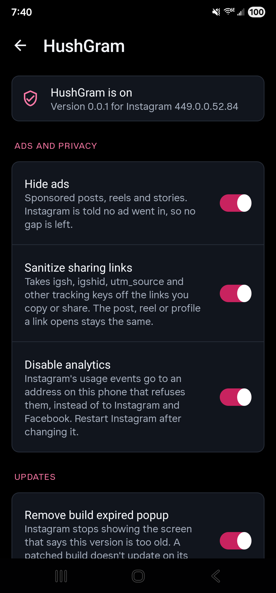
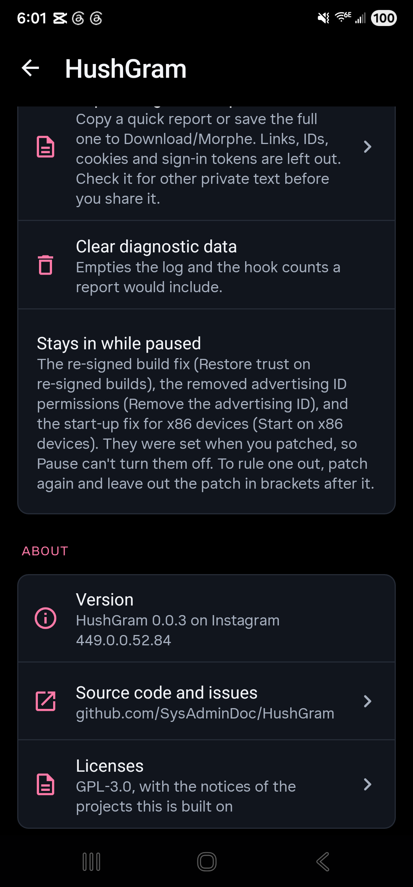

<p align="center">
  
  <a href="LICENSE"></a>
  
  
  
</p>

<p align="center">
  <a href="https://ko-fi.com/X8K126YVER">
    
  </a>
</p>

<p align="center">
  <sub><em>If HushGram makes Instagram better for you, a coffee helps me keep testing patches and maintaining them as Instagram changes.</em></sub>
</p>

#  HushGram

HushGram is a Morphe patch bundle for Instagram on Android. It blocks sponsored-item insertion, cleans tracking keys from supported sharing routes, and suppresses known usage-event and crash-report routes.

It's the Instagram member of a small family. [Hushfacebook](https://github.com/SysAdminDoc/Hushfacebook) does the same job for Facebook, and HushGram is built on its foundation: the same settings screen, pause switch, diagnostics and checks.

The latest release is [v0.0.8](https://github.com/SysAdminDoc/HushGram/releases/tag/v0.0.8), with 79 patches. Add it to Morphe Manager with [this link](https://morphe.software/add-source?github=SysAdminDoc%2FHushGram).

This project has no connection to Meta or to the Morphe project. Neither endorses it, and neither wrote it.

## Why use it

- **Fewer ads.** The ad-insertion hook is designed to keep sponsored items out of the feed, Reels and Stories without leaving a gap. Coverage can vary with Instagram's layout and delivery changes. It doesn't stop every ad request.
- **Cleaner links.** Supported copy and share routes remove known tracking keys such as `stkn`, `igsh` and `utm_source` while preserving the post link. New tag formats and URI-only clipboard items can need further coverage. Supported bio links skip Instagram's redirect hop. The [audit](docs/sources.md#links-attribution-tags-and-the-in-app-browser) explains the exact boundaries.
- **Less sent home.** Known usage-event and crash-report routes are redirected to an address on your phone that refuses them. Coverage can be partial, and ordinary content requests still reach Meta.
- **A build that keeps working.** A patched Instagram doesn't update itself, and Instagram locks out an old build after a few weeks. HushGram stops that lockout screen.

Most features have their own switch. Pause restores their normal runtime behavior when you want to check a problem. Patch-time changes, such as removed advertising permissions and rewritten colors, remain installed. Early crash-report handling also has its own startup policy.

## Install

1. Install [Morphe Manager](https://github.com/MorpheApp/morphe-manager) 1.34.0 or newer.
2. Add HushGram as a patch source: https://morphe.software/add-source?github=SysAdminDoc%2FHushGram (or build the bundle yourself, below, and add the `.mpp` file from your phone's storage).
3. Get Instagram 450.0.0.50.77 from [APKMirror](https://www.apkmirror.com/apk/instagram/instagram-instagram/). Take [the bundle labelled (arm64-v8a) (480-640dpi) (Android 9.0+), build 385611438](https://www.apkmirror.com/apk/instagram/instagram-instagram/instagram-450-0-0-50-77-release/instagram-450-0-0-50-77-android-apk-download/). That's the one these patches are checked against first. APKMirror also lists arm64-v8a builds of the same version labelled just (480dpi) or (640dpi): 385611395, 385611400, 385611404 and 385611431. For x86 Chromebooks and emulators it lists an x86 build, 385611439, and an x86_64 build, 385611440. Each is compiled on its own, and the patches find what they change in those builds too. Morphe Manager still calls them an unsupported version, because it can only be told one build number per kind of phone, so 385611438 is the easy pick.
4. Uninstall the Instagram you got from the Play Store. The patched app is signed with your own key, so Android won't install it over Meta's. Uninstalling signs you out, so have your password (and your two-factor codes) ready.
5. In Morphe Manager, pick the Instagram file, keep the default patch selection or change it, and patch.
6. Open HushGram settings (long-press Instagram's icon) and turn on what you want. Most features start off, so the patched app looks like Instagram until you do.

HushGram supports arm64-v8a phones on Android 9 and newer, which is what Instagram 450 itself asks for.

Instagram ships a new version every week and renames most of its code each time. Each patch finds what it changes by things Instagram keeps from one build to the next (log strings, server field names, manifest components and Android's own calls) rather than by the names that change. When one can't find its target, patching stops with a message saying what's missing, instead of giving you an app that quietly does nothing. Please report a stop like that.

## Before you sign in

> [!WARNING]
> Nobody outside Meta knows what gets an account suspended, and HushGram can't make a patched Instagram pass for the Play Store one. Here's what is known, and what each install choice actually does.
>
> - **Re-signing remains detectable.** Instagram 450 contains Play Integrity and Keystore attestation code. HushGram's local signature hook doesn't change the installed certificate or create Google's or the device's signed evidence. The exact remote verdict and Meta's response weren't observed in the [current audit](docs/sources.md#native-transport-and-integrity-boundaries).
> - **Reports aren't proof.** People whose accounts were suspended on patched Instagram often describe a new or long-idle account signing in on a fresh install. That's what they saw, not a measured cause, and suspension waves have hit unpatched accounts too. If you'd rather not put the account you care about on the line, try HushGram with a spare one first.
> - **A Root Mount install keeps the sign-in you have.** On a rooted phone, Morphe Manager's Root Mount layers HushGram over the Play Store Instagram instead of replacing it, so its data carries over and you don't sign in again. Whether that changes how Meta treats the account isn't known.
> - **Without root, you'll sign in on the patched app.** Uninstalling the Play Store Instagram (install step 4) signs you out and removes its data. Instagram may ask you to confirm your phone number or identity when you sign in, and HushGram doesn't change that step.
> - **Keep your signing key, and leave Instagram's data alone.** When a new Instagram version comes out, patch it and install over the top with the same key. Android keeps the app's data that way, so you stay signed in. A different key means uninstalling first, and clearing Instagram's storage signs you out as well.
>
> **Can Meta tell?** Assume yes. A patched Instagram has a different signing certificate. `Restore trust on re-signed builds` changes selected local certificate reads so those app components keep working. It doesn't make the APK Meta-signed. `Disable analytics` changes known reporting routes, but doesn't hide ordinary content requests or prove that all tracking has stopped.
>
> **What stays the same?** Your feed, stories and reels still come from Meta's servers, and HushGram decides on your phone which of them to show. It doesn't post, like, follow or message for you, and it doesn't change how you sign in.
>
> **Could my account be suspended?** Nobody can promise it won't be. Meta's [Terms of Use](https://help.instagram.com/581066165581870) don't allow modified versions of its apps, and Meta can disable accounts that break them.
>
> **Can I lower the odds?** Nobody can say what does, since Meta doesn't say what it acts on. A spare account keeps the one you care about out of it. Updating over the top with the same key, or a Root Mount install on a rooted phone, keeps the sign-in you have instead of starting a new one.
>
> **Why doesn't HushGram include Instagram Plus or save deleted messages?** Both are left out on purpose, along with saving the Instants people send you and keeping copies of stories after they expire. Other Instagram mods offer all four. People using piko's Instagram patches have reported banned accounts, and we suspect features like these may be part of the reason. Nobody has proven that, so leaving them out is a precaution.

## Keep your signing key

Morphe Manager signs the patched Instagram with a key it makes on your phone. Android only installs an update over your patched Instagram when the update carries that same key, so the key is what lets you update without losing Instagram's data.

- **Back it up right after your first patch.** In Morphe Manager, open Settings → System → Import & export → Signing key and tap Export. Keep the `Morphe.keystore` file somewhere private, because anyone who has it can sign an APK your phone will take as an update.
- **On a new phone, import it before you patch anything.** Reinstalling Morphe Manager or clearing its storage makes a new key, and without your exported copy nothing you patched earlier can be updated in place.
- **A different key means starting over.** Android refuses an update signed with another key, so the only way forward is to uninstall the patched Instagram. That deletes its data and signs you out.

Morphe's own guide is [Backup and keystore](https://github.com/MorpheApp/morphe-manager/blob/main/docs/backup-and-keystore.md).

## Patches

Manager's simple mode includes 75 of the 79 patches, so you don't need Expert mode to get any feature below. A patch that comes in this way changes nothing until you turn its switch on in HushGram settings, and each description says where that switch is. A few start on, as they always have: Hide ads, Sanitize sharing links, Open links in external browser, Disable analytics, Remove build expired popup, Hide suggested posts, Hide suggested stories, Hide Meta AI's search and posts switches, Show if a profile follows you, Download any reel, Download any story and Keep the reel speed. Story ring size and Default playback quality start on too, but they keep Instagram's own size and quality until you pick one. Saved settings keep their choices.

Four patches stay out of simple mode. Tick them in Manager's patch list if you want them:

- **Change version code** raises the version code for good. Going back means uninstalling Instagram, and every later HushGram build needs it too.
- **Open developer options** is a developer tool for Instagram's server flags, and a wrong flag can break parts of the app until you reset it.
- **Pure black dark mode** rewrites Instagram's colors when you patch and has no switch to turn it off.
- **View DM photos and videos anonymously** is a test feature until the sender's side is checked with two accounts.

Expert mode is still there if you'd rather leave a patch out. It groups the patches under Ads, Ghost mode, Privacy, Messages, Feed, Stories, Reels, Playback, Interaction, Profiles, Interface, Downloads, Updates, Fixes and Settings, and most of those match a section in HushGram settings. Ghost mode holds the six patches its card in HushGram settings turns on together.

There are 79 patches for `com.instagram.android`, checked against Instagram 450.0.0.50.77 (arm64-v8a, build 385611438, the version's other arm64 builds 385611395, 385611400, 385611404 and 385611431, and its x86 and x86_64 builds 385611439 and 385611440). Hide suggested accounts in DMs is new in v0.0.8, and the other 78 were in v0.0.7 too.

| Patch | What it does | Simple mode |
|---|---|---|
| `Allow screenshots` | Lets you take screenshots and record your screen where Instagram normally blocks it, such as disappearing photos and videos in chats. Starts off. Turn it on in HushGram settings > Messages. | Included |
| `Ask before a call` | Asks you to confirm before a call starts from a chat, so a stray tap on the call button doesn't ring anyone. Starts off. Turn it on in HushGram settings > Messages. | Included |
| `Ask before a like` | Asks you to confirm before the Like button under a post likes or unlikes it, so a stray tap doesn't do it for you. Starts off. Turn it on in HushGram settings > Feed. | Included |
| `Ask before a refresh` | Asks you to confirm before pulling down refreshes Home, Reels or another list, so an accidental pull doesn't replace what you were reading. Starts off. Turn it on in HushGram settings > Feed. | Included |
| `Change the like animation` | Lets you pick the animation that plays when you double tap a post to like it. The choices are animations Instagram made for its Rings creators. Starts off. Turn it on in HushGram settings > Reels. | Included |
| `Change version code` | Stops Google Play from offering Meta's updates over your patched Instagram. Going back to the normal Instagram later means uninstalling first, which deletes its data. Later HushGram builds need this patch too. Works as soon as you patch it in, with no switch. | Opt-in |
| `Clean up Reels` | Hides extra buttons and prompts on reels, such as Follow, Edits, templates, Meta AI, Ray-Ban Meta glasses, friends' activity and the comment bar on reposts. Each one has its own switch. Starts off. Turn it on in HushGram settings > Reels. | Included |
| `Clear the media cache` | Frees storage by deleting Instagram's saved copies of photos and videos once they pass 500 MB. Your sign-in, drafts and settings stay. A row clears them right away. Starts off. Turn it on in HushGram settings > Storage. | Included |
| `Copy comment` | Adds Copy and Copy username to the menu you get on a comment, so you can copy its text or the commenter's username. Starts off. Turn it on in HushGram settings > Comments. | Included |
| `Default playback quality` | Plays videos, reels and video stories at the quality you choose, instead of the one Instagram picks as it plays. Nothing changes until you pick a quality. On by default. Turn it off in HushGram settings > Playback. | Included |
| `Data saver` | Saves mobile data by loading smaller photos and starting videos at the lowest quality. It uses Full resolution photos and Default playback quality, so it turns both on. It starts with mobile data only. Starts off. Turn it on in HushGram settings > Playback. | Included |
| `Disable analytics` | Stops Instagram from sending usage reports and crash reports to Instagram and Facebook. It also skips the contacts and location setup screens. Restart Instagram after you change it. On by default. Turn it off in HushGram settings > Ads and privacy. | Included |
| `Don't save recent searches` | Keeps the accounts and tags you open from search out of your Recent list. Searches already in Recent stay until you clear them. Starts off. Turn it on in HushGram settings > Explore. | Included |
| `Don't report screenshots` | Stops Instagram from telling people when you take a screenshot of their disappearing photo or video. Ghost mode, at the top of Ads and privacy, turns it on with the others. Starts off. Turn it on in HushGram settings > Messages. | Included |
| `Don't send reel watch history` | Stops Instagram from learning which reels you watched and how far you got. Reels you've already watched may come back. Starts off. Turn it on in HushGram settings > Reels. | Included |
| `Download any reel` | Adds Download to the menu of every reel and saves it without Instagram's watermark. You choose the quality, and best is the default. A separate Download cover switch also saves the reel's cover picture. On by default. Turn it off in HushGram settings > Reels. | Included |
| `Download any story` | Adds Download to the menu of anyone's story. Videos save at the quality you choose and photos at their largest size. On by default. Turn it off in HushGram settings > Stories. | Included |
| `Download any video` | Adds Download to video posts in your feed, saving the video without Instagram's watermark. Other switches add Download for photos, Download cover and a Details row with the post's time and poster. Starts off. Turn it on in HushGram settings > Downloads. | Included |
| `Download voice messages` | Adds Save to the menu you get when you hold a voice message in a chat. It saves the recording as an audio file. Starts off. Turn it on in HushGram settings > Downloads. | Included |
| `Emoji style` | Shows every emoji in Google's style instead of your phone's own. The full change shows after you restart Instagram. Starts off. Turn it on in HushGram settings > Layout. | Included |
| `Full resolution photos` | Loads photos in the largest size Instagram sends instead of one picked for your screen. A second switch asks for a larger size on screens under 1440 pixels wide. Uses more data. Starts off. Turn it on in HushGram settings > Feed. | Included |
| `Group Instagram's notifications` | Puts Instagram's notifications in one group, or in a group for each type, so they don't fill your notification shade. Tapping one still opens it. Starts off. Turn it on in HushGram settings > Notifications. | Included |
| `Hide ads` | Hides sponsored posts, reels and stories, and leaves no gap where an ad would have been. On by default. Turn it off in HushGram settings > Ads and privacy. | Included |
| `Hide comments` | Takes the Comment button and the comment count off posts in your feed. Starts off. Turn it on in HushGram settings > Comments. | Included |
| `Hide group buttons on the share sheet` | Takes the New group button and the button that sends to several people as a group off the share sheet. You can still start a group from your messages. Starts off. Turn it on in HushGram settings > Sharing. | Included |
| `Hide highlights` | Takes the row of story highlights off profiles, yours and other people's. Bios, counts and posts stay. Starts off. Turn it on in HushGram settings > Profiles. | Included |
| `Hide Instants` | Takes the stack of Instants out of your messages. Instants is Instagram's no-edit camera for sharing quick photos with friends. Starts off. Turn it on in HushGram settings > Messages. | Included |
| `Hide Meta AI` | Removes Meta AI from Instagram's search bars, messages, home top bar, reels menus, share sheet and feed. Each part has its own switch, and some start on. Starts off. Turn it on in HushGram settings > Meta AI. | Included |
| `Hide Reels in the feed` | Removes the rows of suggested reels from your home feed. A reel posted by someone you follow stays. Starts off. Turn it on in HushGram settings > Reels. | Included |
| `Hide the home feed` | Empties your home feed on purpose, so Home shows only the stories row. Profiles, Explore and Reels still show posts. Starts off. Turn it on in HushGram settings > Feed. | Included |
| `Hide the Explore grid` | Empties the grid of posts and reels on the Search tab. Search, recent searches and results stay. Starts off. Turn it on in HushGram settings > Explore. | Included |
| `Hide suggested accounts in DMs` | Takes the Accounts to follow section off the bottom of your messages. Your chats and follow requests stay. Starts off. Turn it on in HushGram settings > Messages. | Included |
| `Hide suggested accounts in Reels` | Leaves out the cards of accounts to follow that Instagram puts between reels. Every reel still plays. Starts off. Turn it on in HushGram settings > Reels. | Included |
| `Hide suggested people on profiles` | Takes Suggested for you and the Discover people button off profiles. Bios, counts, posts and follower lists stay. Starts off. Turn it on in HushGram settings > Profiles. | Included |
| `Hide suggested posts` | Removes posts from accounts you don't follow, suggested accounts, surveys and shopping rows from Home. Posts from accounts you follow stay. Extra switches can also hide all videos, photos or carousels. On by default. Turn it off in HushGram settings > Feed. | Included |
| `Hide suggested stories` | Removes stories from accounts you don't follow from the row at the top of Home. More switches hide rewinds and memories, or the whole row. Starts off. Turn it on in HushGram settings > Stories. | Included |
| `Hide that you're typing` | Stops the people you're chatting with from seeing when you're typing. You still see when they type. Ghost mode, at the top of Ads and privacy, turns it on with the others. Starts off. Turn it on in HushGram settings > Messages. | Included |
| `Hide the notes row` | Takes the row of notes, and the Map bubble in it, off the top of your messages. Your chats stay. Starts off. Turn it on in HushGram settings > Messages. | Included |
| `Hide the Reels tab` | Takes the Reels tab off the tab bar. Reels in your feed and reels people send you still open. Restart Instagram to see the change. Starts off. Turn it on in HushGram settings > Reels. | Included |
| `Hide the Repost button` | Takes the Repost button and its count off posts and reels, so nothing gets reposted by mistake. Share still works. Starts off. Turn it on in HushGram settings > Sharing. | Included |
| `Hide the Share button` | Takes the Share button and its count off posts in your feed and off reels. Starts off. Turn it on in HushGram settings > Sharing. | Included |
| `Hide the Threads button` | Takes the Threads button off the top of profiles. The menu and the other buttons stay. Starts off. Turn it on in HushGram settings > Profiles. | Included |
| `HushGram settings` | Adds a HushGram settings page to Instagram. Open it by pressing and holding Instagram's icon, or from the top of Settings and activity. Turn features on or off there, pause HushGram and save diagnostics. Works as soon as you patch it in, with no switch. | Included |
| `Keep a seek bar on Reels` | Keeps a seek bar under every reel, short ones too, with the time played and the reel's length above it, like 0:10 / 0:55. Starts off. Turn it on in HushGram settings > Reels. | Included |
| `Keep in chat` | Keeps view once and replayable photos and videos in your chats after you open them, so they don't disappear. Starts off. Turn it on in HushGram settings > Messages. | Included |
| `Keep Reels auto scroll on` | Keeps Instagram's auto scroll in Reels turned on after you leave Reels or restart Instagram, until you turn it off yourself. Starts off. Turn it on in HushGram settings > Reels. | Included |
| `Keep the reel speed` | Keeps the 2x speed on for the next reels after you lock a reel at 2x (hold its edge, then slide down), until you slide the lock off. On by default. Turn it off in HushGram settings > Reels. | Included |
| `Lock your messages` | Covers your inbox and chats, or all of Instagram, until your fingerprint, face or screen lock says it's you. Message notifications only say that a message came. Starts off. Turn it on in HushGram settings > Messages. | Included |
| `Loop a story` | Plays a story again from the start when it ends, instead of moving on to the next one. Tap or swipe to move on. Starts off. Turn it on in HushGram settings > Stories. | Included |
| `Open developer options` | A long press on the Home tab opens Instagram's own developer options, where you can change its hidden settings. A wrong change can break parts of Instagram until you reset it. On once you patch it in. Turn it off in HushGram settings > Developer. | Opt-in |
| `Open links in external browser` | Opens web links you tap in your usual browser instead of Instagram's built-in one, without Instagram's click tracker. Instagram pages and ads still open in the app. On by default. Turn it off in HushGram settings > Ads and privacy. | Included |
| `Pure black dark mode` | Makes Instagram's dark mode pure black instead of dark gray. It looks deeper and can save battery on an OLED screen. Menus and buttons keep their grays so they stay easy to see. Works as soon as you patch it in, with no switch. | Opt-in |
| `Read messages without the seen receipt` | Opening a chat no longer tells people you've seen their messages. You still see when they've seen yours. Mark as read still tells them. Ghost mode turns it on too. Starts off. Turn it on in HushGram settings > Messages. | Included |
| `Remove build expired popup` | Stops Instagram from locking you out with a screen that says this version is too old. A patched build can't update itself, so it would stop working after a few weeks. On by default. Turn it off in HushGram settings > Updates. | Included |
| `Remove the advertising ID` | Stops Instagram from reading your phone's advertising ID, which ad companies use to follow you between apps. Instagram gets a string of zeros instead. Works as soon as you patch it in, with no switch. | Included |
| `Remove the empty space at the bottom` | Takes away the empty gap Instagram leaves under its tab bar for a navigation bar that isn't there. Restart Instagram to see the change. Starts off. Turn it on in HushGram settings > Layout. | Included |
| `Restore trust on re-signed builds` | Lets Instagram's own checks of who signed the app pass on a patched build, so the parts that need them keep working. Threads, Facebook and Messenger patched with the same key work too. Works as soon as you patch it in, with no switch. | Included |
| `Resume long videos` | A video or reel longer than two minutes picks up where you left off the next time you play it on the same account. Live videos and ads start as usual. Starts off. Turn it on in HushGram settings > Playback. | Included |
| `Sanitize sharing links` | Removes tracking tags from the links you copy or share, and opens bio links without Instagram's click tracker. The link still opens the same post, reel, story or profile. On by default. Turn it off in HushGram settings > Ads and privacy. | Included |
| `Save comment photo` | Adds Save to the menu on a comment that has its own photo, saving the largest size Instagram sent. Starts off. Turn it on in HushGram settings > Comments. | Included |
| `Save profile picture` | Adds Save profile picture, View profile picture, Copy username and Copy bio to the menu on someone's profile. View opens the picture full screen and lets you zoom. Starts off. Turn it on in HushGram settings > Downloads. | Included |
| `Show a post's exact time` | Shows the date and time a post went up, like Oct 2, 3:45 PM, instead of how long ago. It does the same for comments. Starts off. Turn it on in HushGram settings > Feed. | Included |
| `Show a story's exact time` | Shows the date and time a story was posted, like Oct 2, 3:45 PM, instead of how long ago. A choice under the switch can show the time left instead. Starts off. Turn it on in HushGram settings > Stories. | Included |
| `See who a story mentions` | Adds a small label in a story's header showing how many accounts it mentions. Tap it for a list and tap an account to open their profile. Starts off. Turn it on in HushGram settings > Stories. | Included |
| `Show if a profile follows you` | Adds Follows you or Doesn't follow you beside the name on someone's profile. Other switches add a chip and mark accounts on your Following list that don't follow you back. On by default. Turn it off in HushGram settings > Profiles. | Included |
| `Start Home on Following` | Opens Home on posts from accounts you follow instead of For you. A second switch removes For you from Home. Restart Instagram to see the change. Starts off. Turn it on in HushGram settings > Feed. | Included |
| `Start on x86 devices` | Stops Instagram from crashing or freezing on x86 devices that run its code through a translator, such as some Chromebooks and emulators. Phones and tablets with arm chips run it as before. Works as soon as you patch it in, with no switch. | Included |
| `Stop Reels scrolling` | Stops a swipe in Reels from moving to the next reel, so you stay on the one you opened. A second switch lets you watch 20 reels, then stops swiping for 15 minutes. Starts off. Turn it on in HushGram settings > Reels. | Included |
| `Stop Story auto-advance` | Keeps each story on screen until you tap or swipe. Starts off. Turn it on in HushGram settings > Stories. | Included |
| `Stop swipe to create` | Stops a sideways swipe on Home from opening the camera. The + button still opens it. Starts off. Turn it on in HushGram settings > Feed. | Included |
| `Stop swiping between tabs` | Stops a sideways swipe from moving between Home, Reels and the other main tabs. Tapping the tab bar still works. Starts off. Turn it on in HushGram settings > Feed. | Included |
| `Story ring size` | Draws the rings in the stories row at the top of Home smaller, so more fit on screen, or larger. Nothing changes until you pick a size. On by default. Turn it off in HushGram settings > Stories. | Included |
| `Tap to play` | Makes videos, reels and stories wait for your tap instead of starting by themselves, like Instagram does when it saves mobile data. A choice under the switch can leave Reels out or hold only Reels. Starts off. Turn it on in HushGram settings > Playback. | Included |
| `Turn off double tap to like` | Stops a double tap on a post or reel from liking it, and the heart doesn't show. The Like button still works. Separate switches cover posts, reels, comments and chat messages. Starts off. Turn it on in HushGram settings > Reels. | Included |
| `Turn off HDR brightness boosts` | Stops HDR photos and reels from making the screen brighter than everything else. Starts off. Turn it on in HushGram settings > Playback. | Included |
| `View DM photos and videos anonymously` | Holds back the Opened notice for view once photos and videos in messages, so the sender doesn't see you opened them. Ghost mode turns it on too. Starts off. Turn it on in HushGram settings > Ads and privacy. | Opt-in |
| `Spoof location` | Tells Instagram your phone is at a place you pick, for the location sticker, nearby places and maps. Photos keep their own places. You need to pick a place too. Starts off. Turn it on in HushGram settings > Ads and privacy. | Included |
| `View live anonymously` | Keeps you off the viewer list of the lives you watch, so the host isn't told you're there. Your own lives still count their viewers. Ghost mode turns it on too. Starts off. Turn it on in HushGram settings > Stories. | Included |
| `View stories anonymously` | Keeps you off the viewer list of the stories you watch. Replying or reacting still shows you. An optional Mark as seen button lets you choose. Ghost mode turns it on too. Starts off. Turn it on in HushGram settings > Stories. | Included |

Coming from an earlier HushGram? The patches that used to be opt-in are in simple mode now, and their 24 switches start off. If you'd picked one of them before and never changed its switch, it's off after the update until you turn it on again. A settings backup you exported before updating brings your old choices back (Import HushGram settings, under Settings backup). The [changelog](CHANGELOG.md) names every switch that changed.

The other patches keep their switches in `HushGram settings`, so Morphe Manager includes it whenever any of them is picked. Any of the rest can be left out when you patch.

In HushGram settings, Settings entry lets you choose one navigation tab to open HushGram with a long press. It starts Off. Your choice replaces only that tab's long-press action, including Home's developer options or Reels' auto scroll if you choose one of those tabs. Normal taps and other tabs stay the same. Only tabs your account shows can be used. A change reaches the tabs right away, without restarting Instagram, though that part hasn't been checked on a phone yet. The launcher shortcut and the row in Instagram's own settings stay available. If you'd rather not see that row, turn on Hide the HushGram row in Instagram's menu (it starts off). The row only goes while your chosen tab's long press can open HushGram, so turning the long press off or pausing HushGram brings it back. That switch hasn't been checked on a phone yet ([#84](https://github.com/SysAdminDoc/HushGram/issues/84)). On a Galaxy S22, Home and Reels opened HushGram when selected, normal taps stayed native, and Home's developer options returned when Home wasn't selected. Off and Pause kept native gestures, and Resume restored the choice after restarting. The launcher and Instagram settings entries also worked, including the launcher route before sign-in. The chooser was checked with right-to-left layout and 200% text. Android 9/17 tests cover listener rebinding, keyboard focus and account transitions. This account doesn't offer Reels' auto-scroll long-press menu, so that menu's separate phone check remains open. Refs [#31](https://github.com/SysAdminDoc/HushGram/issues/31).

## Settings

Long-press Instagram's icon on your home screen and tap **HushGram settings**. Or, inside Instagram, open **Settings and activity** from the menu on your profile and tap **HushGram settings** at the top. The screen opens over Instagram, and the shortcut works before you sign in too.

If the settings page can't open, including after rotating your phone, tap **Retry** in the dialog or use **Back** to return to Instagram.

Settings stays open if Android recreates Instagram's screen while a backup or override file picker is in front. Choosing a file completes the original request, and cancelling returns to settings. Settings and diagnostic exports show their progress and last result on their own row until Instagram restarts. Closing settings doesn't interrupt an export that's already writing. A cancelled settings export says so, and you can retry a failed one.

Reused navigation buttons ignore callbacks from their previous bindings, including old haptic requests. The current tab keeps its selected settings entry or native action.

Each settings or override file picker keeps its own request identity. A late result from an earlier picker can't consume the current choice or write to the older document.

<p>
  
  
  
</p>

Captured on 2026-10-02 from the published v0.0.3 bundle with 33 of its 35 patches selected. Open developer options and Pure black dark mode were left out. The controls you see depend on the patches you select.

HushGram's settings also have **Search settings**. Search by a control's label or description in your phone's language, or by its English patch name. Contacts and location setup lead to Disable analytics. Following and Reels find their installed controls. Actions keep matching their original names when their labels change, including Clear remembered positions while Undo is available. Pause, diagnostics and any running save's Cancel stay available while searching. Clear the search to return to the same sections and choices. Open categories as pages, a switch under Settings entry that starts off, turns the page into a list of its categories. A tap opens one on its own page, and Back goes to the list where you left it. Search still looks through every category from any page, and Pause and diagnostics stays open below. Search works offline. The query clears when settings closes or Android rebuilds the page, and it never becomes stored history.

Settings switches and action rows expose their current name and explanation to screen readers, including saved values and reasons a choice is unavailable. Removed sections, disabled controls or containers, and a closed page won't accept accessibility actions. Search keeps accessibility focus while filtering and stops accepting edits after the page closes. Android 9 and 17 tests cover these behaviors and translated text. TalkBack and Switch Access were also checked on Android 16 with right-to-left layout and 200% text, including paused settings.

At the top, a card says whether HushGram is on or paused. Below it:

- **Ads and privacy** holds the switches for Hide ads, Sanitize sharing links, Open links in external browser and Disable analytics. Source builds can also include View DM photos and videos anonymously. It starts off and has its own switch. When two or more of the switches that keep what you do to yourself are in your build, Ghost mode sits at the top and turns them on or off together: View stories anonymously, View live anonymously, Read messages without the seen receipt, View DM photos and videos anonymously, Hide that you're typing and Don't report screenshots. It's on while all of them are, and each keeps its own switch.
- **Ads and privacy** also holds Spoof location's switch, which starts off, and the Place row it reports.
- **Feed** holds Start Home on Following's two switches, Start Home on Following and Only accounts you follow, Hide suggested posts' eight: Hide suggested accounts, Hide suggested posts, Hide Threads posts, Hide surveys, Hide shopping, Hide videos, Hide photos and Hide carousels, and the switches for Hide the home feed, Stop swipe to create, Stop swiping between tabs, Full resolution photos, Ask for larger photos, Ask before a like, Ask before a refresh and Show a post's exact time. The first five of Hide suggested posts' switches start on, and the rest here start off.
- **Meta AI** holds Hide Meta AI's five switches: Hide Meta AI in search and Home's bar, Hide Meta AI posts, Hide About this reel, Hide Ask Meta AI in About this reel and Hide Meta AI in the share sheet. The last three start off.
- **Explore** holds the switches for Hide the Explore grid and Don't save recent searches, which both start off.
- **Messages** holds the switches for Hide the notes row, Hide suggested accounts in DMs, Hide Instants, Read messages without the seen receipt, Hide that you're typing, Lock your messages, Lock all of Instagram, Don't report screenshots, Allow screenshots, Keep in chat and Ask before a call, which all start off. Lock again sits under them and starts at Right away.
- **Reels** holds the switches for Hide Reels in the feed, Hide suggested accounts in Reels, the four parts of Clean up Reels, Don't send reel watch history, Download on reels and its Download cover switch, Turn off double tap to like, Change the like animation and its Like animation choice, Hide the Reels tab, Keep the reel speed, Keep a seek bar, Show a Reel seek thumb, Keep auto scroll on, Stop Reels scrolling and Stop after 20 reels. Download on reels and Keep the reel speed start on. So do On posts and On reels under Turn off double tap to like, so turning that one on covers both. Every other switch here starts off.
- **Stories** holds Hide suggested stories' five switches, Hide suggested stories, Hide story rewinds, Hide memories and recaps, Stop loading stories and Hide the Stories tray, and the switches for Stop Story auto-advance, Loop a story, Show a story's exact time, with its How the time shows list (Date and time, Time left or Time posted), See who a story mentions, View stories anonymously and Download on stories, and Story ring size with its Ring size list: Much smaller, Smaller, Instagram's size, Larger or Much larger. View stories anonymously has a second switch there, Mark as seen button. View live anonymously's switch comes right after them. Hide suggested stories, Download on stories and Story ring size start on, the ring at Instagram's own size until you pick another. Every other switch here starts off.
- **Playback** holds the switches for Tap to play, with its Where videos wait list (Everywhere, Everywhere but Reels or Only in Reels), Resume long videos, and Default playback quality with its Playback quality list: Auto, Data saver, Up to 480p, Up to 720p or Highest. Data saver and Turn off HDR brightness boosts sit there too, and Data saver has Only on mobile data under it. Default playback quality starts on at Auto, and the rest start off.
- **Sharing** holds the switches for Hide group buttons on the share sheet, Hide the Repost button and Hide the Share button. All three start off.
- **Comments** holds Copy comment, Copy the commenter's username, Save comment photo and Hide comments. All four start off. Copy comment adds Copy to a selected comment's menu, the username switch adds Copy username there for the account that wrote it, Save comment photo adds Save when that comment has its own photo, and Hide comments takes the Comment button and count off posts in your feed.
- **Profiles** holds the switches for Show if a profile follows you, Hide suggested people on profiles, Hide highlights and Hide the Threads button. Show if a profile follows you starts on and has two more switches there, Show it as a chip and Mark who doesn't follow you back. Those two and the other three start off.
- **Layout** holds the switches for Remove the empty space at the bottom and Emoji style (Google's emoji everywhere). Both start off.
- **Notifications** holds Group Instagram's notifications' two switches, Group notifications and Group by type, which start off.
- **Storage** holds the switch for Clear the media cache, which starts off, and a Clear the cache now row.
- **Downloads** holds the switches for Download feed videos, Download video covers, Download feed photos, Details in a post's menu, Save profile picture, View profile picture, Copy username and bio and Download voice messages, which all start off. It also lists each save that's running, with a Cancel button, and holds Open in another player and what every save uses: Send downloads to another app, Save videos other apps can open, Download quality, the save folder and the video file name. Videos go to Movies and photos to Pictures, each in an Instagram folder unless you name another. A voice message goes to that folder under Recordings, or under Music before Android 12, named `IG_AUD_` with the date and time. Turn on Folder per account and each save goes one folder deeper, into a folder named for the account that posted it. A video is named `IG_VID_` with the date and time unless you set a name, and a photo `IG_IMG_` with the date and time. Turn on Name saves by account and post time and both are named for the account that posted and the time the post went up, like `username_20261005_143012`, so an account's saves sort by date. A profile picture has no post time, so it's named for the account and the time you saved it, like `username_profile_20261007_105151`. A carousel page gets its number on the end, and saving the same thing again adds the time you saved it rather than replacing the first file.
- **Updates** holds the switch for the build expired screen.
- **Developer** holds the Home long-press switch for Open developer options, rows that open Instagram's MetaConfig overrides and its Whitehat settings, and rows that import and remove names for MetaConfig's flags.
- **Set when you patched** lists what was fixed at patch time and can't be switched off here, such as the re-signed build fix, the removed advertising ID, the pure black dark mode and the raised version code.
- **Pause and diagnostics** has the Pause switch, Debug logging, and the diagnostic report. Copy a quick report, or save the full one to Download/Morphe (on Android 9, a Download/Morphe folder inside Instagram's own folder, and the message says where). Links, IDs, cookies and sign-in tokens are left out, but read it over for other private text before you share it.
- **About** shows the version and the licenses, with a link to this page.

Developer has **Open MetaConfig overrides**. It opens Instagram's native flag editor without enabling Home long press or changing a flag. It requires a signed-in Home or settings activity. An unavailable screen leaves HushGram settings open and puts the reason under the row (checked signed out on an emulator and a Samsung phone).

Developer also has **Open Whitehat settings**. It opens Instagram's own Whitehat screen, the one Meta gives security researchers. Its switch lets Instagram trust the certificates installed on your phone, such as a debugging proxy's, for 24 hours, so you can check the app's traffic. Restart Instagram after turning it on, as the screen asks. Instagram turns the switch back off by itself once the day is up, and HushGram doesn't force that trust or stretch the day. Like the MetaConfig row, it needs a signed-in Home or settings activity.

Developer also has **Import flag names** and **Remove flag names**. Instagram's release builds leave the names of MetaConfig's flags out, so its editor lists each one by number, like `_23355`, and there's little for its search to find. Pick a name list with Import flag names and the editor shows those names instead, in its list and in its search. Searching for a config's number still finds it. HushGram reads Instagram's own `id_name_mapping.json` format, which the name files other Instagram mods share use too. It also reads a JSON list of entries that each have a `code` and a `name`, and its own plain text with one `config=name` or `config::index=name` per line. HushGram doesn't come with a list of its own. The names go in HushGram's private folder and only change the labels in that editor. Instagram's schema and overrides file keep the numbers, and so does everything Instagram sends, so an override export is the same with or without names. A file that isn't a name list, or names nothing, changes nothing and says so. Open MetaConfig again after an import to see the names, and use Remove flag names to go back to the numbers. MetaConfig remembers pinned experiments by their labels, so pins you made with numbers come back once you remove the names, and pins made while names are in use only show while they are. Instagram's own warning that only some names are loaded still shows, since its count doesn't include HushGram's list.

The diagnostic report also shows patch-time target coverage for Disable analytics, Sanitize sharing links and Start on x86 devices. Each shows matched/expected counts and fixed labels for missing targets. These describe the code the patch found, not which live requests Instagram sends.

Only accounts you follow, Ring size, Playback quality, Group by type, Only on mobile data, Place, Download cover and Download video covers are disabled while their parent switch is off. Each explains which switch enables it. Turning the parent back on restores your saved choice. Download quality remains available for every download surface.

Clear remembered positions sits below Resume long videos and works even when playback is off or paused. It deletes the local history of up to 200 positions kept for 30 days and cancels pending restores. Expired history is cleaned when video playback starts, even with Resume long videos off. If the worker queue is full or storage fails, a later video start retries. Tap the same row before its shown deadline to undo once. Android 10 and newer use your accessibility timeout, with at least ten seconds. Android 9 uses ten seconds. Reopening settings keeps the original deadline, and restarting Instagram discards Undo. The history stays in its own private file, outside the settings registry and diagnostic reports.

There's also Settings backup. Export chooses a JSON file through Android's document picker. Import reads and closes the whole file before applying the installed patches' settings together, reports unsupported keys it skipped, and says when a restart is needed. Backups also include your navigation-tab settings entry. Older files without that choice leave it unchanged. The complete result remains readable when settings is reopened, until Instagram restarts. Undo uses the same accessibility timeout and shows its deadline. It restores previous choices once and keeps choices you've changed since the import. Files larger than 256 KiB or containing more than 512 entries are refused. Accounts, signing keys, Pause and recovery state, onboarding markers and playback history aren't included. Instagram's developer overrides use a separate store and aren't included either.

Developer also has **Export overrides** and **Validate an overrides file**. Open settings from Home while signed in. Export saves the session's current MetaConfig overrides through Android's document picker, with the exact Instagram build and a fingerprint of its typed schema. Account and signing metadata aren't included. Validation checks names, parameter types and the same host and schema identity. Instagram's own mc_overrides.json names no build and stays on the phone through app updates, so one can hold overrides from an older version. Instagram numbers its settings the same way from one version to the next, so the rest of the file still means what it did. The overrides this version dropped are left out and counted, and a file holding none this version has is refused. Leftovers like that in Instagram's own saved overrides are skipped the same way, so they don't stop an export, an import or a restore. It reports validated-only and applies nothing, even if the file contains changed values. Files larger than 512 KiB or containing more than 4,096 overrides are refused. A failed export may leave the selected document incomplete. The complete outcome remains readable in the row until Instagram restarts. On a Samsung phone two exports of the same session came out identical, Validate accepted that export, and a file from another schema was refused.

An exported file can go back in too. Turn on **Allow importing overrides** in Developer, which starts off, to show **Import overrides**, **Restore previous overrides**, **Discard saved overrides** and **Reset all overrides**. Import checks the file the same way Validate does, then makes only the changes it needs, one parameter at a time, through the typed table Instagram's own override editor writes. The file's overrides replace the session's, so one that's missing from the file is removed. Instagram's editor saves a change to its file a moment after you make it, so HushGram reads the stored overrides twice, a few seconds apart, and stops if they moved. Right before the first change it checks that the signed-in session and its stored overrides still match, then saves the current overrides in Instagram's private files. Permission is checked again after saving that copy. Turning the import switch off or pausing while it waits prevents the first native change and removes this operation's temporary copies while keeping any earlier saved copy. That copy only becomes the one Restore uses once the import goes through, or if it can't be undone. Then it reads the store back. If Instagram didn't keep the changes, they're put back the same way, and if that can't be confirmed either, imports stop until Restore previous overrides runs. Restore saves what it's about to replace first. Recovery records which saved copy belongs to an interrupted operation and keeps it until the changes and file cleanup are confirmed. A cleanup failure keeps recovery visible, including when changes have already applied. Temporary copies are removed after recovery finishes. A small completion record stays in private files so a failed final storage flush can't silently allow another import. It holds hashes and the build number, not override values. Old recovery records with two different copies are refused instead of choosing one. Overrides holding Instagram's null value can't be changed this way. Import refuses a file that would move one, and Restore puts back everything else and tells you how many it couldn't. **Discard saved overrides** forgets the saved copy and lets imports run again when Restore can't help, for example after Instagram updated. Discard also replaces a damaged recovery record. A lone completion record that can't be read can be discarded too. A file that already matches makes no change at all, and a file with more than 4,096 changes is refused. **Reset all overrides** takes every override in the session away, so Instagram goes back to its own flags. It works like an import of a file with none in it: the current overrides are saved for Restore first, and it's checked the same way. Overrides holding Instagram's null value stay, since Restore couldn't put them back. HushGram never writes Instagram's override file itself and never calls its string import or reload. Restart Instagram after an import or a restore to apply it. On a Samsung phone running Instagram 450, an mc_overrides.json from an older Instagram validated with 2,513 overrides and 42 left out, imported those 2,513, and Restore then put the session back to no overrides.

These rows rely on the parts of Instagram the patch reads overrides from and writes them through. If an Instagram update moves those, the long press and the MetaConfig and Whitehat rows still go in, and the rows that need the moved part are left out. The diagnostic report names what's missing.

HushGram also explains a save that stopped when Instagram closed. After its unfinished files, gallery rows and notification are cleaned up, the next opening says to reopen the media and save again. The full explanation stays in settings for that run. Nothing is retried automatically, and the cleanup ledger keeps only random job markers alongside its existing local resource references.

A carousel's feed menu gets **Save all**. It saves up to 32 pages in order, using your current download quality throughout. A larger carousel gets an explanation instead of a partial save. A photo or video type you've switched off counts as skipped, and a carousel with nothing left to save doesn't get the row at all. The existing **Download** still saves the displayed page. One **Cancel** stops the current page and the rest, keeping finished files and removing unfinished resources. **Last carousel save** in Downloads keeps every saved, failed and skipped count, including cancellation and lower-quality warnings, until another batch starts or Instagram restarts. It keeps no media addresses or save history.

Pause turns off every feature a switch controls, all at once and without losing your choices. It's the quickest way to tell whether HushGram is behind a problem.

If Instagram crashes within a minute of starting three times in a row, HushGram pauses itself and the card says why. Turn it back on from the same screen once you've patched again or left out the patch at fault. When Instagram won't stay open long enough to reach the settings, create an empty file named `hushgram-safe-mode` in `Android/data/com.instagram.android/files` (a computer or a file manager can reach it), and HushGram starts paused until you delete it.

## Known limitations

- Copy comment covers the common selected-comment menu. Instagram's separate legacy menu doesn't receive the new row. On a Samsung phone it copied a comment's exact text and closed the menu, and with the switch off or HushGram paused the menu stayed as it was. Copy username hasn't been tried on a phone yet ([#35](https://github.com/SysAdminDoc/HushGram/issues/35)). On an Instagram build where the menu's labels or the comment's author have moved, Copy comment still goes in and its username switch isn't shown, and the diagnostic report says why.
- Save comment photo uses the same common menu, so the legacy menu doesn't get Save either. It's only for a photo the comment carries itself. A GIF, a video, a photo that's still uploading and the post the comment is on don't get the row. It saves only the sizes Instagram sent for that photo and never makes up an address. On a Galaxy S25 with Instagram 450, a photo comment's menu showed Save next to Copy text, and Save put the comment's own photo in Pictures/Instagram. A text reply and a GIF comment got no Save. With Name saves by account and post time on, the photo is named for the person who wrote the comment and the time they wrote it, and Folder per account files it under their name.
- Sanitize sharing links covers Copy link, the Android share sheet, the app buttons in Instagram's own share sheet, a profile's share link and the post and story links Instagram's server hands out. Bio links open without Instagram's click tracker. Instagram's in-app browser has its own Copy link and Share in its menu, which hand out the address of the page you're on. That address loses fbclid and every utm_ key, on any site, which is what an ad's page opens with, while the page itself still loads with them. Any other key stays, and an address with none goes out as it was. Instagram's own links open in the app rather than there, and on a test phone a Help Center page shared as its plain address with nothing added. The in-app browser's menu, links in messages and story link stickers haven't been checked on a phone yet.
- Sharing domain, right under Sanitize sharing links, is blank to start. Type a domain there, such as a site that shows Instagram posts and reels in chat apps, and links to instagram.com that you copy or share go out on it, with the same path and without the tracking keys. Links to Instagram's other hosts and to other sites keep theirs, and it does nothing while Sanitize sharing links is off.
- Clean up Reels has only been seen on a phone with an account that follows almost no one, so the Follow button is the part checked there. The pills and friends' activity haven't shown up on that account yet. Friends' activity covers the floating bubbles, which aren't built at all, and the Liked by or Followed by line with friends' faces, which Instagram's own check leaves out when it's about people you know. A follower count, a seller's rating or a line about strangers stays. Hide the comment bar on reposted reels starts off, unlike the other three. With it on, a reel you open from a profile's reposts, yours or someone else's, has no Add comment bar under it, and the comment button beside the reel still opens the comments. Reels opened anywhere else keep their bar. It hasn't been checked on a phone yet.
- Don't send reel watch history keeps reels out of the list from the moment it's on. A list Instagram saved before you patched can still go out once.
- Download any reel saves the reel's video. A photo that turns up in Reels saves its picture at the largest size, and one with music offers Download as video and Download as photo. A carousel there saves all its pages, in order. Download cover, under Download on reels, starts off. With it on, a reel's menu has Download and Download cover, and Download cover saves the still picture Instagram shows before the reel plays, at its largest size. It hasn't been checked on a phone yet.
- Download video covers, under Downloads right below Download feed videos, starts off and needs that switch on. With it on, the menu of a feed post with a video, or of a carousel on a video page, gets Download cover after Save all, in the short menu too. It saves the still picture shown before the video plays, at the largest size Instagram lists, the way Download cover on a reel does. A photo post or a carousel's photo page gets no row. It hasn't been checked on a phone yet.
- Open in another player, under Downloads, starts off. With it on, a reel's menu and a feed video's menu get Open in another player next to Download. It doesn't need Download on reels. With that switch off every reel with a video file still gets the row, above Instagram's own Download where Instagram shows one, and on its own where Instagram doesn't. A tap opens Android's chooser so you can pick a player such as VLC, which plays the video file a save would pick at your Download quality. A video Instagram only streams in pieces has no single file to hand over, so it doesn't get the row. If nothing on the phone plays videos, a message says so. It hasn't been checked on a phone yet.
- Details in a post's menu, under Downloads, starts off and comes with Download any video. With it on, the menu of every post in your feed gets Details after Download, Save all, Download cover and Open in another player, in the short menu too. A tap shows when the post went up, who posted it, the size Download would save and its media ID, and on a carousel which page you're on. Copy media link puts the address of the post's file on the clipboard, marked so Android leaves it out of clipboard previews. When Download would build a sharper video from the separate picture and sound Instagram streams, there's no one address for it, so the link is the single file Instagram also lists and Details says that file's own size. A video Instagram only streams that way gets no link. Under the details, Copy username copies who posted it and Copy caption copies the post's caption exactly as it was written, emoji and all, each only when there's one to copy. On a carousel the caption is the post's own. Nothing is downloaded to show the details. It hasn't been checked on a phone yet.
- Send downloads to another app, under Downloads, starts off. With it on, Download on a reel, a feed post or a story opens Android's share sheet with the item's link instead of saving, so a downloader app such as Seal or YTDLnis can take it. Save all, Download cover and the other save rows still save here. It hasn't been checked on a phone yet.
- Save profile picture, under Downloads, starts off. With it on, the menu from the three dots on someone's profile ends with Save profile picture, which saves their picture at the largest size Instagram has for it, into Pictures like a photo. Folder per account uses the account's name, and so does Name saves by account and post time, which names it like `username_profile_20261007_105151` with the time you saved it. Some accounts see Instagram's menu as a small pop-up list instead of a sheet, and that list doesn't get the row yet. It hasn't been checked on a phone yet.
- View profile picture, under Downloads, starts off too. With it on, the same menu gets View profile picture, which opens their picture full screen on black at the largest size Instagram has. Pinch to zoom, drag to look around, and double tap to zoom in or back out. Save keeps it the way Save profile picture does, and Back or Close shuts it. The picture is fetched like a download, from Meta's media servers only, and kept in memory just while it's open. It hasn't been checked on a phone yet.
- Copy username and bio, under Downloads, starts off. With it on, the same menu ends with Copy username and Copy bio. Each puts the account's text on the clipboard exactly as it is, emoji, line breaks and right-to-left text included, and an account with no bio gets no Copy bio. The copy is marked private, so Android 13 and newer keep it out of the clipboard preview. Asked for in #29. It hasn't been checked on a phone yet.
- Download voice messages, under Downloads, starts off. With it on, holding a voice message in a chat brings up a menu with Save in it, and a tap saves the recording as an M4A audio file in Recordings/Instagram, or Music/Instagram before Android 12. Only a voice message Instagram marks as one to keep gets Save, so one sent to be played once never does, and neither does one that comes without a mark. Instagram's other checks for Save in that chat still apply. It hasn't been checked on a phone yet.
- Download any story adds its row to the menu you get from the three dots on a story, yours included, and to the older menu some special story cards still use.
- Download any video is in simple mode with its switches off. Turn on Download feed videos under Downloads in HushGram settings. It adds the row to anyone else's feed post that is one video, at the top of the short menu most posts open now (the one with Why you're seeing this, Interested and Report, under an About this reel summary on a reel). Your own posts get Instagram's own Download row whenever a tap would save the video or photo, including posts Instagram leaves it off, and that row saves through HushGram. On a carousel, the row follows the page you're on: a video page gets it and saves that page. On a phone, each page of a three-video carousel saved its own video. A photo, a photo post or a carousel's photo page, gets the row only with Download feed photos on in HushGram settings, which is off until you turn it on. A tap then saves the largest size Instagram has to Pictures, and your own photo posts save through HushGram too. On a phone, a photo post and a carousel's photo page each saved at full size to Pictures/Instagram, and with the switch off their menus had no Download row.
- Tap to play is in simple mode with its switch off, under Playback in HushGram settings. Instagram doesn't say whether a tap started a video, so any start within a second of a tap goes ahead, and so does its first start within four seconds, for a story or a video that's slow to load. A video you started keeps playing through a seek or a loop until it's paused or swapped for another. Instagram's own tap in Reels only resumes a reel you paused yourself, so HushGram sends a tap on a reel that's waiting to start, or paused for something like the comments, down that same resume path. Stories work the same way with a press and hold: letting go resumes only a story that was playing when you pressed, so HushGram starts a waiting story when you let go of a hold. A quick tap still moves to the next or previous story. In the feed, the play button Instagram draws over a video, a reel or a carousel page is hidden once your tap starts it and comes back when it stops, since Instagram itself would leave it over the playing video. If you've turned on Instagram's own auto scroll in Reels, its move to the next reel counts as a tap on that reel, so the reel plays, and when it ends auto scroll moves on again. Only the first start within four seconds of the move goes ahead, and a swipe in the meantime cancels it. A reel you pause never ends, so auto scroll stops there until you tap it again. Before this, auto scroll stopped at the first reel it moved to, which sat on its first frame. On a Galaxy S25 with v0.0.4, auto scroll moved on twice in a row with Tap to play on and each reel played, while a reel reached with a swipe still waited for a tap. Where videos wait, right under the switch, picks where all this applies. Everywhere is where it starts. Everywhere but Reels lets reels in the Reels viewer play as you swipe to them while feed videos and stories wait, and Only in Reels does the reverse. A reel you see in the feed counts as a feed video. On a Galaxy S25 with Instagram 450, Everywhere but Reels played three reels in a row reached by swiping while a feed reel waited behind its play button, and Only in Reels held the same swipes while a feed reel played to its end on its own.
- View stories anonymously is in simple mode with its switch off, under Stories in HushGram settings. It holds back each story you watch from the moment its switch is on, and a story you watched before that has already been counted. Views Instagram saved earlier stay held while the switch is on. Saved batches are checked again on every retry. If a retry can't read the switch, choose marked stories or create their batch, the unmarked views stay held. Turning the switch off or pausing lets Instagram retry as usual. Patching stops if the native queue's count or account reads have changed, or if another path could reach its story builder. Only the viewing report stops, so a reply or a reaction still shows you. A story you watch also keeps its colored ring and its place in the tray, because HushGram skips the note Instagram makes on the phone that you've seen it. That part still needs its phone check. Sender, reconnect and account teardown checks inside Instagram remain pending, along with physical Android runtime verification.
- Mark as seen button is the second switch of View stories anonymously, and it starts off. With both on, each story gets an eye button at the top, before the three-dot menu. Tap it and the eye turns solid: that story is marked, and it goes out as seen the next time Instagram sends your viewed stories, usually when you leave the stories. The rest stay held back. If Instagram already held that story back before your tap, it's sent right away. A second tap before it goes takes the mark back, and once it's sent the eye dims and can't be undone. When a marked story goes out, its ring grays on your phone too. A mark belongs to the account you made it on, and another account you switch to never sends it. A mark is kept in memory only, so it lapses if Instagram closes first or a day passes without the story being sent. Live videos and anything that isn't a regular story post get no button. The published v0.0.4 button was exercised on a phone and the selected batch was logged as sent. Whether only that story lists the viewer still needs the sender-side check. The current source also needs its own installed runtime check.
- Gray out stories you've watched is the third switch of View stories anonymously, and it starts off. Off, a story you watch keeps its colored ring and its place in the row, so it still looks new. On, it turns gray and moves to the end of the row the way Instagram normally draws it, but only on your phone: the view itself is still held back. It hasn't been checked on a phone yet.
- View live anonymously is in Manager's simple mode with its switch off, under Stories. With it on, a live you watch never gets the heartbeat Instagram sends every few seconds to say you're still there, which is what puts you on the host's viewer list. The video and comments keep coming, but the viewer count you see stops updating, and a comment or reaction still shows the host who you are. The answer to that heartbeat is also how Instagram hears a live has ended, so a live that ends can keep looking live, with the video stopped, until you leave it. Your own lives keep their heartbeat. So far it's been checked in tests and against Instagram 450's code, not yet from a second account watching on a phone.
- Resume long videos is in by default, but its switch under Playback starts off. Once it's on, HushGram keeps the IDs of up to 200 videos you left partway, on your phone only, and drops each after 30 days. Instagram posts nearly every video as a reel, so reels over two minutes resume too. Story clips run under two minutes, so they always start at the beginning. Each Instagram account on the phone keeps its own places, so a video another account left partway starts at the beginning for you. An account's places go as soon as it signs out or is removed from Instagram, and a resume that was about to happen when you switch accounts is dropped. The file holds a scrambled form of each account's ID, never the ID itself.
- Default playback quality is in by default, and its switch under Playback starts on and the list starts at Auto, Instagram's own choice, so nothing changes until you pick a quality. Data saver takes the lowest quality Instagram offers for a video, Up to 480p and Up to 720p the best at or under that, and Highest the best there is. A video with nothing at or under your pick plays the closest quality above it, and a video Instagram sends as a single file plays as it comes. Instagram has no quality menu of its own, so this list is the only place to pick one. A change takes effect from the next video that starts. Videos Instagram loads ahead of time or saves for later still come at the quality it picks, so Data saver lowers what you watch rather than everything Instagram downloads. On a phone, the same reel started at 240p with Data saver and at 1080p with Highest, and a video story took the pick too.
- Spoof location is in simple mode with its switch off: set a place under Ads and privacy in HushGram settings and turn its switch on. Wherever Instagram reads where the phone is (the location sticker, nearby places, maps, anything sent with your location), it gets that place instead. Places Instagram already knows, like a photo's or a venue's, keep their own, so maps of other places stay right. With the switch on and no place set, Instagram is told 0, 0 rather than where you are. Instagram still needs the location permission to ask for a place at all, and the phone itself still knows where it is. It hasn't been checked on a phone yet, so this comes from tests and the app's code.
- Data saver is in simple mode with its switch off. Turn it on under Playback in HushGram settings, and a photo shown across the screen is asked for at 640 pixels wide while videos, reels and stories start at the lowest quality Instagram offers. Grid thumbnails stay as they are. Only on mobile data starts on, so nothing changes on Wi-Fi until you turn that off. While it's saving it wins over Full resolution photos, Ask for larger photos and the Playback quality list. It has no hooks of its own and works through those two patches, so picking it in Manager brings them along. Like Data saver in the quality list, it lowers what you watch, not what Instagram loads ahead of time. It hasn't been checked on a phone yet, so this comes from tests and the app's code.
- Change the like animation is in simple mode with its switch off. Turn it on under Reels and pick one of the animations Instagram made for Instagram Rings creators under Like animation, and the heart that pops up when you double tap a post plays it. The list is read from Instagram itself, so it holds the animations your Instagram has. A post already on screen keeps the heart it had until it's set up again, and with the switch off a Rings creator's post plays its own animation as before. It hasn't been checked on a phone yet.
- Turn off double tap to like is in simple mode with its switch off, under Reels in HushGram settings. It covers every kind of post in your feed (photos, carousels and videos alike) and the Reels viewer, and the On posts and On reels switches under it let you keep double tap to like in one of the two. On comments, also under it, starts off. Turn it on and a double tap on a comment no longer likes it, in the comment sheet and in the other comment lists that like a comment the same way. On messages starts off too. Turn it on and a double tap on a message in a chat doesn't react to it, while a long press still shows the reactions. It hasn't been tried on a phone yet, so that part comes from tests and the app's code. A double tap on a note still reacts, and double tap to skip in Reels works as before.
- Hide suggested posts takes out what Instagram sends as a suggestion, so if nobody you follow has posted lately, your home feed has nothing left to show. Home then shows Instagram's own Welcome to Instagram card, the one a new account gets. Turn Hide suggested posts off under Feed to get the suggestions back. On a test account that follows nobody who's posted in a month, about 380 suggested posts came out as Instagram started and none after, so Instagram doesn't keep fetching more. On that test phone Instagram also sent a row of suggested accounts, and with Hide suggested accounts on it came out before it showed. Hide Threads posts hasn't met a Threads post on a test phone yet, so it's only been checked in tests too.
- Hide videos, Hide photos and Hide carousels are Hide suggested posts' last three switches under Feed, and each starts off. With one on, every post of that type leaves Home, from accounts you follow too. Hide videos takes out posts that are one video, reels included, Hide photos takes out posts of one photo, and Hide carousels takes out posts with more than one photo or video. Pull to refresh Home after changing one. They only touch Home, so profiles, Explore and Reels still show everything, and if Home runs out of posts it shows Instagram's own empty feed card. They haven't been checked on a phone yet.
- Hide the home feed is in simple mode with its switch off. Turn it on under Feed in HushGram settings and pull to refresh Home. Every post Instagram sends for Home is left out, so Home keeps the stories row and shows Instagram's own empty feed card under it, the one a new account gets, rather than a loading row. It empties Home on purpose, so it isn't the feed failing to load. The stories row, your profile, other people's profiles, Explore and Reels keep their posts. It hasn't been checked on a phone yet, so this comes from tests and the app's code.
- Stop swiping between tabs is in simple mode with its switch off. Turn it on under Feed in HushGram settings. Instagram keeps its main tabs in one sideways pager, and with the switch on that pager stops taking a finger, so a swipe on Home, Reels or any other main tab stays where it is. Tapping the tab bar still changes tabs, and the pagers inside a tab, like a carousel or a profile's tabs, keep their swipe. The camera's swipe from Home has its own switch, Stop swipe to create. It hasn't been checked on a phone yet, so this comes from tests and the app's code.
- Don't save recent searches is in simple mode with its switch off. Turn it on under Explore in HushGram settings, and an account, tag, place or word you open from search isn't added to Recent. Instagram keeps Recent in two places, a list in the app and one on its servers, and neither hears about the search. What's already in Recent stays until you clear it in Instagram's search. Search itself and its results work as before. It hasn't been checked on a phone yet, so this comes from tests and the app's code.
- Group Instagram's notifications is in simple mode with its switch off. Turn on Group notifications under Notifications in HushGram settings, and each notification Instagram posts after that joins one group. Once the group has two, a quiet summary shows how many there are. Turn on Group by type as well for a group per kind, like comments or messages. Tapping a notification still opens what it did. Notifications already in the shade stay where they are, and an upload's progress stays on its own. Turn the switch off and the next notification comes the way Instagram builds it. It hasn't been checked on a phone yet, so this comes from tests and the app's code.
- Turn off HDR brightness boosts is in simple mode with its switch off. Turn it on under Playback and an HDR photo or reel no longer asks Android for extra brightness, so it shows at the same brightness as the rest of Instagram. Instagram asks in four places on Android 15 and up, and sets HDR color mode on some screens, and each request goes through the switch as it's made. Turn it off and the next request is Instagram's own. It hasn't been checked on a phone yet, so this comes from tests and the app's code.
- Clear the media cache is in simple mode with its switch off. Turn it on under Storage in HushGram settings, and each time Instagram goes to the background with more than 500 MB in its image and video caches, HushGram deletes the images then and the videos the next time Instagram starts. Nothing else in Instagram's cache folder is touched, so uploads, drafts being made and a save HushGram has in progress stay, and your sign-in and settings live elsewhere. An image written in the last minute stays too, since Instagram may still be writing it. Videos wait for a start because Instagram's video player keeps track of its cached videos for as long as it runs, and one deleted under it could fail to play until Instagram restarts. At the next start HushGram clears the video cache before the player opens it. Clear the cache now does the same whatever the size and shows how much it freed. Instagram loads the images and videos again as you scroll, so the first scroll after a clear can be a little slower. It hasn't been checked on a phone yet, so this comes from tests and the app's code.
- Turning every suggestion switch under Feed off restores Instagram's own empty feed behavior without restarting, even after a suggestion was removed in that run.
- Start Home on Following is in simple mode with its switch off, under Feed in HushGram settings. It turns on the feed picker Instagram is trying out at the top of Home, so the Instagram logo gives way to the feed's name with an arrow, and the picker offers For you next to Following and Favorites. Home starts on Following until you pick another feed there, and Instagram remembers each pick through a restart. On a test account whose follows hadn't posted in a month, Home opened on Instagram's "End of following" card. With Hide suggested posts on, For you on an account like that shows the same Welcome to Instagram card Home does, and Following stops at its End of following card. Its second switch, Only accounts you follow, starts off. On a phone with both on, Home opened on Following and the picker offered only Following and Favorites. With the second switch off, For you was back in the picker.
- Hide suggested stories reads the kind of story Instagram sends with each item in the row, so a suggested account's story goes and every story from someone you follow stays. None of the test accounts gets suggested stories in that row, so that half has only been checked in tests and against the app's code. Hide the Stories tray was checked on a phone: with it on, the row was gone after a restart, Your story included, and it came back with the switch off. Hide story rewinds and Hide memories and recaps both start off and use the same reading. Rewinds are the cards that bring back old highlights. Memories and recaps cover Instagram's memories, your week, the year in review, follow anniversaries and birthday cards, and a story someone posts never counts as one. Both have been checked in tests and against Instagram 450's code so far, not yet on a phone with one of those cards in the row. Stop loading stories, off to start, drops every story in the row as Instagram reads the row's answer, your own included, along with the list of stories it would fetch after them, so none of them loads and the row keeps only the bubble for adding to your story. A story ring on a profile or in a chat comes from its own request and still opens. It's been checked in tests and against Instagram 450's code, not yet on a phone.
- Hide Meta AI covers the two search bars, the Ask a follow-up bar and its topic pills under a search's results, Meta AI's buttons in Home's top bar and the message composer, and the Meta AI posts in your home feed. About this reel, the summary at the top of a reel's More menu, goes with its own switch, and its Ask Meta AI box can go on its own while the summary stays. Hide Meta AI in the share sheet takes Meta AI's target out of the row at the bottom of the share sheet, where some accounts see it as Muse. None of the test phones shows that target right now, so it's only been checked against the app's code. Meta AI still shows up in the Ask Meta AI prompts some other screens show. The Home buttons only come on some accounts, and none of the test accounts gets one, so that part has only been checked against the app's code.
- Hide the Explore grid is in simple mode with its switch off, under Explore in HushGram settings. Explore's pages arrive empty and Instagram isn't asked for more on its own, so the Search tab shows its bar and Add interests with nothing under them. Instagram's load more button for the grid is hidden there too, and every other list keeps its own. A pull to refresh brings back the same empty page. Typing a search, your recent searches and search results work as before. A change to the switch shows the next time Explore loads a page, so pull to refresh after changing it. On a phone the page stayed empty through a cold start and a pull to refresh, and the grid came back on a refresh with the switch off.
- Hide the notes row is in simple mode with its switch off. Turn it on under Messages in HushGram settings. Instagram builds your messages screen from a list of sections, and the row of notes is one of them, so it's left out of that list and your note, your friends' notes and the Map bubble all go with it. On a phone, with the switch on, the row was gone from the top of the messages screen after a restart, while the search bar, Filter and the All, Primary, General and Requests tabs stayed put. With the switch off, the row came back. The test account has no chats, so the chat list under the row has only been checked in tests and against the app's code.
- Hide suggested accounts in DMs is in simple mode with its switch off. Turn it on under Messages in HushGram settings, then restart Instagram. Instagram builds the Accounts to follow section at the bottom of your messages from a list of groups of accounts. When that list starts with Accounts to follow, the switch hands the section an empty list instead, so it isn't built. A list that starts with another group, like the people who follow you, goes through as it is, and follow requests are read separately, so they stay. So far it's been checked in tests and against the app's code.
- Hide Instants is in simple mode with its switch off. Turn it on under Messages in HushGram settings, then restart Instagram. Instagram asks one check whether your account has Instants, and with the switch on that check says it doesn't, the same answer an account Instants hasn't reached yet gets. On a phone, with the switch on, the stack of photos was gone from the messages screen after a restart and the Introducing Instants sheet didn't come up.
- Read messages without the seen receipt is in simple mode, and its switch, under Messages in HushGram settings, starts off. With it on, opening a chat still clears it on your phone, but the seen receipt Instagram queues for that chat is finished on the spot instead of being sent, so the people you're talking to don't see Seen under their messages. Their receipts still reach you, while Instagram's own read receipts setting turns off both. Instagram on your other devices isn't told you've read the chat either, so it can stay unread there, and on this phone once Instagram reloads your messages from its server. Instagram's Mark as read is how you let a chat know. Long press it in your messages and tap Mark as read, which shows up wherever Instagram would offer Mark as unread for that chat, or pick several chats and mark them read together. Either way Instagram sends its own seen receipt for each chat's newest message and takes the unread mark off. HushGram lets that receipt through for the account you marked it on, even when Instagram only sends it after a restart or once you're back online, by keeping the IDs of up to 200 chats you marked read, on your phone only, for a day. A message that arrives after that is held like any other, and so is a receipt HushGram can't match to a chat you marked. Where Instagram blocks an action on a chat, as a business inbox can, Mark as read stays blocked too. View-once photos and videos are left to View DM photos and videos anonymously. So far it's been checked in tests and against Instagram 450's code, not yet with a second account on a phone.
- Hide that you're typing is in simple mode, and its switch, under Messages in HushGram settings, starts off. With it on, Instagram doesn't tell the person you're chatting with that you've started typing, so they don't see the dots, and you still see theirs. Instagram's own typing indicator setting turns off both. So far it's been checked in tests and against Instagram 450's code, not yet with a second account on a phone.
- Ask before a call is in simple mode with its switch off. Turn it on under Messages in HushGram settings, and a call started from a chat waits for a question first: the call buttons at the top of the chat, a call back from a call in it, and the chat's other ways into a call all go through the one place Instagram starts them. Call starts it and Cancel doesn't. Instagram asks for the microphone and camera on its call screen once the call has started, so that never brings a second question, and a tap on a call button right after you hang up is asked about like any other. Calls from outside a chat aren't covered yet. It hasn't been checked on a phone yet, so this comes from tests and the app's code.
- Ask before a like is in simple mode with its switch off. Turn it on under Feed in HushGram settings, and the Like button under a post waits for a question before it likes or unlikes the post. Continue goes ahead and Cancel doesn't. A double tap still likes at once. It hasn't been checked on a phone yet, so this comes from tests and the app's code.
- Ask before a refresh is in simple mode with its switch off. Turn it on under Feed, and pulling down to refresh Home, your inbox, Reels or another list waits for a question once the pull goes far enough to refresh. Refresh reloads the list, and Cancel stops the spinner and keeps what's on screen. Instagram has two pull-down layouts, the one Home and the inbox use and an older one the Stories tab and some Reels setups use, and the patch asks on both. It hasn't been checked on a phone yet, so this comes from tests and the app's code.
- Lock your messages is in simple mode with its switch off. Turn it on under Messages in HushGram settings. Your inbox, your message requests and any chat you open get a cover until the phone verifies you with its fingerprint or face check, PIN, pattern or password. Android 11 and up ask over Instagram. Android 9 and 10 open the phone's own lock screen check, which also takes over whenever the prompt over Instagram can't ask. If you cancel, the cover stays with an Unlock button. The tabs and top bar still work. Once you've unlocked, your messages stay open until you leave Instagram or the screen turns off. Lock again can give you 1, 5 or 15 minutes or an hour away before they lock. When that time is up, notifications go quiet at once, even before you're back. Lock all of Instagram is the second switch. It covers every screen in Instagram, including your messages. Turning either lock on doesn't cover the screen you're on. It starts the next time you leave Instagram. While a lock is active, HushGram settings ask for your phone's lock before they open. A message notification says New message without the sender, text, picture or reply button. Instagram's in-app banner for a new message doesn't show. When a lock comes back on, message notifications already in the shade lose their text too. A phone with no screen lock has nothing to ask, so your messages stay open and HushGram explains why. You must unlock first to turn off a lock while it's active. An open inbox or chat stays out of the recent apps picture. On Android 12 and older, screenshots of it stay out too. Screen readers skip whatever the cover hides. Pausing HushGram or safe mode doesn't turn a lock off. An active lock still covers Instagram while HushGram is paused. So far this has only been checked in tests and against the app's code.
- Hide group buttons on the share sheet is in simple mode with its switch off, under Sharing in HushGram settings. Depending on the account, Instagram puts New group beside the share sheet's search bar as a button of its own or as an icon inside the bar, and both are covered. The button is never built, and the search bar spreads to the full width. Once you pick more than one person, Instagram can offer to send to them as a group, and that button stays away too. A change to the switch shows the next time you open the share sheet. On a phone, New group was gone and the search bar ran the whole row, and the button came back with the switch off. The send-as-group button only shows once you've picked people, so that half has only been checked in tests and against the app's code.
- Story ring size is in simple mode, and its switch under Stories starts on with the size at Instagram's own, so nothing changes until you pick one. Instagram works out the size of each item in the stories row from your screen's width, and the ring, the picture in it and the space around it all follow from that one size, so the whole row grows or shrinks together. A new size shows once Instagram restarts. On a phone, Much larger made the Your story item about a quarter wider and Much smaller about a quarter narrower, nothing was cut off, and the row was back to its usual size with the switch off. The test account follows nobody, so only Your story was in the row. Other people's rings get their size from the same code.
- Hide the Share button is in simple mode with its switch off. Turn it on under Sharing and the paper plane and its count come off the posts in your feed and off reels. Feed's row is changed as Feed builds it, and Reels get a no where Instagram decides whether a reel shows the button, so a post or reel already on screen changes the next time it's drawn. Nothing Instagram saves is touched.
- Hide comments is in simple mode with its switch off. Turn it on under Comments and Feed draws each post's action row without the Comment button and the comment count. It changes the row's state as Feed builds it, so a post already on screen changes the next time Feed draws it, and nothing Instagram saves is touched. Comments aren't deleted, and notifications about comments on your posts don't change.
- Hide the Repost button is in simple mode with its switch off, under Sharing in HushGram settings. It's the arrows button between Comment and Share, the one that puts a post or reel on your followers' feeds. Share, the paper plane, stays. Phone checks cover photos, videos, carousels and Reels, including reused Feed rows. Turning the switch off restores Repost on the next bind. Pause restores it after restarting Instagram.
- Remove the empty space at the bottom is in simple mode with its switch off, under Layout in HushGram settings. When a phone hides its navigation bar completely, or Instagram runs in a pop-up window, Android tells Instagram there's no bar under it, and Instagram leaves room for a standard one anyway. On a phone with three-button navigation, Instagram in a pop-up window had about a third of an inch of empty room under its tab bar. With the switch on, the tab bar sat on the window's bottom edge, and the room came back with the switch off. Full screen looked the same either way. That phone can't hide its gesture bar, so the hidden bar case runs the same code without a check of its own.
- Show if a profile follows you reads the friendship status Instagram fetches when a profile opens, and puts its answer in the gray line Instagram keeps beside the name for pronouns. On a phone, Instagram's own profile said Doesn't follow you beside its name, your own profile said nothing, and the label was gone with the switch off. The test account has no followers, so Follows you has only been checked in tests, and so has a profile with pronouns, where the label goes after them.
- Show it as a chip starts off. With it on, the answer moves out of the line by the name into an outlined chip under the posts, followers and following counts, and an account you follow that follows you back gets Following each other. Instagram 450 has no chip like this of its own. The counts get room at their bottom for the chip, so the bio and the buttons under them move down rather than sit under it. A profile whose counts can't be found keeps the label by the name. The chip hasn't been checked on a phone yet.
- Mark who doesn't follow you back is the second switch of Show if a profile follows you, and it starts off. It marks your own Following list and nothing else: Followers, someone else's Following list and the category lists Instagram offers at the top of yours, like Least interacted with, stay as they are. A row gets Doesn't follow you after the name under the username, or on its own when the account has no name, and only once Instagram's server has said that account doesn't follow you. With the switch on, Instagram asks the server about every account on the list as it loads them, and a status it kept from your feed or reels doesn't count. A row drawn before the answer comes in gets its mark the next time it's drawn. If an Instagram build changes how its follow lists are drawn or asked about, the patch still adds the profile label, leaves this switch out of settings and says so in its log and the diagnostic report. When the name is long, Instagram shortens the line to fit, so the mark can end in an ellipsis.
- Hide suggested people on profiles is in simple mode with its switch off, under Profiles in HushGram settings. Instagram shows suggested accounts on a profile in up to three places, and the server picks which: a row in the Follow and Message area, a row of its own under the header, and the person-plus button beside the buttons (Discover people on your own profile). Instagram 449's code covers all three. The reporter confirmed Discover people and suggested users in Reels working in [#15](https://github.com/SysAdminDoc/HushGram/issues/15) on 2026-10-03. The profile row that opens after Follow and the standalone Suggested for you row still need checks on accounts that show them. The profiles we could try showed neither with the switch off.
- Hide highlights is in simple mode with its switch off. It leaves the row of story highlights out when Instagram lays out a profile's header, yours and other people's, along with the New button on your own. The highlights are still there: Add to highlight on your stories lists them as before, and a highlight someone sends you still plays. A change to the switch shows on the next profile you open. On a phone, the highlights row was gone from a profile with the switch on, and the posts grid sat right under its buttons.
- Hide suggested accounts in Reels is in simple mode with its switch off, under Reels in HushGram settings. It goes by the kind Instagram gives each card between reels, so the cards of people and creators to follow go, and Your algorithm cards, ads and every reel stay. On a phone, 60 reels in the Reels tab brought one card of suggested accounts, which was taken out, and the next reel came straight after with no gap. Instagram sends these cards rarely (a second run of 90 reels brought none), so an account it doesn't send them to won't see a difference. A profile's own reels never have them.
- Hide the Reels tab is in simple mode with its switch off, under Reels in HushGram settings. Instagram builds its tab bar as it starts, so the switch takes effect after a restart. If your account opens on Reels, it opens on Home instead. Reels in your feed, reels people send you and the reels on a profile still play.
- Keep a seek bar on Reels is in simple mode with its switch off, under Reels in HushGram settings. Instagram decides from a server setting how long a reel has to be before it gets a seek bar, and on shorter reels it draws none, or one that only shows while you hold the reel. With the switch on, every ordinary reel gets the bar, and the time played and the reel's length sit just above its right end (the left end in a right-to-left language). Ads go by Instagram's own setting either way. The label only goes on an ordinary reel's bar in Reels. An ad's bar, and the same kind of bar anywhere else in the app, stays just as Instagram draws it. Each bar has one label, which shows only while its bar does, fades with it, steps aside while you drag it and leaves when the bar does. On a phone, where Instagram's minimum was 15 seconds, reels of 4, 8 and 11 seconds got the bar with the switch on and none with it off, and longer reels had Instagram's bar either way. The label sat whole above the bar's right end and kept up as the reel played. During a 2x hold Instagram keeps the bar, so the label stays with it. With Tap to play holding reels until a tap, 12 reels in a row each showed their length from the start, like 0:00 / 0:42. What TalkBack reads out for the bar's position and length hasn't been checked on a phone yet, and neither has a right-to-left language, a reel ad or a reel that Resume long videos starts partway through.
- Show a Reel seek thumb starts off. It adds a white circle with a dark outline to Instagram's own Reel seek bar, without changing how you seek. Enable it independently of Keep a seek bar. A short reel still needs Keep a seek bar if Instagram wouldn't normally show its bar. Turning the thumb off or pausing restores the original appearance. Ads keep their own bar.
- Keep Reels auto scroll on is in simple mode with its switch off, under Reels in HushGram settings. Instagram forgets auto scroll when it restarts, and on some accounts when you leave Reels or when its timer runs out. With the switch on, HushGram remembers the last choice you made, from Instagram's auto scroll switch or a long press on the Reels tab, and answers with it whenever Instagram would say auto scroll is off, in the Reels viewer, picture in picture and Instagram's own switches alike. A choice made with Instagram's switch is remembered as soon as Instagram takes it. A completed timer choice is remembered when Instagram saves its future expiration time, even if it runs out before another reel checks it. Cancelling the duration choice remembers nothing. Turning auto scroll off is remembered too, so it stays off. Instagram only offers auto scroll to some accounts, and an account without it gets nothing from this patch. While HushGram is paused, nothing is remembered or brought back. On a Galaxy S25, auto scroll turned on with Instagram's switch was still on after Instagram restarted, auto scroll turned off stayed off, and a reel opened after the restart moved on by itself when it ended. The timer-save hook has fixture and runtime coverage but hasn't been checked on a phone. The Reels tab's long press hasn't been tried, because that account doesn't offer it.
- Stop swipe to create is in simple mode with its switch off. Home sits beside the camera, and a drag or a fling toward it slides the camera in. With the switch on, a swipe from Home toward the camera leaves Home where it is, even when you let go or flick it. Instagram's code for letting go, a quick flick included, gives the same reason as the drag itself, and that's what the patch looks for. The + button and every other way into the camera still open it, and a swipe back out of the camera still works. A change to the switch shows on your next swipe. On a phone, a slow drag and a fling from Home both left Home where it was, and with the switch off the same fling slid the camera in.
- Stop Reels scrolling is in simple mode with its switch off. With the switch on, the Reels viewer stays on the reel you opened: a swipe up or down doesn't move to another reel, and pulling down doesn't load new ones. The reel still plays, and its like, comment, share and more buttons still work. Instagram's own auto scroll is the app moving on by itself when a reel ends, so if you've turned it on, turn it off in Instagram to stay on one reel. Restart Instagram after changing the switch. On a phone, three swipes up in a row all stayed on the same reel. Its second switch, Stop after 20 reels, also starts off. With it on, Reels plays as usual until you've swiped to 20 new reels in a session, then a message says swiping is off, and a swipe stays on that reel the same way, in every Reels viewer, until Instagram has been in the background for 15 minutes. Going back to a reel you've already seen, or a refresh that starts the list over, doesn't count again. A reel you open from a message or a post still plays. Turn the switch off and the next touch in Reels lets you swipe again. It hasn't been checked on a phone yet, so that part comes from tests and the app's code.
- Full resolution photos is in simple mode with its switch off. Turn it on under Feed in HushGram settings. The server sends every photo in several sizes, and Instagram picks the one closest to your screen's width, never wider than 1080 pixels. With the switch on, photos in your feed, in carousels and in posts you open from a profile load at the largest size the server sent of that same picture instead, up to 2048 pixels on the longer side. Instagram still decodes and caches it its own way. Stories and Reels load as before. It can use more data. A change to the switch shows on the next photo that loads. On a 1080-wide phone the largest size the server sends is often 1080 too, so there's nothing larger to load. For that, turn on Ask for larger photos, also off to start. On a phone under 1440 pixels wide, Instagram then tells its server the screen is 1440 pixels on its shorter side, keeping its shape, and asks for photos shown across the screen at 1440. Thumbnails and phones that are already that wide are left alone. It uses more data, and the reported screen changes after you restart Instagram. It hasn't been checked on a phone yet, so whether the server sends a larger size comes from the app's code and tests.
- Show a post's exact time is in simple mode, and its switch, under Feed, starts off. Turn it on and a post in your feed says when it went up, like Oct 2, 3:45 PM, where Instagram would say 3 hours ago, and each comment says when it was written where Instagram would say 3h, in your phone's language and with its 12 or 24-hour setting. A post or comment from another year says the year too. Instagram writes both times with one formatter, and the patch takes its place where a feed post's footer and both of Instagram's comment rows, the newer and the older, ask for it, so the rest of the app's times, in your messages and notifications say, stay as they are. A change shows on posts and comments loaded after it, and while HushGram is paused they go back to Instagram's wording. A comment's date is longer than 3h, so on a narrow phone a comment's line can wrap. So far it's been checked in tests and against Instagram 450's code, not yet on a phone.
- Show a story's exact time is in simple mode with its switch off, under Stories in HushGram settings. With its switch on, a story's header says when the story was posted, like Oct 2, 3:45 PM, in your phone's language and with its 12 or 24-hour setting, and a story from another year says the year too. Instagram asks the story for that label in three places, the classic header, the newer header some accounts get from a server test, and the list of people who viewed your own story, so all three show the exact time. The dates Instagram's newer header already writes out for highlights, the archive and memories stay as they are. While HushGram is paused, the header goes back to Instagram's 3h. On a phone, a story's header read Oct 2, 1:04 AM where Instagram said 19h. A highlight still shows only its date, since Instagram labels highlights with a different formatter. How the time shows, right under the switch, starts at Date and time, so nothing changes until you pick. Time left counts down to the day after the story went up, like 18h 14m left, rounded up to the minute. Time posted shows only the time of day, like 3:45 PM, for a story posted today by your phone's clock, and the date and time for one posted before today. A story that's already a day old shows the date and time in Time left too. The time left is worked out when Instagram builds the header, the same moment it works out its own 3h.
- See who a story mentions is in simple mode, and its switch under Stories starts off. With it on, a story that mentions someone gets a small pill under the name in its header, like 2 mentions. The count comes from the story's own list of the accounts it mentions, so a mention sticker that's hidden, shrunk or dragged off the screen still counts, and a story that mentions no one gets no pill. Tap the pill for a list with each account's picture, name and @username, and tap one to open their profile inside Instagram. The pictures are fetched the way View profile picture fetches one, from Meta's media servers only. Asked for in #13 and #44. It hasn't been checked on a phone yet.
- Loop a story is in simple mode with its switch off, under Stories in HushGram settings. Instagram already has a story loop it's trying out on some accounts, and this patch turns it on: a video plays again in the player when it ends, and a photo's timer and progress bar start over, until you tap or swipe. Ads and a few special kinds of story still move on, since Instagram never loops those. With Stop Story auto-advance on too, a story that can loop does, instead of stopping at its end. One Instagram won't loop, like an ad, stays on screen until you tap or swipe, just as Stop Story auto-advance keeps it. While HushGram is paused, stories move on as before. On a phone, a photo story's bar filled in about five seconds and started over, and the viewer stayed on that story.
- Keep the reel speed works with the 2x lock Instagram is still trying out in Reels, so an account without that lock gets nothing from it. Instagram labels only the reel you locked, so the next reels play at 2x without the label, and a hold at the edge of one of them ends at normal speed and stops the carry-over. To slide the lock off, hold the edge of the locked reel again, slide down and let go, and Instagram says "Back to normal speed". Ads start at normal speed. On a phone, one lock carried 2x through 35 reels in a row, and sliding the lock off, letting go of a hold, turning the switch off and restarting Instagram each brought the next reel back to normal speed. In a later run with 2x kept, a video ad in Reels played at normal speed, and the reels after it went back to 2x.
- Change version code is off by default and can't be undone by patching again. Once a build with it is installed, Android won't put a build with a lower version code over it, so going back to Meta's Instagram or to a HushGram build without it means uninstalling first, and that deletes Instagram's data on the phone. Instagram's own checks of its version (the one at start, the job scheduler's, its logs and crash reports) still see the real code. Two reads keep the raised one on purpose. One checks the installed app against its own APK file, which carries the raised code too, and the other hands the code to Google Play's in-app update check. With it picked, Manager rebuilds Instagram's resources as well as its code.
- Remove the advertising ID takes away the ID other apps and ad networks share, and Android's ad attribution. Instagram still knows your account, so it still picks and counts the ads it shows you by that. With it picked, Manager rebuilds Instagram's resources as well as its code, so patching takes a little longer.
- Open links in external browser covers every link that opens Instagram's in-app browser. Pages on Instagram, Facebook, Messenger, Threads and Meta stay in the app because sign-in and checkout there need it, ads stay too, along with any link you follow inside an ad's page, and when no browser on the phone takes a link, it opens in the app as before. On a phone, a bio link opens in the browser and Back comes straight back to Instagram. Links in messages and ads haven't been tried on a phone yet.
- Disable analytics covers the event uploads Instagram and Facebook's logging endpoint receive, and the crash reports and startup pings Instagram sends to b-www.facebook.com. On a test phone, a minute of scrolling sent about 8 MB of events to Instagram's logging server with the switch off and nothing with it on. With the switch on, b-www.facebook.com went from about 175 KB up a minute to no connection at all. Instagram sends the crash reports it's been holding as it starts, before HushGram can read its switches, so those are refused even with the switch off or HushGram paused. Instagram can also stream events one at a time to its realtime gateway (test-gateway.instagram.com on a test phone) instead of uploading them in batches. With the switch on, that stream never starts and every event goes to the batch upload that's refused. The gateway itself stays reachable, since the app's realtime updates come in through it too. On a test phone it carried about 20 KB up in a minute of scrolling either way, nearly all of it right after a start, so the stream was a small share of it there. Instagram has other reporting paths, and this patch doesn't claim to stop every one: its traffic to graph.facebook.com was the same either way. With the switch on it also skips the "Set up on new device" screens that ask for contacts and location, since Instagram never hears they were seen and would show them on every start. Those screens only come up after a fresh sign-in, so the skip hasn't been seen on a phone yet.
- Pure black dark mode is off until you pick it in Manager. It points the dark theme's background and status bar at Instagram's own pure black instead of its near-black gray, and swaps the near-black for black in the two color palettes Instagram's newer screens draw from. Menus, sheets and buttons are drawn in lighter grays of their own, and those stay, so a button never disappears into the background. Reels and media backgrounds go black in the light theme too, and so does near-black text on Instagram's newer screens, which looks the same. Meta AI's full-screen chat has a near-black background of its own, and that one stays. There's no switch, since the themes are set when you patch. On a phone, Home, Search, profiles, messages, the Direct inbox, Notifications, settings and the reel viewer went black, and comments, the share sheet and menus kept their grays with nothing lost against them.
- Open developer options is off until you pick it in Manager. It opens the same developer options Instagram's own settings link opens for its staff. What's in them, and whether Instagram honors a flag you change there, is up to Instagram's build. Turn the switch off and a long press of Home does what it did before. On a phone a long press of Home opened them, and with the switch off it went back to Instagram's own long press.
- Start on x86 devices has only been tried signed out on an x86 device so far. On an x86_64 Android 16 emulator that runs arm code through Google's translator, Instagram started and stayed up signed out both with and without this patch, so that screen never reaches the step. Instagram runs it once the app comes to the foreground signed in, which hasn't been tried there yet. It's the same code protection step Hushfacebook's version of this patch skips for Facebook, where it stopped the crash on an x86 emulator, and HushGram's tests check that each place Instagram 449 calls the step asks first. It has no switch, since the step can run before HushGram's settings are ready, so Pause doesn't change it. On a phone or tablet with an arm chip it does nothing, and on an arm phone Instagram started and ran as before with the patch reached and no error.
- Restore trust on re-signed builds also covers Threads, Facebook and Messenger when you patch them with the same key as HushGram. Instagram opens them, so the Threads buttons on your profile open Threads instead of showing "Sorry, we weren't able to load that website", and it trusts them when they share to Instagram or ask it for your sign-in. An app signed with any other key, or by Meta, is left to Instagram's own check. This hasn't been tried on a phone yet, and neither has whether Threads now offers "Continue as" your HushGram account. Until it has, expect Threads to ask for your password instead.
- Only one Instagram build has been checked so far. Expect a patch to stop on a newer one until it's checked.

## Troubleshooting

### Package conflict or App not installed

Android won't replace an installed app with one signed by a different key. For an update, use the same signing key as the installed build so its data stays. A Root Mount install keeps the Play Store app's existing sign-in. Switching to a standard re-signed install requires removing the differently signed app, which deletes its local data. Save anything you need and make sure you can sign in again before doing that.

### Slow right after a Root Mount install

Root Mount puts HushGram's file where the Play Store's was, but the compiled copy Android keeps for Instagram was made from Meta's code. Android notices it doesn't match and runs Instagram uncompiled, so scrolling and opening things can feel slower until it's compiled again. To do that now, run this in a root shell (`adb shell` then `su`, or Termux with `su`) and reopen Instagram:

```
cmd package compile -m speed-profile -f com.instagram.android
```

Run it again whenever you mount a new HushGram build.

### Play Store keeps offering an Instagram update

Play can list your patched Instagram under its updates and try to install Meta's newer build over it, which costs data and then fails on the signing key. Play has a switch for one app: open Instagram's page in the Play Store, tap the three dots at the top right, and untick **Enable auto update**. Play then leaves that install alone. You'll get HushGram's next Instagram build from the releases here instead.

`Change version code` stops the offers for good. It gives the patched build the highest version code Android allows, so Play never sees Meta's builds as newer. It's off by default because patching again won't undo it. Going back to an unpatched Instagram means uninstalling first, which deletes Instagram's data on your phone, and every later HushGram build you install over it needs the patch too. It's meant for a standard install. Under a Root Mount install the Play Store app stays underneath with Meta's code, so Play still sees that one.

### Unsupported Version

Morphe Manager says this when your Instagram file isn't 450.0.0.50.77, build 385611438, the one build per kind of phone it can be told about. It says it for that version's other builds too, the arm64 ones (385611395, 385611400, 385611404 and 385611431) and the x86 and x86_64 ones (385611439 and 385611440), and those patch the same way. Patching any other version or build may still work, but no one has checked it.

### Patching stops on one patch

First check that you're patching Instagram 450.0.0.50.77, build 385611438 or one of the other arm64 builds under Unsupported Version. If several patch sources are enabled, try HushGram alone. In [#11](https://github.com/SysAdminDoc/HushGram/issues/11), Disable analytics, Remove build expired popup and View stories anonymously all applied once the other source was removed.

If a patch still fails with HushGram alone on that build, please open an issue naming the patch, your patcher's version and the error. On an unchecked Instagram build, leave the failing patch out until that build has been checked.

## Getting help

For something that's broken, use the [bug form](https://github.com/SysAdminDoc/HushGram/issues/new?template=bug_report.yml) and attach the diagnostic report it asks for, since it answers most of what we'd need to know. Ideas go on the [feature form](https://github.com/SysAdminDoc/HushGram/issues/new?template=feature_request.yml). When Morphe Manager misbehaves with every app, not only Instagram, [Morphe's own tracker](https://github.com/MorpheApp/morphe-manager/issues) is the place.

Questions, setup help and general chat with other HushGram users go in [Discussions](https://github.com/SysAdminDoc/HushGram/discussions). There's no Telegram or Discord group. Everything stays on GitHub so bug reports and ideas don't get lost between places.

## Privacy

HushGram doesn't collect anything and has no server. The one connection it opens itself is a download you ask for. Tap Download on a reel, a story or a feed video and HushGram fetches that video or photo over HTTPS from Meta's media servers (`cdninstagram.com`, `fbcdn.net` and `fbsbx.com`), and every address is checked before anything is fetched. View profile picture fetches the picture you open the same way, and See who a story mentions fetches the small profile pictures in its list. An address anywhere else is refused. Apart from that, its code names just three addresses:

- `github.com`, for the link to this page in settings. It opens in your browser, and only when you tap it.
- `www.instagram.com`, in the link Send downloads to another app hands to the app you pick, and in the profile link a row of See who a story mentions opens. HushGram only builds the first one. The second goes to Instagram itself, which opens the profile the way it opens any link to one.
- `127.0.0.1`, your phone's own loopback address. Disable analytics hands it to Instagram in place of its logging servers. Nothing sent there leaves the phone, and nothing on the phone answers.

Open in another player hands the player you pick the address of the video on Meta's media servers. That player fetches the video itself, the way Instagram would, and HushGram doesn't open the address. Copy media link in a post's Details puts the same kind of address on the clipboard, and HushGram doesn't open it either. So it can tell when no app on the phone plays videos, Download any reel and Download any video add one query to Instagram's manifest, which lets Instagram see the apps that open a video from a web address.

The diagnostic report stays on your phone until you copy or share it yourself.

Source builds show an `hg1:` identity beneath Version in About and as `source_build` in local diagnostic reports. It identifies the production source behind the bundle even when its version hasn't changed. The installed patch families still describe the patches selected for that app. The identity doesn't contain account information or send anything off your phone. On a Galaxy S22, two production builds of version 0.0.5 showed distinct identities in About and saved reports, each matching its bundle and external release receipt. Both reports included installed patch families without account identifiers, media URLs or tokens.

## Where the patches come from

| Source | What came from it |
|---|---|
| [SysAdminDoc/Hushfacebook](https://github.com/SysAdminDoc/Hushfacebook) at `c15d4f7` | The Gradle build, the shared extension library with its settings screen, pause and diagnostics, the bytecode helpers, the link cleaner, the launcher shortcut and the checks that apply every patch to a real Instagram build. |
| [SysAdminDoc/Hushfacebook](https://github.com/SysAdminDoc/Hushfacebook) at `3a47363`, `814acd2` and `830f949` | The video and photo save pipeline behind the Download patches, the tap clock and start rule behind Tap to play, the saved points and resume rule behind Resume long videos, and the quality ladder and setting behind Default playback quality. |
| [andrewliang25/morphe-patches](https://github.com/andrewliang25/morphe-patches) at `5db2e57`, by way of Hushfacebook | The fix for re-signed builds, pointed here at Instagram's own two signing certificates, and Open links in external browser, pointed at Instagram's in-app browser. |
| [SysAdminDoc/hushfeed](https://github.com/SysAdminDoc/hushfeed), [tiktok-patches-for-morphe](https://github.com/icysymmetra/tiktok-patches-for-morphe), [Morphe](https://github.com/MorpheApp) and [ReVanced](https://gitlab.com/ReVanced/revanced-patches) | Where Hushfacebook's foundation came from: the patcher, the patch template and the shared library. |

Hide ads, Disable analytics, Remove build expired popup, Remove the advertising ID, Hide Reels in the feed, Hide suggested posts, Hide the home feed, Full resolution photos, Data saver, Group Instagram's notifications, Turn off HDR brightness boosts, Hide Meta AI, Hide the Explore grid, Don't save recent searches, Hide the notes row, Hide suggested accounts in DMs, Hide Instants, Read messages without the seen receipt, Hide that you're typing, Lock your messages, Spoof location, Don't report screenshots, Allow screenshots, Keep in chat, Ask before a call, View live anonymously, Hide group buttons on the share sheet, Hide the Repost button, Hide the Share button, Change the like animation, Ask before a like, Ask before a refresh, Hide comments, Copy comment, Save comment photo, Save profile picture, Download voice messages, Remove the empty space at the bottom, Emoji style, Show if a profile follows you, Hide suggested people on profiles, Hide highlights, Hide the Threads button, Hide suggested accounts in Reels, Story ring size, Open developer options, Pure black dark mode, Change version code, Clean up Reels, Clear the media cache, Don't send reel watch history, Turn off double tap to like, Hide the Reels tab, Keep the reel speed, Keep a seek bar on Reels, Keep Reels auto scroll on, Stop swipe to create, Stop swiping between tabs, Stop Reels scrolling, Stop Story auto-advance, Loop a story, Show a post's exact time, Show a story's exact time, See who a story mentions, View stories anonymously, the Instagram side of Download any reel, Download any story, Download any video, the Instagram side of Tap to play, Resume long videos, Default playback quality and the Instagram side of Sanitize sharing links were written here.

Every source file says where it came from in its header, and [provenance.json](provenance.json) maps each file to the project and commit it came from, with its licence. [docs/sources.md](docs/sources.md) covers the other Instagram patch sources and what each one does. The ledger behind it, [sources/instagram-sources.json](sources/instagram-sources.json), pins each source's licence, and code is only ported from a source it lists as adopted.

## How HushGram works

The detailed [Instagram 450 audit](docs/sources.md#instagram-450-internals-and-patch-opportunities) maps ad delivery, tracking, each major app surface and 34 patch opportunities. It includes source links, an artifact inventory, all 74 open issue dispositions and a factory walkthrough plan. Findings are labeled by evidence strength. A [measured runtime section](docs/sources.md#measured-network-background-activity-and-battery) records network traffic, background work and unplugged battery discharge from an installation reporting HushGram 0.0.5, separate from current-source and release acceptance.

HushGram is a Morphe patch bundle that adds hooks and settings inside Instagram. Morphe Manager takes an original Instagram install package, applies the selected patch definitions, merges HushGram's runtime extensions, then signs the result. The result runs as Instagram, using its navigation and screens as the host for HushGram's settings and selected features.

Factory baseline means an original Meta-signed Instagram package with no HushGram bundle applied. Turning every HushGram switch off still leaves the selected patches and their hooks in the installed build. Inspect the factory baseline when a patch depends on Instagram's native behavior.

### Where things live

| Path | What belongs there |
| --- | --- |
| `patches/src/main/kotlin/app/morphe/patches/instagram/` | Morphe patch declarations, target fingerprints and bytecode edits, grouped by feature area. |
| `patches/src/main/kotlin/app/morphe/patches/shared/` | Shared compatibility and extension injection used by patch definitions. |
| `patches/src/main/kotlin/app/morphe/patches/instagram/misc/extension/` | Target lookup, hook and extension helpers used across Instagram patches. |
| `extensions/instagram/src/main/java/app/hushgram/extension/instagram/` | Instagram-specific runtime behavior called by injected hooks. |
| `extensions/shared/library/src/main/java/app/hushgram/extension/shared/` | Shared settings, persistence, localization, diagnostics and UI code. |
| `patches/src/test/kotlin/` | Patch bytecode tests, catalog contracts and tests that inspect real fixture DEX. |
| `extensions/instagram/src/test/java/` | Runtime and settings tests, including Robolectric coverage. |
| `fixtures/` | Local Instagram APK and split-package inputs. These are large, ignored files and must stay outside commits. |
| `sources/instagram-sources.json`, `provenance.json`, `NOTICE` | Adopted source list, per-file origin and license rules, and shipped notices. |
| `patches-list.json` | Generated patch catalog consumed by Morphe Manager. Generate it from the bundle instead of editing it by hand. |
| `patches-bundle.json` | Release index for the published bundle. It changes only in the release index commit. |

The current compatibility declaration is centralized in [AppCompatibilities.kt](patches/src/main/kotlin/app/morphe/patches/shared/compat/AppCompatibilities.kt). It names Instagram 450.0.0.50.77, the primary arm64 build 385611438, Android 9 as the minimum version, and the accepted original signing certificates. Other APKs can share the same version name and still contain different DEX, so always identify a fixture by both version and build code.

### Establishing a factory baseline

Use the original Meta-signed package for the exact Instagram build under study. Check the version name and build code, then verify the base APK's signing certificate with `apksigner verify --print-certs` against the accepted signers in `AppCompatibilities.kt`. Install the original base and its matching splits on a clean emulator profile without applying a Morphe bundle. Record the Android version, ABI, display density, Instagram build, locale and signed-in state with each observation. Start with the signed-out screens and stop before account entry when a patch can be traced without account data. Keep observations from that install separate from results on a HushGram build.

### Following a patch from screen to code

Most patches have three connected parts. The Kotlin patch locates Instagram code and changes its DEX. An injected call reaches a Java runtime helper in `extensions/instagram`. If the feature has controls, the shared settings registry supplies its key and default, and the settings screen shows the control only when that patch is present in the installed build.

[InstagramExtensionPatch.kt](patches/src/main/kotlin/app/morphe/patches/instagram/misc/extension/InstagramExtensionPatch.kt) merges the shared and Instagram `.mpe` payloads and initializes the app context from Instagram's application startup. [SettingsPatch.kt](patches/src/main/kotlin/app/morphe/patches/instagram/misc/settings/SettingsPatch.kt), [SettingsRow.kt](patches/src/main/kotlin/app/morphe/patches/instagram/misc/settings/SettingsRow.kt) and [NavigationEntry.kt](patches/src/main/kotlin/app/morphe/patches/instagram/misc/settings/NavigationEntry.kt) connect the HushGram entry to Instagram. [Settings.java](extensions/instagram/src/main/java/app/hushgram/extension/instagram/settings/Settings.java) defines typed settings and defaults. [PatchFamily.java](extensions/instagram/src/main/java/app/hushgram/extension/instagram/settings/PatchFamily.java) tracks which patch families were included, and [HushgramPreferenceFragment.java](extensions/instagram/src/main/java/app/hushgram/extension/instagram/settings/HushgramPreferenceFragment.java) builds the controls and hides rows for patches the user did not install. The shared [HushgramPause](extensions/shared/library/src/main/java/app/hushgram/extension/shared/settings/HushgramPause.java) setting turns the runtime features off together.

English strings are literal lookup keys in Java. Keep them in the `L10n.t`, `L10n.f` or quantity helpers, update the six TSVs under `extensions/shared/library/src/main/l10n`, then run [`scripts/gen-l10n.py`](scripts/gen-l10n.py). [`L10nTranslations.java`](extensions/shared/library/src/main/java/app/hushgram/extension/shared/L10nTranslations.java) is generated output. The translator workflow and review rules are in [docs/translations.md](docs/translations.md).

### Adding or updating a patch

1. Start from the original APK for the exact Instagram build. Trace the native behavior in that build before changing a fingerprint. Instagram's class and method names are obfuscated and move often, so anchor on retained strings, field names, call shapes and method structure rather than copied obfuscated names.
2. Put the patch in the matching feature folder. Its `bytecodePatch` declaration names the feature and tells Manager its description, category, default selection, compatibility and dependencies. The description must say where a switch lives and whether it starts off.
3. Make the target fail closed. [`uniqueMethod`](patches/src/main/kotlin/app/morphe/patches/instagram/misc/extension/PartialTargets.kt) requires exactly one method match, so an anchor that disappears or becomes ambiguous stops patching instead of silently modifying the wrong method. Keep fingerprints beside the patch or in a clearly named sibling file.
4. Inject calls into a uniquely named HushGram runtime class. Morphe merges extension classes by class name, so a collision can replace methods without an obvious build error. New runtime source also needs a matching rule in `provenance.json` and, when it comes from an adopted source, a notice in `NOTICE`.
5. Wire any setting through [`Settings.java`](extensions/instagram/src/main/java/app/hushgram/extension/instagram/settings/Settings.java), [`PatchFamily.java`](extensions/instagram/src/main/java/app/hushgram/extension/instagram/settings/PatchFamily.java) and [`HushgramPreferenceFragment.java`](extensions/instagram/src/main/java/app/hushgram/extension/instagram/settings/HushgramPreferenceFragment.java). Keep the default consistent with the Manager selection policy. Every patch whose effect is behind a switch belongs in simple mode with its switch off by default, unless [`DefaultSelectionPolicyTest.kt`](patches/src/test/kotlin/app/morphe/DefaultSelectionPolicyTest.kt) documents an exception. Manager categories may contain no more than 15 patches.
6. Add focused patch tests beside the matching area and runtime tests under the extension. Patch tests can build small synthetic DEX contexts through [`PatchContexts.kt`](patches/src/test/kotlin/app/morphe/PatchContexts.kt). [`ExtensionDex.kt`](patches/src/test/kotlin/app/morphe/ExtensionDex.kt) checks calls against the compiled extension payload. Tests using real APKs read from `HUSHGRAM_FIXTURE_DIR`. An unset folder skips those cases, while a configured missing folder fails.
7. Add new English text to the localization source tables and regenerate translations. Keep the README patch list, generated `patches-list.json`, descriptions and defaults in sync. Catalog tests check that correspondence.
8. Run the checks in [Building and checking](CONTRIBUTING.md#building-and-checking). Before accepting an Instagram update, run `scripts/verify-all-patches.ps1` against every declared build. It checks the patch report, patched manifest, resources and injected DEX. A passing synthetic test alone does not prove that a patch still finds the target in Instagram.

Two bytecode details are easy to miss. Plain `addInstructions(index)` leaves branch labels attached to the old instruction. Use [`addInstructionsAtControlFlowLabel`](patches/src/main/kotlin/app/morphe/util/BytecodeUtils.kt) when execution must enter through those labels. Hook parameters representing booleans use the JVM integer type `I` in this project, not `Z`. Android 9 is still supported, so guard APIs added later and keep the Android lint checks green.

For a new Instagram version, update the fixture and the central compatibility declaration only after comparing its DEX and package metadata. Check every build code separately, including x86 and x86_64 when declared. The versioned bundle is produced under `patches/build/release/`. `patches/build/libs/` can contain an unversioned copy that Morphe Manager will refuse. The full source push, receipt, release and index process is in [CONTRIBUTING.md](CONTRIBUTING.md#releasing).

## Building from source

You need JDK 17 or newer and the Android SDK. The Morphe patcher comes from GitHub Packages, so you also need a GitHub token with `read:packages`.

The source builds with Gradle 9.8.0, Android Gradle Plugin 9.1.0 and Kotlin 2.4.20 on patcher 1.15.1. It's verified with Desktop CLI 1.18.1, which carries that patcher, and Morphe Manager 1.34.0 is the first Manager that ships it. The v0.0.5 release was built on patcher 1.15.0 and loads in Manager 1.33.0 too.

Local builds use two workers at low priority, with parallel project builds off. Gradle has a 2 GB heap limit, patch tests have 4 GB, and Android unit tests have 1 GB. Test JVMs use two processors for garbage collection and compilation. Build caching stays on. Your user-level Gradle properties and command-line options can override these defaults.

Both wrapper launchers check the reviewed Gradle version and publisher JAR checksum before loading any wrapper code. The distribution ZIP checksum stays pinned too. A wrapper update needs an independent review of [Gradle's official checksums](https://gradle.org/release-checksums/) and an update to `scripts/VerifyGradleWrapper.java`. Run `pwsh -File scripts/test-gradle-wrapper.ps1` to check authentic builds and refusal of altered JARs through the Windows and POSIX launchers.

On Windows, these checks use Git Bash from the resolved Git installation, including when a Git hook selects an internal Git executable.

```bash
export GITHUB_ACTOR=<your GitHub user>
export GITHUB_TOKEN=<a token with read:packages>
./gradlew :patches:generatePatchesList
./gradlew :patches:buildAndroid
```

The bundle lands in `patches/build/release/patches-<version>.mpp`, beside its SHA-256 and a CycloneDX SBOM (`patches-<version>.cdx.json`) listing every library that goes into it. Run `generatePatchesList` before `buildAndroid`, or the bundle loses its Android payload.

The SBOM binds each carried library's Apache 2.0 license to its exact binary and publisher POM hashes in `sources/carried-library-licenses.json`. Gson, Kotlin stdlib and JetBrains annotations also have named notices in `NOTICE`. The build, current dependency audit and new release receipts require the complete reviewed inventory with matching evidence. Removing a library's SBOM entry doesn't bypass its license check. Published historical receipts retain their original verification rules.

Tests: `./gradlew :patches:test :extensions:instagram:testDebugUnitTest`. Set `HUSHGRAM_FIXTURE_DIR` to a folder holding Instagram builds to run the tests that read real ones. Without it they skip and say so.

For device builds, use PowerShell 7 and `scripts/patch-for-device.ps1 -Serial <serial> -ExpectedModel <model>`. An emulator also needs `-ExpectedAvd <profile>`. Device installs and `verify-injected-registers.ps1 -Serial` acquire an exclusive lease in the shared folder set by `HUSHGRAM_DEVICE_LEASE_DIR` and verify the serial, model and emulator profile. An occupied marker is left intact, including an expired marker whose test hasn't been confirmed stopped. Installs update with the existing signer and don't grant runtime permissions. `-Replace` refuses without uninstalling. Keep the matching signing key for updates.

Android boundary checks: `./gradlew :extensions:instagram:verifyAndroidBoundaries`. Robolectric 4.17 runs the Android 9 and Android 17 cases with Instagram 450's target SDK 36. They cover settings opening, system bars, large text and right-to-left layout, recovery and diagnostic export, storage and save cancellation. Every required result carries its actual SDK label, including each class's highest SDK. All 20 current-key provider caller cases must also pass, including wrong keys, caller identities, Android users and stale signing history. Android 16 results cannot stand in for Android 17. The check rejects missing platform labels, missing cases and filtered, skipped, failed or duplicate required cases. After the unfiltered tests, `pwsh -File scripts/test-android-boundaries.ps1` exercises those refusals through the actual Gradle task and restores the original report. The push gate runs this self-test in its clean build worktree when the boundary gate changes. These framework checks don't certify a different Instagram build or replace fixture, muxing and phone checks.

After building, run `pwsh -File scripts/audit-dependencies.ps1` to check the other dependency scopes too. It resolves the settings plugins, project plugins, build and test graphs separately, then checks their exact versions against OSV and reviewed publisher advisories. Unresolved dependencies stop the check. The report is `build/reports/dependencies/advisories.json`, with root-to-module dependency edges for each graph. Its input identity covers the working bytes of tracked repository files, with separate source, catalog and toolchain digests. The SBOM records the same identity when it's built. Missing or stale identities, changed bundle or SBOM bytes, and substituted names or versions refuse certification. Stage new inputs before building. Imported graph reports must match those inputs and carry all five tooling scopes. Current advisory reports also expire after 24 hours. Receipt creation runs the full audit before patching its fixtures. Historical published receipts keep their original reading rules.

The displayed production identity uses the separate boundary in `scripts/canonical-build-inputs.txt`. It hashes sorted repository-relative paths and SHA-256 digests of their working bytes. Its production selector includes `src/main` and `src/release` in existing and future Android extension modules, including Java, Kotlin and their resource inputs. Debug, unit-test and instrumentation-test source sets don't count. Production sources, resources and checked-in localization inputs, stubs, NOTICE, the checked-in patch catalog, build scripts, dependency pins, wrapper files and shrinker rules count. Docs, tests, local machine configuration, Git timestamps and generated build output don't. The manifest and SBOM carry the identity, and new schema 4 release receipts map it to the final bundle and extension payload hashes. Artifact hashes remain external to the identity, preventing a hash cycle. Run `pwsh -File scripts/test-build-identity.ps1` to exercise input changes, exclusions and missing inputs through the independent reader and actual Gradle producer. The advisory audit keeps its broader all-tracked-input binding.

Stage new production inputs before building. Staged files count by their current working bytes, including changes made after staging. That identifies local development builds. A new release receipt still requires a clean checkout. Git ignore rules don't exclude compiler or Android packaging inputs. Builds and current advisory certification refuse ignored production code, manifests, packaged resources and localization tables until they're tracked. Ignored debug and test files, machine configuration and generated output remain excluded.

High, critical and unrated findings stop the check unless a reviewed exception applies. An unread vector, including CVSS 4, needs review even when a label calls it low. Conflicting minor ratings also need review. Package-specific ratings must identify the queried dependency and version. Ambiguous version ranges stay unrated.

Aliases share the strongest evidence and keep every advisory identity available for review. Tooling exceptions use `scripts/dependency-advisory-exceptions.txt` and name one scope on each line. This keeps a settings-plugin review from accepting a test or host-contract finding. Shipped-payload exceptions stay separate. Both expire within 90 days and fail when stale. Moderate findings remain visible.

The settings and UTP result-listener graphs now select Commons Lang 3.20.0, which includes the fix for [CVE-2025-48924](https://www.openwall.com/lists/oss-security/2025/07/11/1). UTP result listeners use HttpClient 4.5.14 for [CVE-2020-13956](https://openwall.com/lists/oss-security/2020/10/08/4), preserving the consumer's 4.5 API.

The Android host test-tool graphs pin Netty to 4.1.139. Netty 4.1 reaches end of life on July 1, 2027, but those graphs can't leave it yet: AGP's emulator control, up to AGP 9.4.1 and the 9.5 previews, is built on gRPC 1.69.1, which needs Netty 4.1. They'll move once an AGP release takes a gRPC built for Netty 4.2. The settings plugin pins JDOM to 2.0.6.1 and jose4j to 0.9.7. These fixes remove affected tooling versions without adding them to the shipped extension payload. The audit checks the resolved versions rather than assuming an upstream plugin has adopted them.

The shipped SBOM still describes only what the bundle carries. The host-contract graph describes the patcher's locally resolved provided libraries. It doesn't prove which versions are inside an installed Morphe Manager or Desktop, and an advisory finding doesn't prove the affected code is reachable. On 2026-10-01 the settings plugin resolved Guava 33.5.0 despite the project overrides. Its own override now selects 33.7.2, matching the publisher's fixed version. Tool-created test graphs in the shared extension also take the same reviewed version.

To apply every patch to a real build and check the result, run `scripts/verify-all-patches.ps1 -Apk <instagram .apks> -DesktopJar <morphe-desktop jar> -WorkDir <scratch folder>`. It patches without forcing anything, then compares the patched manifest to Meta's. [CONTRIBUTING.md](CONTRIBUTING.md) has the rest.

For a local selection of more than one source, `scripts/patch-with-sources.ps1` checks the actual bundles before merging or patching an APK. It records each bundle's name, version and SHA-256, including the selected patches' unnamed dependencies. It refuses a declared version or build-code mismatch and conflicting selected extension definitions. An unused patch doesn't enter that check. Compatible addons keep the patcher's own extension merging and initialization. This local tool doesn't change Morphe Manager's source selection.

Create a selection file such as `selected-sources.json`. Bundle paths are relative to that file, and patch names belong to their own bundle. `"*"` selects every patch for the input APK's package:

```json
{"schemaVersion":1,"sources":[{"bundle":"patches/build/release/patches-0.0.8.mpp","patches":["*"]}]}
```

```powershell
pwsh -File scripts/patch-with-sources.ps1 -Apk <original Instagram APK or split bundle> -Selections selected-sources.json -DesktopJar <morphe-desktop jar> -WorkDir <scratch folder> -InspectOnly
```

The local `source-diagnostic.json` contains the selected bundle identities and dependency graph. `-FailureLog <error file>` attributes an existing log against those selected bundles, without claiming they were the original run's bundles. Unknown or ambiguous owners stay unknown. Remove `-InspectOnly` to produce an unsigned APK without forcing compatibility. This is a preflight and local patching check, not proof of installed behavior. The retained [Piko v3.10.0-dev.9](https://github.com/crimera/piko/releases/tag/v3.10.0-dev.9) declares Instagram 439.0.0.37.89 (384510827), so it is refused alongside HushGram on 449.0.0.52.84 (385511871). Other selections are checked on their own. [Morphe's source guide](https://github.com/MorpheApp/morphe-manager/blob/main/docs/patch-sources.md) explains its per-app selections.

Verification reads coverage back from the patched APK and writes a separate coverage report. `scripts/patch-coverage-expectations.json` pins required and optional targets to an exact Instagram version and version code. The 450 fixture requires every reviewed target in those three families. A missing required target stops certification even if the family applied. An explicitly optional absence stays visible. Forced runs on unreviewed builds record counts with `reviewed: false`. Schema 3 receipts carry this same input-derived coverage. Older receipts keep their own schema checks and don't certify these new fields.

## Translating HushGram

HushGram keeps its translations in UTF-8 TSV files under `extensions/shared/library/src/main/l10n`. The English text is the lookup key. The scripts need Python 3.12 or newer and stop with a one-line message on anything older. On Windows, use Python 3.13 to prepare the source, draft translations and review worksheets for Crowdin:

```powershell
py -3.13 scripts/crowdin-l10n.py prepare --output "path/to/translation-review"
```

The folder must be new so a reviewer's edits stay intact. It contains `en.json`, the six language files and a review worksheet for each. Identifiers are the full SHA-256 of each exact English key, so adding or moving a row doesn't change other identifiers. Changing the English creates a new identifier that needs review. Existing translations that match English are valid and stay in the draft seeds.

The account owner can run `crowdin-l10n.py setup --package "path/to/translation-review"` with a personal token in `CROWDIN_PERSONAL_TOKEN`. Setup creates the public project and imports drafts without approving them. It resumes recorded jobs and refuses to overwrite unrecorded reviewer work. [The translation guide](docs/translations.md) covers token permissions, placeholder QA and recovery. Export approved translations with untranslated strings skipped. Importing a file locally doesn't approve its wording, and the translated screens still need a native reader's check.

Import a complete reviewed file, then regenerate the class the extension carries:

```powershell
py -3.13 scripts/sync-l10n.py import --language de --input "path/to/translation-review/de.json"
py -3.13 scripts/gen-l10n.py
py -3.13 scripts/test-l10n.py
```

For an existing language, `--partial` keeps every row absent from the download. Blank values are rejected. A new language needs a complete file and an explicit `--new-language`, such as `--language ja --new-language`. Indonesian's `id` maps to `in.tsv`, and `pt-BR` maps to `pt-rBR.tsv`.

Each import validates the input before atomically replacing one table. Unchanged imports keep the original bytes, including comments and line endings. Missing required rows, duplicate or unknown identifiers, malformed JSON and incompatible formatting stop the import. Files may contain up to 4,096 entries and take up to 2 MiB. Each string has an 8,192-character limit. Numbered Java arguments may move, while bare arguments keep their order. Width, flags and date conversions need a reviewed extension to the current format contract.

TSV escapes are `\\` for a backslash and `\n` for a line feed. Printable right-to-left text is preserved. Invisible controls are rejected, and the runtime isolates dynamic values itself. Extra plural rows use the actual quantity call's other key followed by `|zero`, `|two`, `|few` or `|many`. The original singular key supplies `one`.

Writing an export or changed import requires writable local NTFS with Windows file transactions available. The script rechecks the destination inside an enforced transaction, then commits a separate file. An unrelated edit or newly created destination after validation makes the import refuse stale application. Existing readers keep complete old bytes. An editor holding a writable handle can make the import refuse, and new opens can briefly report a sharing conflict while the rename commits. Retry after the editor closes the file. Unsupported platforms, volumes, encrypted files, reparse points and hard links refuse writes without falling back to an unsafe replacement. Unchanged imports keep their bytes without opening a write transaction.

Importer locks also prevent competing imports. They are never taken over automatically. If a process dies holding a lock, remove that lock only after verifying the old process has stopped. [Microsoft has deprecated file transactions](https://learn.microsoft.com/en-us/windows/win32/fileio/deprecation-of-txf), so availability is checked for each write and unavailable systems refuse the operation.

## License

[GPL-3.0](LICENSE), with the Morphe section 7 notices carried in [NOTICE](NOTICE). Instagram, Facebook and Meta are trademarks of Meta Platforms, Inc.
