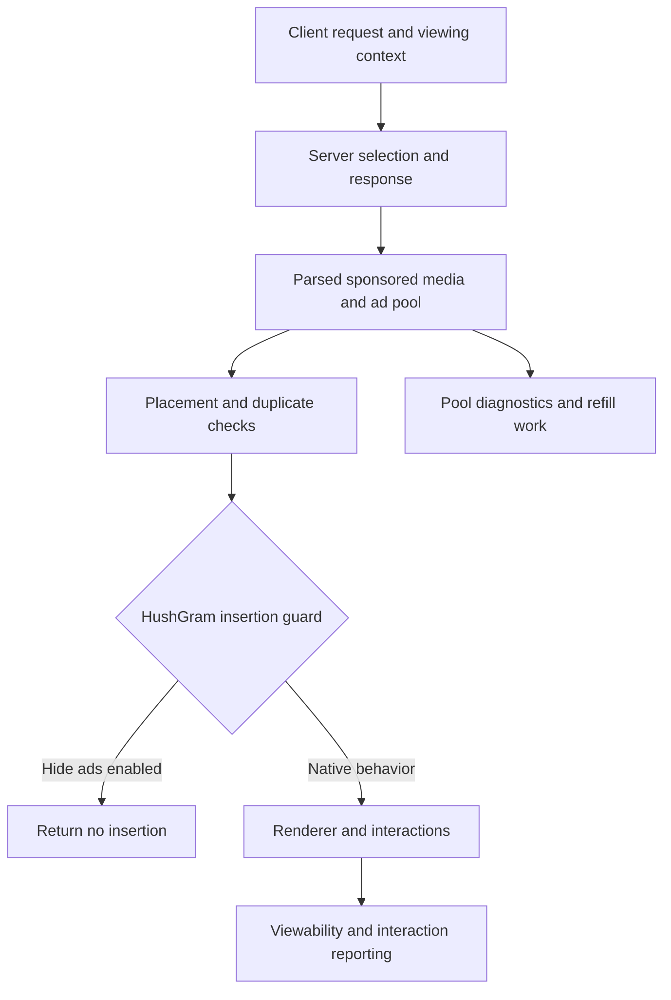

# Instagram internals and patch sources

This reference maps Instagram's current client behavior to HushGram's hooks. It covers ad delivery, tracking, surface cleanup and customization, with concrete places to investigate when updating or adding patches. The source census at the end explains code provenance separately.

## Instagram 450 internals and patch opportunities

Audit revision 2, October 9, 2026. Revision 1 supplied the static mapping. Revision 2 adds the bounded physical-device observations below. HushGram source baseline [1bf04031](https://github.com/SysAdminDoc/HushGram/tree/1bf04031). The published bundle is v0.0.7. Current main contains later changes, so **implemented** below means present in the reviewed source, not necessarily shipped in that release.

### Reading guide

- [Evidence and limits](#evidence-and-limits)
- [Measured network, background activity and battery](#measured-network-background-activity-and-battery)
- [Artifact and application structure](#artifact-and-application-structure)
- [Ad delivery and suppression](#ad-delivery-and-suppression)
- [Tracking and privacy](#tracking-and-privacy)
- [Annoyances and customization by surface](#annoyances-and-customization-by-surface)
- [Prioritized work](#prioritized-work)
- [Open issue dispositions](#open-issue-dispositions)
- [Pull requests and discussion intake](#pull-requests-and-discussion-intake)
- [Factory walkthrough and update procedure](#factory-walkthrough-and-update-procedure)
- [Source census and provenance](#source-census-and-provenance)

### Evidence and limits

| Label | What was established | What it does not establish |
| --- | --- | --- |
| Current source | The actual patch declaration, runtime helper, settings and test source at the baseline above were inspected. | A test passing today, a shipped artifact containing the latest change, or a live account using that route. |
| Current binary | The original Meta-signed 450 base APK was checked. Bounded DEX probes traced the ad request builders and insertion path. A separate string-table scan recorded tracking and integrity names. | Execution, a captured request payload, a server rollout or a remote integrity verdict. |
| Historical observation | Earlier repository notes or issue comments report a result, with its version/date kept explicit. | Current 450 acceptance on another account, device or release. |
| Reported | An open issue describes a symptom or request. All 74 open threads were read, together with two open PR diffs and the discussion intake. | Independent reproduction. Linked screenshots and videos were not all retrievable and are not treated as inspected. |
| Runtime observation | A timed packet capture, UID activity and physically unplugged battery observations on the separately identified installed build. | A factory baseline, a matched patch-saving comparison, current-release acceptance or decrypted request contents. |
| Candidate | Source reasoning identifies a useful change or an experiment that can settle a question. | A confirmed bug, safe implementation or automatic promise to ship it. |

Revision 1 was static inspection. Revision 2 opened the existing patched installation and measured its traffic, background activity and battery discharge. Both available physical installations were already re-signed, so neither supplied a factory baseline. Existing accounts, app data and signing keys were preserved. Credentials and account content are excluded from the published evidence.

This audit combines a static map with one bounded runtime observation and a broader acceptance plan. It does not enumerate every server feature, hidden rollout, native message path or live ad placement. Application tests were inspected, not executed. The measurement parsers received focused offline checks. No patch behavior or release artifact changed in this documentation delivery.

The most actionable findings are these.

| Finding | Confidence | Consequence |
| --- | --- | --- |
| Hide ads guards client insertion. Current ad request builders independently carry viewing and session context. | Source plus current method-level binary evidence | Visible ad suppression does not establish request suppression, bandwidth savings or elimination of ad-context tracking. |
| Disable analytics accepts partial coverage, and its startup policies differ by route. | Source, independently reviewed | An installed switch does not establish seven-of-seven coverage or zero early-start traffic. |
| Home empty-state flags live for the whole process. | Source, independently reviewed | Account and feed-generation transitions deserve focused investigation against #104/#105/#28. The cause of those reports is not proved. |
| The clipboard adapter skips URI-only items. | Source and PR #107 | Earlier parsers might clean some URLs, but the final clipboard boundary is incomplete. |
| Ads, recommendations, paid partnerships and affiliate commerce have different native representations. | Source plus current binary | New filters need accurate classification and separate switches. |
| Background work continued with Home awake. Seven non-wakeup heartbeat deliveries were recorded, with 18.736 CPU seconds and small continuing traffic. | Bounded runtime observation on extension 0.0.5 | Trace the scheduler and classify its work. These observations do not assign CPU or traffic to the heartbeat or establish battery savings. |
| Several requests are already implemented, while live reports still identify failures. | Source and issue intake | Prioritize remaining coverage and correctness before duplicating feature families. |

### Measured network, background activity and battery

Runtime observation, October 9, 2026. This run used an existing patched Instagram installation on a physical Galaxy S22 Ultra. Its embedded extension reports **0.0.5**, with Hide ads and Disable analytics enabled. It is neither a factory installation nor validation of HushGram 0.0.7 or the reviewed source commit. The [runtime evidence file](instagram-450-runtime-observation.json) records the measured artifact separately from the original APK inventory.

#### Installed build and workload

| Property | Recorded condition |
| --- | --- |
| Instagram | `450.0.0.50.77`, build `385611438` |
| Installed APK SHA-256 | `eca328755547023867b41dea1415daf7f0c07f674dfe8303473005f970524306` |
| Embedded build fingerprint | `hg1:0a7209f6530934d4c9cf995d0a75eb89d6b64ef2f893417a720e1c15c544678a` |
| Phone and system | SM-S908U1, Android 16 / API 36, firmware `S908U1UESAGZE3` |
| Display and network | 1080 by 2316 pixels, manual brightness setting 50, Wi-Fi |
| Relevant switches | Hide ads on, Disable analytics on, reel watch-history suppression on, Data saver off, Default playback quality on. Pause and Debug logging off. |
| Patch target report | Analytics 7/7, sharing links 6/6. These are patch-time matches, not measured network suppression. |

Home showed an empty welcome state. Explore contained content, so the foreground workload opened a Reel from Explore, then made nine vertical swipes over five minutes. The initial and final UI dumps both showed the Reel viewer with different content. No follows, likes, messages or suggested-person profiles were selected. All existing patch switches were preserved. The diagnostic evidence includes 92 Boolean settings. The playback-quality selector showed Auto in the final settings observation.

The accepted conditions were a three-minute stopped-app control, five minutes of Reels and ten minutes on the Android Home screen with the display awake and Instagram left alive. The final background condition followed a request to keep the phone awake on battery. It made no intermediate device commands. It is not screen-off or Doze evidence. Setup and navigation between conditions are excluded. Boundary collection adds a few seconds to counter intervals.

An earlier ten-minute background attempt was rejected. The display resumed about three seconds after sleep, and BatteryStats counted only 2.519 seconds off during its 602-second interval. Its 551.897 CPU seconds, 0.531 MB received, 2.454 MB sent and 63.56 mAh whole-phone decrease therefore describe an interrupted condition, not idle background behavior. A follow-on quiet attempt was stopped when its initial snapshot also showed the display on. A screen-off repeat was stopped after the requested condition changed to screen on. All rejected and aborted attempts remain labeled in the evidence. They are excluded from the accepted-result tables.

#### Measured app activity

Network bytes below come from Android UID histories on the underlying Wi-Fi network. MB means 1,000,000 bytes. CPU is accumulated across cores, so it can exceed elapsed wall time.

| Condition | Counter interval, about seconds | Received MB | Sent MB | CPU seconds | Partial wakelock seconds | Screen-off wakeup alarms / job starts |
| --- | ---: | ---: | ---: | ---: | ---: | ---: |
| App stopped, screen off | 182.9 | 0.000000 | 0.000000 | 0.000 | 0.000 | 0 / 0 |
| Foreground Reels | 302.2 | 56.790531 | 1.128587 | 393.392 | 0.000 | 0 / 0 |
| Home awake, app in background | 602.1 | 0.081644 | 0.092466 | 18.736 | 0.000 | 0.0 / 0 |

#### Battery results

The fuel-gauge figures cover the whole phone. Android's estimated Instagram mAh appears in a separate column and is not a physical app-only measurement.

| Condition | Fuel-gauge interval, seconds | Whole-phone charge decrease, mAh | Approximate mean battery current, mA | Battery level | Battery temperature, °F | Android estimated app energy, mAh |
| --- | ---: | ---: | ---: | --- | --- | ---: |
| App stopped, screen off | 183.1 | Unresolved (counter flat) | Unresolved | 79% to 79% | 85.1 to 84.6 | 0.001 |
| Foreground Reels | 302.2 | 49.94 | 595 | 79% to 78% | 85.3 to 86.9 | 24.670 |
| Home awake, app in background | 602.1 | 36.32 | 217 | 76% to 75% | 85.8 to 84.2 | 0.500 |

Foreground CPU time corresponds to about 1.30 fully occupied cores over the interval, not 130% of the entire processor. The smallest observed foreground charge step was 4.54 mAh. That observed step is not a calibration of gauge accuracy. The baseline counter stayed flat, so no baseline drain rate or battery-saving percentage can be calculated.

BatteryStats reported roughly twice the foreground Wi-Fi bytes shown by the underlying-network UID history. The two counters are retained separately in the JSON. The primary table uses the latter, and neither duplicate-looking view is added to packet totals. VPN accounting is one plausible contributor, but this run does not establish the exact cause. Modeled app energy has attribution and rounding limits too.

#### Observed network destinations

The capture selected Instagram. The saved VPN allowlist includes its main app UID and the corresponding SDK sandbox UID, as Android adds for an allowed application. This does not establish that a sandbox process ran or sent traffic. The raw-IP capture cannot distinguish them. Android UID histories here cover the main app only. Packet windows use the recorded workload bounds, excluding the after-snapshot collection. These windows are about 180, 300 and 600 seconds, while the UID counter intervals include a few more seconds.

| Accepted condition | Captured packets | Received IP bytes | Sent IP bytes | Sent transport payload bytes | Sent TCP packets with no payload |
| --- | ---: | ---: | ---: | ---: | ---: |
| Stopped-app control | 0 | 0 | 0 | 0 | 0 |
| Foreground Reels | 50,106 | 56,970,384 | 1,151,812 | 925,336 | 25 |
| Home awake, Instagram in background | 720 | 132,617 | 112,891 | 95,831 | 39 |

Transport payload still includes encrypted records, handshakes and retransmissions. QUIC also carries its acknowledgements and control frames inside encrypted UDP payload, so these bytes cannot be treated as application uploads. Payloadless TCP packets include acknowledgements and connection control. PCAP and Android UID totals use different collection layers and slightly different time bounds, so they are shown separately.

The accepted background capture totals exceed the primary UID history by more than the clock-boundary sensitivity alone explains. Capture reconstruction, Android accounting and the broader main-app-plus-sandbox routing scope are possible contributors. The observation does not isolate the cause, prove sandbox traffic or provide a conversion between these totals.

The following names are attributed to traffic inside accepted phases using visible TLS or QUIC handshakes across the complete capture, including handshakes before a phase. Bytes are capture IP bytes. Hostname attribution does not identify a request path or purpose.

| Visible hostname | Transport | Foreground received / sent bytes | Background received / sent bytes |
| --- | --- | ---: | ---: |
| `scontent-iad3-2.cdninstagram.com` | UDP | 36,372,423 / 598,615 | 4,008 / 4,128 |
| `scontent-iad3-1.cdninstagram.com` | UDP | 11,410,432 / 151,840 | 0 / 0 |
| `scontent-iad6-1.cdninstagram.com` | UDP | 8,857,440 / 173,216 | 0 / 0 |
| `i.instagram.com` | UDP | 227,456 / 134,995 | 4,008 / 4,128 |
| `dns.google` | UDP | 48,097 / 23,545 | 56,525 / 28,705 |
| `test-gateway.instagram.com` | UDP | 10,848 / 11,481 | 15,450 / 13,983 |
| `graph.facebook.com` | UDP | 8,500 / 13,728 | 10,262 / 18,291 |
| `edge-mqtt.facebook.com` | TCP | 9,930 / 18,584 | 6,018 / 11,136 |
| `scontent-mia5-1.cdninstagram.com` | UDP | 8,256 / 8,448 | 4,008 / 4,128 |
| `scontent-dfw6-1.cdninstagram.com` | UDP | 8,352 / 8,576 | 0 / 0 |
| `scontent-mia3-3.cdninstagram.com` | UDP | 8,256 / 8,448 | 0 / 0 |
| `test-gateway.instagram.com` | TCP | 0 / 0 | 7,277 / 8,946 |
| `scontent-ord5-1.cdninstagram.com` | UDP | 0 / 0 | 4,128 / 4,224 |
| `scontent-mia5-2.cdninstagram.com` | UDP | 0 / 0 | 4,128 / 4,224 |
| `scontent-mia3-1.cdninstagram.com` | UDP | 0 / 0 | 4,128 / 4,224 |
| `scontent-mia3-2.cdninstagram.com` | UDP | 0 / 0 | 4,008 / 4,128 |
| `[opaque-label].xy.fbcdn.net` | TCP | 0 / 0 | 4,375 / 1,353 |
| `[opaque-label].xz.fbcdn.net` | TCP | 0 / 0 | 4,206 / 1,193 |
| `z-m-gateway.facebook.com` | TCP | 394 / 336 | 0 / 0 |
| `[unmapped]` | TCP | 0 / 0 | 88 / 100 |

About 99.46% of foreground received IP bytes were attributed to `cdninstagram.com` names. About 98.36% of sent IP bytes used UDP. Only 1,540 sent IP bytes were in TCP packets without payload, including 20 strict ACK-only packets. TCP acknowledgements therefore do not explain most sent bytes. QUIC acknowledgements and control remain encrypted, so the remaining bytes cannot be labeled application uploads or analytics.

Shared API and gateway names remain visible with Disable analytics enabled. This is evidence of continuing transport traffic attributed to those names, not evidence that a particular analytics path bypassed suppression. A decrypted path or local request-classification trace is needed for that conclusion. Opaque hostname labels are replaced in the published tables.

Android adds the mapped SDK sandbox to an application VPN allowlist. The [AOSP VPN implementation](https://android.googlesource.com/platform/frameworks/base/+/refs/heads/android15-release/services/core/java/com/android/server/connectivity/Vpn.java) and [UID mapping reference](https://developer.android.com/reference/android/os/Process#getAppUidForSdkSandboxUid(int)) explain that routing rule.


#### Background timing

| Seconds after background entry | Received IP bytes | Sent IP bytes | Packets |
| --- | ---: | ---: | ---: |
| 0 to 60 | 22,368 | 21,163 | 122 |
| 60 to 120 | 23,115 | 20,865 | 113 |
| 120 to 180 | 44,520 | 38,413 | 260 |
| 180 to 240 | 4,347 | 736 | 14 |
| 240 to 300 | 17,728 | 10,518 | 70 |
| 300 to 360 | 0 | 0 | 0 |
| 360 to 420 | 18,906 | 17,918 | 106 |
| 420 to 480 | 0 | 0 | 0 |
| 480 to 540 | 1,633 | 3,278 | 35 |
| 540 to 600 | 0 | 0 | 0 |

Traffic arrived in bursts. The nominal background packet window ended with about 109 seconds without a captured packet. Capture start/stop observations and the exported file support the collection interval, but they are not a continuous service-state trace. Packet silence alone cannot prove either continuous capture or permanent network inactivity.


Packet windows use a device-minus-computer clock offset of 0.840 seconds, with about 0.943 seconds of boundary uncertainty. This is the midpoint and envelope of both clock readings, taken before and after the run. Their uncertainty intervals overlap, so the changed point estimate does not prove drift. An unsampled clock step outside this envelope remains possible. The evidence includes shifted-window and inner/outer-bound counts so a packet near a boundary is not mistaken for precise causal timing.

#### Background scheduling and patch opportunities

The original build 385611438 was also inspected for the scheduler paths seen in the saved device state. This is additional static evidence from the Meta-signed base, separate from the measured patched APK.

| Native route | What the original binary establishes | What the observation still cannot establish |
| --- | --- | --- |
| `action_batch_upload` / `AnalyticsUploadAlarmReceiver` | A gated method creates an explicit PendingIntent and calls `AlarmManager.set` with elapsed-realtime wakeup type and a requested delay of 300,000 ms. A pending flag prevents duplicate scheduling on that path. | A fixed repeating timer, execution after every launch, or an upload merely because an alarm was scheduled. |
| `action_upload_retry` | The same receiver has a separate retry action and dispatch reason. On receipt, it clears the corresponding pending flag. A configuration-gated controller path can return to scheduling. | The failure-to-retry interval, persistent queue ownership or a measured retry loop. |
| Native event queue | A Handler can queue events, drain them and notify analytics observers. A second controller implementation calls the scheduler directly. | Safe retirement of persisted batches, account ownership or the complete success/failure contract. |
| `com.instagram.warm_heartbeat` / `KeepWarmReceiver` | The receiver checks a stored process ID. Scheduling uses non-wakeup RTC alarms, increasing delays and state/duration gates. | A network send, tracking purpose or the ability to wake a sleeping phone by itself. |
| WorkManager `SystemJobService` | Work is dispatched through `EXTRA_WORK_SPEC_ID` plus `EXTRA_WORK_SPEC_GENERATION`. | The concrete worker behind a generic scheduled service, or an analytics classification without that join. |

The pre-workload snapshot had one batch-upload alarm and seven registered WorkManager jobs. None of those jobs was ready or running. During the rejected display-interrupted interval, one warm-heartbeat delivery and one batch-upload delivery were recorded. The batch-upload alarm did not reappear in its final scheduled snapshot. That is not evidence of a repeated retry loop.

##### Accepted setup

The app was left behind Home while the phone stayed awake on battery. The interval contains 602.079 seconds of battery accounting and zero screen-off time. Both saved boundaries report the screen on. Android classified the app for 179.245 seconds as background and 422.834 seconds as cached, totaling the full interval, with 0 seconds TOP or foreground service. The saved final Activity record and UI identify the system launcher. Two app processes remained present at both boundaries. Background or cached state does not mean that no work occurred.

##### Observed work

App CPU increased by 18.736 seconds, comprising 12.221 user seconds and 6.515 system seconds. That is about 3.112% of one core during the accounting interval. Primary physical-network history recorded 81,644 received bytes and 92,466 sent bytes, all in the DEFAULT accounting set. Partial-wakelock time and observed job starts did not increase. The phone remained awake by the requested screen-on setup, so its awake duration is not evidence that the app kept it awake.

##### Alarm deliveries

Seven non-wakeup RTC warm_heartbeat deliveries were retained in the target app's saved AlarmManager history. Their approximate times after phase start were 12, 48, 100, 171, 259, 364 and 486 seconds. These times apply the measured device-to-computer clock conversion to the saved alarm history, rounded to whole seconds. The clock envelope alone is about one second, and these are not trace-synchronized timings. Each delivery was followed by another addition. An eighth instance was still pending inside its allowed delivery window at the final snapshot. No batch-upload or REGISTER_RETRY delivery was recorded in this accepted interval. The seven events are alarm deliveries, not device wakeups. A zero screen-off wakeup count does not contradict them while the display is on.

##### Registered jobs and execution

The final snapshot contains eight registered jobs. Seven use WorkManager's SystemJobService and are Ready:false. The additional IgBgFetchSchedulerService job is Ready:true, with its earliest time about 11.187 seconds past, but it is not marked pending or active. Registration and readiness do not establish execution. Battery accounting shows zero new job starts or completions, and the bounded retained JobScheduler history contains no target START or STOP in the interval. A later execution after the snapshot cannot be inferred.

##### Power interpretation

The phone's fuel gauge fell by 36.32 mAh across 602.084 seconds, about 217.17 mA mean whole-phone current with Home visible. Only before, entry and after battery readings were taken. They confirm discharging without a power connection at those readings, but do not prove every transient state across the approximately 600-second unsampled gap. Battery temperature changed from 85.82 to 84.20 degrees F at the boundaries. Android's separately modeled app-energy delta is 0.5 mAh, rounded and subject to attribution limits. It is not measured app-only energy. VPN history and BatteryStats network attribution must not be added to the primary traffic totals.

##### Comparison limits

The stopped baseline had its screen off, while the accepted background interval kept Home awake. Subtracting those whole-phone readings cannot isolate app background energy because the display conditions differ. The baseline's charge counter also remained flat, so that short baseline did not resolve a drain rate. There is no matched stock control or causal battery-saving result. The interrupted screen-off interval failed its intended condition; two other incomplete attempts are aborted and provide no phase measurements.

##### Follow-up interpretation

Repeated warm_heartbeat delivery and the ready background-fetch job are concrete paths to trace on the installed build. These snapshots cannot assign the observed CPU, traffic or discharge to either path, establish that they are analytics, or show that their work is unnecessary. Preserve notification behavior while identifying each receiver, worker and rescheduling rule.

These observations sharpen the existing analytics and prefetch opportunities. Destination refusal does not by itself remove enqueue, scheduling or queue-management work. A useful next patch experiment would identify the analytics-only queue and completion contract, then compare a narrow enqueue/schedule policy against the same installed build. It must clear or cancel owned pending state correctly, handle work scheduled before the switch changed, and preserve ordinary requests and notification registration. Returning before clearing a native pending flag can leave stale state.

Do not suppress the shared AlarmManager or WorkManager service. First join a WorkSpec identity and generation to its concrete worker, keeping unique work identifiers private. Keep app warming separate from analytics and FBNS notification registration. For the existing ad-suppression work, visible SNI and encrypted byte totals cannot count sponsored tasks. A focused request-classification counter is still needed to evaluate ad-request and prefetch suppression.

The measured diagnostic reported analytics targets matched 7/7. That records patch-time discovery. Its hook invocation totals were taken before the workload and are neither blocked-request counts nor phase deltas. No stock-versus-patched savings percentage, daily battery estimate or zero-tracking claim is supported by this run.

#### How the measurements were collected

The phone used Wi-Fi and wireless debugging after its USB cable was physically removed. Every measured battery sample reported discharging, with AC, USB, wireless and dock power absent. Battery simulation was not used. A brief USB reconnection happened between the baseline and foreground runs. The foreground collector refused to start until power was physically disconnected again. That interval is excluded from the phase results.

PCAPdroid 2.0.2 captured the Instagram application through Android's local VPN. The requested configuration selected both IP versions, classic PCAP output, no TLS interception, no SOCKS proxy, no root capture and no QUIC blocking. Automatic private-DNS blocking was disabled in the start request. Android's existing private-DNS setting was preserved. The local VPN addresses were independently checked and used for packet direction, rather than guessing direction from ports or address ranges.

This is an observation with instrumentation overhead. PCAPdroid adds processing, and wireless debugging plus battery reads can wake the phone. The baseline and foreground phases sampled battery every 30 seconds. The accepted background interval kept the display awake and capture active but made no intermediate device reads. Its boundary snapshots and Android's timebases validate the recorded condition, but they cannot reveal every brief unsampled event. The capture's IP bytes are not exact Wi-Fi radio bytes. In VPN mode, PCAPdroid reconstructs some inbound headers and segmentation, which can change the packet view. See [PCAPdroid's packet-analysis limits](https://emanuele-f.github.io/PCAPdroid/quick_start#14-packet-analysis).

Each boundary saved the battery state, current BatteryStats CSV and text, UID network histories, alarms, jobs, process list, device-idle state and thermal state. Network statistics were polled first, then read in a separate command. No global statistics or logs were reset. Direct per-UID kernel CPU data was denied on this retail build, so CPU time comes from synchronized Android battery accounting.

The app's UID was resolved for Android user 0. A second profile's installation had a different UID and was excluded. UID histories were summed only in the untagged DEFAULT and FOREGROUND sets. Tagged records overlap those totals and weren't added again. Historical VPN identity rows and raw kernel counters are retained separately in the evidence. BatteryStats process CPU overlaps UID CPU, so those figures also aren't added together.

Android cumulative activity counters are differenced within each phase. Packet totals count packets inside that phase. Pre-workload diagnostic invocation totals are separate snapshots. The parser rejects changed statistics epochs, removed history buckets and decreasing counters. It also checks the app identity, completed phase state and monotonic timestamps. Android's on-battery timebase must cover the interval before its counters can be interpreted as a full measurement. The separate snapshots take a few seconds, so battery, network and scheduler intervals have slightly different lengths. Their exact intervals are in the evidence file.

Remaining battery charge is reported in microampere-hours. The physical whole-phone difference is `(starting charge - ending charge) / 1000` mAh. Dividing that difference by elapsed hours gives an approximate mean battery current. This is whole-phone discharge, including Android, the screen, other apps and collection tools. It isn't Instagram-only energy. Android's attributed app mAh is a separate model output. See the [BatteryManager counter definitions](https://developer.android.com/reference/android/os/BatteryManager#BATTERY_PROPERTY_CHARGE_COUNTER).

The device's charge counter changes in discrete steps. A flat short interval leaves drain unresolved. It does not show zero consumption, and it cannot be subtracted as a zero-power baseline. The Samsung-specific instantaneous current field was retained privately without conversion because its driver units weren't independently established.

#### What the traffic can establish

Hostnames were recovered from TLS ClientHello SNI and authenticated QUIC Initial handshakes. TCP handshake fragments and QUIC CRYPTO fragments were reassembled. QUIC Initial protection uses public handshake material, so decoding that handshake does not decrypt application data. Host attribution uses the whole capture, including handshakes before a phase. Only packets inside the selected phase count toward its traffic total.

The phone and collection computer's clocks were compared. Packet windows were shifted by the measured offset, and their boundary uncertainty was retained. The packet parser checked byte order, timestamp precision, raw-IP and Ethernet framing, IPv4/IPv6, unknown direction and phase boundaries. Its offline checks included published QUIC v1 and v2 vectors. Separate saved-data checks covered profile isolation, overlapping counters, stale phases, statistics resets and unresolved battery counters.

SNI establishes a transport destination. It doesn't reveal the HTTPS path, request body, response classification or reason for a transfer. A shared API or media host can serve more than one purpose. No request-body tracking inventory, ad-request count or zero-tracking claim follows from these host totals. Missing hostnames remain unattributed. No TLS interception certificate was installed.

Raw packets, diagnostic dumps and account screens stay local. Published evidence contains selected build facts, settings and numerical summaries. It excludes account names, device serials, network addresses, cookies and message content.

#### Repeating the observation for a patch change

1. Identify the exact APK hash, signer, Instagram build and embedded HushGram build. Keep a genuinely original Meta-signed installation as a separate control. Pause cannot turn a re-signed APK into stock or restore manifest edits.
2. Resolve the UID for the intended Android user. Save the relevant switches and playback quality. Keep brightness, network, capture configuration and the content workload consistent.
3. Physically disconnect external power. Check actual power flags and discharge status before collecting. A simulated unplug only changes Android's reported state and is unsuitable for measuring physical drain.
4. Start one app-filtered capture, then collect complete before/after snapshots for a stopped-app idle control, a timed foreground workload and natural background use. Leave the app alive for the background condition. Keep launch/setup traffic outside those windows and report it separately if needed.
5. Reassemble handshakes and slice the capture using recorded timestamps with clock uncertainty. Compare UID bytes with capture bytes without expecting identical packet accounting. Report CPU, partial wakelocks, wakeup alarms and job execution separately from pending schedules.
6. Repeat matched conditions, preferably alternating their order. Use the same media where possible and separate warm-cache and cold-cache runs. A longer idle or overnight run is needed before estimating daily background cost or judging sparse retries.
7. Stop the capture, restore temporary device state and remove only the generated diagnostic files after their local copies are verified. Keep private evidence outside the repository.

For exact field meanings, consult [BatteryStats accounting](https://android.googlesource.com/platform/frameworks/base/+/main/core/java/android/os/BatteryStats.java), [network-statistics collection](https://android.googlesource.com/platform/packages/modules/Connectivity/+/main/service-t/src/com/android/server/net/NetworkStatsService.java) and [battery-state overrides](https://android.googlesource.com/platform/frameworks/base/+/main/services/core/java/com/android/server/BatteryService.java). Those definitions explain the method. The values in this section come from the saved phone observations.


### Artifact and application structure

The [machine-readable evidence inventory](instagram-450-evidence.json) records this artifact and selected native anchors. It contains field names and static facts, never live identifier values or payloads.

| Property | Observed value |
| --- | --- |
| Package | `com.instagram.android` |
| Version / build | `450.0.0.50.77` / `385611438` |
| Base APK SHA-256 | `ba394ecac1700f353fa5f14c6f88b1046c5fde75d16f7e2cb9bdaeebf71fa5bb` |
| Base APK size | 134,647,410 bytes |
| ABI | `arm64-v8a` |
| Minimum / target / compile SDK | 28 / 36 / 37 |
| Split requirement | Density split. Inspect the matching bundle as well as the base. |
| DEX | 23 root DEX files, 173,939,208 uncompressed bytes |
| Native library inventory | 15 loose `.so` files plus 64 packed library records, 79 distinct basenames in this base APK |
| Packed native container | `assets/lib/libs.spo`, 25,822,271 bytes, described by `assets/lib/metadata.txt` |
| Declared components | 525 activities, 24 activity aliases, 100 services, 64 receivers, 25 providers |
| Original signer, API 33 and later | `3a10c50c18ba937506c2875e9047be74f8fd8b86fae2ff9feaa50a81fcb4c014` |
| Original signer, API 24 through 32 | `5f3e50f435583c9ae626302a71f7340044087a7e2c60adacfc254205a993e305` |

The signature verification succeeded. Component counts describe manifest declarations in the base, including optional or disabled features. They aren't a count of reachable screens or enabled background jobs. The native library count is also base-only, not every split or dynamically loaded module.

Instagram has several implementation layers. Java/Kotlin-facing DEX handles feed models, UI controllers, GraphQL and request construction. Bloks supplies server-selected screen flows. Packed native libraries include Tigon networking and other transport modules. The embedded browser has code in a separate split. Android activities, providers, notifications and intent handlers form additional entry points. A single screen can therefore depend on several request and rendering paths.

Source-link labels sometimes use these short prefixes. All linked destinations resolve to the full repository path.

| Prefix | Repository path |
| --- | --- |
| `P/` | `patches/src/main/kotlin/app/morphe/patches/instagram/` |
| `I/` | `extensions/instagram/src/main/java/app/hushgram/extension/instagram/` |
| `PT/` | `patches/src/test/kotlin/app/morphe/patches/instagram/` |
| `IT/` | `extensions/instagram/src/test/java/app/hushgram/extension/instagram/` |

Relevant declared permissions include Internet/network state, wake locks, boot reception, foreground services, notifications, accounts, camera/microphone, contacts, fine location, nearby network access, phone state and media access. Some legacy permissions are SDK-limited. The advertising permissions are discussed below. A manifest declaration establishes capability or a permission request, not that data was accessed, granted or uploaded. Likewise, `allowBackup=true` is a manifest setting, not evidence that account secrets are included in a backup.

Use the package/version/signers in [AppCompatibilities.kt](../patches/src/main/kotlin/app/morphe/patches/shared/compat/AppCompatibilities.kt) as the supported-build authority. Other 450 builds are separate compiles. Recheck model shape, pooled strings and caller relationships for each one rather than transplanting obfuscated names.

### Ad delivery and suppression

Meta describes ad selection as a server auction among eligible ads, with bid, estimated action rate and ad quality contributing to value. This explains selection upstream of the client. It does not disclose this APK's live targeting inputs or prove the payload of a particular request. [Meta's ad-delivery explanation](https://about.fb.com/wp-content/uploads/2023/01/Toward_fairness_in_personalized_ads.pdf).



This combines the observed client stages with Meta's published server explanation. It is a working flow map, not a complete network call graph.

#### How ads reach the client

**Current binary.** There is an explicit asynchronous ad request route, ads/async_ads/. It is present in the methods carrying ClipsSponsoredApiUtil's own retained diagnostic names:

- createFeedOfAdsTask / getClipsFeedOfAdsIgApiBuilder
- createSponsoredContentRequestTask
- createSponsoredContentTask / createSponsoredContentStreamingRequestTask

The route is relative. Its final host and the actual request selection were not captured on the wire.

The request builders include these literal parameter keys. They sit beside request-builder calls, not only in a shared string pool:

- seed_item_id, seed_ad_id, seed_ad_token, keyword, container_module
- organic_item_ids, chaining_session_id, viewer_session_id
- skip_ad_insertion, client_recorded_request_time_ms, nav_chain
- host_media_id, is_instream_ads_request, host_media_position, seed_media_id
- is_prefetch, ad_and_netego_request_information, paging_token, is_organic_head_load
- has_user_set_breaks, take_a_break_nudge_last_seen_time, session_time_spent
- current_time_in_seconds_since_midnight, client_view_state_media_list, is_refresh

The current method probe records these keys beside request-builder calls. Some values are gated and optional. Presence of a key proves client capability, not that it is populated or sent on every request. Names alone do not fully define value semantics.

What this means for privacy work: behavioral context can be carried on functional ad requests as well as separate logging requests. Blocking a generic analytics upload endpoint cannot, by itself, remove these parameters. A screenshot with no ad is also not evidence that no ad request was sent.

The current binary also contains Home and Stories request routes. The current request-method inventory identifies feed/timeline/, feed/reels_tray/ and feed/reels_media/ in request methods. Stream variants are present too. TigonServiceLayer.logQPL knows feed/timeline and feed/reels_tray. This is a multiple-request architecture, not one monolithic feed payload.

**Current binary.** The client has an ad pool and an insertion controller. The controller has one matching static boolean insertion method in `classes2.dex`. It contains both cross_surface_duplicate_ad and Is ad pod, exactly the current HushGram fingerprint. The bounded method probe inspected its fields, constructor and method body.

The insertion path reads an item, its placement state and a pool, invokes validity and duplicate checks, changes state, updates a timestamp, and adds to collections. Neighboring controller callbacks contain onHighestPositionPushUp, onInjectionRuleStatusUpdated, injection_orchestrator_position_passed_with_insertion_but_not_impression_, remove_for_reinsertion and replaced_by_ad_id. The caller scan found four direct static call sites in one injection orchestrator, split between two callbacks. This proves insertion/reinsertion orchestration exists. It does not prove that every placement surface or future server format uses it.

The pool selection path contains bad_network, not_headload_segment, invalid_ad_pod_gap, request_too_late and ad_pool_exhausted. Ad-related diagnostics carry num_items_in_ad_pool, ad_pool_snapshot, last_injected_sponsored_content_position, last_seen_sponsored_content_position, instagram_ad_insertion_failure and instagram_ad_insertion_success. These are candidate observation points for request volume, rejected insertions and retry behavior. They are not proof of a network request by themselves.

A useful model for future work is:

- request construction, including contextual parameters
- asynchronous response / parsed media and sponsored metadata
- pool and placement rules
- insertion or reinsertion into a surface
- native renderer, click destination and viewability / diagnostic paths

HushGram's ad hook currently sits at the insertion stage. A future privacy or bandwidth patch must trace the earlier request/completion boundary, rather than assuming the current display patch already covers it.

#### What Hide ads actually changes

**Current source.** [patches/src/main/kotlin/app/morphe/patches/instagram/ads/Fingerprints.kt:15-47](../patches/src/main/kotlin/app/morphe/patches/instagram/ads/Fingerprints.kt#L15-L47) identifies a static boolean method with three parameters and the two retained strings cross_surface_duplicate_ad and Is ad pod, matched exactly (the fingerprint it replaced matched any string containing them, and both are exact constants in the insert on 449 and 450). [HideAdsPatch.kt:39-60](../patches/src/main/kotlin/app/morphe/patches/instagram/ads/HideAdsPatch.kt#L39-L60) requires exactly one match and one local register, then injects a guard at instruction zero. If Ads.hide() returns true, the method immediately returns false. Otherwise execution branches to the original first instruction. The guard therefore says that no sponsored item was inserted.

This is a compact control point with useful properties. It avoids placing the item at all rather than hiding a rendered View. It preserves native code while the switch is off. The setting is read for every insertion, so a restart is not required by this helper. Unique matching fails during patching when the anchor becomes missing or ambiguous.

**Current source.** [extensions/instagram/src/main/java/app/hushgram/extension/instagram/ads/Ads.java:22-29](../extensions/instagram/src/main/java/app/hushgram/extension/instagram/ads/Ads.java#L22-L29) returns Utils.settingsReady() && Settings.HIDE_ADS.get(). Exceptions report a hook failure and return false. Source documents pause/unready behavior at lines 17-20. [Settings.java:62-64](../extensions/instagram/src/main/java/app/hushgram/extension/instagram/settings/Settings.java#L62-L64) sets the default to true. This is intentionally fail-open at runtime for display filtering. Before settings are ready or after a setting-read failure, Instagram's original insertion path runs.

Important limit: the helper takes no media, surface, request or account argument. It cannot classify a placement, distinguish historical boosted content or count distinct blocked ads. It only decides globally whether to reject the insertion attempt. There is no ad request construction, response cancellation, cache purge, attribution token scrub or prefetch cancellation in this patch. It may avoid downstream work because the item was never inserted, but the amount requires measurement.

The native guard runs before the insertion method's callbacks and state updates. Callers still perform pool reads before reaching it and other callbacks afterward. Returning false must not be interpreted as turning off the whole advertising subsystem.

CURRENT SOURCE verification inventory. scripts/injected-mutation-contracts.txt:144-150 requires one Ads.hide call at the start of the static boolean method holding cross_surface_duplicate_ad, and forbids additional calls elsewhere. This guards placement and duplication. A source search found no dedicated AdsTest, HideAdsHookTest, Ads.hide runtime exercise or AdInjectorFingerprint fixture test in the two normal test trees at this baseline. Other tests cover catalog inclusion/settings and generic contracts. The static pass did not run these tests, so this is an inventory gap, not a failed test result. Unreleased source on main since then adds HideAdsHookTest (unique, missing, duplicate and wrong-shape anchors, no spare local, the guard's exact entry branch, and each declared build's fixture) and AdsTest (on, off, Pause, no context and before the pause is decided). They haven't run yet.

High-value acceptance cases for this hook:

- zero/one/two fingerprint matches; wrong static flag; wrong return/parameter shape; insufficient locals
- on, off, paused, settings unready and settings read failure
- exactly one entry call; native first instruction unchanged; true returns false; false takes original path
- cold start, resumed activity, fast scrolling, reinsertion and cross-surface duplicate path
- observed sponsored examples in Home, Reels and Stories on the exact target build
- no blank slots, repeated retries, repeated prefetches, broken pagination or extra CPU work
- count actual request starts/completions as well as visible items before making bandwidth/privacy claims

#### Paid delivery, recommendations, partnerships and commerce are different inputs

Sponsored delivery. This is the insertion-controller path described above. HushGram Hide ads targets it. A sponsored media object can still be received before the hook returns false.

Suggested posts. **Current source.** [FeedSuggestions.java:27-42](../extensions/instagram/src/main/java/app/hushgram/extension/instagram/feed/FeedSuggestions.java#L27-L42) identifies EXPLORE_STORY as the feed-item kind of a suggested individual post/reel. MEDIA is the ordinary followed-account item and remains. [HideSuggestedPostsPatch.kt:34-58](../patches/src/main/kotlin/app/morphe/patches/instagram/feed/suggested/HideSuggestedPostsPatch.kt#L34-L58) lists the separate unit families. This is recommendation filtering, not paid-ad classification.

Paid partnership. **Current binary.** Media has a getter and setter for the is_paid_partnership property. The current method probe found getters, setters and parsing support. A paid partnership label expresses a commercial relationship. It cannot be assumed to mean that Instagram delivered this item as an ad, nor that it was formerly boosted. Existing Hide ads does not inspect it.

Boost metadata. **Current binary.** A generated SponsoredInfo parser contains ad_id, is_boosted, sponsored_ad_disclaimer, ad_pod_rules, ad_expiry_timestamp_in_millis and request-related metadata. The current probe located these fields in the generated SponsoredInfo parser. The same schema includes partnership_ad_advertiser_igid and partnership_ad_render_format. This is a useful research anchor, not proof that every historically boosted organic Reel carries that object or flag.

Issue #12 needs a controlled example. Classification must avoid to equate is_paid_partnership or a tracking token with paid delivery. Current 450 evidence narrows the next step: inspect the SponsoredInfo relation on a known present ad, an organic partnership post, and a previously boosted organic Reel. An absent field cannot reconstruct historical promotion. An opt-in commercial-content filter may be feasible even when a reliable historical-boost filter is not.

Affiliate content. **Current binary.** Media's schema has affiliate_info and is_affiliate_commission_eligible, with current getter anchors in the binary inventory. User also has has_active_affiliate_shop. Those properties must not be collapsed into the ad-insertion flag. They can describe an ordinary post or creator's commerce eligibility. An independent opt-in control would need a proven field meaning and neutral behavior for absent/unknown fields.

Cross-promotion. **Current source.** Threads units use ten named feed enums. They include THREADS_IN_FEED_UNIT, TIFU_IN_EXPLORE, EOF_TIFU, KICKSTART_FEED_UNIT, COMMUNITIES_IN_FEED_UNIT, SMSL_IN_FEED_UNIT, LIVE_CHAT_IN_FEED_UNIT, SPORT_GAME_IN_FEED_UNIT, THREADS_IN_FEED_UNIT_MUSE and VERTICALS_IN_FEED_UNIT. [HideSuggestedPostsPatch.kt:44-52](../patches/src/main/kotlin/app/morphe/patches/instagram/feed/suggested/HideSuggestedPostsPatch.kt#L44-L52) and [FeedSuggestions.java:57-65](../extensions/instagram/src/main/java/app/hushgram/extension/instagram/feed/FeedSuggestions.java#L57-L65). They are filtered independently by HIDE_THREADS_POSTS. Cross-promotion does not have to pass through paid ad insertion.

Shopping and surveys. **Current source.** FEED_SURVEY has its own setting. SHOPPING_RECOMMENDATION_UNIT, PRODUCT_PIVOTS and LIVE_SHOPPING_NETEGO have their own setting. Suggested account/shop/hashtag units use an eleven-name family and HIDE_SUGGESTED_ACCOUNTS. All default on in [Settings.java:303-326](../extensions/instagram/src/main/java/app/hushgram/extension/instagram/settings/Settings.java#L303-L326). This does not establish that every shopping post, product tag or affiliate link has been removed.

Reels recommendations. **Current source.** [HideFeedReelsPatch.kt:19-20](../patches/src/main/kotlin/app/morphe/patches/instagram/feed/reels/HideFeedReelsPatch.kt#L19-L20) filters CLIPS_NETEGO, IMMERSIVE_SEGUE_ITEM, VIBES_IN_FEED_UNIT and HATCH_IMMERSIVE_IN_FEED_UNIT. Its runtime setting starts off ([Settings.java:296-297](../extensions/instagram/src/main/java/app/hushgram/extension/instagram/settings/Settings.java#L296-L297)). Followed-account reels remain as posts. This is separate from sponsored Reels and separate from hiding all video media in Home.

#### Where the feed filters sit and what that means during updates

**Current source.** [FeedItems.kt:24-33](../patches/src/main/kotlin/app/morphe/patches/instagram/feed/FeedItems.kt#L24-L33) fingerprints an Object-returning one-argument JSON parser by media_or_ad and clips_netego. It discovers the constructed feed-item type through its kept ClipsNetego field, then locates the one static helper that calls parseFromJsonParser (lines 70-92). This is better than matching an obfuscated class name.

[FeedItems.kt:45-61](../patches/src/main/kotlin/app/morphe/patches/instagram/feed/FeedItems.kt#L45-L61) filters every object return at the return's control-flow label, preserving branches that jump straight to that return. The helper returns null for removed items. Callers must tolerate null as a skipped item. Multiple patch filters compose because each returns null for null. [FeedSuggestionsHookTest.kt:35-66](../patches/src/test/kotlin/app/morphe/patches/instagram/feed/suggested/FeedSuggestionsHookTest.kt#L35-L66) covers both orders with Hide Reels in the feed. Lines 69-116 cover missing/ambiguous enum kinds. Lines 118 onward contain declared-build fixture coverage.

[FeedItems.kt:95-117](../patches/src/main/kotlin/app/morphe/patches/instagram/feed/FeedItems.kt#L95-L117) refuses a changed model unless exactly one of the item's enum types contains all requested kinds and no other enum names any of them. Runtime [FeedItemKinds.java:39-70](../extensions/instagram/src/main/java/app/hushgram/extension/instagram/feed/FeedItemKinds.java#L39-L70) then caches enum fields per class and compares Enum.name(). An unknown kind is retained. No enum field is reported as a missing member, once per class. Reflection failures return the original item through [FeedSuggestions.java:215-233](../extensions/instagram/src/main/java/app/hushgram/extension/instagram/feed/FeedSuggestions.java#L215-L233). This conservative behavior protects ordinary content but means a new recommendation kind will pass through until mapped.

Scope matters. [FeedItems.kt:64-68](../patches/src/main/kotlin/app/morphe/patches/instagram/feed/FeedItems.kt#L64-L68) says the shared parser also serves Explore's chain of posts, shop and ad feeds. [FeedSuggestions.java:38](../extensions/instagram/src/main/java/app/hushgram/extension/instagram/feed/FeedSuggestions.java#L38) records that Explore's grid did not use it on an earlier 449 check. The grid and the full-screen chain are different paths. This should be kept explicit in documentation and acceptance. A test of Home alone cannot prove isolation elsewhere.

Home-only media-type switches deliberately use Home's response and its FeedMediaCache restore path, rather than the shared parse helper. [HideHomeFeedPatch.kt:68-76](../patches/src/main/kotlin/app/morphe/patches/instagram/feed/home/HideHomeFeedPatch.kt#L68-L76) and 107-156 find both readers. [HideSuggestedPostsPatch.kt:91-146](../patches/src/main/kotlin/app/morphe/patches/instagram/feed/suggested/HideSuggestedPostsPatch.kt#L91-L146) builds a native Media.media_type bridge, using the retained media_type property key. Values are 1 photo, 2 video, 8 carousel, otherwise 0. Home post filtering retains unknown types and items with no Media. Its optional subtarget can be unavailable while the rest of Hide suggested posts installs (lines 72-81 and 127-146), and its status should be checked rather than assuming every subfeature was written.

Pagination is part of suppression. [FeedSuggestions.java:124-167](../extensions/instagram/src/main/java/app/hushgram/extension/instagram/feed/FeedSuggestions.java#L124-L167) has separate Home-hide, suggestion and media-type branches for the no-next-page answer. On builds with Home-specific reads, the suggestion branch requires a lost Home item and no kept Home item. The media-type branch instead uses its own removal flag, and HomeFeed.emptied() is checked first. This distinction matters when tracing a premature empty card or endless loader. Lines 170-207 handle Following's end card and stop its suggested tail from leaving a loading row. A filter at the renderer alone would miss this state machine.

Candidate consistency gap, not a reproduced user failure: FeedSuggestions.feedEnded at lines 145-148 checks suggested posts/accounts/Threads and media-type switches, but does not include HIDE_FEED_SURVEYS or HIDE_FEED_SHOPPING. Those switches can remove items and set tookOut. The existing all-switches-off end tests also list only the first three families ([FeedSuggestionsTest.java:248-270](../extensions/instagram/src/test/java/app/hushgram/extension/instagram/feed/FeedSuggestionsTest.java#L248-L270)). A synthetic page emptied only by shopping/surveys should be added to the acceptance matrix before expanding filtering. A live Home consisting entirely of those units was not observed.

Stories have a separate request/parser. [HideSuggestedStoriesPatch.kt:50-67](../patches/src/main/kotlin/app/morphe/patches/instagram/stories/tray/HideSuggestedStoriesPatch.kt#L50-L67) anchors the tray with tray, story_ranking_token and remaining_reel_ids_to_fetch, then classifies suggested and recap reel enums. [StoriesTray.java:31-37](../extensions/instagram/src/main/java/app/hushgram/extension/instagram/stories/StoriesTray.java#L31-L37) explains the separation. Hide the Stories tray suppresses its UI row, and the floating copy of the tray Instagram puts over the feed on a return to Home ([HideSuggestedStoriesPatch.kt:119-145](../patches/src/main/kotlin/app/morphe/patches/instagram/stories/tray/HideSuggestedStoriesPatch.kt#L119-L145), #88). Stop loading stories nulls parsed tray items and empties remaining IDs ([StoriesTray.java:104-142](../extensions/instagram/src/main/java/app/hushgram/extension/instagram/stories/StoriesTray.java#L104-L142)). This does not prove the initial tray request itself was prevented. Suggested tray items, ordinary story media and inserted story ads must be tested separately.


### Tracking and privacy

#### The tracking picture

Instagram has several separate information paths. Blocking one does not establish that the others are blocked.

1. Usage event uploads. A batch URL builder supplies Pigeon or logging_client_events addresses. A separate Graph literal and a server-configured MQTT analytics endpoint feed other upload routes.
2. Streaming usage events. Falco can put eligible events on a sessionless request stream instead of the batch uploader. The gateway also serves useful realtime GraphQL subscriptions, so blocking its entire host would mix unrelated functions.
3. Crash and reliability reporting. Lacrima builds a report address, caches it in fields and reads it again before sending. It also has startup/debug ping constants. Some reporting begins before Application.onCreate initializes HushGram preferences.
4. Feature requests that also reveal behavior. Story viewer receipts, Reel seen/progress batches, ordinary DM Seen, view-once Opened and typing are distinct requests, queue tasks or realtime commands. Hide ads and Disable analytics are not substitutes for these separate privacy patches.
5. Identifiers and account context. The app has advertising identifiers and other first-party device/session identifier names. Removing AD_ID cannot remove the authenticated account from requests, and a successful content request still reaches Instagram's service. Exactly which fields go on a given current request needs caller and serializer tracing or authorized decoded evidence.
6. Outgoing links and browser activity. Link shims, share tags, ad click IDs and UTM parameters are separate from in-app analytics. Cleaning a link when copied does not undo the page request that already happened in the in-app browser.
7. Attestation and trust. Package certificate checks, family-app IPC trust, Google integrity evidence and Keystore evidence have different authorities and different hooks. Replacing a local certificate answer does not make that APK Meta-signed.

#### Disable analytics, route by route

Primary source is [patches/src/main/kotlin/app/morphe/patches/instagram/misc/analytics/DisableAnalyticsPatch.kt:21-41](../patches/src/main/kotlin/app/morphe/patches/instagram/misc/analytics/DisableAnalyticsPatch.kt#L21-L41) and 56-104. Runtime behavior is [extensions/instagram/src/main/java/app/hushgram/extension/instagram/misc/Analytics.java](../extensions/instagram/src/main/java/app/hushgram/extension/instagram/misc/Analytics.java).

| Route | Host behavior and stable anchors | What HushGram changes | Boundary |
| --- | --- | --- | --- |
| builder | Static (String, boolean) -> String method holding `https://`, /pigeon_nest and /logging_client_events. `Fingerprints.kt:10-20`. | Wraps every return in Analytics.endpoint(String). | Only returned addresses from that discovered builder are affected. |
| graph | Literal `https://graph.facebook.com/logging_client_events`. `Fingerprints.kt:22-23`. | Wraps every discovered load of that exact string. | A newly assembled, differently encoded or native address is not automatically covered. |
| mqtt | JSONObject settings read under analytics_endpoint, with Graph logging as fallback. MQTT constructor anchors php_sandbox_host_name and mqtt-mini.facebook.com. [MqttAnalyticsEndpoint.kt:22-80](../patches/src/main/kotlin/app/morphe/patches/instagram/misc/analytics/MqttAnalyticsEndpoint.kt#L22-L80). | Rewrites the address immediately after the one optString(key, fallback) result. Resolves a Redex string-pool key before accepting the site. | This is the MQTT client's analytics URL, not a shutdown of MQTT messaging. Address values can come from the server. |
| reports | Static Uri builder taking String[] and holding https plus b-www.facebook.com. `Fingerprints.kt:31-40`. | Follows the builder result to stored String fields and filters reads before sends. [ReportAddressReads.kt:27-70](../patches/src/main/kotlin/app/morphe/patches/instagram/misc/analytics/ReportAddressReads.kt#L27-L70). | Discovered String-field reads only. A new storage shape, direct Uri consumer or native sender needs fresh discovery. |
| pings | Literal `https://b-www.facebook.com/mobile/extra_data_collector/`. `Fingerprints.kt:25-29`. | Wraps its constant loads in reportEndpoint. | Exact known ping literal only. |
| stream | Logger config class holds non-streamable events/stateful events. Event step holds event.streaming.eligible/stream_is_active. [EventStreaming.kt:23-100](../patches/src/main/kotlin/app/morphe/patches/instagram/misc/analytics/EventStreaming.kt#L23-L100). | Filters the event-stream boolean read through streamEvents(I)I, making events take the batch branch. Supports the split caller/callee layout in build 385611400 only after proving the branch controls every call. | Does not block the realtime gateway host, and does not turn off other realtime uses. |
| setup | Bloks app IDs com.bloks.www.bloks.ig.ndx.ci.entry.screen and com.bloks.www.bloks.ig.ndx.ls.entry.screen. [Analytics.java:37-39](../extensions/instagram/src/main/java/app/hushgram/extension/instagram/misc/Analytics.java#L37-L39). | Skips the known full-screen/bottom-sheet/pushed opener routes plus a separate immutable screen-model presenter. [SetupScreens.kt:41-106](../patches/src/main/kotlin/app/morphe/patches/instagram/misc/analytics/SetupScreens.kt#L41-L106). | Hides these two setup requests. It does not revoke Contacts or Location permission, disable contact-sync jobs or change an existing server setting. |

The seven target labels are recorded in the installed extension's coverage metadata. This is not an all-or-nothing patch. handleTargets accepts any nonzero number of handled-target successes, logs each missing target and records matched/expected/missing labels. It throws for the handled missing-target case only when every target is missing. Ordinary exceptions can still stop patching. Since setup is one of the seven labels, setup alone could satisfy this policy even when all six network/event targets were reported missing. Coverage warnings disclosed this, but the overall installed flag was too weak to stand for network suppression. Unreleased source on main now treats setup and stream as supporting targets, since keeping events off the stream only sends them to the batch upload the address targets guard: a build with none of the five address targets stops the patch before the stream or setup hook is written, and a partial build's switch row in HushGram settings says how many routes it covers (the same applies to Sanitize sharing links). See [misc/extension/PartialTargets.kt:29-94](../patches/src/main/kotlin/app/morphe/patches/instagram/misc/extension/PartialTargets.kt#L29-L94). DisableAnalyticsPatch enables its status flag after that partial process. A patch-success message or an enabled switch therefore cannot prove all seven targets were found. [PatchFamily.java:328-335](../extensions/instagram/src/main/java/app/hushgram/extension/instagram/settings/PatchFamily.java#L328-L335) exposes this coverage in the report. This existing facility should be part of every compatibility review.

##### Runtime and startup semantics

Analytics.endpoint is a destination substitution at known call sites. With settings ready and Disable analytics enabled, it swaps scheme/host to `https://127.0.0.1:9` and preserves the path/query. It neither removes event creation nor returns a successful upload response. The sender sees a connection failure. See [Analytics.java:24-29](../extensions/instagram/src/main/java/app/hushgram/extension/instagram/misc/Analytics.java#L24-L29), 51-69 and 178-182.

Before settings are ready, the general endpoint returns the original URL. It also returns the original URL if reading the switch throws. When the setting is disabled or Pause makes the BooleanSetting read false, the original URL returns. These are explicit source paths, not hypothetical exceptions. The runtime setting is marked restart-required because uploaders can cache their address. See [Analytics.java:55-65](../extensions/instagram/src/main/java/app/hushgram/extension/instagram/misc/Analytics.java#L55-L65), [Settings.java:85-91](../extensions/instagram/src/main/java/app/hushgram/extension/instagram/settings/Settings.java#L85-L91) and [shared/settings/BooleanSetting.java:81-85](../extensions/shared/library/src/main/java/app/hushgram/extension/shared/settings/BooleanSetting.java#L81-L85).

Lacrima reportEndpoint is deliberately different. Before settings exist, it redirects to loopback even if the saved choice is off or HushGram will be paused. Once settings exist, it delegates to endpoint. Its own unexpected readiness error returns the original URL. See [Analytics.java:71-94](../extensions/instagram/src/main/java/app/hushgram/extension/instagram/misc/Analytics.java#L71-L94). The recorded 449 investigation found that the main thread waited for a pending report before onCreate. Waiting for settings at that boundary caused a five-second startup delay. That is prior recorded 449 evidence, not a new 450 measurement. Current code answers immediately, and [AnalyticsTest.java:155-175](../extensions/instagram/src/test/java/app/hushgram/extension/instagram/misc/AnalyticsTest.java#L155-L175) is specifically written to pin that nonblocking behavior.

streamEvents also returns zero before settings. This prevents Falco from starting its streaming route during early startup, leaving the native batch path. With the switch disabled it preserves the native input. An error returns the native input. See [Analytics.java:96-122](../extensions/instagram/src/main/java/app/hushgram/extension/instagram/misc/Analytics.java#L96-L122). Because the general batch URL hook passes through before readiness, proving early streaming is off is not enough to prove no early batch traffic.

setupScreen skips only the two exact app IDs, only after settings are ready with the switch on. Unknown IDs, null, readiness gaps and read failures preserve native presentation. See [Analytics.java:124-143](../extensions/instagram/src/main/java/app/hushgram/extension/instagram/misc/Analytics.java#L124-L143). The purpose is to stop those screens recurring when their seen events are suppressed. This is a usability workaround linked to telemetry, not an account privacy consent control.

Diagnostics trim the query and fragment before logging, name at most 16 address/outcome pairs per process, and include process name. See [Analytics.java:146-168](../extensions/instagram/src/main/java/app/hushgram/extension/instagram/misc/Analytics.java#L146-L168). Those messages prove a hook was reached and what it returned. They do not prove the host uploader accepted that value, whether a retry elsewhere ran, or whether any other endpoint sent the same event.

##### What the patch establishes

Source establishes hooks that redirect known Java usage/crash address routes and keep known Falco streaming events on the refused batch route. The hook outputs, shape checks, control-flow requirements and target coverage are reviewable. A verified patched artifact can establish that those exact insertions survived patching and signing.

It does not establish that all Instagram telemetry is gone. It does not globally intercept network I/O. It does not strip identifiers from normal content or authentication requests, prevent Meta from observing a requested post, delete the account's existing information, revoke existing permissions, remove cookies from another browser or neutralize other apps' activity. Native/split code and server-added routes remain separate inventory work.

It also leaves upload queues and retry policies native. Connection refusal can leave retry work or disk backlog; this audit did not observe those outcomes. They need a long-running offline/online and restart comparison before claiming either extra battery cost or no cost. Suppression at enqueue or flush time may improve efficiency, but dropping a queue entry safely requires proving ownership, completion and persistence semantics first.

Existing source tests to retain when updating this patch are AnalyticsTest, MqttAnalyticsEndpointTest, EventStreamingTest, ReportAddressReadsTest, SetupScreensTest and AlternateSetupScreensTest. The last two cover both Bloks routing families. EventStreamingTest includes declared and additional build variants. None ran here.

#### Identifiers and permissions

[RemoveAdIdPatch.kt:22-45](../patches/src/main/kotlin/app/morphe/patches/instagram/misc/adid/RemoveAdIdPatch.kt#L22-L45) removes all occurrences of three manifest permissions from uses-permission and uses-permission-sdk-23. It requires all three to exist before editing anything.

- com.google.android.gms.permission.AD_ID
- android.permission.ACCESS_ADSERVICES_AD_ID
- android.permission.ACCESS_ADSERVICES_ATTRIBUTION

It is a patch-time resource change with no runtime switch. Pause cannot restore the missing permissions. Google documents that apps targeting API 33 or later receive the zero advertising ID without the GMS AD_ID permission. That is the precise supported claim, not that every possible identifier becomes zero. See [AdvertisingIdClient documentation](https://developers.google.com/android/reference/com/google/android/gms/ads/identifier/AdvertisingIdClient.Info). The Android Attribution Reporting API separately requires its permission, documented at [Android attribution reporting guide](https://privacysandbox.google.com/private-advertising/attribution-reporting/android/developer-guide). Android AdServices permission constants are documented at [AdServices permission reference](https://developer.android.com/design-for-safety/privacy-sandbox/reference/adservices/common/AdServicesPermissions).

Current 450 DEX string tables contain android_id, device_id, family_device_id, phone_id, pigeon_session_id, waterfall_id, advertising_id and advertiser_id. Those names are candidate inventory entries. They do not prove that all are collected or transmitted in the inspected account state. The current advertising-ID patch edits only the three permissions, so it supplies no implementation that clears those other fields.

A useful next audit is a per-identifier ledger containing producer API, persistence key, reset lifetime, account binding, serializer/headers, receiving operation and whether the field is required for session continuity. Use counts and field names in shared evidence. Do not publish live values. Never randomize all identifiers wholesale; their role in login, device registration, rate limiting and request consistency needs proof first.

Contacts/location setup suppression must not be described as permission removal. No permission edit is part of Disable analytics. Existing grants and any contact synchronization state are independent. A dedicated contact upload control is a candidate only after identifying live uploader jobs and proving normal find-friends, account linking and messaging remain functional.

#### Feature receipts and user-visible privacy

Ghost mode is a convenience switch over installed Story Seen, Live Seen, ordinary DM Seen, visual-media Opened, typing and screenshot-report settings. It has no independent protection layer and does not include analytics or Reel watch history. It is offered only when at least two of those installed families exist. Each component keeps its own default and pause behavior. See [settings/GhostMode.java:14-50](../extensions/instagram/src/main/java/app/hushgram/extension/instagram/settings/GhostMode.java#L14-L50).

| Feature | Native anchor or operation | HushGram interception | Important limit |
| --- | --- | --- | --- |
| Ordinary chat Seen | IGDirectItemSeenMutation, xig_direct_item_seen, queue task send_thread_seen_marker, per-thread key mark_thread_seen-. [ThreadSeenTargets.kt:35-43](../patches/src/main/kotlin/app/morphe/patches/instagram/direct/seen/ThreadSeenTargets.kt#L35-L43). | At queued handler entry, ThreadSeen.hold(receipt, session) decides whether to invoke the native success callback with two nulls and return before request construction. [ReadWithoutSeenReceiptPatch.kt:57-79](../patches/src/main/kotlin/app/morphe/patches/instagram/direct/seen/ReadWithoutSeenReceiptPatch.kt#L57-L79). | This Java GraphQL mutation route is proved by source discovery. Separate encrypted/native messaging receipts still need direct acceptance. |
| View-once photo/video Opened | direct_v2/visual_threads/%s/item_seen/ plus raven_media; task send_visual_item_seen_marker. [VisualSeenTargets.kt:37-53](../patches/src/main/kotlin/app/morphe/patches/instagram/direct/seen/VisualSeenTargets.kt#L37-L53). | Early native success completion in only the visual handler. [ViewDmMediaAnonymouslyPatch.kt:40-59](../patches/src/main/kotlin/app/morphe/patches/instagram/direct/seen/ViewDmMediaAnonymouslyPatch.kt#L40-L59). | Voice receipts share the endpoint, which is why endpoint-only matching is unsafe. Ordinary chat Seen is a different patch. |
| Typing | IGDirectTypingStatusService, is_typing_indicator_enabled and indicate_activity command sent through RealtimeClientManager.sendCommand. [TypingTargets.kt:33-46](../patches/src/main/kotlin/app/morphe/patches/instagram/direct/typing/TypingTargets.kt#L33-L46) and 59-103. | Holds a nonzero typing-start flag at service entry. Zero follows native code, which clears remembered state without sending. [HideTypingPatch.kt:42-59](../patches/src/main/kotlin/app/morphe/patches/instagram/direct/typing/HideTypingPatch.kt#L42-L59). | Incoming typing remains native. It is not a global presence/activity-status switch. |
| Story views | media/seen/?reel=%s&live_vod=0, force_seen_story_ids and pending_reel_seen_states_ storage. [stories/seen/Fingerprints.kt:9-24](../patches/src/main/kotlin/app/morphe/patches/instagram/stories/seen/Fingerprints.kt#L9-L24). | Chooses a fresh-send batch and the saved-retry batch before request/ownership mutation. Only account-scoped explicitly marked stories can pass while enabled. | Replies/reactions identify the user separately. Requesting a story's content still involves its delivery service. |
| Reel watch/progress | clips/write_seen_state/, PendingClipsSeenState#progressImpressionsEncodeFailure. [watchhistory/Fingerprints.kt:9-16](../patches/src/main/kotlin/app/morphe/patches/instagram/reels/watchhistory/Fingerprints.kt#L9-L16). | Early return in two record methods, media/blend IDs and media/time/progress. [DontSendReelWatchHistoryPatch.kt:26-43](../patches/src/main/kotlin/app/morphe/patches/instagram/reels/watchhistory/DontSendReelWatchHistoryPatch.kt#L26-L43) and 63-89. | Blocks new entries at those record sites. It does not intercept every analytics event, media request, existing pending batch or arbitrary native watch route. |
| Live viewer presence | IgLiveHeartbeatManager and live_with_eligibility. [ViewLiveAnonymouslyPatch.kt:35-57](../patches/src/main/kotlin/app/morphe/patches/instagram/stories/live/ViewLiveAnonymouslyPatch.kt#L35-L57). | Skips the viewer/guest heartbeat call in the tick and takes its ordinary return. The host heartbeat stays native. Lines 85-128. | Viewer-list behavior and guest handling need runtime checks. It does not remove the stream request or interactions such as comments. |
| Screenshot notice | ScreenshotDetectorByContent + Started new screenshot session, and Reporting screenshot: %s -> %s. [DontReportScreenshotsPatch.kt:30-53](../patches/src/main/kotlin/app/morphe/patches/instagram/direct/screenshots/DontReportScreenshotsPatch.kt#L30-L53). | Early return at both content and folder detector handoffs before listeners receive the notification. Lines 75-107. | The promise depends on those detector routes. Check new Android callback or native detection paths on updates. |
| Screenshot capability | Secure-window helper and framework Window.setFlags/addFlags calls. [AllowScreenshotsPatch.kt:40-57](../patches/src/main/kotlin/app/morphe/patches/instagram/direct/screenshots/AllowScreenshotsPatch.kt#L40-L57) and 99-158. | Removes the secure-window block when enabled and preserves helper accounting. | This is independent from stopping reports. Enabling capture alone does not imply the sender won't be notified. |

ThreadSeen discovery does more than match the GraphQL strings. It proves the account field, a native completion callback, mutation selector, handler registration and live sender dispatch before inserting code. On x86_64 450 the expected helper is absent, so other native handlers completing the same callback with two nulls are accepted as evidence. See [ThreadSeenTargets.kt:78-157](../patches/src/main/kotlin/app/morphe/patches/instagram/direct/seen/ThreadSeenTargets.kt#L78-L157). This is a useful model for future queued-request patches: a bare return can leave a task pending forever or replay it after restart.

Manual Mark as read is an intentional exception. ThreadSeen keeps an account/thread/message-specific permission for one day so that an explicitly requested receipt can survive offline/restart. A newer message in the same thread does not inherit permission. Failure to read account, message or marks leaves an already-held receipt held. See [direct/ThreadSeen.java:19-42](../extensions/instagram/src/main/java/app/hushgram/extension/instagram/direct/ThreadSeen.java#L19-L42), 148-164, 197-241 and 274-309. Source calls the native sender, then clears unread state. An actual remote acknowledgment is not established by the local toast alone.

Story fresh sends and saved retries have different failure semantics. A fresh switch-read failure returns the native batch. A retry switch-read failure returns null and keeps it held. While anonymity is active, failures selecting explicitly marked stories return null. The retry hook branches before pending-item ownership changes and leaves that item for another retry. See [stories/StorySeen.java:170-197](../extensions/instagram/src/main/java/app/hushgram/extension/instagram/stories/StorySeen.java#L170-L197) and 209-235. This is substantially more careful than intercepting media/seen at a generic HTTP layer.

Several privacy helpers intentionally fail open when settings are unavailable or switch reading fails. [TypingStatus.java:44-60](../extensions/instagram/src/main/java/app/hushgram/extension/instagram/direct/TypingStatus.java#L44-L60), [ScreenshotReports.java:44-60](../extensions/instagram/src/main/java/app/hushgram/extension/instagram/direct/ScreenshotReports.java#L44-L60), [LiveSeen.java:42-58](../extensions/instagram/src/main/java/app/hushgram/extension/instagram/stories/LiveSeen.java#L42-L58), [VisualSeen.java:17-26](../extensions/instagram/src/main/java/app/hushgram/extension/instagram/direct/VisualSeen.java#L17-L26) and [ReelWatchHistory.java:38-48](../extensions/instagram/src/main/java/app/hushgram/extension/instagram/reels/ReelWatchHistory.java#L38-L48) all expose those paths. After a choice has been read as active, a nonessential diagnostic failure should ideally never release a privacy hold. StorySeen explicitly separates optional diagnostics from the decision. Some simpler helpers wrap logging/counters and the decision in one try/catch. This is a concrete hardening opportunity, not proof that the diagnostic facilities throw in ordinary use.

Reel history has an especially important transition to test. The current hook stops additions but leaves request building unchanged, and [WatchHistoryHookTest.kt:50-63](../patches/src/test/kotlin/app/morphe/patches/instagram/reels/watchhistory/WatchHistoryHookTest.kt#L50-L63) explicitly asserts the request builder is untouched. An old pending batch created with the switch off may still exist when it is turned on. No source inspected here proves those old records are removed or held at flush. Reproduce with a bounded existing fixture or a dedicated account before making a leak claim. Also test disabled -> enabled while offline, restart, and enabled -> disabled after queued work.

The ordinary DM Seen native-messaging limitation remains an open acceptance item. Keep it explicit in claims. A Java receipt hook and the presence of encrypted chat UI do not establish coverage of Meta's native message stack.

#### Links, attribution tags and the in-app browser

Sanitize sharing links has six separately recorded targets: permalink parser, story link parser, clipboard copies, Android share sheets, direct shares and the in-app browser menu. It also permits partial target success through handleTargets. See [misc/sharelinks/SanitizeSharingLinksPatch.kt:126-139](../patches/src/main/kotlin/app/morphe/patches/instagram/misc/sharelinks/SanitizeSharingLinksPatch.kt#L126-L139).

The post/reel response anchor is XDTPermalinkResponse with permalink. Story response is XDTStoryItemThirdPartySharingUrlResponse with story_item_to_share_url. The parser name unsafeParseFromJson is retained, while model names or keys can live in Redex pools. See [misc/sharelinks/Fingerprints.kt:9-21](../patches/src/main/kotlin/app/morphe/patches/instagram/misc/sharelinks/Fingerprints.kt#L9-L21) and [SanitizeSharingLinksPatch.kt:145-198](../patches/src/main/kotlin/app/morphe/patches/instagram/misc/sharelinks/SanitizeSharingLinksPatch.kt#L145-L198). The code also replaces native ClipboardManager.setPrimaryClip, both Intent.createChooser overloads and two Context.startActivity overloads. Final exits are useful because server-added keys need not occur in DEX strings.

Known Instagram-host query keys removed are igsh, igshid, igsi, stkn, fbclid and utm_source/medium/campaign/content/term/id. Hosts are instagram.com, instagr.am and ig.me with subdomain checks. The path, fragment and other query pairs are kept as written. See [misc/LinkCleaner.java:35-70](../extensions/instagram/src/main/java/app/hushgram/extension/instagram/misc/LinkCleaner.java#L35-L70), 115-116 and 434 onward.

Current source also handles a rotating 450 share-key shape. A four-letter lowercase ASCII key outside a small known-real-key allowlist is removed if its value decodes from Base64 to 8-24 lowercase letters/digits. The source comments record actual 450 builds producing fresh per-copy keys on 2026-10-08, often 12-14 decoded characters. See [LinkCleaner.java:72-86](../extensions/instagram/src/main/java/app/hushgram/extension/instagram/misc/LinkCleaner.java#L72-L86) and 384-409. This finding was recorded before this audit. It illustrates why a fixed blacklist and DEX scan alone are insufficient. The wider matcher is a heuristic and could collide with a future legitimate Instagram parameter, so keep negative fixtures for unknown nontracking keys and preserve a rollback switch.

Bio link shims use exact hosts l.instagram.com, l.facebook.com, l.alpha.facebook.com and lm.alpha.facebook.com, with a maximum of four unwraps. See [LinkCleaner.java:100-113](../extensions/instagram/src/main/java/app/hushgram/extension/instagram/misc/LinkCleaner.java#L100-L113). The cleaner works offline. It does not need to follow the redirect to learn the destination. This removes the shim hop but does not prove no separate tap event was already enqueued by Instagram.

In-app-browser Share/Copy is deliberately broader than general share cleaning. It removes fbclid and every utm_ key on any destination host at export time. It leaves advertiser-specific parameter names because a destination may require them. The source explicitly says the page still loads with those parameters. See [LinkCleaner.java:88-98](../extensions/instagram/src/main/java/app/hushgram/extension/instagram/misc/LinkCleaner.java#L88-L98) and 134-149. Browser code is in a split the patcher does not rewrite, so the hook is in the main app's handleMessage receiver for the menu results. See [misc/sharelinks/Fingerprints.kt:23-39](../patches/src/main/kotlin/app/morphe/patches/instagram/misc/sharelinks/Fingerprints.kt#L23-L39).

Open links in external browser is separate. It handles browser onCreate/onNewIntent, unwraps shims and strips fbclid before giving ordinary web links to the system. It deliberately keeps Meta domains, ads, nonweb schemes and failures in Instagram's browser. For ad context it recognizes IABAdsContext, including inherited context during onNewIntent, and treats unreadable context as an ad. See [misc/ExternalBrowser.java:23-42](../extensions/instagram/src/main/java/app/hushgram/extension/instagram/misc/ExternalBrowser.java#L23-L42), 51-76, 87-123 and 126-147. Advertising destinations therefore retain the current embedded-browser path. A new opt-in for external ad destinations is a possible improvement, but it needs checkout/login/deep-link and inherited-context tests, not a global removal of the ad guard.

#### Location customization and its limits

Spoof location rewrites Java calls to Location.getLatitude, getLongitude and distanceTo through extension stand-ins. A patch is refused when no latitude or longitude reads exist. See [misc/location/SpoofLocationPatch.kt:27-44](../patches/src/main/kotlin/app/morphe/patches/instagram/misc/location/SpoofLocationPatch.kt#L27-L44) and 73-97. Runtime only substitutes Android/GMS phone providers gps, network, passive and fused. Photo and venue locations keep their own coordinates. An enabled invalid/empty choice becomes 0,0; an exception returns the original read. See [misc/SpoofLocation.java:20-44](../extensions/instagram/src/main/java/app/hushgram/extension/instagram/misc/SpoofLocation.java#L20-L44), 79-115.

This controls the known Location getter boundary, not every possible source of location. It does not change the network's public IP, timezone, locale, user-entered place, media metadata or already stored server data. It does not remove the permission or stop the original provider from producing a Location object. Native serialization, parcel/raw fields and new getter paths require tracing before claiming full location concealment. A separate coarse-location mode or permission-aware prompt control may be more predictable than spoofing for users whose aim is merely less precision.

#### Native transport and integrity boundaries

The original 450 APK contains Tigon request-interceptor references, RealtimeClientManager, GraphService classes and com.facebook.msys.mci.NetworkSession/NetworkUtils references. assets/lib/metadata.txt names libtigonmoq.so, libtigonhttpclient-jni.so, libtigonfilebodyproviderjni.so, TigonNoise/MbedTLS modules, native websocket modules and libgraphqllivequeriessdklazy.so. Those library entries are in assets/lib/libs.spo rather than ordinary loose lib/*.so entries. A ZIP listing limited to lib/ would miss them.

This is evidence that a Java-only inventory is incomplete. It is not evidence that every listed component is active for a particular account or that any one protocol is carrying telemetry. Record caller/consumer relationships before deciding that a Tigon or MQTT host can be denied. Prior 449 source research established that Falco streaming and useful GraphQL subscriptions share the DGW gateway. Current [EventStreaming.kt:29-42](../patches/src/main/kotlin/app/morphe/patches/instagram/misc/analytics/EventStreaming.kt#L29-L42) retains that design rationale. A host-only blacklist could stop useful realtime data together with telemetry.

Current 450 string tables retain these attestation paths and actions:

- attestation/create_android_playintegrity/
- attestation/validate/
- attestation/create_android_keystore/
- attestation/upload_android_keystore_key/
- generate_play_integrity_nonce
- bk.action.attestation.GpiaRefresh
- bk.action.attestation.KeyPairProof
- bk.action.attestation.RotateKeyPair
- bk.action.caa.PerformAttestation

Keystore and Play Integrity worker/client/scheduler class names and TigonZeroCodeAttestationRequestInterceptor/V2 references are also present. That confirms the subsystem remains in this artifact. It does not establish which task ran, whether the phone supports a hardware mode, which fields were submitted, what verdict was returned or how Meta used it.

Restore trust on re-signed builds hooks a local package-signer reader identified through getApkContentsSigners, getSigningCertificateHistory and PackageInfo.signatures. It answers original Instagram certificates for its own UID-proven package. Same-key family handling is restricted to named Threads/Facebook/Messenger packages with current real signer equality, with separate guarded SameKey provider logic. Other callers retain native policy. See [misc/resignedtrust/Fingerprints.kt:14-37](../patches/src/main/kotlin/app/morphe/patches/instagram/misc/resignedtrust/Fingerprints.kt#L14-L37), [RestoreTrustPatch.kt:41-74](../patches/src/main/kotlin/app/morphe/patches/instagram/misc/resignedtrust/RestoreTrustPatch.kt#L41-L74) and [misc/InstagramSignature.java:34-69](../extensions/instagram/src/main/java/app/hushgram/extension/instagram/misc/InstagramSignature.java#L34-L69), 188-250. It does not change the certificate Android used to install the APK or mint external signed evidence.

Google's current app-recognition verdict fields are PLAY_RECOGNIZED, UNRECOGNIZED_VERSION and UNEVALUATED. Their meanings belong to the remote integrity service. See [Integrity verdict documentation](https://developer.android.com/google/play/integrity/verdicts). The actual outcome here remains unobserved. Key attestation evidence has an external certificate-chain validation model described at [Android key attestation documentation](https://source.android.com/docs/security/features/keystore/attestation). No inspected HushGram hook changes that authority.

Do not revive the older research note's claim that every local signature read was for a third party. Current InstagramSignature source documents the app checking itself and its content providers. Do not claim a specific integrity verdict, suspension cause or safer login technique from these strings. Native login outcome capture remains open. Encrypted packet capture does not prove HTTPS paths or token payloads.


### Annoyances and customization by surface

#### Source findings that change the priority

##### Process-wide feed state deserves an account-transition check

[I/feed/FeedSuggestions.java:99-115](../extensions/instagram/src/main/java/app/hushgram/extension/instagram/feed/FeedSuggestions.java#L99-L115) stores tookOut, typesTookOut, homeLost and homeKept as static process-wide booleans. Its comments explicitly describe flags set for the current run. filter() at 215 sets tookOut, and homeItem() at 244 sets homeLost or homeKept. feedEnded() at 139 consumes these flags. suggestionsEmptiedHome() at 164 returns homeLost && !homeKept on builds with Home-specific reads. A search of production code found no account key, generation key or reset for those fields. Tests reset them directly in [IT/feed/FeedSuggestionsTest.java:59-70](../extensions/instagram/src/test/java/app/hushgram/extension/instagram/feed/FeedSuggestionsTest.java#L59-L70) and [IT/feed/HomePostTypesTest.java:59-74](../extensions/instagram/src/test/java/app/hushgram/extension/instagram/feed/HomePostTypesTest.java#L59-L74).

This creates a concrete source risk. If one account has kept a Home item, homeKept remains true after a switch that keeps the same process, even if the next account has only removed suggestions in Home. That second account can no longer take the suggestion-empty branch until process restart. Conversely, a removal earlier in the process can influence later end-card decisions. This does not yet prove the cause of #104 or #105. It identifies a targeted experiment more useful than treating every empty-feed report as the same bug.

Acceptance should cover A with followed posts to B following nobody, B to A, a refresh after a populated cached page, an initially empty cache, returning from Explore and switching Home feed modes in one process. Record the item-kind counters and native loading/no-next-page flags. The desired fix should scope empty-feed evidence to the account and feed generation whose adapter reads it. It should not set a universal no-next-page flag or fetch unbounded extra pages.

Relevant issues are [#104](https://github.com/SysAdminDoc/HushGram/issues/104), [#105](https://github.com/SysAdminDoc/HushGram/issues/105) and [#28](https://github.com/SysAdminDoc/HushGram/issues/28). #104 has no diagnostic report. #105 reports a fresh no-follow account. #28's reporter says Pause avoids the blank frame and has now supplied a report, so older notes saying that no report exists are stale.

##### Empty feed, sparse feed and transient recycled content are separate problems

The #52 report is a sparse-page problem. Filtering four suggested posts out of every five leaves a one-post page, so the native prefetch point arrives too late. Earlier investigation describes that sparse-page behavior, which still needs a current controlled comparison. A bounded prefetch experiment should preserve the native pagination cursor and stop on exhaustion or a request cap. Start Home on Following already offers a native-feed alternative.

#88 is different. The reporter clarified that the row of reels returns after watching a story from a DM and returning Home, then disappears after scrolling. This is a lifecycle/cache/rebind route to inspect beside [P/feed/reels/HideFeedReelsPatch.kt](../patches/src/main/kotlin/app/morphe/patches/instagram/feed/reels/HideFeedReelsPatch.kt) and [P/feed/FeedItems.kt](../patches/src/main/kotlin/app/morphe/patches/instagram/feed/FeedItems.kt). A parser-only check will not establish coverage if an already-built row is reused. The current issue links an expiring video, so preserve useful nonprivate observations before that link disappears. Do not guess whether the returned row is a new response, cache reconstruction or a retained view until traced.

##### The existing wishlist is not a reliable feature inventory

Older planning notes listed Hide the Home feed, Stop swiping between tabs, full-size profile pictures, whole-app lock and notification grouping as missing. Current source implements them. Build future planning from source, catalog and settings first, then reconcile old requests.

#### Screen and behavior map

##### Home and feed selection

Implemented controls include Hide ads, Hide suggested posts, individual suggested-account/Threads/survey/shopping switches, Hide Reels in the feed, Hide the home feed, Start Home on Following with a Following-only picker, photo/video/carousel filters, Full resolution photos, exact post time, Like/Refresh confirmation, and controls for comments, Share and Repost. The settings source is [I/settings/Settings.java:296-405](../extensions/instagram/src/main/java/app/hushgram/extension/instagram/settings/Settings.java#L296-L405), 646-674 and 882-908.

The feed parser has stable JSON anchors media_or_ad and clips_netego in [P/feed/FeedItems.kt:25-32](../patches/src/main/kotlin/app/morphe/patches/instagram/feed/FeedItems.kt#L25-L32). Ordinary followed posts arrive as MEDIA, while one suggested post is EXPLORE_STORY. The current suggestion filter enumerates SUGGESTED_USERS and related account kinds, THREADS_IN_FEED_UNIT and related Threads kinds, FEED_SURVEY, and SHOPPING_RECOMMENDATION_UNIT / PRODUCT_PIVOTS / LIVE_SHOPPING_NETEGO. Exact current lists are [P/feed/suggested/HideSuggestedPostsPatch.kt:35-58](../patches/src/main/kotlin/app/morphe/patches/instagram/feed/suggested/HideSuggestedPostsPatch.kt#L35-L58) and [I/feed/FeedSuggestions.java:48-72](../extensions/instagram/src/main/java/app/hushgram/extension/instagram/feed/FeedSuggestions.java#L48-L72). Content-type filtering intentionally uses Home's own reads because the shared helper also serves other surfaces. The media_type bridge is proved at [P/feed/suggested/HideSuggestedPostsPatch.kt:133-143](../patches/src/main/kotlin/app/morphe/patches/instagram/feed/suggested/HideSuggestedPostsPatch.kt#L133-L143).

Following is an existing native feed. HushGram changes its selection and persistence through FeedPickerStateManager, last_selected_feed_type and the scoped flag ids in [P/feed/following/StartOnFollowingPatch.kt:37-53](../patches/src/main/kotlin/app/morphe/patches/instagram/feed/following/StartOnFollowingPatch.kt#L37-L53). It does not implement its own replacement timeline. Meta's description of Following and Favorites is [Meta on Following and Favorites](https://about.fb.com/news/2022/03/two-new-ways-to-control-your-instagram-feed/).

Best improvements are the account/generation-scoped empty state above, bounded sparse-page prefetch, cache/rebind coverage for #88, and proving inline ad coverage in Following. New local options with reusable infrastructure include hiding Home posts by a user-maintained account list and preserving the visible post until an explicit refresh. Keep an account-hide list per signed-in viewer, expose a reversible list in settings, and compare it with native mute before adding it. A local hidden-post list should not secretly issue Follow, Unfollow, Block or Mute requests.

Acceptance should preserve followed posts, ads-off/native behavior, Following/Favorites selection, cache restoration, refresh and the end card. Exercise photo, video, mixed carousel, collab post and an unknown item kind. Unknown types should remain visible unless the user deliberately selected Hide the home feed. A filtered card should leave neither empty space nor a permanent loading shimmer.

##### Search and Explore

Hide the Explore grid already removes the discovery grid without disabling search or recent/results pages. [P/explore/HideExploreGridPatch.kt:44-52](../patches/src/main/kotlin/app/morphe/patches/instagram/explore/HideExploreGridPatch.kt#L44-L52) uses ExploreFragment.setupAutoplay, sectional_items, more_available, auto_load_more_enabled and session_paging_token. This is more precise than suppressing every sectioned feed response. Don't save recent searches covers the RecentSearchCache insertion and the fbsearch/register_recent_search_click/ call in [P/explore/recent/DontSaveRecentSearchesPatch.kt:36-43](../patches/src/main/kotlin/app/morphe/patches/instagram/explore/recent/DontSaveRecentSearchesPatch.kt#L36-L43). Existing history is intentionally left for the user to clear. [IT/explore/RecentSearchesTest.java:49-63](../extensions/instagram/src/test/java/app/hushgram/extension/instagram/explore/RecentSearchesTest.java#L49-L63) covers on, off, Pause and settings-read failure behavior.

Remaining candidates are separate switches for suggested accounts in search's null state, keyword suggestions, topic chips and shopping pivots. Calling all of those "trending searches" would be inaccurate. Earlier 450 probes recorded null_state_recent, null_state_suggestions, null_state_cdd, topic-chip impression/click markers and shopping-related builders from prior 450 probes. That is an investigation map, not proof that the requested visual block is one particular section. Match an observed label to the actual section model before filtering it. Preserve Recent, typed query results, Back and the query header.

A native alternative exists for recommendation tuning. Meta documents Not interested, Hidden Words and Reset suggested content across Explore, Reels and Feed at [Meta on recommendation controls](https://about.fb.com/news/2024/11/introducing-recommendations-reset-instagram/). These change personalization rather than guaranteeing a permanently empty surface. A local filter should be described separately and should not invoke a server reset automatically.

Acceptance should open Search before typing, type a query, clear it, return from a result and repeat after restart. Test an account that actually receives the target suggestion section. A screen that never had that section cannot prove the filter works.

##### Reels and the long-video player

Implemented behavior is already broad. It includes a persistent native seek bar and time label, an optional thumb, remembered 2x lock, remembered auto scroll, stopping scroll or applying a viewing cap, Tap to play with an explicit surface scope, long-video resume, quality choice, HDR boost suppression, downloads/covers, watch-history holding, suggested-account suppression, Repost/Share hiding and Clean up Reels controls. [I/settings/Settings.java:658-802](../extensions/instagram/src/main/java/app/hushgram/extension/instagram/settings/Settings.java#L658-L802) and 842-891 describe the current knobs.

Useful stable anchors for maintenance include ClipsExperimentUtil_shouldShowAttachedScrubber, ClipsItemUseCase_calculateShouldShowAttachedScrubber, ClipsScrubberRowUseCase_getUiState and VideoScrubberSeekBar in [P/reels/seekbar/ReelSeekBarPatch.kt:54-79](../patches/src/main/kotlin/app/morphe/patches/instagram/reels/seekbar/ReelSeekBarPatch.kt#L54-L79). Clean up Reels separates Follow, chips, social footer and the repost comment bar. The comment controller's show/hide/onViewCreated/unVanish markers appear in [P/reels/cleanup/ReelParts.kt:66-90](../patches/src/main/kotlin/app/morphe/patches/instagram/reels/cleanup/ReelParts.kt#L66-L90). Those multiple lifecycle sites matter because hiding a view once does not keep a later bind from showing it.

The highest-value improvements are the reported remaining HDR path (#85), consistent seek controls (#10), and accounting for native rebinds after story/DM transitions (#88). #85's reporter explicitly says v0.0.7 still brightens on most reels despite a report counting 15 boosts held. A positive hook counter does not prove every HDR path was stopped. Distinguish display brightness, per-layer extended range and color-transfer changes. Keep legitimate SDR playback intact.

#10 now asks for a larger replacement bar and dark contrast backing, beyond the implemented optional white thumb. The current thumb deliberately stays on Instagram's native seek control. [IT/reels/ReelSeekThumbTest.java:91-214](../extensions/instagram/src/test/java/app/hushgram/extension/instagram/reels/ReelSeekThumbTest.java#L91-L214) covers attachment, off/Pause restoration, ad rebind, native drawable changes and accessibility seeking. A replacement control must synchronize with the real player, avoid duplicate bars and support TalkBack without swallowing swipes. It needs separate acceptance in Reels, a reel opened from a DM, long-video viewing and ad transitions.

New optional tap behavior (pause versus mute), keeping muted playback muted when volume keys are used, a quicker quality chooser, or a selected duration for the viewing cap can build on existing playback families. None should silently interfere with double tap, 2x edge hold, native long press or accessibility actions. A local "just watched" bookmark could remember the current media and highlight it when opening its author's profile (#30), but it needs account-scoped bounded state and no claim that every past video can be rediscovered.

Cosmetic options such as a blurred letterbox background or immersive Reels are feasible investigations, not proved hooks. Require correct aspect ratio, no crop of the video, readable controls, Back and keyboard access, and a static fallback on devices where live blur is expensive. Avoid per-frame CPU bitmap capture for a decorative background.

##### Stories and live

The current tray filter identifies suggested users/stories, creator stories, rewinds and recaps. [P/stories/tray/HideSuggestedStoriesPatch.kt:37-67](../patches/src/main/kotlin/app/morphe/patches/instagram/stories/tray/HideSuggestedStoriesPatch.kt#L37-L67) anchors MainFeedStoryTrayBinderGroup.buildRowViewTypes, the floating tray strings floating_tray_overlay_container and show_tray_fail_reason, and the response keys tray, story_ranking_token and remaining_reel_ids_to_fetch. Supported kinds are SUGGESTED_USER, SUGGESTED_USER_REEL, SUGGESTED_CREATOR_REEL, HIGHLIGHT_REWIND_REEL, MEMORY_REEL, MY_WEEK_REEL, END_OF_YEAR, FOLLOW_VERSARIES and BIRTHDAY_HIGHLIGHTS. [I/stories/StoriesTray.java:84-151](../extensions/instagram/src/main/java/app/hushgram/extension/instagram/stories/StoriesTray.java#L84-L151) separates hiding the tray from filtering its items and stopping further story loads.

Other implemented controls include ring size, exact time/time-left labels, mentions, stop auto-advance, loop current story, downloads, anonymous viewing with Mark as seen, and live anonymity. These have different purposes. A tray hide is a visibility choice. A held story receipt is a privacy behavior. A local watched ring is another state again.

#92 and #113 identify two valid preferences. Current implementation preserves the colored ring while holding a view. One commenter wants a gray local ring so they can track what they already watched. An improvement would make local ring state an independent choice while always holding the outgoing receipt. Acceptance needs a second test account for the sender's viewer list, and must verify local ordering, Mark as seen, restart and reconnect. Never prove anonymity from the ring color alone.

#111's Music/Popular For you card is a newly reported annoyance. The reporter calls it an ad, but no paid-delivery evidence is supplied. Classify it initially as a recommendation/promotional tray surface. None of the current explicit tray-kind names above proves it is covered. Inspect the actual item's type, nested metadata and click route before adding a specific switch. Do not drop every USER_REEL to make this one card disappear.

#110 asks for the newer story style via a named flag. A maintainable version should bind one verified flag to a named option, explain the visible change and remember how to restore the previous override. Importing a large third-party preset is unnecessary for one layout choice. Runtime layout varies by account rollout, so first record which old/new style the target account receives.

Other opportunities are audio-start preferences, editor restyle/rewrite controls and improving upload quality only where the client owns transcoding. For #37, distinguish source file, client-generated upload file and server-delivered rendition. Server transcoding means "original quality" cannot be promised from a client flag alone. Uploading and live identity checks require authorized test content/accounts. Expired-story retention is held and is not an opportunity recommendation.

##### Direct messages, requests and inbox promotion

Implemented controls include Notes/Map row hiding, Instants hiding, several Meta AI entry cuts, read-receipt and typing holds, explicit Mark as read, lock inbox or whole app, voice downloads, confirmation before calls, and screenshot-related options. The screenshot and disappearing-media behaviors need separate project decisions and sender-side acceptance. The source's existence should not be treated as endorsement to expand held functionality.

The Notes row has an exact native section boundary. [P/direct/notes/HideNotesRowPatch.kt:37-40](../patches/src/main/kotlin/app/morphe/patches/instagram/direct/notes/HideNotesRowPatch.kt#L37-L40) uses InboxViewModelGenerator.calculateAndApplyDiffUpdate and the TRAY enum. It filters that section rather than every inbox item. [IT/direct/NotesRowTest.java:70-131](../extensions/instagram/src/test/java/app/hushgram/extension/instagram/direct/NotesRowTest.java#L70-L131) checks that other rows remain and that off/Pause/unready/failing settings keep native behavior. Accounts to follow at the bottom of the inbox has a boundary of its own. [P/direct/suggested/HideInboxSuggestionsPatch.kt:66-121](../patches/src/main/kotlin/app/morphe/patches/instagram/direct/suggested/HideInboxSuggestionsPatch.kt#L66-L121) follows the one method logging recommended_users_prefetched to the one (List, String) method it calls, in the class that reads pending_follow_requests, and the hook only empties a list whose first unit is suggested_accounts_to_follow. Follow requests come from the second unit through a different method, so they stay. The patch refuses a build where that method doesn't read a unit's name through getName(), or reads follow requests itself. All eight builds probed on 2026-10-09 (the seven 450 builds and 449) pass both checks. [IT/direct/InboxSuggestionsTest.java:84-172](../extensions/instagram/src/test/java/app/hushgram/extension/instagram/direct/InboxSuggestionsTest.java#L84-L172) checks that other groups pass through and that off/Pause/unready/failing settings keep native behavior. Instants checks both rollout flags in [P/direct/instants/HideInstantsPatch.kt:30-31](../patches/src/main/kotlin/app/morphe/patches/instagram/direct/instants/HideInstantsPatch.kt#L30-L31).

Search keeps its own null_state_recent, null_state_suggestions and null_state_cdd units. The DMs patch doesn't touch them, and hiding them would need its own evidence and switch.

Meta AI has optional native rows and composer controls separate from ordinary messages. [P/metaai/ComposerButtons.kt:28-29](../patches/src/main/kotlin/app/morphe/patches/instagram/metaai/ComposerButtons.kt#L28-L29) names META_AI_DISCOVERY, META_AI_INVOCATION and META_AI_VOICE. [P/metaai/InboxRow.kt:28-30](../patches/src/main/kotlin/app/morphe/patches/instagram/metaai/InboxRow.kt#L28-L30) has HatchInboxRow/HatchInboxRowItem markers and the native section-generator error. The existing implementation omits the optional local row at a null-safe branch. This offers a pattern for new promotions, but it is not permission to remove arbitrary thread factories.

#112 asked for the Accounts to follow section to go, and that's the patch above. The developer flag in the reporter's screenshot wasn't used, since the section has a boundary of its own. It still needs a phone check on an account that gets the section. Suggested broadcast channels and Blend should each get their own evidence and switch rather than being assumed to share this row.

Native controls reduce the need for some new patches. Meta documents ordinary DM read receipts for all chats or individual chats, pinned chats and native chat themes at [Meta on DM controls](https://about.fb.com/news/2024/03/instagram-dm-updates/). The audit should explain what HushGram adds, such as one local policy and explicit release behavior, rather than implying stock Instagram has no read-receipt setting. Native message-request controls are documented at [Meta on message-request controls](https://about.fb.com/news/2020/09/new-messaging-features-for-instagram/). Do not automatically accept or open unknown requests during an audit.

Single-chat lock is a new narrower option than the existing inbox/app lock. The present cover locates inbox_refreshable_thread_list_recyclerview, list_container and thread_view_root in [I/direct/MessagesLock.java:80-83](../extensions/instagram/src/main/java/app/hushgram/extension/instagram/direct/MessagesLock.java#L80-L83). It also sanitizes Android notification text/actions and holds in-app banners at 162-184. A per-chat feature first needs a trustworthy account/thread identity before opening the chat and posting notifications. It must cover deep links, notification entry, app recents, activity transitions and return from the background. A cover that appears only after the first private frame is too late.

Hiding chosen chats should use a reversible local list, never delete them or their server history. It must consider inbox, search, notifications and the unhide route. Preserve ordinary request safety controls. Holding active status while viewing others is still a hypothesis because the old update_active_status anchor was not found on 450 in earlier probing. Do not infer success from a local green-dot change. A second account and reconnect/retry behavior are necessary.

##### Profiles and relationship labels

Implemented features include hiding highlights, suggested profiles and Threads, profile-picture save/view/zoom, copy username/bio, a follows-you label/chip and following-list marks. [P/profile/threads/HideThreadsButtonPatch.kt:37](../patches/src/main/kotlin/app/morphe/patches/instagram/profile/threads/HideThreadsButtonPatch.kt#L37) identifies ProfileActionBar; the runtime identifies the Threads icon through drawable names rather than guessing its numeric resource id. The current menu insertion for profile images is in [P/download/profile/SaveProfilePicturePatch.kt:57-85](../patches/src/main/kotlin/app/morphe/patches/instagram/download/profile/SaveProfilePicturePatch.kt#L57-L85).

The important reliability gap is #40. The reporter still says the follows-you label is wrong on two profiles in v0.0.7. [P/profile/friendship/ProfileScreenAnswer.kt:25-37](../patches/src/main/kotlin/app/morphe/patches/instagram/profile/friendship/ProfileScreenAnswer.kt#L25-L37) already distinguishes UserDetailFragment's current flow answer from a User object's cached answer. [IT/profile/FriendshipScreenAnswerTest.java:42-99](../extensions/instagram/src/test/java/app/hushgram/extension/instagram/profile/FriendshipScreenAnswerTest.java#L42-L99) covers fresh yes/no versus cached status and missing/throwing reads. Device acceptance must use a known test relationship, not just the presence of Remove follower, because prior investigation found that menu choice even for non-followers. Unknown relationship data should produce no definitive label rather than a false negative.

Other improvements are row insertion in the newer pop-up profile menu (#29), checking actual profile-suggestion variants and reflow of remaining profile buttons after a suggestion button disappears (#70). New options such as profile list/grid presentation should prefer a native viewer/layout route if one exists. A custom view must preserve page loading, media identity and opening the right carousel. Large-scale unfollower history adds collection, storage and rate-limit costs and should not be treated as a simple chip extension.

##### Sharing, comments and downloads

The existing feature families include cleaned share links, external browser opening, optional sharing domain, removal of group creation/sending controls, Repost/Share controls, comment copying and photo saving, configurable download folders/names/quality, per-author folders, covers, external downloader/player and media Details. Settings are at [I/settings/Settings.java:63-83](../extensions/instagram/src/main/java/app/hushgram/extension/instagram/settings/Settings.java#L63-L83), 467-486, 599-638 and 922-988. The actual save route lives under I/download/ rather than separate per-screen download implementations.

High-value improvements are rotating share tags (#109), photo-story-with-music classification (#98/#53), carousel semantics (#78), bigger cover proof and the missing profile menu variant. A feed action-row download button (#97) should call the same media-selection/save pipeline as the menu. It must target the currently selected carousel child or explicitly offer all items. Never reuse a stale holder's Media reference after scrolling. Download GIF comments only after proving the displayed provider/media, not by treating any thumbnail URL as the original animation.

The current Copy comment, Copy username and Save comment photo actions should retain separate availability/status information. Copy username has its own status, stamped only when its label hook went in ([P/misc/comment/CopyCommentPatch.kt:25-36](../patches/src/main/kotlin/app/morphe/patches/instagram/misc/comment/CopyCommentPatch.kt#L25-L36)), so its switch isn't offered and the diagnostic report says why on a build where Copy went in without it. A successful comment-copy hook does not establish that photo or author extraction works on a new native menu shape. Likewise, downloads should clearly report missing native media or an expired signed URL rather than silently saving a thumbnail as the original.

New convenience options include a user-selected hold gesture and a direct post button. Both compete with native gestures. Default them off, preserve native single-finger long press, provide an accessible menu equivalent and show actionable save feedback. Ordinary persistent DM media/highlights can share the save pipeline once their specific native route is proved. Received Instants, replay of view-once media, deleted-message retention and expired-story retention remain held.

##### Navigation, notifications and accessibility

Hide the Reels tab already accounts for the list, home tab and tab switching. Stable boundaries in [P/reels/tab/HideReelsTabPatch.kt:38-44](../patches/src/main/kotlin/app/morphe/patches/instagram/reels/tab/HideReelsTabPatch.kt#L38-L44) include CLIPS, FEED, clips_viewer_clips_tab and MainTabControllerImpl.BUNDLE_KEY_IS_CURRENT_TAB_LOADED. Current source also stops tab swiping through the main ViewPager2 identified by SwipeableTabsPagerBinder and initViewPagerIfNeeded in [P/feed/tabswipe/StopTabSwipingPatch.kt:37-50](../patches/src/main/kotlin/app/morphe/patches/instagram/feed/tabswipe/StopTabSwipingPatch.kt#L37-L50). A broader tab customization patch should extend those coordinated routes rather than only removing a displayed icon.

New tab options should unify #55/#63/#70/#90, allow reorder/hide/landing choice, refuse an empty tab set and retain a visible route to settings and the account switcher. Cover merged-feed/Reels-first layouts, deep-link entry, restored tab state, rotation and keyboard focus. Keeping the selected tab index while changing its list is unsafe without reconciling tab identity.

Group Instagram's notifications is already implemented. [P/misc/notifications/GroupNotificationsPatch.kt](../patches/src/main/kotlin/app/morphe/patches/instagram/misc/notifications/GroupNotificationsPatch.kt) replaces NotificationManager notify/cancel call sites. [I/misc/NotificationGroups.java:32-43](../extensions/instagram/src/main/java/app/hushgram/extension/instagram/misc/NotificationGroups.java#L32-L43) preserves notification intent behavior, groups globally or by notification channel and manages quiet summaries. The per-type choice is a channel-based grouping, not a proved semantic classifier of every notification. [IT/misc/NotificationGroupsTest.java:173-187](../extensions/instagram/src/test/java/app/hushgram/extension/instagram/misc/NotificationGroupsTest.java#L173-L187) retains ongoing notifications and posts unchanged after grouping failure. A future nuisance-notification filter should first inventory channels/categories and leave calls, security notices and account recovery visible. Native Sleep mode already schedules quiet periods and has account-visible status/auto-reply behavior, documented at [Meta on Sleep mode](https://about.fb.com/news/2023/01/instagram-quiet-mode-manage-your-time-and-focus/). A local quiet option would need a distinct description if it deliberately avoids those account-side changes.

Pure black is a patch-time color rewrite with no runtime switch. [P/misc/theme/PureBlackPatch.kt:34-53](../patches/src/main/kotlin/app/morphe/patches/instagram/misc/theme/PureBlackPatch.kt#L34-L53) maps only selected background attributes referencing igds_prism_black to bds_black and separately handles the exact Prism literal. #108 reports the comments sheet staying gray. Investigate that sheet's native background token or Compose color separately, retaining surface separation for menus and buttons. Do not globally turn every gray color black, which would erase pressed/disabled states and contrast.

Accessibility must be a cross-cutting acceptance dimension, not one new feature. [I/reels/ReelTimeLabel.java:56-62](../extensions/instagram/src/main/java/app/hushgram/extension/instagram/reels/ReelTimeLabel.java#L56-L62) explicitly notes that an overlay is not reachable by TalkBack and that newer Android versions put the description on the bar. Its label update uses setContentDescription at 510. Verify audible played/total time, seek actions, focus order after hiding controls, large text, RTL layout, touch target size and native dark/light contrast. Hiding a view visually without removing its accessibility focus can leave invisible traps. Long-press-only HushGram actions must have an ordinary accessible menu route.


### Prioritized work

These are investigation and implementation recommendations. They are not claims that every suspected failure has been reproduced. P1 means coverage or correctness first, P2 means focused extension of existing behavior, and P3 means broader optional customization. Effort is relative and includes maintenance across native builds.

| ID | Priority / effort | Work and evidence | Required acceptance |
| --- | --- | --- | --- |
| A01 | P1 / medium | Give Home empty-state evidence an account and feed-generation lifetime. `FeedSuggestions` has process-wide flags. | Followed account to no-follow account and back, cache then refresh, Following changes, return from Explore. Prove native loading survives until that generation is actually emptied. |
| A02 | P1 / small | Complete the final clipboard boundary for URI-only items. Review PR #107 against current rotating-key code. | Plain text, URI-only, mixed items, HTML/intent preservation, profile/reel/story URLs, `img_index`, chosen sharing domain, switch off/Pause. |
| A03 | P1 / medium | Make partial privacy coverage prominent. Core telemetry targets and setup-screen suppression have different meanings. | Deliberately omit each of seven analytics targets and six link targets. Setup-only analytics coverage must not read as network protection. |
| A04 | P1 / medium | Add dedicated ad runtime and native fixture regressions alongside the existing mutation contract. | Unique/missing/ambiguous anchor, method shape, entry branch, register safety, on/off/Pause/unready/failure, each declared build. |
| A05 | P1 / medium | Prove current ad surface coverage and count insertion decisions locally. | Confirm sponsored examples in Home, Reels and Stories, reinsertion/resume, no gaps or repeated work. Counters distinguish attempts from unique ads and avoid identifiers. |
| A06 | P1 / large | Resolve early-start analytics and cached-address uncertainty. Policies intentionally differ. | Cold/background start, saved off/Pause, all targets, reconnect, no waiting for settings before onCreate, compare batch and stream paths. |
| A07 | P1 / medium | Revisit persistent HDR #85, relationship #40 and warm-return feed row #88 as separate failures. | Reproduce each reported path, compare stock, record player layer/current relationship/native rebind as appropriate. A counter alone cannot close the report. |
| A08 | P1 / large | Establish ordinary versus encrypted/native DM receipt coverage. | Authorized test peer checks the remote state across read, reconnect, process death and explicit Mark as read. Local UI is insufficient. |
| A09 | P1 / small | Separate an established privacy decision from optional diagnostics. | Inject counter/logging failure after deciding to hold. The hold remains active. Keep documented settings-readiness and Pause behavior. |
| A10 | P2 / large | Investigate ad request and prefetch suppression at sponsored task construction. | Measure first. Preserve completion callbacks, refill ownership and organic pagination. Cover ordinary and streaming task paths. The measured SNI and encrypted bytes cannot count ads, so request classification at task construction is still needed. Do not assume `skip_ad_insertion` is a safe suppression contract. |
| A11 | P2 / medium | Scope sparse-feed prefetch and survey/shopping-only empty states. | A bounded request budget, stable cursors, exhausted feed and switch-off behavior. Prove the proposed native empty state can occur before calling it a live bug. |
| A12 | P2 / medium | Add a Music/Popular For you tray filter, #111. DM Accounts to follow is in for #112 and waits on a phone check. | Observe the card, identify its real model/enum or narrow flag, preserve followed stories, test an account receiving that rollout. |
| A13 | P2 / medium | Separate search null-state suggestions, chips and shopping pivots. | Search before typing, results, clearing, Back, keyboard and restart. Keep Recent and typed results unless separately selected. |
| A14 | P2 / medium | Complete photo-story/music, carousel and alternate-menu download coverage, #98/#53/#78/#29. | Photo versus rendered video, each carousel child, current selected child, original supplied cover, recycled views and clear failures. |
| A15 | P2 / medium | Reuse the download pipeline for an optional visible feed action, #97. | No duplicate save logic, correct media identity after recycling, accessibility action, folder permission changes and progress/cancel feedback. |
| A16 | P2 / medium | Separate local story watched state from the outgoing receipt, #92/#113. | Colored/gray local preference, sender viewer list unchanged while held, Mark as seen, order, refresh and restart. |
| A17 | P2 / medium | Trace pending Reel seen batches before adding a flush-time hold. | Create pending records while off, enable offline, restart/reconnect. Preserve ownership and document whether old entries are held. |
| A18 | P2 / medium | Measure analytics enqueue, persistent-queue and schedule cost after destination refusal. | Use the original five-minute one-shot batch scheduler as a trace anchor. No batch delivery was recorded in accepted background, and the rejected interval showed one, without proof of a retry loop. Compare retained bytes, attempts and CPU before considering a completion/drop path. |
| A19 | P2 / large | Build an identifier and header ledger from producer to outgoing operation. | Per-install/account/request lifetime, account switching and recovery. Keep live values local. No blanket randomization. |
| A20 | P2 / medium | Strengthen cached report-address discovery. `storedField` searches a register within a short window without proving intervening dataflow. | Overwritten register, copied value, branch and multiple-store negative fixtures, then exact native builds. Current mis-hooking is not demonstrated. Unreleased source on main now refuses a store after the register is rewritten, a branch or a jump landing between the call and the store. Both 438 stores (`00Ya.A00` and `01dn.<clinit>`) are straight runs and still count. |
| A21 | P2 / medium | Inventory new feed enums, pooled strings and native/split routes on updates. | Explicit unknown-kind diff and per-target coverage. Preserve unknown content until its role is proved. |
| A22 | P2 / medium | Offer separately named commercial-content filters only for verified metadata. | Known sponsored, organic partnership, affiliate and formerly boosted examples. Missing fields remain unknown. |
| A23 | P2 / large | Unify reorder/hide/landing-tab customization, #55/#63/#70/#90. | Nonempty reachable navigation, identity-based selection, restored state/deep links, settings/account access, multiple rollout layouts. |
| A24 | P2 / small | Target the gray comments surface in Pure black, #108. | Its actual background token, menus and press/disabled states, readable contrast. Avoid a global gray-to-black rewrite. |
| A25 | P2 / medium | Improve seek controls and quality access, #10/#93. | Native player synchronization, all entry surfaces, TalkBack and gesture conflicts, no duplicate bars. |
| A26 | P2 / small | Add carefully named single-feature flags and flag-name import guidance, #110/#50/#67/#91. | Proved visible effect, supported build, original value restored, no unrelated layout changes. Numeric flags stay numeric when identity is unknown. |
| A27 | P3 / medium | Split the two setup-nag skips from the analytics policy if useful. | Exact Bloks IDs, both presenters, normal login/dialogs, clear distinction from permission or consent changes. |
| A28 | P2 / large | Trace the measured warm-heartbeat and background-fetch paths, extending the PR #89 investigation. | Seven non-wakeup heartbeat deliveries occurred during Home-awake background use. Classify receiver work and rescheduling, join the ready background-fetch job to actual execution, preserve notifications/calls, then compare matched conditions. |
| A29 | P3 / large | Add per-chat lock/hide with an account-scoped reversible list. | Inbox/search/deep links/notifications/recents, no private first frame, recovery route, no deletion or server-history mutation. |
| A30 | P3 / medium | Optional external ad destinations. Current external-browser routing excludes ads. | Inherited ad context, checkout/login, app links, browser absence, native fallback. Export cleaning does not undo attribution already sent. |
| A31 | P3 / large | Contact-sync and location minimization at actual producers. | Trace provider through job/serializer/native handoff. Preserve intentional location stickers and contact lookup. Hidden prompts do not prove suppression. |
| A32 | P3 / large | Themes/fonts/glass/blur/immersive layout, #8/#5/#65/#72/#14. | Semantic color roles, static fallback, frame cost, TalkBack/RTL/large text, keyboard/insets and reversible settings. |
| A33 | P3 / medium | Preserve Home position and a bounded just-watched pointer, #54/#30. | Account-scoped media identity, expiry, return from background, refresh choice and missing-media fallback. |
| A34 | P3 / large | Client upload-quality options, #37. | Compare source, upload file and delivered rendition. Avoid promising control over server transcoding. |

Paid-feature bypass, deleted/unsent-message retention, received Instants retention, expired-story retention and view-once replay remain held. They are not part of the recommended queue. Ordinary persistent media download and local interface preferences have separate requirements.

### Open issue dispositions

This October 9 intake snapshot covers all 74 open issue threads through #113. Bodies and comments were reviewed. No issue was changed or closed. Implemented work still needs the particular acceptance named below, and a maintainer's shipped statement is not reporter confirmation.

| Issue | Disposition | Current interpretation and next acceptance |
|---|---|---|
| [113](https://github.com/SysAdminDoc/HushGram/issues/113) | Improvement / independent local preference | Keep a gray local watched ring while still holding the remote view. The report explicitly accepts a separate switch preserving the present default. Combine with A16 and #92, without treating local ring color as privacy proof. |
| [112](https://github.com/SysAdminDoc/HushGram/issues/112) | New option | Hide Accounts to follow in the DM inbox. Hide suggested accounts in DMs is in for the next release. It needs a phone check on an account that gets the section. |
| [111](https://github.com/SysAdminDoc/HushGram/issues/111) | New option | Music/Popular For you stories. Identify its native tray kind. Calling it an ad is the reporter's interpretation, not proof of paid delivery. |
| [110](https://github.com/SysAdminDoc/HushGram/issues/110) | New option | Named choice for the new story layout. Verify the current flag and provide a narrow reversible override rather than a broad preset. |
| [109](https://github.com/SysAdminDoc/HushGram/issues/109) | Improvement | Link cleaner misses a rotating tracking-key name. Current source has follow-up work. Verify copied and shared links across surfaces, including legitimate functional query arguments. |
| [108](https://github.com/SysAdminDoc/HushGram/issues/108) | Improvement | Comments background is outside the current pure-black coverage. Identify that surface's color/token and preserve menu contrast. |
| [106](https://github.com/SysAdminDoc/HushGram/issues/106) | Support/docs | Keep public release notes and the main README concise. Detailed maintainer audit belongs in the repository's reference documentation. |
| [105](https://github.com/SysAdminDoc/HushGram/issues/105) | Improvement | Fresh no-follow account retains a loading placeholder. Reproduce empty-generation state separately from a slow network and sparse-page case. |
| [104](https://github.com/SysAdminDoc/HushGram/issues/104) | Improvement | Empty second-account Home. Investigate account transitions and static feed flags, but the report alone does not prove their causality. |
| [103](https://github.com/SysAdminDoc/HushGram/issues/103) | Mixed | Feed download button/audio-start preference are new. Feed Reels hide, Explore-grid hide and anonymous story viewing already exist. View-once saving remains held. |
| [102](https://github.com/SysAdminDoc/HushGram/issues/102) | Separate app request | X/Twitter patch request has no Instagram runtime change to audit. Keep its product decision separate from the Instagram opportunity inventory. |
| [100](https://github.com/SysAdminDoc/HushGram/issues/100) | Existing plus usability improvement | Category pages and tab/shortcut settings entry already exist. Requests support clearer defaults/discoverability rather than another parallel settings system. |
| [98](https://github.com/SysAdminDoc/HushGram/issues/98) | Improvement | Photo story with music lacks separate photo/video choices. Current source changes classification using original_media_type. Confirm actual offered rows and saved file types on the reported case. |
| [97](https://github.com/SysAdminDoc/HushGram/issues/97) | New option | Add a reachable download control to the feed action row, reusing current save logic and current-slide identity. |
| [96](https://github.com/SysAdminDoc/HushGram/issues/96) | Held | Instagram Plus benefits/paywall behavior remains held. No implementation recommendation. |
| [93](https://github.com/SysAdminDoc/HushGram/issues/93) | New entry for an existing control | Quality selection exists. Add an optional quick chooser only after resolving collisions with native and HushGram tab long presses. |
| [92](https://github.com/SysAdminDoc/HushGram/issues/92) | Existing correction plus new preference | Ring preservation is implemented. A separate local watched-ring preference would serve the opposite request without releasing the held receipt. Sender-side acceptance remains distinct. |
| [91](https://github.com/SysAdminDoc/HushGram/issues/91) | Improvement | Developer flag-name lookup remains incomplete on 450. Map names with versioned provenance; do not promise names for unknown ids. |
| [90](https://github.com/SysAdminDoc/HushGram/issues/90) | New option | General per-tab hide/alignment. Reels hiding exists. Consolidate with #55/#63/#70 and cover home-tab/selection routes. |
| [88](https://github.com/SysAdminDoc/HushGram/issues/88) | Improvement | Feed Reels row transiently returns after a DM story and Back. Trace warm-return/rebind/cache paths, not just response parsing. |
| [87](https://github.com/SysAdminDoc/HushGram/issues/87) | New option | Auto-hide/floating tab bar. Preserve keyboard, Back, inset handling and accessibility before adding cosmetic transitions. |
| [86](https://github.com/SysAdminDoc/HushGram/issues/86) | Support/docs | Concise release summary plus detailed reference is the accepted direction. The example's claimed bug fixes are suggestions, not verified release facts. |
| [85](https://github.com/SysAdminDoc/HushGram/issues/85) | Improvement | Reporter still sees HDR brightening in 0.0.7 and provided Reel links. Counted suppression does not prove the video layer's HDR range. |
| [84](https://github.com/SysAdminDoc/HushGram/issues/84) | Existing plus new entry | Profile long press and hiding the menu row are implemented. The reporter explicitly confirms they also want a hamburger long press, which is a separate free-entry investigation. |
| [80](https://github.com/SysAdminDoc/HushGram/issues/80) | Existing plus usability improvement | Category pages exist. Default organization and discoverability need acceptance with #19/#100 and the relevant PR. |
| [78](https://github.com/SysAdminDoc/HushGram/issues/78) | Improvement | Reporter confirmed music carousel. Current response says Download saves all pages. Clarify current/all semantics and verify plain and musical carousels separately. |
| [75](https://github.com/SysAdminDoc/HushGram/issues/75) | Held | Deleted/unsent message retention remains held. No implementation recommendation. |
| [74](https://github.com/SysAdminDoc/HushGram/issues/74) | Held | View-once replay remains held. No implementation recommendation. |
| [73](https://github.com/SysAdminDoc/HushGram/issues/73) | New compatibility option | Clone alongside stock. Evaluate the existing universal clone route before writing another renamer; sign-in/providers/links and keys are independent boundaries. |
| [72](https://github.com/SysAdminDoc/HushGram/issues/72) | New presentation option | Blurred Reel letterboxing. Keep video aspect ratio and provide a low-cost fallback. |
| [70](https://github.com/SysAdminDoc/HushGram/issues/70) | Mixed | Tab/header placement is new. Threads hide exists. Reflow after hiding profile recommendations is an existing-layout improvement. |
| [68](https://github.com/SysAdminDoc/HushGram/issues/68) | Implemented | Change version code is present and remains an explicit patch-time choice. The compatibility tradeoff is already documented. |
| [67](https://github.com/SysAdminDoc/HushGram/issues/67) | Implemented import plus lookup gap | Native override JSON import works in source and had a recorded phone check. Latest user concern is missing flag-name search, linked to #25/#50/#91. |
| [65](https://github.com/SysAdminDoc/HushGram/issues/65) | New presentation option | Floating glass tab bar with opacity/blur/height. Combine with navigation design, keep ordinary bar recoverable. |
| [64](https://github.com/SysAdminDoc/HushGram/issues/64) | Implemented requiring target acceptance | Repost comment-bar hide is under Clean up Reels. Verify the actual repost route and later unVanish/rebind. |
| [63](https://github.com/SysAdminDoc/HushGram/issues/63) | New options | Long-press photo zoom and tab reorder. Existing pinch gesture must continue working. |
| [62](https://github.com/SysAdminDoc/HushGram/issues/62) | Held | Saving/replaying received Instants remains held despite earlier discussion. No implementation recommendation. |
| [61](https://github.com/SysAdminDoc/HushGram/issues/61) | New compatibility option | Same clone request as #34/#73, adding app label. Validate package-specific behavior rather than assuming rename success means app compatibility. |
| [60](https://github.com/SysAdminDoc/HushGram/issues/60) | Existing improvement requiring measurement | Indexed discovery improved patch time. The issue remains a phone performance acceptance item; a desktop timing or a new patch count is not the same benchmark. |
| [59](https://github.com/SysAdminDoc/HushGram/issues/59) | Implemented requiring target acceptance | Hide Instants has two 450 rollout gates. Check the stack on an account receiving it, then off/Pause/restart. |
| [56](https://github.com/SysAdminDoc/HushGram/issues/56) | Unresolved behavior report | Reporter says collab Follow freeze also occurs with Pause. This does not prove stock is affected because Pause keeps installed hooks. Reproduce only with authorized test relationships and a genuine stock baseline. |
| [55](https://github.com/SysAdminDoc/HushGram/issues/55) | New option with existing subset | Reels-tab hide and Following landing exist. General tab/header hides and arbitrary start tab need coordinated navigation work. |
| [54](https://github.com/SysAdminDoc/HushGram/issues/54) | New behavior option | Preserve Home position and let Back exit without a refresh. Ask before refresh does not establish control over lifecycle-triggered refresh. |
| [53](https://github.com/SysAdminDoc/HushGram/issues/53) | Improvement | Explicit photo/video choices for photo stories with music. Same native-media distinction as #98. |
| [52](https://github.com/SysAdminDoc/HushGram/issues/52) | Improvement | Sparse For you pages after filtering. Bounded prefetch investigation; Following is a current workaround. |
| [50](https://github.com/SysAdminDoc/HushGram/issues/50) | Improvement/new named options | Named safe flag choices and names import. Existing Threads hide covers one requested result. Unknown numbers must stay unknown. |
| [49](https://github.com/SysAdminDoc/HushGram/issues/49) | Implemented correction requiring reporter acceptance | Feed Repost state/bind routes were repaired. Verify photo, video, carousel and view recycling with off/Pause. |
| [48](https://github.com/SysAdminDoc/HushGram/issues/48) | Implemented requiring target acceptance | Reel cover download exists. Distinguish displayed cover from the first video frame and save the largest supplied cover. |
| [45](https://github.com/SysAdminDoc/HushGram/issues/45) | Implemented requiring sender acceptance | Explicit Mark as read is in the seen-receipt family. Verify per-thread intended release, unread UI and no later queue replay on another account. |
| [44](https://github.com/SysAdminDoc/HushGram/issues/44) | Implemented requiring target acceptance | Story mentions label/list exists. Verify zero/one/multiple mentions and RTL/large text. Do not auto-open suggested people while auditing. |
| [42](https://github.com/SysAdminDoc/HushGram/issues/42) | Implemented requiring target acceptance | Separate About this reel and Ask Meta AI switches exist. Verify both reduced and full menu layouts. |
| [40](https://github.com/SysAdminDoc/HushGram/issues/40) | Improvement | Latest reporter comment says two false negatives remain in 0.0.7. Fresh screen answers are implemented, but this is not closed by that fact. |
| [39](https://github.com/SysAdminDoc/HushGram/issues/39) | Implemented requiring target acceptance | Tap to play has Everywhere, Everywhere but Reels and Only in Reels. Verify transitions and classification of a Reel opened outside the Reels tab. |
| [37](https://github.com/SysAdminDoc/HushGram/issues/37) | New option, constrained | Client-owned upload-quality work only. Measure source/upload/delivered output; do not promise lossless or bypass of server transcoding. |
| [34](https://github.com/SysAdminDoc/HushGram/issues/34) | New compatibility option | Canonical clone request, combined with #61/#73. |
| [32](https://github.com/SysAdminDoc/HushGram/issues/32) | Uncertain failure | Intermittent faded Reel frames need repeatable content and an observed transition. Keep distinct from HDR brightness and do not infer a color fix from unrelated player changes. |
| [31](https://github.com/SysAdminDoc/HushGram/issues/31) | Implemented requiring target acceptance | Selected tab long press opens HushGram settings. Verify current bindings after the selected tab changes. |
| [30](https://github.com/SysAdminDoc/HushGram/issues/30) | New option | A local just-watched jump from an opened profile. Needs bounded account-scoped media identity and a fallback when that post is not in the loaded profile pages. |
| [29](https://github.com/SysAdminDoc/HushGram/issues/29) | Implemented plus menu gap | Save/view avatar and copy bio/username exist. The alternate pop-up menu remains a coverage target. |
| [28](https://github.com/SysAdminDoc/HushGram/issues/28) | Improvement | Startup blank frame, Pause-sensitive in reporter's account. Now has diagnostics and a pending isolation question. Preserve native loading until current-generation filtering actually empties Home. |
| [25](https://github.com/SysAdminDoc/HushGram/issues/25) | Improvement plus implemented backup | Override export/import exists. Missing names/search is the remaining request and is combined with #50/#67/#91. |
| [24](https://github.com/SysAdminDoc/HushGram/issues/24) | Implemented requiring correctness acceptance | Optional follows-you chip and following-list marks exist. Correct unknown/fresh relationship semantics matter before more visual styling. |
| [20](https://github.com/SysAdminDoc/HushGram/issues/20) | Mostly implemented umbrella | Copy comment, hides, voice downloads, external saving, story filters, size choices, labels, privacy and folders exist in source. Navigation and specific optional-surface acceptance remain. Do not mark the whole list done from one passing subfeature. |
| [19](https://github.com/SysAdminDoc/HushGram/issues/19) | Implemented plus usability acceptance | Category pages exist. Check navigation/search/Back and discoverability with #80/#100. |
| [14](https://github.com/SysAdminDoc/HushGram/issues/14) | New presentation option | Scoped immersive Reels/Home. Must retain Back, keyboard, cutout and gesture navigation behavior. |
| [13](https://github.com/SysAdminDoc/HushGram/issues/13) | Mixed | Ghost switches, typing/live/DM behavior and like animation exist in source. Quick in-app entry is a new convenience. Deleted messages and view-once replay remain held. Gallery-to-Instants requires its own current product decision and native proof. |
| [12](https://github.com/SysAdminDoc/HushGram/issues/12) | Hypothesis | Historical boosted/paid-partnership filtering is not equivalent to ordinary ad hiding. Prove a reliable current server field before offering a separate opt-in commercial-content filter. Never label every tracking_token as an ad. |
| [10](https://github.com/SysAdminDoc/HushGram/issues/10) | Improvement | Native persistent bar, time and optional thumb exist. Latest request is a bigger replacement and reports a missing Reels surface. Verify that route before replacing the whole player control. |
| [9](https://github.com/SysAdminDoc/HushGram/issues/9) | Constrained hypothesis | Bulk unlike limit appears in a server-driven screen, per the thread. No safe client-only removal was established. Do not turn it into unbounded automated actions. |
| [8](https://github.com/SysAdminDoc/HushGram/issues/8) | New presentation option | Full themes/accent customization extends far beyond pure black. Inventory semantic tokens, layouts and contrast before exposing a global color map. |
| [5](https://github.com/SysAdminDoc/HushGram/issues/5) | New presentation option | Splash and frosted bar requests belong with the same theme/navigation design, with startup cost measured. |
| [3](https://github.com/SysAdminDoc/HushGram/issues/3) | Support | Community-channel request. Existing maintainer decision keeps support on GitHub. No app patch follows from it. |
| [2](https://github.com/SysAdminDoc/HushGram/issues/2) | Mixed infrastructure | Hosted translation review and theme/icon packs remain larger tasks. Expanded simple-mode selection is already in current source. Volunteer translation is not proof of native review of every string. |
| [1](https://github.com/SysAdminDoc/HushGram/issues/1) | Mostly implemented umbrella with hold | Black theme, Mark as seen, feed controls, relationship labels, sharing controls, story size, developer/override tools and comment-photo saving exist. GIF media still needs provider proof. Deleted/unsent retention remains held. A commenter confirmed the old setup popup was gone after 0.0.3. |

### Pull requests and discussion intake

| Item | What it contributes | Audit disposition |
| --- | --- | --- |
| [PR #107](https://github.com/SysAdminDoc/HushGram/pull/107) | URI-only clipboard handling plus a rotating-tag regression example. | Useful focused lead for A02. Main already contains the rotating-key heuristic, so review the final-exit coverage separately. Preserve URI grants/intent/HTML semantics and the chosen sharing domain. No merge was performed. |
| [PR #89](https://github.com/SysAdminDoc/HushGram/pull/89) | Glass navigation, profile Saved entry, background alarm controls and a retained-message feature. | Review separable features individually. The message-retention part remains held. The PR also changes the release index to its fork, so it cannot be treated as one upstream-ready bundle. No merge was performed. |
| [Discussion #4](https://github.com/SysAdminDoc/HushGram/discussions/4) | General project discussion. | Read as support context. It adds no proved native hook or app behavior. |

PR #89's glass bar proposes RenderNode recording/blur, reduced resolution and throttled refresh. Those are implementation choices to benchmark, not proof of low power use. Its alarm helper skips a heartbeat scheduler and a specific analytics upload alarm while enabled, then preserves native scheduling while off or unready. The contributor's comments assert notification safety, but that has not been independently measured here. Trace already-scheduled alarms, process death and account changes before adding the option. A stopped future schedule does not automatically cancel a pending alarm.

### Factory walkthrough and update procedure

#### Establish the baseline

1. Use an original Meta-signed base and matching splits. Record hashes, versionName, versionCode, ABI, minimum/target SDK and signer. A re-signed app with every switch off is still patched.
2. Use an isolated emulator or a preserved stock installation. Use the device exclusively during observations and preserve accounts, app data and keys. Record device/API, locale, density, account state and relevant server layout. Do not expose these private account details in public evidence.
3. Inspect signed-out entry and sign-in navigation first. If account entry is required, use the authorized account and present any human verification step in the isolated device view. Never record passwords, codes, session cookies or notification contents in the report.
4. Record baseline presence before testing absence. An account that never receives a particular ad, recommendation or flag variant cannot establish that a patch removes it.
5. Compare original, patch installed with switch off, switch on and Pause. Record patch-time changes separately because Pause cannot restore manifest permissions or rewritten colors, and early report handling has its own policy.

#### Capture each surface

| Surface | Required paths and state | Evidence to preserve |
| --- | --- | --- |
| Home | Cold/warm start, cache restore, pull refresh, Following/Favorites, end card, no-follow account, switch account | Sanitized screen, feed-kind counts, kept/removed items, generation/loading/cursor state |
| Search/Explore | Null state, typed results, clear, Back, grid to full-screen chain | Exact section/model, preserved search header and keyboard behavior |
| Reels | Tab, DM link, profile link, Home post, long video, carousel, return from story | Player/control lifecycle, HDR path, seek/gesture/accessibility, ad presence |
| Stories | Tray, recommended card, ordinary playback, music photo, mentions, pause/loop, viewer receipt | Separate tray kind, media type, local watched state and remote receipt outcome |
| Inbox | Notes/Map/Instants/Meta AI, recommendations, search, requests, unread state | Section kind and absence without touching suggested people or accepting unknown requests |
| Authorized test chat | Ordinary/encrypted thread, typing, media Opened, manual release, offline/reconnect | Peer-visible state, queue lifecycle and account/thread isolation, with private content removed |
| Profile | Own/known test profile, relationship yes/no/unknown, legacy/new menu, avatar | Fresh versus cached relationship evidence, correct menu/media identity |
| Sharing/browser | Post/reel/story/profile, text/URI clipboard, chooser/direct share, browser menu, bio shim | Sanitized URL shapes, preserved functional query pairs, actual exit transport |
| Downloads | Photo/video/music story/mixed carousel/cover/comment media, permission changes | Selected media versus output, dimensions/duration/type, progress/failure behavior |
| Background | Screen off, restart, reconnect, notifications, pending work | Bounded attempts/wakeups/queue bytes, missed or delayed functional notifications |
| Presentation | Dark/light, large font, TalkBack, RTL, rotation, keyboard and gestures | Focus order, contrast, reachable controls, frame cost and reversible changes |

Viewing stories or messages can itself change remote state. Sender-side experiments need a known, authorized test peer. Do not use suggested people, unknown requests, likes, follows, comments or ad clicks to manufacture evidence.

#### Record the right measurement

A screenshot proves what was drawn. A hook counter proves a method ran. An artifact check proves a bytecode edit exists. Encrypted packet metadata can establish hosts, timing and volume, but does not by itself reveal HTTPS paths or payloads. Receipt privacy needs the other account's actual state. Keep these evidence types separate.

For request analysis, count starts, completions, failures, retries and bytes for each bounded scenario. Capture the matching installed artifact and target coverage. Avoid broad host blocking because useful content and telemetry may share a transport or domain. Meta has described QUIC deployment in Instagram, and the current APK contains native Tigon components, so a Java URL inventory alone cannot cover every transport. That historical deployment statement does not prove a given current request uses QUIC. [Meta's QUIC engineering report](https://engineering.fb.com/2020/10/21/networking-traffic/how-facebook-is-bringing-quic-to-billions/).

#### Repeat after an Instagram update

1. Inventory the base and every relevant split. Check signatures/hashes and manifest changes. List all DEX files and packed native metadata, not just `lib/`.
2. Find retained strings and model properties, then prove method shape, ownership, callers and null/completion behavior. Strings alone are weaker evidence than a traced request builder. Do not preserve obfuscated class identities as production fingerprints.
3. Diff feed/tray/inbox enum inventories and server-driven screen IDs. Unknown kinds should remain visible until classified. Check Redex pooled-string variants explicitly.
4. Recompute each patch family's matched/expected/missing target labels. Keep a surface-by-surface matrix as well as the aggregate patch count. For analytics, separate six network/event labels from the setup label.
5. Review branch labels, every return, register provenance, duplicate hooks, cached values and asynchronous completion. A missing anchor should fail or report its documented partial coverage.
6. Add focused regressions when implementing a change, then run the requested build/fixture/runtime checks once at the milestone. The tests named in this audit are a starting inventory, not claimed results.
7. Exercise original/off/on/Pause, cold/warm/cache/reconnect, account changes and at least two affected layout variants where available. Keep release-version evidence separate from unreleased source work.
8. Update this audit's revision, artifact inventory, source links and issue dispositions. Remove stale statements that a now-implemented feature is missing. Store private screenshots and raw traffic locally, and publish only sanitized findings.

#### Small evidence record for a future patch

| Field | Record |
| --- | --- |
| Identity | Original/patched hash, version/build, ABI/splits, signer and Android API |
| Visible behavior | Entry path, account/layout state, baseline screenshot and observed annoyance |
| Native boundary | Stable anchor, method shape, callers, model/field, ownership/completion and unknown-data behavior |
| Patch contract | Selection, default, off/Pause/unready/error policy, target coverage and restart requirement |
| Acceptance | Surface matrix, local/remote observations, measured attempts/bytes/frames where relevant |
| Remaining uncertainty | Missing rollout, unobserved remote state, untested build or hypothesis still awaiting reproduction |

### Source census and provenance

Before writing HushGram's first patch, we went through every public patch source we could find that touches Instagram (`com.instagram.android`): Morphe and ReVanced bundles, LSPosed and Xposed modules, standalone patchers and the copies around all of them. This page is what we found, what we took and what we didn't.

This census describes the sources reviewed around HushGram's first release and the October 1, 2026 ledger update. The piko compatibility results below are historical checks against 439 and 449. They aren't a claim about its latest build. HushGram 0.0.1 adopted code from two Facebook bundles and used the other sources as behavior references.

This page is the readable version. The one the scripts hold us to is [sources/instagram-sources.json](../sources/instagram-sources.json), which records every source with its branches and the commits we last read them at, its licence and a hash of the licence text, the Instagram builds it declares, its features, and what we're allowed to take from it. The census was last run on 2026-10-01.

### How a source gets in

Each source in the ledger gets one of four answers:

- **adopted** means HushGram ships code from it.
- **candidate** means its licence lets us port code, and we might, once the checks below pass.
- **behavior-only** means we never port its code. We can read what it does and find the same thing in Instagram's own code, and that's all.
- **rejected** means it's licensed but there's nothing there to take.

A source with no licence, or one whose licence can't be combined with GPL-3.0, is behavior-only. So is a source whose Instagram code came from one of those, whatever its own licence says. Before code from a source can ship, the ledger needs the commit it came from, a compatible licence with its URL and hash, the source's name in [NOTICE](../NOTICE), a rule in [provenance.json](../provenance.json) naming that repository and commit, and the Instagram builds the patches were checked on. Those have to include the builds declared by the current catalog. The compatibility authority is [AppCompatibilities.kt](../patches/src/main/kotlin/app/morphe/patches/shared/compat/AppCompatibilities.kt). `scripts/test-instagram-sources.ps1` refuses a ledger that breaks any of this.

The ledger is about Instagram, with one exception. HushGram's shared code came from two Facebook bundles, and provenance.json may only port from a source the ledger adopts, so those two sit in the ledger as adopted sources for Facebook. Nothing else in it is allowed to name another app.

`scripts/audit-instagram-sources.ps1` keeps the ledger current. It reads the official Morphe bundle, the Morphe community directory, Awesome Morphe, the Morphe Patch Tracker, Jman's bundle index and the Morphe Archive, searches GitHub (and GitLab, given a token) for code naming Instagram's package, and then walks every source's branches, forks and licence. A repository whose files are byte for byte files the ledger already holds counts as a copy of that source, not as a new one. Anything else that moved (a new source, a licence that disappeared, a branch whose Instagram code changed, a fork we haven't seen) stops the audit until it's settled in the ledger.

The audit never downloads anyone's code. It reads what the forges' APIs say about a repository and hashes licence text in memory. The only files it writes are its report and the ledger's dates.

### What HushGram took

Only two sources are adopted, and neither of them patches Instagram.

**[SysAdminDoc/Hushfacebook](https://github.com/SysAdminDoc/Hushfacebook)** (GPL-3.0-only, with Morphe's section 7 notices) is HushGram's sibling for Facebook and the bundle HushGram was scaffolded from. The shared extension, the settings screen, the share-link cleaner and the re-signed build fix were copied from its commit c15d4f79 and renamed for Instagram. All six of HushGram's 0.0.1 patches applied unforced to Instagram 449.0.0.52.84.

**[andrewliang25/morphe-patches](https://github.com/andrewliang25/morphe-patches)** (GPL-3.0) is where the re-signed build fix started. HushGram's copy came through Hushfacebook, from Andrew Liang's commit 5db2e57e.

The file headers and [provenance.json](../provenance.json) say which files came from where. Everything else HushGram 0.0.1 ships was written here, against Instagram's own code.

### piko

**[crimera/piko](https://github.com/crimera/piko)** (GPL-3.0) patches Twitter and Instagram, and its Instagram half has more patches than any other source: ghost mode, downloads, saved deleted messages, feed and story filters, developer options, about sixty patches in all. It's a candidate in the ledger. Its licence would allow a port, but HushGram 0.0.1 took nothing but behavior from it: we read what its patches do and which parts of Instagram they touch, and wrote our own. No piko code is in HushGram.

piko ships a NOTICE file with an extra term under section 7(b) of the GPL. Here it is, word for word:

```
7b. Attribution Requirement
---------------------------

This NOTICE file must be preserved and retained in all distributions
of the Source Code and any Derivative Works.
```

If a patch is ever ported from piko, that NOTICE goes into HushGram's distributions with it.

Why HushGram exists at all comes down to the recorded comparison against Instagram 449. piko 3.10.0-dev.9, run through the Morphe CLI 1.17.0 with every Instagram patch selected:

- On 439.0.0.37.89, the build piko pins, all 60 patches applied.
- On 449.0.0.52.84, only 5 of 60 applied. The first failure is piko's Add settings patch, whose `NativeSwitchInitializer` fingerprint no longer matches on 449. The rest depend on Add settings, and they didn't apply either.
- Probe builds that got past that fingerprint hit two more stops in the settings chain: "Expected home action name null guard", then an `IndexOutOfBoundsException` (index -1) inside a dependency. We stopped there.

So piko needs at least three fixes before its patches apply to 449, and there may be more past the third. That shaped HushGram's patches. None of them depends on anything but the settings patch, so one missed anchor can't take the rest down with it.

Two more repositories carry piko's code. [ahmedyarub/morphe-patches](https://github.com/ahmedyarub/morphe-patches) (GPL-3.0) keeps piko's Instagram package next to patches of its own and a test that checks fingerprints. [zalfafa/piko](https://github.com/zalfafa/piko) is a copy of piko that isn't a GitHub fork. [chirag127/morphe-patches](https://github.com/chirag127/morphe-patches) keeps copies of piko's and brosssh's bundles in a folder, and its only Instagram patch of its own is a stub that does nothing.

### ReVanced and the bundles built on it

**[ReVanced/revanced-patches](https://gitlab.com/ReVanced/revanced-patches)** (GPL-3.0) has the oldest Instagram patches in the ReVanced and Morphe world: hide ads, anonymous story viewing, share link cleaning, the Reels scrolling switches, the build-expired popup and a signature check fix. Its GitHub home has been blocked by a DMCA notice since March 2026, so GitLab holds it now, and several of its Instagram fixes live only on contributor branches there. It's a candidate.

About twenty GitHub repositories hold copies of ReVanced's Instagram files, from byte-for-byte current ones to 2023 snapshots in ReVanced's old layout. The ledger records each as a copy of ReVanced rather than a source of its own.

Built on ReVanced's work, or next to it:

- [bluecxt/instagram-revanced-patches](https://github.com/bluecxt/instagram-revanced-patches) (GPL-3.0) adds media download, swipe navigation, screenshot and navigation button patches of its own to ReVanced's set, and Jman's index lists it.
- [Aunali321/ReVancedExperiments](https://github.com/Aunali321/ReVancedExperiments) (GPL-3.0) has a media quality patch and a selectable bio patch nobody else has. [sam-reza/RevExp](https://github.com/sam-reza/RevExp) is a copy.
- [daboynb/revanced-instagram-viewonce](https://github.com/daboynb/revanced-instagram-viewonce) (GPL-3.0) is one patch that keeps view-once media, and [Kydaix/Patches](https://github.com/Kydaix/Patches) (GPL-3.0) is one patch for the Instants gallery.
- [wb1016/instagram-revanced-patches](https://github.com/wb1016/instagram-revanced-patches) renders HDR posts at normal brightness. It has no licence, so it's behavior-only.

### Other Morphe bundles

**[brosssh/morphe-patches](https://github.com/brosssh/morphe-patches)** (GPL-3.0) is the second biggest Instagram bundle, built around a distraction-free Instagram: 18 patches for Reels, stories, Explore and the feed, and three branches with more on the way.

[jean-voila/FeurStagram](https://github.com/jean-voila/FeurStagram) (GPL-3.0) strips Reels and the main feed out of Instagram, ads along with them, by filtering feed items and blocking content at the network layer instead of hiding views. [FoxxoOwO/foxxo-patches](https://github.com/FoxxoOwO/foxxo-patches) republishes the same patches as a bundle the indexes list on its own.

Four multi-app bundles have one Instagram patch each, all GPL-3.0: a system font switch in [ch3thanhs/stylus](https://github.com/ch3thanhs/stylus), DM scroll position in [dawidd612/dudeks-morphe-patches](https://github.com/dawidd612/dudeks-morphe-patches), notification grouping in [giaaaacomo/nifty-patches-selection](https://github.com/giaaaacomo/nifty-patches-selection) and a share domain switch in [kareemlukitomo/morphe-patches](https://github.com/kareemlukitomo/morphe-patches). [lordbagel42/lobotagram](https://github.com/lordbagel42/lobotagram) is an early Reels-removal bundle with no licence, so it's behavior-only.

### Outside Morphe

A lot of Instagram modding happens outside Morphe, in LSPosed modules and standalone patchers.

- [ReSo7200/InstaEclipse](https://github.com/ReSo7200/InstaEclipse) (Apache-2.0) is the most complete maintained module: ghost mode, downloads, a distraction-free layout, developer options and more. Apache-2.0 code can go into a GPL-3.0 project as long as its notices come along. Its hooks run while the app runs, though, so any port means rewriting each one as a patch. It replaced [xHookman/IGexperiments](https://github.com/xHookman/IGexperiments) (Apache-2.0), which its authors retired, so that one is rejected.
- [NexAlloy/NexAlloy](https://github.com/NexAlloy/NexAlloy) (GPL-3.0) covers many apps, and its Meta hook turns off Instagram's and Threads' ad injector.
- [mamiiblt/instafel](https://github.com/mamiiblt/instafel) (MIT) patches Instagram Alpha builds with a patch engine of its own. It's a candidate, though its patches would have to be rewritten for Morphe.
- [arnav-exe/dfinsta-redux](https://github.com/arnav-exe/dfinsta-redux) carries DFInsta's distraction-free edits to each new Instagram release, and [uuu38/instaX](https://github.com/uuu38/instaX) is a current module built against 440.1.0.46.86. Neither has a licence, so both are behavior-only.
- [V-E-O/biliSpeed](https://github.com/V-E-O/biliSpeed) (GPL-3.0) is a playback speed module that hooks Instagram too.

The older download and ad modules, [iHelp101/XInsta](https://github.com/iHelp101/XInsta) and [TremendoX/UnclutterIG](https://github.com/TremendoX/UnclutterIG) among them, have no licence and target Instagram builds years old. The ledger keeps them as behavior-only. [pawjects/PawGram](https://github.com/pawjects/PawGram) is MIT, but it distributes prebuilt Instagram APKs rather than patch code, so there's nothing to take.

### Threads

Threads (`com.instagram.barcelona`) shares a lot of code with Instagram, and a few of the sources above touch both. HushGram doesn't patch Threads, and this census doesn't count Threads sources.

### Where HushGram is listed

The 2026-10-01 census recorded HushGram in the [Morphe community directory](https://morphe-patches.software/?github=SysAdminDoc/HushGram#bundles:new). It didn't find a listing in [Awesome Morphe](https://github.com/nvbangg/awesome-morphe), the [Morphe Patch Tracker](https://drnx64.github.io/morphe-track-patches/), [Jman's ReVanced Patch Bundles](https://github.com/Jman-Github/ReVanced-Patch-Bundles) or the [Morphe Archive](https://rushiforai.github.io/morphe-archive/). The ledger keeps each check's date and result.

### What we left out

- Meta Plus unlocks. Those get around a paywall.
- Certificate pinning bypasses. They're tools for inspecting traffic, not something you'd want on your phone every day.
- Translation that sends your posts and comments to an outside service.
- Prebuilt patched APKs. HushGram publishes patches only, never Meta's app.

### Using the source census today

Media downloads, ghost controls and Reels limits now exist in HushGram. Use the audit above to identify remaining coverage and new work instead of treating this historical source survey as a current missing-feature list. Where a source is a candidate, a new patch can start from its code once the ledger's checks pass, with its licence and notices kept. Where it's behavior-only, the patch starts from Instagram's own code instead.

If you know of an Instagram patch source we missed, open an issue with a link.
