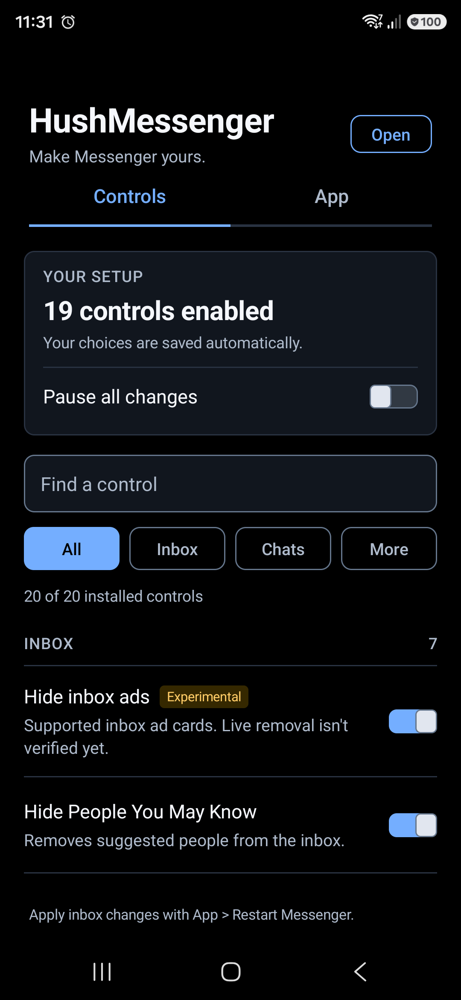
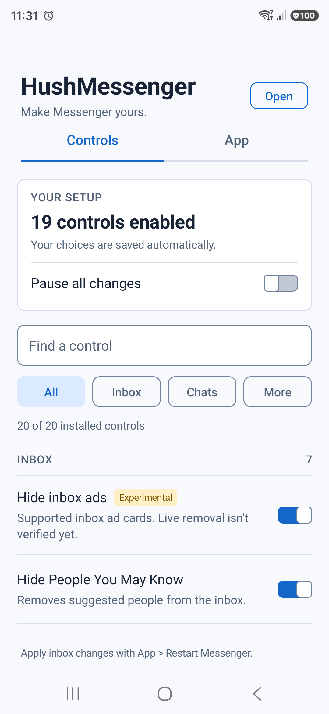
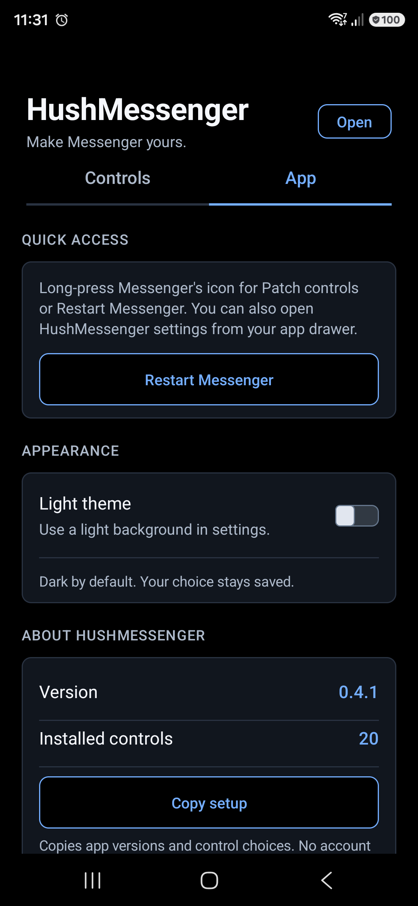
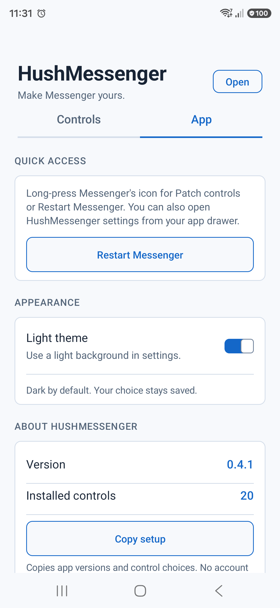

<p align="center">
  <a href="https://github.com/SysAdminDoc/HushMessenger/releases/tag/v0.4.1"></a>
  <a href="LICENSE"></a>
  
  
  
</p>

# HushMessenger

HushMessenger is a Morphe patch source for Facebook Messenger. It offers 21 selectable patches, including 20 optional controls with searchable settings and long-press shortcuts. You bring the original Messenger APK; this repository provides patch code and a `.mpp` bundle.

**[Add HushMessenger to Morphe Manager](https://morphe.software/add-source?github=SysAdminDoc%2FHushMessenger)**

> [!WARNING]
> **Preview release.** The signed-in S25 now passes an in-place update and restart with its existing Morphe key. Fresh sign-in, encrypted-history recovery and every live patch behavior still need testing. Earlier clean-install checks stopped at a blank first-run screen. Keep your signing key and make sure you can recover your chats before replacing a stock installation. See [Morphe's backup and keystore guide](https://github.com/MorpheApp/morphe-manager/blob/main/docs/backup-and-keystore.md).

## Get the preview

1. **Check the APK.** This patch targets two arm64 Messenger builds, with version codes `346013387` and `346013440`. The [supported builds](#supported-messenger-builds) have the full details. The version name alone isn't enough.
2. **Add the source.** Open the link above on Android with Morphe Manager installed. You can also open **Sources**, tap **+**, choose **Remote**, and enter `github.com/SysAdminDoc/HushMessenger`.
3. **Check the source.** The HushMessenger card should show **21 patches**. Open **Patches** to browse the catalog. When preparing Messenger, use **Choose patches** to select individual features. Select all for every optional control plus `Install beside Meta apps`. Tap the card's refresh button if it stays on an old version.
4. **Choose one source.** Use the remote or local HushMessenger source. Adding both creates two cards with the same name, which can point to different versions. If other sources offer Messenger patches, choose the one you intend; mixing independent patches can cause conflicts.

For a local source, download [`patches-0.4.1.mpp`](https://github.com/SysAdminDoc/HushMessenger/releases/tag/v0.4.1) and add it through **Sources > + > Local**. A local source won't update itself. The `.mpp` file is a patch bundle, not an installable Messenger APK. These source steps follow [Morphe's source guide](https://github.com/MorpheApp/morphe-manager/blob/main/docs/patch-sources.md). Morphe Desktop can load the same source URL; the command below lists its 21 entries. Source refreshes download patches. They do not modify an installed Messenger app. S25 has the patched v0.4.1 settings update with its existing sign-in preserved. S22 remains on stock Messenger.

### If something doesn't work

- **Switches have no effect:** The settings must be embedded in the patched Messenger APK. A separate settings preview cannot change stock Messenger. S25 now has the embedded controls; S22 still runs stock Messenger. Refreshing a Morphe source only downloads patches. Use **Restart Messenger** after changing inbox options.
- **Patch missing:** Refresh the HushMessenger source, check that it shows v0.4.1 and open its **Patches** list. This public release doesn't require the pre-release switch.
- **APK rejected:** Use an unmodified arm64 Messenger 580.0.0.49.91 APK with version code `346013387` or `346013440`. If a permission or instruction check fails, the error names the tested builds.
- **Android rejects installation over stock Messenger:** A re-signed APK can't replace Meta's signed copy. Keep your local data intact while you plan a backup. Future updates of your patched copy must reuse your key; see [Morphe's keystore guide](https://github.com/MorpheApp/morphe-manager/blob/main/docs/backup-and-keystore.md).
- **Local source still old:** Download the latest `.mpp` and replace the local source yourself.

The S22's stock Messenger 580 has a **Hide suggestions** action in the `People you may know` menu. Its **Open links in external browser** switch under **Me > Photos & media** works for the HTTP and HTTPS links we tested in an encrypted chat. Off opened Messenger's browser; on opened Chrome. The original setting was restored afterward. Suggestion persistence, internal links and malicious-link warnings still need separate checks.

### Check a signed APK before installation

The repository includes a read-only installation check. It uses Android's `apksigner` to verify the candidate and installed APKs, compares the complete signer sets for the phone's Android version, and checks who owns the candidate's declared permissions. It checks every Android user for an existing installation. Source-stamp certificates aren't treated as app signers. It also catches version downgrades and checks the APK's arm64 libraries against the phone's memory page size.

Use Python 3.11 or newer, JDK 21, Android SDK Build Tools (tested with 36.1.0), and an authorized ADB connection. Run this from the repository with the phone's exact serial from `adb devices`:

```powershell
python scripts/check_install.py --apk .\messenger-signed.apk --stock-apk .\messenger-stock.apk --serial YOUR_PHONE_SERIAL --build-tools "$env:LOCALAPPDATA\Android\Sdk\build-tools\36.1.0" --java "$env:JAVA_HOME\bin\java.exe"
```

The optional `--stock-apk` argument compares native library names and decompressed bytes against the exact stock hash listed below. Without it, the check reports that preservation hasn't been checked. Compressed libraries are allowed when Android extracts them; libraries loaded directly from the APK must also have aligned ZIP entries.

Exit `0` means the certificate, downgrade and native-library checks passed. Exit `1` reports a signer or downgrade conflict; exit `2` means a required check couldn't pass or finish. Different current certificates aren't approved through a possible rotation lineage. The check reads installed base APKs into a temporary directory, then deletes those local copies. It doesn't install, uninstall, clear data or change phone settings.

A successful check doesn't establish cross-app login, provider access or Messenger startup. Run it before planning an installation, and keep the installed app's data intact when it reports a conflict. See [Android's signing tool reference](https://developer.android.com/tools/apksigner).

## Find the settings

After installing Messenger with any optional HushMessenger control, **long-press Messenger's icon**. Choose **Patch controls** to open settings, or **Restart Messenger** to apply changes that need a fresh process. Both shortcuts work with Messenger's alternate icons. Your launcher may show fewer contact shortcuts when these actions are present.

You can also open **app drawer > HushMessenger settings**. Inside settings, **App > Restart Messenger** provides the same restart action. It saves the latest choices before restarting the main app process. If saving fails, you'll see an error and Messenger stays open. Restarting doesn't clear app data.

The **Controls** tab has **All**, **Inbox**, **Chats** and **More** filters. Use **Find a control** to search within the selected category. The setup panel shows how many controls are enabled and whether changes are paused. Only features selected when patching appear here. Each switch starts off, and **Pause all changes** restores stock behavior without forgetting your choices. Use **Restart Messenger** after changing inbox options.

| Patch / switch | What it changes |
| --- | --- |
| Hide inbox ads | Experimental filter for Messenger's typed inbox ad cards. Live removal isn't verified yet. |
| Hide People You May Know | Removes suggested people from the inbox. |
| Hide friend request cards | Hides inbox cards without accepting or rejecting requests. |
| Hide growth prompts | Removes the inbox's add-more-people promotion unit. |
| Hide inbox promotions | Hides quick-promotion banners in the chat list. |
| Hide stories and notes | Hides the horizontal tray above chats. |
| Hide inbox tabs | Hides the Home and Channels subtabs. |
| Hide Facebook shortcuts | Removes Facebook toolbar, profile and sharing shortcuts. |
| Hide Meta AI buttons | Hides the floating button, toolbar button and AI menu entries. Search and existing AI chats stay available. |
| Hide Chat Moments | Removes Chat Moments from the menu. |
| Hide Reels badge | Hides the Reels notification badge. |
| Hide AI sticker tools | Hides the generated-sticker tab and AI sticker suggestions. |
| Hide avatar stickers | Hides the avatar tab in the sticker keyboard. |
| Hide chat promotions | Hides quick-promotion banners inside conversations. |
| Hide business reply suggestions | Hides suggested replies in business chats. |
| Hide business typing suggestions | Hides business suggestions as you type. |
| Hide event prompts | Hides event quick-promotion prompts inside chats. |
| Hide typing indicator | Suppresses your outgoing active-typing signal. |
| Open web links externally | Uses the stock external-browser branch for HTTP and HTTPS. |
| Allow chat bubbles | Removes the low-memory gate on Android 11 or newer. Android permissions still apply. |

<p>
  
  
</p>

These screenshots come from the embedded settings in the S25's patched Messenger. The separate developer preview has no app-drawer entry and cannot change Messenger.

Settings use stable page and category IDs, so changing the language keeps navigation and saved choices intact. English is the fallback. The `en-XA` and `ar-XB` test languages expand or mirror the actual text, including accessible labels and count messages. Multi-digit numbers retain their reading order. The settings screen doesn't depend on Messenger's UI resource IDs. The launcher shortcuts add two string resources and preserve the existing resource values.

The **App** tab starts with quick access and a restart button. Appearance and setup details follow. **Copy setup** copies the extension and host versions, Android version, pause state and each control's installed, selected and active flags. It excludes account details, chats, device identifiers and recovery material. Nothing is sent; you choose where to paste it. **Open** in the header returns to Messenger. Refreshing the source in Morphe downloads the patch bundle; applying new controls to Messenger requires rebuilding and installing its APK.

<p>
  
  
</p>

The new inbox ad filter checks a current list-processing path instead of the absent old loader. It removes only `InboxAdsItem` objects and preserves other rows, including ordinary business conversations. An affected-account before/after check is still needed. It doesn't claim to remove story ads. Media-transcoding changes remain unavailable until the upload path is verified.

## What the patches change

The [patch catalog](patches-list.json) lists all 21 patches with their categories, default selections, dependency identities and supported-build details. It's generated locally from the built bundle and retains dependencies of hidden dependencies. Settings switches still start off, even when a patch is selected by default in Morphe.

### Independent optional controls

Each control is a separate patch. They share one settings extension, and manifest metadata records which controls were installed. Selecting one control only edits its hooks; omitted controls have no active switches. Saved preferences remain available if you select the feature again later.

The full set checks 57 hook methods across both supported APKs. Plugin gates must retain their expected enable/disable branch and return constants. The tab, browser and ad-filter edits check their specific instruction sites. Each control validates every target before editing its first method, and its settings entry is recorded only after success. A missing or ambiguous target stops that control. The settings provider is private; its launcher accepts no external commands to change preferences.

### Install beside Meta apps

The patch renames Messenger's two shared Meta signature permissions in declarations, requests, guarded components and six DEX string loads. It requires the original signature protection level and checks DEX sites before changing the manifest. It stops if those sites differ from the tested APK. Messenger's other cross-app signer checks, Facebook login and account switching still need separate verification.

Morphe groups these builds under one version name, so it may list the patch for another 580 APK. The patch checks the version code before changing anything and rejects builds other than `346013387` and `346013440`.

If you patch both Messenger and [Hushfacebook](https://github.com/SysAdminDoc/Hushfacebook), sign them with the **same key**. Android grants shared signature permissions only when the apps are signed alike.

## Supported Messenger builds

| Field | Value |
| --- | --- |
| Package | `com.facebook.orca` |
| Version | `580.0.0.49.91` |
| Version codes | `346013387` (S22), `346013440` (S25) |
| Architecture | `arm64-v8a` |
| Minimum Android version | Android 9 (API 28) |

SHA-256 of the stock base APKs used for the off-device checks:

```text
346013387  128ec75e836f24328d2b28777091c03b20abba0adc536e7ee911ee5fe52e70bc
346013440  e7d3c64227a7d9a26adda4e89321a87a49c85ee9e9f28f2fa7ed7fa79ae15cf6
```

On Windows, compare your file with `Get-FileHash -Algorithm SHA256 .\messenger.apk`. Meta can publish different APKs under one version name. If the hash differs, don't assume the off-device result applies to your file; the patch also checks its permission layout and instruction sites.

## Verification and build

The S25 passed an in-place update using the same signing key as its installed Messenger and Facebook apps. Its original install date and 19 enabled controls were retained. Both long-press actions worked on the real Messenger icon. The settings button and the shortcut each started a new process and returned to the signed-in chat screen. Both settings pages and themes were captured, then the original dark theme was restored. No conversations were opened or messages sent. Temporary test apps were removed. S22 remains stock.

The local suite has 49 Kotlin tests, 70 Android unit tests and 34 Python checks. It covers separate patch selection, changed targets, feature availability, pause, saved choices, search and typed ad filtering. Release builds run locally. Android lint reports no errors and eight warnings, including two package-visibility notices for queries restricted to this app.

Morphe Desktop 1.17.0 applied all 21 patches to private copies of both supported APKs, and Android verified their v3 signatures. Two clean release builds produced the same bundle checksum. Both rebuilt APKs preserved all 13 compressed arm64 libraries, with 16KB minimum ELF load alignment. A changed permission fixture stopped before output; continued exports left failed People methods and permission declarations untouched. The earlier v0.2.0 single-control S25 build selected only **Hide People You May Know**: it changed exactly the two expected host methods, added settings once and recorded only that feature. The original signature-permission patch wasn't selected or applied in that check.

The current settings extension was exercised as a clearly marked standalone UI preview on the S25 physical screen. Both pages and themes passed; the mirrored test language preserved multi-digit counts. The preview was removed after each check. Automated tests cover API 28 and 36, short windows at 200% text, state restoration and accessible actions. These checks verify settings behavior. Live TalkBack was stopped at the user's request and remains unverified. Messenger features still need signed-in before/after checks in a working patched installation.

The earlier v0.1.0 diagnostic copy verified hiding and restoring stories and notes, the Facebook toolbar shortcut and the Meta AI floating button. That copy needed a private package-name adjustment and skipped encrypted-history restoration. It does not establish that an original-package installation works. Typing suppression, subtabs, bubbles, live ads and full chat behavior remain unverified.

The restored stock apps on S22 and S25 exchanged messages between two owned accounts in an end-to-end encrypted chat. Both phones displayed the messages and read receipts. HTTP and HTTPS link tests on S22 confirmed the stock external-browser switch works. These checks used hidden virtual displays; installed packages and sign-ins were preserved. Re-signed chat delivery, calls and notification behavior remain unverified.

To inspect the source with Morphe Desktop 1.17.0, set `JAVA_HOME` to a JDK 21 or newer:

```powershell
& "$env:JAVA_HOME\bin\java.exe" -jar morphe-desktop-1.17.0-all.jar list-patches --patches https://github.com/SysAdminDoc/HushMessenger --filter-package-name com.facebook.orca
```

This command lists patches. Source updates and Messenger installation are separate steps.

To build the bundle on Windows, use JDK 21, Android SDK 36 and the Gradle wrapper. Set `ANDROID_HOME` to your SDK directory. The Morphe Gradle plugin needs GitHub Packages credentials:

```powershell
$env:GITHUB_ACTOR = gh api user --jq .login
$env:GITHUB_TOKEN = gh auth token
.\gradlew.bat :patches:clean :extensions:messenger:clean :patches:test :patches:check :extensions:messenger:testDebugUnitTest :extensions:messenger:lintRelease :patches:buildAndroid --no-daemon
python -m unittest discover -s scripts/tests -v
```

The output is `patches/build/libs/patches-0.4.1.mpp`. Dependency locks and SHA-256 checks are committed. Review both when changing a dependency; clean builds from the same source produce the same bundle checksum.

After changing patch metadata, run `:patches:generatePatchCatalog` and review `patches-list.json`. The normal `:patches:check` task checks the committed catalog against the built bundle and checks all 20 control keys against the extension and manifest. It fails on drift instead of rewriting the catalog.

Before publishing, synchronize the release version, source index, changelog and README checksum, then run `:patches:verifyReleaseMetadata`. This loads fresh bundle metadata and checks its checksum against the release files. To check a proposed tag and checksum asset too, run `python scripts/check_release.py --release-tag v0.4.1 --checksums SHA256SUMS.txt` after the Gradle check. Catalog evidence is bound to the exact bundle hash.

### Check the bundle

The [v0.4.1 release](https://github.com/SysAdminDoc/HushMessenger/releases/tag/v0.4.1) includes a `SHA256SUMS.txt` file. Compare its `.mpp` hash with your download. You can also build the tagged source locally and compare the output. The checksum and bundle are hosted under the same GitHub account, so this check cannot independently rule out an account compromise.

```text
d5b93c69e083bb761a44ac54692d75cc39a553e0c27fd07202f0b45d4619d303  patches-0.4.1.mpp
```

Morphe Manager 1.32.0 and Desktop 1.17.0 parse `signature_download_url` but do not verify a detached signature when importing patch bundles. An `.asc` link in the source index would not add automatic protection in those versions. Keep the source URL on the repository you trust, and review a new bundle before updating.

## Research and credits

The [research snapshot](https://github.com/SysAdminDoc/HushMessenger/blob/015654380957d775f95b9f1c7871e91452d6216a/RESEARCH.md) compares Messenger patches in Morphe, ReVanced, De-Vanced and other projects. The remaining checks are summarized below. [Hushfeed](https://github.com/SysAdminDoc/hushfeed) is another Hush patch project.

HushMessenger starts from the [Morphe patches template](https://github.com/MorpheApp/morphe-patches-template). Messenger hook definitions come from [De-Vanced](https://github.com/RookieEnough/De-Vanced), including its ReVanced contributions, and [Doom's patches](https://github.com/rushiranpise/morphe-patches). The typed ad-filter approach follows [Messenger Cleaner](https://github.com/N01-r0/messenger-cleaner-lsposed), with its MIT notice retained. The bubble eligibility anchor originated in [ChatHeadEnabler](https://github.com/NeonOrbit/ChatHeadEnabler). The permission approach is adapted from [Hushfacebook's shared-permission patch](https://github.com/SysAdminDoc/Hushfacebook/blob/15b8e9ed9315464a3e2d1a821b4e26ad47bbc28c/patches/src/main/kotlin/app/morphe/patches/facebook/coexist/SharedPermissions.kt). Source is under [GPL-3.0](LICENSE); see [NOTICE](NOTICE). HushMessenger is independent of Meta and Morphe.

## Remaining checks

- Fresh-install startup, encrypted-history recovery and cross-app account behavior still need dedicated checks. The existing signed-in S25 installation now passes an update and restart.
- [Issue 1](https://github.com/SysAdminDoc/HushMessenger/issues/1) reports Messenger 580 build `346013370`, which isn't one of the two validated APKs. Its exact original APK is needed before adding support.
- Live ad removal, typing suppression, bubbles, calls and patched message delivery remain unverified. Structural APK checks don't establish those behaviors.
- S22 still runs stock Messenger. A source refresh alone cannot activate its patches.

<p align="center">
  <a href="https://ko-fi.com/X8K126YVER"></a>
</p>
