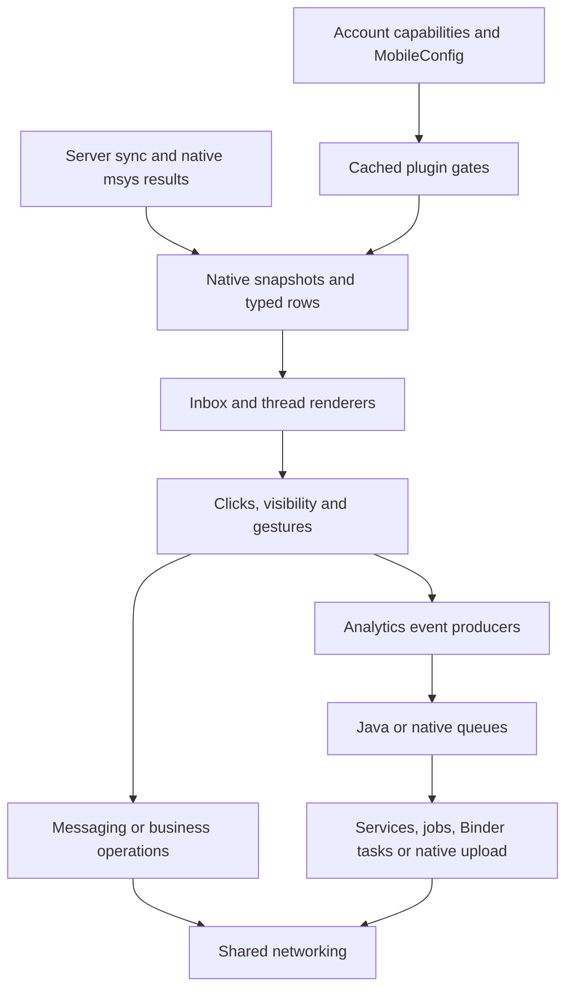
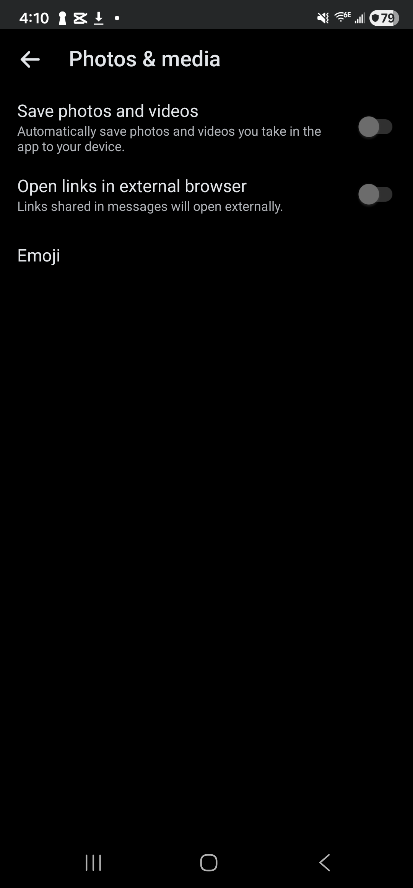
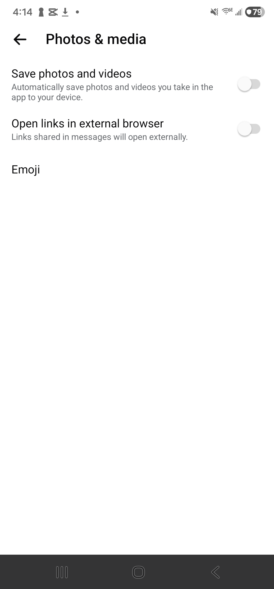
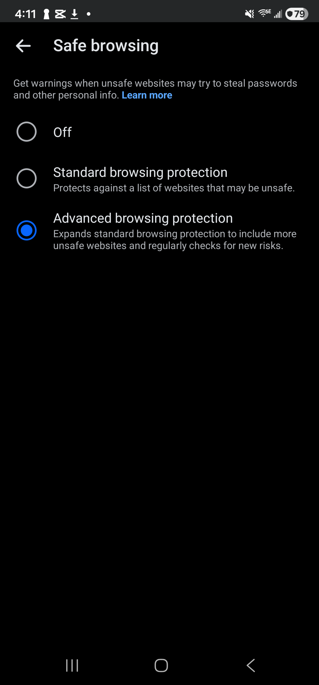
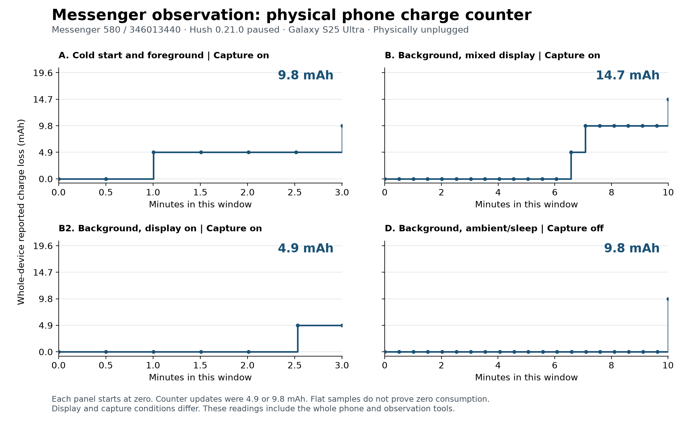

<p align="center">
  <a href="https://github.com/SysAdminDoc/HushMessenger/releases/tag/v0.22.0"></a>
  <a href="LICENSE"></a>
  
  
</p>

<p align="center">
  <a href="https://ko-fi.com/X8K126YVER">
    
  </a>
</p>

<p align="center">
  <sub><em>If HushMessenger makes Messenger better for you, a coffee helps me keep testing patches and maintaining them as Messenger changes.</em></sub>
</p>

# HushMessenger

HushMessenger is a Morphe patch source for Facebook Messenger. It offers 43 patches. 37 of them are controls with searchable settings and long-press shortcuts, and all 37 are in Morphe Manager's default selection with their switches off, so you don't need Expert mode to find one. Three help a re-signed build install, open and reach those settings. The other three start unselected and change the app package itself: one installs a second copy under another package name, **Spoof package version** stops Play Store update offers, and **Custom new-message sound** swaps in a sound file you choose. You bring the original Messenger APK. This repository provides the patch code and a `.mpp` bundle.

v0.22.0 fixes three reports. With **Hide People You May Know** on, the chat list no longer keeps a loading circle under your chats after Messenger restarts ([#30](https://github.com/SysAdminDoc/HushMessenger/issues/30)). With **Use system emoji** on, a Like in the chat list shows Messenger's thumbs-up again instead of an empty box ([#34](https://github.com/SysAdminDoc/HushMessenger/issues/34)). With **View stories anonymously** on, a story you've opened no longer keeps its new-story ring in the chat list ([#35](https://github.com/SysAdminDoc/HushMessenger/issues/35)).

Eight new switches start off. **Unlock app icons** lets you pick any of Messenger's built-in app icons without a subscription ([#33](https://github.com/SysAdminDoc/HushMessenger/issues/33)). **Restore old emoji drawer** keeps the emoji keyboard's earlier layout, and **Keep emoji search on emoji** stops typing from flipping that keyboard to sticker search. **Stop analytics uploads** guards the known Analytics2 service entry points, with the [remaining routes documented below](#tracking-and-data-flows). **Send videos without re-encoding** lets a video up to 25 MB go out as it is. **Keep a message log** saves each message that raised a notification on your phone, so an unsend can't take it back. **Use the phone's camera app** opens your own camera from a chat's camera button. **Pure black dark mode** turns the darkest Material You backgrounds black.

Three new patches start unselected and change the package itself. **Clone install under another package name** puts a second Messenger beside the first, **Spoof package version** gives Messenger a very high version code so the Play Store stops offering updates, and **Custom new-message sound** plays your own file ([#32](https://github.com/SysAdminDoc/HushMessenger/issues/32)).

v0.21.0 added Messenger 581.0.0.49.91, every arm64 build APKMirror lists under that name ([#29](https://github.com/SysAdminDoc/HushMessenger/issues/29)). It also brought **Hide joined community chats**, a new switch that starts off and removes joined channels and announcements from the main Chats list on its next render. **Hide AI sticker tools** now covers the Generate buttons in the sticker keyboard, and **Allow screenshots** covers view-once media and Quicksnap. Settings give each control's full row one accessible touch target.

v0.14.0 added **Native Bubbles** to **Allow chat bubbles** ([#19](https://github.com/SysAdminDoc/HushMessenger/issues/19)) and **Slide chats in and out**, an optional slide for chats you open from the chat list or search ([#28](https://github.com/SysAdminDoc/HushMessenger/issues/28)). Settings now open from Messenger's side menu as well as its Menu tab ([#26](https://github.com/SysAdminDoc/HushMessenger/issues/26)), and **Use system emoji** draws your phone's own emoji on Android 12 and newer ([#25](https://github.com/SysAdminDoc/HushMessenger/issues/25)). On Root Mount installs, HushMessenger adds the **Patch controls** and **Restart Messenger** shortcuts itself, because Android never reads the patched ones there ([#27](https://github.com/SysAdminDoc/HushMessenger/issues/27)). The [changelog](CHANGELOG.md) has the rest.

**[Add HushMessenger to Morphe Manager](https://morphe.software/add-source?github=SysAdminDoc%2FHushMessenger)**

> [!IMPORTANT]
> Keep your signing key and recovery material. A patched update installs over your copy only when it's signed with the same key, and signed-in test phones have kept their sign-in and chats through each update. See [Morphe's backup and keystore guide](https://github.com/MorpheApp/morphe-manager/blob/main/docs/backup-and-keystore.md).

For patch authors, the [detailed app audit](#messenger-internals-and-patch-opportunities) maps ad delivery, tracking, native settings, existing hooks and new patch candidates.

## Get HushMessenger

1. **Check the APK.** This patch targets arm64 Messenger 580.0.0.49.91 and 581.0.0.49.91, and all 37 arm64 builds APKMirror lists under those names work. The version name alone isn't enough, though, because the 32-bit builds share it and aren't supported. Check the version code on the download page against the [supported builds](#supported-messenger-builds) before you patch. [Build 346013440](https://www.apkmirror.com/apk/facebook-2/messenger/facebook-messenger-580-0-0-49-91-release/facebook-messenger-580-0-0-49-91-5-android-apk-download/) and [build 346013387](https://www.apkmirror.com/apk/facebook-2/messenger/facebook-messenger-580-0-0-49-91-release/facebook-messenger-580-0-0-49-91-11-android-apk-download/) are direct links. Build 346013370 is what Morphe's download link handed two people who reported it, and build 346013442 also comes from APKPure.
2. **Add the source.** Open the link above on Android with Morphe Manager installed. You can also open **Sources**, tap **+**, choose **Remote**, and enter `github.com/SysAdminDoc/HushMessenger`.
3. **Check the source.** The HushMessenger card should show **43 patches**. Open **Patches** to browse the catalog. The default selection holds every control, **Material You theme** included, and each switch starts off until you turn it on in settings. Only **Clone install under another package name**, **Spoof package version** and **Custom new-message sound** are left out. To add one of those, or to leave a control out, turn on **Settings → Advanced → Expert mode** in Morphe Manager and use **Choose patches**. If you saved a selection of your own in Expert mode before, Manager may keep using it, so look it over once for **Material You theme**. Tap the card's refresh button if it stays on an old version.
4. **Choose one source.** Use the remote or local HushMessenger source. Adding both creates two cards with the same name, which can point to different versions. If other sources offer Messenger patches, choose the one you intend. Mixing independent patches can cause conflicts.

For a local source, download [`patches-0.22.0.mpp`](https://github.com/SysAdminDoc/HushMessenger/releases/tag/v0.22.0) and add it through **Sources > + > Local**. A local source won't update itself. The `.mpp` file is a patch bundle, not an installable Messenger APK. These source steps follow [Morphe's source guide](https://github.com/MorpheApp/morphe-manager/blob/main/docs/patch-sources.md). Morphe Desktop can load the same source URL, and the command below lists its 43 entries. Source refreshes download patches. They don't modify an installed Messenger app. Test phones have taken patched updates in place with their sign-in kept.

### If something doesn't work

The **HushMessenger settings** icon belongs to the same installed app as Messenger. Uninstalling either icon removes Messenger and its local data. Use **App > Hide app drawer icon** to hide only the settings entry. Refs [#26](https://github.com/SysAdminDoc/HushMessenger/issues/26).

- **Can't find the settings:** Long-press Messenger's icon on your home screen (not the Messenger title inside the app) and tap **Patch controls**. Bundles with a settings launcher alias also offer **HushMessenger settings** in the app drawer. The Menu tab or side menu has a **HushMessenger** row when that patch is included. **Hide app drawer icon** appears in App only when both the alias and Menu route are available. Root Mount has no separate icon. App explains missing routes, and searching for "drawer icon" links to that explanation or toggle. If none of the entry routes appear, refresh the source and patch Messenger again.
- **Switches have no effect:** The settings must be embedded in the patched Messenger APK. A separate settings preview cannot change stock Messenger. Both test phones run patched builds with the embedded controls. Refreshing a Morphe source only downloads patches. Use **Restart Messenger** after changing inbox options or the Meta AI tab, which only changes on a restart, even when you pause.
- **Patch missing:** Refresh the HushMessenger source, check that it shows v0.22.0 and open its **Patches** list. This public release doesn't require the pre-release switch.
- **APK rejected:** Use an unmodified arm64 Messenger 580.0.0.49.91 or 581.0.0.49.91 APK. Every arm64 variant APKMirror has for those versions works, and the version codes are listed under [Supported Messenger builds](#supported-messenger-builds). If a permission or instruction check fails, the error names the tested builds.
- **Android rejects installation over stock Messenger:** A re-signed APK can't replace Meta's signed copy. Keep your local data intact while you plan a backup. Future updates of your patched copy must reuse your key. See [Morphe's keystore guide](https://github.com/MorpheApp/morphe-manager/blob/main/docs/backup-and-keystore.md).
- **Local source still old:** Download the latest `.mpp` and replace the local source yourself.
- **"INSTALL_FAILED_VERSION_DOWNGRADE ... older than current 2147483647":** Another patch set may have raised Messenger's version code to Android's maximum. Android can retain that code even after an installation was removed with its data kept. Preserve the retained data and signing key. An in-place update needs the same key and a code at least as high as the retained one, with a supported Messenger build underneath. HushMessenger doesn't provide a migration for this case yet. Don't uninstall or clear data to make the installation check pass.
- **Patching stalls with Material You selected (#18):** Bundles through v0.7.0 can exhaust a 1024 MB heap. Refresh the source to v0.8.0 or newer, which passed all 21 supported builds at that limit. If you need to stay on an older bundle, deselect **Material You theme** and patch again. See [issue #18](https://github.com/SysAdminDoc/HushMessenger/issues/18).
- **Install blocked on a Galaxy phone:** Samsung's Auto Blocker only lets apps in from Galaxy Store and Google Play, and it also blocks commands sent over USB, so both Morphe Manager and `adb install` fail while it's on. Turn it off in **Settings > Security and privacy > Auto Blocker**, install the patched Messenger, then turn it back on. Google's Advanced Protection blocks installs from anywhere but the Play Store too. On a Galaxy phone it's under **Settings > Google > All services > Privacy & security > Advanced Protection**, and searching Settings for it works as well. Switch **Device protection** off for the install and back on afterwards. Both paths are from a Galaxy S22 on One UI 8.

A Galaxy S22's stock Messenger 580 has a **Hide suggestions** action in the `People you may know` menu. Its **Open links in external browser** switch under **Me > Photos & media** works for the HTTP and HTTPS links we tested in an encrypted chat. Off opened Messenger's browser, and on opened Chrome. The original setting was restored afterward. Suggestion persistence and internal links still need separate checks. Static tracing of ordinary message links in build 346013440 shows its external branch launches before Messenger's native browser warning. Keep the external preference off to use Messenger's in-app warning flow. Live malicious-link warnings remain unverified.

### Check a signed APK before installation

The repository includes a read-only installation check. It uses Android's `apksigner` to verify the candidate and installed APKs, compares the complete signer sets for the phone's Android version, and checks who owns the candidate's declared permissions. It checks every Android user for an existing installation. Source-stamp certificates aren't treated as app signers. It also catches version downgrades and checks the APK's arm64 libraries against the phone's memory page size. If Android retained Messenger's data after removal, the check reads its retained version code. A code of 2147483647 points to the data-preserving guidance under **If something doesn't work**.

Use Python 3.11 or newer, JDK 21, Android SDK Build Tools (tested with 36.1.0 and 37.0.0), and an authorized ADB connection. Run this from the repository with the phone's exact serial from `adb devices`:

```powershell
python scripts/check_install.py --apk .\messenger-signed.apk --stock-apk .\messenger-stock.apk --serial YOUR_PHONE_SERIAL --build-tools "$env:LOCALAPPDATA\Android\Sdk\build-tools\36.1.0" --java "$env:JAVA_HOME\bin\java.exe"
```

The optional `--stock-apk` argument compares native library names and decompressed bytes against the exact stock hash listed below. Without it, the check reports that preservation hasn't been checked. Compressed libraries are allowed when Android extracts them. Libraries loaded directly from the APK must also have aligned ZIP entries.

Exit `0` means the certificate, downgrade and native-library checks passed. Exit `1` reports a signer or downgrade conflict, and exit `2` means a required check couldn't pass or finish. Different current certificates aren't approved through a possible rotation lineage. The check reads installed base APKs into a temporary directory, then deletes those local copies. It doesn't install, uninstall, clear data or change phone settings.

A successful check doesn't establish cross-app login, provider access or Messenger startup. Run it before planning an installation, and keep the installed app's data intact when it reports a conflict. See [Android's signing tool reference](https://developer.android.com/tools/apksigner).

## Find the settings

After three crashes near startup, safe mode pauses the controls and keeps your choices. Open settings and tap **Resume** to use those choices again. If **Pause all changes** is on, tap **Clear safe mode** first, then turn Pause off when you're ready. Crash-record saves verify the replacement before committing it and retain the previous record on an interrupted write. Android 9 and 10 also check that the backup succeeded before writing. If saving the recovery state fails, settings report the failure and keep changes paused so you can try again. A successful recovery restores the saved theme immediately. Invalid preference types keep startup disabled. The records and preferences are separate saves.

After installing Messenger with any optional HushMessenger control, **long-press Messenger's icon on your home screen**. Choose **Patch controls** to open settings, or **Restart Messenger** to apply changes that need a fresh process. Both shortcuts work with Messenger's alternate icons. Your launcher may show fewer contact shortcuts when these actions are present.

If the launcher alias is installed, **app drawer > HushMessenger settings** opens the same screen. The Menu tab also has a **HushMessenger** row when its patch is included. **App > Hide app drawer icon** appears only when both routes are installed. A disabled alias still counts as installed, so you can turn the icon back on. If a later patch leaves the Menu row out, the icon returns. Search for **drawer icon** in Controls to reach the toggle or the explanation of your available routes.

On a Morphe Manager **Root Mount** install, Android keeps stock Messenger's list of screens, so there's no drawer icon to open or hide. Android doesn't read the patched long-press shortcuts there either, so HushMessenger adds **Patch controls** and **Restart Messenger** to the icon's long-press menu itself once Messenger has started. Messenger's recent-chat shortcuts can push them out, and the next start puts them back. The Menu tab and side menu rows work too. If you picked one of Messenger's alternate app icons, its long-press menu won't have the two shortcuts, so use the Menu tab or side menu row there. Settings open inside one of Messenger's own screens, and the switches read the controls you patched from the app itself, so they work the same as on a normal install. The patch checks both of those stock screens and stops with an error if a build changes either one. Inside settings, **App > Restart Messenger** provides the same restart action. It saves the latest choices before restarting the main app process. If saving fails, you'll see an error and Messenger stays open. Restarting doesn't clear app data.

The **Controls** tab has **All**, **Inbox**, **Chats** and **More** filters. Use **Find a control** to search within the selected category. The setup panel shows how many controls are enabled and whether changes are paused. Only features selected when patching appear here. Each switch starts off, and **Pause all changes** pauses runtime controls without forgetting your choices. Restart Messenger to reset process-latched choices. Pause does not remove package, signature or resource edits. A switch that's on shows when Messenger last checked it since starting, which happens each time the screen or event it covers comes up, whether or not there was anything to change. **Nothing to change yet** only means that screen or event hasn't come up yet, like a link you haven't tapped or a business chat you haven't opened. If a switch's code fails inside Messenger, its line says **Stopped with an error** instead, until the next time it works. Paused choices say **Changes paused**. These labels refresh when you return to settings, and TalkBack reads the status with the switch. Use **Restart Messenger** after changing inbox options or the Meta AI tab, which only changes on a restart, even when you pause.

| Patch / switch | What it changes |
| --- | --- |
| Hide inbox ads | Filters Messenger's legacy typed inbox ad cards. It is an experimental safeguard, with no live ad removal established on the audited builds. See the [ad delivery audit](#how-ads-and-business-context-reach-messenger). |
| Hide joined community chats | Starts off. Hides joined channels and announcements from the main Chats list (the All chip) on its next render. Other chips such as Channels, search, community folders and the original unread counts keep every row. |
| Hide People You May Know | Removes suggested people from chats (the end of the chat list too), search and stories, and from the People and Notifications tabs. |
| Hide friend request cards | Hides friend request cards in the chat list. It doesn't accept or decline anyone. |
| Hide growth prompts | Removes the inbox's add-more-people promotion unit. It also hides the tip sheets notes pop up, like **Make my notes public** and **Add lyrics to your music note**, and the **Share your own story** card after someone else's stories. |
| Hide inbox promotions | Hides promotion banners in the chat list. |
| Hide stories and notes | Hides the row of stories and notes above your chats. |
| Hide inbox tabs | Hides the Home and Channels tabs inside the inbox. |
| Hide Facebook shortcuts | Removes Facebook toolbar, profile and sharing shortcuts, and the "Also from Meta" section in the Menu tab (Muse, Subscriptions, Facebook Reels and the rest). |
| Hide Meta AI | Hides the floating button, toolbar button, AI menu entries and the Meta AI tab some accounts get in the bottom bar, plus the "Ask Meta AI" button in search and the AI agent behind it. People, message and group results still show, and existing AI chats stay available. The tab changes after **Restart Messenger**. |
| Hide Chat Moments | Removes Chat Moments from the menu. |
| Hide Reels badge | Hides the Reels notification badge. |
| Hide AI sticker tools | Hides the generated-sticker tab and AI sticker suggestions. It also hides the Generate buttons in the sticker keyboard. |
| Hide avatar stickers | Hides the avatar tab in the sticker keyboard, including Messenger's newer keyboard. |
| Restore old emoji drawer | Starts off. Turns off Meta's redesigned emoji drawer, so the emoji keyboard keeps its earlier layout. It takes effect after **Restart Messenger**, and accounts Meta never moved to the redesign see no difference. |
| Keep emoji search on emoji | Starts off. Typing while the emoji keyboard is open no longer switches it to sticker search, so the keyboard stays on emoji. It takes effect right away. |
| Hide chat promotions | Hides Quickpromotion banners inside conversations. Business-ad context banners use a separate path and aren't covered. |
| Hide business reply suggestions | Hides suggested replies in conversations with businesses. |
| Hide business typing suggestions | Hides business suggestions that pop up as you type. |
| Hide event prompts | Hides event promotion prompts inside chats. |
| Hide typing indicator | Stops others from seeing that you're typing, including in end-to-end encrypted chats. |
| Stop analytics uploads | Starts off. Guards nine service/job/receiver entries in Messenger's Analytics2 uploader. A conditional Google Play Binder route isn't covered. Messenger still records events on your phone, and they can upload after you turn this off. Native analytics, crash reports and attribution have separate paths. See the [tracking audit](#tracking-and-data-flows). |
| Keep a message log | Starts off. Keeps a copy of each message as its notification arrives, including messages from end-to-end encrypted chats, so an unsend can't take it back. It holds only messages that raised a notification, stays on your phone, and is encrypted with an Android Keystore key. The log is shared across accounts in the installation. View log opens it, newest first. Clear log deletes it and throws the key away. See the [retention and isolation limits](#p2-harden-the-local-message-log). |
| Hide read receipts | Stops sending read receipts. Opened encrypted chats can stay unread on this phone. Replying or switching this off may notify the sender. Group coverage isn't verified. |
| View stories anonymously | Opens other people's stories without adding you to their viewer list. Stories you open this way still show as seen on the People tab, in the story viewer and in your chat list, so new ones stay easy to spot. |
| Save any story | Adds **Save** to the **More options** menu on other people's stories, the same item Messenger only shows on your own. The photo or video downloads to your phone the way your own stories do. A saved video lands in Movies/Messenger. |
| Keep unsent messages | Keeps messages on verified legacy unsend routes and marks them "[unsent]". End-to-end encrypted chats aren't supported, and group coverage isn't verified. Your own unsend may be limited while it's on. |
| Allow screenshots | Lets you screenshot photos, media and video that Messenger protects in a chat, and stops screenshot notices. It also covers view-once media and Quicksnap. |
| Use system emoji | Draws emoji with your phone's own emoji set instead of Messenger's on Android 12 and newer. Android 9 to 11 get Android's standard emoji. Messenger's set stays if the phone has no emoji font. On Android 10 and newer, characters the phone's set doesn't have, like Messenger's own Like, still come from Messenger's font. |
| Send photos at original quality | With HD on, a JPEG photo goes out with its own image data instead of Messenger's smaller re-encoded copy. Its metadata, such as location and camera details, is left out, as it is from Messenger's copy. Only the tag that turns a sideways photo upright stays. Photos over 20 MB and videos still get Messenger's compression. |
| Send videos without re-encoding | Starts off. Messenger already sends a video untouched when it's close to the size a re-encode would give. With this on, a video up to 25 MB takes that same route instead of being re-encoded. Videos over 25 MB still get Messenger's compression. So do trimmed or edited videos and formats Messenger won't pass through. |
| Use the phone's camera app | Starts off. The camera button in a chat opens your phone's own camera app instead of Messenger's camera. The photo you take comes back into Messenger's photo editor for that chat, the same one a photo picked from another app opens in, and you send it from there. It takes photos only, so videos still need Messenger's camera. If Messenger doesn't have camera access yet, it asks first. A Root Mount install keeps Messenger's camera, since Android doesn't know the screen this adds there. |
| Open web links externally | Opens http and https links in your default browser instead of inside Messenger. Other link types work as before. |
| Slide chats in and out | Slides a chat in from the side when you open it from the chat list or search, and back out when you go back, while the screen underneath holds still. Right-to-left languages slide from the left. Chat heads and bubbles keep their own animations, and Android's **Remove animations** setting turns this off too. |
| Allow chat bubbles | Settings offer Stock, Chat Heads and Native Bubbles on Android 11 or newer when the host routes are verified. Native mode uses Messenger's conversation notifications and keeps its account eligibility check. Android permissions still apply. |
| Unlock app icons | Starts off. Every icon in Messenger's App icon setting becomes selectable without a subscription, and Messenger applies it with the same launcher switch it uses for a free icon. The icons are already in the APK. Messenger still decides whether the App icon setting shows on your account, and after you turn this off it may put its default icon back the next time it closes. Your launcher can take a moment to show a new icon. |
| Material You theme | Starts off. In dark mode on Android 12 and newer, Messenger's blue takes the accent color Android picks from your wallpaper and its grays get a matching tint, with the same contrast as before. Android 11 gets a fixed blue palette. Chat themes stay as they are, and so does light mode. Settings has a **Pure black dark mode** switch under Appearance, off by default, that turns Messenger's darkest backgrounds pure black while this patch is on. Turn on dark mode in Messenger first. |

**Keep unsent activity:** **No unsend activity observed since restart** means that no legacy unsend with a message identifier has been intercepted in this process. The switch stays on across restarts. Reading an ordinary message or an older retained message doesn't advance the counter. A use timestamp records an interception, not proof that an encrypted or group chat is supported. Restarting alone does not generate an unsend event.

The local unsent-marker list holds up to 4,096 message IDs. Recording another ID at the limit drops an existing marker. This doesn't delete any message content.

**Local unread state:** **Hide read receipts** also leaves opened encrypted chats unread on this phone. It doesn't offer a separate local **Mark as read** action. Replying or turning the control off follows Messenger's receipt path and may notify the sender. Group coverage is unverified. See [issue #20](https://github.com/SysAdminDoc/HushMessenger/issues/20).

**App > Check for updates** is off by default. Enabling it checks GitHub and keeps only the validated release details locally. Settings and **Check now** reuse a result for an hour. A later request includes its ETag so an unchanged response can reuse those same details. If GitHub delays a check, settings show when you can try **Check now** again. Checks stop before that time. GitHub's quota reset only delays checks when that quota is exhausted. This follows [GitHub's retry guidance](https://docs.github.com/en/rest/using-the-rest-api/best-practices-for-using-the-rest-api#handle-rate-limit-errors-appropriately). The release page must match the reported tag. A development build ahead of the public release shows both versions. Turning the switch off or closing settings cancels pending replies and cache writes. A write already in progress can finish in the background without holding up the screen or replacing a newer result. GitHub receives your IP address and connection metadata, but the check uploads no account or chat content. Requests are unauthenticated, so an unchanged response doesn't promise a rate-limit exemption.

<p>
  
  
</p>

These screenshots were captured from v0.10.0 embedded settings on 2026-10-02. Both tabs and themes were also checked at 200% text size. The separate developer preview has no app-drawer entry and cannot change Messenger.

Settings use stable page and category IDs, so changing the language keeps navigation and saved choices intact. English is the fallback. The `en-XA` and `ar-XB` test languages expand or mirror the actual text, including accessible labels and count messages. Multi-digit numbers retain their reading order. The settings screen doesn't depend on Messenger's UI resource IDs. The launcher shortcuts add two string resources and preserve the existing resource values.

The settings screen is English only for now, and translations are welcome. A language is one Java table of text pairs, registered with one line in `SettingsTranslations.java` under `extensions/messenger`. It goes by Messenger's language, and a table for `pt` covers every region while `pt-BR` covers only Brazil. The table needs every text id from `SettingsText.java` plus each control's title and description, and it has to keep each `%s` or `%d` in place. You can move one around with `%1$s` and `%2$s`. A plain percent sign in a text id is written `%%`, while a control's title and description are shown as typed. `SettingsTranslationTest` fails the build if anything is missing or a placeholder changed, so you'll know before sending a pull request. Search still finds a control by its English name too.

The **App** tab starts with quick access and a restart button. Appearance and setup details follow. **Copy setup** copies the extension and host versions, Android version, pause state and each control's installed, selected and active flags. It includes each control's scope description and last recorded use. Recorded use means the control ran. It doesn't verify a visible effect or privacy protection. A control whose code failed gets one more line with the error's type, where in HushMessenger it happened and when, but never the error's message, since that could quote a chat. It excludes account details, chats, device identifiers and recovery material. Nothing is sent. You choose where to paste it. **Open** in the header returns to Messenger. Refreshing the source in Morphe downloads the patch bundle, but new controls only reach Messenger once you rebuild and install its APK.

<p>
  
  
</p>

The inbox ad filter removes only `InboxAdsItem` objects from a current list-processing path and preserves other rows, including ordinary business conversations. No live inbox ad was observed, and the stock inspection did not establish a producer or renderer for this legacy type. The filter remains an experimental safeguard. It doesn't remove story ads or establish that ad requests stopped. Messages from businesses you've subscribed to are ordinary chats and stay. The [ads audit](#how-ads-and-business-context-reach-messenger) maps the separate business-ad and tracking paths.

### Back up your choices

File operations show progress and a **Cancel file operation** action. An active save continues if you rotate the phone or close settings, then reports whether it finished. Closing settings cancels a restore. The original 30-second deadline still applies to both operations, including a save finishing in the background. If you cancel a save, save again before you rely on that file. If earlier operations haven't stopped, a message asks you to wait for the storage app. A restore won't replace choices you changed while the file was loading. Restore the file again if you want to apply it. A picker result that points at a private file is rejected. Saves also reject media entries owned by Messenger or whose ownership Android can't verify. Choose a new document in your storage app if that happens.

On the **App** tab, copy choices through the clipboard or use **Save choices to a file** and **Restore choices from a file**. Files use Android's picker and need no storage-wide permission. Both paths use UTF-8 with the exact `hushmessenger:choices:v1` header and a 16 KiB limit. The original `hushmessenger:choices` header is still accepted. A document's declared slice keeps its absolute start even if the storage app supplies an already positioned file. Invalid headers, duplicate keys, invalid booleans and oversized input leave everything unchanged. Omitted choices and choices absent from the installed bundle keep their saved values. Unknown keys are reported separately. The backup contains installed control choices and Pause, with no chats, accounts, crash records or signing material. If settings reopen while the picker is active, choose the file again.

### Alerts from only some chats

Messenger and Android already handle this, so there's no HushMessenger switch for it. Do it in this order:

1. Open Messenger's app info, go to **Notifications**, and set **Chats** to **Silent**.
2. In each chat you still want alerts from, tap the chat's name, then **Notifications & sounds > Customize notifications**, and pick **Alert** (or **Priority**). The page will show **Silent** at this point, which is expected.

A chat only keeps its own setting once you change it, so doing step 1 first matters. Chats you haven't changed follow **Chats** and arrive quietly. On a Galaxy S25, a chat set to **Alert** still alerted after **Chats** was silenced. Each chat's **Notifications & sounds** page also has separate switches for messages, reactions, chat heads and calls. On Samsung phones, Do not disturb's contact exceptions don't reliably match Messenger senders, so use the chat settings instead.

### Chat heads, photo quality and updates

Messenger already has chat heads. Settings can also select its native Android bubble route. Photo quality has one switch on top of Messenger's own.

**Bubble modes.** **Stock** leaves Messenger's routing alone. **Chat Heads** selects its overlay route. Turn on Messenger's **Settings > Chat heads** and grant **Appear on top** if prompted. The checked Samsung Android 16 installation needed **Unrestricted** battery use for chat heads to arrive in the background. Other phones may differ.

**Native Bubbles** selects Messenger's existing conversation-notification route on Android 11 or newer. Your account must still qualify, and Android must allow Messenger's bubbles. Use **Android bubble settings** below the mode buttons. The general notification page on some Samsung phones doesn't expose that option. Settings also offer guarded links to the notification and conversation pages, with recovery guidance if the phone has no matching page. An incoming owned-message test passed on Samsung Android 16 using the native-route prototype. The v0.9.0 embedded build also opened that conversation as a bubble, collapsed to the home screen and restored stock routing while paused. Restart Messenger after switching modes. Turning the control off or pausing restores stock routing without forgetting the saved choice. Hosts without validated notification, shortcut and embedded-activity routes keep stock behavior. Custom-ROM and low-memory-phone behavior remain unverified. Android's touch protections are unchanged. See [Android's bubble requirements](https://developer.android.com/develop/ui/views/notifications/bubbles) and [issue #19](https://github.com/SysAdminDoc/HushMessenger/issues/19). v0.8.0 and earlier have the older eligibility control.

**Photo quality.** The gallery picker has an **HD** switch above your photos, and Messenger remembers it between sends. A 4032x3024 photo sent with HD off arrived at 2048x1536. With HD on it arrived at the full 4032x3024, but Messenger still re-encoded it on the phone first, so a 6.4 MB photo went out as about 1.8 MB.

Turn on **Send photos at original quality** and an HD photo goes out with its own image data instead. Sent that way between two accounts in an end-to-end encrypted chat, a 6.4 MB test photo arrived at full size, byte for byte the file on the phone (it had no metadata to leave out). The switch only takes JPEG photos up to 20 MB. Like Messenger's own copy, what it sends leaves out the photo's metadata: location, camera details, capture time, the embedded thumbnail and a motion photo's video clip. The color profile stays. Many phones save a portrait shot sideways with a tag that says which way is up, and that one tag stays too, so the photo still shows upright. Messenger's own copy turns the pixels instead. A sideways 4 MB test photo sent that way arrived upright and at full size in Messenger for Android, in the chat and in the saved file. Videos aren't affected.

The 20 MB limit also applies while reading, copying and handing off the prepared photo. A source that grows or is replaced can't slip through an earlier size check. If preparation fails, Messenger keeps its normal photo route. If a queued prepared copy becomes too large, its callback reports failure. Cleanup removes only that new copy and leaves the source and earlier copies alone.

**Store updates.** The checked Samsung installation didn't show an **App updates** row or a store update offer, including with Facebook App Manager enabled. A Meta-signed APK can't replace a Morphe-signed installation because its key differs. Update your patched copy with a supported build and the same signing key.

The closed [issue #22](https://github.com/SysAdminDoc/HushMessenger/issues/22) concerned **Update Messenger to see this message** placeholders in past voice and video call logs. Reporters confirmed normal display after a fresh installation. That report doesn't establish a store update offer or a general repair for encrypted history. HushMessenger doesn't bypass encryption or history recovery to reveal content.

## What the patches change

The [patch catalog](patches-list.json) lists all 43 patches with their categories, default selections, options, dependency identities and supported-build details. It's generated locally from the built bundle and retains dependencies of hidden dependencies. Settings switches still start off, even when a patch is selected by default in Morphe.

### Independent optional controls

Each control is a separate patch, and all of them are in the default selection with their switches off. They share one settings extension, and manifest metadata records which controls were installed. Selecting one control only edits its hooks, and omitted controls have no active switches. Saved preferences remain available if you select the feature again later.

v0.22.0 checks 119 hook methods in each supported 580 APK and 125 in each 581 APK, where v0.21.0 checked 100. Messenger 581 reads the redesigned emoji drawer flag in eight places that 580 reaches through one helper, which is why the two counts differ. Plugin gates must retain their expected enable/disable branch and return constants. The tab, browser, ad-filter, keyboard and typing edits check their specific instruction sites. Each control validates every target before editing its first method, and its settings entry is recorded only after success. A missing or ambiguous target stops that control. Changed media-viewer or community code leaves unrelated controls available. The settings provider is private, and its launcher accepts no external commands to change preferences. Since v0.5.0, Restart Messenger is private too, so only Messenger and its own launcher shortcuts can start it. v0.4.2 and earlier let other apps start it.

### Install beside Meta apps

The patch renames Messenger's two shared Meta signature permissions in declarations, requests, guarded components and six DEX string loads. It requires the original signature protection level and checks DEX sites before changing the manifest. It stops if those sites differ from the tested APK. Messenger's other cross-app signer checks, Facebook login and account switching still need separate verification.

Morphe groups these builds under one version name, so it may list the patch for another 580 APK. The patch checks the version code before changing anything and rejects any build that isn't listed under [Supported Messenger builds](#supported-messenger-builds).

If you patch both Messenger and [Hushfacebook](https://github.com/SysAdminDoc/Hushfacebook), sign them with the **same key**. Android grants shared signature permissions only when the apps are signed alike.

### Restore screens on re-signed builds

Always on. Messenger compares its own signing certificate with Meta's, and a re-signed build used to fail that check quietly and open to a blank screen. This patch answers Messenger's lookup of its own certificate with Meta's original one. On a Galaxy S25, a fully patched build opens straight to the signed-in chat list.

It makes one more exception. When a Facebook signed with your same key calls into Messenger, for example to read Messenger's shared message keys, Messenger checks it as if it were Meta's own Facebook. That only happens while Facebook is the app on the other end of the call, its uid holds nothing but Facebook, and its current signing key matches Messenger's exactly. Meta's own rules still decide what it may read. Every other app, and a Facebook signed with a different key, gets the real answer. The App tab's **Copy setup** counts each outcome.

### Open settings from menu

Always on. It adds a **HushMessenger** row right under Settings in Messenger's **Menu** tab, and Settings still opens Messenger's own settings. Accounts that get Messenger's folder grid instead of the list use a separate path that no test account has shown yet.

### Clone install under another package name

Off unless you select it. It installs a second Messenger beside the first, under its own package name and app name. The defaults are `com.facebook.orca.hush` and **Messenger Clone**, and Morphe lets you change both. It needs **Install beside Meta apps** and selects it for you.

The patch moves Messenger's own permissions, provider authorities, task affinities and push categories to the new name. If any of them would still clash with Messenger, it stops before changing the manifest. Class names stay as they are, so Messenger's code and its app icon switch still find their screens. Messenger picks its encrypted chat backup settings by its own package name and crashes under any other, so at that one spot the copy still reads Messenger's name. That fix is adapted from [Doom's patches](https://github.com/rushiranpise/morphe-patches). Messenger's check of its attachment provider accepts the copy's own provider instead. HushMessenger's settings, launcher shortcuts and **Restore screens on re-signed builds** follow the new name, and the copy vouches only for itself, never for the Messenger installed beside it.

Some things stay tied to Messenger's original name. Push notifications from Facebook's service may not reach the copy. Facebook's **Continue as** sign-in and other Meta apps won't see its account, and about a hundred spots in Messenger's code still name the original package. A Root Mount install keeps the original package, so it can't use this patch. Sign the copy with the same key as your other patched Meta apps, because they all declare the same two shared permissions.

### Spoof package version

Starts unselected, and it has no switch in settings. It changes the version code in Messenger's manifest to the number in its **Version number** option, 2147483647 unless you pick another one from 1 up. The Play Store compares that number with its own Messenger and stops offering Meta's updates when yours is higher. The version name stays 581.0.0.49.91 or 580.0.0.49.91, and the patch checks that the manifest still holds the code it was built from before it changes anything.

Messenger reads its own version code in several places, so it may report this number to Meta, for example in crash reports. Android won't install a lower version code over a higher one. Keep the patch selected with the same number when you patch a later build. Going back to Meta's number means uninstalling first, which deletes Messenger's data on your phone.

### Custom new-message sound

Starts unselected, and it has no switch in settings. Pick a sound in its **Sound file** option when you patch: an .ogg, .mp3, .m4a or .wav file of 1 MB (1,048,576 bytes) or less. The patch puts that file's bytes in place of Messenger's `new_message` sound and keeps the resource's name and path, so everything in Messenger that plays that sound plays yours, including the default sound of its message notifications ([#32](https://github.com/SysAdminDoc/HushMessenger/issues/32)). Messenger's other sounds, such as `in_app_notification` and the sent and typing sounds, stay as they are.

With no file picked the patch changes nothing. It refuses a file that's missing, empty, too large, of another type or not shaped like its extension. It finds Messenger's sound by its exact bytes, which are the same in every supported build, and stops if it finds no copy or more than one. If you've already picked a sound for Messenger's notifications in Android's settings, Android keeps playing that one.

## Supported Messenger builds

| Field | Value |
| --- | --- |
| Package | `com.facebook.orca` |
| Version | `580.0.0.49.91` and `581.0.0.49.91` |
| Version codes | `346013354`, `346013355`, `346013356`, `346013357`, `346013358`, `346013359`, `346013370`, `346013372`, `346013374`, `346013375`, `346013387`, `346013391`, `346013394`, `346013423`, `346013427`, `346013440`, `346013441`, `346013442`, `346013443`, `346013444`, `346013445` |
| 581 version codes | `346213494`, `346213498`, `346213510`, `346213514`, `346213528`, `346213531`, `346213532`, `346213564`, `346213567`, `346213568`, `346213580`, `346213581`, `346213582`, `346213583`, `346213584`, `346213585` |
| Architecture | `arm64-v8a` |
| Minimum Android version | Android 9 (API 28) |
| APKMirror downloads | [All variants of 580.0.0.49.91](https://www.apkmirror.com/apk/facebook-2/messenger/facebook-messenger-580-0-0-49-91-release/). Every arm64 one works. [All variants of 581.0.0.49.91](https://www.apkmirror.com/apk/facebook-2/messenger/facebook-messenger-581-0-0-49-91-release/). Every arm64 one works. |

APKMirror's 580.0.0.49.91 release has 25 variants, and all 21 arm64 ones are supported. Six are "nodpi" builds: `346013354` (a bundle), `346013370`, `346013387`, `346013394`, `346013423` and `346013440`. The other 15 are each made for one screen density, and `346013442` is also on APKPure. The four 32-bit (armeabi-v7a) variants aren't supported. Meta's build tooling gives the same code different internal names from one build to the next, so the patch keeps a checked list per naming. One list covers eight builds, and four more cover the other 13. A build that isn't listed here is rejected before anything changes. Builds `346013354` ([issue 3](https://github.com/SysAdminDoc/HushMessenger/issues/3)) and `346013370` ([issue 1](https://github.com/SysAdminDoc/HushMessenger/issues/1), [issue 8](https://github.com/SysAdminDoc/HushMessenger/issues/8)) were the first ones people ran into.

v0.21.0 added Messenger 581.0.0.49.91. APKMirror lists 20 variants of it, and all 16 arm64 ones are supported, including `346213583`, which it labels a bundle. All 16 share one internal naming. The four 32-bit (armeabi-v7a) variants aren't supported.

SHA-256 of the stock base APKs used for the off-device checks:

```text
346013387  6a935ff4f2befef821291365c3105830f314ee6f570bfa702511bae7a30909a4
346013440  e7d3c64227a7d9a26adda4e89321a87a49c85ee9e9f28f2fa7ed7fa79ae15cf6
346013442  55636f34a49173f5607011a6dfdf635597f435047a8c105cb7fe420665a38c24
346013354  4f061acd57cbeb640fb547cb7191b18f0fea36df77a0f9ee01e8267ab6264c9d
346013370  c115c3fef9ceec8529f3c405db86b7222f6e29a6ff95e691edabd63641646355
346013394  668e1d5e129d2fc039e99a5ddc8f1106be5e4c70c8087e6b63345ea571836b84
346013423  868bdc3abb221b72ca05bce77b9870df79b706d8f5fdcde42ac5ff2f391f3e95
346013355  024d7f6923c7a02ea9d89ee37262a6da8e3d8b7bca2f038e9a05824ba4ae84fb
346013356  af9e358d89d56cd85ed88d359603e795ce644feda52af8b602c220011715b400
346013357  bd7227b3231cc3fe5a6029923bacb6275083b67746df10ee7b878e7b62da3215
346013358  a2cdf18e7af34288376cfd1f88f10c77e605ad3573e00b491362529ce324f856
346013359  e2df0d8811755dd54c3f8e190e5e6b30ec9071f166eb1035f793cfd3558dbab3
346013372  c60104bae063960517299116b6995aa82643b40c01d9084b67d67b67d824c921
346013374  f1c602a3a1626b44b09cf0e1522e9a52fb941c0fe0e9bb2f97d74c6031060658
346013375  c21514940c7b51e41d0f0f78d7deb8951c1f72bdf62eab619ec12e9e24455864
346013391  ccd1505d49858ebb06e0d63bc434d16c32b448ca194b690cc61b3190dc366f56
346013427  fdfbdd7344cd8f000d58dfb6687abaf2e92de2bec516282cb3a622e34711fa28
346013441  c9da455895a2f3b13f8eea566697e85a7a55986e8a9afc03c23763debe72bd77
346013443  5b53b33818e7b5378047581d5fe4aa4c8d93643cc7e1856359eb7a6b7e63042b
346013444  1a154fb73e4a3e26313972f0e40a878d22073ce89ae814028ac401be8ebeacbf
346013445  927a238854c21a8e23106a725c72a24c5d068b9190a73aff1b86002e878279e7
```

And for 581.0.0.49.91:

```text
346213494  8c1dfe7313236ca7c257298f50d6603912e0048389fc4903caedb88b87d94045
346213498  2aef7ef8a078916966440cf26576a8075a7411681478b9f9018b0e60d40ba976
346213510  ebac6d63d47a2e41046245d7cf5a00cd8786c746fb5ea8ec1146a834f58bd2e3
346213514  1730d25ca482aab14a52819e3c0fad7da12672794447ecd0c7052a2ea605eae6
346213528  a4f5aaa3f236c1c8d9b3bec140dadc1fe8d9beb593dcc7f94c5328f6d3ee9066
346213531  8c3a90ca89321fbc6618244df3f6bc81856dd47d17097ae3786dd0885234100a
346213532  49df7d88c1b063b3abf21b49652a4d2c6d03225f348ae8c9f57be22aa5574e19
346213564  a37d615b71b82bbc296c6f3641fa13941fcc1637e41b6ec5123b7d931de72d1a
346213567  df5f8e4a85fd5ce697129ec7b4aa2aba36402d26218861d6399ff1452aa4b7f9
346213568  8d73cfd218f5ff4d71b586edb61c650d95574f8da661d357af1acc53433e6f7c
346213580  92c7c68d3495aeb60722310e42dc3074fcded8358f0a8bf97741ac729e3c138e
346213581  261f5baea4e5e8cb97ebe77b9ebe89fad531022c816f126354ba7fdad9da7fed
346213582  e471f45825c2e981e2c070271504ffb4caeab63bfe4333a6ba3288eb56e71cc2
346213583  cd9325e63bbafac6a40dd694988ce22f7b2f9318f3a8cde6981599d61d0cd329
346213584  46fb373a50587f681e1e28a676740cf7c7f5b9f3c4e8d752ffae9469253aeb8c
346213585  95095ea4207743e3c92fe39b05d033a504dee73b90651a8f10147d8852f40ac2
```

On Windows, compare your file with `Get-FileHash -Algorithm SHA256 .\messenger.apk`. Meta can publish different APKs under one version name. If the hash differs, don't assume the off-device result applies to your file. The patch also checks its permission layout and instruction sites.

## Verification and build

The Galaxy S25 took each update in place with the same signing key as its installed Messenger and Facebook apps, keeping its original install date, its sign-in and 19 enabled controls. With the v0.5.0 patch code it passed voice calls, one-to-one notifications, silence for muted chats, facebook.com links opening the Facebook app, and a same-key update and rollback that kept all data. Turning switches on and off showed the expected change for Facebook shortcuts, stories and notes, the Meta AI button, the "Ask Meta AI" search button, People You May Know on the Notifications tab, external links, system emoji and the avatar sticker tab. A two-phone check in an end-to-end encrypted chat showed no typing indicator with the switch on and the usual one while paused, and messages still arrived. Restart Messenger refuses requests from other apps, while the long-press shortcut and the App tab button still restart into the signed-in chat list. At Android's largest font size the chat list, chats and settings stayed usable. The Galaxy S22 now runs a patched build as well.

v0.22.0 passed all 255 Kotlin and 767 Android unit cases on 2026-10-08, with no failures or skips. The Kotlin run includes the native-media, joined-community and story-preview replays against all 37 exact APKs, the 21 from 580 and the 16 from 581. All 69 Python checks passed. Coverage includes partial patch selection, changed control flow, safe-mode recovery, file ownership and cancellation, and release-cache policy. Release builds run locally. Android lint reports no errors and 12 warnings, including two package-visibility notices for queries restricted to this app.

For v0.22.0, Morphe Desktop 1.18.1 applied the final bundle with a 1024 MB Java heap to one build from each of the six naming groups (`346013440`, `346013372`, `346013423`, `346013357`, `346013374` and `346213494`), and each build's hook record matched the committed one. On a Galaxy S22 with Android 16, the release build for 581 build `346213494` updated in place over the earlier one with the same signing key, and the sign-in and chats stayed. With **Use system emoji** on, a Like in the chat list showed Messenger's thumbs-up on the first start after two updates and after cold starts. A second build patched with **Custom new-message sound** carried the picked file as Messenger's `new_message` sound, the one the phone's Chats notification channel plays.

For v0.21.0, Morphe Desktop 1.18.1 applied all 33 patches, Material You included, to private copies of all 37 supported builds with a 1024 MB Java heap, and `scripts/verify_patch_heap.py` passed every output. That run used the same patch code just before the version bump. The final bundle was then applied to one build from each of the six naming groups (`346013440`, `346013372`, `346013423`, `346013357`, `346013374` and `346213494`), and apksigner verified each signed result. A fresh checkout rebuilt the same bundle checksum. On a Galaxy S22 with Android 16, v0.14.0 on Messenger 580 updated in place to this code on 581 build `346213494` with the same signing key. The sign-in and chats stayed, and the inbox, an open chat, the Menu tab entry, settings, Pause and **Restart Messenger** all worked.

For v0.14.0, Morphe Desktop 1.18.0 applied all 32 patches, Material You included, to private copies of all 21 supported builds with a 1024 MB Java heap, and `scripts/verify_patch_heap.py` passed every output. One build from each of the five naming groups (`346013440`, `346013372`, `346013423`, `346013357` and `346013374`) was also patched and signed, and Android verified each v3 signature. Two clean release builds, one of them from a fresh checkout, produced the same bundle checksum. The three rebuilt v0.5.0 APKs kept their 13 compressed arm64 libraries byte for byte, with 16KB minimum ELF load alignment. A changed permission fixture stopped before output, and continued exports left failed People methods and permission declarations untouched. The earlier v0.2.0 single-control Galaxy S25 build selected only **Hide People You May Know**. It changed exactly the two expected host methods, added settings once and recorded only that feature. The original signature-permission patch wasn't selected or applied in that check. On 2026-09-30, builds `346013394` and `346013423` took all 27 patches in Desktop 1.17.0 too, and both outputs passed Android's v3 signature check and 16KB alignment. Later that day the 14 single-density builds did the same. Every one of the 21 builds has a committed hook record from `scripts/CompatReport.java`, and a test fails the build if a record and the patch code disagree.

The v0.10.0 development bundle also applied all 31 patches to all 21 supported builds at 1024 MB. Each compiled output had its native-route capability checked, so falling back to unsupported couldn't count as native validation. The stock APK checksums stayed unchanged.

The Patcher 1.15.0 migration passed all 21 supported inputs at 1024 MB and reproduced its bundle from two fresh checkouts. Development v0.17.0 and v0.17.1 also passed the complete local suite, all 21 inputs at 1024 MB and signed patching for all five naming groups. Those outputs retained every stock class and all 13 native libraries, with no duplicate classes. Exact native-media replay passed every input too. A fresh checkout produced the same Android-ready v0.17.0 bundle bytes. Manager 1.33.0 loaded the v0.16.0 local source and applied all 32 patches at its default 640 MB, with Material You selected. Its output passed signature and archive checks, included the settings screen and retained all 13 native libraries unchanged. Peak heap use was 290 MB. The original Manager data, signing key and temporary permissions were restored afterward.

The v0.17.0 development build also updated an existing Galaxy S25 installation in place with its original signing key. The original install date, signed-in inbox and known encrypted-chat history remained.

The v0.19.2 frozen development bundle has SHA-256 `e7c978962d3ace5d52915ad1059f421df1a95119bd900de1b3400a221f8a1897`. It rebuilds the same patch code that passed all 21 supported builds at 1024 MB in v0.19.1 with all 33 patches selected. All three builds that had failed earlier discovery pass, and one build from each of the five mapping groups patched and signed with v3 signatures, kept every native library unchanged and had no duplicate classes. Its checksum file is signed and verifies with the release key. The public release stays at v0.14.0.

Focused dependency checks compile five partial selections, including deliberate sibling failures and a following selection with different controls. They check finalized capabilities and single settings and extension injection. These synthetic fixtures don't prove every switch combination or native UI behavior.

The current screenshots show v0.10.0 inside patched Messenger on a Galaxy S22. Both pages and themes were checked there at 200% text, including the bubble mode buttons. The v0.15.0 standalone UI preview passed live TalkBack title/description exploration and single double-tap activation on Android 16. An emulated external keyboard also exercised Tab, directional focus, scrolling and Space/Enter activation in both themes at normal and 200% text. A physical keyboard still needs a check. Preview checks don't verify Messenger's menu routes or inbox speech. Earlier preview checks preserved multi-digit counts in the mirrored test language. Automated settings and recovery tests cover API 28, 29, 30 and 36, short windows at 200% text, state restoration and accessible actions. Crash-recovery fixtures also cover API 37. Offscreen v0.19.0 captures on 2026-10-03 checked file cancellation, recovery messages, screenshot scope and update retry feedback in both themes at normal and 200% text. They don't establish native Messenger acceptance.

Before patching, the stock apps on a Galaxy S22 and S25 exchanged messages between two owned accounts in an end-to-end encrypted chat, and both phones showed the messages and read receipts. HTTP and HTTPS link tests on the Galaxy S22 confirmed the stock external-browser switch works.

The supported tool baseline is [Morphe Manager 1.34.0](https://github.com/MorpheApp/morphe-manager/releases/tag/v1.34.0) or [Morphe Desktop 1.18.1](https://github.com/MorpheApp/morphe-desktop/releases/tag/v1.18.1). Desktop needs JDK 21 or newer. The local build is tested with JDK 21. To inspect the source:

```powershell
& "$env:JAVA_HOME\bin\java.exe" -jar morphe-desktop-1.18.1-all.jar list-patches --patches https://github.com/SysAdminDoc/HushMessenger --filter-package-name com.facebook.orca
```

This command lists patches. Source updates and Messenger installation are separate steps.

### Repository map

`patches/src/main/kotlin/app/hushmessenger/patches/` contains the Morphe patch definitions. `MessengerTarget.kt` names the package, Android floor, supported version names and accepted stock signers. `controls/ControlProfiles.kt` maps exact version codes to checked hook shapes. `controls/MessengerControlsPatch.kt` wires settings into Messenger and hosts the shared control lifecycle. `controls/ControlHooks.kt` discovers hook sites, validates their contracts and applies bytecode edits. More specialized control patches sit beside those files. Package coexistence and other one-off changes live in `coexist/` and `misc/`.

`extensions/messenger/src/main/java/app/hushmessenger/extension/` holds the Java code that runs inside Messenger. `SettingsActivity.java` owns the installed control list and builds the settings pages. `Settings.java` reads the host's feature metadata and private preferences. `SettingsUi.java` supplies framework-only widgets, colors and focus styles, so the extension doesn't depend on Messenger resources. `SettingsText.java` and `SettingsTranslations.java` supply user-facing copy. `HostScreens.java` handles Messenger host activities, shortcuts and settings startup. Helpers such as `MessageLog.java`, `OriginalPhoto.java`, `CameraActivity.java`, `MaterialYouTheme.java` and `CrashGuard.java` contain behavior used by specific controls.

The extension manifest is also used for a standalone settings preview. Its `hush.preview` and `hush.feature.*` values expose every row to that preview. A patched Messenger gets its components from `MessengerControlsPatch.kt`, and each selected control adds its own `hush.feature.<key>` capability. Do not read the preview manifest as proof that a capability is present in a Messenger APK.

Each exact stock APK has one generated record under `scripts/profiles/`. The records include the APK hash, version code, checked hooks and selected DEX sites. `scripts/CompatReport.java` is a separate verifier with its own explicit patch and control maps. Keep those maps in sync with new hook sites. Never hand-edit a profile record. `patches-list.json` is the generated patch catalog. `patches-bundle.json` is the Morphe source feed. They are different files with different jobs.

The root Gradle settings pin the Morphe patch plugin and extension namespace. `patches/build.gradle.kts` configures the patch bundle, dependency locks and local inspection and catalog tasks. `extensions/messenger/build.gradle.kts` configures the in-process Android extension and its Robolectric tests. Dependency versions are in `gradle/libs.versions.toml`. Lockfiles live beside their Gradle projects, and `gradle/verification-metadata.xml` records artifact hashes. The extension is loaded into a patched Messenger APK. It is not a separate messenger client.

| Change | Main source | Keep in sync |
| --- | --- | --- |
| Add or change a control hook | `patches/.../controls/` | Hook contract tests, extension behavior, `CompatReport.java`, catalog checks |
| Add or change a settings row | `SettingsActivity.java` | Feature key, preference behavior, translations, `FIELD_CONTROLS`, extension tests |
| Support a Messenger build | `MessengerTarget.kt` | Generated profile, `ControlProfiles.kt`, compatibility tests, supported-build table |
| Change a published patch list | Patch definitions | `patches-list.json`, generated catalog checks, release source metadata |
| Change a dependency or toolchain | Gradle files and version catalog | Lockfiles, verification metadata, build commands and recorded compatibility |

`patches-list.json` is generated from the built bundle by `:patches:generatePatchCatalog`. `:patches:check` checks the committed catalog and its 37 control keys against the bundle and extension. Do not edit generated catalog data by hand. `patches-bundle.json` is the separate Morphe source index. Changing it is a release action, not part of routine patch development.

Tests follow the module they protect. `patches/src/test/kotlin/` covers hook discovery, bytecode edits, profiles and catalog validation. `extensions/messenger/src/test/java/` uses Robolectric for settings and runtime behavior. `scripts/tests/` covers release and compatibility utilities. Small synthetic DEX fixtures are checked in with the patch tests. Whole-APK compatibility checks need private stock APKs through `HUSH_NATIVE_FIXTURES`.

### How control patches run

HushMessenger is a set of Morphe patches applied to stock Messenger. Morphe selection decides which patch code is written into the APK. The 37 control patches are selected by default, but their switches start off in Messenger. A control patch depends on the shared settings extension. Before it edits bytecode, it resolves and validates every hook against the exact APK profile. Only after that control succeeds does it add its key to the bundled control list and its manifest capability. This keeps a failed or omitted control out of the settings page.

Keep these three states distinct when debugging a control:

1. **Selected for the build.** Morphe applies the patch definition to the input APK.
2. **Installed in the APK.** The patch adds `hush.feature.<key>` after its edits succeed. `Settings.java` reads that metadata, and `SettingsActivity.java` only shows installed rows.
3. **Enabled at runtime.** The private preference must be on. Global Pause must be off, and CrashGuard safe mode must be clear. A preference cannot activate a patch that is missing from the APK.

Most hooks read their preference when the relevant event occurs. The Meta AI tab and redesigned emoji drawer keep a startup decision until Messenger restarts. Bubbles and inbox changes also have restart guidance in the app.

A zero-patch build has no HushMessenger extension or feature controls. It also omits **Restore screens on re-signed builds**, which Messenger needs to pass its own signer check in a re-signed APK. Use an unmodified Meta-signed APK for a true factory baseline. A build with the default HushMessenger selection is different. It has the extension and patch hooks installed, with the optional control switches off.

### Adding a control or supported APK

For a new control:

1. Start with the exact stock APK. `:patches:scanDex -PapkPath=<apk> -Pfeature=all` runs the built-in scans for secure-window flags, read receipts, unsend and vanish mode. Its feature values are `flag_secure`, `read_receipt`, `anti_unsend`, `vanish` and `all`. Use `:patches:inspectDex -PapkPath=<apk> -Ptarget=<query>` for a focused DEX lookup. Queries include `class:LX/Foo;`, `method:LX/Foo;->A01`, `callers:LX/Foo;->A01`, `strings:<text>`, `reads:LX/Foo;->A01`, `writes:LX/Foo;->A01` and `impl:LX/Interface;`. For a batch, put one query per line in a file and pass `-Ptarget=@<file>`.
2. Define the patch and its hook contract in `controls/MessengerControlsPatch.kt` or a focused file under `controls/`. Record the method signature, instruction shape, branch and register use that the edit depends on.
3. Make discovery validate every affected site before the first mutation. An unexpected or ambiguous shape should leave the host bytecode and capability metadata unchanged.
4. Implement runtime behavior in the extension. Add the row and stable key in `SettingsActivity.java`, preference handling in the relevant runtime class, and user copy in `SettingsText.java` and `SettingsTranslations.java`.
5. Add patcher and extension tests for the expected output, missing and ambiguous hook shapes, disabled behavior, and any restart or recovery path. Keep `PATCHES` and `FIELD_CONTROLS` in `scripts/CompatReport.java` aligned. `CatalogTool.kt` verifies patch names, settings keys and manifest capabilities.

For a new Messenger APK, add its exact version code and version name to `MessengerTarget.kt`. Run `CompatReport` against the stock APK so it discovers and applies every patch. Save the profile only after a full patch run rebuilds an APK and passes the manifest, resource and DEX checks. Apply the generated Kotlin mapping to `ControlProfiles.kt` and update permission-site mappings when the inspected contract changes. Keep the generated profile, supported-build table, tests and catalog evidence aligned. Never infer compatibility from the marketing version alone. The exact APK hash and version code are part of the profile.

To build the bundle on Windows, use JDK 21, Android SDK 36 and the Gradle wrapper. The build pins Morphe Patcher 1.15.1 and `com.github.MorpheApp:ARSCLib:9b742c412d`. Android tooling uses AGP 9.4.1 and Android Test Engine for device tests. Those host tools aren't bundled into Messenger. Set `ANDROID_HOME` to your SDK directory. The Morphe Gradle plugin needs GitHub Packages credentials:

```powershell
$env:GITHUB_ACTOR = gh api user --jq .login
$env:GITHUB_TOKEN = gh auth token
.\gradlew.bat :patches:clean :extensions:messenger:clean :patches:test :patches:check :extensions:messenger:testDebugUnitTest :extensions:messenger:lintRelease :patches:buildAndroid --no-daemon
python -m unittest discover -s scripts/tests -v
```

The native-media, joined-community and chat list refresh replay tests use private APK inputs. Set `HUSH_NATIVE_FIXTURES` to the folder of exact stock APKs for every supported build before running `:patches:check`, with the file names described below. The full check fails without them and verifies every supported code and checksum. For unit-only work, `:patches:test` still runs without the private inputs and reports the three replay tests as skipped. Fixture paths, APK bytes and profile records are tracked as test inputs. Finish the tests before the final `:patches:buildAndroid` invocation. A later Gradle task can replace the intermediate archive with a Java-only bundle.

While the public source is held, validate development separately and freeze its Android-ready bytes in a new folder outside Gradle's outputs. Record the feed hash before making changes. The command below reloads the actual bundle, checks its exact catalog and control definitions, and walks both DEX files. It checks DEX checksums and section bounds, then reads and rebuilds the class data in memory. This is a structural check. Running inside Android remains a separate check.

```powershell
$heldHash = (Get-FileHash .\patches-bundle.json -Algorithm SHA256).Hash.ToLowerInvariant()
$freeze = Join-Path $env:TEMP "hushmessenger-0.22.0"
.\gradlew.bat :patches:buildAndroid --no-daemon
python scripts/check_release.py --development --held-index-sha256 $heldHash --freeze $freeze
$bundle = Join-Path $freeze "patches-0.22.0.mpp"
$bundleHash = (Get-FileHash $bundle -Algorithm SHA256).Hash.ToLowerInvariant()
```

The destination must be new. It contains the bundle, exact catalog evidence and `SHA256SUMS.txt`. Later Gradle tasks can't rewrite that snapshot. Sign that checksum file with the existing release key, then recheck the frozen input with `--development --held-index-sha256 $heldHash --bundle $bundle --bundle-sha256 $bundleHash --checksums "$freeze\SHA256SUMS.txt" --verify-signature`. The default release mode still requires the public source, release links and changelog to agree with the built version. Development validation doesn't publish anything.

Validation parses the mapped data in both DEX files and checks section counts against their bounds. References must point to the start of the item they use. Cached catalog checks preserve JSON types, so a number can't stand in for a switch default.

To repeat the whole-APK memory check, keep the unmodified supported APKs in a private folder, with each file named `messenger-<major version>-<version code>.apk`, for example `messenger-581-346213494.apk`. Run this with Desktop 1.18.1 and the smali dexlib2, Guava and failureaccess JARs selected by the locked dependency graph:

```powershell
python scripts/verify_patch_heap.py --stock-dir .\private-apks --bundle $bundle --bundle-sha256 $bundleHash --held-index-sha256 $heldHash --desktop-jar .\morphe-desktop-1.18.1-all.jar --compat-classpath "<dexlib2.jar>;<guava.jar>;<failureaccess.jar>" --java "$env:JAVA_HOME\bin\java.exe"
```

The check runs at most two builds at once. Each Java process has a 1024 MB heap and uses two processors. Each build runs in its own temporary folder with all patches selected. The check rechecks the frozen bundle's checksum, verifies the stock checksum before and after patching, inspects the output APK and compares the theme's class, surface and color-call counts with `CompatReport.java`. Failures include the subprocess exit code. It removes its temporary APKs and leaves the stock files unchanged. Use `--codes 346013440` to check one build.

The output from main is `patches/build/libs/patches-0.22.0.mpp`. Dependency locks and SHA-256 checks are committed. Review both when changing a dependency. Clean builds from the same source produce the same bundle checksum.

Recording a compatibility profile requires a real patch run. Run `:patches:test` first to compile the local validation tool. With Python 3.11 or newer on PATH and Android Build Tools available, run `CompatReport <apk> --save <profiles directory> <desktop.jar> <bundle.mpp>`. The reporter first checks discovery, then uses Desktop to apply every patch, including Material You, and rebuild a temporary unsigned APK at a 1024 MB heap. It parses the rebuilt manifest and resource table with `aapt2` and structurally validates every DEX. Failed or incomplete results leave the profile directory unchanged. A discovery-only PASS doesn't prove that the patcher can apply the bundle. For a new mapping, use the printed Kotlin to update the source and build the candidate bundle before recording it.

After changing patch metadata, run `:patches:generatePatchCatalog` and review `patches-list.json`. The normal `:patches:check` task checks the committed catalog against the built bundle and checks all 37 control keys against the extension and manifest. It fails on drift instead of rewriting the catalog.

Before publishing, synchronize the release version, source index, changelog and README checksum, then run `:patches:verifyReleaseMetadata`. This loads fresh bundle metadata and checks its checksum against the release files. To check a proposed tag and checksum asset too, run `python scripts/check_release.py --release-tag v0.22.0 --checksums SHA256SUMS.txt` after the Gradle check. Catalog evidence is bound to the exact bundle hash. Then sign the checksum file with `ssh-keygen -Y sign -f <release key> -n hushmessenger-release SHA256SUMS.txt`, attach `SHA256SUMS.txt.sig` next to it, and run the same command with `--verify-signature` added. That checks the signature against `scripts/release_signers`.

`scripts/release/release.ps1` runs all of this in five stages: `prepare`, `preflight`, `build`, `publish` and `index`. Run them in that order with `-Version X.Y.Z`. Each stage refuses to start until the one before it has finished on the same commit, so after a fix you re-run only the stage that failed. `build` patches one stock APK per Messenger build family with Desktop and keeps a receipt, and a family that already passed with the same bundle isn't patched again. On a PC that shares its cores between several builds, set `HUSHMESSENGER_BUILD_WRAPPER` to a script that runs Gradle and `BUILD_QUEUE_SCRIPT` to a queue script. The release scripts and the Python checks then wait for a free slot instead of starting at once.

### Check the bundle

The [v0.22.0 release](https://github.com/SysAdminDoc/HushMessenger/releases/tag/v0.22.0) includes a `SHA256SUMS.txt` file. Compare its `.mpp` hash with your download. You can also build the tagged source locally and compare the output. Bundles up to v0.4.2 copied LICENSE and NOTICE with the line endings of the checkout they were built from, so a fresh clone of those tags can differ in those two files. Newer source normalizes them. The checksum and bundle are hosted under the same GitHub account, so this check cannot independently rule out an account compromise.

```text
1898c011f32786793e12bcb1286c03a651d2ab61689aef01264bdd106700d3fb  patches-0.22.0.mpp
```

Morphe Manager 1.34.0 and Desktop 1.18.1 don't verify detached patch-bundle signatures on import. Manager downloads the bundle directly, and Desktop's source model drops the signature URL. An `.asc` link in the source index doesn't add automatic protection. See the [Manager download path](https://github.com/MorpheApp/morphe-manager/blob/v1.34.0/app/src/main/java/app/morphe/manager/domain/bundles/RemotePatchBundle.kt) and [Desktop source model](https://github.com/MorpheApp/morphe-desktop/blob/v1.18.1/src/main/kotlin/app/morphe/engine/model/PatchesBundle.kt). Verify the signed checksum manually before importing.

Starting with v0.7.0, `SHA256SUMS.txt` comes with `SHA256SUMS.txt.sig`, an SSH signature made with the project's release key. The key's fingerprint is `SHA256:Z+UfHy7IUbtgNRO/wHkIr68+u4I+SIKPY9avfx/VAPU` and its public half is in [`scripts/release_signers`](scripts/release_signers). Manager and Desktop don't check this signature, so checking it is up to you. You need OpenSSH 8.1 or newer, which Windows 10 and later already include, as do macOS and most Linux systems. Download both files and `scripts/release_signers` from the same tag, then run this in a terminal (in PowerShell, wrap it in `cmd /c "..."`, since PowerShell has no `<`):

```text
ssh-keygen -Y verify -f release_signers -I SysAdminDoc -n hushmessenger-release -s SHA256SUMS.txt.sig < SHA256SUMS.txt
```

An untouched file prints `Good "hushmessenger-release" signature for SysAdminDoc` and the key's fingerprint. Compare that fingerprint with one you got earlier, like from a clone you already had. The private key lives only on the maintainer's PC and never on GitHub, so a matching signature still means something if the GitHub account is ever taken over. If the key ever changes, the CHANGELOG will say so and why.

## Messenger internals and patch opportunities

Audit revision 2, October 9, 2026. This reference covers Messenger's Android client, the boundaries of HushMessenger v0.22.0, and current development source. It combines an untouched APK inspection, a signed-in screen survey and measured network/background activity with physically unplugged battery observations. It is intended for finding hooks, reviewing patch claims and updating exact-build mappings.

The main finding is that several different systems sit behind the word "ads." The current inbox patch removes a particular row type. Business-ad navigation, ad-context queries, attribution requests and analytics have other paths. Hiding a surface does not establish that its request or event was prevented. The strongest new candidates are a missing analytics entry guard, a gesture-specific disappearing-message control, account separation for the message log, and narrower controls for attribution and business-ad banners.

Jump to [evidence](#audit-evidence-and-baselines), [app inventory](#apk-and-architecture-inventory), [screens and native settings](#screen-survey-and-native-controls), [ads](#how-ads-and-business-context-reach-messenger), [tracking](#tracking-and-data-flows), [runtime measurements](#measured-network-background-and-battery-activity), [existing hooks](#coverage-map-for-existing-controls), [opportunities](#prioritized-patch-opportunities), [reported issues](#issue-intake-and-disposition), or [reproduction](#reproduce-and-refresh-the-audit).

### Audit evidence and baselines

| Evidence | Exact scope | What it establishes |
| --- | --- | --- |
| **Stock code** | Messenger 581.0.0.49.91, code `346213494`, package `com.facebook.orca`, arm64. APK SHA-256 `8c1dfe7313236ca7c257298f50d6603912e0048389fc4903caedb88b87d94045` | Manifest, resources, class hierarchy and active instructions in the APK. No Hush code in this input. |
| **Focused stock comparison** | Messenger 580.0.0.49.91, code `346013440`. SHA-256 `e7d3c64227a7d9a26adda4e89321a87a49c85ee9e9f28f2fa7ed7fa79ae15cf6` | Legacy inbox-ad remnants and selected business-ad hooks compared across two builds. It isn't a complete repeat of every 581 finding. |
| **Patch source** | Main through `f3e9e8b`, 43 catalog entries and 37 controls | What the injected helpers change, their guards and existing test contracts. Tests were read, not rerun for this documentation change. |
| **Observed UI** | Samsung SM-S908U1, Android 16/API 36, Messenger 581/code 346213494 with Hush 0.22.0 installed | Signed-in navigation and native settings with Pause enabled followed by a process restart. Original theme and Pause state were restored afterward. |
| **Observed scheduler** | Same paused installation | An Analytics2 upload job was scheduled and waiting for its timing constraint. This is evidence of scheduling, not an upload or a battery loop. |
| **Measured runtime** | Samsung SM-S938B, Android 16, Messenger 580/code 346013440 with Hush 0.21.0 paused and restarted | Package-filtered encrypted traffic, Wi-Fi UID byte deltas, scheduler/CPU/wakelock observations and physically unplugged whole-device charge-counter changes. The exact conditions and limitations are below. |
| **Unverified behavior** | Actual ad delivery, decrypted request payloads, telemetry server receipt, causal patch battery effects, remote read/typing effects | No such result is claimed by this audit. |

A paused Hush installation still contains injected code, signature workarounds and any package/resource changes. It is not a factory install. The untouched 581 APK installed into the clean API 36 x86_64 emulator, but crashed in `libsuperpack-jni.so` under ARM translation before a usable login screen. The arm64 emulator image cannot run on this x64 emulator host. That failed launch supplies no UI or network baseline. Existing phone accounts and signing keys were preserved.

Names such as `LX/HGR;` below refer to the exact 581 input unless another build is stated. They are search anchors, not portable fingerprints. A direct instruction reference proves compiled capability under its surrounding gates. It does not prove execution on an account. Negative DEX searches cannot exclude reflection, native code or packed secondary code. Raw string-pool matches, enum labels and metric-name tables are weaker evidence still.

### APK and architecture inventory

The stock file is 97,682,376 bytes. Its manifest declares minSdk 28, targetSdk 36 and compileSdk 37. It uses `MessengerApplication` and `M4aAppComponentFactory`, is not debuggable, and requests a large heap. There are 14 top-level DEX files containing 136,204 class definitions. The inspected 580 comparison has 134,974 definitions.

Only 13 shared libraries appear directly under `lib/arm64-v8a`. That understates native code. `assets/lib/libs.spo` is a 26,740,623-byte Superpack store, and additional effects/longtail DEX stores are packed as `store-0.dex.spo`. This audit inspected the top-level DEX set and packaging metadata, not every packed implementation. Superpack initialization also explains why successful installation under native translation did not establish a working app.

| Manifest component | Count | Explicitly exported | Explicitly not exported | Unspecified |
| --- | ---: | ---: | ---: | ---: |
| Activities | 546 | 15 | 422 | 109 |
| Activity aliases | 13 | 12 | 1 | 0 |
| Services | 117 | 28 | 79 | 10 |
| Receivers | 80 | 20 | 58 | 2 |
| Providers | 21 | 10 | 9 | 2 |

These are declarations, not a count of exposed vulnerabilities. Many components start disabled. Permission checks, Binder caller checks, superclass guards and runtime enablement matter. For example, the legacy Google Play uploader is exported, permission-protected and disabled by default. Its Binder handler validates the sender UID.

The practical architecture for patching has several layers.



The diagram is a boundary map. It does not imply every event follows one queue. A renderer filter can affect what reaches the screen while upstream synchronization continues. A service guard can stop a later upload while events keep accumulating. Messenger's native code owns encryption, delivery and much of its state. Presentation copies must retain native row identities and thread keys.

Relevant patch entry points are [ControlHooks.kt](patches/src/main/kotlin/app/hushmessenger/patches/controls/ControlHooks.kt), [PluginGates.kt](patches/src/main/kotlin/app/hushmessenger/patches/controls/PluginGates.kt), [ControlProfiles.kt](patches/src/main/kotlin/app/hushmessenger/patches/controls/ControlProfiles.kt), and the [581 profile](scripts/profiles/346213494.txt). Runtime decisions are in [Settings.java](extensions/messenger/src/main/java/app/hushmessenger/extension/Settings.java). Full descriptors and instruction contracts belong in generated profiles rather than being inferred from this overview.

### Screen survey and native controls

The observed account had Chats, People, Notifications and Menu tabs. Chats exposed an AI search field, a floating Meta AI button, the Facebook shortcut, a stories/notes tray and inbox filter chips. Menu exposed settings, Communities, message requests, Archive, friend requests and an "Also from Meta" group containing Muse, Subscriptions and Facebook Reels. These are distinct surfaces with distinct hooks. Their presence on this account does not establish their presence everywhere.

The screen survey covered the inbox and Menu, the settings hierarchy, Photos & media in both themes, notifications, privacy, safe browsing, account read receipts, call IP protection, accessibility, storage, language identification, a controlled chat's composer, its More menu, thread details and typing settings. No message was sent, no suggested person was opened, and no account/security setting was changed. Only theme and Hush Pause were temporarily changed and restored.

| Native route | Observed controls or behavior | Relevance to patch work |
| --- | --- | --- |
| Settings > Photos & media | Save captured photos/videos, open links externally, Emoji | Check the native choice before adding a duplicate. No autoplay switch was visible on this account's page. |
| Settings > Notifications & sounds | Community activity/suggestions/invites, channel invites, message reminders, unwatched-content reminders, friend requests, new-friend chats, Notes and Instants | Several annoyances already have individual controls. Hiding an inbox card does not necessarily stop its notification. |
| Same page, lower section | Ringtone, notification customization, vibrate, in-app sounds, previews, Android Auto groups, background notifications after profile switching | Separate notification-channel sound from in-app sound. Profile switching is relevant to message-log isolation. |
| Privacy & safety | Hidden contacts, app lock, logged-in devices, encrypted chats, safe browsing, scam detection, security checkup, delivery choices, restricted/blocked profiles, receipts, active status, story/Instants controls | Preserve safety and recovery controls when filtering promotions. App lock already exists, although per-chat lock would be a different feature. |
| Safe browsing | Off, Standard, Advanced | URL cleanup must preserve the warning decision. External-browser routing alone does not establish equivalent protection. |
| Privacy > Read receipts | Show read receipts | A native alternative worth testing for the local-unread problem. Visibility of the toggle does not prove remote or local behavior. |
| Privacy > Protect IP address in calls | Optional relay through Meta servers, with a stated quality tradeoff | This is an existing call privacy setting. It does not hide network metadata from Meta. |
| Accessibility | Reduce motion with System choice, Active Status color filter | Chat animation should honor reduced motion. Inspect native color semantics before recoloring status indicators. |
| Device storage | Secure-storage setup entry, media/chat management | Storage cleanup and secure-storage recovery are separate operations. Neither should be used to obtain a clean patch baseline. |
| Language identification | On-device message language/format detection described by the UI | The label does not prove where a later translation request runs. Don't classify all translation as local. |
| Chat composer | Camera, gallery, audio recorder, expression keyboard, Like. More menu has Saved, Files, games, location and payments | File attachment already has a native route. Input, attachment import, transcoding and upload need separate coverage. |
| Thread details | Customization, nicknames, search, media/files/links, pins, notification choices, auto-save, disappearing messages, read receipts and typing indicator | Per-thread receipt and typing choices exist on the inspected conversation. Do not force account-wide policies to customize one chat. |

The following captures show native pages with Hush controls paused. Photos & media was checked in dark and light mode. These images contain no account names or conversation content.

<p>
  
  
  
</p>

Payments, account recovery, business/page-admin roles, calls, media sending, actual story viewing, new account login and purchase flows were not exercised. TalkBack speech, large text and physical keyboard behavior were not rechecked in this audit. UI hierarchy labels sometimes include underlying screens, so a hierarchy dump alone should not be used to count visible controls or claim a screen-reader defect.

### How ads and business context reach Messenger

#### The inbox ad filter

`Hide inbox ads` operates at a presentation boundary. In 581 it wraps both returns of:

```text
LX/2LJ;->D3q(LX/1hf;Lcom/google/common/collect/ImmutableList;Ljava/lang/String;)Lcom/google/common/collect/ImmutableList;
```

The method is the composite `ItemListProcessorInterfaceSpec.processItems`, identified by active literals including `new_friend_bump_threads`. It has 1,463 instructions and 24 registers. Returns at indices 1450 and 1459 use different registers, `v7` and `v2`. The patch checks those contracts before editing.

The connected caller is `LX/1vy.A01`. It gets processor keys through `LX/5Ln.BCc`, invokes interface method `LX/5Ln.D3q`, then assigns position metadata to surviving rows. Searching only callers of the concrete `LX/2LJ.D3q` misses this interface route.

`Settings.filterInboxAds` checks each item's class and superclass chain for `com.facebook.messaging.business.inboxads.common.InboxAdsItem`. It allocates a result only after a matching item, preserving the order and identity of retained rows. Null items, normal business conversations and text containing "Sponsored" are retained. Null from the helper means use the original list. Off, Pause, no capability and no matching item preserve the original object.

This can keep matching rows out of later rendering and bookkeeping. It does not guard a network request, remove an analytics queue, or undo work that occurred before the filter. A future ad with a new model type could bypass it while the patch still applies successfully.

#### Retained models do not prove current inbox delivery

Both inspected APKs retain six classes under `business.inboxads.common`: `InboxAdsItem`, `InboxAdsData`, `InboxAdsMediaInfo`, `InboxAdsImage`, `InboxAdsVideo` and `InboxAdsQuickReply`. They contain Parcelable support, media/URI fields, strings, lists and position metadata. Field position alone does not identify a click or impression URL.

The 581 model returns `MESSENGER_ADS_ITEM` and enum `LX/2Ls.A0Z`. Its external construction in the direct DEX graph is parcel reconstruction in `LX/Wd0.createFromParcel`. Another external reference is the type predicate `LX/2Kf.apply`, stored in `LX/2Kd.A02` with no direct reader found. The 580/440 equivalents show the same pattern. No direct producer-to-renderer or ad-fetch chain for that model was established in either input.

Labels such as `inbox_ad_impression`, `inbox_ad_first_pixel_impression`, `inbox_ad_link_click` and `inbox_ads_ctm` remain in event-name maps and action enums. Those labels are not proof of a running event producer. The existing description treats the patch as protection for a retired placement. Meta's relevant [inbox placement help page](https://www.facebook.com/business/help/407108559393196) was login-gated during this audit, so the retirement date was not independently reconfirmed here. No inbox ad appeared in the screen survey.

#### Ads that open business conversations

There is a separate, connected ad-to-conversation path. `LX/4AU.A06` contains `DestinationAdsAuthorityIntentHandler`. It reads incoming URI fields such as `page_id`, `token`, `prefill_text`, `send_welcome_message`, `show_get_started` and `game_uri`, plus an `adImpressionClientToken` intent extra. These are field names from code, not captured user values.

The business path can call `LX/6J3.A00` for entry analytics, construct `LX/6WM`, schedule that callable through `LX/7Vs.A07`, resolve a `ThreadKey` and build an open-thread intent. `LX/6WM.call` constructs `MessageSendCTAAdsForApplicationsMutation` through the GraphQL request stack. Input keys include `token`, `actor_id`, `ad_impression_client_token`, `page_id`, `only_show_admin_text`, `send_welcome_message`, `should_show_nux`, `user_consent` and `user_response`. Some are null on the inspected route.

That mutation can be part of an intentional business conversation. Suppressing it because its name contains "Ads" could break navigation or welcome-message behavior. The narrower `LX/6J3.A00` path builds a sampled analytics event with ad/page/impression-token fields before logger submission. It is a better starting point for a distinct analytics option, subject to caller and completion proof.

`MailboxCTMAdsJNI` also declares dispatch functions and loads `mailboxctmadsjni`. No direct DEX callers for those dispatch methods were found in this audit. Its presence is a native investigation boundary, not proof that the inbox filter controls native ad fetching.

#### Business-ad banners and media details

`LX/HGR.A00()Z` is a concrete, currently uncovered plugin gate. Its identifiers are `AdsContextProviderKillSwitch` and `CTMAdsThreadViewBannerImplementation`. It caches its answer in Object field `A02`, with enabled and disabled sentinels `LX/1cy.A02` and `LX/1cy.A03`. `Cg0` checks the key `ctm_ads_thread_view_banner`; lifecycle methods also consult the gate. The 580/440 equivalent is `LX/QBw.A00`.

Existing `chat_promotions` hooks target the two Quickpromotion thread-view gates. They do not target this CTM banner. A new optional banner control should use the existing cache-safe gate pattern. An early false return without updating the sentinel can leave key/listener bookkeeping inconsistent. The code is in native page-reply packages, so account role and actual placement need observation before promising a consumer-visible result.

The separate `MessengerAdsContextExtensionFragment`, `LX/NHL`, builds a query from `ad_id` and `thread_id`, shows loading state and starts `MessengerAdContextFetcher`. `LX/PJz.ADM` constructs `MessengerAdDetailQuery`. `MessengerAdContextView` and `MessengerAdContextAdItemView` contain image, text and video/carousel widgets. `LX/N99.CBl` binds image/video branches, and `LX/PJy.ADM` constructs `MessengerAdContextVideoDetailQuery`. A failure callback can emit `ads_thread_context_fetch_failed` with an error description.

This establishes packaged fetch/render behavior for ad details. It does not establish automatic playback, account eligibility or live ad delivery. Deferring video details until an explicit play action is a candidate only after observing whether automatic fetching actually occurs.

#### Inbox visibility telemetry

`LX/24f`, named `InboxCustomizedImpressionTracker` by a tracing literal, is constructed by the inbox, folders and bubble-inbox fragments. `Df7(LX/0D9;Z)V` records visibility transitions and can submit an `inbox2_vr` event with module `messenger_inbox_ads`, position `p` and position-count `n`. It operates on `InboxTrackableItem`, not solely `InboxAdsItem`. The 580/440 producer is `LX/2Fs.Dde`.

The legacy module name does not mean an ad appeared. Other tracker methods notify row listeners and maintain visibility sets. Investigate an event-construction guard while preserving those callbacks, state resets and trace closure. Replacing the whole tracker with a no-op is not justified.

Browser exit also passes `messenger_ads_tracking_code`, source type and landing-page state through `MessengerBrowserLiteCallbackService$BrowserLiteCallbackImpl.CN1`. This is an internal handoff in code. Its presence does not establish a network upload, and suppressing the whole method would also remove browser cleanup/signaling.

### Tracking and data flows

#### Coverage of Stop analytics uploads

[AnalyticsUploads.kt](patches/src/main/kotlin/app/hushmessenger/patches/controls/AnalyticsUploads.kt) guards nine entry methods across five services and one retry receiver.

| Component in `com.facebook.analytics2.logger` | Guarded entry | Behavior with the control enabled |
| --- | --- | --- |
| `legacy.uploader.AlarmBasedUploadService` | `onStartCommand` | Stops that start ID and returns `START_NOT_STICKY` (`2`) |
| `legacy.uploader.LollipopUploadService` | `onStartCommand`, `onStartJob` | Same service stop, or returns false from job start |
| `service.LollipopUploadSafeService` | `onStartCommand`, `onStartJob` | Same entry guards |
| `GooglePlayUploadService` | `onStartCommand` | Stops that service start |
| `legacy.uploader.Analytics2UploadService` | Inherited `LX/0c0.onStartCommand` and `onStartJob` | Guarded only after proving the uploader is the sole subclass and doesn't override either entry |
| `legacy.uploader.HighPriUploadRetryReceiver` | `onReceive` | Returns before starting its asynchronous retry worker |

The guards run before worker dispatch on those routes. For example, `LX/4Po.A02` acquires an `UploadServiceLogic` partial wake lock after the guarded service entry. Off, Pause and safe mode retain the stock body. `onCreate`, job scheduling, event collection and queue storage remain. A worker already past the entry guard is not canceled by toggling the switch. Previously collected events may upload when sending resumes.

On the paused S22 installation, an enabled `LollipopUploadService` job required a validated network. It had a 15-minute minimum latency, a 45-minute maximum delay and a 30-second initial backoff. It did not require charging, device idle or battery-not-low. It was waiting for timing eligibility, not actively uploading at capture. The snapshot also showed enabled overrides for the other Analytics2 service variants. The later [S25 runtime measurements](#measured-network-background-and-battery-activity) showed that the pending schedule can change after backgrounding. Neither a pending job nor that change explains a battery report by itself.

#### A conditional route bypasses the current guard

The exact 581 stock code contains this bound-task path:

```text
GooglePlayUploadService extends LX/TM8
  inherited onBind(ACTION_TASK_READY)
  -> android.os.Messenger binder / LX/4I2.handleMessage
  -> sender UID check against Google Play services
  -> LX/4I2.A00 -> LX/TM8.A00
  -> LX/W1y.A01 -> executor -> LX/W1y.run
  -> GooglePlayUploadService branch -> LX/4Po.A04
```

None of those worker methods is among the nine guarded entries. The route does not need `onStartCommand`. This is a confirmed conditional coverage gap.

The stock manifest disables this legacy service by default, and the paused phone had no user enable override for it. Effective activation or a live upload through this path was not observed. Keep that qualification with the finding.

A fix must guard the uploader-specific branch while preserving task completion. `LX/W1y.A00(int)` reports through `WFJ.BvA` and releases the running tag through `TM8.A02`. `LX/6Lk.BvA` sends the result to the scheduler. An early return that skips those actions could create timeouts or retries. The same worker also handles `GcmTaskServiceCompat`, which must remain untouched.

#### Independent telemetry and diagnostic paths

| System | Connected stock evidence | Existing analytics control coverage |
| --- | --- | --- |
| Java Analytics2 request | `LX/4QV.A00` builds POST operation `sendAnalyticsLog` with path `logging_client_events`, compressed `cmsg`, optional batch/token/debug fields | Guards selected launch routes, not the request builder or event producers |
| Native XAnalytics | `LX/7f3` constructs `XAnalyticsNative` with Tigon/executor dependencies. `LX/6r0` submits JSON event maps. `LX/YaG.run` calls `flush` and `kickOffUpload`. `LX/6hY.A03` can call `resumeUploading` | No native entry guard in the current nine-method set. Native activation and full implementation still need tracing |
| Crash/ANR reports | `ErrorReporter.sendCrashReport` reaches `ReportSender.send`; `BaseHttpPostSender.sendInternal` posts independently. `startUploadIfReady` starts queued trace upload work | Separate path. Do not equate usage-statistics suppression with crash-upload suppression |
| Bundled Google Analytics | Enabled manifest declarations for `AnalyticsReceiver`, `AnalyticsService`, `AnalyticsJobService`; dispatch code recognizes `ANALYTICS_DISPATCH` | Outside the Meta Analytics2 component set. Tracker activation and actual sending were not demonstrated |
| Inbox visibility | `LX/24f.Df7` submits `inbox2_vr` | Event creation continues unless a separate producer guard is added |
| Business-ad entry | `LX/6J3.A00` adds ad/page/impression-token fields to a sampled event | Separate event producer |
| Attribution | `LatStatusJob` and `LX/7gM.BO7` construct a distinct POST | Outside these analytics entry guards |
| Contact upload | `ContactsUploadServiceHandler`, `contacts_upload_friend_finder` and `contacts_upload_messaging` operations | Not controlled by hiding suggested people |

Crash reporting can attach `IAB_OPEN_TIMES` and `LAST_ACTIVITY_LOGGED` metadata. This does not prove full browser history or chat text is uploaded. A separate diagnostic-upload option would need direct and queued sender coverage, bounded local retention and preserved crash-loop recovery. Hush's CrashGuard is a different local recovery mechanism.

#### Advertising and device identifiers

`LatStatusJob.A00` reads account attribution state and obtains Advertising ID through either `AdvertisingIdClient` or a direct Binder connection to `IAdvertisingIdService`. A hook at only the public library getter misses the fallback.

`LX/7gM.BO7` builds `postNewAttributionId`, POSTing to a user-ID-derived `/attributions` path. Its body includes `attribution`, `fb_device`, `family_device_id`, `gms_advertiser_id`, `tracking_enabled`, `gms_interop_fix` and `previous_advertising_id`. Optional inputs include Oxygen attribution and a last-installer package. These are assembled request fields. Their actual values, frequency and server use were not captured.

The presence of `previous_advertising_id` matters when evaluating a permission-only patch. Removing access to the current ID would not establish that saved identifiers or the other fields disappeared. A precise attribution-operation guard is a stronger candidate, provided completion and retry handling remain valid.

Do not globally randomize `ANDROID_ID`. `AdvancedCryptoTransportAndroidIDProviderPluginSessionless` reads it for a native transport plugin, and Omnistore's `DeviceIdUtil` derives an identifier from it. Attribution and messaging identity need different boundaries.

#### Contacts, install referrers and cross-app state

Contact-upload code maintains import IDs, a last-upload root hash, success time, phone-book version hash and a snapshot table. `ContactsUploadPeriodicReporter` can separately log upload state. A native opt-out, an outbound-operation guard and suppression of the reporting event are three different actions. Local contact naming and call functionality should continue if upload is disabled. Previously uploaded server data is not removed by a local return.

Install attribution has an exported receiver and service, a Play install-referrer binding, an Oxygen handoff and a fetcher with attempt/resolution state. Blanket removal could also lose intended invite or first-open destinations. Map those consumers before offering referrer removal.

The manifest contains LastUsedTimestamp, FDID, family-value and secure-messaging-key providers or receivers, often disabled by default. It also contains enabled exported Stella calling/contact/messaging services. These are follow-up surfaces for caller-authentication review. Neither a sensitive name nor an exported declaration establishes unauthorized access.

#### Permissions and network configuration

The manifest has 88 permission requests, including three `uses-permission-sdk-23` entries, and seven permission declarations. Planning-relevant groups include contacts/accounts, location/phone identifiers, Advertising ID, camera/microphone/media, notifications/overlay, background services/alarms/wake locks, capture detection and Meta signature permissions.

The paused phone had Advertising ID install permission, notification permission and selected-visual-media access. Broad image/video/audio reads, contacts, location, phone/account access, camera and microphone were denied. These grants describe that installation only. Selected-media access is particularly relevant to reproducing downloaded-video failures: gallery visibility, URI access and transcoding are separate stages.

| Endpoint or host in active code | Established role | Interpretation |
| --- | --- | --- |
| `graph.facebook.com/logging_client_events` | Analytics2 request construction | Useful operation-level measurement target |
| `graph.facebook.com/graphql` | GraphQL/Pando request configuration | Shared application requests |
| `b-graph`, `payments-graph`, `genai-graph` under `facebook.com` | Configured Graph endpoints | Presence does not prove contact by the inspected account |
| `graph.facebook.com/messenger_recovery` | Crash-loop recovery | Preserve recovery when adding telemetry controls |
| `rupload.facebook.com` | Upload defaults | Broad blocking can break sending media |
| `fbcdn.net`, `fbsbx.com` | Media checks and embedded-content policies | Shared media infrastructure |
| `www.google-analytics.com`, `ssl.google-analytics.com` | Bundled Google Analytics configuration | Live tracker activation unverified |

This is not a blocklist. Shared hosts carry login, media and other necessary operations. Domain blocking cannot identify which payload was prevented and may provoke retries.

The network-security resource is `res/lp6.xml`. Its base permits cleartext and trusts system CAs. A nested Meta-domain configuration denies cleartext and has 18 SHA-256 pins expiring September 23, 2027. More-specific link-shim exceptions permit cleartext for `h.facebook.com`, `l.facebook.com`, `l.alpha.facebook.com`, `lm.facebook.com` and `l.instagram.com`, with an empty pin set. Debug overrides trust user certificates, but this release application is not debuggable. Native Tigon/Proxygen behavior cannot be inferred solely from Android's Java network-security XML.

`allowBackup=true` is also incomplete evidence. `res/lpw.xml` and `res/lpx.xml` restrict backup to `autobackupprefs` with encryption conditions and exclude file, database and external roots. They do not establish Android backup of every chat database or Hush log. Messenger's own secure-storage mechanism is separate. [Android's network security configuration](https://developer.android.com/privacy-and-security/security-config) and [backup rules](https://developer.android.com/identity/data/autobackup) explain the platform controls.

#### Links and encrypted conversations

`Open web links externally` wraps Messenger's native preference branch in `MessengerBrowserLauncher.A0M`. It only forces HTTP/HTTPS outward, leaving other schemes and the original true preference intact. The stock branch can still record `iab_skipped_reason=user_prefers_external`. The patch does not strip `fbclid`, UTM fields or link-shim wrappers.

The known external dispatch can precede native in-app-browser warning completion. A URL-cleaning feature needs a fresh safety decision bound to the original and changed destinations, with signed and encoded links preserved. Reusing a cached SAFE result for a changed URL is not sufficient.

End-to-end encryption protects personal conversation content in transit between participants. It does not remove account identifiers, operational metadata or every optional telemetry path from the application. Meta's [encryption overview](https://about.fb.com/news/2023/12/default-end-to-end-encryption-on-messenger/) describes the content boundary, including reporting exceptions. The [security architecture article](https://engineering.fb.com/2023/12/06/security/building-end-to-end-security-for-messenger/) gives broader context. Neither article proves what this account transmitted during this audit.

### Measured network, background and battery activity

Revision 2 adds an actual packet capture and physically unplugged power observations from October 9, 2026. These measurements used a Galaxy S25 Ultra, SM-S938B, Android 16, build `BP4A.251205.006/S938BXXUACZF1`. Its existing installation was Messenger **580.0.0.49.91 / 346013440 with Hush 0.21.0**, which has 30 installed controls. Pause was enabled and the process restarted before measurement. The 19 saved enabled choices were preserved. This is a different installation from the 581 static input and the S22 screen survey.

Pause provides a useful observation of the app with runtime controls bypassed. Injected hooks and signing workarounds remain in the APK. These numbers are therefore a paused-installation reference, not a factory-stock baseline or a measurement of current Hush 0.22.0's analytics control. No account was reset, no conversation was sent, and no suggested person was opened.

#### Measurement setup

USB was physically disconnected. Battery Service reported AC, USB and wireless power false and status 3 throughout every completed window. Wireless debugging remained connected. Battery Saver was off. Existing adaptive brightness, Always On Display and the ten-minute screen timeout were preserved. Other installed apps and system services remained present, so physical charge-counter changes cover the whole phone, including the observation tools.

[PCAPdroid 2.0.2](https://github.com/emanuele-f/PCAPdroid/releases/tag/v2.0.2) captured only the Messenger package through its local VPN. Both IP families were enabled. QUIC was allowed, TLS application decryption was disabled, and no certificate was installed. Private DNS was already off and wasn't changed. The classic PCAP used a 4,096-byte snapshot limit and a 20 MiB file cap. The completed file was 3,594,504 bytes, safely below that cap, and its phone and local SHA-256 hashes matched. Raw packets and device diagnostics stay private. Only aggregate measurements are included here.

Each interval has separate before/after network polls, battery statistics, scheduler state and service snapshots. Battery charge, temperature and charging state were sampled about every 30 seconds. The final screen-off repeat also sampled power/display state at each step. Battery history was preserved. No battery reset, simulated unplug, forced Doze, forced upload job or traffic-blocking rule was used.

The first background attempt had mixed display use. Android recorded roughly four minutes of screen-on time while Messenger remained in the background. A subsequent attempt woke within about two seconds and was excluded from the comparison. The final repeat was started after those conditions were identified. A sleep command alone is not proof of a screen-off run.

#### Captured traffic

| Observation | Duration | Packets in file | Sent IP bytes, original record length | Received IP bytes, original record length | Five-tuples |
| --- | ---: | ---: | ---: | ---: | ---: |
| A. Foreground inbox | 180.170 seconds | 1,263 | 567,402 | 198,740 | 58 |
| B. Background, mixed display | 600.251 seconds | 485 | 148,217 | 70,511 | 39 |
| B2. Background, display on | 180.255 seconds | 0 | 0 | 0 | 0 |

These are packet-file windows, with setup traffic and the gaps between phases excluded. Host observation times were aligned to the phone's packet timestamps using two clock probes. The assumed phone offset was about +186 milliseconds, with a sampled range of +122 to +249 milliseconds. The boundary sensitivity check left the foreground and follow-up counts unchanged. It could add one 40-byte outbound packet to the background count. There wasn't a clock probe before capture, so clock stability during the earlier interval remains an assumption.

The complete file contains 4,713 packets across 135 five-tuples, including the setup period. There are 89 UDP five-tuples and 46 TCP five-tuples. It contains 4,639 IPv4 packets and 74 IPv6 packets. Saved IP data totals 3,519,072 bytes. Original record lengths total 3,863,559 bytes. Seventy packets were truncated by the packet limit, chiefly affecting outbound data. The foreground window saved 340,794 outbound IP bytes while its original record lengths represented 567,402 outbound IP bytes. This distinction matters when reproducing totals.

The file's last packet precedes the follow-up window. Its empty follow-up window is also supported by unchanged Messenger UID histories for Wi-Fi, VPN and mobile during that interval. A fresh positive capture-health check wasn't taken at both follow-up boundaries. The narrow conclusion is that the file contains no packets in that window and Android's relevant UID histories didn't increase. It doesn't establish long-term network silence. The analytics job had already been rescheduled, so this follow-up didn't establish coverage of a scheduled analytics upload.

PCAPdroid's non-root mode uses a proxy and synthesizes parts of the received IP/TCP/UDP headers. Its packet lengths describe the capture view. They don't measure original radio frames or physical-wire traffic. Five-tuples are flow aggregates and can merge sequential connections. [PCAPdroid packet analysis](https://emanuele-f.github.io/PCAPdroid/quick_start.html#14-packet-analysis).

#### Visible destinations and protocols

Fifteen hostnames were recovered from TLS or QUIC ClientHello messages. DNS question sections contained sixteen names. Every visible name ended in facebook.com or fbcdn.net. That describes the visible names in this sample and doesn't establish that all possible app traffic uses those domains.

| Host or family | Evidence in this capture | Interpretation boundary |
| --- | --- | --- |
| graph.facebook.com | QUIC ClientHello, DNS, foreground and background flow traffic | A shared API destination. Encrypted GraphQL operations and event contents remain unknown. |
| b-graph.facebook.com | QUIC ClientHello and DNS, including background traffic | The hostname doesn't identify whether a request was essential synchronization or optional telemetry. |
| b-www.facebook.com | TLS ClientHello and DNS | Its two foreground TCP five-tuples carried 411,024 outbound and 18,254 inbound original-record IP bytes. Their application purpose wasn't decrypted. |
| z-m-gateway.facebook.com | TLS and QUIC ClientHello, DNS | Multiple transport paths were active. The background window included nine TCP five-tuples associated with this name. This alone doesn't prove a retry fault. |
| edge-mqtt.facebook.com | TLS ClientHello and DNS, including background traffic | Consistent with messaging transport naming. Preserve it in any proposed domain policy unless a specific optional operation has been isolated. |
| payments-graph.facebook.com | QUIC ClientHello and DNS | An observed connection doesn't prove a payment or financial transaction occurred. |
| scontent hostnames under fbcdn.net | TLS/QUIC ClientHello and DNS | These destinations can serve ordinary app images and media. The capture doesn't identify which encrypted objects were ads. |
| web.facebook.com and www.facebook.com | QUIC ClientHello and DNS in the complete capture | Setup-period evidence. They weren't assigned traffic in the timed foreground/background windows merely because they appeared elsewhere in the file. |
| chat-e2ee-mini.facebook.com | DNS question only | A DNS name alone doesn't prove a completed connection or transferred application data. |

The exact CDN names were scontent-mia3-1.xx.fbcdn.net, scontent-mia3-2.xx.fbcdn.net, scontent-mia3-3.xx.fbcdn.net, scontent-mia5-1.xx.fbcdn.net, scontent-mia5-2.xx.fbcdn.net, scontent-ord5-1.xx.fbcdn.net and scontent.xx.fbcdn.net.

Twenty QUIC version 1 client Initial packets authenticated during offline inspection. One Meta mvfst 0xfaceb002 Initial also authenticated, with graph.facebook.com as SNI and h3-fb-05 as its offered ALPN. Its Initial salt and labels were checked against Meta's implementation. Other offered ALPN values included h2, http/1.1 and h3-alias-02. ClientHello offers don't prove which protocol a server selected. Recovering public Initial handshake metadata doesn't decrypt the application's subsequent traffic. [QUIC Initial protection](https://www.rfc-editor.org/rfc/rfc9001.html#section-7), [Meta version and salt selection](https://github.com/facebook/mvfst/blob/main/quic/handshake/HandshakeLayer.cpp), [Meta salt constants](https://github.com/facebook/mvfst/blob/main/quic/handshake/HandshakeLayer.h).

In the background window, the graph.facebook.com UDP flow accounted for 122,016 sent and 50,918 received original-record IP bytes. The z-m-gateway.facebook.com TCP group accounted for 15,784 sent and 7,884 received bytes. Four of that group's five-tuples contained new outbound SYN packets during the window. The other five already had traffic earlier. These are useful targets for a controlled comparison, but neither hostname separates tracking from ordinary account or message synchronization. Paired reset flags in a proxy capture also don't establish a real-server reset fault. Per-host flow totals, protocol metadata and the complete reviewed name list are available in the [network aggregate JSON](assets/audit-runtime/580-346013440-network.json).

#### Android UID counters are a separate measurement

| Observation | Wi-Fi-attributed sent bytes | Wi-Fi-attributed received bytes | VPN/tunnel sent bytes | VPN/tunnel received bytes |
| --- | ---: | ---: | ---: | ---: |
| A. Foreground inbox | 578,501 | 202,187 | 609,067 | 202,847 |
| B. Background, mixed display | 149,191 | 69,958 | 166,443 | 70,238 |
| B2. Background, display on | 0 | 0 | 0 | 0 |

D, the completed ambient/sleep repeat after stopping capture, added **135,919 sent bytes and 11,876 received bytes** in Android's Wi-Fi history, with 132 sent and 45 received packets. VPN and mobile histories were unchanged. There is no packet file or per-host attribution for D. It followed the earlier windows with different display and process history, so its totals cannot isolate the cost of the capture VPN.

All mobile deltas were zero in these three observations. The Wi-Fi and VPN columns must remain separate. Android's VPN accounting attributes usage to the underlying network while retaining normal tunnel accounting. Summing both views counts overlapping traffic twice. An early combined total was discarded after this was identified. The Wi-Fi-attributed column is the appropriate counter view for comparing the app's Wi-Fi usage between these runs. It still isn't a direct wire-byte measurement.

These counters span explicit netstats polls rather than precisely the same timestamp boundaries used for packet windows. Kernel accounting, proxy behavior and poll timing can also make their totals differ from the file. [Android 16 VPN accounting](https://android.googlesource.com/platform/packages/modules/Connectivity/+/refs/heads/android16-release/framework-t/src/android/net/NetworkStats.java), [accounting caller](https://android.googlesource.com/platform/packages/modules/Connectivity/+/refs/heads/android16-release/service-t/src/com/android/server/net/NetworkStatsFactory.java), [Wi-Fi network template selection](https://android.googlesource.com/platform/packages/modules/Connectivity/+/refs/heads/android16-release/framework-t/src/android/net/NetworkTemplate.java).

#### Ads, tracking and patch opportunities

The live evidence confirms background traffic through shared Meta API and messaging destinations. It doesn't identify an ad response, an analytics event, an uploaded identifier or a message payload. HTTPS paths and application bodies remained encrypted. No conclusion about the analytics patch's effectiveness follows from these bytes alone, especially because Pause was enabled.

Static findings about Analytics2, native XAnalytics, crash reporting, attribution and advertising identifiers remain separate evidence. They identify paths in the audited stock Messenger 581 fixture. The Messenger 580 live capture doesn't establish that each path exists unchanged or ran during the observation.

The next useful comparison should change one control at a time and use the same device, account, network and foreground activity. Optional event production and specific uploader boundaries are better patch candidates than broad blocks on graph.facebook.com, gateway or CDN hosts. Shared hosts can carry the app's main messaging and media functions. For the gateway's repeated flow activity, compare the same interval without the capture VPN before diagnosing a reconnect loop. Verify scheduler eligibility and completion separately from packet timing.

Longer counter-only background runs are needed for battery conclusions because the capture VPN itself adds work. The three-minute foreground and ten-minute background observations here describe this run. They don't establish a battery-drain cause or a reliable daily consumption estimate.

#### Battery and background activity

| Window | Duration | Whole-device charge loss | UID-accounted CPU | Partial wakelocks | Screen on / off | Android UID estimate change |
| --- | ---: | ---: | ---: | ---: | ---: | ---: |
| A. Cold start and foreground | 180.1 s | 9.8 mAh | 3.941 s | 0 ms | 181.6 / 0.0 s | +6.31 mAh |
| B. Background, mixed display state | 600.2 s | 14.7 mAh | 6.863 s | 221 ms | 252.3 / 349.3 s | +0.4 mAh |
| B2. Background follow-up, display on | 180.2 s | 4.9 mAh | 0.000 s | 0 ms | 181.6 / 0.0 s | +0.1 mAh |
| D. Background, capture stopped | 600.6 s | 9.8 mAh | 0.813 s | 46 ms | 0.9 / 601.4 s | +0 mAh |

Battery durations use the first and last samples. The activity timers include roughly one to two additional seconds of checkpoint work. A through B2 used a local capture VPN. The no-capture follow-up ran after its capture service and VPN interface were stopped. Display checks were added to those 30-second samples. An earlier attempt, C, was aborted after the phone woke soon after its sleep request and was excluded from the comparison.

The fuel-gauge changes were coarse, with observed 4.9 mAh steps. An unchanged counter cannot establish zero consumption. Whole-device loss includes the display, other apps and the measurement tools. Android's UID figures are estimates with screen attribution. Some historical component estimates changed during this run. They should not be treated as directly measured Messenger-only battery use or projected into daily battery life. The foreground estimate included about 6.02 mAh assigned to the screen.

Background activity was present. In B, two overlapping worker jobs and one conditional worker completed, one MQTT wakeup alarm accrued, and aggregated background partial wakelocks increased by 221 ms. B2 added no UID CPU or partial-lock time, although its per-process records advanced by 190 ms. That counter disagreement limits a zero-activity claim.

D completed 600.6 seconds without the capture VPN. All 21 sampled power states were Dozing, while Android device-idle mode remained false. The checkpoint timers recorded 0.915 seconds of screen-on transition time and 601.405 seconds off. This was a noninteractive background observation, not a forced deep-Doze test. Its charge counter stayed flat until the final sample, when it fell by 9.8 mAh in one reported update. Messenger accrued 0.813 seconds of UID CPU time, 46 ms of partial wakelocks and two MQTT wakeup alarms. No new job execution or completion was recorded. The rounded total UID energy estimate remained unchanged despite component increases. That estimate does not override the physical whole-phone counter.

No new **LollipopUploadService job execution** was recorded in A, B, B2 or D. Other Analytics2, native or Binder delivery routes require separate evidence. The pending job changed from a 15-minute minimum / 45-minute deadline to a **3-hour minimum / 4-hour deadline** shortly after the app entered the background. Replacing that pending registration did not add a canceled-running-job completion. The short follow-up did not cover its new eligibility window. At D's endpoint, that job also lacked its required connectivity constraint. This job-specific snapshot does not mean that the phone transferred no Wi-Fi data during the interval.

B included about 252 seconds of screen-on time, and B2 was screen-on throughout while Messenger remained cached. D provides the completed ambient/sleep repeat. These sequential observations do not isolate the battery effect of the capture VPN, Hush, or a particular patch. Matched, repeated patch-state comparisons over longer background intervals are still needed for the reported four-hour drain.

Measurement definitions follow the [Android BatteryManager reference](https://developer.android.com/reference/android/os/BatteryManager) and [Android power accounting documentation](https://source.android.com/docs/core/power).



The [power aggregate and sampled series](assets/audit-runtime/580-346013440-power.json) preserve the relative timings behind this chart. Flat counter samples don't establish zero consumption.

#### Repeat the measurements for a future patch

Use an exclusive device lease and record the exact installed APK, signer, build, account state, patch capabilities and saved preferences. Preserve the account. Compare patch-omitted, selected-off, enabled and Pause installations with matching signatures when that is possible. A paused older bundle cannot stand in for a current-bundle on/off comparison.

The useful read-only checkpoints are below. `$device` must identify the reserved device and `$package` is `com.facebook.orca`. Save each output locally before and after the same bounded workload.

```powershell
adb -s $device shell dumpsys battery
adb -s $device shell dumpsys batterystats --sync
adb -s $device shell dumpsys netstats --poll
adb -s $device shell dumpsys netstats --uid
adb -s $device shell dumpsys batterystats --charged $package
adb -s $device shell dumpsys batterystats -c $package
adb -s $device shell dumpsys jobscheduler $package
adb -s $device shell dumpsys activity services $package
adb -s $device shell dumpsys power
```

The network poll and dump are separate commands. On this platform, combining their options did not produce the required complete history dump. `-c` requests battery CSV output, not a battery reset. Do not substitute `--checkin`, `--reset` or simulated battery commands. Some Samsung service dumps include information about other apps despite a package argument, so raw output needs private storage.

Resolve the app's current UID for every install. From UID network history, count tag `0x0`, ordinary `DEFAULT` and `FOREGROUND` sets, and the intended underlying network only. This run used Wi-Fi identity type 1. VPN identity type 17 also contained the app's traffic and must not be added to Wi-Fi. Exclude `DBG_VPN_IN`/`DBG_VPN_OUT` adjustment records. [Android's VPN accounting implementation](https://android.googlesource.com/platform/packages/modules/Connectivity/+/refs/heads/android16-release/service-t/src/com/android/server/net/NetworkStatsFactory.java) explains why app traffic can appear against both the tunnel and its underlying network. Keep mobile history separate and disclose any network transition.

Keep the battery-history origin unchanged across checkpoints. Use the UID CPU counters and deduplicated partial-wakelock timer. Individual overlapping wake-lock and job tags cannot safely be summed. Scheduler history distinguishes a pending registration, execution, cancellation and successful completion. A registered service's age is not CPU time. Android's [dumpsys guide](https://developer.android.com/tools/dumpsys) describes the diagnostic interfaces, but fields and estimates still need validation on the actual OS build.

For capture, record the package filter, capture limits, IP families, VPN state and decryption settings. Keep a host/device clock bracket before and after the run when possible. Stop the capture and verify the service and tunnel are gone before a no-capture repeat. Poll display state during every background interval and check accumulated display timers at the end. Reject or relabel interrupted intervals instead of assuming Home plus Sleep worked.

Keep the same workload and compare repeated, counterbalanced runs. Add longer untouched background observations spanning real scheduler eligibility before diagnosing delayed upload or overnight drain. Preserve expected incoming notifications and messaging while investigating repeated work. Packet counts alone cannot decide whether an operation is optional telemetry, and a short quiet window does not establish that background work is gone.

### Coverage map for existing controls

These are source-verified boundaries, not new device-effectiveness claims. The 37 controls already have user descriptions above. This table gives patch authors the key and a useful 581 starting point. Full method signatures and the complete multi-site set remain in the generated profile.

| Key | 581 hook or subsystem | Limit to retain in future changes |
| --- | --- | --- |
| `ads` | `LX/2LJ.D3q`, typed `InboxAdsItem` filter | Presentation, not request suppression |
| `people` | `LX/1xb`, `LX/2LJ` gates; `Q18`, `JKx`, `CbC`, story viewer and inbox refresh | Suggestions differ by surface; no contact-upload opt-out |
| `friend_requests` | `LX/1xb.A09`, `LX/2LJ.A01` | Display only, never accept/decline |
| `community_inbox` | `LX/25I.invoke`, second native section projection | Main ALL/INBOX only; retain captured snapshot and unread counts |
| `growth` | Inbox growth gates, `NotesNuxController`, story-creation card | Preserve recovery, safety and real errors |
| `inbox_promotions` | `LX/23U.A0J/A0K` | Two Quickpromotion paths |
| `stories` | `LX/1wB.A00` | Combined stories/notes tray, not separate options |
| `subtabs` | `LX/2KH.run` | Native subtab eligibility; preserve valid selected folder |
| `facebook` | 21 toolbar/profile/share/menu gates | Cross-app login and trust are separate |
| `meta_ai` | FAB `6fC`, toolbar `2TA`, tab `1iZ`, menu/search/chip gates | Existing AI chats retained; tab choice needs restart |
| `moments` | `LX/H6Y.A05`, `LX/HHT.A05` | Menu/drawer navigation |
| `reels_badge` | `LX/4VE.A09` | Badge, not Reels content or autoplay |
| `chat_animation` | Fragment animation and recognized chat/inbox roles | Bubbles/chat heads differ; honor reduced motion |
| `ai_stickers` | `LX/GNf.A03`, `GO1.A07`, `Ez5.render` | Target generated tools, preserve ordinary results |
| `avatar_stickers` | `GNf.A01`, composer configuration event filter | Preserve emoji and normal sticker tabs |
| `emoji_drawer` | Eight redesign gates, including `4wu.render` | One process-wide decision, restart required |
| `emoji_search` | `LX/7GD.A8e` composer mode dispatch | `expression_search` route, not every combined tray search |
| `chat_promotions` | `LX/HG6.A0E/A0F` | Quickpromotion does not include the CTM banner gate |
| `suggested_replies` | `7FE.A06`, `7GH.A05`, `HG9.A05` | Business reply plugin |
| `business_suggestions` | `7FE.A05`, `7GH.A04`, `HG9.A04` | Business suggest-as-you-type plugin |
| `event_prompts` | `LX/HG6.A08/A09` | Events promotion, not actual event messages |
| `typing` | `LX/An0.run`, `LX/8rH.A0I` | Outgoing typing; active status and incoming indicators differ |
| `use_system_emoji` | `LX/1L4.A00`, downloaded typeface holder | Keep Messenger fallback for private-use Like glyph |
| `original_photo` | `DefaultMediaTranscoder` image methods | HD JPEG, local file, size/dimension gates, metadata policy |
| `original_video` | `DefaultMediaTranscoder.A05` comparison | Preserve codec/edit/force-transcode checks |
| `system_camera` | `LX/74d.DYo`, capture Activity/Provider | Photos only; stock fallback when components unavailable |
| `external_browser` | `MessengerBrowserLauncher.A0M` | Browser selection, not URL cleanup or no tracking |
| `bubbles` | `LX/2Nm` plus notification/shortcut/activity routes | Eligibility alone doesn't establish reliable delivery |
| `analytics_uploads` | Nine service/job/receiver entries | Conditional Binder and independent paths remain |
| `message_log` | `NewMessageNotification` construction | Notification text, not complete chat history |
| `allow_screenshot` | Secure-window mask and capture callbacks/viewers | Does not save or replay expired media |
| `hide_read_receipts` | `LX/ArD.run`, `LX/8yk.A01` | Local unread and remote read can be coupled |
| `keep_unsent` | `LX/Ouv.A01`, `LX/YSN` label/delta handlers | Legacy deletion, not complete encrypted-chat retention |
| `anonymous_stories` | `LX/N1f.C2P`, local read set and bucket preview | Local ring change does not prove sender anonymity |
| `save_stories` | Native story menu/handler in `LX/N4X` | Delegate current story saving, not a general downloader |
| `material_you` | Dark theme tokens, FDS, color call sites/constants | Broad injected footprint exists even with switch off |
| `app_icons` | `LX/7ho.A02/A03` | Built-in choices; host still gates picker availability |

The six catalog entries without runtime switches also matter. Install beside Meta apps renames shared signature permissions. Restore screens on re-signed builds changes a self-signer lookup. Open settings from menu adds entry routes. Clone changes package identity and self-intents. Version spoofing changes manifest versionCode. Custom sound replaces one raw resource. Pause cannot undo those changes.

#### Availability and applied state

All 37 control patches are selected by default in current development metadata, but their runtime preferences start off. A control normally requires installed capability, saved preference, initialized settings, no Pause and no CrashGuard safe mode. Meta AI tab and emoji-drawer choices are latched for the process. Cached plugin composites have their own sentinel contracts. Restart after changing these choices or comparing Pause.

A recent activity timestamp records a hook being consulted, not a visible item removed or a remote effect. Improve the UI by showing a pending restart when the selected value differs from the applied process value. For Root Mount, the system-camera helper deliberately falls back when its capture Activity/Provider isn't registered, but availability reporting currently specializes only bubbles. That deserves a specific explanation instead of a switch that appears ineffective.

### Prioritized patch opportunities

The following work is proposed, not implemented by this audit. P1 covers reported failures and a concrete coverage defect. P2 covers connected new hooks and privacy hardening. P3 needs more evidence or offers narrower benefit.

#### P1 Diagnose video sending and battery reports

**Video import and send, issue #38.** The current video hook changes one `CMP_LONG` at instruction 840 in `DefaultMediaTranscoder.A05`. It compares file bytes against a duration/bitrate target. Hush only favors passthrough for known sizes up to 26,214,400 bytes. Codec, editing, forced-transcode and native size decisions remain. A separate legacy processing route exists in `LX/PIl.Bgq`.

Compare the same harmless video acquired through a browser and a camera. Track picker visibility, granted URI access, MIME/codec probing, preview, transcoding, upload and recipient playback separately. Compare the patch omitted, selected but off, on, and paused. Start with H.264/AAC MP4, then use unsupported/edited/oversized samples to check fallback boundaries. Acceptance is a delivered, playable file with one send completion and no regression in the stock cases. The reported symptom alone doesn't identify the transcoder as the cause. Hush currently has no demonstrated retry-after-send-failure fallback.

**Battery and scrolling, issues #37 and #29.** The community filter returns the original input before native classification when off or paused. When on, it scans rows and copies after the first removal. These invariants do not rule out a renderer feedback loop. Material You inserts much broader color wrappers, and the people control reruns the chat list query up to four times in the first 8 seconds after a cold start, only while no chats have arrived. Analytics scheduling and native jobs are additional measurement points.

Use matched build/account/network/screen conditions. Separate cold start from settled foreground and background. Measure process CPU, thread stacks, row rebuilds, allocations, jobs, wake-lock duration and network bytes. Compare omitted versus selected-off as well as on/Pause. Acceptance identifies the first repeated work and removes it without losing delivery, notifications, pagination or account state. Battery percentages provide context, not a causal trace.

The [runtime observations](#measured-network-background-and-battery-activity) now provide measured charge-counter, UID network, CPU and scheduler references on a paused 580 installation. They do not isolate a patch's cost or reproduce the reported long-duration drain. Use the published conditions and aggregate data to avoid mixing an older paused bundle, capture overhead and changing display state into a patch comparison.

**Analytics Binder entry.** Guard only the Google Play uploader branch described above, with a successful completion policy and exactly-once task acknowledgement. Test start-service and bound-task entries, Off/Pause, an unrelated GCM task, repeated delivery and cleanup. Resolve all six naming families before claiming supported-build coverage. The default-disabled state lowers observed exposure but doesn't make the code path covered.

#### P2 Add a gesture-only disappearing-message control

Issue #36 has a connected stock hook. `LX/1iJ.onCreateView` installs an `LX/4ja` callback on `OverScrollActionBehavior`, which holds `LX/58i`. `LX/58i.A02` combines local eligibility with capability 76, writes `A07` and updates the behavior delegator's enabled state.

`onStartNestedScroll` refreshes timer state and may record `dm_swipe_up_impression` before accepting a vertical gesture at the end of scrolling. `onStopNestedScroll` checks completed progress and eligibility, then reaches `LX/9i4.AFg` or `LX/8ye.A01` to change timer state. It also resets offsets and animations.

Prefer the private gesture enable/acceptance boundary. Don't globally disable capability 76 or return from the completion method before cleanup. Acceptance requires ordinary scrolling, history loading and swipe-to-reply to work, the gesture to stop changing timers, explicit timer settings to remain usable, existing disappearing messages to retain their expiration, and Off/Pause to restore the gesture. Run timer-changing acceptance only between controlled accounts because it changes conversation state.

#### P2 Separate telemetry controls by operation

| Candidate | Starting point | Required safety contract and acceptance |
| --- | --- | --- |
| Attribution upload opt-out | `LatStatusJob`, `LX/7gM.BO7` | Cover library and direct Binder ID sources, preserve completion/retry state and messaging identity. Verify the operation is absent without breaking login or sync. |
| Native analytics suppression | `XAnalyticsNative`, `LX/YaG`, `LX/6hY` | Map queue/flush/resume behavior and native completion first. Preserve shared Tigon transport. Measure queue growth and replay after Off. |
| Inbox visibility event suppression | `LX/24f.Df7` | Guard event construction/submission, preserve visibility listeners and state cleanup. Prove the intended event is absent from its queue. |
| Business-ad entry analytics | `LX/6J3.A00` | Keep business navigation and the functional GraphQL mutation. Validate intended user actions without stripping unknown tokens. |
| Automatic crash-report upload | ACRA direct sender and queued trace routes | Retain local recovery and bounded diagnostics. Cover direct, batch and native variants before promising full coverage. |
| Contact upload opt-out | Existing native opt-out and named upload operations | Preserve local contact names/calls and explicit opt-out cleanup. Distinguish prevention of new uploads from server history removal. |

Producer suppression may reduce queue work that service guards leave behind. Queue deletion is a separate design decision and must be restricted to proven telemetry storage. Never treat all native dispatches, all GraphQL calls, all conditional jobs or a shared host as analytics.

#### P2 Hide business-ad context banners

Use the `LX/HGR.A00` CTM gate and its cache sentinel, independently of Quickpromotion controls. Validate a conversation where the banner actually appears, including page-admin roles if applicable. Preserve normal messages, safety notices, unread state, business navigation and ad details when deliberately opened. Test repeated open/close and Off/Pause. Label it as a display control unless reduced fetching is separately demonstrated.

#### P2 Harden the local message log

[MessageLog.java](extensions/messenger/src/main/java/app/hushmessenger/extension/MessageLog.java) encrypts the local log with AES-GCM and an Android Keystore key. It creates additional retention of notification text. Encryption does not make account separation or expiry unnecessary.

- **Account separation.** Each entry stores time, thread and text. The constructor hook doesn't pass an account identifier, and one file/key serves the installation. Partition by a proved account/session identity and isolate notifications arriving for other signed-in profiles. Existing unlabeled records need a conservative migration. Acceptance must show account A's text never appears in account B's default log.
- **Persisted expiry.** The reader prunes expired entries in memory. Disk is rewritten on a later stored notification, or removed by Clear. Thus 30 days is a display/write pruning policy, not scheduled physical deletion. Persist pruning if expiry is promised, including after a long idle interval with no new notifications. Off does not erase the existing log.
- **Byte and interruption bounds.** A 500-entry limit doesn't bound text/blob bytes. Reads/plaintext assembly need a byte budget, and the write fallback can overwrite the destination after rename failure. Add verified atomic replacement, malformed-input handling and clear/write race coverage while keeping disk work off the notification path.
- **Coverage and usability.** The hook sees notification-created text, not complete history, attachments or every open-chat message. It stores no message-ID dedup key. Useful labels or filtering can improve the viewer, but must not create a claim of complete unsend recovery.

These are source findings, not evidence that another app accessed the log. Keep logs and keys out of exported diagnostics.

#### P2 Evaluate native receipt controls before changing read transport

The observed account-level Read receipts page maps to `LX/DX2`. It queries `LX/4jI.A00` asynchronously and renders the inverse of the returned disabled policy. A rollout-dependent click path uses either `PrivacySettingsSetReadReceiptDisabledMutation` or `OptimisticallyUpdateMessagingPrivacySettingsWithLog`. The native policy uses disabled/enabled enum values 1 and 2. `LX/DXO` supplies a separate per-thread page and query.

This is persisted account/thread policy. It is not a local mark-read operation. Test native Show read receipts off with the Hush receipt control off, then check local unread state and sender-visible receipts separately across opening, replying, explicit Mark as read, notification actions, restart and groups. Restore the setting afterward because it may sync. If that works, a native settings shortcut is preferable to silently forcing policy. An asynchronous policy query still isn't an atomic guard for the native transport call.

#### P2 Investigate autoplay at its real feature gates

`LX/8Mb.A00/A01` read `disable_video_autoplay` through `LX/1o0.A05`. Deeper callers show an account UI-feature registry, including carrier/zero-mode features. This is not established as an ordinary local user preference. MobileConfig gates also participate. Callers include `LX/9n9.A04`, `LX/MoN.A01/A02` and `FbVpsController.A0F/A0H`.

Verify polarity at each caller and observe actual playback before adding a control. Map thread videos, stories, Reels and GIFs separately. Acceptance includes manual play/resume, unchanged calls/voice messages and Off/Pause restoration. A play-state hook doesn't prove fewer downloads or less prefetching. Those need separate measurement.

#### P3 Smaller customization and hardening candidates

Separate Stories from Notes only after finding independent gates. The current tray control combines them. Likewise, separate AI search, tabs and menus only where users need distinct choices and stock contracts permit them. Preserve existing AI conversations and normal search.

Reduce notification clutter through existing native choices first. A guided shortcut to reminder/suggestion settings may be more useful than another broad filter. Native per-thread typing and receipt settings deserve the same treatment.

Inspect the authentication of exported Stella and family-state components before deciding whether cross-app restrictions are useful. Confirm a Google Analytics tracker is actually initialized before expanding suppression. An HTTPS-only option needs native-transport and legacy-link compatibility proof. These remain research candidates, not confirmed vulnerabilities.

### Issue intake and disposition

Tracker snapshot from October 9, 2026. All open issues and their comments were read. There were no open pull requests and Discussions was disabled. This documentation audit did not close, label or comment on reports.

| Issue | Current evidence | Disposition |
| --- | --- | --- |
| [#38 Videos cannot be sent](https://github.com/SysAdminDoc/HushMessenger/issues/38) | Gallery-downloaded-video symptom, no exact format/patch-state evidence yet | P1 stage-by-stage import/send investigation above |
| [#37 Battery drain](https://github.com/SysAdminDoc/HushMessenger/issues/37) | Reporter says high drain persists without the community patch. This audit adds short paused-installation power/network observations | P1 matched profiling with multiple patch states and longer background windows. Cause remains unknown |
| [#36 Disable disappearing-message swipe](https://github.com/SysAdminDoc/HushMessenger/issues/36) | Directly connected gesture code found | P2 gesture-specific patch with cleanup and timer acceptance |
| [#34 Like rendering](https://github.com/SysAdminDoc/HushMessenger/issues/34) | Fix shipped in 0.22.0, reporter confirmation still absent in snapshot | Retain first-start/font-load regression checks |
| [#33 App icons](https://github.com/SysAdminDoc/HushMessenger/issues/33) | Original reporter confirmed it works on October 9 | Record confirmed behavior. No further implementation requested here |
| [#30 Loading circle](https://github.com/SysAdminDoc/HushMessenger/issues/30) | Reporter now observes roughly five seconds instead of persistent loading | Record partial improvement. Measure cold-start subscription; don't hide pagination footer |
| [#29 Heat and scrolling](https://github.com/SysAdminDoc/HushMessenger/issues/29) | 581 support shipped, heat/scroll symptom lacks a controlled reproduction | Share the #37 measurement work, preserve the distinct report |
| [#20 Local unread state](https://github.com/SysAdminDoc/HushMessenger/issues/20) | Native read and receipt suppression are coupled | Native-setting comparison first. No watermark editing or unproved receipt exception |
| [#5 Save/replay view-once](https://github.com/SysAdminDoc/HushMessenger/issues/5) | Screenshot permission doesn't prove media retention/lifetime | Keep separate native lifetime/account acceptance work |

Recent closed reports include #35 story rings, #32 custom sound, #31 mark-read, #28 animation, #27/#26 settings entry, #25 emoji and #24 memory during patching. The original reporters confirmed #32 and acknowledged the #35 fix. The #31 discussion explains turning receipt suppression off without repatching. Those results don't establish every device or route. In particular, a shorter loading circle isn't the same as zero startup work, a local story ring isn't proof of sender anonymity, and replacing a sound resource isn't proof that every incoming alert uses it.

### Reproduce and refresh the audit

The checked-in [audit query batch](scripts/audit-581-346213494.txt) contains descriptors and search anchors only. It works with the existing `DexInspector` file-input format. Keep its output local because full disassembly is not part of this repository.

```powershell
$stockApk = (Resolve-Path .\fixtures\current\messenger-581-346213494.apk).Path
$auditQueries = (Resolve-Path .\scripts\audit-581-346213494.txt).Path
.\gradlew.bat :patches:inspectDex `
  "-PapkPath=$stockApk" `
  "-Ptarget=@$auditQueries" `
  --max-workers=2 --no-daemon
```

Run this from the repository root. Resolve both paths before passing them because the Java task runs from the patches subproject. Use the repository's required JDK and dependency credentials described in the build section. Run one bounded build at a time. The audit itself used direct dexlib2 inspection to avoid a new full artifact build. No application code, version or release feed was changed.

For each future Messenger APK:

1. Record package, versionCode, ABI, SHA-256 and signer before patching. Compare actual files, not just the version name.
2. Re-resolve active literals, original-name metadata, classes and interface callers. Treat the batch's obfuscated descriptors as 581 anchors only.
3. Record every hook's full descriptor, access flags, return type, registers, branch targets, cache sentinel and completion callbacks. Require connected code, not only a class or string hit.
4. Prove Off/Pause and failed discovery preserve the native behavior or object identity. Keep process-latched choices and manifest-only changes explicit.
5. Separate structural patch success, installed capability, observed UI effect and remote/network effect in the evidence record. A single "passed" field is insufficient.
6. Run focused hook/helper regression checks, then the fixture-backed family matrix at the implementation milestone. Validate the built catalog and keep the final Android-ready bundle immutable during verification.
7. Exercise the affected account/surface. Use controlled peers for sending, receipts, stories and timers. Compare selected-off against patch-omitted where overhead matters.
8. Redact account identifiers, tokens, notification text, chat content and raw request bodies from shared diagnostics. Retain operation names, timings, result categories and counts needed to explain the result.

Important acceptance boundaries remain open: a working stock-signed UI baseline on native hardware, actual inbox or business-ad exposure, telemetry payload/queue measurements, native packed-code coverage, matched patch-state battery comparisons over longer intervals, controlled media delivery, remote privacy effects, account-dependent surfaces, and full accessibility behavior. The measured short runtime windows provide a reference for that work. They do not establish those remaining results.


## Research and credits

The [research snapshot](https://github.com/SysAdminDoc/HushMessenger/blob/015654380957d775f95b9f1c7871e91452d6216a/RESEARCH.md) compares Messenger patches in Morphe, ReVanced, De-Vanced and other projects. [Hushfeed](https://github.com/SysAdminDoc/hushfeed) is another Hush patch project.

HushMessenger starts from the [Morphe patches template](https://github.com/MorpheApp/morphe-patches-template). Messenger hook definitions come from [De-Vanced](https://github.com/RookieEnough/De-Vanced), including its ReVanced contributions, and [Doom's patches](https://github.com/rushiranpise/morphe-patches). The typed ad-filter approach follows [Messenger Cleaner](https://github.com/N01-r0/messenger-cleaner-lsposed), with its MIT notice retained. The bubble eligibility anchor originated in [ChatHeadEnabler](https://github.com/NeonOrbit/ChatHeadEnabler). The emoji drawer anchor comes from ReVanced patches merge request !6833. The analytics upload services follow [MessengerEx](https://github.com/C10udburst/MessengerEx), with its MIT notice retained. The idea of keeping a message log from the notification follows [Messenger-Z](https://github.com/hyowonbernabe/Messenger-Z), with its own code written here. The permission approach is adapted from [Hushfacebook's shared-permission patch](https://github.com/SysAdminDoc/Hushfacebook/blob/15b8e9ed9315464a3e2d1a821b4e26ad47bbc28c/patches/src/main/kotlin/app/morphe/patches/facebook/coexist/SharedPermissions.kt). Source is under [GPL-3.0](LICENSE), and [NOTICE](NOTICE) has the details. HushMessenger is independent of Meta and Morphe.
