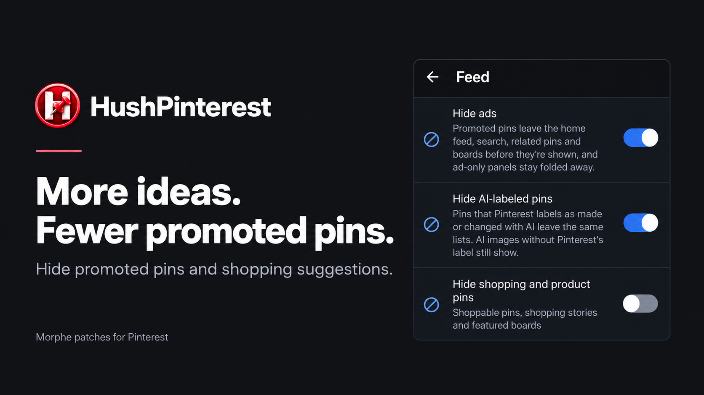

<p>
  
  <a href="LICENSE"></a>
  
  
  
</p>

<p>
  <a href="https://ko-fi.com/X8K126YVER">
    
  </a>
</p>

<p>
  <sub><em>If HushPinterest makes Pinterest better for you, a coffee helps me keep testing patches and maintaining them as Pinterest changes.</em></sub>
</p>

#  HushPinterest

HushPinterest is a Morphe patch bundle for Android that takes promoted pins out of Pinterest and can hide the pins Pinterest labels as AI. It also adds pin downloads, browser and sharing choices, privacy controls and switches for the interface.

The latest release is [v0.0.6](https://github.com/SysAdminDoc/HushPinterest/releases/tag/v0.0.6), with 26 patches. Add this repo to Morphe Manager as a patch source and it'll offer each new release when it comes out.

## Which Pinterest

HushPinterest targets Pinterest **14.38.0**, version code 14388010 (`com.pinterest`), on Android 10 and newer. Use the universal APK, the single file that holds every screen density and processor type. APKMirror lists it as the "nodpi" variant. A split bundle (`.apkm`, `.xapk`) works too if Morphe Manager can merge it.

Other versions may patch, but each patch looks for code by what it does in 14.38.0, and Pinterest renames almost everything between releases. If a patch can't find its spot it says so and stops, rather than patching the wrong place.

## Install

1. Install [Morphe Manager](https://github.com/MorpheApp/morphe-manager) 1.34.0 or newer.
2. Add HushPinterest as a patch source: https://morphe.software/add-source?github=SysAdminDoc%2FHushPinterest
3. Pick the Pinterest 14.38.0 APK, keep the default patch selection and patch. It holds every feature, so you don't need Expert mode. Ad blocking and privacy start on, and everything else waits until you turn on its switch in HushPinterest settings.
4. Only Spoof signature for Google sign-in is left out. If you need it, turn on **Settings → Advanced → Expert mode** in Morphe Manager and pick it before you patch.

A patched Pinterest can't install over the stock one, because Android only accepts an update signed with the same key. Moving from stock requires removing it yourself after saving anything local you need. Boards and pins stored in your account return when you sign in, but that doesn't restore local settings or drafts. The development installer refuses stock or differently signed installs and downgrades. It never removes an app or grants all permissions.

## Signing in

Sign in with your email and a Pinterest password. Google's sign-in button checks the [app's signing certificate](https://developers.google.com/android/guides/client-auth), and a patched Pinterest carries your own key, so use your email instead.

Use the email already linked to your existing Pinterest account and a Pinterest password. If you joined through Google or Facebook, or don't know your Pinterest password, choose **Forgot your password?** on Pinterest's login page. Enter that account's email, then use the reset link sent to your email to set a Pinterest password. It's separate from your Google password. You don't need to unlink Google or replace your account. [Pinterest's password recovery help](https://help.pinterest.com/en/article/reset-your-password) explains the steps.

## Keep your signing key

Morphe Manager signs the patched Pinterest with a key it makes on your phone. Android installs an update over your patched Pinterest only when the update carries that same key.

- **Back it up right after your first patch.** In Morphe Manager, open Settings, then System, then Import & export, then Signing key, and tap Export. Keep the `Morphe.keystore` file somewhere private, because anyone who has it can sign an APK your phone will accept as an update.
- **On a new phone, import it before you patch anything.** Without your exported copy, nothing you patched earlier can be updated in place.

Setup and backup guide in About is optional. It explains installed patches, runtime switches and Pause, and distinguishes settings export from account, media and signing-key backups. It also opens Supported links and public Pinterest help. Same-key upgrades preserve installed data. If Android refuses a different key or an incompatible downgrade, keep the installed data and rebuild a compatible update.

<p>
  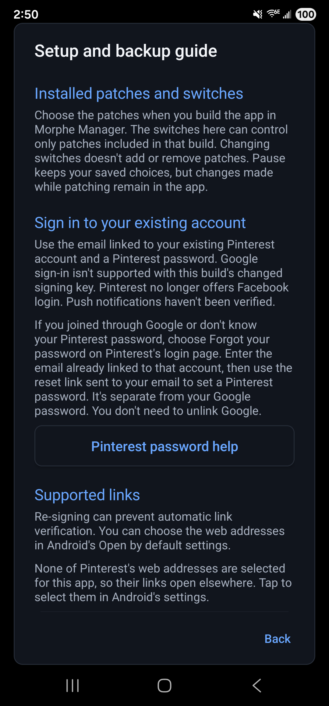
</p>

## Patches

There are 26 patches so far.

| Patch | What it does |
|---|---|
| `Disable analytics` | Stops Pinterest from sending usage reports, crash reports and ad-tracking data to outside companies, and turns off Google's analytics inside the app. Good if you'd rather share less. On by default. Turn it off in HushPinterest settings > Privacy. |
| `Disable update nag` | Stops Pinterest's pop-ups asking you to update from the Play Store. You can still update Pinterest yourself. Good if the reminders get annoying. Starts off. Turn it on in HushPinterest settings > More settings > Updates. |
| `Download board` | Adds Download board to a board's menu. It saves every pin Pinterest has loaded for that board and skips ones already in Download history, so you can keep a board without picking pins one at a time. Needs Download pins on too. Starts off. Turn it on in HushPinterest settings > Pin actions. |
| `Download pins` | Adds downloads for a pin, or for several pins you select in a grid. Saves the original image or the highest-quality video Pinterest supplies to your phone. Starts off. Turn it on in HushPinterest settings > Pin actions. |
| `Filter pin menu` | Lets you hide Add to collage, Remix collage, Search image and Promote pin in a pin's menu, each with its own switch. Download, share and copy link stay. Starts off. Turn them on in HushPinterest settings > Interface. |
| `Hide AI-labeled pins` | Removes pins that Pinterest labels as made or changed with AI from your home feed, search, related pins and boards. AI images without the label still show. Starts off. Turn it on in HushPinterest settings > Feed. |
| `Hide ads` | Removes promoted pins from your home feed, search, related pins and boards, and hides panels that only hold ads. Good for a cleaner feed. On by default. Turn it off in HushPinterest settings > Feed. |
| `Hide advertising ID` | Pinterest sees an empty advertising ID with ad tracking limited, the same as if you deleted your ad ID in Android. Good for keeping ads from following you. On by default. Turn it off in HushPinterest settings > Privacy. |
| `Hide comments` | Collapses the comments and comment previews under pins. It doesn't change who can comment on your pins. Good for a quieter pin page. Starts off. Turn it on in HushPinterest settings > Interface. |
| `Hide header buttons` | Hides the small icon buttons at the end of the top bar. Back buttons, text buttons and account controls stay. Good for a cleaner top bar. Starts off. Turn it on in HushPinterest settings > Interface. |
| `Hide navigation buttons` | Lets you hide the Create, Notifications and Search buttons in the bottom bar, each with its own switch. Home and Profile stay. Starts off. Turn them on in HushPinterest settings > Interface. |
| `Hide save toasts` | Stops the pop-up Pinterest shows after you save a pin, such as the Saved to your board message or a suggestion to follow the creator. The pin is still saved. Starts off. Turn it on in HushPinterest settings > Interface. |
| `Hide search history` | Hides your recent searches on the search screen of this phone. It doesn't delete your account's search history. Starts off. Turn it on in HushPinterest settings > Interface. |
| `Hide shopping and product pins` | Hides shoppable pins, shopping stories and featured boards. Good if you want to browse ideas, not products. Starts off. Turn it on in HushPinterest settings > Feed. |
| `Hide survey prompts` | Turns down Pinterest's "Got a minute?" survey invite before it pops up, the same way tapping Maybe later does, so the same survey doesn't come back. Advertiser sponsored polls don't pop up either. Starts off. Turn it on in HushPinterest settings > Interface. |
| `Hide topic suggestions` | Hides the Ideas you might love row of topic bubbles under pins, without leaving a gap. Comments and related pins stay. Starts off. Turn it on in HushPinterest settings > Interface. |
| `HushPinterest settings` | Adds a HushPinterest page to Pinterest where you turn features on or off, pause HushPinterest, back up your settings and read the licenses. Open it by long-pressing the Pinterest icon. Works as soon as you patch it in, with no switch. |
| `Long-press download` | Adds a Download button to the round menu you get when you long-press a pin in a grid, so you can save a pin without opening it. Slide onto the button and let go. Needs Download pins on too. Starts off. Turn it on in HushPinterest settings > Pin actions. |
| `No screenshot share menu` | Stops Pinterest from popping up sharing suggestions after you take a screenshot. Screenshots still work as usual. Starts off. Turn it on in HushPinterest settings > Interface. |
| `Open links in your browser` | Opens a pin's Visit link and profile websites in your web browser. Pinterest links and sign-in work as before. Good if you prefer your own browser. Starts off. Turn it on in HushPinterest settings > More settings > Links. |
| `Original-quality images` | Loads the original image for each pin and in collages, instead of the large size. Pictures look sharper but use more data. Starts off. Turn it on in HushPinterest settings > Interface. |
| `Quiet email reminders` | Dismisses the optional reminder to confirm your email. Account checks and sign-in still work as usual. Starts off. Turn it on in HushPinterest settings > Interface. |
| `Remove ad tracking permissions` | Removes Google's advertising ID permission and Android's Privacy Sandbox ad services from Pinterest, so it can't use them. Google Play services then answers with zeros. Works as soon as you patch it in, with no switch. |
| `Spoof signature for Google sign-in` | Helps Google sign-in work in the patched app by naming Pinterest's original signature. It only helps with microG-RE or the XSpoofSignatures module. Email sign-in doesn't need it. It isn't selected by default. Works as soon as you patch it in, with no switch. |
| `Strip link tracking` | Removes tracking tags from links you copy or share from Pinterest. The link still goes to the same place, and short pin.it links stay as they are. On by default. Turn it off in HushPinterest settings > Privacy. |
| `System share sheet` | Uses Android's own share menu when you share a pin link. Screenshot and download actions work as before. Good if you want your usual share targets. Starts off. Turn it on in HushPinterest settings > Pin actions. |

Morphe Manager selects every patch but Spoof signature for Google sign-in by default, so nothing is hidden behind Expert mode. Hide ads, Disable analytics, Strip link tracking and Hide advertising ID start with their switches on, as they always have. Every other switch starts off, so a build patched with the defaults acts like Pinterest until you turn one on in HushPinterest settings. Remove ad tracking permissions has no switch. The settings patch is required by the feature patches.

Updating from v0.0.5 or older? Hide AI-labeled pins used to start on. If you never changed it, it's off after the update, so turn it back on from the Feed page if you want it.

Switches change the runtime hooks without patching again. Reopen a screen to refresh controls that are already drawn. Pause makes those hooks follow Pinterest's original path. Startup tasks skipped by Disable analytics run again after a restart with its switch off or Pause on. That patch also sets Firebase and Google Analytics collection flags in the manifest when you patch, and they stay set until you patch again without Disable analytics. Remove ad tracking permissions has no switch at all. Its manifest change stays until you patch again without it.

Disable update nag targets the Play Store prompt in Pinterest 14.38.0.

## Settings

Long-press the Pinterest icon and tap HushPinterest. You can also open Pinterest's App info page and tap Additional settings in the app, which Samsung phones call Configure in Pinterest.

<p>
  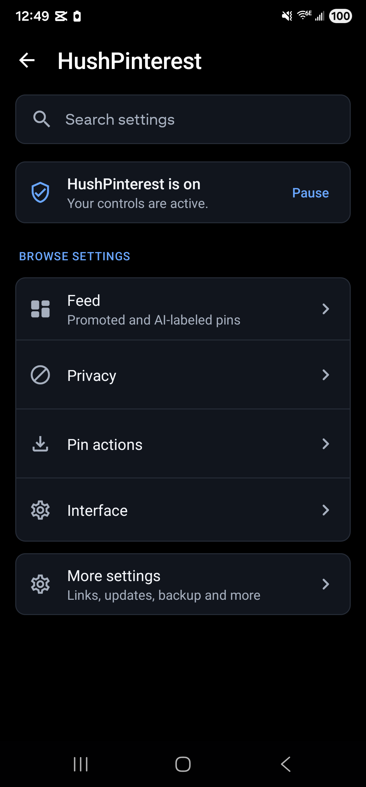
  
  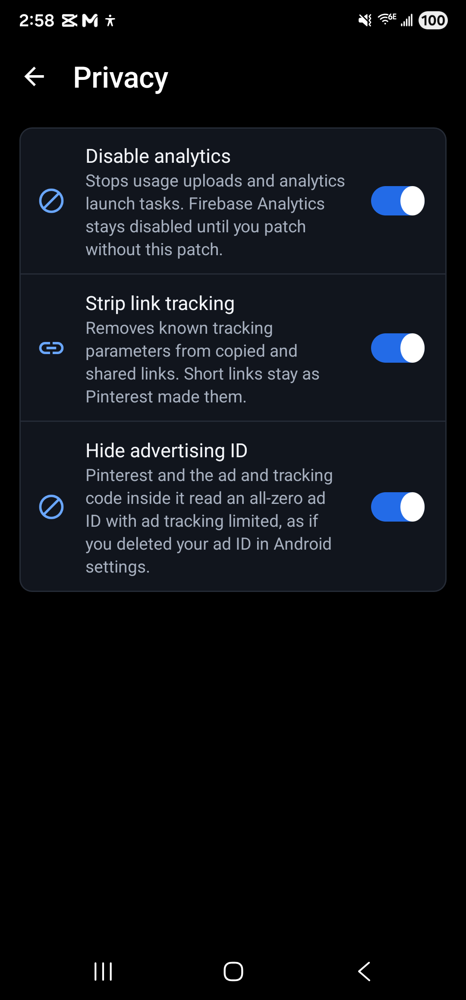
  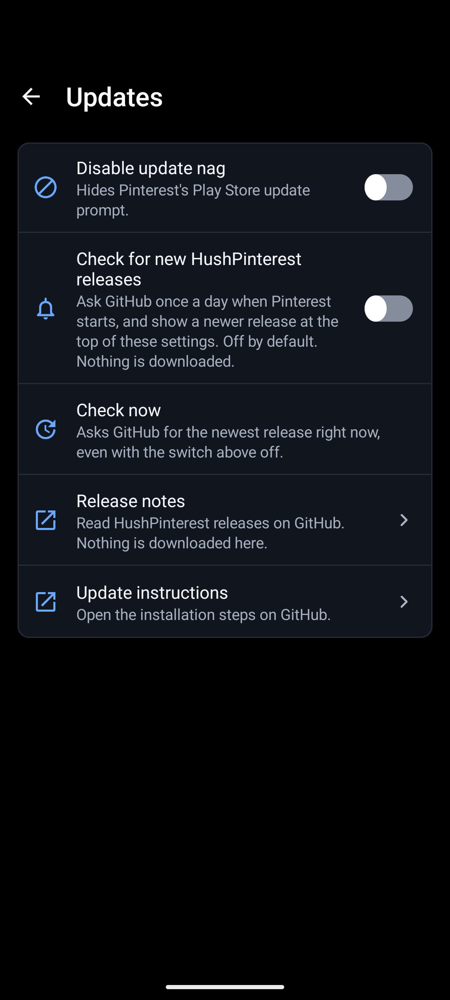
  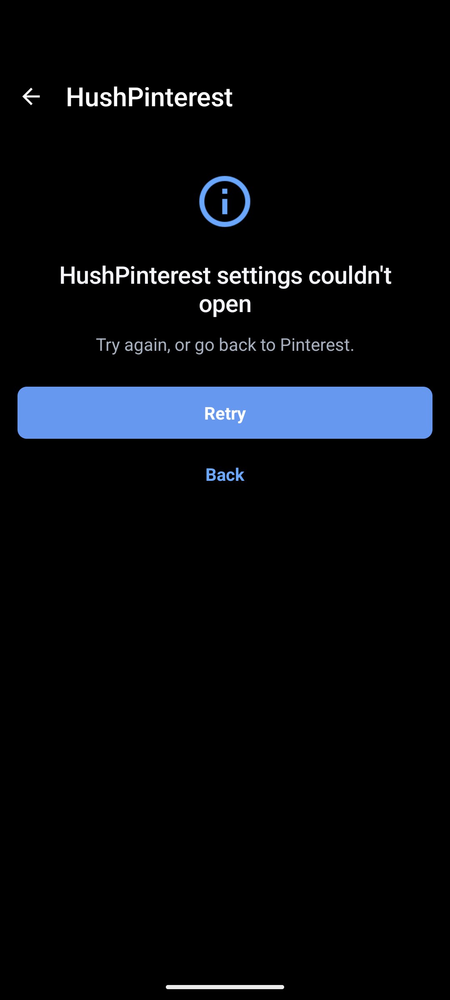
</p>

These settings were captured on Android 16 with every patch included. All 19 feature switches saved and restored their choices. Pause and Resume were checked across restarts, and Supported links opened Android's link settings. Feed filtering, pin downloads, sharing and browser links were also checked on a signed-in phone.

If the settings page can't open, Retry tries to load it again. Back returns to Pinterest. The recovery screen was checked with a controlled load failure.

Hide AI-labeled pins, the shopping filter, the pin actions, the link and update switches and every interface control start off. Create and Notifications have separate switches. The pin menu has separate choices for collage actions, Search image and Promote pin. Home, your profile and the ordinary Save, Share and Report actions stay available.

Download pins adds a Download row when Pinterest supplies an image or a direct MP4. Pinterest's app is usually sent display sizes rather than the original upload. So before an image download starts, HushPinterest asks Pinterest's media host for the original behind the largest size and saves that. If the host doesn't have one, the largest size is saved. It uses the highest resolution MP4 supplied for a video and saves through Android's Downloads service. Streaming playlists aren't saved as videos.

From a pin menu in a feed, search or board grid, Download visible pins lets you select up to 32 pins already on screen. Nothing is selected automatically. It uses each pin's supplied media and shows queued, saved, skipped, unsupported and failed counts. Stop selection leaves started downloads alone. Unstarted selections end when Pinterest closes.

<p>
  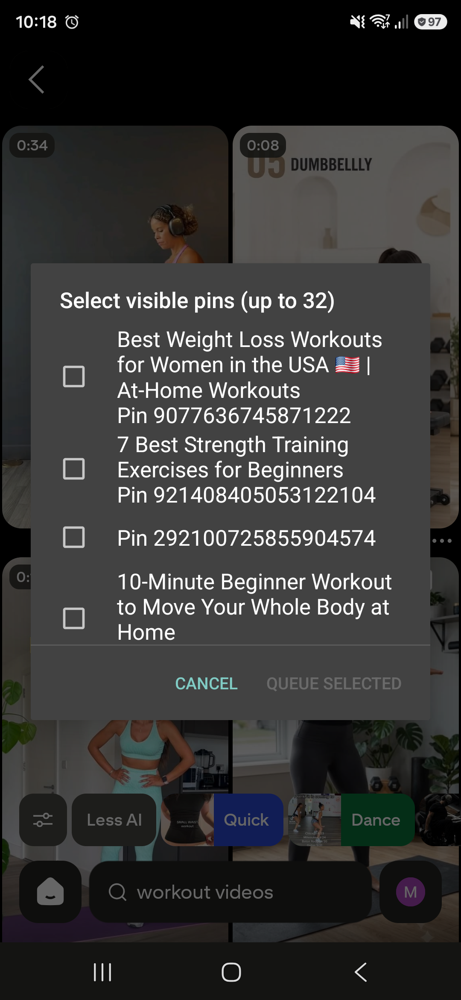
  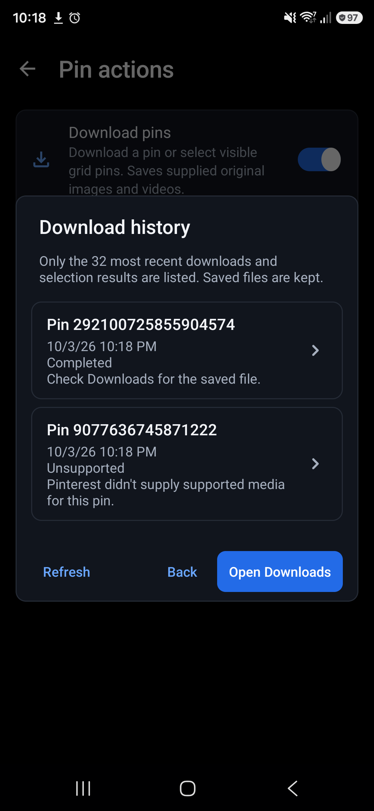
</p>

Download board adds a row to a board's own menu. It saves the pins Pinterest has already loaded for that board, up to 500, and skips any that Download history lists as downloaded. A download that failed, or that Android no longer has, gets tried again. History only keeps the 32 most recent entries, so older downloads can come around again. Pinterest loads a board a page at a time and HushPinterest never asks it for more, so scroll to the end of the board first if you want all of it. Loaded pins are remembered for the last four boards you opened, and only until Pinterest closes. The result shows the same counts as a selection, plus how many were already in Download history. Download pins has to be on too, and this switch starts off.

Long-press download adds a Download button to the round menu you get when you hold a pin in a grid. Slide onto it and let go, and the pin saves the way the pin menu's Download pin saves it, so it shows up in Download history too. Boards and anything else you long-press keep Pinterest's own buttons. Download pins has to be on too, and this switch starts off.

Download history in Pin actions checks the requests HushPinterest started. It shows Android's current status after Pinterest restarts, when a result arrives and when you tap Refresh. A failed request offers Retry only when Android still supplies a supported media address. Otherwise, reopen the pin. A finished image offers Set as wallpaper, which opens Android's own Set as options for the saved file. Removing a history entry keeps the downloaded file. Use system Downloads to cancel a request that's still running.

Download history also records results from visible-pin selections, including skipped or unsupported pins. It keeps the 32 most recent entries without storing media addresses. These local results don't claim to be Android download requests.

Supplied media details shows dimensions, a type and the size they belong to, from Pinterest's metadata and media address. The file hasn't been inspected, and missing values stay unknown. A recognized pin without a downloadable image or MP4 shows Download unavailable with a reason. Adaptive streams don't become thumbnail downloads.

<p>
  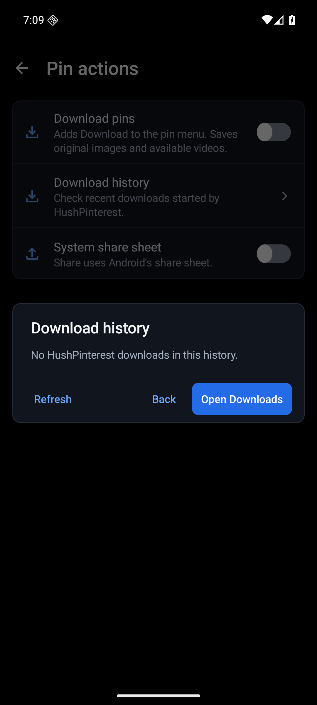
</p>

Exports and import previews use the choices saved on this device. Import settings shows each switch's name and its old and new values before applying the file. Undo import restores the previous switches once. Editing a saved switch or restarting Pinterest ends Undo, even if you change the switch back. Failed writes keep Undo after rollback. The file contains allowed settings, including choices whose patches aren't installed. It doesn't contain accounts, media, signing keys, logs or temporary state.

<p>
  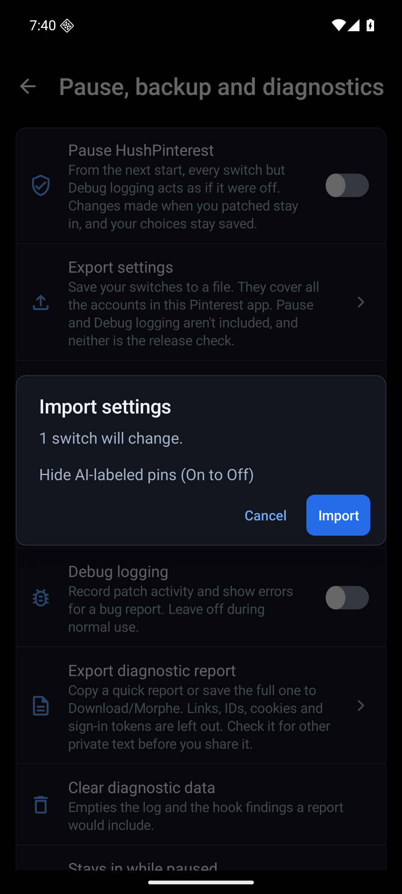
</p>

Interface summaries now say which controls change and when. Bottom-bar and header choices take effect on their next layout. Recent searches and comments follow their next layout or visibility update. Pin-menu choices affect new menus. Screenshot suggestions require a restart. Search also recognizes reviewed terms such as Toolbar icons, Recent searches and Reverse image search, in each supported language.

<p>
  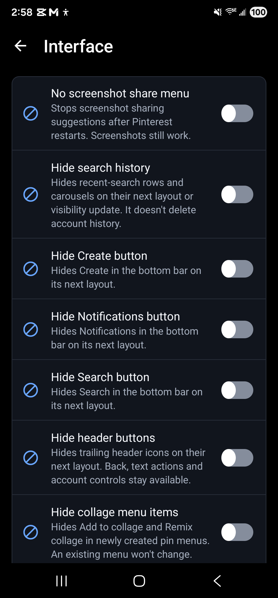
  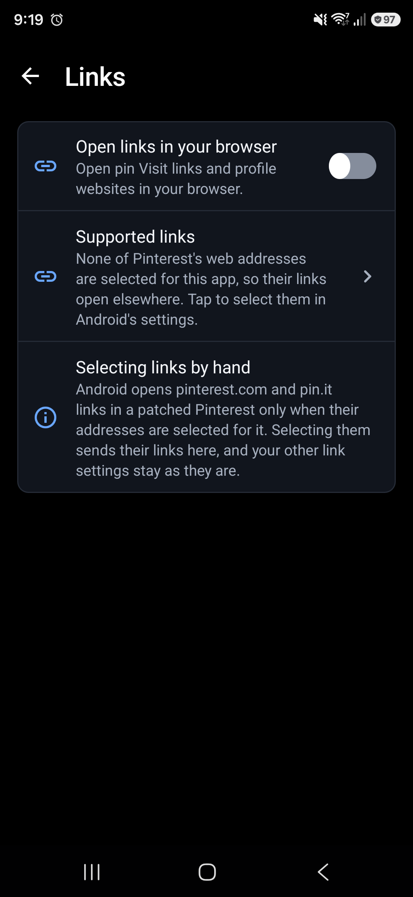
</p>

HushPinterest checks the supplied HTTPS media address before passing it to Android's Downloads service, which [follows any redirects itself](https://github.com/aosp-mirror/platform_packages_providers_downloadprovider/blob/master/src/com/android/providers/downloads/DownloadThread.java). The address must be a supported public HTTPS Pinterest media address.

The release check compares your Pinterest version with every version a release explicitly supports. Updates also has links to the release notes and installation steps. Those links don't download anything automatically.

## Opening Pinterest links

Android hands a pinterest.com or pin.it link to the official app only when that app proves it belongs to Pinterest's sites, and a re-signed app can't. To open those links in the patched app, go to its App info page, tap Open by default, then Add link, and select the Pinterest sites. HushPinterest's Links page has a button that goes straight there.

Manual selections were checked on Android 16. Links for pinterest.com, www.pinterest.com and pin.it opened the patched app.

## Google sign-in

Google checks which key an app was signed with before it signs you in, and a patched Pinterest is signed with yours, not Pinterest's. Email and password sign-in doesn't care. The optional Spoof signature for Google sign-in patch writes Pinterest's original certificate into the manifest, where two kinds of software look for it: microG-RE, when it replaces Google Play services, and the XSpoofSignatures LSPosed module once you grant its permission. Stock Google Play services never reads it, so on most phones the patch changes nothing. It doesn't add any permission.

## Privacy

HushPinterest doesn't collect anything and has no server. The release check stays off until you turn it on. Once it's on, HushPinterest asks `api.github.com` for its latest release at most once a day, when Pinterest starts, and again whenever you tap Check now. Download pins contacts Pinterest's media server when you tap Download, and Download board does the same for each pin it saves. Browser and share actions open the destination you chose.

Disable analytics stops the targeted Pinterest usage uploads and the AppsFlyer and Bugsnag transports. Pinterest's Google Engage client gets the same "service not found" answer it gets on a phone without Engage, so nothing is published to Google's recommendation surfaces. Its manifest change turns off Firebase Analytics, Crashlytics and Performance collection, stops Google Analytics from collecting the ad ID and sets Google's four default consent signals to denied. It leaves Firebase messaging, Firebase Installations and the sign-in components in place. Strip link tracking removes known tracking parameters from copied and shared links while keeping unknown parameters, signed links and opaque `pin.it` short links. Hide advertising ID changes the answer Google's ad ID getters give inside Pinterest, so Pinterest's own requests and the bundled ad and analytics SDKs see zeros. It doesn't touch the ad ID other apps see. Remove ad tracking permissions takes Google's advertising ID permission, the two Privacy Sandbox ad services permissions and the ad services configuration out of Pinterest's manifest. Google Play services then answers Pinterest with an all-zero ad ID, so while both patches are in, turning off Hide advertising ID doesn't bring the real one back. Hide search history hides recent searches on this device. It doesn't delete Pinterest's server history.

Analytics hooks are checked before any Firebase manifest change. Remove ad tracking permissions checks its settings flag before it edits the manifest, and refuses a Pinterest build that declares none of the permissions or the configuration it removes. Local patch helpers refuse failed results even if the patching tool produced an APK. Runtime analytics controls stay inactive when that patch isn't installed.

Local verification compares the compiled manifest against the full input APK, including merged splits. It checks account and push components, metadata, filters and query declarations. Only the changes for the selected patches are allowed. Leaving out Disable analytics keeps Pinterest's Firebase and Google Analytics flags as supplied. Leaving out Remove ad tracking permissions keeps its ad permissions and ad services configuration. Spoof signature for Google sign-in may add only its two metadata entries, and only to a manifest that has neither.

The final APK is also checked against the selected feature hooks and their native fallback paths. Inserted calls must resolve through the merged app's libraries or Android's public API. Newer Android calls need a reviewed version guard. Missing hooks, duplicate calls and unresolved methods fail before a local helper delivers or installs an APK. These checks use Android SDK Platform 36, or explicit `-AndroidJar` and `-ApiVersions` paths. Known boolean and integer values guide the disabled-path check.

The About and Licenses screens link to `github.com`, `gitlab.com` and `www.gnu.org`. Those open in your browser, and only when you tap one.
The optional setup guide links to password and data-export help at `help.pinterest.com`. Those pages open in your browser when you tap their buttons.

Shared pin links use `www.pinterest.com`. Downloads use media addresses Pinterest supplies under `pinimg.com`. Looking for an original sends at most four HEAD requests to that same host. Browser discovery checks installed handlers for `example.com` without opening or loading that address. When Disable analytics is off or paused, its AppsFlyer and Bugsnag wrappers use the SDKs' original connection path and Engage reaches its service again.

## Reporting a problem

Full diagnostic reports go to the shared `Download/Morphe` folder. The summary and save result show the actual destination, or explain when storage is unavailable. Reports remain bounded and redact links, IDs and sign-in secrets.

Reports include local push checks for notification permission, notification blocking, delegation, messaging components and the Firebase Analytics manifest flag. These checks don't send a test notification or prove that Pinterest can deliver one. An absent delegate is optional, and unknown delegate packages are redacted.

When Filter pin menu is installed, reports count its four recognized optional rows and whether their switches hid them. They distinguish a visible row from one Pinterest already hid. Row text and unknown menu entries aren't recorded.

Open an [issue](https://github.com/SysAdminDoc/HushPinterest/issues) and say what you did and what you saw. It helps a lot to attach a diagnostic report. In HushPinterest's settings, tap Export diagnostic report, then Copy quick report or Save full report. The report carries Pinterest's version, your Android version and what each patch did. HushPinterest takes out the account, pin and board ids it recognizes, but give it a read before you share it. Nothing is sent anywhere unless you paste or attach it yourself.

## Where the patches come from

| Source | What came from it |
|---|---|
| [SysAdminDoc/HushTelegram](https://github.com/SysAdminDoc/HushTelegram) at `8c54a1d` | The Gradle build, the shared extension library with its settings screen, diagnostics, pause and backup, the bytecode helpers, and the checks that apply every patch to a real APK before a release. Most of that came to HushTelegram from [HushThreads](https://github.com/SysAdminDoc/HushThreads) and [Hushfacebook](https://github.com/SysAdminDoc/Hushfacebook). |
| [Morphe](https://github.com/MorpheApp) and [ReVanced](https://gitlab.com/ReVanced/revanced-patches) | The patcher and the patch template. Everything above grew from their code. |

The Pinterest patches were written for this project by reading Pinterest itself, and they target Pinterest 14.38.0. Every source file says where it came from in its header, and [provenance.json](provenance.json) maps each file to the project and commit it came from, with its license. The [source ledger](sources/pinterest-sources.json) records the other Pinterest projects reviewed at pinned commits, including renamed repositories and the difference between development and stable releases. Its search findings name the queries and dates checked. These are research references. None of their Pinterest code has been adopted, and their version lists don't expand HushPinterest's supported builds.

## Building from source

Gradle runs at low priority with at most two workers and a 1.5 GiB heap. Idle daemons exit after a minute. Use focused checks while editing and save full validation for a release milestone.

You need JDK 21 and the Android SDK. The Morphe patcher comes from GitHub Packages, so you also need a GitHub token with `read:packages`.

```bash
export GITHUB_ACTOR=<your GitHub user>
export GITHUB_TOKEN=<a token with read:packages>
./gradlew :patches:generatePatchesList
./gradlew :patches:buildAndroid
```

The bundle lands in `patches/build/release/patches-<version>.mpp`, beside its SHA-256 and a CycloneDX SBOM of every library that goes into it. Run `generatePatchesList` before `buildAndroid`, or the bundle loses its Android payload.

Tests: `./gradlew :patches:test :extensions:pinterest:test` runs the quick ones. The patch tests that open the Pinterest APKs are their own task, `./gradlew :patches:fixtureTest`, and they need `HUSHPINTEREST_FIXTURE_DIR` set to the directory containing every APK named in `AppCompatibilities.kt`. The push check runs both and rejects missing fixtures.

Device helpers acquire an exclusive serial lease before writing to a phone or emulator. Set `HUSHPINTEREST_DEVICE_LEASE_DIR` to the shared pool's lease directory, or pass it explicitly. A caller can pass its lease token. Child checks retain that caller's lease. Expired leases remain untouched until the previous test has been confirmed stopped. Installs verify the device identity and both APK signers, then use an in-place update that preserves existing permissions and app data.

`scripts/patch-for-device.ps1` returns the verified APK path from its own folder under `-OutDir`. Concurrent runs keep separate output and temporary files. Use `-OutputApk` for a specific final path. An existing path is refused. Failed or unreadable patch reports discard that run's APK before installation.

Build dependencies have a separate advisory check. Run `./gradlew :patches:buildDependencyReport`, then `pwsh -NoProfile -File scripts/build-advisories.ps1`. High, critical or unrated findings and failed queries stop a push. Lower-severity findings are reported. Reviewed tooling constraints also reject affected Commons Lang, HttpClient and Guava versions across build, test and provided dependency graphs.

These constraints apply to builds from this repository. They don't replace libraries inside an installed Morphe Manager or Desktop JAR. Desktop 1.18.1 includes Guava 33.5.0-jre. That separate tool needs an upstream build with reviewed Guava 33.7.2 or newer. Check Manager's own resolved dependencies when upgrading it. Neither tool's bundled dependencies are attested by this project's build report.

## Verify a release download

Every release's `SHA256SUMS.txt` is signed with the HushPinterest release key. Its fingerprint is `FCE5 ECE3 182A 647B 3AF2  C5ED 2DC3 5E8D 5C00 E8A6`, and the public key is [keys/hushpinterest-release.asc](keys/hushpinterest-release.asc) in this repository. The same key is on [keys.openpgp.org](https://keys.openpgp.org/search?q=FCE5ECE3182A647B3AF2C5ED2DC35E8D5C00E8A6). Compare the fingerprint from both places before you trust it. A key downloaded beside the bundle doesn't prove anything on its own.

Keep the bundle, its SBOM and release receipt together with `SHA256SUMS.txt` and `SHA256SUMS.txt.asc`. With GnuPG installed, verify them locally before importing the bundle into Morphe Manager:

```powershell
& ./scripts/verify-release-checksums.ps1 `
    -AssetDirectory ./download `
    -ChecksumsPath ./download/SHA256SUMS.txt `
    -SignaturePath ./download/SHA256SUMS.txt.asc `
    -TrustedPublicKeyPath ./trusted/release-public-key.asc `
    -TrustedFingerprint '<complete independently verified fingerprint>'
```

The check authenticates the checksum signature offline in a fresh keyring, then checks every listed file. Missing signatures, different signers and changed bytes fail. Morphe Manager 1.34.0 and Desktop 1.18.1 don't perform this authentication automatically. Import the locally verified bundle yourself.

`validate-release-facts.ps1 -VerifyPublishedAsset` also requires `-TrustedPublicKeyPath` and `-TrustedFingerprint`. Its nonsecret environment alternatives are `HUSHPINTEREST_RELEASE_PUBLIC_KEY` and `HUSHPINTEREST_RELEASE_FINGERPRINT`. It authenticates the hosted checksum payload before accepting bundle hashes, then checks the published receipt, SBOM and release commit as before.

For release preparation, `sign-release-checksums.ps1` writes a canonical checksum payload and detached signature using an explicitly selected private keyring kept outside the repository and release assets. It verifies its own result before writing final files. Existing checksum files are never overwritten. Signing remains part of an explicitly requested release.

Key rotation requires independently verifying the replacement fingerprint before changing your pin. Refresh the trusted public key through that same channel to receive revocation and expiry updates. A cached key can't tell you about a revocation it hasn't received. Stop accepting a revoked or expired key. Don't replace your pin just because a download fails authentication.

## License

[GPL-3.0](LICENSE), with the Morphe section 7 notices carried in [NOTICE](NOTICE). Pinterest is a trademark of Pinterest, Inc. HushPinterest isn't made by or connected with Pinterest.
