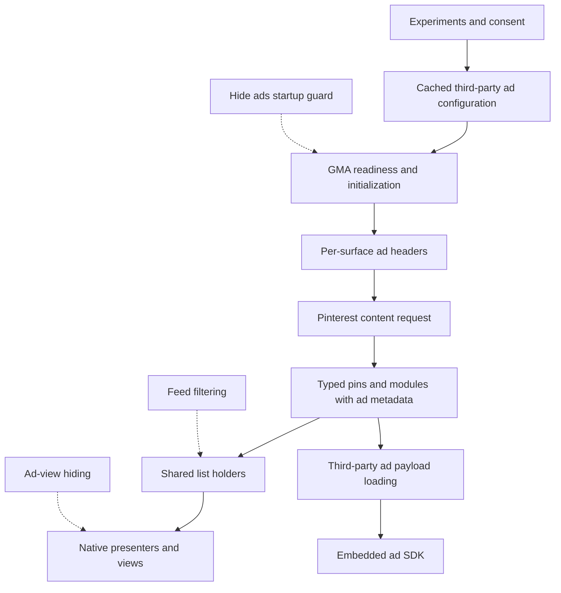
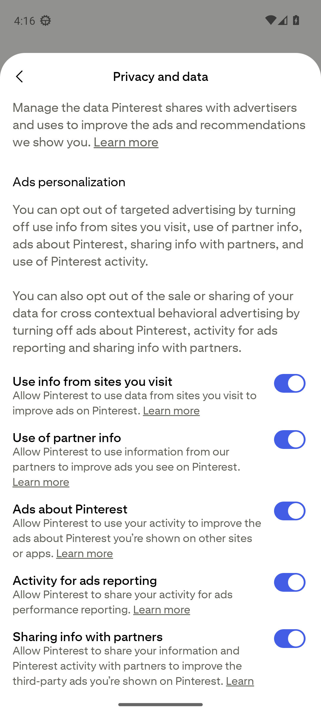
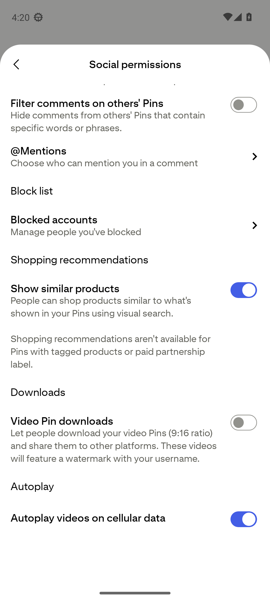
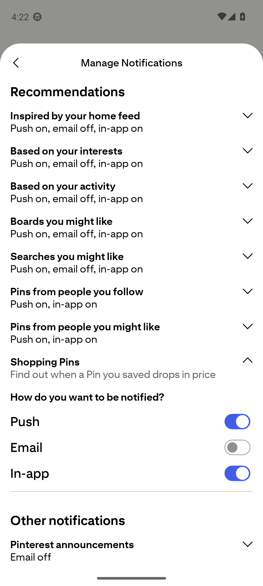
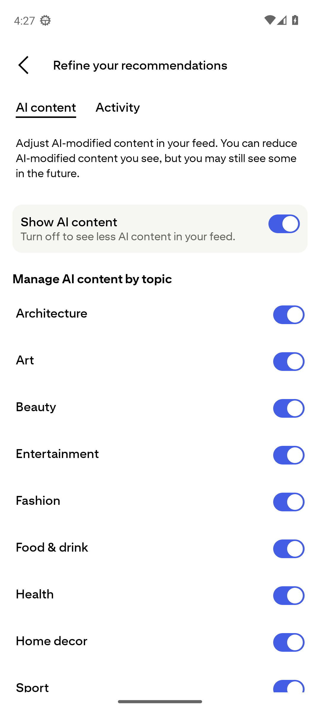

# Pinterest 14.38.0 factory app audit

Inspected October 9, 2026. This reference combines a signed-in survey of the original Pinterest Android app, targeted analysis of its APK, and a review of HushPinterest's current source. It is intended for maintaining existing patches and choosing new ones.

## Read this first

| Reference | Contents |
|---|---|
| [Factory app map](pinterest-14.38.0-factory-map.md) | APK identity, signing, manifest, components, package layout and stable update anchors |
| [Advertising delivery](pinterest-14.38.0-ads.md) | Native content models, third-party ad configuration, GMA headers and payloads, current filters, gaps and acceptance criteria |
| [Tracking and privacy](pinterest-14.38.0-privacy.md) | All nine telemetry paths, ten startup jobs, eight manifest flags, identifier/referrer/link flows and limits |
| [Runtime measurements](pinterest-14.38.0-runtime.md) | Attributed network observations, CPU and media timers, background scheduling and battery measurement limits |
| [Patch coverage and customization](pinterest-14.38.0-patch-reference.md) | All 23 patches, native alternatives, concrete additions and a maintenance checklist |
| This page | Live screen observations, evidence boundaries, key decisions and the next investigation priorities |

The strongest immediate leads are a typed shopping-story mismatch, incomplete reporting of partial ad-hook coverage, GMA initialization and request-header boundaries, and the difference between visible filtering and network suppression. Native settings also cover more ground than the patch list alone suggests. Pinterest already offers theme, comment, notification, personalization and AI-content controls.

No patch behavior was changed for this audit. The reference distinguishes a code fact from a screen observation and from a proposal. It does not claim complete ad or tracking suppression.

## Baseline and evidence

| Item | Recorded state |
|---|---|
| Pinterest package | `com.pinterest` |
| Original APK | 14.38.0, version code 14388010 |
| SHA-256 | `af6b383adb445cebee1ca43f14ac409f91475c1d62e0e11ef52ef52e29fb0553` |
| Original signing certificate SHA-256 | `341d6881b1ecf38361fbf8c8fbae0aa516b45375c39ef5e78b161869acc1bcfa` |
| Hush source reviewed | `932f0c5`, with 23 catalog entries |
| Published bundle at inspection | v0.0.5. Later source changes are not assumed to be in that release |
| Live environment | Android 13/API 33 emulator, x86_64, 1080 by 2400 pixels, English (United States), Wi-Fi |
| App installation | Original signed APK. No Hush extension or selected patches |
| Account | Signed in manually. Credentials were not part of the audit |
| Native theme | System default, appearing light |
| Account experiments | Labs was already enabled. The Labs page listed **AI Forward**, `search_ai_fwd_conversation` |
| Account preservation | Login survived a cold emulator restart. A named local snapshot and separately verified offline AVD backup were retained |

This is a factory **binary** baseline with an existing signed-in account. It is not a claim that every account preference is a new-account default. Server experiments, region, account history and app configuration can change the UI without changing the APK. The Labs finding is one reason to avoid treating these screens as universal.

The initial logged-out capture is in the [app map](pinterest-14.38.0-factory-map.md#clean-install-launch-survey). The signed-in survey inspected Home, organic pin details, overflow and Share, Search, Saved, creation entry and the settings described below. It did not save pins, follow people, message recipients, visit advertiser destinations or change account preferences. One neutral search was submitted. Browsing and searching can themselves affect recommendations.

### Evidence labels

| Label | What it establishes | What it does not establish |
|---|---|---|
| **Live** | A saved screenshot was visually inspected and its current UI hierarchy recorded | Every account, rollout or device has the same screen |
| **Measured runtime** | A timed capture or operating-system counter records activity under the stated protocol | Encrypted payload contents, universal behavior or causal battery savings |
| **Native static** | An instruction, annotation, resource or manifest node exists in the original APK | The branch ran, a value was populated, or a server received it |
| **Patch source** | Current code targets a particular boundary and implements a behavior | The reviewed source is installed on a phone or every runtime branch passed |
| **Documented by Pinterest/platform** | The linked official source describes a supported behavior | Exact implementation or account availability in this APK |
| **Candidate** | There is a specific investigation or patch opportunity | The hook has been implemented or verified |

Raw signed-in screenshots, hierarchy files and packet data remain local because they can contain account information, suggestions and history. Four account-name-free settings captures are included below. Evidence IDs in the survey table refer to the retained local capture sequence. Repeated return screens are omitted from the table.

### Measured runtime summary

The [controlled runtime study](pinterest-14.38.0-runtime.md) captured 10,122 packets and correlated visible connections with the app's socket ownership. Startup included Pinterest API/tracking service names and AppsFlyer. Three minutes of feed browsing received about 4.2 MB and recorded 94.722 seconds of video activity. The following ten-minute background intervals were quiet for this app, with 7,272 combined bytes while Home was visible and 2,719 combined bytes with the display off.

Those byte totals use Android's primary-app-UID counters and the chapter's recorded counter intervals. They do not identify encrypted request bodies or assign every byte to an ad. A short background sample also cannot rule out the delayed workers found in the scheduler. The emulator provides software activity measurements. Physical battery drain remains unmeasured while the prepared phone is connected to USB power.

## How ads reach the screen

The APK connects ordinary Pinterest content requests with ad-bearing models and, on eligible paths, third-party SDK rendering. Ads are not confined to a separate banner request. The live survey found sponsored content mixed into Home and placed inside shopping modules on Search and an ordinary pin's detail page.

This diagram summarizes traced stages, not a promise that every ad follows one path. The [ad reference](pinterest-14.38.0-ads.md) gives the actual methods, fields and service paths. In particular, `ad_data.third_party` can carry an encoded payload, while helpers prepare `x-pinterest-gma` through `x-pinterest-gma-5` for several content surfaces. A separate `third_party_v2` model is a coverage lead.

Three outcomes need separate evidence when evaluating an ad patch:

- The placement is no longer rendered, including its empty container.
- The client avoids preparation, fetch or media work that is unnecessary once the placement is hidden.
- Impression or measurement events do not leave through another path.

The current shared-list hook supports the first outcome at recognized holders. It does not establish all three by itself. An item has already reached the app by the time its decoded model is filtered.

Pinterest publicly describes multiple image, video and shopping formats across browsing and search. That supports looking beyond one feed-card shape, but the source trace and live capture must establish which format a patch actually reaches. [Pinterest advertising formats](https://business.pinterest.com/advertise/).

## Signed-in screen survey

### Home, pin actions and Search

| Step and evidence | Live result | Maintenance value and limits |
|---|---|---|
| 1. Home (`01`, `02`) | A two-column masonry feed, Home/Search/Saved at the bottom, Create and Inbox in the header. A promoted video was already partially visible near the bottom | The retained five-value navigation enum is not a five-button layout contract. Header controls and bottom tabs need separate coverage |
| 2. Scrolled Home (`03`, `04`) | A wide sponsored video card followed by image ads with a **Learn more** action, advertiser label and **Sponsored** text. Several promoted nodes coexisted with ordinary pins | Measure wide video and ordinary-width image cards separately. Do not infer an overall ad rate from one viewport |
| 3. Ordinary pin detail (`05`, `10`) | Image, visual-search button, reactions, comments, Share, overflow, Save and creator attribution. A comment preview and sponsored **Shopping ideas** appeared underneath | A pin can be organic while lower modules contain ads. Test nested module cleanup and avoid deleting the whole closeup |
| 4. Download education (`05` through `08`) | A blue tip said Download image had moved to Share. Early taps did not open the requested menu while the tip was visible. Leaving and reopening the pin removed it | First-use education can interfere with automation. This is a reproducible observation in this run, not a diagnosis of all tooltip behavior |
| 5. Native Share (`11`) | A pin-preview carousel, suggested recipient area, Copy link, Messages, Gmail and More | No recipient was selected. System-share integration should avoid stale pin identity and should preserve intentional pin selection. The first viewport did not show Download image |
| 6. Overflow (`13`) | See more, See less, Copy link, Download image, Add to collage and Report | Download image remained in overflow despite the tip. Preserve native feedback/report actions and distinguish them from passive telemetry |
| 7. Search landing (`16`) | Editorial artwork, recent searches and recommendation modules. Search expanded into the bottom bar with a visual-search camera icon | The search-history patch needs both the landing and typeahead paths. Header-only cleanup will miss this layout |
| 8. Typeahead (`17`, `18`) | Recent entries with removal affordances, then matching query suggestions after typing | Hiding history visually is different from stopping local persistence or server recommendations. No existing history entry was removed |
| 9. Results (`19`) | Searching **desk organization** produced a sponsored **Shopping ideas for you** group with six promoted product tiles above ordinary results. Topic chips and a Filter button floated above bottom navigation | A multi-item commercial module is a distinct regression case from a single promoted pin. Verify its heading, padding and wrappers disappear when appropriate |
| 10. Search filters (`20`) | All Pins, Videos, Boards, Profiles and Products. All Pins was selected, Apply disabled until a change | A content-type filter already exists. A default filter or remembered choice could extend it, but must preserve deliberate switching |

The advertiser destination domains displayed in descriptions are UI labels. They are not a list of servers contacted. No ad destination was opened, and a visible retailer name does not identify whether Pinterest, GMA or another path supplied the creative.

### Saved, creation and account settings

| Step and evidence | Live result | Maintenance value and limits |
|---|---|---|
| 11. Saved (`22`) | Pins, Boards and Collages tabs, a search field, voice-search affordance, Create and Settings. Pins showed an empty-state explanation and Explore Pins | Loaded-board download still needs a populated board. The audit did not manufacture saved content to populate this account |
| 12. Account menu (`23`) | Account management, Profile visibility, Refine your recommendations, Link to Pinterest, Social permissions, Content permissions, Notifications, Privacy and data, Reports and violations center, Labs, account and security entries | This account reached settings through the gear on Saved. Account and security routes should survive any header cleanup |
| 13. Privacy and data (`24` through `26`) | Seven advertising controls, Pinterest Canvas training, data request/deletion and cache entries | Native account preferences are independent of Hush's upload hooks. No switch, export, cache-clear or deletion action was submitted |
| 14. Social permissions (`28` through `30`) | Message settings, comment permissions and phrase filters, mentions, blocked accounts, similar products, video downloads and cellular autoplay | Existing native controls should be documented before adding duplicates. Wi-Fi autoplay exists in resources but was absent from this account's visible page |
| 15. Content permissions (`32`) | Automatic product tagging for current/future pins, with catalog-based explanation and a manually tagged-pin exclusion | Controls the account's own content. It is not a control for hiding shopping content while browsing |
| 16. Notifications (`34` through `36`) | Categories for created/saved pins, social activity, recommendations and other notices. Expanding Shopping Pins exposed separate Push, Email and In-app switches | Native preference choices and Android notification permission are separate layers. This audit did not receive a live push or prove delivery |
| 17. Account management and theme (`38`, `39`) | Account-management entry points, business conversion, app sounds and theme. Theme offered System default, Light and Dark | Day/Night is retained in resources but wasn't offered here. No theme or account state was changed. Account details stay out of public screenshots |
| 18. Profile visibility (`42`) | Private profile and search-engine privacy options | These affect who can find/view account content, not what telemetry leaves the client |
| 19. Labs (`44`) | Join Pinterest Labs was already enabled. Active experiment **AI Forward**, key `search_ai_fwd_conversation`, was displayed | Record experiment state during regressions. No experiment was enabled or disabled for this audit |
| 20. Recommendation controls (`46`, `47`) | AI content and Activity tabs. A global Show AI content control and nine topic switches appeared | Pinterest explicitly warns that some AI-modified content may remain. Hush's disclosure-based filtering has a different boundary |
| 21. Creation entry (`50`) | A sheet offered Pin, Collage and Board | The sheet was dismissed. Media access, editing, publishing, drafts, camera and upload behavior remain unexercised |

### Native preference details worth retaining

**Advertising.** The live Privacy and data screen names Use info from sites you visit, Use of partner info, Ads about Pinterest, Activity for ads reporting, Sharing info with partners, Use of Pinterest Activity and Ads off Pinterest. It separately exposes Use your data to train Pinterest Canvas. These controls should not be presented as effects of Hush's Disable analytics switch. Pinterest documents personalization controls separately from ad removal. [Pinterest personalization settings](https://help.pinterest.com/en/article/edit-personalization-settings).

**Social and media.** The word filters distinguish comments on the account's own pins from comments on others' pins. Similar-product recommendations affect shopping on the account's own content. Video-download permission refers to others downloading the account's 9:16 video pins and describes a username watermark. Cellular autoplay sits on this page too. Turning off playback should not be assumed to stop prefetch.

**Notification noise.** Recommendations include home-feed inspiration, interests, activity, suggested boards/searches, followed or suggested people's pins and Shopping Pins. Other categories include announcements, surveys/quizzes, reports/violations and Shuffles. The Shopping Pins description refers to saved-pin price drops. A useful cleanup should preserve user-requested price alerts when desired, and keep messages/security separate from recommendation noise.

**AI-content preferences.** The topics shown were Architecture, Art, Beauty, Entertainment, Fashion, Food & drink, Health, Home decor and Sport. This is an account recommendation control. The current local filter checks supplied disclosure metadata and cannot identify all unlabeled generated imagery. Per-topic filtering would require reliable topic metadata and an explicit rule for unknown topics.

  
  

  
  

These images show one account's observed state. The switch positions are not a statement of universal defaults.

## Interface findings and customization opportunities

The app exposes many useful native controls, but their placement is uneven. Theme and sounds are under Account management, autoplay under Social permissions, and ad controls under Privacy and data. A Hush setup guide or native-settings shortcut could make these easier to find without taking ownership of account preferences.

| Finding | Evidence and effect | Practical opportunity |
|---|---|---|
| Commercial modules surround ordinary content | Home ads, related shopping and the search product grid were visible | Expand coverage by actual module type. Keep shopping filters separate from ads so users can retain organic products |
| Floating controls occupy the content area | Home navigation and search chips/bar overlap the lower viewport | Investigate optional compact navigation and chip suppression. Preserve back/settings access and scroll padding |
| Download guidance contradicts overflow contents | First-use tip versus live menu | Preserve both entry paths during updates. Add a comparison fixture for experiments that move native download actions |
| Suggested recipients are prominent in Share | Native Share screen | Keep system sharing as an explicit choice. Do not silently select recipients or rewrite unrelated board invitations |
| Native settings are spread across unrelated headings | Theme/autoplay/privacy routes above | Add accurate discovery/help links before designing duplicate toggles |
| Multiple meanings of “less AI” | Native preference versus labeled-pin removal | Explain both controls. Consider topic-aware filtering only after metadata research |
| Ad/network claims are easy to overstate | Filtering occurs after decoded content exists | Diagnostics should distinguish filtered models, collapsed views, skipped tasks and observed network attempts |

### Accessibility observations

The hierarchy supplied useful labels for Home, Search, Saved, visual search, Share, overflow, Save, promoted pins and filter radio choices. The search filter exposed its selection and disabled Apply state. Those are useful regression anchors.

Some compressed settings rows and menu parents had empty text/description even when text was visible. Several switched rows exposed text but no separate checked-state node in the compressed dump. This may be a result of node merging or the capture mode. It requires a TalkBack and uncompressed-tree check before being called an accessibility defect.

Floating navigation can cover part of a card in a still image, and gray secondary text, tiny overflow targets and the first-use tip deserve attention at large text sizes. The audit did not measure contrast, use TalkBack/Switch Access, test screen magnification or assess keyboard focus. It is not a WCAG compliance review. Any new hiding patch should check focus removal, content descriptions, traversal and empty space as well as pixels.

## Priorities for patch work

These are proposed work items, not completed features. The linked chapters contain concrete native anchors, risks and acceptance conditions.

| Priority | Work | Why it comes first |
|---|---|---|
| P1 | Handle typed `SHOPPING_SPOTLIGHT` consistently | One native story model is an enum, while Ads compares that field to a String. The separate Shopping filter already handles typed values. Confirm which paid placements use the typed model before claiming live leakage |
| P1 | Report exact ad-hook coverage | Current capability booleans can remain true when only some holder/view targets match. Preserve hard refusal on unsafe targets and show partial support honestly |
| P1 | Verify nested shopping modules in search and closeups | Both were directly observed. Check wrapper/headline removal, preserved organic content and list pagination |
| P1 | Trace GMA headers and lifecycle after toggles | Startup suppression does not tear down an already initialized SDK. Measure cold/warm starts and preserve native header cleanup before guarding additions |
| P1 | Compare patches against the measured factory network baseline | Guest capture now records app traffic and Android UID counters. Repeat equivalent workloads with patched configurations before claiming suppression or savings |
| P2 | Diff endpoints, SDK transports, startup tags and identifier readers on each APK update | Existing fingerprints can still match while upstream adds new telemetry |
| P2 | Trace APP_START, first-party referrer storage and optional request headers | The source constructs attribution data outside AppsFlyer. Determine whether final delivery is already covered before adding redundant blocks |
| P2 | Improve canonical pin-link and regional-host handling | Use typed pin IDs where already available. Preserve signed URLs, functional queries and board/invite routes |
| P2 | Suppress selected surveys through their native decline path | Shared modal IDs are too broad. Keep security/account dialogs and user-initiated surveys intact |
| P2 | Make original image quality and downloads network-aware | Current original-media choices can increase data use. Manual intent, retries, cache reuse and API 28 behavior need separate decisions |
| P2 | Extend native controls with clear scope | Native settings navigation, independent save/follow-up messages, autoplay/prefetch control and notification categories are concrete leads |
| P3 | Loaded-board actions, long-press download and native toasts | Useful additions with existing research, but current source does not contain the parked implementations |

The repository's open issue intake was also checked. [Issue #3](https://github.com/SysAdminDoc/HushPinterest/issues/3) concerns release structure and update discovery, and [issue #4](https://github.com/SysAdminDoc/HushPinterest/issues/4) concerns combining patch sources. Neither is evidence of an ad or privacy defect. The historical version mismatch in #3 is not the current index state, which reports v0.0.5. Issue status and reporter confirmation should remain independent of this documentation work.

## Repeating this audit on the next version

1. Retain the exact original APK, version/code, hash and signer. Never call a runtime-off patched APK a factory install. Manifest edits remain even with Pause on.
2. Use a separate preserved account/device baseline. Record Android version, locale, native settings and experiment state. A snapshot can preserve tokens, but the server can still expire or revoke them.
3. Inventory manifest/components/network policy, DEX annotations, model fields, readable enum names, endpoint declarations, startup labels and default resources. Diff those inventories against this version before changing fingerprints.
4. Re-resolve semantic anchors. For each target, record class/method signature, parameters, return type, callers, relevant instruction order, registers and expected match count. A string match alone is a lead.
5. Trace the full path around the proposed edit. Include caches, nested containers, initialization order and the off/Pause path. Do not label user feedback or creator analytics reads as passive telemetry just because the route contains a familiar word.
6. Run the relevant existing fixture and runtime checks when implementing a change. Their locations are in the [patch reference](pinterest-14.38.0-patch-reference.md#maintenance-checklist). This documentation audit did not rebuild or install a candidate patch bundle.
7. Repeat the live surface with the actual eligible content. Keep native, patched-on, patched-off, Pause, cold-start and warm-start evidence distinct. Record bytes/timing only when the capture/profiler is validated.
8. Sanitize the evidence. Publish useful labels, schema keys and method identities. Keep emails, user IDs, tokens, pin history, account databases, full traffic dumps and emulator images local.

### Stable live anchors from this account

Resource names below all use the `com.pinterest:id/` prefix. Numeric positions and pixel coordinates are not durable anchors.

| Area | Observed resource names |
|---|---|
| Home/navigation | `home_feed_greeting_header_create_icon`, `bottom_nav_home_icon`, `menu_search`, `profile_menu_view` |
| Pin content/actions | `pin_rep_id`, `pin_image_view`, `flashlight_search_button`, `action_module_comments_icon`, `action_module_share_icon_sab`, `overflow_button`, `save_pinit_bt`, `closeup_back_button` |
| Comments | `new_comments_module_container` |
| Native pin modal | `modal_header_dismiss_bt`, `modal_header_pin_image`, `gestalt_icon_social_button`, `drag_handle` |
| Search | `search_landing_bundle`, `static_search_text`, `static_search_bar_trailing_icon`, `view_typeahead_search_bar_container`, `edit_text`, `autocomplete_pin`, `fragment_search_content`, `one_bar_module_filter_button_id`, `search_guide` |
| Saved/account | `start_container_avatar`, `end_container_icon_bt`, `gestalt_end_action_one`, `settings_menu_container`, `settings_account_management`, `settings_profile_visibility`, `settings_social_permission`, `settings_content_permission`, `settings_privacy_and_data` |
| Settings detail | `settings_item_text`, `settings_app_theme_radio_group`, `auto_product_tagging_toggle`, `collapsed_view_container`, `toggle_item_push`, `toggle_item_email`, `toggle_item_news`, `labs_opt_in_toggle`, `tv_description_section`, `list_action` |

These names locate live elements. A generic `list_action`, sheet button or Gestalt container is shared by unrelated features and must not become a global hiding rule.

## Remaining evidence gaps

The audit did not cover business-account tooling, paid campaigns, populated-board actions, all video formats, full creation/edit/publish flows, private messaging, actual notification delivery, login-provider compatibility, password recovery, regional consent flows, offline recovery, large-text/TalkBack use or exhaustive remote experiments. The [runtime chapter](pinterest-14.38.0-runtime.md) records the measured network, background and CPU activity and separates software activity from physical battery drain. It did not compare a newly built patched APK against this factory run.

Original-media, share-link and push behavior from earlier patch work can remain useful historical evidence, but it must not be relabeled as a fresh factory observation. The named snapshot preserves this audit's signed-in baseline locally for those future comparisons.
