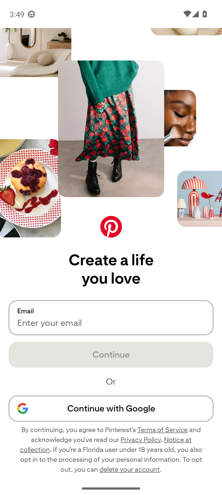

# Pinterest Android app map for 14.38.0

The [signed-in factory audit](pinterest-14.38.0-audit.md) extends this map with native settings, advertising delivery, tracking boundaries, all 23 patch mappings and specific patch opportunities. Privacy filtering covers selected known paths; ordinary account and content requests still reach Pinterest. See the [privacy reference](pinterest-14.38.0-privacy.md) for exact coverage.

Last checked: 2026-10-09. This guide maps the original Pinterest package used as HushPinterest's newest patch target. It records static APK facts and the reverse-engineering anchors that are useful when patches move to a new release.

## Evidence and limits

The factory reference is the universal APK named `pinterest-14.38.0-14388010.apk` in the local `fixtures/` directory. The fixture is intentionally ignored by Git because it is Pinterest's binary. Verify the exact file before analyzing or installing it.

| Fact | Value |
|---|---|
| Package | `com.pinterest` |
| Version | 14.38.0, version code 14388010 |
| Minimum Android version | Android 10, API 29 |
| Target and compile SDK | API 36 |
| Required graphics feature | OpenGL ES 3.0 |
| APK size | 133,740,741 bytes |
| SHA-256 | `af6b383adb445cebee1ca43f14ac409f91475c1d62e0e11ef52ef52e29fb0553` |
| Signing certificate SHA-256 | `341d6881b1ecf38361fbf8c8fbae0aa516b45375c39ef5e78b161869acc1bcfa` |
| Signature and source stamp | APK Signature Scheme v3, plus a Google source stamp |

The signing certificate identifies the original Pinterest build. A patched copy is signed with a different key, so it is not a factory reference and cannot replace the original install in place. Never remove an existing install or its data just to compare signatures.

HushPinterest declares this build only, so a patched Pinterest needs Android 10 (API 29), the same floor as the original APK.

This guide's package, manifest, DEX, resource, and signature facts come from the retained original APK. A first-run launch survey was captured on a clean Android 13 emulator with the original APK. The initial survey reached Pinterest's unauthenticated entry screen. A later [signed-in audit](pinterest-14.38.0-audit.md) adds factory Home, pin, search, sharing, creation-entry and settings observations, detailed ad/tracking traces, and a complete current patch reference.

## Clean-install launch survey

The original 14.38.0 APK installed and launched on a clean API 33 emulator. The device was in portrait orientation at 1080 by 2400 pixels, with the English (United States) locale and a validated Wi-Fi default network. No Google or Pinterest account was used. Pinterest opened `com.pinterest.identity.UnauthActivity`; no Android runtime permission prompt appeared before this screen.

The first-run page shows a collage of lifestyle images, the Pinterest mark, and the heading **Create a life you love**. Its account controls are:

| Control | Captured state |
|---|---|
| Email field | Empty. Accessibility text is `Email. Enter your email`. |
| Continue | Disabled while the email field is empty. |
| Continue with Google | Enabled. Not opened during this survey. |
| Legal copy | Terms of Service, Privacy Policy, and Notice at collection. It also includes a Florida notice for users under 18, with an account-deletion opt-out statement. |

The screen is scrollable. Android's UI hierarchy exposed the email field and both buttons, including the disabled state of Continue. The moving welcome artwork prevented a hierarchy dump until system animation scales were temporarily set to zero; the original scale values were restored immediately after the capture. No account flow was submitted, and no permission was granted. The screenshot below records the first-run appearance.



This capture records the initial logged-out state. The [follow-up audit](pinterest-14.38.0-audit.md) records the later signed-in state. Credential entry was performed manually and wasn't inspected. Account creation, password recovery, production push delivery and all account/region experiments are not covered by the first-run screenshot.

## Package layout

The inspected APK contains 7,581 ZIP entries and 278,957,871 uncompressed bytes. Its principal contents are:

| Area | Count or size | Notes |
|---|---:|---|
| DEX files | 8 files, 60,061,368 bytes | `classes.dex` through `classes8.dex`; `classes2.dex` is only 868 bytes |
| Defined DEX classes | 73,720 | Counted from `apkanalyzer dex packages --defined-only` |
| Defined methods | 286,020 | Same DEX package tree |
| Defined fields | 291,791 | Same DEX package tree |
| Native libraries | 64 files, 137,722,368 bytes | 16 each for `arm64-v8a`, `armeabi-v7a`, `x86`, and `x86_64` |
| Compiled XML entries | 6,430 | Includes layouts and other resource XML |
| Layout resources | 1,522 | Mostly resource-driven Android UI |
| Drawable resources | 3,616 in the base drawable directory | Additional density and night-mode variants are separate |

Useful namespaces from the DEX class tree include `com.pinterest.feature` (4,995 classes), `com.pinterest.api` (3,368), `com.google.android` (1,772), `com.pinterest.collage` (942), and `com.pinterest.identity` (425). The APK also contains Pinterest's Gestalt UI package, AndroidX RecyclerView and Compose runtime code, Rive, AppsFlyer, Bugsnag, Google libraries, Chromium Cronet, and AWS SDK classes. Presence in the APK does not prove that a particular screen or service is active in every account state.

Many Pinterest implementation packages and method names are obfuscated. Some app-facing classes, model fields, resource names, design-system classes, and diagnostic `toString()` labels remain readable. Expect short class and member names to change between Pinterest builds.

## Startup and Android components

The manifest names `com.pinterest.ReleaseHiltApplication` as the application class. The launcher component is an exported activity alias named `com.pinterest.activity.PinterestActivity`; it targets the same-named splash/router activity. The router has `noHistory` behavior. The main home task activity is `com.pinterest.activityLibrary.activity.task.activity.MainActivity`.

The manifest declares 34 activities, one activity alias, 16 services, 16 receivers, and three content providers. Important exported entry points are:

| Component | Purpose seen in the manifest |
|---|---|
| `com.pinterest.activity.PinterestActivity` activity alias | Launcher entry to the splash/router activity |
| `com.pinterest.activityLibrary.activity.task.activity.MainActivity` | Main home task activity |
| `com.pinterest.activity.webhook.WebhookActivity` | Pinterest web links and custom Pinterest schemes |
| `com.pinterest.activity.create.PinItActivity` | External pin/create handoff |
| `com.pinterest.library.navigation.activity.NavActivity` | Internal navigation/demo deep links |
| `com.pinterest.account.CredentialsContentProvider` | Exported provider protected by Pinterest's signature-level credentials permission |
| `com.pinterest.accountTransfer.AccountTransferBroadcastReceiver` | Account transfer broadcast entry point |
| `com.pinterest.engage.GoogleEngageBroadcastReceiver` | Google Engage recommendation receiver |

Other manifest entries include the internal authentication service, Firebase Messaging, WorkManager jobs, widgets, profile installation, AndroidX Startup, Google sign-in revocation plumbing, a LINE authentication callback, and an internal file provider. Do not treat an SDK receiver or callback activity as proof that its corresponding sign-in or delivery path still appears in the current UI.

### Links and app routing

`WebhookActivity` handles verified `http` and `https` links across Pinterest domains and `pin.it`, plus the `pinterest` and `pinit` schemes. The verified web filter includes the base Pinterest domains, regional Pinterest domains, and `pin.it`. Two additional `NavActivity` filters are for internal demo routes. The LINE callback uses `lineauth`.

The `autoVerify` declaration is part of the original APK's manifest. Re-signing changes the certificate used for Android App Links verification, so a patched build may need Pinterest domains enabled under Android's Open by default settings. Do not remove or broaden native auth and account routes when changing generic link handling.

### Manifest and permissions

The original manifest sets `allowBackup=false`, is not debuggable, and references a network security configuration. It does not declare `usesCleartextTraffic` directly. Its decoded network configuration permits cleartext by default, forbids it for seven named domain families, and trusts user certificates only in debug overrides. See the [privacy reference](pinterest-14.38.0-privacy.md) for the exact domains and limits. This policy does not prove any cleartext request occurred.

The manifest declares 32 permissions. They cover network access, media and older shared storage, camera, coarse and fine location, contacts and account lookup, notifications, foreground work, boot recovery, vibration, wake locks, billing, Firebase delivery, Google advertising ID and Android Privacy Sandbox ad services. It also declares Samsung badge and Maps Agent permissions and Pinterest's own credentials permission. Check the manifest in the exact target APK before changing these declarations. Permission presence alone does not establish when Android prompts or whether Pinterest exercises the permission.

The exported credentials provider is protected by `com.pinterest.account.Credentials`, which Pinterest defines with signature protection. WorkManager's exported job service is protected by `BIND_JOB_SERVICE`. The Google and profile-install receivers also carry their own platform or service permissions.

## App surfaces and patch anchors

The bottom-navigation enum declares five tab types: Create, Home, Notifications, Profile, and Search. The signed-in factory account actually displayed three bottom buttons, Home, Search and Saved, with Create and Inbox in the Home header. Enum membership is not a screenshot of every live navigation configuration. Its 14.38.0 enum is `de0/a`. The app contains a custom Pinterest Gestalt component library, with RecyclerView-based feed and pin surfaces. Use the UI class and resource shape that owns the behavior being changed. A broadly named activity or container often hosts several unrelated modules.

| Surface | 14.38.0 evidence | Why it is useful |
|---|---|---|
| Feed item lists | `e52.d`, `gu1.l0`, and `bm2.c`; fingerprinted by the `toString()` text `", _items count:"`, `"PagedResponse(bookmark="`, and `"ModelListWithBookmark(models="` | Shared list ingress for feed filtering. The first holder gained a second list constructor in this build. |
| Pin model | `com.pinterest.api.model.pe` | Read serialized model fields through their JSON annotation names. Obfuscated Java field letters are build-specific. |
| AI disclosures | Pin field `ai_disclosures`, experiment `scm_gen_ai_label`; enum `ul2.c` uses `1` for AI-modified and `2` for synthetic performer | The labels are typed model data, not a reliable text match. |
| Image model | `vu2/d1` | `toString()` identifies the image holder; its size choice is a better semantic anchor than an obfuscated field name. |
| Pin closeup media | `d12/a.a(pe)`, `n42/a`, and size enum `m42/a` | The closeup asks Pinterest for selected image sizes. The API field used here is `orig`; `originals` belongs to another Pinterest request and caused feed failures when substituted. |
| Bottom navigation | `de0/a`; readable `BottomNavTabModel(type=` text | Find the tab model and its view bindings before changing which buttons appear. |
| Pin menu | Pinterest's context-menu presenter, layout factory, resource keys, and icon enum | Download and menu filters should extend or suppress the native menu row. The generic menu initializer also serves non-pin objects. |
| Comments | Two dedicated pin-closeup comments module resource pairs | Anchor to the comments modules, not the whole closeup container or video module. |
| Analytics requests | Retrofit-style service method annotations for named telemetry paths | The analytics patch finds annotated endpoints and selected launch tasks. Keep auth, feed, messaging, and media requests out of that set. |
| Profile and About links | Stable `website_link` and `BUSINESS_PROFILE_WEBSITE_LINK` resource names, then a bound `websiteUrlView` listener | Confirms the outbound URL is the website button, not a sign-in or account route. |

The image request field names are endpoint-specific. A request field accepted by one Pinterest API is not automatically valid for another. The 14.38.0 feed failed when `originals` was added to its pin request; `orig` is the accepted field for that path. Keep readers tolerant when useful, but verify each request against the real endpoint before changing its requested fields.

## HushPinterest patch architecture

HushPinterest injects a Morphe extension into Pinterest rather than building a replacement Pinterest app. The patch sources are Kotlin under `patches/src/main/kotlin/app/morphe/patches/pinterest`. Injected runtime code is Java under `extensions/pinterest/src/main/java/app/hushpinterest/extension/pinterest`; shared settings, diagnostics, UI, and localization helpers live in `extensions/shared`.

The built extension payloads are named `extensions/pinterest.mpe` and `extensions/shared.mpe`. `PinterestExtensionPatch` merges them and inserts `setContext()` into the application class's `onCreate()` implementation, or the first APK superclass that declares it. This gives settings and feature hooks a context before they read preferences. Do not move initialization later without tracing every startup hook.

`SettingsPatch` adds the `app.hushpinterest.extension.pinterest.settings.OpenSettings` activity alias for Android's `APPLICATION_PREFERENCES` action. It points to Pinterest's launcher activity, which then opens the injected settings screen. The alias also raises the patched package's minimum API to 28 when the target APK has a lower floor. This settings entry is added by HushPinterest and is not part of factory Pinterest.

Most features have two parts:

1. A bytecode or resource patch finds a host method or manifest/resource node, verifies its shape and uniqueness, then adds a small bridge or manifest change.
2. Injected extension code reads a saved setting and performs the runtime behavior. `PatchFamily`, `Capability`, `SettingsStatus`, and each patch's `enableStatus` or `enableCapability` call keep the settings UI and diagnostics aligned with what was actually inserted.

Manifest-only changes have no runtime switch and remain in the installed APK until it is patched again. Runtime switches and Pause cannot undo manifest edits. `SettingsBackup.ALLOWLIST` is the authority for which settings can be imported or exported; account data, credentials, logs, and signing keys are not settings-backup content.

The 23 source catalog entries are grouped here by the code that owns them:

| Patch area | Patch names | Main source |
|---|---|---|
| Feed and ads | Hide ads; Hide AI-labeled pins; Hide shopping and product pins | `patches/.../ads/`; runtime filters in `extensions/pinterest/.../ads/` |
| Privacy | Disable analytics; Strip link tracking; Hide advertising ID; Remove ad tracking permissions; Spoof signature for Google sign-in | `patches/.../privacy/`; runtime hooks in `extensions/pinterest/.../privacy/` |
| Pin actions | Download pins; Open links in your browser; System share sheet | `patches/.../actions/`; runtime transfer and routing under `extensions/pinterest/.../actions/` |
| Interface | Filter pin menu; Hide comments; Hide header buttons; Hide navigation buttons; Hide save toasts; Hide search history; Hide topic suggestions; No screenshot share menu; Original-quality images; Quiet email reminders; Disable update nag | `patches/.../ui/`; runtime UI controls under `extensions/pinterest/.../ui/` |
| Settings wiring | HushPinterest settings | `patches/.../misc/settings/` and `extensions/pinterest/.../settings/` |

The inventory is the current `patches-list.json` source catalog. The README is the user-facing feature list. Read the specific patch source and fixture test before relying on a table summary; those files are the implementation authority.

## How to inspect a new Pinterest build

Use an original Pinterest APK as the baseline. Keep one untouched copy and record its version, code, signing certificate, and SHA-256 before patching. Store the APK in the local ignored `fixtures/` directory, never in Git.

From the repository root, Android SDK command-line tools can answer the first questions:

```powershell
$apk = '.\fixtures\pinterest-14.38.0-14388010.apk'
apkanalyzer manifest print $apk
apkanalyzer manifest version-name $apk
apkanalyzer manifest version-code $apk
apkanalyzer dex list $apk
apkanalyzer dex packages --defined-only $apk
apkanalyzer dex code --class 'com.pinterest.activityLibrary.activity.task.activity.MainActivity' $apk
apkanalyzer resources packages $apk
apkanalyzer resources names --type layout --config default $apk
apksigner verify --print-certs $apk
```

For focused patch work, search strings and model annotations first, then inspect the owning method and its callers. Prefer, in order, stable manifest names, resource names, JSON annotation names, endpoint annotations, readable `toString()` labels, and multi-part instruction shapes. Confirm one unique target in each supported APK. Avoid a lone obfuscated class, field, register, or instruction offset when a semantic fingerprint is available.

The repository's target and acceptance code is split across:

| Purpose | Files |
|---|---|
| Target version, signer, SDK floor | `patches/.../shared/compat/AppCompatibilities.kt` |
| Target bytecode edits | `patches/.../pinterest/**` |
| Runtime behavior and settings | `extensions/pinterest/**`, `extensions/shared/**` |
| Fixture inventory and identities | `patches/src/test/kotlin/app/morphe/Fixtures.kt`, `FixtureDex.kt`, `obfuscated-identities.txt` |
| Patch-specific fixtures | `patches/src/test/kotlin/app/morphe/patches/pinterest/**` |
| Manifest delta review | `scripts/manifest-delta-allowlist.txt`, `scripts/release-receipt.ps1`, `scripts/test-manifest-contracts.ps1`, `scripts/test-script-contracts.ps1` |
| Whole-catalog fixture verification | `scripts/verify-all-patches.ps1` |
| Device installation safeguards | `scripts/patch-for-device.ps1`, `scripts/device-install.ps1`, `scripts/device-lease.ps1` |

When Pinterest changes version, add and verify the new original fixture before retargeting. Re-run each fingerprint against the new fixture and compare its match with the build it replaces. Update exact fixture facts and manifest expectations when the upstream manifest changes. Do not weaken a unique-match check to make a version pass. Use the repository build scripts and the [source build instructions](../README.md#building-from-source) for the current toolchain.

### Repeatable verification commands

```powershell
./gradlew :patches:test :extensions:pinterest:testDebugUnitTest :extensions:pinterest:lintDebug
$env:HUSHPINTEREST_FIXTURE_DIR = "$PWD\fixtures"
./gradlew :patches:fixtureTest
./scripts/verify-all-patches.ps1 `
    -Apk .\fixtures\pinterest-14.38.0-14388010.apk `
    -DesktopJar $env:HUSHPINTEREST_DESKTOP_JAR `
    -WorkDir $env:TEMP
```

The desktop verifier requires the pinned Morphe Desktop JAR. These commands describe the established checks; a live launch is still required to learn account-dependent or server-driven behavior. For a screen survey, use a clean emulator profile with the official APK and record screenshots, Android version, locale, network state, and whether the app was signed in. Never treat a re-signed patched install as factory evidence.
