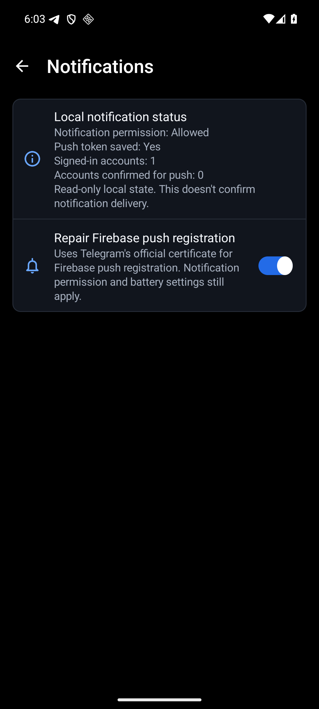
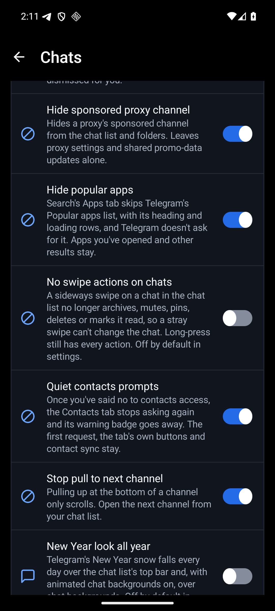

<p align="center">
  
  <a href="LICENSE"></a>
  
  
  
</p>

<p align="center">
  <a href="https://ko-fi.com/X8K126YVER">
    
  </a>
</p>

<p align="center">
  <sub><em>If HushTelegram makes Telegram better for you, a coffee helps me keep testing patches and maintaining them as Telegram changes.</em></sub>
</p>

#  HushTelegram

HushTelegram is a Morphe patch bundle for Android that takes the sponsored messages out of Telegram and keeps a few things on your phone that Telegram would otherwise send home.

The latest release is [v0.0.11](https://github.com/SysAdminDoc/HushTelegram/releases/tag/v0.0.11), with 55 patches. They're built for Telegram 12.10.6 and the official beta 12.10.7, and on a signed-in phone Hide ads took a live search ad off the screen. See [the before and after](#hide-ads-before-and-after).

v0.0.11 follows telegram.org's beta build 71239. Hide contacts on Telegram, Hide greeting stickers, Use system font, AMOLED black, Hide translate bar, Exact numbers, Reveal spoilers, Hide keyboard on scroll, Keep videos muted on volume keys, Swipe back on profiles, Hide phone number, Message times with seconds, Allow chat blur on slower phones, Play voice messages one at a time, Turn off haptic feedback, Turn off reaction effects, Hide folder tab counters, Hide sender names when forwarding, Voice messages in the music player, Silence people outside your contacts, Disable pull to archive, Start the camera on the rear lens, Hide gallery camera tile, Hide time on stickers, Ignore mentions in muted chats, Hide blocked users in groups, Hide Telegram Features and Invite Friends, Add Repeat to the message menu, Keep deleted messages and Ask before sending a sticker are new patches, and Disable pull to next channel gained a second switch for forum topics. Every new switch starts off. Local notification status now also shows Telegram's own answer when it registers your phone for push. Two optional patches take your own registered Telegram API credentials and Google Maps key when you patch.


[Add to Morphe](https://morphe.software/add-source?github=SysAdminDoc%2FHushTelegram) | [Download a release](https://github.com/SysAdminDoc/HushTelegram/releases/latest) | [Browse the patches](#patches)

## Why use it

- **Channels and search without sponsored posts.** Telegram never asks for them, so none are drawn, counted as seen or reported as clicked. That covers the sponsored accounts pinned above search results and the ads in its video player too.
- **Usage reports stay on your phone.** When Telegram's server requests its storage-type statistic, the patch stops that report. It also stops channel read-time reports and Premium interaction telemetry. Billing callbacks and operational reports keep their usual behavior.
- **No update offers that can't work.** telegram.org's build offers its own updates, and those can't install over a patched app. That offer is switched off, so you update through Morphe Manager instead.
- **Controls that recover.** Every feature has a switch, and there's a pause, settings backups and privacy-filtered diagnostics for when Telegram changes.

HushTelegram is the Telegram member of a small family of patch bundles. Its settings screen, diagnostics and release checks come from its Threads sibling, [HushThreads](https://github.com/SysAdminDoc/HushThreads). The Telegram patches are written here. See [Where the patches come from](#where-the-patches-come-from).

This project has no connection to Telegram or to the Morphe project. Neither endorses it, and neither wrote it.

## Which Telegram

HushTelegram patches the Telegram you download from [telegram.org](https://telegram.org/android), package `org.telegram.messenger.web`, version 12.10.6 (version code 71129). That APK carries every phone architecture, and it's the build each patch is checked against. Morphe Manager warns about other builds.

Since v0.0.8 it also targets the [official beta](https://telegram.org/dl/android/apk-public-beta), package `org.telegram.messenger.beta`, version 12.10.7 (version code 71239). Its vendor signer and native patch targets are checked on their own.

The other Telegram, `org.telegram.messenger`, shares nearly all its code with this one. Support for it is planned once it has its own checked build.

The patched app requires Android 9 or newer. A build that loses one ad or usage-report hook names the missing coverage in its settings and diagnostic report.

Changed Premium report builders are refused before the patch changes any code.

## Install

1. Install [Morphe Manager](https://github.com/MorpheApp/morphe-manager) 1.34.0 or newer.
2. Add HushTelegram as a patch source: https://morphe.software/add-source?github=SysAdminDoc%2FHushTelegram
3. Get Telegram 12.10.6 from [telegram.org/android](https://telegram.org/android) by tapping Download Telegram. Skip the Google Play link, which installs a different package. The download saves as plain `Telegram.apk`, with no version in its name.
4. In Morphe Manager, pick that file, keep the default patch selection or change it, and patch.

Android accepts an update only when it carries the installed app's signing key. Use your retained Morphe key to update an existing patched Telegram in place. Its data and permission choices stay intact.

Moving from stock Telegram needs a deliberate migration because the signing keys differ. Keep a signed-in fallback on another device and save any important local files before removing stock Telegram yourself. Removing it permanently deletes this phone's local secret chats. Cloud chats return after a successful sign-in, but secret chats can't be recovered that way. Verify that you can sign in before giving up your only working installation.

## Keep your signing key

Morphe Manager signs the patched Telegram with a key it makes on your phone. Android installs an update over your patched Telegram only when the update carries that same key.

- **Back it up right after your first patch.** In Morphe Manager, open Settings, then System, then Import & export, then Signing key, and tap Export. Keep the `Morphe.keystore` file somewhere private, because anyone who has it can sign an APK your phone will accept as an update.
- **On a new phone, import it before you patch anything.** Without your exported copy, nothing you patched earlier can be updated in place.

The developer installation script requires the exact device serial, expected model (and AVD profile for an emulator), shared lease directory, owned lease token and chat identity. Supply `-LeaseDirectory`, `-LeaseToken` and `-ChatIdentity`, or their `HUSHTELEGRAM_DEVICE_LEASE_DIR`, `HUSHTELEGRAM_DEVICE_LEASE_TOKEN` and `HUSHTELEGRAM_DEVICE_CHAT` environment variables. It checks ownership before every device command and verifies the installed signer and version before updating. It never uninstalls the app, grants permissions or permits a downgrade. The old `-Replace` option is refused. A first install also verifies an unambiguous package absence before changing the device.

## Patches

v0.0.11 has 55 patches, with 53 selected by default. Hide contacts on Telegram, Hide greeting stickers, Use system font, AMOLED black, Hide translate bar, Exact numbers, Reveal spoilers, Hide keyboard on scroll, Keep videos muted on volume keys, Swipe back on profiles, Hide phone number, Message times with seconds, Allow chat blur on slower phones, Play voice messages one at a time, Turn off haptic feedback, Turn off reaction effects, Hide folder tab counters, Hide sender names when forwarding, Voice messages in the music player, Silence people outside your contacts, Disable pull to archive, Start the camera on the rear lens, Hide gallery camera tile, Hide time on stickers, Ignore mentions in muted chats, Hide blocked users in groups, Hide Telegram Features and Invite Friends, Add Repeat to the message menu, Keep deleted messages and Ask before sending a sticker are new in v0.0.11, and so is the forum topic switch in Disable pull to next channel. Several patches keep their switch off until you turn it on in settings, like tracking cleaning and draft link previews. The two credential patches need your own values and aren't selected by default.

| Patch | What it does |
|---|---|
| `Disable analytics` | Stops Telegram sending its storage-type statistic and how long you spent on each channel post to its server. Also stops reports about Premium screen views, feature taps, accepts and purchase failures. Messages and calls work as before. |
| `Disable update checks` | Stops telegram.org's Telegram offering its own updates, which can't install over a patched build. Patch the new version in Morphe Manager instead. |
| `Disable call debug upload` | Stops automatic call debug reports and log-file uploads requested by Telegram's server. |
| `Disable draft link previews` | Adds a switch, off by default, that stops Telegram fetching link previews for messages you haven't sent yet, in chats, the share sheet, polls, story links and bot shares. Sent messages still get their preview. |
| `Gallery camera on tap` | Adds a switch, off by default, that keeps the attachment gallery from starting the camera or asking for camera access when it opens. Tapping the camera tile starts it. |
| `Hide ads` | Hides the sponsored messages in channels, the sponsored accounts in search and the ads in Telegram's video player. Telegram never asks for them, so none are counted as seen. |
| `HushTelegram settings` | Adds a HushTelegram row to Telegram's Settings. You can also long-press Telegram's launcher icon, or open Additional settings in the app on Telegram's App info page, to turn features on or off, pause HushTelegram, save your switches to a file or load them, and export diagnostics. The licenses are there too. |
| `Hide Stories` | Hides the chat-list story bar, avatar story rings and Post Story button, and stops fetching the story list. Profile stories and archives remain available. |
| `Hide recommendations` | Hides similar channels and bots, including cached recommendations. Telegram doesn't ask for new recommendations while the switch is on. |
| `Hide Premium, gifts and Stars` | Hides Premium, Stars, My Grams, Business and Send a Gift in Settings, profile Gifts tabs and the channel Gift button. Purchases and account controls keep their usual behavior. |
| `Hide promotional banners` | Hides Premium, birthday and low Stars balance banners in the chat list. Account security notices and other suggestions remain. Nothing is dismissed for you. |
| `Hide sponsored proxy channel` | Hides a proxy's sponsored channel from the chat list and folders. Leaves proxy settings and shared promo-data updates alone. |
| `Hide popular apps` | Hides the Popular apps list in search's Apps tab and stops Telegram from asking its server for it. Apps you've opened and other search results stay. |
| `Hide contacts on Telegram` | Adds a switch, off by default, that hides the Your contacts on Telegram list under a short chat list, with its heading and loading rows. Chats, folders, contact sync and search keep their usual behavior. |
| `Hide greeting stickers` | Adds a switch, off by default, that hides the sticker an empty private chat offers to send as a greeting. The empty chat's text, business introductions, Premium and paid-message notices, the sticker picker and sending keep their usual behavior. |
| `Disable chat swipe actions` | Adds a switch, off by default, that stops a sideways swipe on a chat in the chat list from archiving, muting, pinning, deleting or marking it read. A swipe set to change folders still does. Long-press keeps every action. |
| `Disable pull to next channel` | Adds a switch, on by default, that stops pulling past the bottom of a channel from opening the next channel, and a second one, off by default, that does the same for the next forum topic. Scrolling and opening channels or topics directly still work. |
| `Use normal paste` | Adds a switch, off by default, that pastes text with Android's plain-text action. Whitespace and URLs stay intact without Telegram's HTML, table or monospace conversion. Other clipboard actions stay available. |
| `Show user and chat IDs` | Adds a switch, off by default, that shows a copyable local user or chat ID in the inspected profile's menu, and a second one, off by default, that adds the data center holding the profile's photo. Neither exposes access hashes or asks Telegram's server for anything. |
| `Disable double-tap reactions` | Adds a switch, off by default, that stops reactions from a double tap in chats and the reaction-settings preview. Scrolling, taps, selection and explicit reaction menus keep their usual behavior. |
| `Repair Firebase push registration` | Restores Telegram's official certificate header in Firebase Installations requests on re-signed builds. Other signature checks keep their usual behavior. |
| `Use registered Telegram API credentials` | Uses the API ID and hash registered for your application at my.telegram.org. Supply both patch options. Leaving both unset keeps the original credentials. |
| `Use registered Maps API key` | Uses your Google Maps Android SDK key, authorized for Telegram's package and the installed signer. Leaving the option unset keeps the original key. |
| `Quiet contacts nag` | Keeps the Contacts tab from asking for contacts access again, and clears its warning badge, once you've said no. The first request, the tab's own buttons and contact sync stay as they are. |
| `Holiday look all year` | Adds a switch, off by default, that puts a Santa hat over the chat list logo and keeps Telegram's New Year snow falling all year over the chat list's top bar and chat backgrounds. Telegram's own holiday dates apply while it's off. |
| `Use system font` | Adds a switch, off by default, that draws Telegram's bold, italic and monospace text in your phone's font instead of the Roboto files built into the app. Regular text already uses the phone's font. Some number displays and Instant View pages keep Telegram's own. A change takes effect after Telegram restarts. |
| `AMOLED black` | Adds a switch, off by default, that turns the screens of Telegram's Night and Dark themes pure black and shows a patterned chat background's pattern over black. Message bubbles and pop-up menus keep the theme's colors. A change takes effect after Telegram restarts. |
| `Hide translate bar` | Adds a switch, off by default, that hides the translate bar at the top of chats in another language. Translate moves to the chat's menu, and a chat you're translating keeps its bar so you can go back to the original. |
| `Exact numbers` | Adds a switch, off by default, that shows member, subscriber, view, reply and reaction counts in full, like 12,345 instead of 12.3K. |
| `Reveal spoilers` | Adds a switch, off by default, that shows spoiler text, photos and videos without the cover. View-once media, sensitive content and login codes stay covered. |
| `Hide keyboard on scroll` | Adds a switch, off by default, that closes the keyboard when you start scrolling through a chat. |
| `Keep videos muted on volume keys` | Adds a switch, off by default, that stops the volume keys in a chat from playing the video or round video on screen with sound, so they only change the volume. |
| `Swipe back on profiles` | Adds a switch, off by default, so a swipe to the right on a profile's photos or media tabs goes back, the way it does on the rest of the profile. |
| `Hide phone number` | Adds a switch, off by default, that covers the digits of your own phone number wherever Telegram shows it, like the side menu, Settings and your profile. |
| `Message times with seconds` | Adds a switch, off by default, that shows seconds in the time on each message, like 9:41:27 PM. |
| `Allow chat blur on slower phones` | Adds a switch, off by default, that lets phones Telegram rates as slow use its blurred chat header and panels. |
| `Play voice messages one at a time` | Adds a switch, off by default, so a voice or video message stops when it ends instead of playing the next one. |
| `Turn off haptic feedback` | Adds a switch, off by default, that stops Telegram vibrating for taps, long presses, swipes and wrong entries. Calls and notifications still vibrate. |
| `Turn off reaction effects` | Adds a switch, off by default, that stops the burst and fly-in effect Telegram plays when someone reacts. The reaction still shows on the message. |
| `Hide folder tab counters` | Adds a switch, off by default, that hides the unread count on each folder tab above the chat list. |
| `Hide sender names when forwarding` | Adds a switch, off by default, that starts Telegram's Hide sender's name option on each time you forward. You can still turn it off before sending. |
| `Voice messages in the music player` | Adds a switch, off by default, so tapping the bar above a chat while a voice message plays opens Telegram's full music player with its seek bar instead of jumping to the message. View-once voice messages stay as they are. |
| `Silence people outside your contacts` | Adds a switch, off by default, so a private message from someone who isn't in your contacts shows its notification without sound or vibration. Bots, reminders and Telegram's login codes keep their sound. |
| `Disable pull to archive` | Adds a switch, off by default, so pulling down the chat list doesn't bring up a hidden archive. The chat list's menu opens it instead. |
| `Start the camera on the rear lens` | Adds a switch, off by default, that starts the attachment menu's camera on the rear lens each time, instead of the lens you used last or the front one. |
| `Hide gallery camera tile` | Adds a switch, off by default, that takes the live camera tile out of the attachment menu's photo grid, so the grid starts with your photos. |
| `Hide time on stickers` | Adds a switch, off by default, that takes the time and read checks off stickers and big animated emoji in chats. |
| `Ignore mentions in muted chats` | Adds a switch, off by default, so a mention or a reply to you in a group or channel you've muted doesn't notify. Unmuted chats notify as before. |
| `Hide blocked users in groups` | Adds a switch, off by default, that leaves messages from people you've blocked out of groups and supergroups you open. Private chats and channel posts stay as they are, and nothing is deleted. |
| `Hide Telegram Features and Invite Friends` | Adds a switch, off by default, that takes the Telegram Features row out of Settings and the Invite Friends rows out of Contacts. |
| `Add Repeat to the message menu` | Adds switches, off by default, for a message's long-press menu. Repeat sends the message again to the same chat as a new message from you. Copy photo puts a downloaded photo on the clipboard, and Message details shows the message's IDs and times, plus the file's data center and size. Quick forward lists a few recent chats to forward to in one tap. |
| `Keep deleted messages` | Adds a switch, off by default, that keeps a message on your phone when someone else deletes it, and shows a deleted label next to its time. Your own deletes, disappearing messages and protected chats work as usual, and turning it off keeps what's already saved. |
| `Ask before sending a sticker` | Adds switches, off by default, that ask before a sticker, a GIF, a voice or video message or a call goes out. Cancel drops it. |
| `Open links externally` | Opens ordinary HTTP(S) links in your browser. Telegram links, login, payment and authenticated routes keep their existing behavior. |
| `Strip link tracking` | Optional local cleaning at link-open and Share Link chooser sites. Removes only utm_source, utm_medium, utm_campaign, utm_term, utm_content, gclid and fbclid. Any unknown query key preserves the entire URL. Off by default in settings. |

### Hide ads, before and after

The same search on the same phone, first with Hide ads off, then on. Telegram pins a sponsored account above the results for a lot of searches. With the switch on it never asks for one, so there's nothing to show and nothing to count as seen.

<p></p>

## Settings

Open Telegram's Settings and tap HushTelegram settings. You can also long-press the Telegram icon on your home screen or app drawer and tap HushTelegram, or open Telegram's App info page and tap Additional settings in the app, which Samsung phones call Configure in Telegram. Those two stay available too, so there's a way in even when the Settings row isn't there.

On v0.0.8 there's no row in Telegram's Settings, so use the long-press or App info.

More settings has separate pages for Pause, Settings backup and Diagnostics. Search finds each control by its name or page. Your saved switches and backup files work as before.

<p></p>

v0.0.8 added a Notifications page and the channel-pull switch. Both are shown below.

<p></p>

## Notifications on a patched Telegram

Telegram's push notifications go through Google's Firebase. Its Android API key checks the package and certificate header, so a re-signed build can get `API_KEY_ANDROID_APP_BLOCKED` before it receives a push token. Repair Firebase push registration fixes only that header on Firebase Installations requests from the declared web and beta packages. It preserves Android's package signatures and TLS checks. Firebase starts its first request while Telegram is still starting up, so on slower phones that request now waits for HushTelegram's settings (up to 10 seconds) instead of going out with the re-signed header.

The Notifications page also shows what this phone knows about push. It says whether notifications are allowed and whether Telegram has saved a push token, then counts your signed-in accounts and how many of them Telegram has confirmed for push. It only reads what's already on the phone. It doesn't send anything, and it can't tell you whether a notification will actually arrive. The diagnostic report carries the same facts, without the token itself.

Push delivery also depends on Telegram's server holding push credentials for the app's Firebase project, which [Telegram documents separately](https://core.telegram.org/api/push-updates). A new API ID and hash don't set that up on their own. Telegram has its own fallback for this. Under Settings, Notifications and Sounds, turn on Keep-Alive Service and Background Connection to keep its connection open. That costs some battery.

The location picker uses a separate Google Maps credential, restricted to the installed package and signer. Select Use registered Maps API key and supply `apiKey` from a Google Cloud project with the Maps SDK for Android enabled. Its Android restriction must allow the selected web or beta package and your retained signing key's SHA-1. Follow [Google's setup instructions](https://developers.google.com/maps/documentation/android-sdk/get-api-key).

## Your Telegram account

Sign-in can fail with `API_ID_PUBLISHED_FLOOD`, which means Telegram rejected the API ID bundled with the app. Register your own app at [Telegram's developer portal](https://my.telegram.org/apps), then select Use registered Telegram API credentials and supply both `apiId` and `apiHash` when patching. This changes the shared app credentials used by native initialization, phone and passkey login. You can install the result as an update over your current HushTelegram build. On its first start it introduces itself to Telegram with your ID, so login codes are requested under your app instead of the bundled one. Changing from one registered API ID to another also refreshes that connection identity, while keeping saved account keys and the app version intact. Telegram still decides which login methods are available. Keep any existing signed-in installation.

Filling in the form at my.telegram.org/apps:

1. Sign in with your phone number. The code for the portal arrives as a message in Telegram, not by SMS.
2. **App title:** plain words, for example `My HushTelegram`.
3. **Short name:** 5 to 32 letters and numbers only, for example `myhushtg1`. Spaces, underscores, dashes and other symbols here are what usually cause "Incorrect app name!".
4. **Platform:** Android. URL and Description can stay empty.
5. Tap Create application, then copy `App api_id` and `App api_hash` into the patch's `apiId` and `apiHash` options.

If the page shows a bare "ERROR" instead, turn off any VPN or ad blocker and try again in a private browser window. When the patched app asks for a login code, it usually shows up as a message in Telegram on another phone or app where you're already signed in, so keep that one signed in until the patched app finishes.

Credential options are compiled into the APK and recorded in the patching result report. Keep both private. These two patches have no runtime switch, and Pause doesn't change their credentials. Updating with the retained signing key preserves the installed app's data.

For a patching bug, attach the separate public summary. `patch-for-device.ps1` writes `public-summary.json`; `verify-all-patches.ps1` writes `verify-all-public-summary-*.json`. They contain only supported package and bundle versions, catalog patch names and counts, and fixed failure codes. They omit credentials, options and private error text, including when patching fails. Keep the original result report and configured APK private. `-ShowPatchLog` prints the private CLI log locally, so don't copy that output into a report without reviewing it.

Fixture verification and new release receipts check native-library names, bytes and compression against the original APK. They also check relevant 64-bit ELF LOAD alignment and run `zipalign -c -P 16 -v 4`. Compressed native libraries remain valid. Receipt schema 4 records this evidence and the checker/tool hashes; older receipts use the schema pinned by their own commit. These packaging checks don't establish that Telegram has booted on a device with 16 KB memory pages. Native regression fixtures check their ZIP headers and bytes independently on PowerShell 7 and Windows PowerShell 5.1.

**Can Telegram tell?** Assume it can. A patched Telegram is signed with your key rather than Telegram's, and Telegram's app reports a fingerprint of that key to its servers when it connects.

**What stays the same?** Your chats, contacts and calls use Telegram's servers and native account flow. HushTelegram doesn't send, read, forward or delete messages on your behalf.

**More than one account?** HushTelegram's switches belong to the app, not to an account. Every one of them applies to all the accounts you've added, and a settings file you export or import covers them all.

**Could my account be limited?** Nobody can promise it won't be, and this project is young. If you'd rather not risk the account you care about, try HushTelegram with a second account first.

## What it won't do

Some patches other people publish for Telegram unlock Premium features, get past a channel's forward and save protection, or open content Telegram hides for age or legal reasons. HushTelegram won't ship any of those. They take away something someone else controls, and the first two take something people pay for.

## Privacy

HushTelegram doesn't collect anything and has no server. The patched app goes online on HushTelegram's behalf for one thing only: the release check, and it's off until you turn it on. Once it's on, HushTelegram asks `api.github.com` for its latest release at most once a day, when Telegram starts, and again whenever you tap Check now. That's a plain HTTPS request with `HushTelegram/<version>` as its User-Agent, and it carries no cookies and nothing about you or your phone. GitHub sees your IP address, as any site you visit does.

The About and Licenses screens link to `github.com`, `gitlab.com` and `www.gnu.org`. Those open in your browser, and only when you tap one.

Diagnostics omit named Telegram API IDs and hashes from buffered events, crash sections and exported reports. Versions, counters and unrelated hashes stay readable. Review a report before sharing it.

## Where the patches come from

| Source | What came from it |
|---|---|
| [SysAdminDoc/HushThreads](https://github.com/SysAdminDoc/HushThreads) at `b141524` | The Gradle build, the shared extension library with its settings screen, diagnostics and pause, the bytecode helpers and the checks that apply every patch to real builds before a release. Most of that came to HushThreads from [Hushfacebook](https://github.com/SysAdminDoc/Hushfacebook), and some of it from [Hushfeed](https://github.com/SysAdminDoc/hushfeed), [Andrew Liang's patches](https://github.com/andrewliang25/morphe-patches) and [FroggoMorphePatches](https://github.com/SapitoSucio/FroggoMorphePatches). |
| [Morphe](https://github.com/MorpheApp) and [ReVanced](https://gitlab.com/ReVanced/revanced-patches) | The patcher and the patch template. Everything above grew from their code. |

The Telegram patches were written for this project by reading Telegram 12.10.6 itself. Every source file says where it came from in its header, and [provenance.json](provenance.json) maps each file to the project and commit it came from, with its license. The [source ledger](sources/telegram-sources.json) records the other Telegram references, their reviewed commits and adoption decisions. A listed feature is a research candidate, not an approved addition or a dependency. The ledger also records four confirmed directory listings. The published bundle is v0.0.8. Changes under Unreleased in the changelog are newer source work.

## Building from source

You need JDK 21 and the Android SDK. The Morphe patcher comes from GitHub Packages, so you also need a GitHub token with `read:packages`.

```bash
export GITHUB_ACTOR=<your GitHub user>
export GITHUB_TOKEN=<a token with read:packages>
./gradlew :patches:generatePatchesList
./gradlew :patches:buildAndroid
```

The bundle lands in `patches/build/release/patches-<version>.mpp`, beside its SHA-256 and a CycloneDX SBOM of every library that goes into it. Run `generatePatchesList` before `buildAndroid`, or the bundle loses its Android payload. Independent push checks use separate snapshots of the commits being pushed and separate outputs, with every required check retained. Fixture tests retain bounded content-keyed query facts and isolate mutable copies.

Tests: `./gradlew :patches:test :extensions:telegram:test`. Set `HUSHTELEGRAM_FIXTURE_DIR` to the directory containing every APK named in `AppCompatibilities.kt` before pushing a patch change. The push check rejects missing fixtures.

Text input fingerprints ignore LF/CRLF differences, so validated tests can be reused in a temporary checkout. Source changes still invalidate the results, and APK fixture bytes remain exact. `pwsh -NoProfile -File scripts/test-gradle-test-cache.ps1` exercises both test tasks in isolated copies, checks cache reuse and changes source and binary inputs to verify invalidation.

`pwsh -NoProfile -File scripts/verify-patch-selections.ps1 -Apk <declared APK> -WorkDir <private folder>` patches one declared Telegram build 74 ways. That covers the defaults, the full catalog, settings alone, each runtime patch by itself, the link and preview/camera pairs, and the two credential patches unset, configured and fed bad values. Every build is checked for its dependency closure, minimum Android version, preserved resources and native libraries, and the switches its settings screen offers. Configured credentials must change exactly their two literals and the native version marker that refreshes the connection identity. The Maps option changes only its metadata value.

Malformed options and rejected credential values must stop the build without echoing them. Ignored optional values must preserve stock behavior. The console prints only case names and fixed result codes. Keep the work folder private, since it holds the raw patcher reports. Combine both runs' `matrix-private.json` arrays into one file and set `HUSHTELEGRAM_SELECTION_FACTS` to it when running `CompiledSelectionUiTest`. The test task tracks that file's contents, so source-only results can't satisfy the compiled UI check.

Build dependencies have a separate advisory check. Run `./gradlew :patches:buildDependencyReport`, then `pwsh -NoProfile -File scripts/build-advisories.ps1`. The report is in `patches/build/dependency-reports/`; the shipped SBOM continues to describe only libraries carried by the bundle. High, critical or unrated findings and failed queries stop a push. Lower-severity findings are reported.

`pwsh -NoProfile -File scripts/test-bouncycastle-test-graph.ps1` checks the real dependency review in both task orders and verifies that unreviewed unit-test requests still fail. `pwsh -NoProfile -File scripts/test-host-advisory-alignment.ps1` checks the settings and Android result-listener graphs while proving unrelated runtime requests keep their original versions.

## License

[GPL-3.0](LICENSE), with the Morphe section 7 notices carried in [NOTICE](NOTICE). Telegram is a trademark of Telegram FZ-LLC.
