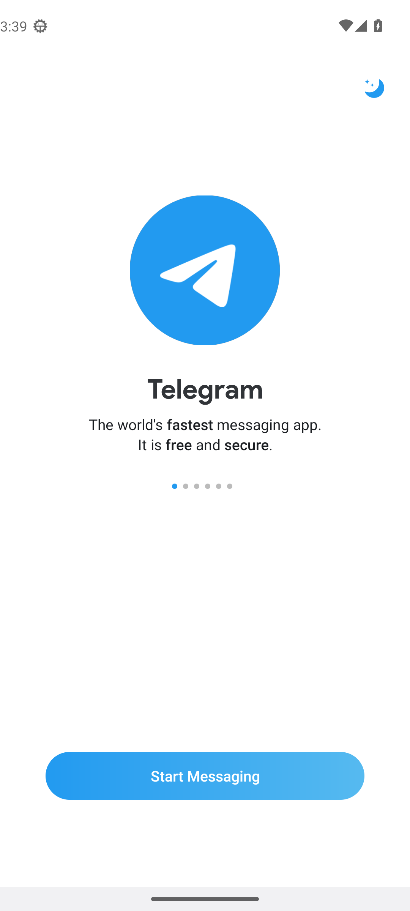
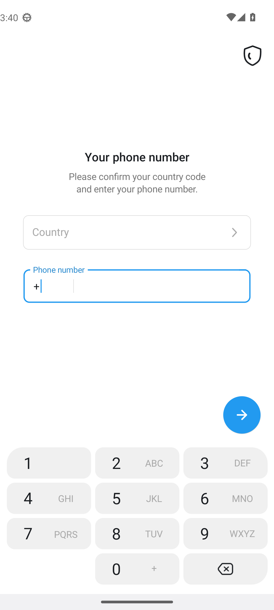

# Telegram app reference for patch work

This guide describes the factory Telegram APK that HushTelegram patches. It gives patch work a shared starting point for app identity, first-run screens, manifest entry points, bytecode anchors and target updates.

For a deeper map of ad delivery, telemetry, common friction and patch opportunities, see the [Telegram 12.10.6 app audit](telegram-audit-12.10.6.md).

The [signed-in runtime audit](telegram-runtime-audit-12.10.7.md) adds a physical S22 walkthrough of official beta 12.10.7, live search-ad evidence, network captures and background measurements.

The reference uses Telegram 12.10.6, version code 71129, from telegram.org's single APK. Its SHA-256 is `7827ea506d297644b1d350266bdfbd8d5d38a7869fa3fc1a0fbcb1ebc81f45ad`. The APK stays in the local, gitignored `fixtures/` folder.

## Factory install inspected

The APK was installed on a clean Android 13 API 33 Pixel 7 emulator profile. Its package, version and installed APK hash matched the fixture. No Morphe bundle or HushTelegram extension was applied.

The first screen is a Telegram welcome carousel. It shows six page dots, the title “Telegram,” the copy “The world's fastest messaging app. It is free and secure,” a “Start Messaging” button and a night-theme switch.

Start Messaging opens Telegram's call-verification explanation. Android then displays “Allow Telegram to make and manage phone calls?” Denying that request leads to the “Your phone number” page. The phone number field is focused, shows a plus prefix and uses Telegram's custom keypad. The Country field remains unselected.

No phone number or login code was entered during this emulator flow. `READ_PHONE_NUMBERS` and `READ_PHONE_STATE` remained ungranted. The later [S22 walkthrough](telegram-runtime-audit-12.10.7.md) covers signed-in screens on the official beta. Android's permission dialog can vary by system version and prior permission history.

## APK identity

| Field | Factory web APK |
|---|---|
| App label | Telegram |
| Package | `org.telegram.messenger.web` |
| Version | 12.10.6, code 71129 |
| Vendor signer | CN=Nikolay Kudashov, OU=VK, O=VK |
| Signer SHA-256 | `49c1522548ebacd46ce322b6fd47f6092bb745d0f88082145caf35e14dcc38e1` |
| Manifest SDK | minimum 21, target 36, compiled with SDK 36 |
| Native ABIs | `arm64-v8a`, `armeabi-v7a`, `x86`, `x86_64` |

HushTelegram also supports Telegram Beta at `org.telegram.messenger.beta`, version 12.10.7, code 71239. It has the same vendor signer and its own fixture checks. The Telegram APK itself declares Android 5 as its minimum. HushTelegram's extension raises the patched app floor to Android 9, API 28.

The current compatibility list covers the telegram.org web APK and its beta APK. It does not declare the Play Store package `org.telegram.messenger` as a target.

## App entry points and component families

The manifest names `org.telegram.messenger.ApplicationLoaderImpl` as the Application class and `org.telegram.ui.LaunchActivity` as the main activity. `LaunchActivity` also receives sharing, deep-link and sticker-pack intents. These manifest component names are reliable anchors because Android needs them to remain present in the APK.

| Area | Manifest components |
|---|---|
| Push and app startup | `GcmPushListenerService`, `AppStartReceiver`, `KeepAliveJob` |
| Account and contact sync | `AuthenticatorService`, `ContactsSyncAdapterService`, `ImportingService` |
| Notifications | `NotificationsService`, `NotificationRepeat`, notification and reply receivers |
| Calls and location | `VoIPService`, `TelegramConnectionService`, `LocationSharingService`, `CallReceiver` |
| Media | `MusicPlayerService`, `MusicBrowserService`, `VideoEncodingService`, `StoryUploadingService` |
| Home screen | `ChatsWidgetProvider`, `ContactsWidgetProvider` and their services |

Most activity screens live under `org.telegram.ui`. Reusable widgets and views sit under `org.telegram.ui.Components`. The application, accounts, messaging and network code mostly lives under `org.telegram.messenger`. Telegram's generated API request and response classes are under `org.telegram.tgnet.TLRPC`.

## Bytecode anchors that survive updates

Telegram runs R8 over much of the UI. Many internal `org.telegram.ui` class and method names change on each build. Most `org.telegram.messenger` and `org.telegram.tgnet.TLRPC` names stay readable, while generated lambda suffixes can move. Manifest components and stable resource names also remain useful.

Use a Telegram request class, a kept method or field, a stable resource name and nearby bytecode shape to find a patch point. A raw obfuscated UI name or a lambda number is weak evidence by itself. The table gives examples already used by HushTelegram.

| Feature area | Stable evidence in the APK | Current implementation and fixture check |
|---|---|---|
| Sponsored messages in channels and video | `TLRPC$TL_messages_getSponsoredMessages`, `MessagesController.getSponsoredMessages(long)`, `VideoAds.load()` | [HideAdsPatch.kt](../patches/src/main/kotlin/app/morphe/patches/telegram/ads/HideAdsPatch.kt), [HideAdsFixtureTest.kt](../patches/src/test/kotlin/app/morphe/patches/telegram/ads/HideAdsFixtureTest.kt) |
| Sponsored content in search | `TLRPC$TL_contacts_getSponsoredPeers`, the `ConnectionsManager.sendRequest` call and the nearby branch shape | [HideAdsPatch.kt](../patches/src/main/kotlin/app/morphe/patches/telegram/ads/HideAdsPatch.kt), [HideAdsFixtureTest.kt](../patches/src/test/kotlin/app/morphe/patches/telegram/ads/HideAdsFixtureTest.kt) |
| Usage reports | `TL_help_saveAppLog`, `TL_messages_reportReadMetrics`, `TL_inputAppEvent` and `ConnectionsManager.sendRequest`; on the beta, `ApplicationLoaderImpl.startAppCenterInternal`/`appCenterLogInternal` and the `firebase_crashlytics_collection_enabled` and `firebase_sessions_enabled` strings | [FirebaseReporters.kt](../patches/src/main/kotlin/app/morphe/patches/telegram/misc/analytics/FirebaseReporters.kt), [FirebaseReportersFixtureTest.kt](../patches/src/test/kotlin/app/morphe/patches/telegram/misc/analytics/FirebaseReportersFixtureTest.kt), [DisableAnalyticsPatch.kt](../patches/src/main/kotlin/app/morphe/patches/telegram/misc/analytics/DisableAnalyticsPatch.kt), [DisableAnalyticsFixtureTest.kt](../patches/src/test/kotlin/app/morphe/patches/telegram/misc/analytics/DisableAnalyticsFixtureTest.kt) |
| HushTelegram startup | `ApplicationLoaderImpl` and the first in-APK `onCreate()` implementation in its superclass chain | [TelegramExtensionPatch.kt](../patches/src/main/kotlin/app/morphe/patches/telegram/misc/extension/TelegramExtensionPatch.kt) |
| Native settings entry | `LaunchActivity`, kept `R$string` settings names, `R$drawable` settings icons and the row callback shape | [SettingsPatch.kt](../patches/src/main/kotlin/app/morphe/patches/telegram/misc/settings/SettingsPatch.kt), [NativeSettingsFixtureTest.kt](../patches/src/test/kotlin/app/morphe/patches/telegram/misc/settings/NativeSettingsFixtureTest.kt) |
| Login credentials | `BuildVars`, `ConnectionsManager`, `PasskeysController` and authentication request classes | [UseRegisteredApiCredentialsPatch.kt](../patches/src/main/kotlin/app/morphe/patches/telegram/misc/api/UseRegisteredApiCredentialsPatch.kt), [UseRegisteredApiCredentialsFixtureTest.kt](../patches/src/test/kotlin/app/morphe/patches/telegram/misc/api/UseRegisteredApiCredentialsFixtureTest.kt) |

The search method behind sponsored-peer requests is obfuscated. The request class and surrounding call pattern identify it without recording that build's generated name.

## HushTelegram integration

Patch definitions live under `patches/src/main/kotlin/app/morphe/patches/telegram/`. They use Morphe bytecode or resource patches and declare the supported Telegram compatibility entries. The patch bundle also includes two extension payloads.

| Path | Role |
|---|---|
| `patches/src/main/kotlin/app/morphe/patches/telegram/` | Telegram-specific bytecode and resource patches |
| [`AppCompatibilities.kt`](../patches/src/main/kotlin/app/morphe/patches/shared/compat/AppCompatibilities.kt) | Package, version, signer and minimum SDK declarations |
| `extensions/telegram/src/main/java/app/hushtelegram/extension/telegram/` | Telegram-specific settings and runtime hooks |
| `extensions/shared/library/src/main/java/app/hushtelegram/extension/shared/` | Shared settings, pause, diagnostics, logging and backup code |
| [`patches-list.json`](../patches-list.json) | Generated patch names, descriptions, categories, defaults and compatibility |
| [`provenance.json`](../provenance.json), [`NOTICE`](../NOTICE), [`telegram-sources.json`](../sources/telegram-sources.json) | Source history, license notices and allowed Telegram research sources |

[`TelegramExtensionPatch.kt`](../patches/src/main/kotlin/app/morphe/patches/telegram/misc/extension/TelegramExtensionPatch.kt) merges the shared and Telegram extensions and sets their application context at startup. [`SettingsPatch.kt`](../patches/src/main/kotlin/app/morphe/patches/telegram/misc/settings/SettingsPatch.kt) wires HushTelegram into Telegram's settings and adds the Android App info route. The patcher updates the build-status fields in [`SettingsStatus.java`](../extensions/telegram/src/main/java/app/hushtelegram/extension/telegram/settings/SettingsStatus.java), so the settings and diagnostics can report which switches this APK contains.

Patch status and runtime behavior are separate. The status fields say which code was included. Runtime preferences decide whether each included switch is on. Pause and safe mode route switch-backed hooks through Telegram's original behavior.

## Updating a Telegram build

1. Put the exact official web or beta APK in the private fixture folder. Verify its package, version name, version code, signer and SHA-256. The web and beta APKs need separate checks.
2. Run `scripts/verify-all-patches.ps1 -Apk <apk> -Force -DesktopJar <jar> -WorkDir <private scratch>`. `-Force` lets the patcher inspect a build before it is declared compatible. The report names patch failures and approved resource changes.
3. For a failed target, compare the method in the old and new APK with `scripts/fingerprint-candidates.ps1`. It ranks possible matches by strings, literals, calls, opcodes, signature, owner and callers. Verify the candidate in the APK. The script reports ambiguity instead of selecting between close matches.
4. Update the patch to recognize both the new build and every retained build. Add the package, version, version code and minimum SDK to `AppCompatibilities.kt`. Keep version-specific obfuscated names out of patch source.
5. Add or update a fixture test beside the patch. Run the patch checks against every declared web and beta fixture with `HUSHTELEGRAM_FIXTURE_DIR` set. Missing fixtures must remain a failure in the required push gate.
6. Regenerate the catalog with `:patches:generatePatchesList` before building the Android bundle with `:patches:buildAndroid`. Release receipts and provenance checks cover the published bundle separately.

The README covers the build commands. Release scripts enforce the fixture, source and receipt checks. This reference covers app discovery and patch targeting.
