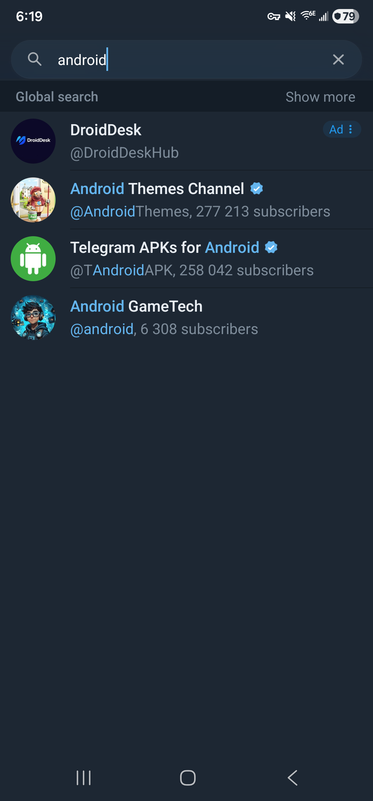
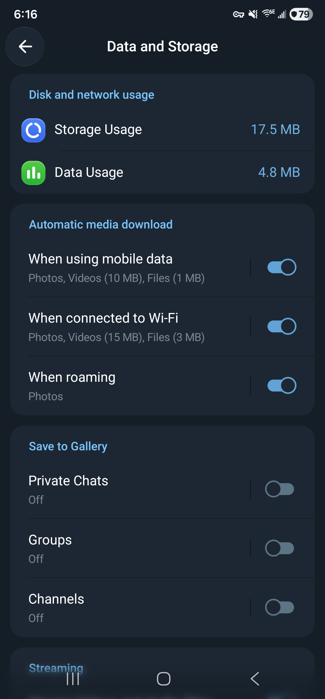
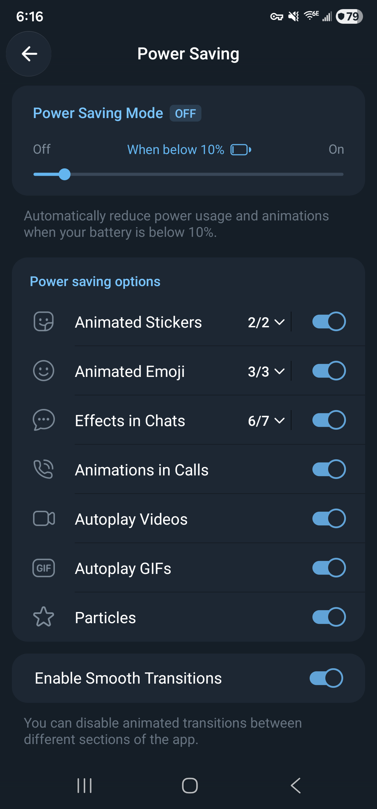
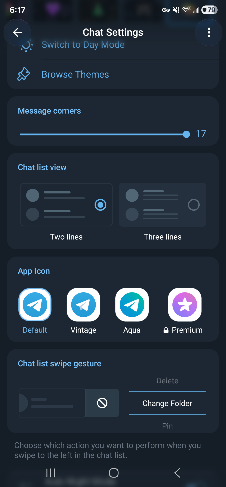
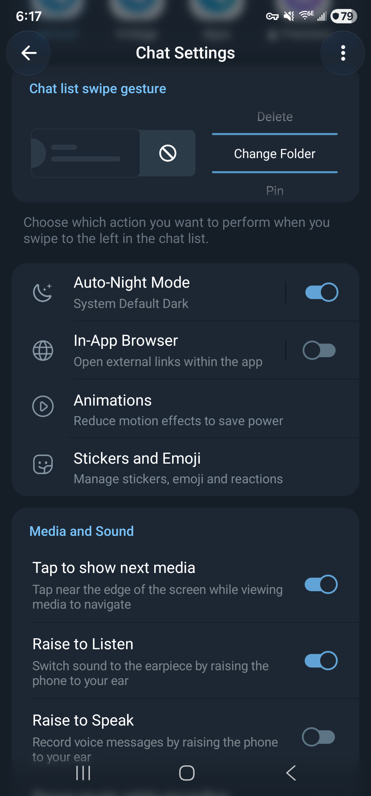
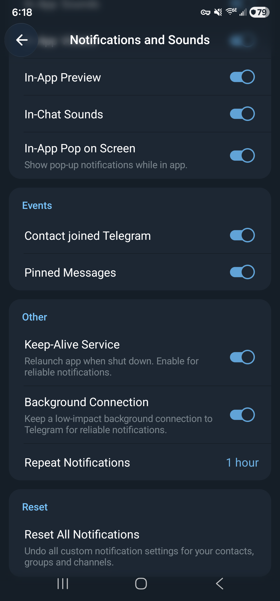

# Telegram 12.10.7 stock app runtime audit

This companion to the [12.10.6 code audit](telegram-audit-12.10.6.md) records a signed-in walkthrough and network measurements on a physical Samsung phone. It describes the official app with no HushTelegram patches applied. The purpose is to give future patch work a repeatable baseline, including the native controls that already solve part of a problem.

## Build and account boundary

| Item | Inspected build |
|---|---|
| Audit date | October 9, 2026 |
| Device | Samsung Galaxy S22 Ultra, SM-S908U1, Android 16 |
| System build | `BP2A.250605.031.A3/S908U1UESAGZE3`, security patch May 5, 2026 |
| App | Official Telegram Beta 12.10.7, version code 71239 |
| Package | `org.telegram.messenger.beta` |
| APK SHA-256 | `5f1d8e90fa4c03e58e3dc0c96ab6905295ead62bec81b6d5d9a0a52d01779500` |
| Signer SHA-256 | `49c1522548ebacd46ce322b6fd47f6092bb745d0f88082145caf35e14dcc38e1` |
| Capture | PCAPdroid 2.0.2, local VPN capture limited to this package |

The vendor signature was verified before installation. The beta package allowed a fresh, unpatched installation alongside an existing Telegram web installation. Existing accounts and data were preserved. This is a pinned supported fixture, not a claim that 12.10.7 is the newest Telegram release.

The user signed in directly on the phone before capture began. The binary and its installation were fresh, but the account already existed. Cloud preferences, joined channels and other account state can return after sign-in. Values shown below are observations from that account and installation, not universal factory defaults.

Android allowed notifications. Contact read/write, phone state/number, camera, microphone and precise location permissions were ungranted for the primary user when inspected. This matters when interpreting the contact-sync switch or drawing conclusions about sensor access.

## Confirmed live search ad

1. Open Chats and focus Search Chats.
2. Type `android` and wait for global results.
3. Observe a sponsored row above the ordinary channel results. Close the keyboard to inspect its badge.

The first result displayed an **Ad** badge. The screenshot proves that this signed-in, unpatched beta received and rendered a search ad during the walkthrough. The sponsored row was not opened. No ad click, purchase, subscription, message or reaction was performed.

The UI hierarchy exposed the advertiser's name and handle, but omitted the visible Ad label from that row's text and description. This is an accessibility risk worth checking with TalkBack. A hierarchy dump alone does not prove what TalkBack announces or whether the separate badge can receive accessibility focus.

This result supplies a positive control for `Hide ads`. The existing [fixture check](../patches/src/test/kotlin/app/morphe/patches/telegram/ads/HideAdsFixtureTest.kt) targets the sponsored-search request on both supported builds. A future device comparison should use the same account, query and timing, record the stock ad first, then check the patched request and layout. Server inventory can change between runs, so an empty result by itself doesn't prove the patch worked.

The same capture also covered a read-only visit to the verified Telegram APKs for Android channel. No channel ad was established there. Swiping upward beyond its last post advanced into another already joined channel and began autoplaying a short video. That transition is a separate source of unexpected traffic. It isn't evidence of a sponsored message. No Join, Follow, Share or reaction control was used.

## Network method

Capture used Android's VPNService with `app_filter=org.telegram.messenger.beta`. Output stayed in a local PCAP file. TLS decryption and SOCKS proxying were disabled. QUIC was not deliberately blocked, and automatic private-DNS blocking was disabled. IPv4 and IPv6 were requested. Each packet was capped at 128 captured bytes, with full-payload capture disabled and a 20 MiB file limit.

The capture permission was handled through PCAPdroid's local control dialog. Starting or stopping its control activity did not establish success by itself. The running service and exact output file were checked. Captures used for packet totals were stopped, flushed and copied before analysis. The screen-off capture failed that finalization check and was excluded. No certificate was installed and no app database was extracted. The 128-byte prefix can still contain bytes after network headers, so raw files remain private.

PCAPdroid's non-root mode forwards app traffic through a local transport proxy. Its PCAP shows the app-to-VPN side, not packets exactly as they appeared on Wi-Fi. TCP sequence values, packet boundaries and retransmission behavior cannot be treated as a wire trace. See the [capture design](https://github.com/emanuele-f/PCAPdroid/blob/v2.0.2/docs/how_it_works.md) and [control API](https://github.com/emanuele-f/PCAPdroid/blob/v2.0.2/docs/app_api.md).

Android's per-UID cumulative network counters were read separately. Process CPU came from cumulative user/system ticks in `/proc/<pid>/stat`, retaining the process start tick so PID reuse could be detected. Boundary snapshots covered memory, services, scheduled jobs, alarms, power state and battery statistics. No counter was reset. Periodic observations were approximately 30 seconds apart, and the actual counter and process intervals were retained independently.

The phone stayed connected to USB and used Wi-Fi. The audit didn't stop unrelated apps. These are network, CPU and background-state observations. They do not measure physical battery drain or predict hours of battery life. Capture and diagnostic commands add overhead, and an ordinary screen-off interval is not proof of natural Doze.

## Results

### Interactive walkthrough capture

The packet timestamp span was 22:16:04.550 to 22:20:23.965 UTC, about 259.4 seconds. It includes settings browsing, the `android` search, the public-channel visit and the subsequent autoplay transition. It is not an idle benchmark or a measurement of the ad's cost alone.

The PCAP held 4,181 records, including 4,148 TCP and 33 UDP records. There were 4,109 IPv4 and 72 IPv6 records. Declared IP lengths summed to 8,738,592 bytes, while the retained IP prefixes summed to 394,773 bytes. Of those records, 2,545 were truncated at the configured capture limit. The file itself was 461,693 bytes including capture headers. Declared packet lengths are not decrypted content or Android UID accounting.

| Observed public peer | Transport | Records | Declared IP bytes, both directions |
|---|---|---:|---:|
| `149.154.167.222` | TCP 443 | 3,026 | 7,945,659 |
| `149.154.175.59` | TCP 443 | 864 | 707,696 |
| `149.154.166.111` | TCP 443 | 40 | 19,398 |
| `91.108.56.200` | TCP 443 | 67 | 16,616 |
| `149.154.167.92` | TCP 443 | 38 | 7,078 |
| `8.8.4.4`, `8.8.8.8`, `2001:4860:4860::8844`, `2001:4860:4860::8888` | TCP 853 | 113 | 30,217 |
| `2001:4860:4860::8888` | UDP 443 | 29 | 11,616 |

The first five peers fall inside [Telegram's published address ranges](https://core.telegram.org/resources/cidr.txt). Their addresses don't establish which RPC ran or whether a connection carried an ad, media, account synchronization or several operations. Port 443 alone doesn't prove HTTPS.

The remaining listed peers are [Google Public DNS addresses](https://developers.google.com/speed/public-dns/docs/using). TCP 853 is consistent with [DNS over TLS](https://developers.google.com/speed/public-dns/docs/dns-over-tls). Two visible UDP/53 questions requested A and AAAA records for `dns.google`; four DNS records account for the remaining 312 declared IP bytes outside the table. The UDP/443 service was not decrypted or classified. Resolver traffic can be part of Android/VPN network handling. These connections are not evidence of an advertising or analytics SDK.

No packet was labeled as a sponsored-message request based on timing or IP alone. Telegram ads can share service connections with ordinary functions. Blocking the observed Telegram IP ranges would also risk breaking normal app traffic.

### Native request observations

The official beta was already writing normal diagnostic logs when inspected. No logging switch was enabled for this audit. The Settings page exposed Send Logs, Send Last Logs and Clear Logs. Those actions were left alone. Its version-line debug menu was inspected and dismissed without changing anything.

The pinned beta's DEX confirms `BuildConfig.DEBUG_VERSION=true` and `DEBUG_PRIVATE_VERSION=false`. `BuildVars.<clinit>` branches past the `logsEnabled` preference read when `DEBUG_VERSION` is true, then stores true to `LOGS_ENABLED`. Changing that preference alone cannot turn off logging in this fixture. The installed APK hash matched the inspected binary. This is a useful distinction when comparing stable and beta behavior or designing a native-log control.

HushTelegram's Debug logging preference controls its extension logger. It doesn't rewrite this native beta setting. The separate Turn off beta debug logs switch does. Its patch passes the `DEBUG_VERSION` value read in `BuildVars.<clinit>` through the extension, so with the switch on `LOGS_ENABLED` falls back to the saved `logsEnabled` choice. That one value gates the Java `FileLog` writers and the network log path `ConnectionsManager` hands native init, which gets an empty path while it's false. `DEBUG_VERSION` keeps its value everywhere else. The switch starts off, applies after a restart, answers stock while HushTelegram is paused, and leaves existing diagnostic files alone. The regular build reads `DEBUG_VERSION=false` there, so it never changes. The same initializer shape is in 12.10.6, 12.10.7, 13.0.0 and 13.0.1.

Only local send-request class names, occurrence counts and timestamps were extracted. The normal log was analyzed for October 9 from 18:16:04 through 18:20:24 in the phone's local time, covering the walkthrough. Raw text, request tokens, object hashes, peer IDs and payloads are excluded here. Native logging was therefore part of the measured beta's baseline, which may differ from a stable web build.

| Request class | Logged send-path occurrences | Observed local time | Interpretation |
|---|---:|---|---|
| `TL_contacts_getSponsoredPeers` | 4 | 18:19:22.090 through 18:19:22.188 | Sponsored-search requests were constructed while the query was entered. This isn't four visible ads. |
| `TL_messages_viewSponsoredMessage` | 1 | 18:19:22.719 | The app reached the impression-report send path after the search result appeared. |
| `TL_messages_getSponsoredMessages` | 1 | 18:19:43.229 | A conversation ad fetch occurred during the public-channel visit. A returned channel ad wasn't visually established. |
| `TL_messages_reportReadMetrics` | 3 | 18:19:53.727, 18:20:03.485, 18:20:09.925 | The app reached the exposure-metrics send path during and after channel browsing. |
| `TL_channels_readHistory` | 2 | 18:19:43.006, 18:19:58.743 | Normal channel read-state requests also occurred. These must remain distinct from optional analytics. |
| `TL_messages_getMessagesViews` | 3 | 18:19:45.263 through 18:19:55.440 | Standard channel view-count requests were present separately from read metrics. |
| `TL_upload_getFile` | 286 | 18:17:11.520 through 18:20:00.767 | Media/file fetch activity accompanied the walkthrough. The historical `upload` namespace doesn't make this a user-file upload. |

No `TL_messages_clickSponsoredMessage` send line appeared in this filtered interval, consistent with leaving the ad unopened. Absence in this log isn't proof that every possible click path is covered. The request counts establish local send-path activity, not server receipt, success or one-to-one packet attribution. Request parameters and responses weren't decoded.

This gives `Hide ads` a live positive case for sponsored search and impression reporting. It also gives `Disable analytics` a live positive case for read metrics. A patched comparison should separately preserve `channels.readHistory` and ordinary message view counts. The code audit explains the [existing request hooks and reporting boundaries](telegram-audit-12.10.6.md#how-sponsored-content-reaches-the-app).

### Fixed activity windows

These windows measured Telegram Beta 12.10.7 build 71239 on a Samsung S22 running Android 16. The foreground phase began on idle public search results for the `android` query. Background began at the launcher. Screen-off began from Settings or Home, with launcher focus at the measured boundaries. The capture-off background observation began screen off and ended awake. These are single observations with different starting surfaces, not matched steady-state repeats.

| Phase | Fixed measurement window UTC | Counter-read completion interval UTC |
|---|---|---|
| Foreground | 22:23:34.473878 to 22:25:34.474306 (120.000 s) | 22:23:34.155365 to 22:25:34.888882 (120.734 s) |
| Background | 22:26:29.227072 to 22:31:29.227442 (300.000 s) | 22:26:28.913542 to 22:31:29.650900 (300.737 s) |
| Screen off, baseline 2 | 22:38:12.176617 to 22:43:12.177181 (300.001 s) | 22:38:11.880833 to 22:43:12.618299 (300.737 s) |
| Capture-off background, state changed | 22:54:00.191236 to 22:59:00.191414 (300.000 s) | 22:53:59.828060 to 22:59:00.525694 (300.698 s) |

| Phase | App UID counter delta | Main-process CPU from raw samples | RSS observed |
|---|---|---|---|
| Foreground | RX 1,995 B / 25 packets, TX 4,397 B / 26 packets, total 6,392 B / 51 packets | 6.71 CPU seconds over 90.063 s, 7.4503% of one core (671 ticks) | 426,288 to 426,696 KiB |
| Background | RX 892 B / 13 packets, TX 1,645 B / 13 packets, total 2,537 B / 26 packets | 20.06 CPU seconds over 270.064 s, 7.4279% of one core (2,006 ticks) | 214,552 to 393,008 KiB |
| Screen off, baseline 2 | RX 515 B / 6 packets, TX 1,080 B / 8 packets, total 1,595 B / 14 packets | 15.92 CPU seconds over 300.322 s, 5.3010% of one core (1,592 ticks) | 213,964 to 295,332 KiB |
| Capture-off background, state changed | RX 290 B / 2 packets, TX 846 B / 5 packets, total 1,136 B / 7 packets | 22.63 CPU seconds over 300.363 s, 7.5342% of one core (2,263 ticks) | 257,464 to 258,056 KiB |

The foreground and background periodic process samples begin about 30 seconds after their fixed windows start. Their CPU values therefore cover 90.063 and 270.064 seconds, not the full 120 and 300 seconds. The screen-off runner recorded a baseline sample, and the capture-off background run used two boundary samples. Both cover nearly the full interval. CPU values use directly recomputable samples, not phase-summary totals without a matching initial raw sample. Samples cover only the main `org.telegram.messenger.beta` process. The separate Chromium sandbox process is excluded. RSS is resident memory, not PSS or a battery estimate.

The screen-off UID and process readings completed, but that phase is partial because PCAPdroid did not stop cleanly. Its packet capture was not pulled as a verified, flushed file and is excluded below. After the interval, PCAPdroid alone was force-stopped at about 22:48:30 UTC. PCAPdroid CaptureService absence and the device's Dozing state were verified. The first capture-off screen-off attempt is excluded because its screen state changed. The repeat is included as a background observation, not as a screen-off or AOD control. Telegram was not foreground and PCAPdroid CaptureService was inactive at both boundaries, but the device changed from Dozing and screen off to Awake and screen on. No other VPN provider was independently checked during either cleanup or capture-off observation. Power timestamps place the last wake about 5.6 seconds after the last sleep, near the measurement start. The cause was not established. No pure capture-off AOD or natural-doze result was obtained.

PCAPdroid 2.0.2 captured the selected Telegram package through its VPN app filter. Capture records are classic PCAP with DLT_RAW 101 and a 128-byte snaplen. TLS decryption and full-payload capture were off. Each capture began before its measurement window and stopped afterward. Device and host clocks were not aligned, so PCAP records cannot be cropped exactly to the fixed windows.

| Phase | Packet timestamps UTC | Packets | Declared IP bytes | Captured record bytes | Truncated records |
|---|---|---:|---:|---:|---:|
| Foreground | 22:23:32.241629 to 22:25:46.525021 | 234 | 55,041 | 18,923 | 80 |
| Background | 22:26:27.371651 to 22:27:34.568543 | 245 | 67,318 | 19,631 | 77 |

The background packet timestamps span about 67 seconds, but that alone does not show that capture stopped early. No capture-service health probes were recorded during that baseline. PCAPdroid's VPN proxy can synthesize transport headers, and its IP-byte accounting differs from Android UID netstats. Do not reconcile these byte totals. Snaplen truncates part of each capture. Encrypted traffic cannot be classified as advertisements from this capture.

Package-owned `ServiceRecord` entries at both foreground boundaries were `GcmPushListenerService`, `SessionLifecycleService`, `NotificationsService`, and `SandboxedProcessService0:0`. Background began with the same four entries, and `NotificationsService` was absent after that window. These records do not establish Android foreground-service notification status.

A Google DataTransport `JobInfoSchedulerService` job remained pending at the foreground and background boundaries, with run count zero. Connectivity was satisfied. The timing-delay and device-idle constraints were unsatisfied. This does not show that the job ran or caused the measured traffic or CPU. No package-owned pending alarms were found. No target wakelock transitions were seen in the approximate device-local windows. Telegram Beta native logging was already active before measurement, and no logging toggle changed. Native logging may add runtime and I/O overhead.

The sanitized phase data, including counter-read brackets, the excluded screen-off attempt, and capture limitations, are in [telegram-runtime-12.10.7-data.json](telegram-runtime-12.10.7-data.json).

## Firebase and transport inventory

A targeted scan of the current 71239 APK found the following components. Older local beta metadata for 71159 was excluded. The presence of a class or manifest component doesn't establish that it collected data or completed an upload.

| Family | Exact-build static evidence | Runtime evidence in this audit |
|---|---|---|
| Firebase initialization | `FirebaseInitProvider`, `ComponentDiscoveryService` and component registrar metadata in the manifest | Provider execution wasn't independently traced. |
| Crashlytics | `CrashlyticsRegistrar` and KTX registrar classes, plus component-discovery metadata | No crash report or Crashlytics destination was established. |
| Firebase Sessions | `FirebaseSessionsRegistrar` and `SessionLifecycleService` classes and manifest entries | A session lifecycle service appeared in the package's service records. No session payload was decoded. |
| Google DataTransport | `CctBackendFactory`, `TransportBackendDiscovery`, `JobInfoSchedulerService` and `AlarmManagerSchedulerBroadcastReceiver`, with manifest components | A transport job remained pending at the measured boundaries. No execution in the measured interval was identified. |

The manifest sets `firebase_analytics_collection_deactivated=true`. Firebase documents this as an [Analytics collection control](https://firebase.google.com/docs/analytics/android/configure-data-collection). It isn't the separate [Crashlytics collection control](https://firebase.google.com/docs/crashlytics/android/customize-crash-reports). No explicit Crashlytics or Sessions collection-setting value was found in the manifest. SDK strings such as `firebase_crashlytics_collection_enabled`, `firebase_sessions_enabled` and `firebase_sessions_sampling_rate` show that those controls exist in library code, but don't reveal their runtime values. Exact SDK versions were not established.

The [Disable analytics implementation](../patches/src/main/kotlin/app/morphe/patches/telegram/misc/analytics/DisableAnalyticsPatch.kt) targets selected Telegram RPC events and, since this audit, the two reporters' own controls ([FirebaseReporters.kt](../patches/src/main/kotlin/app/morphe/patches/telegram/misc/analytics/FirebaseReporters.kt)). The beta's `ApplicationLoaderImpl.startAppCenterInternal`, which `LaunchActivity.onCreate` reaches on every create, hands Crashlytics the user ID, username and device details and then calls the SDK's collection setter, which saves `firebase_crashlytics_collection_enabled=true` in `com.google.firebase.crashlytics`. A saved false alone would be undone at the next launch. With the switch on, that method and `appCenterLogInternal` return first and the extension saves false, which the Crashlytics arbiter reads at the next process start; the first start after turning it on can still send. The Sessions local override reader (the `firebase_sessions_enabled` Bundle lookup) answers false in the same process. Firebase init, Installations, Messaging and DataTransport aren't changed. The same shapes are in 13.0.1 (71669); 12.10.6 and 13.0.0 carry neither SDK. Runtime upload behavior is still unmeasured, and no observed Google DNS connection was attributed to one of these SDKs.

Any new SDK-reporting control needs a proven reporter or collection-setting hook and a separate acceptance case. Avoid blocking the whole Firebase initialization or transport layer. [Repair Firebase push](../patches/src/main/kotlin/app/morphe/patches/telegram/misc/firebase/RepairFirebasePushPatch.kt) already works around Firebase installation request handling, and broad changes could interfere with push registration or other shared consumers.

## Native controls and patch boundaries

The preference states below are observations from this signed-in account, not Telegram-wide defaults. The privacy controls are listed without account-specific security values.

### Main navigation and promotion surfaces

The main bottom navigation exposed Chats, Contacts, Settings and Profile. The chat list had a birthday banner, a suggested-contact block and an alert badge on Contacts. Those private screens were kept out of the published screenshots. Their presence doesn't establish an address-book upload or a paid ad.

[Hide promotional banners](../patches/src/main/kotlin/app/morphe/patches/telegram/misc/suggestions/HideSuggestionsPatch.kt) is the existing match for the birthday banner. [Hide Premium, gifts and Stars](../patches/src/main/kotlin/app/morphe/patches/telegram/misc/commerce/HideCommercePatch.kt) addresses commerce surfaces, including Settings rows. The stock Settings pages exposed Telegram Business and Send a Gift. Those rows weren't opened, and neither the birthday banner nor the contact suggestion was selected.

These are separate acceptance cases from sponsored search. A regression walkthrough should check each surface individually and retain account-security notices when hiding promotional banners.

### Privacy and contacts

Privacy and Security exposes controls for two-step verification, passcode lock, passkeys, blocked users, signed-in devices, visibility, calls and messages, group and channel invitations, account deletion, bots and websites, payment and shipping data, synced contacts, Secret Chats, map previews, and link previews.

The Contacts section includes `Delete Synced Contacts`, `Sync Contacts`, and `Suggest Frequent Contacts`. The native Sync Contacts preference was on while Android's local contacts permission was denied. A contact suggestion remained visible in the main UI. That is compatible with already synced account data. It doesn't prove that Telegram read or uploaded the local address book during this session.

[Hide contacts on Telegram](../patches/src/main/kotlin/app/morphe/patches/telegram/misc/contactsblock/HideContactsBlockPatch.kt) hides a specific suggested-contacts block in the chat list. [Quiet contacts nag](../patches/src/main/kotlin/app/morphe/patches/telegram/misc/contacts/QuietContactsNagPatch.kt) stops repeated prompts after a permission denial. These patches don't control the full local contact-sync path or remove contacts already synced to Telegram. Test the native sync switch and Android permission independently before adding an override. Existing cloud contacts are a separate account state.

`Suggest Frequent Contacts` is separate from similar-channel and bot recommendations. [Hide recommendations](../patches/src/main/kotlin/app/morphe/patches/telegram/misc/recommendations/HideRecommendationsPatch.kt) covers those channel and bot suggestions. It doesn't establish that frequent-contact suggestions are disabled.

[Disable analytics](../patches/src/main/kotlin/app/morphe/patches/telegram/misc/analytics/DisableAnalyticsPatch.kt) blocks selected app metrics. It doesn't change account privacy controls, contact sync, or all service-side processing.

### Data and storage

The Data and Storage page exposes storage and data usage, automatic media downloads by connection type, gallery saving, streaming, call data use, proxy settings, and cloud-draft cleanup.

Photos and videos were allowed on mobile data, with videos up to 10 MB and files up to 1 MB. Wi-Fi allowed photos and videos, with videos up to 15 MB and files up to 3 MB. Roaming allowed photos only. Gallery saving was off for private chats, groups, and channels. Video and audio streaming was on. The beta-only `Show MKV as Video` switch was off, while `Stream All Videos` was on. `Use Less Data for Calls` was set to `Only while roaming`.

The page also exposes `Proxy Settings` and `Delete All Cloud Drafts`. No HushTelegram patch in this map overrides these download or streaming preferences. A separate global media limit would duplicate Telegram's existing controls unless a concrete use case calls for an override.

### Power saving

Power Saving Mode was inactive at the current charge level. The slider was set to `When below 10%`, with `Off` and `On` at its endpoints. Separate controls cover animated stickers, animated emoji, chat effects, call animations, video autoplay, GIF autoplay, particles, and smooth transitions.

These are native Telegram power and playback settings. No patch mapped here changes their thresholds or ordinary video and GIF autoplay. [Turn off haptic feedback](../patches/src/main/kotlin/app/morphe/patches/telegram/misc/haptics/NoHapticsPatch.kt) handles tap and gesture vibration, which is separate from animation and autoplay.

### Chat, links, and media

Chat Settings exposes message size and corners, wallpaper and color theme, chat-list view and swipe action, app icon, automatic night mode, in-app browser, animations, stickers and emoji, media navigation, raise-to-listen and raise-to-speak, pausing music while recording or playing media, Android sharing, adult-content visibility, send-with-Enter, microphone choice, and distance units.

The signed-in account had the left chat-list swipe action set to `Change Folder`, system dark mode selected, the in-app browser option off, and `Tap to show next media` on. `Raise to Listen` was on and `Raise to Speak` was off. Music paused while recording, but not while playing media. These values describe this account only.

[Open links externally](../patches/src/main/kotlin/app/morphe/patches/telegram/misc/links/OpenExternalLinksPatch.kt) changes where ordinary web links open. [Strip link tracking](../patches/src/main/kotlin/app/morphe/patches/telegram/misc/links/StripLinkTrackingPatch.kt) removes a limited set of known URL tags. Link routing and query-tag removal are different behaviors.

The native left-swipe preference chooses an action for a chat-list gesture. [Disable chat swipe actions](../patches/src/main/kotlin/app/morphe/patches/telegram/misc/chatlist/DisableChatSwipePatch.kt) suppresses the sideways gesture itself. It doesn't choose a replacement action.

`Tap to show next media` controls navigation in the media viewer. It is separate from pulling up at the end of a channel. [Disable pull to next channel](../patches/src/main/kotlin/app/morphe/patches/telegram/misc/channelpull/DisableChannelPullPatch.kt) stops the bottom-of-channel transition, and its channel switch starts on by default. This patch addresses accidental channel changes. It isn't a general video-autoplay control.

### Notifications and background controls

Notifications and Sounds exposes categories for private chats, groups, channels, stories, reactions and calls. It also provides call vibration and ringtone settings, badge counts, in-app sounds and previews, contact-joined and pinned-message alerts, Keep-Alive Service, Background Connection and repeat notifications.

In this account, private-chat notifications were on. Group, channel, story, and reaction notifications were off. Calls used the default vibration and ringtone. The badge icon and unread-message count were on, while muted chats were excluded. In-app sound, vibration, previews, in-chat sounds, pop-ups, contact-joined alerts, pinned-message alerts, Keep-Alive Service, and Background Connection were on. Repeat notifications were set to one hour.

These settings express app preferences. They don't prove that a service was running or quantify its network, CPU, battery, or Doze impact. Android's notification permission is separate from Telegram's category switches.

[Silence people outside your contacts](../patches/src/main/kotlin/app/morphe/patches/telegram/misc/notifications/SilenceNonContactsPatch.kt) changes sound and vibration for a specific class of notifications. [Ignore mentions in muted chats](../patches/src/main/kotlin/app/morphe/patches/telegram/misc/notifications/IgnoreMutedMentionsPatch.kt) handles mentions and replies in muted groups or channels. Neither patch disables Background Connection or Keep-Alive Service.

Telegram already exposes both background controls. A future HushTelegram opt-out would need to explain the notification-reliability tradeoff and be measured separately. The settings walkthrough alone doesn't establish a background traffic source.

## Repeating this audit after an update

1. Pin the exact official APK and record package, name/code, signer and hash. Keep web and beta evidence separate.
2. Record account state without an identifier, Android permissions, network type, native background options, motion/autoplay settings and the initial screen. A clean install with an existing account can restore cloud settings.
3. Stop capture for login. Start an app-filtered local capture afterward, verify the service and output file, and retain the capture configuration with the results. Inspect whether native beta logging is already active. Don't assume a release and beta have equal logging overhead.
4. Separate interactive exploration from fixed idle windows. Record the action sequence for a search or channel visit. Use matching foreground, Home and screen-off durations for comparisons.
5. Take cumulative UID and process samples at known boundaries. Check for process restarts, unavailable counters, resets, permission errors and changes of foreground or power state.
6. Stop and flush capture, verify its hash, and summarize endpoints and aggregate counts. Treat encrypted bytes as encrypted bytes. For a request trace, record the native log's line boundary or local time before an action and summarize only matching send-request class names afterward. Preserve nested TL class names. Never export raw logs through Send Logs or include login-period records in a public artifact.
7. Compare a positive stock case with the patch enabled, disabled and paused. Test already cached results separately. Native background notifications and normal message delivery need their own acceptance checks.
8. Publish only sanitized totals, reproducible steps and reviewed screenshots. Keep raw captures, system dumps, login screens, private chat lists and account security settings local.

## Earlier signed-out web-build control

Before the audit moved to the phone, Telegram web 12.10.6 ran without an account on an Android 13 x86_64 emulator. It stayed on the welcome carousel. This is a separate app build, platform and account state, so its CPU figures aren't a comparison with the S22.

Guest-side `tcpdump -i any` captured the whole emulator. Over a 120.595-second Android UID-counter interval, Telegram received 4,266 bytes in 35 packets and sent 5,618 bytes in 38 packets. The first-to-last process sample covered 120.000 seconds and 43.54 CPU seconds. Maximum observed RSS was 185,660 KiB. The process total includes all its threads.

The guest PCAP held 128 packets, with 130 reported received by the filter and no kernel drops. Its records spanned 115.142 seconds and contained 27,552 declared IP bytes, plus ten non-IP frames. Most IPv4 bytes could not be attributed from the sampled socket table. Nearby socket snapshots and packets included `149.154.167.41:443`, but the clocks were not calibrated. The per-UID counters are the app-only totals; this whole-device PCAP must not be used to call unrelated Google traffic Telegram analytics.

The initial emulator-console captures missed guest Wi-Fi traffic and were rejected for endpoint analysis. A separate app-stopped counter control recorded zero bytes over 120.238 seconds. That isn't a background or natural-Doze control. Temporary emulator power/timeout changes were restored, the emulator was stopped, and later work used the S22 as requested.

## Coverage limits

The stock walkthrough doesn't validate patched behavior. Video-player ads, bot ads and Stories ad delivery were not positively observed. Calls, incoming push delivery, dual-camera events, background media playback, overnight idle and natural Doze remain separate checks. Native request logs established several local request paths, but the packet capture cannot associate individual encrypted packets with those requests or verify their payloads.

This beta is covered by the repository's declared fixture tests for channel/video/search ad-fetch targets, read-metrics handling, device-stat handling and selected app-log events. Those are bytecode and patch-behavior checks. They don't establish that every event fired on the phone. Detailed payload descriptions in the 12.10.6 code audit retain that build's scope.

| Area | Evidence available | Remaining acceptance |
|---|---|---|
| Welcome and sign-in | Signed-out web screenshots, manually completed beta login | Verification delivery variants and account recovery |
| Search ads | Visible Ad badge, sponsored fetch and impression send lines | Patched on/off/paused states, cached ads, TalkBack label |
| Public-channel browsing | Navigation, media fetches, channel reads/views, read-metrics send lines | Controlled channel/video ad inventory and patched suppression |
| Settings and privacy | Five detailed settings areas, OS permission snapshot, reviewed screenshots | Effects of changing sync, download, autoplay or notification controls |
| Background operation | Bounded UID/CPU counters, services/jobs/alarms and capture observations | Repeated unplugged tests, natural Doze, incoming message delivery |
| Customization | Native themes, gestures, browser, media and notification controls | Patch-specific rendering, gesture and accessibility checks |

The [factory reference](telegram-app-reference.md) supplies component and fingerprint maps. The [code audit](telegram-audit-12.10.6.md) supplies ad/telemetry payload and hook details. This report supplies runtime observations. Keep all three boundaries when updating a patch for a new APK.
