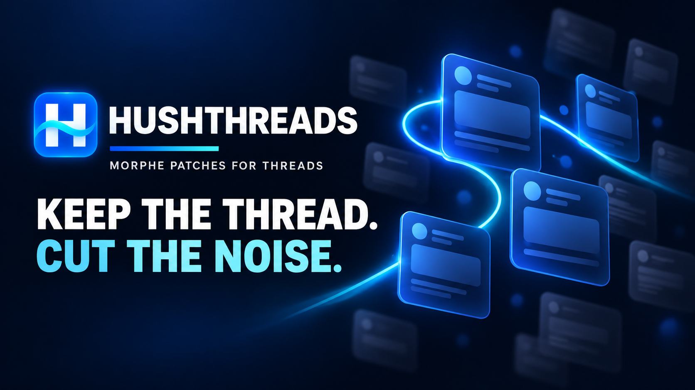
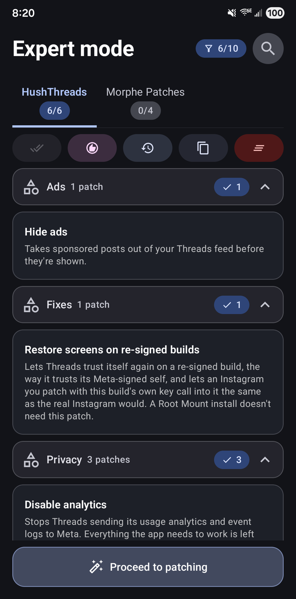
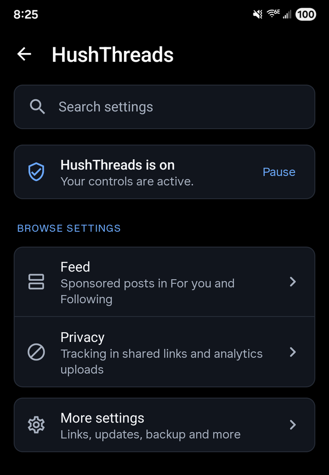
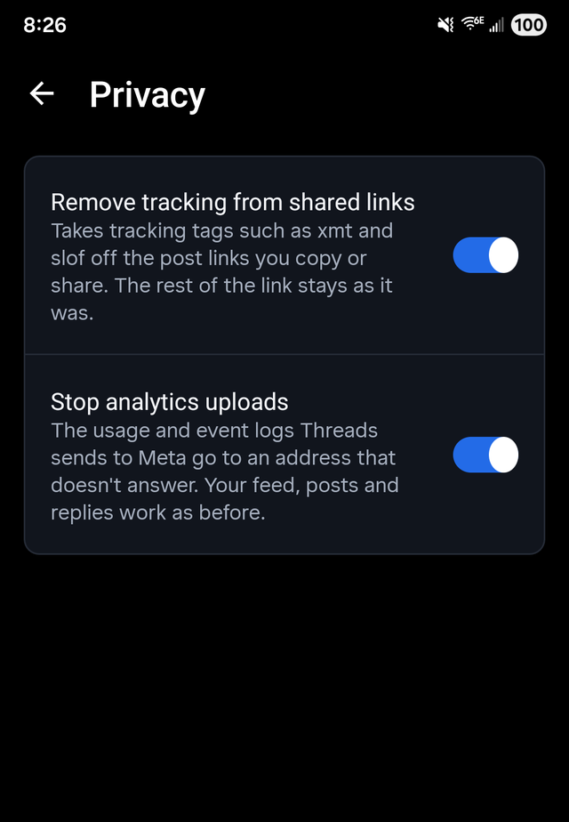
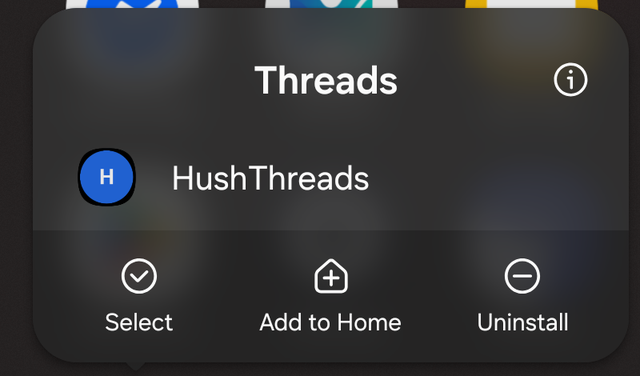

<p align="center">
  <a href="https://github.com/SysAdminDoc/HushThreads/releases"></a>
  <a href="LICENSE"></a>
  
  
  
</p>

#  HushThreads

HushThreads is a Morphe patch bundle for Android that takes the ads out of Threads, cleans the links you share and cuts down what the app reports back to Meta.

The latest release is [v0.0.2](https://github.com/SysAdminDoc/HushThreads/releases/tag/v0.0.2), with 6 patches. It's the first one.

[Add to Morphe](https://morphe.software/add-source?github=SysAdminDoc%2FHushThreads) | [Download a release](https://github.com/SysAdminDoc/HushThreads/releases/latest) | [Browse the patches](#patches)

## Why use it

- **A feed without ads.** Sponsored posts come out of each page of the feed as it arrives, before Threads saves or shows it.
- **Links that don't point back at you.** The code Threads adds to a shared link to tie it to your account comes off, along with the other tracking tags.
- **Less sent home.** Threads' event logs go nowhere, and it gets zeros instead of your phone's advertising ID.
- **Controls that recover.** Every runtime feature has a switch, and a pause, an automatic safe mode, settings backups and privacy-filtered diagnostics help when Threads changes.

HushThreads is the Threads member of a small family of patch bundles. Its settings screen, diagnostics and release checks come from its Facebook sibling, [Hushfacebook](https://github.com/SysAdminDoc/Hushfacebook). The Threads patches are written here. See [Where the patches come from](#where-the-patches-come-from).

This project has no connection to Meta or to the Morphe project. Neither endorses it, and neither wrote it.

## Install

1. Install [Morphe Manager](https://github.com/MorpheApp/morphe-manager) 1.32.0 or newer.
2. Add HushThreads as a patch source: https://morphe.software/add-source?github=SysAdminDoc%2FHushThreads
3. Get Threads 449.0.0.54.82 (`com.instagram.barcelona`) for arm64-v8a, version code 511908382 (120-640dpi, Android 9+). That's the build these patches are checked against. Morphe Manager warns about other builds of the same version.
4. In Morphe Manager, pick that file, keep the default patch selection or change it, and patch.

<p></p>

Threads releases a new version about once a week, and each one renames most of its code. Every patch here finds what it changes by names Threads keeps (its post model, the feed cache, JSON parser names, strings and manifest components) rather than by the names that change. When one can't find what it needs, patching stops with a message naming it, instead of producing an app that quietly does nothing. Disable analytics works down three kinds of target. It stops only when a build has none of them, and names each missing one in the patch log.

## Keep your signing key

Morphe Manager signs the patched Threads with a key it makes on your phone. Android installs an update over your patched Threads only when the update carries that same key, so the key is what lets you update without losing Threads' data.

- **Back it up right after your first patch.** In Morphe Manager, open Settings, then System, then Import & export, then Signing key, and tap Export. Keep the `Morphe.keystore` file somewhere private, because anyone who has it can sign an APK your phone will accept as an update.
- **On a new phone, import it before you patch anything.** Reinstalling Morphe Manager or clearing its storage makes a new key, and without your exported copy nothing you patched earlier can be updated in place.
- **A different key means starting over.** Android refuses an update signed with another key, so the only way forward is to uninstall the patched Threads and sign in again.

The same goes for the Threads you have now. A patched Threads can't install over the stock app, so uninstall the stock Threads first.

## Patches

There are 6 patches, and every one of them is selected by default.

| Patch | What it does |
|---|---|
| `Disable analytics` | Stops Threads sending its usage analytics and event logs to Meta. Everything the app needs to work is left alone. |
| `Hide ads` | Takes sponsored posts out of your Threads feed before they're shown. |
| `HushThreads settings` | Adds HushThreads settings to Threads. Long-press Threads' launcher icon, or open Additional settings in the app on Threads' App info page, to turn features on or off, pause HushThreads, save your switches to a file or load them, and export diagnostics. The licenses are there too. |
| `Remove the advertising ID` | Stops Threads getting your phone's advertising ID from Google Play services. Threads gets a string of zeros in its place. |
| `Restore screens on re-signed builds` | Lets Threads trust itself again on a re-signed build, the way it trusts its Meta-signed self, and lets an Instagram you patch with this build's own key call into it the same as the real Instagram would. A Root Mount install doesn't need this patch. |
| `Sanitize sharing links` | Takes Threads' tracking tags, such as xmt, off the links you share or copy. The post a link opens stays the same. |

## Settings

Long-press the Threads icon and tap HushThreads. You can also open Threads' App info page and tap Additional settings in the app, which Samsung phones call Configure in Threads.

<p></p>
<p></p>

## Signing in

A Threads account is an Instagram account. On a patched Threads, tap Log in with Instagram and sign in with your Instagram username and password. That's been tried on a phone and it works.

Threads also offers to continue as the Instagram account already on your phone, and that doesn't work on a patched Threads yet. Next to an Instagram patched with the same key, Threads doesn't offer it at all and opens the username and password form instead. Next to the stock Instagram it hasn't been tried. Instagram checks which key the asking app was signed with, though, so expect the same there.

## Your Threads account

**Can Meta tell?** Assume it can. A patched Threads is signed with your key rather than Meta's, and Threads' own code checks that signature in places, which is why `Restore screens on re-signed builds` exists. Pick `Disable analytics` and the app's event logs stop reaching Meta, and Meta could notice that too.

**What stays the same?** Your feed still comes from Meta's servers, ads included, and HushThreads takes the ads out on your phone after they arrive. It doesn't post, like, follow or message on your behalf, and it doesn't change how you sign in.

**Could my account be suspended?** Nobody can promise it won't be. Meta's terms ask for its permission before anyone modifies its apps. We haven't heard of an account suspended over a patched Threads, but this is a young project, so that doesn't prove much. If you'd rather not risk the account you care about, try HushThreads with a test account first.

## Privacy

HushThreads doesn't collect anything and has no server. The patched app goes online on HushThreads' behalf for one thing only: the release check, and it's off until you turn it on. Once it's on, HushThreads asks `api.github.com` for its latest release at most once a day, when Threads starts, and again whenever you tap Check now. That's a plain HTTPS request with `HushThreads/<version>` as its User-Agent, and it carries no cookies and nothing about you or your phone. It only follows a redirect that stays on api.github.com, and it reads at most 256 KB of the answer. GitHub sees your IP address, as any site you visit does. From the answer, HushThreads keeps the version number and, if the notes name one, the Threads version the release targets. Nothing else is kept.

The About and Licenses screens link to `github.com`, `gitlab.com` and `www.gnu.org`. Those open in your browser, and only when you tap one.

`Disable analytics` points Threads' event log uploads at `127.0.0.1`, which is your phone itself, on a port nothing listens on. The upload fails right there and never leaves the phone.

## Where the patches come from

| Source | What came from it |
|---|---|
| [SysAdminDoc/Hushfacebook](https://github.com/SysAdminDoc/Hushfacebook) at `c15d4f7` | The Gradle build, the shared extension library with its settings screen, diagnostics and pause, the bytecode helpers, the link cleaner, the re-signed build fix and the checks that apply every patch to real builds before a release. Some of that came to Hushfacebook from [Hushfeed](https://github.com/SysAdminDoc/hushfeed), [Andrew Liang's patches](https://github.com/andrewliang25/morphe-patches) and [FroggoMorphePatches](https://github.com/SapitoSucio/FroggoMorphePatches). |
| [zeldrisho/morphe-patches](https://github.com/zeldrisho/morphe-patches) | The place Hide ads takes ads out, the feed cache's merge of each page. None of its code is used. |
| [Morphe](https://github.com/MorpheApp) and [ReVanced](https://gitlab.com/ReVanced/revanced-patches) | The patcher and the patch template. Everything above grew from their code. |

Every source file says where it came from in its header, and [provenance.json](provenance.json) maps each file to the project and commit it came from, with its licence. [docs/sources.md](docs/sources.md) covers the other Threads patch sources: what each one does and what this bundle took from it.

## Building from source

You need JDK 17 or newer and the Android SDK. The Morphe patcher comes from GitHub Packages, so you also need a GitHub token with `read:packages`.

```bash
export GITHUB_ACTOR=<your GitHub user>
export GITHUB_TOKEN=<a token with read:packages>
./gradlew :patches:generatePatchesList
./gradlew :patches:buildAndroid
```

The bundle lands in `patches/build/release/patches-<version>.mpp`, beside its SHA-256 and a CycloneDX SBOM of every library that goes into it. Run `generatePatchesList` before `buildAndroid`, or the bundle loses its Android payload.

Tests: `./gradlew :patches:test :extensions:threads:testDebugUnitTest`. Set `HUSHTHREADS_FIXTURE_DIR` to a folder holding Threads builds to run the tests that read real builds. Without it they skip and say so.

To apply every patch to a real build and check the result, run `scripts/verify-all-patches.ps1 -Apk <threads bundle> -DesktopJar <morphe-desktop jar> -WorkDir <scratch folder>`. [CONTRIBUTING.md](CONTRIBUTING.md) has the rest.

## License

[GPL-3.0](LICENSE), with the Morphe section 7 notices carried in [NOTICE](NOTICE). Threads, Instagram and Meta are trademarks of Meta Platforms, Inc.
