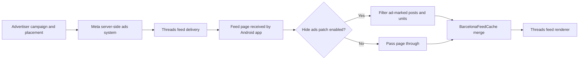

# Threads app reference for HushThreads

Updated 2026-10-09

This page records the unmodified Android Threads app that HushThreads patches. The package binary is a local fixture and is not committed. Version 450 is the repository's primary declared target. Check Google Play separately for the current public release.

## Product and account model

Threads is Meta's text-first conversation app connected to Instagram. People use it to publish threads, reply, share links and media, discover conversations, follow accounts, and manage who can reply or mention them. Meta describes fediverse interoperability as part of the product. Which controls appear can vary by account, region, and server rollout. The current product description is on the [Google Play listing](https://play.google.com/store/apps/details?id=com.instagram.barcelona&hl=en-US). Meta's [launch article](https://about.fb.com/news/2023/07/introducing-threads-new-app-text-sharing/) describes its Instagram sign-in and early feed model.

Google Play's Data safety card is developer-provided. As reviewed on 2026-10-09, it lists possible sharing of personal information and device IDs, possible collection of location, personal information and 12 other data types, encryption in transit, and deletion requests. Use that disclosure as context for privacy review, not as a network audit.

Use the public product description to orient inspection. Check the exact APK for every server-controlled feature before building a patch.

For build-specific UI review, inspect the home feed and feed selector, search and discovery, composer and media picker, profile, activity, privacy and account settings, inbound and outbound sharing, and the in-app browser. Meta has also documented custom feed ordering, topic tags, video controls, follower-only replies, reply approvals and filters, profile links, and creator Insights. Those reports describe product rollouts, not guaranteed controls in every account.

Meta's [feature notes](https://about.fb.com/news/2025/03/new-threads-features-more-personalized-experience-you-control/) describe those controls. Check the installed build before tying a patch to one.

## Primary Android baseline

| Property | Value |
|---|---|
| App label | Threads |
| Package | com.instagram.barcelona |
| Primary build | 450.0.0.51.78 |
| Version code | 512008342 for ARM64, 240 to 480 dpi |
| Minimum Android | Android 9, API 28 |
| Target SDK | 36 |
| Compile SDK | 37 |
| ABI in this fixture | arm64-v8a |
| Launcher activity | com.instagram.barcelona.mainactivity.BarcelonaActivity |
| Application class | com.instagram.barcelona.app.BarcelonaAppShell |

The supported package versions and original Meta signer hashes live in [AppCompatibilities.kt](../patches/src/main/kotlin/app/morphe/patches/shared/compat/AppCompatibilities.kt). That file is the source of truth for patch compatibility, not this table.

### Signing identity

The original 450 fixture carries the Meta signing lineage for both Android's v3.0 and v3.1 verification paths.

| Android API range | SHA-256 certificate digest |
|---|---|
| 24 to 32 | 5367570bad488d8da6a0fab78d9766a1a4c23c3c70fac0ad2e91c8f0bd58b432 |
| 33 and later | 8f38da6b4dc34b1900353bde4630043198cbe3ef7214151f86679cd000c90500 |

The fixture's minimum SDK is API 28, so older supported devices use the API 24 to 32 signer. Android 13 and later use the v3.1 signer. Check the package certificate rather than the separate Google source stamp:

    apksigner verify --print-certs com.instagram.barcelona.apk

## Fixture and split layout

The local 450 fixture is fixtures/threads-450.0.0.51.78-512008342.xapk. It is a ZIP containing the base APK, an ARM64 configuration APK, an MDPI configuration APK, an icon, and manifest.json. This fixture has no separate on-demand feature APK.

| Archive member | Size in bytes | Role |
|---|---:|---|
| com.instagram.barcelona.apk | 68,231,253 | Base code, resources, manifest, and app components |
| config.arm64_v8a.apk | 68,460,547 | ARM64 native libraries and ABI resources |
| config.mdpi.apk | 3,778,476 | Density resources |

The base APK SHA-256 is 1881ad1d19a0a758690cd00aea250c4fa81cb13533b6a234639b3232ed5f2092. The XAPK SHA-256 is 19bfeb54d003374b85664fffc75403f7bc1b273b4431b59f11aad8e7c5f67e04.

Android treats a split install as one app made from its base plus the configuration splits selected for the device. Install all three fixture APKs together. Installing only the base APK does not reproduce the full fixture. See Android's [split APK format](https://developer.android.com/guide/app-bundle/app-bundle-format).

Every version in AppCompatibilities.kt is ARM64-only in this repo. Version 450 has multiple density codes upstream. The pinned fixture uses version code 512008342, the 240 to 480 dpi variant.

## Package structure

The base APK contains 13 DEX files with 97,550,400 bytes of raw DEX data and 2,506 asset entries. The file assets/secondary-program-dex-jars/metadata.txt maps classes2.dex through classes13.dex. The small assets/longtail/classes.dex file is separate from those main DEX files.

The ARM64 split carries native code, including libarmerged.so. The MDPI split is primarily a resource table. A scan found 893 unique type descriptors that refer to com.instagram.barcelona. This counts references, not defined classes. Recognizable feature namespaces include feed, messaging, creation, search, profile, sharing, activity feed, login, main activity, permalinks, podcasts, topics, and close-threads. HushThreads patches the installed package's DEX and manifest through Morphe. The app's own source is not part of this repository.

Meta's build uses substantial obfuscation and code movement. Many method and class names are Redex forms such as X... and A0.... Some com.instagram.barcelona names remain readable, including selected models and BarcelonaFeedCache, but a readable package name alone is not a stable hook. Compose lambdas can be merged or moved. Shared strings can be pooled. Some app text is served dynamically, so adding a resource to the APK may not change the text Threads displays.

## Components worth knowing

| Component | Role | Patch relevance |
|---|---|---|
| BarcelonaActivity | Main launcher and activity lifecycle | Entry point for return-to-feed behavior and navigation |
| LoginActivity | Instagram-based login route | Useful for stock first-launch checks |
| ThreadsBrowserLiteActivity | In-app browser | Link routing and external-browser behavior |
| BarcelonaUrlHandlerActivity | Deep links and web links | URL resolution and share-link testing |
| BarcelonaShareHandlerActivity | Receives shared text, images, and video | Manifest share-target behavior |
| BarcelonaAuthenticationService | Account integration service | Authentication and account-manager boundary |
| FbnsService in process :mqtt | Meta push transport | Separate process and signer paths |
| InappFbnsService in process :fbns | In-app push service | Has its own signer check; a main-process hook does not cover it |

The manifest also declares network and account access, contacts and profile, precise and approximate location, Bluetooth, camera and microphone, storage and media, notifications, phone and call state, advertising ID, billing, boot and wake, foreground data-sync and media-projection, screen-capture and screen-recording detection, system alert window, biometrics, install referrer, and push-messaging permissions. Android version gates, library components, and runtime prompts determine actual behavior. A declaration alone does not prove the app prompts for or uses a capability on every device.

### Declared Android permissions

The list below comes from `aapt dump permissions` on the base APK in the 450 fixture. These are requested permissions and custom component permissions as packaged. Runtime grants, platform restrictions, and use by embedded libraries can differ.

| Area | Exact manifest entries | What the declaration suggests |
|---|---|---|
| Network and background work | `android.permission.INTERNET`, `android.permission.ACCESS_NETWORK_STATE`, `android.permission.ACCESS_WIFI_STATE`, `android.permission.WAKE_LOCK`, `android.permission.RECEIVE_BOOT_COMPLETED`, `android.permission.FOREGROUND_SERVICE`, `android.permission.FOREGROUND_SERVICE_DATA_SYNC` | Network access, connectivity checks, wake locks, boot receivers, and background data-sync services. |
| Push delivery | `com.google.android.c2dm.permission.RECEIVE`, `com.amazon.device.messaging.permission.RECEIVE`, `.permission.RECEIVE_ADM_MESSAGE` | Google and Amazon push-message integrations. The relative ADM permission resolves under the app package. |
| Account and profile | `android.permission.GET_ACCOUNTS`, `android.permission.USE_CREDENTIALS`, `android.permission.READ_PROFILE`, `com.facebook.katana.provider.ACCESS` | Android account credentials, profile access, and access to a Facebook provider. The Facebook provider permission appears twice in the manifest output. |
| Contacts and location | `android.permission.READ_CONTACTS`, `android.permission.ACCESS_FINE_LOCATION`, `android.permission.ACCESS_COARSE_LOCATION` | Address-book and location capabilities. A permission declaration does not show that contact upload or location collection occurred. |
| Camera, audio, and Bluetooth | `android.permission.CAMERA`, `android.permission.RECORD_AUDIO`, `android.permission.MODIFY_AUDIO_SETTINGS`, `android.permission.BLUETOOTH` | Photo/video capture, audio recording or playback controls, and Bluetooth access. |
| Shared media | `android.permission.READ_MEDIA_IMAGES`, `android.permission.READ_MEDIA_VIDEO`, `android.permission.READ_MEDIA_VISUAL_USER_SELECTED`, `android.permission.ACCESS_MEDIA_LOCATION` | Image and video access, Android's user-selected media access, and location metadata in media. |
| Legacy storage | `android.permission.READ_EXTERNAL_STORAGE` with max SDK 32, `android.permission.WRITE_EXTERNAL_STORAGE` with max SDK 29 | Compatibility access on older Android releases. Newer releases use scoped media permissions. |
| Advertising and billing | `com.google.android.gms.permission.AD_ID`, `com.android.vending.BILLING` | Google advertising ID and Play billing integration. HushThreads' RemoveAdId patch removes only the first permission. |
| Notifications and feedback | `android.permission.POST_NOTIFICATIONS`, `android.permission.VIBRATE` | Notification delivery and vibration. Notification permission prompts depend on Android version and grant state. |
| Capture and screen protection | `android.permission.DETECT_SCREEN_RECORDING`, `android.permission.DETECT_SCREEN_CAPTURE`, `android.permission.MEDIA_PROJECTION`, `android.permission.FOREGROUND_SERVICE_MEDIA_PROJECTION`, `android.permission.CAPTURE_VIDEO_OUTPUT`, `android.permission.SYSTEM_ALERT_WINDOW` | Screen-capture or recording detection, media-projection services, video-output capture, and overlay access. These names do not prove that recording or an overlay starts automatically. |
| Phone and credential support | `android.permission.READ_PHONE_STATE`, `android.permission.CALL_PHONE`, `android.permission.CREDENTIAL_MANAGER_SET_ALLOWED_PROVIDERS`, `android.permission.USE_BIOMETRIC`, `android.permission.USE_FINGERPRINT` | Telephony state and call capability, credential-provider integration, and biometric authentication. |
| Attribution and app-internal permissions | `com.google.android.finsky.permission.BIND_GET_INSTALL_REFERRER_SERVICE`, `com.instagram.barcelona.permission.CROSS_PROCESS_BROADCAST_MANAGER`, `com.instagram.barcelona.DYNAMIC_RECEIVER_NOT_EXPORTED_PERMISSION` | Install-referrer integration and app-defined protection for internal cross-process or receiver components. |

The base manifest also defines `com.instagram.barcelona.permission.SYSTEM_ONLY`, `com.instagram.barcelona.permission.RECEIVE_ADM_MESSAGE`, `com.instagram.barcelona.permission.CROSS_PROCESS_BROADCAST_MANAGER`, and `com.instagram.barcelona.DYNAMIC_RECEIVER_NOT_EXPORTED_PERMISSION`. They are app-defined component permissions, not Android runtime prompts. Check which process or receiver requests each before changing them.

## Patch-relevant behavior in build 450

| Surface | Current observation | Source reference |
|---|---|---|
| Feed page merge | BarcelonaFeedCache and the page filter are central to removing sponsored and suggested units without leaving gaps. Feed units also carry their own type fields. | HideAdsPatch.kt, FeedPageFilterPatch.kt, FeedAdAnchors.kt, HideSuggestedUsersPatch.kt |
| Feed return | BarcelonaActivity.onStart participates in return-to-feed handling. The ten-minute rule and foreground transitions need flow checks. | BlockReturnRefreshPatch.kt |
| Video autoplay | Redex moved the play flag. It is the fourth boolean in the observed call path. The default-argument method can write a constant into the destination register. | DisableVideoAutoplayPatch.kt, ReachingWrites.kt |
| Save media menu | A Compose lambda in PostActionMenuSheet builds action rows. Redex can share Copy link's row call with another stock action. Add Save only on Copy link's own path. | SaveMediaPatch.kt, MediaBridges.kt |
| Analytics | Relevant URL paths are grouped as PIGEON, DEFAULT, and MQTT. These names describe separate matched paths, not every telemetry route in Threads. | DisableAnalyticsPatch.kt |
| Re-signed trust | The main app and push processes perform separate signature checks. The :fbns check reads its own signatures and can cause push-thread growth if it rejects a re-signed app. | RestoreTrustPatch.kt, ThreadsSignature.java |
| External links | Threads can wrap destinations with l.threads.com. Resolve the destination locally and retain the in-app route for Meta pages. | OpenLinksExternallyPatch.kt, ExternalBrowser.java |
| Shared links | The /share/ link path carries a per-share token. Tests cover the app's Copy link and outbound share paths. | SanitizeSharingLinksPatch.kt, LinkCleaner.java |
| Theme | The black-gray background constant can move into a static helper that a theme lambda calls. | PureBlackPatch.kt |
| Version code | Android's package version and Threads' own version reads are distinct. The version patch keeps app-internal integrity and scheduler reads on Meta's original value. | ChangeVersionCodePatch.kt, VersionCodeReads.kt |
| Certificate checks | Tigon's native stack verifies chains in the Java class CertificateVerifier. It runs Android's default trust manager first, which honors the network security config, and then, when the native side asks for pins, wants one of 18 SHA-256 public keys built into the app, a check written to stop on about 2027-09-30. After a pin failure it falls back to the device's user certificate store only once TigonMNSServiceHolder has called setTrustUserCertificates, which the Tigon service does when Meta's internal debug_allow_user_certs preference is on. The Java fallback client (HucClient) pins instagram.com hosts with its own list, and crash report uploads reuse the 18-key check. | TrustUserCertificatesPatch.kt |

The patch authoring guide links each patch source to its primary fixture test.

For new UI text, use the extension's L10n helper. App strings may come from Meta's runtime string system rather than the local Android resource table.

## Ads and tracking audit

This section describes the 450 fixture and HushThreads' current patch boundaries. The separate [runtime audit](threads-runtime-audit.md) records signed-in stock screens and measured network activity. Encrypted packet metadata does not establish which fields an authenticated request sent or which event uploader handled them.

### Meta's published ad-delivery model

Meta's public descriptions place ads between posts in the Threads home feed. The initial test used image ads, according to [Meta's 2025 announcement](https://about.fb.com/ltam/news/2025/01/presentamos-anuncios-en-threads-lleva-tus-campanas-a-una-comunidad-en-rapido-crecimiento/). Meta's [January 2026 update](https://about.fb.com/br/news/2026/01/anuncios-no-threads-um-ano-depois-agora-alcancando-todos-os-usuarios-e-mercados-globalmente/amp/) describes native image, video, and carousel ads, plus catalog and app ads. Meta's [Q2 2026 results](https://s21.q4cdn.com/399680738/files/doc_financials/2026/q2/META-Q2-2026-Earnings-Call-Transcript.pdf) say the global expansion of Threads ads was complete. Availability for a particular account, market, campaign, or app build can still vary. That rollout milestone does not disclose how often an individual person sees ads or whether every feed request contains one.

For advertisers, Meta says Threads Feed is included by default in eligible new Advantage+ and manual-placement campaigns. Advertisers can remove it through manual placement controls. Meta's [2025 placement announcement](https://about.fb.com/ltam/news/2025/01/presentamos-anuncios-en-threads-lleva-tus-campanas-a-una-comunidad-en-rapido-crecimiento/) describes that setup. Meta's 2026 update says Threads ads use its existing AI-powered ads system and that people should expect the same level of personalization as on Facebook and Instagram. Meta says its broader ad delivery uses where people spend time engaging and survey feedback about ad relevance. Its Q2 results describe the broader ads system as optimizing how many ads appear with organic content and where they are shown. The transcript does not say whether every named ads model serves Threads. Meta has not published the exact ranking inputs or auction behavior for this app build. The selection and delivery happen upstream of the Android feed renderer, so an APK patch can filter received items or alter their display, but cannot change campaign eligibility or Meta's server-side ranking.

Meta's [2025 announcement](https://about.fb.com/ltam/news/2025/01/presentamos-anuncios-en-threads-lleva-tus-campanas-a-una-comunidad-en-rapido-crecimiento/) describes skip, hide, and report controls for people viewing ads. The exact menu and advertiser-level controls should be checked in the current app before adding a replacement UI. Hiding an item before it reaches the feed also removes the chance to use Threads' own feedback action on that item.

| Stage | Evidence | Patch boundary |
|---|---|---|
| Campaign placement | Meta says eligible Advantage+ and manual campaigns can include Threads Feed, with manual controls to exclude it. | This is advertiser-side configuration, not an Android client setting. |
| Candidate selection | Meta says the existing AI-powered Meta ads system selects and personalizes Threads ads. The exact per-ad signals and ranking are not public in this build. | A client patch cannot turn off the server auction or change its candidate set. |
| Formats and rollout | Meta describes native image, video, carousel, catalog, and app ads, and reported the global expansion complete in Q2 2026. | A filter should identify ad semantics, not assume one media type or a market-specific rollout. |
| Feed response | The APK contains ad models and unit types in the same fetched page path as ordinary feed items. No live response has been captured. | HushThreads filters the client page before cache merge. It does not stop the request or prove every ad surface shares that path. |
| Viewer feedback | Meta documents skip, hide, and report controls. The signed-in stock survey did not encounter a labeled sponsored card, so its ad-specific menu remains unobserved. | Keep the built-in controls available where possible, or provide a clear patch toggle and preserve ordinary posts. |

The end-to-end path below combines Meta's product description with the static client boundary. The network step is an inference from the APK's feed-page handling, not a captured request.

### How feed ads reach the screen

The 450 DEX contains a fetched feed page that is merged into `BarcelonaFeedCache`. Feed items carry a retained unit-type enum. Its ad-related names include `AD`, `AD4AD`, `INTENT_AWARE_AD_PIVOT`, `STAND_ALONE_MULTI_AD_PIVOT`, `ADS_FEEDBACK_INTERFACE`, `ADS_FEEDBACK_INTERFACE_INTERESTS_PICKER`, and `ADS_FEEDBACK_INTERFACE_REPETITION`, alongside normal `THREAD` and `SUGGESTED_USERS` entries. The post `Media` model also has an `injected` field. Threads' own ad predicate reads that field.

HushThreads' [feed page filter](../patches/src/main/kotlin/app/morphe/patches/threads/ads/FeedPageFilterPatch.kt) runs on the fetched list before the cache merge. [Hide ads](../patches/src/main/kotlin/app/morphe/patches/threads/ads/HideAdsPatch.kt) removes ad posts recognized by Threads' `injected` check and drops the ad-related unit types. The patch comments identify the two pivots, the ad-for-ads card, and the feedback prompt as additional removable units. Because this boundary handles both For You and Following page merges, one hook covers those feed paths.

This is a client-side display filter. It does not prevent Threads from requesting the page, receiving sponsored objects, ranking content on Meta's servers, or recording events through other routes. This inspection did not capture the HTTP request or response, so it cannot establish whether every ad is embedded in the same page response or whether another surface uses a separate request.

Account suggestions are a separate content type. [Hide suggested users](../patches/src/main/kotlin/app/morphe/patches/threads/ads/HideSuggestedUsersPatch.kt) recognizes the `XDTSuggestedUsers` model, the `suggested_users` feed slot, and the `text_app_suggested_users_kickstart_unit` slot. It checks the underlying response type before filtering, so a generic fallback called `SUGGESTED_USERS` is not enough to remove a card. The patch keeps normal posts and reposts. This distinction matters when updating the ad filter because a suggestion card is not a sponsored post.

### Identifiers and event reporting

The 450 DEX includes Google's `AdvertisingIdClient`, the `advertising_id` key, and a saved `PreviousAdvertisingId` value. The manifest requests `com.google.android.gms.permission.AD_ID`. HushThreads' [Remove the advertising ID](../patches/src/main/kotlin/app/morphe/patches/threads/misc/adid/RemoveAdIdPatch.kt) removes that permission from the patched manifest. The code remains in place. Android documents that apps targeting API 33 or later without this permission receive zeroes for the Google advertising identifier. That limits this one cross-app identifier on Android 13 and later. It does not remove the Threads account, Meta session, or other device and app identifiers. See [Android 13's advertising ID behavior](https://developer.android.com/about/versions/13/behavior-changes-13) and [Google Play's advertising ID guidance](https://support.google.com/googleplay/android-developer/answer/6048248?hl=en-EN).

Other identifier names in the same build include `analytics_device_id`, `barcelona_device_id`, `family_device_id`, `fb_family_device_id`, `mqtt_device_id`, `qe_device_id`, and `trusted_device_id`. Feed and ad model code also contains `tracking_token`, `organic_tracking_token`, and `ad_tracking_token`, plus `IGQuantumSignalsFields.AdInteraction` and sponsored async-ad signal types. These names and call sites show that the binary has separate app, device, organic-content, and ad-interaction tracking paths. Static strings do not prove that every value is collected or uploaded in every session. A logged-in trace is needed to establish when each path runs and what leaves the device.

Meta separately says it already uses information businesses share about activity on their sites to make ads more relevant. In June 2026 it announced an expansion of the "Activity from other businesses" setting to cover use of that information for non-ad content too. That is Meta's company-wide description, not evidence that a specific Threads ad used a particular off-app signal. Check the current account setting and its availability instead of treating the announcement as a build-specific behavior. See [Meta's activity-data and personalization notice](https://about.fb.com/news/2026/06/better-personalization-and-changes-to-controls-for-your-activity-from-other-businesses/).

The current [Disable analytics](../patches/src/main/kotlin/app/morphe/patches/threads/misc/analytics/DisableAnalyticsPatch.kt) patch handles three address families. The Pigeon builder creates `/logging_client_events` or `/pigeon_nest` URLs. A provider and a Redex shared-string case return the default `https://graph.facebook.com/logging_client_events` address. The MQTT settings object reads `analytics_endpoint`, using the same URL as its fallback. When enabled, HushThreads passes each matched address to its extension, which points the upload at a local port with no listener. A coverage mask records which families matched in the exact app build.

That patch blocks only the matched usage-report addresses. It does not act as a general firewall, and it leaves normal feed, image, login, push, and other Meta requests alone. The APK also contains ad-interaction signal classes and ad-tracking token fields, but the static scan has not traced those values to a specific uploader. `Disable analytics` does not directly rewrite those fields, so do not describe it as an ad-measurement opt-out. The 450 configuration code also accepts MQTT and FBNS endpoint overrides through a configuration-change intent. Those values appear to feed the same settings object that the patch hooks, but that handoff has not been exercised against a live account. Treat it as a specific regression point when updating analytics coverage. The patch description already says some reports may still get through.

The base manifest also requests network access, contacts and profile, precise and approximate location, camera, microphone, media and media-location access, notifications, phone state and calling, Bluetooth, foreground services, screen-capture detection, and advertising ID. These are declarations, not proof that Threads uses each permission on every device. Review the in-app privacy controls and Android permission state before recommending a permission-removal patch. Google Play's [Data safety card](https://play.google.com/store/apps/details?id=com.instagram.barcelona&hl=en-US) is a developer disclosure, not an independent traffic capture.

### Annoyances and customization opportunities

These are candidates to validate, not claims that every account sees the same screen. The [runtime audit](threads-runtime-audit.md) identifies which controls were reached on stock 450. App version, server rollout, account state, and Android permission choices can change the experience.

| Potential friction | What supports it | Useful customization or inspection |
|---|---|---|
| Sponsored items interrupt feed reading | Meta says ads appear between home-feed content. Format and delivery volume vary. | Compare ad spacing and layout across For You and Following. Keep Hide ads separate from suggested-user filtering, and make sure ordinary posts do not disappear. |
| Ad personalization may feel unexpected | Meta describes shared AI-powered personalization and says business-shared activity has been used for ads. | Verify the account's current ad and activity controls. Preserve hide/report actions when the patch is off, and do not describe RemoveAdId as disabling personalization. |
| Suggestions can look like feed content | The APK has typed suggestion slots as well as sponsored units. | Keep Hide suggested users as its own control. Inspect search, profile, onboarding, and notifications for recommendation cards beyond the feed merge. |
| The ranked feed can surface topics the person did not choose | Meta continues to add personalization controls, including custom feed ordering and the 2026 Your Algo controls. Their availability depends on rollout. | Verify built-in feed defaults and Your Algo first. A patch opportunity is a shortcut to those settings, not an attempt to recreate server ranking. |
| Instagram remains part of the account and profile experience | Threads sign-in is tied to Instagram. Open [issue #7](https://github.com/SysAdminDoc/HushThreads/issues/7) asks to hide the Instagram button on a profile, which was observed in stock 450. `Hide the Instagram button` now does that from source, behind a switch that starts off. | Check on a device that only the button goes and that account recovery and other Instagram-linked controls still work. |
| Feed position may be lost after leaving the app | Open [issue #4](https://github.com/SysAdminDoc/HushThreads/issues/4) reports background-return refresh. | Recheck the lifecycle hook and feed selection in 450. Keep the interval choice understandable and avoid blocking a deliberate refresh. |
| Media can use data, battery, and storage | The app includes autoplay and media-quality paths. HushThreads already has switches for autoplay and image quality, and a save-media action. | Confirm defaults and per-feed behavior. A later option could distinguish Wi-Fi from mobile data if the app exposes a stable preference path. |
| Permission prompts may feel broader than the immediate task | The manifest declares contacts, location, microphone, camera, Bluetooth, media, phone, and screen-capture capabilities. Some may be library or feature-specific declarations. | Record which screen triggers each runtime prompt on a clean install. Do not remove permissions based on manifest presence alone. |
| Links can pass through Meta wrappers | `l.threads.com` wrappers appear in the link path, and share links carry per-share tokens. | Verify external-browser behavior and token handling with real links. Preserve Meta page routing and avoid stripping destination data required by the app. |
| Re-signed builds can affect background services | Open [issue #6](https://github.com/SysAdminDoc/HushThreads/issues/6) reports `:fbns` thread growth on a modified build. | Keep main-process and `:fbns` signer handling separate and measure process behavior after each trust change. This is patching friction, not evidence of a stock-app defect. |

The product controls that matter most for a user audit are the home-feed selector, custom-feed default, Your Algo, ad menu, ad preferences, activity-from-businesses setting, notification controls, and Android permissions. Record what the 450 build actually shows before adding a duplicate HushThreads control.

### Patch opportunities and known issue status

| Area | Evidence and current coverage | Useful follow-up |
|---|---|---|
| Profile Instagram button | Open request [#7](https://github.com/SysAdminDoc/HushThreads/issues/7) asks to hide the Instagram button at the top of a profile. Its presence was confirmed in stock 450. The header's `NavigationBarButtons` Compose function takes a boolean for the button, and the button's code (test tag `profile_screen_ig_app_switcher`) sits behind an `if-eqz` on it in 448 to 450. `Hide the Instagram button` asks the extension for that boolean first thing. | Not released or device-checked yet. Check own and other profiles with the switch on, off and paused, and that Insights, Search and Settings still open. |
| Sponsored cards | The feed filter handles the main For You and Following page merge and recognizes seven ad-related unit kinds. Five retained names are required by the patch fingerprint. | Check search, discovery, profile, and other server-driven cards after sign-in. The current filter does not prove those surfaces are covered. Consider separate controls for sponsored posts and Meta ad-feedback or ad-promotion cards if they behave differently. |
| Follow suggestions | A dedicated patch handles two typed feed slots, separately from ad units. | Inspect profile, search, onboarding, and notifications for recommendation cards outside the feed cache boundary. Add coverage only for surfaces that exist in the target build. |
| Feed position | [Issue #4](https://github.com/SysAdminDoc/HushThreads/issues/4) reports a feed refresh on return. HushThreads already has a patch that keeps the current position for a chosen interval or without a time cap. | Recheck the current 450 lifecycle and the selected feed after sign-in. The issue discussion includes a positive report from another user, while the original reporter has not confirmed. |
| Usage reports | The analytics patch intercepts Pigeon, default-address, and MQTT settings paths. | Trace endpoint overrides and events that use a different uploader. Keep the patch's wording limited to matched reports until each path has evidence. |
| Advertising ID | The patch removes the AD_ID permission, which makes Google Play services return zeroes on API 33 and later for this target. | Keep the setting and description specific to this one identifier. Other identifiers remain in the app binary and require their own trace. |
| Notifications and permission prompts | The manifest contains several sensitive capability declarations. Actual prompts depend on Android version and user flow. | Record first-run and permission prompts on a clean install, then compare each prompt with the feature that needs it before changing declarations. |
| Re-signed app background behavior | [Issue #6](https://github.com/SysAdminDoc/HushThreads/issues/6) reported thread growth in the separate `:fbns` process. HushThreads routes its signer check separately from the main process. | Keep the main and FBNS process checks distinct when changing signer handling or process startup. The issue fix shipped in 0.0.12 and awaits confirmation from its reporter. |

The signed-in 450 walkthrough confirms the Instagram profile button, a separate profile suggestion carousel, stock notification categories, and account ad controls. Keep account content out of committed screenshots. A future decrypted trace must distinguish ad delivery, ad measurement, general analytics, and essential account traffic before proposing any broader block. Shared encrypted destinations cannot make that distinction.

## Audit status as of 2026-10-09

| Audit layer | Status |
|---|---|
| 450 fixture package, manifest, DEX, models, and patch anchors | Static inspection complete |
| Meta product and ads rollout statements | Reviewed and linked above |
| Original Meta-signed stock 450 installation and launch | Observed, installed base hash matches fixture |
| Fresh-account onboarding and first permission prompts | Not observed; existing account and grants preserved |
| Signed-in feed, profile, settings, suggestions, and ad controls | Observed, with [screen and behavior map](threads-runtime-audit.md#screen-and-behavior-map) |
| Network activity and background behavior | Measured; see [runtime audit](threads-runtime-audit.md#network-observations) for attribution limits |
| Decrypted authenticated requests, responses, and event payloads | Not captured |

The runtime audit uses an existing Meta-signed emulator installation, preserving its account data. The Android 16 Google APIs guest reports both `x86_64` and `arm64-v8a`, with `libndk_translation.so`. An x86_64 emulator label alone does not establish incompatibility with the ARM64 fixture. Check the guest's advertised ABIs, native bridge, and actual install and launch result.

## Clean stock install and launch

Use a new ARM64-capable emulator or another empty test profile. The 450 fixture is ARM64-only. Do not replace a re-signed install in place. Android rejects a different signing key as an update, and uninstalling a re-signed build removes that app's local data.

Extract the three APK members from the local XAPK, then install them together:

    adb -s <serial> install-multiple com.instagram.barcelona.apk config.arm64_v8a.apk config.mdpi.apk

Confirm package name, version name, version code, and the original Meta signer before launch. Then open the launcher activity:

    adb -s <serial> shell dumpsys package com.instagram.barcelona
    adb -s <serial> shell am start -n com.instagram.barcelona/com.instagram.barcelona.mainactivity.BarcelonaActivity

Use a clean app profile to record first-run screens. Do not sign in for a stock-launch check. Sign-in requires an Instagram account and is not needed to confirm installation, process startup, or the login screen.

## Sources

- [Threads on Google Play](https://play.google.com/store/apps/details?id=com.instagram.barcelona&hl=en-US)
- [Meta's Threads launch article](https://about.fb.com/news/2023/07/introducing-threads-new-app-text-sharing/)
- [Meta's 2025 Threads ads announcement and viewer controls](https://about.fb.com/ltam/news/2025/01/presentamos-anuncios-en-threads-lleva-tus-campanas-a-una-comunidad-en-rapido-crecimiento/) (Spanish)
- [Meta's January 2026 global ads rollout and format update](https://about.fb.com/br/news/2026/01/anuncios-no-threads-um-ano-depois-agora-alcancando-todos-os-usuarios-e-mercados-globalmente/amp/) (Portuguese)
- [Meta Q2 2026 earnings call transcript](https://s21.q4cdn.com/399680738/files/doc_financials/2026/q2/META-Q2-2026-Earnings-Call-Transcript.pdf)
- [Meta's June 2026 activity-data controls notice](https://about.fb.com/news/2026/06/better-personalization-and-changes-to-controls-for-your-activity-from-other-businesses/)
- [Meta's 2026 Your Algo announcement](https://about.fb.com/news/2026/06/meta-launching-new-features-500-million-monthly-threads-users/)
- [Android App Bundle and split APK format](https://developer.android.com/guide/app-bundle/app-bundle-format)
- The APK fixture stays local under ignored `fixtures/`. Source provenance is tracked in the [Threads source ledger](../sources/threads-sources.json).
