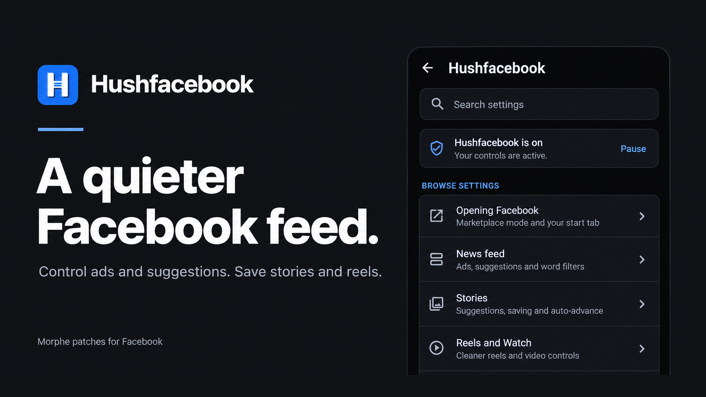

<p align="center">
  <a href="https://github.com/SysAdminDoc/Hushfacebook/releases"></a>
  <a href="LICENSE"></a>
  
  
  
</p>

<p align="center">
  <a href="https://ko-fi.com/X8K126YVER">
    
  </a>
</p>

# Hushfacebook

Hushfacebook is a Morphe patch bundle for Android that takes the clutter out of Facebook and puts useful controls back in your hands.

[Add to Morphe](https://morphe.software/add-source?github=SysAdminDoc%2FHushfacebook) | [Download a release](https://github.com/SysAdminDoc/Hushfacebook/releases/latest) | [Browse the patches](#patches)

## Why use it

- **A quieter feed.** Sponsored and suggested posts disappear, along with ads in Stories, Reels, and Watch.
- **Less tracking.** Selected ad telemetry and background ad downloads stop. Common trackers also come off links you open or share.
- **Media you can keep.** Save videos from stories, Reels, your feed and Watch at the best quality Facebook streams, or cap them at a lower one to save space. A save shows its progress and you can cancel it.
- **Controls that recover.** Every runtime feature has a switch. Pause mode, automatic safe mode, settings backups, and privacy-filtered diagnostics help when Facebook changes.

The project brings the Facebook patches from Morphe sources into one maintained bundle. Most started with [Andrew Liang's patches](https://github.com/andrewliang25/morphe-patches) and were rewritten here with fixes. The feed filter also removes promoted posts using the approach from [FroggoMorphePatches](https://github.com/SapitoSucio/FroggoMorphePatches). Its build, settings screen, and release checks share a foundation with the sister project [Hushfeed](https://github.com/SysAdminDoc/hushfeed). See [Where the patches come from](#where-the-patches-come-from) for the full provenance.

This project has no connection to Meta or to the Morphe project. Neither endorses it, and neither wrote it.

## Install

1. Install [Morphe Manager](https://github.com/MorpheApp/morphe-manager) 1.32.0 or newer.
2. Add Hushfacebook as a patch source: https://morphe.software/add-source?github=SysAdminDoc%2FHushfacebook
3. Get Facebook 580.0.0.51.74 from [APKMirror](https://www.apkmirror.com/apk/facebook-2/facebook/) and take the bundle labelled (arm64-v8a) (240-640dpi) (Android 11+), a .apkm file. That's build 475019344, the one these patches are checked against. APKMirror has several other arm64-v8a builds of the same version, and Morphe Manager warns about those ([Unsupported Version](#unsupported-version) explains why). Facebook 577.0.0.50.72 works too, in its (arm64-v8a) (360-480dpi) (Android 11+) bundle.
4. In Morphe Manager, pick that file, keep the default patch selection or change it, and patch.

There are 28 patches for `com.facebook.katana`. They're checked against the arm64-v8a builds for Android 11 and newer, and that's the only range Hushfacebook supports. Meta's builds for Android 9 (arm64-v8a) and Android 8 (armeabi-v7a) keep all of their code except a small startup part in a compressed archive, which the patcher can't read, so not one of the patches applies to them.

Facebook releases a new version about once a week, and each one renames most of its code. Every patch here finds what it changes by names Facebook keeps (its GraphQL model classes, log strings, enum names, manifest components) rather than by the names that change, which is why most of them carry over from one build to the next. When one doesn't, patching stops with a message naming what it couldn't find, instead of producing an app that quietly does nothing. Four patches work down a list of separate targets instead: Block background ad prefetch, Block ad telemetry, Disable Audience Network and Hide suggested and promoted posts. They stop only when a build has none of the list. If it has some, they apply to what's there and name each missing target in the patch log. Facebook 580 dropped six of the feed units the suggested posts patch looks for, so patching 580 lists those six. Please report a stop, or a missing target beyond those six.

## Keep your signing key

Morphe Manager signs the patched Facebook with a key it makes on your phone. Android installs an update over your patched Facebook only when the update carries that same key, so the key is what lets you update without losing Facebook's data.

- **Back it up right after your first patch.** In Morphe Manager, open Settings → System → Import & export → Signing key and tap Export. The Export button only appears once you've patched something. Keep the `Morphe.keystore` file somewhere private, because anyone who has it can sign an APK your phone will accept as an update. Morphe's settings backup doesn't include the key.
- **On a new phone, import it before you patch anything.** It's the same dialog. Reinstalling Morphe Manager or clearing its storage makes a new key, and without your exported copy nothing you patched earlier can be updated in place.
- **A different key means starting over.** Android refuses an update signed with another key. Unless you use Root Mount, the only way forward is to uninstall the patched Facebook, and that deletes its data. You'll have to sign in again, and anything kept only in the app is gone. A Root Mount install sits over Meta's own Facebook, so a key change doesn't touch its data.

Morphe's own guide is [Backup and keystore](https://github.com/MorpheApp/morphe-manager/blob/main/docs/backup-and-keystore.md).

## Android developer verification

Google is starting to require that Android apps come from registered developers. From September 30, 2026 the check runs in Brazil, Indonesia, Singapore and Thailand, and only on installs from seven app stores: Google Play, HONOR App Market, OPPO App Market, Galaxy Store, Palm Store, V-Appstore and GetApps ([Google's overview](https://developer.android.com/developer-verification)). Google's [FAQ](https://developer.android.com/developer-verification/guides/faq) says apps that are sideloaded aren't covered yet, and an install from Morphe Manager is a sideload. In 2027 Google plans to take the check global, to all apps on certified Android devices. Installs over ADB stay exempt.

Once it does reach sideloads, a patched Facebook won't count as registered. It keeps Meta's package name but carries your key, and for a package name someone else already holds, Google's answer is to use a different name or to file a request that goes through extra review, with no promised outcome. Two ways in stay open:

- **The advanced flow.** For people who accept the risk, Google added a setting to allow apps from unverified developers, under Settings → System → Developer options → Allow apps from unverified developers ([Google's help page](https://support.google.com/android/answer/17588095)). Turning it on takes a one-time 24-hour wait, and each install afterwards still shows a warning with an Install anyway button. When the wait is over, your phone asks whether to keep the setting on for seven days or indefinitely. Pick indefinitely, because once it lapses, updates to the patched Facebook fail. Google's pages describe the steps a little differently, so follow what your phone shows.
- **ADB from a computer.** Google says apps installed with `adb install` don't need verification and the 24-hour wait doesn't apply to them. In Morphe Manager, turn on Keep patched APKs under Settings → System, export the patched copy, and install it with `adb install -r <file>.apk`. The same-key rule above still applies.

Neither path can be tried against a real block until the check reaches sideloads, so neither has been tested here. If you get to try one, please open an issue saying what happened.

## Patches

| Patch | What it does |
|---|---|
| `AMOLED black theme` | Makes Facebook's dark mode black instead of dark grey. Turn on dark mode in Facebook first. |
| `Block ad telemetry` | Stops Facebook watching for screenshots of ads and reporting which apps you install for ad attribution. |
| `Block background ad prefetch` | Stops Facebook downloading ads and its ad model in the background. That saves data and battery. The ads don't take up storage either. |
| `Block background-return feed refresh` | Keeps your feed position when you return to Facebook within ten minutes. Pull to refresh and a fresh launch still work. |
| `Clean up Reels` | Hides the Follow button on reels and the comment and reaction previews under them. Buttons such as Remix, Use template, Add yours and Stars go too, and each part has its own switch. |
| `Disable Audience Network` | Stops Facebook serving ads to other apps. Those apps then show their own ads or none, and rewarded ads can fail. |
| `Don't send reel watch history` | Stops sending Facebook the list of reels you've watched. It's used to rank your Reels feed, and nobody else sees it. Reels you've already watched may come back in the feed. |
| `Download any reel` | Adds a Download button beside every reel. Videos save at the Download quality you set, best by default. |
| `Download any video` | Adds Download to phone to the menu of videos in the feed and in Watch, below Facebook's own items. Videos save at the Download quality you set, best by default. |
| `Download any story` | Adds Save to the menu of any story, including stories with music. Videos save at the Download quality you set, best by default. |
| `Hide AI-detected posts` | Removes feed posts that Facebook's own detection marked as made with AI, and the reels and Watch videos it flagged the same way. Both switches start off, so turn them on in Hushfacebook's settings. |
| `Hide sponsored posts` | Removes sponsored and promoted posts from the news feed, with no gap left behind. |
| `Hide sponsored reels` | Removes ads from Reels and Watch, including product banners over a reel and ads inside a video. |
| `Hide sponsored stories` | Removes ad cards from the story viewer, so swiping through stories only shows stories people posted. |
| `Hide Stories tray` | Removes the row of stories at the top of the news feed, Create story included. |
| `Hide Reels in the feed` | Removes the rows of reels between posts in the news feed, and the reels Facebook adds where your feed ends. A reel a friend posts stays. |
| `Hide suggested and promoted posts` | Removes what Facebook adds to the feed besides ads: "Suggested for you" posts, "People you may know", "Pages you may like" and its own upsells. In-feed surveys go too. Each kind has its own switch. |
| `Hushfacebook settings` | Adds Hushfacebook settings to Facebook. Long-press the Facebook logo at the top of your feed, or Facebook's launcher icon, to turn features on or off, pause Hushfacebook, save your switches to a file or load them, and export diagnostics. The licenses are there too. |
| `Install beside Meta's apps` | Lets the official Messenger, Facebook Lite, Business Suite and Workplace install beside the patched Facebook. Facebook shares two permissions with them, and Android lets only one signing key own a permission, so this patch renames Facebook's. A Root Mount install doesn't need it. |
| `Material You theme` | Gives Facebook's dark mode the colours of your wallpaper on Android 12 and newer, and a fixed blue palette on Android 11. Light mode stays as it is. Turn on dark mode in Facebook first. |
| `Open links in external browser` | Opens web links in your default browser instead of Facebook's in-app browser, without Facebook's click tracker or the fbclid tag it adds. Facebook pages still open in the app. |
| `Open on a chosen tab` | Opens Facebook on the tab you pick in Hushfacebook's settings when you start it from its icon. It's Marketplace unless you change it. Notifications and links still open where they lead. |
| `Restore screens on re-signed builds` | Makes profiles and some Settings pages open again on a re-signed build. A Root Mount install doesn't need this patch. |
| `Sanitize sharing links` | Takes Facebook's tracking tags, such as mibextid, off the links you share or copy. The post or reel a link opens stays the same. A facebook.com/share/ link is made for one share, so Facebook can still trace it back to you. |
| `Stop Story auto-advance` | Keeps each Story on screen until you tap or swipe. Turn the switch off for Facebook's timing. |
| `Stop update prompts` | Stops Facebook's own update prompts on a patched build, which can't install Meta's updates anyway. Meta App Manager's update promotions and the push message that has it look for an update go, and so do chat promotions aimed at older versions. |
| `Use the phone's emoji` | Draws emoji with your phone's own emoji font instead of Meta's, so the ones in posts and comments look like the ones on your keyboard. Reactions and stickers stay as they are. Restart Facebook after changing the switch. |
| `Use the system font` | Draws Facebook's own text in your phone's font instead of Meta's Optimistic typeface. Icons and emoji keep their fonts, and so does the text you put on a story. Restart Facebook after changing the switch. |

`Download any video`, `AMOLED black theme`, `Material You theme`, `Hide Stories tray`, `Hide Reels in the feed`, `Block background-return feed refresh`, `Stop Story auto-advance`, `Clean up Reels`, `Don't send reel watch history`, `Use the system font`, `Use the phone's emoji` and `Open on a chosen tab` are off by default. Everything else is on, though `Hide AI-detected posts` goes in with both its switches off. Nobody has checked either on a signed-in account yet, so each waits until you turn it on in Hushfacebook's settings: the feed one under News feed, the reels one under Reels and Watch.

### Dark mode themes

`Material You theme` colours Facebook's dark mode with the palette Android 12 and newer take from your wallpaper. Each grey keeps how light it is and picks up the palette's tint, and Facebook's blue links and highlights take its accent colour, so text stays as easy to read as Facebook made it. Android 11 has no wallpaper palette, so there it uses a fixed one built from Facebook's own blue. Light mode keeps Facebook's colours, and a colour the patch doesn't recognise, like one a server sends for a single screen, is left as it came.

The two themes work alone or together. With both, backgrounds stay true black and the palette colours the cards, text, icons and dividers on top. The Hushfacebook settings screen follows the palette as well, dark or light to match your phone. Without `Material You theme` it stays black.

While a save runs, a notification shows how far it's got, with a Cancel button. Facebook has to be allowed to post notifications for it. You can also turn off its "Hushfacebook saves" channel in Facebook's notification settings, and a save then runs with just a message when it starts and one when it ends. A cancelled save leaves nothing behind. One that Android stops half way leaves nothing in the gallery either, and the next save clears what it left in Facebook's cache.

## Settings

There are two ways in. Inside Facebook, long-press the Facebook logo at the top of your feed. A tap on it still does what Facebook made it do. From your home screen or app list, long-press Facebook's icon and tap **Hushfacebook**, the first item in that menu. If that item isn't there, open Facebook once so it can add it, then try again. Some launchers have no long-press menu at all, and the logo works there. When Facebook puts a long press of its own on the logo, such as the World Cup game it can open from there, Facebook's comes first and the icon is the way in. Related controls sit in rounded groups, with the build's status at the top. The screen lists the features this build carries:

- **Jump to a section**, the row under the status card, lists the page's sections. Pick one to go straight there. Back then takes you to where you were before it closes the page.
- A switch for each filter. Opening links in your browser and the download features have switches too. They take effect straight away, with no restart and no new patching, though a reel already on screen keeps the buttons it was built with, and a row of reels already in the feed stays until the feed loads fresh posts. In Reels and Watch, the sponsored and AI filters work on each batch of reels as Facebook loads it, so reels already loaded stay as they are until the next batch. The Stories tray is the one exception. Facebook builds the feed's fixed rows, the tray among them, once when the feed is set up, so that switch takes effect when Facebook restarts. The font and emoji switches wait for a restart too: text already on screen keeps its font until Facebook restarts. While Hushfacebook is paused, a change waits until it's back on.
- **Open on a chosen tab** and **Tab to open on**, when that patch is in. Starting Facebook from its icon opens the tab you pick, which is Marketplace unless you change it. Home, Feeds, Video, Friends, Notifications and Menu are the others. Hushfacebook asks Facebook for the tab the way Facebook's own shortcuts do, so notifications and links still open where they lead, and a tab your tab bar doesn't have opens Home instead. It only acts as Facebook starts. Once Facebook is open, the tab you tap stays, and coming back to a Facebook that's still running picks up where you were.
- **Download quality**, for every video you save: Best (the default), 1080p, 720p, 480p, 360p or Smallest. A save takes the best version at or under the one you pick, the way Facebook's own quality menu labels them. When a video has nothing that low, it takes the closest one above, so a save never fails over it. Photos always save at full size.
- **Save folder**, the one folder every save goes to. Videos land in `Movies/Facebook` and photos in `Pictures/Facebook` until you pick another name. It takes a folder name, not a path, so slashes and other characters a folder can't hold become underscores, and dots or spaces at either end are dropped.
- **Video file name**, the name each saved video gets. It starts as `FB_VID_{date}`, Facebook's own naming, so nothing changes until you edit it. `{date}` becomes the date and time of the save, like `20260925_143005`, `{video_id}` the video's number on Facebook, `{owner}` the name of whoever posted it and `{posted}` the day it went up, like `20260925`. So `{owner}_{posted}` saves a reel or a feed video as `Some Page_20260925.mp4`. When a save doesn't know one of them, it's left out. Android only numbers a repeated name so many times before it refuses the save, so a name with no token gets `_{date}` added, and one that counts on something the save doesn't know gets the date and time on the end. A name that's already in the save folder gets the time of the save on the end, so the second video one person posted that day saves as `Some Page_20260925_143005.mp4`. The poster's name is cleaned the way the folder is, and so is the whole name. A typed extension such as `.mp4` is dropped, since the saved file's type decides it, and photos keep Facebook's `FB_IMG_` names, which a video's name can't start with.
- **Check for new Hushfacebook releases**, under Updates. It's off until you turn it on. Then, once a day when Facebook starts, Hushfacebook asks GitHub for its latest release. When that's newer than yours, the status card at the top of the screen says so, along with the Facebook version it targets if that isn't the one you have. Update through Morphe Manager as usual. **Check now** asks straight away, with the switch on or off. Neither one downloads anything or posts a notification.
- **Pause Hushfacebook**. From the next start, every one of those switches acts as if it were off and Facebook's own code runs in its place. That includes the release check, so a paused Facebook doesn't ask GitHub by itself, though Check now still works. Debug logging keeps working, and your settings stay as they are. Pause can't undo what was set when you patched, and the screen lists what stays in.
- **Debug logging** and **Export diagnostic report**, for bug reports. The report leaves out links, account and post ids, session cookies and names. It names your Facebook build and says, for every patch but the settings entry itself, whether a switch runs it. For each of those whose hooks have run, it gives how often they ran and the first thing they couldn't find. Failed saves and links no browser opened are in it too, and once the release check has been used, when it last asked and what it found.
- **Licenses**, the notices of every project this is built on, with links you can open from the screen.

Morphe Manager can export your patch choices and your signing key, but not the switches on this screen. **Export settings** saves them, along with your download settings and the tab Facebook opens on, to a JSON file wherever you pick, and **Import settings** reads one back, on this phone or a new one. Before anything changes, the screen says how many switches the file would change, what it does to the download settings and the start tab, and how many entries in it this version doesn't know, which it skips. A damaged file or one from a newer Hushfacebook changes nothing. Pause and Debug logging stay out of the file, and so does anything about you or your phone. The release check stays out too, since a file someone shares shouldn't be able to put your phone online.

Everything Hushfacebook shows, from the settings screen to the save notification and the launcher shortcut, is in the language Facebook itself shows. That's the one you picked in Facebook's language settings, or your phone's if you never picked one. German, Spanish, Indonesian, Brazilian Portuguese and Turkish are translated, and any other language gets English. Hushfacebook never changes Facebook's language. The diagnostic report stays in English, so whoever reads it can, and so do the error toasts Debug logging shows. With TalkBack on, section titles are headings you can jump between, and each switch says it's a switch and whether it's on. Every row's text wraps in full, even at the largest text size.

Hushfacebook pauses itself when Facebook crashes or freezes within a minute of starting three times in a row, and the screen says so. If you can't reach the screen at all, an empty file named `hushfacebook-safe-mode` in `Android/data/com.facebook.katana/files` pauses it too. It has to be in that `files` folder, not the one above it. Safe mode is the same pause. It changes what the switches answer, but every patch's code stays in place, so if Facebook keeps closing in safe mode, the cause can be Facebook itself or any patch, whichever row of the table below it's in. To find it, patch again without the patch you suspect, or with fewer patches.

### What Pause turns off

| Patch | While paused |
|---|---|
| Hide sponsored posts | Off. Sponsored and promoted posts come back. |
| Hide suggested and promoted posts | Off. |
| Hide Stories tray | Off. The row of stories comes back. |
| Hide Reels in the feed | Off. The rows of reels come back. |
| Hide AI-detected posts | Off. Posts Facebook detected as made with AI come back, and so do the reels and videos it flagged. |
| Hide sponsored stories | Off. |
| Stop Story auto-advance | Off. Stories use Facebook's timing. |
| Hide sponsored reels | Partly. Ads inside a page of reels come back. Banners over a reel and mid-roll ads stay blocked, and so do ads the app adds on its own. |
| Clean up Reels | Off. Reels look the way Facebook draws them. |
| Don't send reel watch history | Off. Facebook gets the list of reels you watch again. |
| Use the system font | Off. Text goes back to Meta's font once Facebook restarts. |
| Use the phone's emoji | Off. Emoji go back to Meta's once Facebook restarts. |
| Open links in external browser | Off. Links open in Facebook's own browser. |
| Sanitize sharing links | Off. Links you share keep Facebook's tracking tags. |
| Stop update prompts | Off. Facebook's own update prompts come back. |
| Download any story | Off. Only your own stories have Save, and it's Facebook's own. |
| Download any reel | Off. Reels show only Facebook's own buttons. |
| Download any video | Off. Post menus show only Facebook's own items. |
| Open on a chosen tab | Off. Facebook opens on the tab it chooses. |
| Block ad telemetry, Block background ad prefetch, Disable Audience Network, AMOLED black theme, Material You theme, Restore screens on re-signed builds, Install beside Meta's apps | Stay. They were set when you patched, and changing one means patching again. |

## Known limitations

- **Other Meta apps.** A patched Facebook carries your key, not Meta's, and Android lets only one key own a permission. Messenger, Facebook Lite, Meta Business Suite and Workplace declare two of the permissions Facebook declares, so without `Install beside Meta's apps` whichever of them you install second fails with `INSTALL_FAILED_DUPLICATE_PERMISSION`. The patch is on by default and gives Facebook's two their own names. Instagram, Threads, WhatsApp and Messenger Kids don't declare either, so they were never affected. If you patched without it, patch again with it and install over the top. That's an ordinary update with the same key, so Facebook keeps its data, and Messenger installs afterwards. What a re-signed Facebook still can't share with Meta's own apps is what they only allow each other, so signing in to one of them through your Facebook account may not work. Morphe Manager's Root Mount keeps Meta's signature and has neither problem.
- **Links from other apps.** Android may stop sending facebook.com links to a re-signed Facebook, because the app's link verification is tied to Meta's signature.
- **Update notices from outside Facebook.** `Stop update prompts` reaches what Facebook's own code shows. Meta App Manager, the updater that ships on Samsung and some other phones, can still post its own notices about a Facebook it can't update, and those come from that app rather than from Facebook. Turn off its notifications in Android's settings, or disable it. Google Play won't update an app signed with another key, so a patched Facebook stays on the version you patched until you patch a newer one.
- **Two Facebook builds.** Patches are checked on one build each of Facebook 580.0.0.51.74 and 577.0.0.50.72, the bundles [Install](#install) names. Another build will often work, and Morphe Manager patches it once you tap Proceed anyway at its [Unsupported Version](#unsupported-version) warning, but it hasn't been checked.
- **System font.** `Use the system font` swaps the typefaces Facebook's own text engine hands out, which is where the feed, comments, menus and Bloks screens get theirs. A screen that loads a font another way keeps Meta's, and so do the icons and the text you add to a story.
- **Emoji.** `Use the phone's emoji` swaps the emoji font Facebook draws its text with. An emoji newer than your phone's emoji font shows up as a box, or as the emoji it's built from, the way it would in any other app. A few large emoji in chats are pictures Meta sends rather than text, so they keep Meta's look.
- **Downloads.** A feed or Watch video saves at the quality you set once Facebook has built its player, which happens when it starts playing. Until then Download to phone falls back to the single file the post names. When there's none, it asks you to play the video for a moment and try again. Stories encoded only as VP9 save at 360p, because Android can't join VP9 video with AAC sound in an MP4. Stories Facebook sends only as AV1 save at the lower single-file quality before Android 14, or on a phone that can't decode AV1. And a story that was already open when you turned Save any story on saves at 360p until you open it again.

## Troubleshooting

Morphe Manager does the patching and the install, so most of these messages come from it or from Android. They're the ones people have run into so far. If yours isn't here, see [Getting help](#getting-help).

### Unsupported Version

Manager shows this before it patches, usually with "This is a different build of the same version. The patches require a specific build" and a build number under the version. Facebook 580.0.0.51.74 comes in nine arm64-v8a builds on APKMirror, and Google Play hands each phone the one that fits its screen and Android version. Each build is compiled separately, with code of its own. Hushfacebook declares only the build its patches are checked against, 475019344, and Morphe's format takes one arm64 build per version, so the other eight all get this warning. On 577.0.0.50.72 the declared build is 474426275.

To get rid of it, download the (arm64-v8a) (240-640dpi) (Android 11+) bundle from APKMirror and pick that file. **Proceed anyway** patches the build you have with every patch you chose. One of them, build 475019283, took every patch and worked on a Galaxy S25, but the other builds haven't been tried. If a patch can't find what it changes, patching stops and names it.

The same check is why Manager won't offer the Facebook you installed from Google Play as the app to patch, unless it's that exact build.

### Unexpected end of ZLIB input stream

The full line is `java.io.EOFException: Unexpected end of ZLIB input stream`, with `SplitApkPreparer` a few lines below it. A .apkm is a zip holding several APKs. Manager could read its list of contents, but one of the APKs inside ends before it should, so the file is damaged. An interrupted or half-finished download is the usual cause. Delete the file and download the bundle again, and before you pick it, check that its size matches the one APKMirror's download page gives.

### No space left on device

The log says `ENOSPC (No space left on device)`: the phone ran out of storage part way through. Manager only warns when less than 1 GB is free, and Facebook needs more than that. One patch ran out with 1.08 GB left. Keep at least 2 GB free while you patch. On a computer, patching the 580 bundle with every patch takes about 1.3 GB of working space, and on a phone Manager also keeps its own copies of the bundle.

### Update required

Manager says the Hushfacebook bundle needs a newer patcher version. Your Morphe Manager is older than this bundle can work with, so update it to the version [Install](#install) names and patch again.

### Package conflict

At install, Manager says the Facebook already on your phone has to be uninstalled first ("Package conflict" or "Uninstall required"). Android only installs an update signed with the same key as the app it replaces, and Meta's Facebook carries Meta's key. Uninstalling deletes what Facebook keeps on the phone, so you'll sign in again afterwards. Your account itself isn't touched. A Facebook you patched before with a different key hits the same wall, and [Keep your signing key](#keep-your-signing-key) covers that. A Root Mount install on a rooted phone goes over Meta's app and doesn't ask.

### INSTALL_FAILED_DUPLICATE_PERMISSION

Messenger, Facebook Lite, Meta Business Suite and Workplace declare two permissions under the same names as Facebook, and Android lets only one signing key own each name, so whichever of the two is installed second fails. `Install beside Meta's apps` renames Facebook's two, and it's on by default. If you patched without it, patch again with it and install the update over the top, then install the other app. [Known limitations](#known-limitations) has more.

### Patching stops on one patch

A patch couldn't find the code it changes, and the log names the patch and what it looked for. That happens when the file isn't one of the builds Hushfacebook declares, because Facebook moves its code around from one build to the next. Pick the bundle [Install](#install) names, or patch without that one. If it stops on the declared bundle, please [report it](https://github.com/SysAdminDoc/Hushfacebook/issues/new?template=bug_report.yml) and paste the log.

### The log says a patch goes on without something

A line like `WARNING: Block ad telemetry: com.facebook.ads.AdsScreenshotDetector isn't in this Facebook build. The patch goes on with the 3 of 4 ad telemetry classes it found.` comes from one of the four patches that work down a list of separate targets. That patch still applied, and it covers the rest of its list. Patching Facebook 580 gives six of these from Hide suggested and promoted posts, for feed units Facebook took out of that version. Any other one on a declared bundle is worth [reporting](https://github.com/SysAdminDoc/Hushfacebook/issues/new?template=bug_report.yml) with the log.

## Your Facebook account

People ask whether a patched Facebook puts their account at risk. Here's what we know.

**Can Meta tell?** Assume it can. A patched Facebook is signed with your key rather than Meta's, and Facebook's own code checks that signature in places, which is why `Restore screens on re-signed builds` exists. Some of what Facebook normally sends home stops too, like the ad reports `Block ad telemetry` turns off and the click tracker on links you open in your browser. Pick `Don't send reel watch history` and the list of reels you've watched stops as well. Meta could notice those going quiet.

**What stays the same?** Your feed, stories and reels still come from Meta's servers, ads included, and Hushfacebook hides things on your phone after they arrive. It doesn't post, like, follow or message on your behalf, and it doesn't change how you sign in. A video you save comes from the same Meta server the player streams it from, and Hushfacebook itself sends nothing anywhere, apart from asking GitHub about new releases if you turn that check on (see [Privacy](#privacy)).

**Could my account be suspended?** Nobody can promise it won't be. Meta's [Terms of Service](https://www.facebook.com/terms/) ask for its written permission before anyone modifies its apps (section 3.4), and they let Meta suspend or disable an account it decides has seriously or repeatedly broken them (section 4.2). We haven't heard of an account suspended over Hushfacebook. It's a young project, though, so that doesn't prove much.

**Is it safe to make a new account in the patched app?** It carries the same risk as using any account there. The sign-up screens are Facebook's own and no patch changes them, but a brand-new account may be asked to confirm a phone number or who you are, whatever app it's made in. If you'd rather not risk the account you care about, try Hushfacebook with a fresh test account first. That's the safer way to find out.

## Getting help

Questions about setting up or whether a Facebook build works belong in [Discussions](https://github.com/SysAdminDoc/Hushfacebook/discussions), where an answer helps the next person too. For something that's broken, use the [bug form](https://github.com/SysAdminDoc/Hushfacebook/issues/new?template=bug_report.yml) and add the diagnostic report it asks for, since that answers most of what we'd ask. Ideas go on the [feature form](https://github.com/SysAdminDoc/Hushfacebook/issues/new?template=feature_request.yml). When Morphe Manager itself misbehaves with every app, not only Facebook, [Morphe's own tracker](https://github.com/MorpheApp/morphe-manager/issues) is the place. Releases are published here, and the add-source link under [Install](#install) always fetches the newest one.

## Privacy

Hushfacebook doesn't collect anything and has no server. The patched app goes online on Hushfacebook's behalf for two things only. The first is downloading something you asked it to save, from the same Facebook address the player streams it from. A save only follows HTTPS addresses on Meta's media servers (fbcdn.net, fbsbx.com and cdninstagram.com), redirects included, and the file lands in Facebook's cache first. It goes to your gallery only once it's whole and under 512 MB, and only if it's really a photo or video.

The second is the release check, and it's off until you turn it on. Once it's on, Hushfacebook asks `api.github.com` for its latest release at most once a day, when Facebook starts, and again whenever you tap Check now. That's a plain HTTPS request with `Hushfacebook/<version>` as its User-Agent, and it carries no cookies and nothing about you or your phone. It only follows a redirect that stays on api.github.com, and it reads at most 256 KB of the answer. GitHub sees your IP address, as any site you visit does. From the answer, Hushfacebook keeps the version number and, if the notes name one, the Facebook version the release targets. Nothing else is kept.

## Where the patches come from

| Source | What came from it |
|---|---|
| [andrewliang25/morphe-patches](https://github.com/andrewliang25/morphe-patches) at `5db2e57` | Every Facebook patch here, from the ad filters to the story and reel downloads, except Sanitize sharing links, Hide Stories tray, Hide Reels in the feed, Clean up Reels, Hide AI-detected posts, Download any video, Material You theme, Block background-return feed refresh, Stop Story auto-advance, Stop update prompts, Use the system font, Use the phone's emoji, Don't send reel watch history, Install beside Meta's apps and Hushfacebook settings, which were written here. The ported ones were rewritten rather than copied commit by commit, and the fixes are listed in the [changelog](CHANGELOG.md). |
| [SapitoSucio/FroggoMorphePatches](https://github.com/SapitoSucio/FroggoMorphePatches) | The idea of dropping promoted posts beside sponsored ones, and of hiding posts Facebook detected as AI, which its 573 filter reads from the same flag. Andrew Liang credits it for some ideas and implementations too. |
| [SysAdminDoc/hushfeed](https://github.com/SysAdminDoc/hushfeed) at `1f1f81a` | The Gradle build, the shared extension library with its settings screen and diagnostics, the pause, the bytecode helpers, and the checks that apply every patch to real Facebook builds before a release. The settings export and import came later, from `bcc57ee`. |
| [Morphe](https://github.com/MorpheApp) and [ReVanced](https://gitlab.com/ReVanced/revanced-patches) | The patcher and the patch template. Both of the above grew from their code. |

Every source file says where it came from in its header, and [provenance.json](provenance.json) maps each file to the project and commit it came from, with its licence. [docs/sources.md](docs/sources.md) covers the other Facebook and Messenger patch sources: what each one does and what this bundle took from it. The ledger behind that page, [sources/facebook-sources.json](sources/facebook-sources.json), pins every source's branches and licence, and code is only ported from a source it lists as adopted.

## Building from source

You need JDK 17 or newer and the Android SDK. The Morphe patcher comes from GitHub Packages, so you also need a GitHub token with `read:packages`.

```bash
export GITHUB_ACTOR=<your GitHub user>
export GITHUB_TOKEN=<a token with read:packages>
./gradlew :patches:generatePatchesList
./gradlew :patches:buildAndroid
```

The bundle lands in `patches/build/release/patches-<version>.mpp`, beside its SHA-256 and `patches-<version>.cdx.json`. That's a CycloneDX SBOM of every library that goes into the bundle, at the version Gradle resolved, and releases from 0.1.3 on publish it beside the bundle. Run `generatePatchesList` before `buildAndroid`, or the bundle loses its Android payload.

Tests: `./gradlew :patches:test :extensions:facebook:testDebugUnitTest`. Set `HUSHFACEBOOK_FIXTURE_DIR` to a folder holding the Facebook bundles to run the tests that read real builds. Without it they skip and say so.

To apply every patch to a real build and check the result, run `scripts/verify-all-patches.ps1 -Apk <facebook .apkm> -DesktopJar <morphe-desktop jar> -WorkDir <scratch folder>`. It holds the patched resource table to Meta's. It also checks the code the patches inject for the shapes Android's verifier rejects, such as branches into the middle of an instruction, calls with the wrong registers, values read at the wrong width and broken try ranges. And it requires exactly one feed guard, in `addNewEdgeToCollection`, because a guard anywhere else filters nothing. That last rule is this project's, not the verifier's. [CONTRIBUTING.md](CONTRIBUTING.md) has the rest.

## License

[GPL-3.0](LICENSE), with the Morphe section 7 notices carried in [NOTICE](NOTICE). Facebook, Messenger and Meta are trademarks of Meta Platforms, Inc.
