<p align="center">
  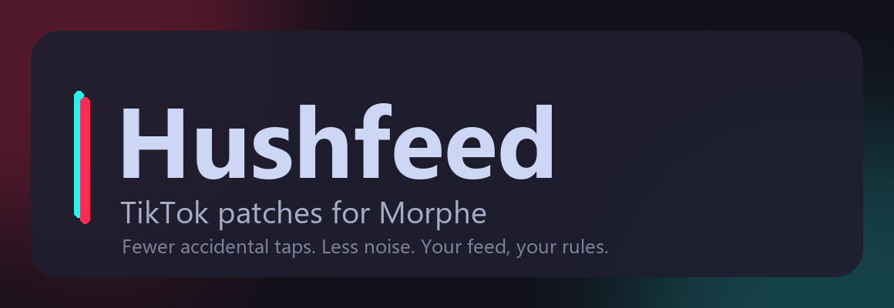
</p>

<p align="center">
  <a href="CHANGELOG.md"></a>
  <a href="LICENSE"></a>
  <a href="https://www.android.com/"></a>
  <a href="https://github.com/MorpheApp/morphe-manager"></a>
  <a href="https://www.apkmirror.com/apk/tiktok-pte-ltd/tik-tok-including-musical-ly/tiktok-46-2-3-release/tiktok-46-2-3-android-apk-download/"></a>
</p>

# Hushfeed

Hushfeed is a set of TikTok patches for [Morphe](https://github.com/MorpheApp/morphe-manager). It cuts down accidental taps and gives you more say over what the app puts in front of you. It runs on the global TikTok build, `com.zhiliaoapp.musically`, version [46.2.3](https://www.apkmirror.com/apk/tiktok-pte-ltd/tik-tok-including-musical-ly/tiktok-46-2-3-release/tiktok-46-2-3-android-apk-download/).

It started as a private fork of [icysymmetra's Metra patches](https://github.com/icysymmetra/tiktok-patches-for-morphe) and grew past them. Everything upstream ships is still here, along with the work from other community bundles and a long list of additions of its own. That comes to 68 patches, each with its own switch in a settings screen that follows your phone's language.

## What it does

- **Block from the feed.** One tap blocks whoever posted the video you're watching, with an undo banner. A second button blocks the current sound. A Not interested button sits beside them.
- **Guard rails against accidental taps.** Follow and like need a second tap within four seconds. Sending a video to a friend from the share sheet does too. Long press and double tap can be remapped or switched off.
- **A quieter feed.** Hide ads, Shop, livestreams, LIVE replays, stories, image posts, paid partnerships, AI labelled videos, verified accounts, series, playlists, promotional music, videos you've already seen, and anything matching your own caption words, creator handles, sound names, length or engagement rules, the country it was posted from, or a pattern over creator names.
- **A quieter screen.** Hide the caption, the music line, the action column, survey cards, the status bar, the visual search prompt, the Live entrance, floating promotions and the CAPTCHA puzzles. Clear display can turn itself on after each video starts.
- **An inbox you choose.** A switch for every Inbox row and header control, stories tray, suggested accounts, message requests and conversations.
- **Comments on your terms.** Keyword and account filters, thumbs down that blocks the commenter, quick reactions and brand animations hidden, comments beside the video on wide screens, translation with language exclusions.
- **Downloads worth keeping.** Pick the quality, save original photos, combine separate audio tracks when TikTok serves them apart, save subtitles as SRT beside the video, name files with tokens, choose a folder per media type, remove the watermark.
- **Playback the way you want it.** Default speed and a custom speed menu, quality choice with a separate cap on mobile data, stop looping, resume after scrolling, automatic advance, the native seekbar and its thumbnail, hold and slide for 2x.
- **Privacy.** Ghost mode stops story view, profile view and typing reports. Telemetry to ByteDance, AppsFlyer and Firebase can be switched off. Screenshots and Circle to Search work again.
- **Region.** SIM, locale and timezone presets, with an optional store region override.
- **Under the hood.** Feature Gate Lab exposes TikTok's own A/B flags with recording and typed overrides. Settings back up to a JSON file with restore, reset and undo. Diagnostics export a report.

The block, sound and Not interested controls, rendered in a local UI test:

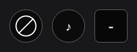

## Install

1. Get the TikTok 46.2.3 APK. Google Play only offers the newest build, so take it from [APKMirror](https://www.apkmirror.com/apk/tiktok-pte-ltd/tik-tok-including-musical-ly/tiktok-46-2-3-release/tiktok-46-2-3-android-apk-download/).
2. Add Hushfeed as a source in Morphe Manager. The quickest way is this link on the phone: [Add Hushfeed to Morphe](https://morphe.software/add-source?github=SysAdminDoc/hushfeed). You can also download `patches-0.19.0.mpp` from the [latest release](https://github.com/SysAdminDoc/hushfeed/releases/latest) and load it as a local bundle.
3. Pick the patches you want and patch the APK. Keep the manager's existing signing key so TikTok stays logged in across updates. Every patch here fits the manager's 640 MB memory default except AMOLED dark theme, which rewrites TikTok's color resources and needs the limit raised to 768 MB. If patching stops with an out of memory error, that setting is the one to raise.
4. Open TikTok, go to Settings and privacy, and tap Hushfeed. Every patch you selected has its switches there.

The Settings patch adds the entry point and is selected by default. Deselect it and the other patches still apply, but their switches have nowhere to live. `patches-bundle.json` in the repository root is the source index Morphe reads for the published bundle.

<br>
## Patches

| Patch | Description |
|---|---|
| `Automatic video advance` | Keeps native automatic advance enabled. TikTok still checks pauses, dialogs, gestures and whether another video is available. Turn it off in Playback to stop advance started by this option. |
| `Foldable split comment view` | Enables comments beside the video from a configurable window width (600 dp by default). Off by default, with multi-window and picture-in-picture restrictions preserved. Restart after changing its settings or unfolding if TikTok keeps the old layout. |
| `Subtitle tools` | Saves captions as SRT files beside downloaded videos. Choose original, device or all available languages, adjust caption size and background, and keep the current caption visible in clear display. |
| `Playback quality` | Chooses the lowest, highest or a target video quality for regular and adaptive playback. A second choice caps quality on mobile data, and only ever lowers it. Download quality has its own setting. |
| `Advanced downloads` | Selects a video quality or target resolution and combines separate audio tracks when needed. Optional extras save Photo Mode images straight from their source URLs, keep a video's sound as its own .m4a, save a video without its sound, hand the link to a downloader you already use, and save a profile picture at full size or a story from a long press. |
| `Allow Duet and Stitch` | Ignores the creator's Duet and Stitch setting so the entries appear. Every other check the app makes still applies, and whether the upload is accepted is the server's decision. |
| `Uncap the refresh rate` | Stops TikTok asking the screen to run slower than it can, which it does by asking for the frame rate of the video. A request that is not slower than the screen is left alone. |
| `Fit video to the screen` | Shows the whole of a video instead of cropping it to the window. Nothing changes on a tall phone. On a folding phone opened up, a squarer screen or a split view the sides or the ends stop being cut off. |
| `Notification controls` | Adds a switch for the notification saying somebody new followed you, and one for message streaks. The follower notification is dropped before Android is asked to post it; everything else in the drawer is untouched. |
| `Long-press controls` | Lets a long press on a video keep TikTok's own action, do nothing, or open the video's comments, and can turn a press on the left or right third of the screen into a jump back or forward by however many seconds you pick. Brings `Double-tap controls` with it, which supplies the comment control. |
| `Double-tap controls` | Changes feed double taps to do nothing or open comments for the current video. TikTok's normal action is the default. |
| `Confirm feed interactions` | Adds optional second-tap protection to Follow and the like heart. The red ring expires after four seconds and resets when the video changes. |
| `AMOLED dark theme` | Replaces the dark background palette with black or a chosen opaque color. Select the patch and its color in the patcher. Light theme colors stay unchanged. |
| `Always show publish date` | Keeps the video's publish date visible in its author information. |
| `Not interested button` | Sends feedback about the current video through TikTok's own service. The button works independently of the block switch. |
| `Block author button` | Adds a button to the video player that blocks the account that posted the current video in one tap, with an undo banner. Long press it to move it. A second button blocks the current sound. |
| `Comment tools` | Hides comments containing chosen words or from chosen accounts, and turns the thumbs down on each comment into a block button. A switch hides comments made of an image or a sticker rather than words, and another puts a box above the comments that narrows them to what you are looking for. |
| `Copy comments without username` | Copies only the comment text without including the creator's username. |
| `Custom offline videos limit` | Adds a custom entry to TikTok's offline videos menu with a configurable limit from 1 to 1000 videos. Values outside the range use the nearest valid limit. |
| `Disable login requirement` | Removes TikTok's mandatory login gate from supported flows. |
| `Disable long-press quick share` | Keeps long-pressing Share from opening TikTok's quick-share interaction. |
| `Disable long-press repost` | Keeps holding Like from opening TikTok's repost action without disabling TikTok's wider repost and upvote systems. |
| `Disable screen capture detection` | Prevents TikTok from detecting screenshots and screen recordings. |
| `Allow screenshots and Circle to Search` | Removes secure window flags and the native Circle to Search block. Off by default. Restart after changing the setting. |
| `Diagnostic tools` | Adds optional structured Morphe logs, TikTok crash capture, and clipboard or file report export. |
| `Downloads` | Adds watermark-free downloads, filename templates, and comment sticker saving. An animated sticker is written as MP4, GIF, or the WebP TikTok sent, whichever you pick. |
| `Enable Live search` | Shows TikTok's search entry in the Live drawer where supported. |
| `Enable non-personalized search` | Uses TikTok's non-personalized search mode instead of its saved account choice. |
| `Hide search suggestions` | Hides the searches TikTok offers on the search page before you type, and stops it fetching them. Your own search history stays. |
| `Feature Gate Lab` | Adds a searchable menu for viewing and overriding supported TikTok feature flags and configuration values. Client-side overrides cannot bypass server enforcement. |
| `Feature Gate Recorder` | Records gate reads while you use a feature, then shows new and changed values. Save the full report as JSON or copy a smaller report. |
| `Follow diagnostics` | Reads what the server said about a follow. TikTok answers a refused follow like a successful one, so this reports the refusal and its reason once per session, and writes the whole exchange to the diagnostic report when logging is on. |
| `Feed filter` | Hides feed ads, TikTok Shop items, livestreams, stories, photo posts, the playlist bar, the floating event badge, inserted cards, the countdown lock on short drama adverts, and videos outside configured view or like ranges, with optional filtering of cached and offline FYP fallback videos. Sponsored cards are also dropped from the profile video viewer, the search grids and the Friends tab. |
| `Feed tab navigation` | Controls which loaded top and bottom navigation tabs remain visible, blocks newly added tabs when requested, and can hide the Tako AI bubble. |
| `Fix Google login` | Restores Google account sign-in after patching. |
| `Hide already seen videos` | Keeps a local record of what you have watched and drops those videos from later feed pages. |
| `Ghost mode` | Stops TikTok reporting that you viewed a story or a profile, or that you are typing. Online status is unchanged. |
| `Hide BdTuring CAPTCHA popups` | Hides TikTok's risk control CAPTCHA dialog, which the browsing CAPTCHA patch does not cover. Off by default. |
| `Hide comment popup ads` | Stops the brand animation that plays over the comment sheet when a comment matches an advertiser's trigger word or emoji. |
| `Hide CAPTCHA popups` | Hides non-account verification puzzle dialogs, including those shown while browsing LIVE. Account verification stays available, server checks are not bypassed, and a puzzle raised over a follow, like, comment or repost is always shown so those actions cannot fail in silence. |
| `Hide floating promotions` | Removes floating promotional badges, coin icons, and timer banners from the Home feed. |
| `Hide video overlays` | Hides the "Search this image" prompt over videos, the Live entrance in the top left corner, the caption, the music line, the action column on the right, the survey cards and the status bar, each with its own switch. Each of the six buttons in the right column has its own switch as well. |
| `Share sheet tools` | Adds a second tap before sending to a friend. Filters sharing apps and video actions before the panel builds, hides whole rows, and keeps the custom name list. |
| `Hide feed LIVE button` | Stops the LIVE button at the top left of the feed from being built. Shares its switch with the Live entrance option. |
| `Hide feed follow button` | Hides the plus button under the creator's avatar on the action rail. |
| `Hide feed save button` | Hides the save button on the action rail. |
| `Hide feed search button` | Hides the search button at the top right of the feed. |
| `Disable telemetry` | Stops ByteDance AppLog analytics, AppsFlyer attribution, BDLocation uploads, explicit Firebase screen reports and crash reporting from being sent. |
| `Hide suggested accounts` | Stops the suggested accounts list from being built on the Activity, New followers and Inbox pages. |
| `Hide inbox stories` | Stops the stories tray at the top of the Inbox from being built. |
| `Expand activity list` | Shows the whole Activity and New followers lists instead of stopping at a View all button. |
| `Hide inbox items` | Adds a switch for each row and header control on the Inbox tab, plus a Clear all control for suggested accounts. |
| `Hide quick comment reactions` | Hides TikTok's exposed quick emoji row in supported comment inputs. |
| `Hold-and-slide 2x lock` | Enables TikTok's native hold, slide down, and release gesture for locking playback at 2x speed. |
| `Open external links directly` | Opens profile and story website links in the system browser instead of TikTok's in-app browser. |
| `Playback speed` | Remembers the selected speed or starts every new video at a chosen default. The speed menu accepts up to eight choices from 0.5x to 3x, including 2.5x. |
| `Remember clear display` | Remembers clear display between videos, or enters it automatically after a chosen delay. Tap to restore the controls. |
| `Resume videos after scrolling` | Restores a video's prior playback position when returning to it in the feed. |
| `Region spoof` | Matches locale country, timezone and native region getters to the SIM preset while preserving the interface language. Store-region overrides have a separate experimental switch. IP address and server account rules still apply. |
| `SIM spoof` | Replaces SIM country and operator values reported to TikTok and provides country presets. TikTok may still use IP address, account history, language, and other region signals. |
| `Sanitize sharing links` | Removes tracking parameters from shared links, and can put a host of your choosing in place of tiktok.com so a link shows a preview where TikTok's own does not. |
| `Settings` | Adds the Hushfeed settings screen inside TikTok. The screen follows the phone's language where a translation exists; English, German and Indonesian ship today. |
| `Hide content warnings` | Adds an option to play videos TikTok has classified without the warning overlay asking to be tapped through first. |
| `Show author region` | Adds an option to show the country a video was posted from next to the creator's name on the feed. A second switch shows the creator's @handle in place of their display name. |
| `Show seekbar` | Shows TikTok's native video seekbar where it would normally be hidden. |
| `Show seekbar thumbnail` | Shows TikTok's video preview thumbnail while dragging the seekbar. |
| `Stop video looping` | Stops a completed video instead of automatically replaying it. |
| `Translate comments` | Adds comment translation controls using TikTok's translation system, with selectable language exclusions and one in-flight request per loaded batch. |

## Settings tour

The settings pages use grouped controls on an AMOLED background. Light mode follows the phone, and larger text wraps across lines without clipping headers, captions or editor labels. Use Search settings at the top to find translated titles or descriptions and jump to the original control. These screenshots come from native Android views rendered by the local test suite. Enabled controls and values are test fixtures.

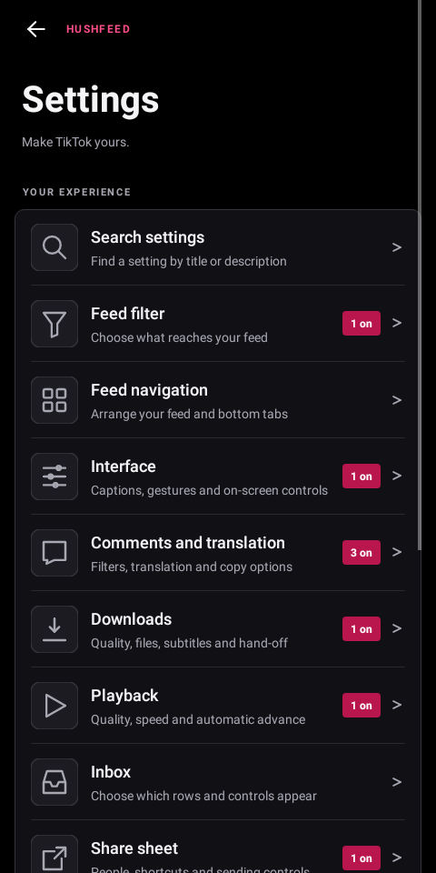 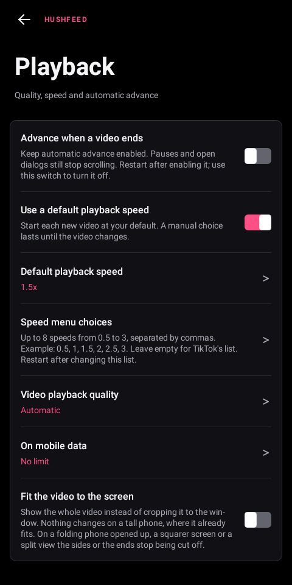 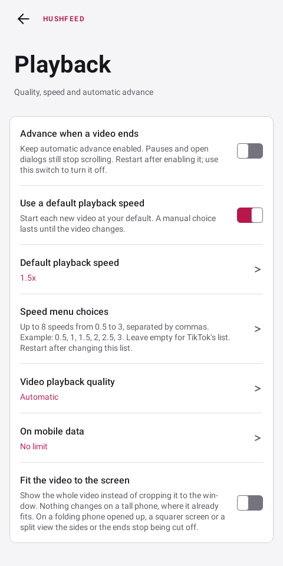

<details>
<summary>Every settings page</summary>

| Page | Screenshot |
|---|---|
| Feed filter | [View](assets/settings/feed_filter.png) |
| Feed navigation | [View](assets/settings/feed_navigation.png) |
| Interface | [View](assets/settings/interface.png) |
| Comments and translation | [View](assets/settings/comments.png) |
| Downloads | [View](assets/settings/downloads.png) |
| Playback | [View](assets/settings/playback.png) |
| Inbox | [View](assets/settings/inbox.png) |
| Share sheet | [View](assets/settings/share.png) |
| Region settings | [View](assets/settings/region.png) |
| App behavior | [View](assets/settings/behavior.png) |
| Diagnostics | [View](assets/settings/diagnostics.png) |
| Settings search | [View](assets/settings/search.png) |
| Feature Gate Lab | [View](assets/settings/lab.png) |
| Gate details | [View](assets/settings/gate_details.png) |
| Gate recording | [View](assets/settings/gate_recording.png) |

</details>

The native choice dialogs keep one indicator at the leading edge. These renders cover selected and
unselected rows in both themes:

| Dialog | Dark | Light |
|---|---|---|
| Single choice | [View](assets/settings/dialog-single-dark.png) | [View](assets/settings/dialog-single-light.png) |
| Multiple choice | [View](assets/settings/dialog-multi-dark.png) | [View](assets/settings/dialog-multi-light.png) |


Select `Subtitle tools` in the patcher, then enable subtitle downloads in Downloads. Captioned videos and their SRT files share the same filename stem. Language names can use Unicode, and filename collisions keep separate tracks. Android 11 and later save the pair in Movies; Android 10 uses Download. The selected subfolder still applies. A failed subtitle transfer leaves the saved video intact and reports the partial result.

Caption appearance and the clear display option are in Interface:

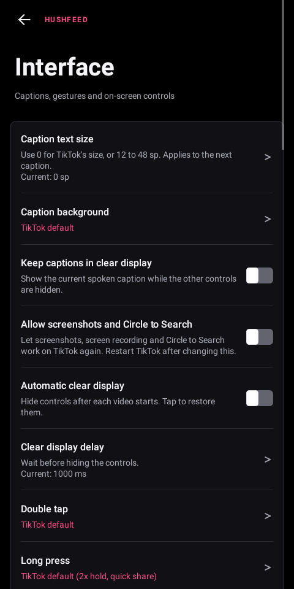 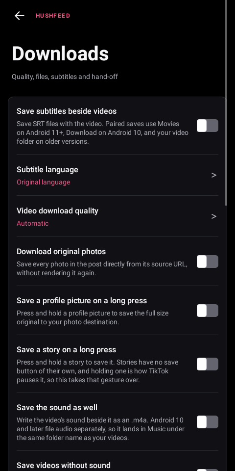

Inbox category switches identify New followers, Activity, Archive, Tako and Shop from native row data. They work with translated labels. Turning a switch off restores an already loaded row on the next layout.

<br>

Playback has an optional default speed for every new video. A manual choice lasts until you change videos. To add 2.5x, enter it in Speed menu choices and restart TikTok; an empty list restores TikTok's menu.

Select `Automatic video advance` in the patcher, then enable Advance when a video ends in Playback and restart. The option re-enables native auto-scroll if TikTok turns it off. Use the Playback switch to disable it.

Foldable controls are in App behavior. Settings save immediately. A notification tells you when to restart TikTok.

Numeric feed limits show their actual unit with language-aware singular and plural labels.

Native settings pickers use one radio indicator for a single choice and one checkbox for multiple choices. The selected state remains accessible and is saved through Android's native list adapter.

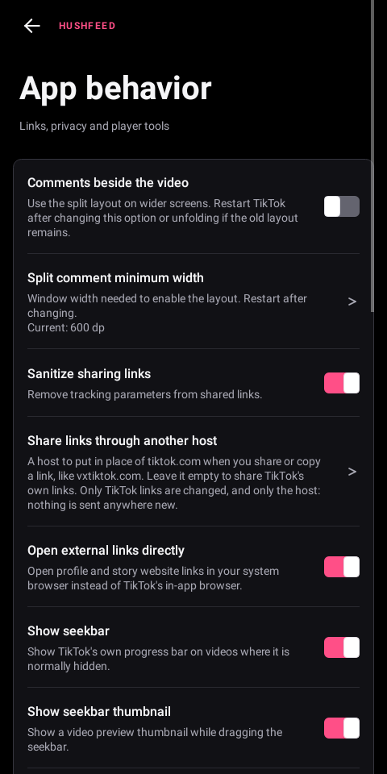

Region spoof requires Override SIM details plus Match locale and timezone to country in Region settings. Each built-in country preset supplies a timezone. Country codes must be two ASCII letters. Locale scripts and extensions are retained, including when a legacy variant needs fallback handling. Restart TikTok after changing these settings. Enable the separate store-region option only if needed; it can affect search. GPS and the network address stay unchanged.

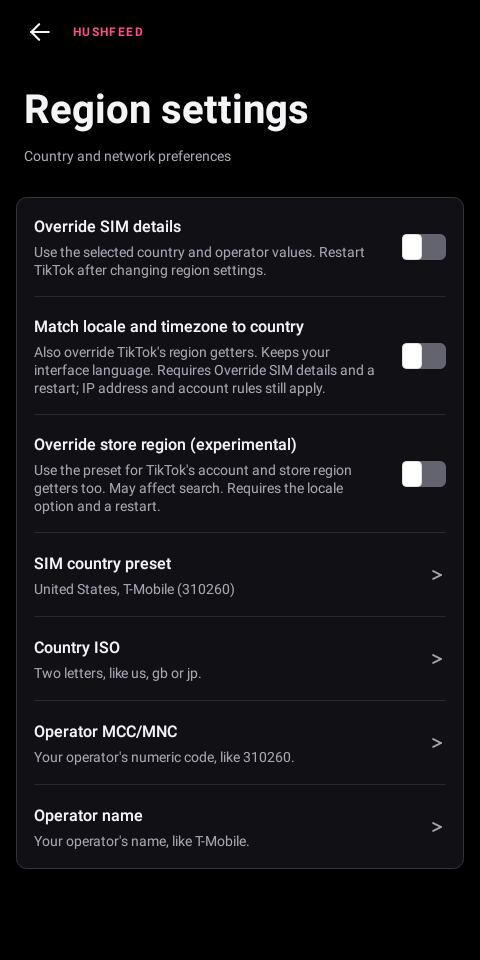

Diagnostics includes Back up settings, Restore settings and Reset settings even without the logging patch. Backups include patch preferences and Feature Gate Lab rules with their enabled state. Choose a JSON file through Android's file picker. Invalid files leave settings unchanged. Restore and reset keep one undo copy inside TikTok; export a backup first if you plan to clear app data or reinstall, since that removes the undo copy too. Restart after restoring or resetting.

Backups record which settings they contain, so missing entries are rejected. A complete backup from an older build uses defaults for controls added later. If saving fails, recovery attempts both preference stores and keeps the undo copy available.

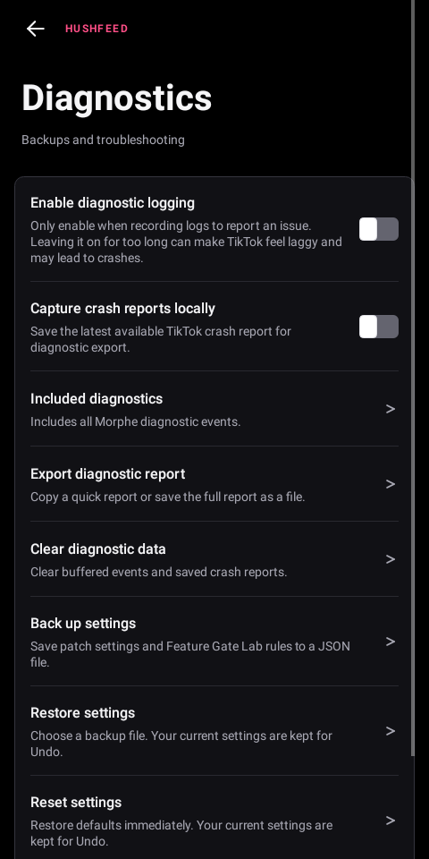

Feature Gate Lab saves its master switch immediately. Its menu can reset overrides while the switch is off, reset all Lab data, or undo the last reset or import. Imported values stay disabled. Changes run in the background and report their result with a notification. The undo copy stores Lab configuration privately; full-reset undo also restores captured observations during the same app run. Other patch preferences are unchanged.

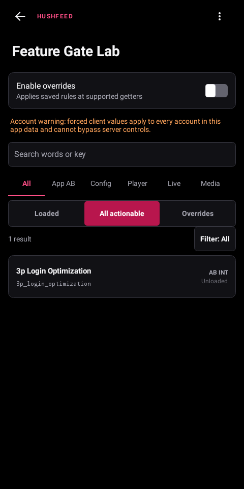

<br>

## Building from source

Use JDK 21 or newer and an Android SDK configured through `local.properties`. GitHub Packages needs `GITHUB_ACTOR` and a `GITHUB_TOKEN` with `read:packages` access for the Morphe dependencies.

Run the runtime tests, then build the Morphe patch bundle and metadata:

```bash
./gradlew :extensions:tiktok:test
./gradlew :patches:generatePatchesList
pwsh -File scripts/validate-release-facts.ps1
./gradlew :patches:buildAndroid
```

Run these tasks in this order. The Android build finishes with `verifyBundle`, which checks the patch list and all three DEX payloads against the checksum recorded by the Android build. You can also run `./gradlew :patches:verifyBundle` to inspect an existing bundle without rebuilding it.

Gradle dependency verification is checked in at `gradle/verification-metadata.xml`. It records the reviewed release graph with SHA-256 checksums, so a changed cached artifact fails during dependency resolution. `mavenLocal()` is disabled by default, including the repository the Morphe settings plugin adds. Use `-PallowMavenLocal=true` only while developing a local plugin artifact, and leave it off for release builds. The wrapper distribution checksum in `gradle/wrapper/gradle-wrapper.properties` matches Gradle's published 9.7.1 binary.

To save offscreen screenshots, run `./gradlew :extensions:tiktok:test -PscreenshotDir=<absolute-directory>`. The suite opens every settings section in dark and light themes, saves a value through the native picker, and exercises Lab search and overrides. A German fixture checks larger text at 360 dp width.

Runtime tests cover feed marker and sound filters using both getter and field model shapes. Empty metadata and unrelated ids remain eligible; matching markers and sound phrases are rejected by their enabled filters.
Legacy settings import tests cover complete JSON and older text fragments, rejecting invalid values before any preference changes.
Numeric tokens retain their precision until validation, and literal NUL characters cannot hide trailing data in imports or undo files.

The generated bundle is written to:

```text
patches/build/libs/patches-<version>.mpp
```

Morphe reads `patches-bundle.json` from this repository, downloads the `.mpp` release asset listed there, and loads the patch metadata from that bundle.

### Adding a language to the settings screen

The English text in the code is the key. Each language is one tab separated table under `extensions/tiktok/src/main/l10n/`, `de.tsv` for German and `in.tsv` for Indonesian, with the English on the left and the translation on the right. Copy one to `<language code>.tsv`, translate the right hand column, then run:

```bash
python scripts/gen-l10n.py
./gradlew :extensions:tiktok:test
```

The script writes `L10nTranslations.java`, which the extension carries with its own code, and the tests fail on any settings text that has no entry or that a language is missing, so a gap shows up before it ships. Name the file with the code Android reports, which for the three languages that have two is the older one: `in` rather than `id`. The generator makes the table answer to both. The translations used to go into TikTok's own resources, but merging a few hundred strings into a table of 74,765 pushed patching past the memory Morphe Manager allows by default.

<br>

<br>

## Supported target

- App: TikTok, the global package `com.zhiliaoapp.musically`
- Version: [46.2.3](https://www.apkmirror.com/apk/tiktok-pte-ltd/tik-tok-including-musical-ly/tiktok-46-2-3-release/tiktok-46-2-3-android-apk-download/), released 28 July 2026

### Why you have to fetch that APK yourself

Google Play only ever serves the newest build it thinks your device can run, so the copy on your phone is almost certainly not 46.2.3, and there is no way to ask Play for an older one. Take the APK from [APKMirror](https://www.apkmirror.com/apk/tiktok-pte-ltd/tik-tok-including-musical-ly/tiktok-46-2-3-release/tiktok-46-2-3-android-apk-download/), which serves the exact version, then patch that file rather than the installed app.

### Why that version and not a newer one

Every patch here is tied to code TikTok does not name: the classes and methods are renamed on each build, so a patch finds its place by the shape of the code around it. Those shapes move. 46.2.3 is the build all 68 patches have actually been run against, and the compatibility metadata says so. A newer build may well patch, and the patcher will let you try, but a patch whose anchor moved either fails loudly at patch time or, worse, lands somewhere it should not. TikTok is several minor versions ahead already; checking a newer one means running the whole bundle against it and reading which patches failed, which has not been done yet.

Only the global package is declared in the compatibility metadata.

<br>

## Project structure

- `patches/`: Kotlin patch definitions, fingerprints and shared patch utilities.
- `extensions/`: Java extension code the patches inject into TikTok, with the Robolectric tests beside it.
- `extensions/tiktok/src/main/l10n/`: the settings translation tables.
- `scripts/`: `gen-l10n.py` generates translations, `verify-all-patches.ps1` checks every patch against a fixture, `measure-patch-heap.ps1` checks selected memory limits, and `validate-release-facts.ps1` checks the public version and patch facts.
- `patches-list.json`: generated patch metadata.
- `patches-bundle.json`: the Morphe source index for the published bundle.

## Credits

Hushfeed stands on a lot of other people's work, and the licence asks that this stays visible.

- [icysymmetra/tiktok-patches-for-morphe](https://github.com/icysymmetra/tiktok-patches-for-morphe), the Metra patches this project was forked from. Most of the original patch set, the settings framework and the Feature Gate Lab come from there, as does the release history below 0.8.0 in the changelog.
- [ReVanced](https://gitlab.com/revanced/revanced-patches), whose TikTok patches the whole lineage continues, and [RookieEnough/De-Vanced](https://github.com/RookieEnough/De-Vanced), which upstream was built from.
- [hxreborn/hxreborn-tiktok-patches](https://github.com/hxreborn/hxreborn-tiktok-patches) for the inbox injectors, the telemetry patch, the risk control CAPTCHA hook and several feed card filters.
- [BlueDragon4251/tiktok-patches-for-morphe](https://github.com/BlueDragon4251/tiktok-patches-for-morphe) for the seen video filter, the gate recorder and the download quality ideas.
- [eduardo3677-ai/tiktok-patches-for-morphe](https://github.com/eduardo3677-ai/tiktok-patches-for-morphe) for Ghost mode.
- [@lyyako](https://github.com/lyyako) for the sanitize sharing links hook, the seekbar patch, the anti-recording patch, `Open external links directly` and `Always show publish date`.
- [@oscski](https://github.com/oscski) for `Disable long-press repost`.
- The [Morphe](https://github.com/MorpheApp) team for the patcher, the manager and the patches template.

Files that came from another project keep their original notices, and files written here say so in their header.

## Notes

- Hushfeed is not affiliated with TikTok, ByteDance or Morphe. "For Morphe" describes compatibility, nothing more.
- Patching a client TikTok didn't ship is your call. Some accounts see risk control puzzles or find that follows don't land on patched builds. Follow diagnostics says so when it happens, and the CAPTCHA hide never touches a puzzle raised over a follow, like, comment or repost.
- Bugs and ideas go in the [issue tracker](https://github.com/SysAdminDoc/hushfeed/issues). Include the TikTok version, the patch involved, and what you expected.

<br>

## License

GPLv3, inherited from the projects Hushfeed was built on. See [LICENSE](LICENSE) and [NOTICE](NOTICE).
