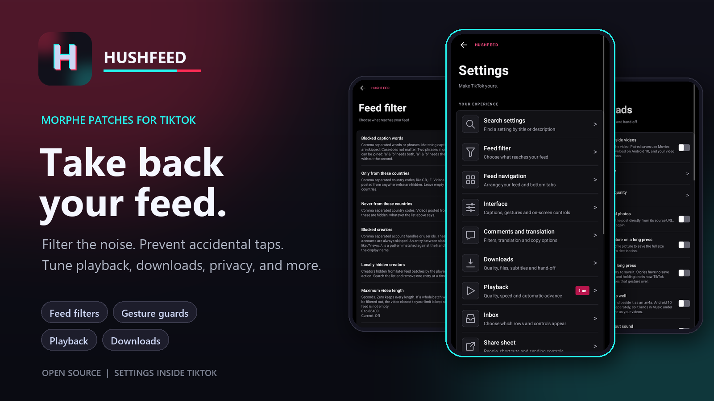
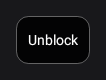
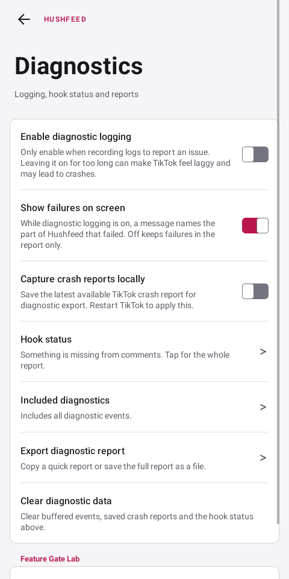

<p align="center">
  <a href="CHANGELOG.md"></a>
  <a href="LICENSE"></a>
  <a href="https://www.android.com/"></a>
  <a href="https://github.com/MorpheApp/morphe-manager"></a>
  <a href="https://github.com/SysAdminDoc/hushfeed/discussions"></a>
  <a href="https://www.apkmirror.com/apk/tiktok-pte-ltd/tik-tok-including-musical-ly/tiktok-47-0-3-release/tiktok-47-0-3-3-android-apk-download/"></a>
</p>

# Hushfeed

Hushfeed is a [Morphe](https://github.com/MorpheApp/morphe-manager) patch bundle for people who want TikTok to behave differently. It can cut feed clutter, guard risky taps, improve downloads and expose controls TikTok leaves buried or unavailable. Every selected patch is configured from one native settings screen inside the app.

**[Add Hushfeed to Morphe](https://morphe.software/add-source?github=SysAdminDoc%2Fhushfeed)** | [Download the latest bundle](https://github.com/SysAdminDoc/hushfeed/releases/latest) | [Tour the settings](#settings-tour) | [Browse all 91 patches](#patches)

> [!IMPORTANT]
> Hushfeed changes often while TikTok moves underneath it. Hushfeed targets the global TikTok package, `com.zhiliaoapp.musically`, version [47.0.3](https://www.apkmirror.com/apk/tiktok-pte-ltd/tik-tok-including-musical-ly/tiktok-47-0-3-release/tiktok-47-0-3-3-android-apk-download/). Use that exact APK when patching. See [Supported target](#supported-target) for the verified build details.

## Pick what changes

- **Feed:** Start with the reversible Calm feed preset, or hide ads, Shop, livestreams, stories, photo posts, unwanted creators and videos matching your own rules. Remove feed ads also catches paid partnerships and creator commission posts, including location-affiliate videos.
- **Touch controls:** Add second-tap protection to Follow, Like and sending from the share sheet. Remap or disable long press and double tap.
- **Playback:** Choose speed and quality, stop loops, resume a video after scrolling or move to the next one automatically.
- **Downloads:** Save watermark-free video, original photos, separate audio and SRT subtitles with filenames and folders you control. The save button also works on videos whose creator turned downloading off.
- **Comments and inbox:** Filter comment text or accounts, translate comments and decide which Inbox rows appear. Compact comment header removes the count, sort and close row and the suggestion area above it. Close comments with Back or a downward swipe. It's optional and needs a restart.
- **Privacy and diagnostics:** Turn off supported telemetry, hide view and typing reports, back up settings and export a useful diagnostic report.

Compact comment header keeps headers that switch between different lists, so those tabs remain reachable.

**Easier comment likes**, under Comments, extends the heart's touch area into nearby blank space. The icon and row spacing don't change. Text and neighboring controls keep their own space. It's off by default and needs a restart.

Feed screen has separate options to hide the **Full screen button** and **location labels** over videos, including badges listing multiple places. They don't remove the videos or change location permissions.

Want to skip those videos entirely? Turn on **Filter location-tagged videos** under Feed filter > Ads. It's independent of badge hiding and includes posts that aren't paid ads. These options are off by default and need a restart.

**Hide the search bar below videos**, under Feed screen, removes the suggested-search strip above the bottom tabs. Video details and side controls can use its space. The top search button and comment suggestions have their own switches. This option is off by default and needs a restart.

One-tap blocking skips to the next video as soon as TikTok confirms the block. A compact **Unblock** button appears at the top left for two seconds. You can also unblock later in TikTok's **Privacy > Blocked accounts**. A delayed response won't skip another video if you've already moved on.

The block, local hide, sound and Not interested controls, rendered in a local UI test:


The compact Unblock action, also rendered from the actual control in a local UI test:



## Install

1. Get the TikTok 47.0.3 APK. Google Play only offers the newest build, so take it from [APKMirror](https://www.apkmirror.com/apk/tiktok-pte-ltd/tik-tok-including-musical-ly/tiktok-47-0-3-release/tiktok-47-0-3-3-android-apk-download/).
2. Use Morphe Manager 1.30.0 or newer. Manager refuses a bundle built against a patcher newer than its own, and this one is built against patcher 1.13.0, which Manager 1.30.0 was the first to ship. On anything older the bundle simply will not load.
3. Add Hushfeed as a source in Morphe Manager. The quickest way is this link on the phone: [Add Hushfeed to Morphe](https://morphe.software/add-source?github=SysAdminDoc%2Fhushfeed). Some in-app browsers block Android from handing a web link to another app. If **Open in Morphe** leaves you in the browser, open Morphe Manager, tap **Sources**, tap **+**, and paste `https://github.com/SysAdminDoc/hushfeed`. You can also download `patches-0.57.0.mpp` from the [latest release](https://github.com/SysAdminDoc/hushfeed/releases/latest) and load it as a local bundle.
4. Pick the patches you want and patch the APK. Keep the manager's existing signing key so TikTok stays logged in across updates. Every patch here fits the manager's 640 MB memory default except AMOLED dark theme, which rewrites TikTok's color resources and needs the limit raised to 768 MB. That 640 is the manager's default and not a measured minimum: the whole set apart from AMOLED fits in 576 MB. If patching stops with an out of memory error, that setting is the one to raise. A run that sits at 24 or 25 percent and never moves is the same problem wearing a different face: cancel it, set the limit to 768 MB and start again, and if that still stalls try 512 MB, which gives the patcher less to hold at once.
5. Install the patched APK. From 2026-09-30, phones in Brazil, Indonesia, Singapore and Thailand ask for more before they will install an app from a developer Google has not verified. The flow is the same every time: turn on the option in Developer options, confirm the device lock, restart the phone, then wait 24 hours before the install goes through. After that it stays open for 7 days, or indefinitely if you chose that. This is not a one-off. Every Hushfeed release is an update, and an update goes through it again once the window closes. `adb install` from a computer skips the whole thing.
6. Open TikTok and go to Settings and privacy. Hushfeed is the first row. Tap it to find the switches for every patch you selected.

Selected patches activate when TikTok starts. The Settings patch adds the entry point and is selected by default. Deselect it and the other patches still apply, but their switches have nowhere to live. `patches-bundle.json` in the repository root is the source index Morphe reads for the published bundle.

If Morphe reported "The remote metadata file is unavailable" for Hushfeed v0.51.0, refresh the source. The v0.52.0 source update corrects a timestamp that Manager couldn't read. You don't need to reinstall Manager, clear its data or change its signing key.

<br>

## Patches

| Patch | Description |
|---|---|
| `Advanced downloads` | Adds download quality choices, saves Photo Mode images directly from their source URLs, keeps a video's sound as its own audio file, and saves a profile picture or a story from a long press. Switch: Hushfeed settings > Downloads. |
| `Allow Duet and Stitch` | Ignores the creator's Duet and Stitch setting so the entries appear for videos that closed them. Everything else the app checks still applies: a photo post, a private video or one with music it may not reuse is still refused, and whether the upload is accepted is the server's decision, not the app's. Switch: Hushfeed settings > App. |
| `Allow screenshots and Circle to Search` | Removes secure window flags and disables the Circle to Search block. Off by default; restart after changing. Switch: Hushfeed settings > Feed screen. |
| `Always show publish date` | Always shows the publish date in video author information. Switch: Hushfeed settings > Feed screen. |
| `AMOLED dark theme` | Replaces TikTok's dark background palette with black or a chosen color. The light theme keeps its colors. It is the one patch that rewrites resources, so patching with it on needs the memory limit raised to 768 MB. |
| `Automatic video advance` | Keeps TikTok's automatic advance enabled while preserving its pause, dialog and gesture checks, and shows TikTok's own Auto scroll action in the video panel for accounts outside its rollout. Switch: Hushfeed settings > Playback. |
| `Block author button` | Adds one-tap controls for blocking the creator, hiding them locally and blocking the current sound. A confirmed account block skips to the next video and shows a small Unblock button at the top left for two seconds. The local-hide and sound controls have separate switches. Long press any visible control to move it. Hushfeed keeps it clear of system bars, cutouts and TikTok's bottom tabs when the window changes. A local action shows Undo only after its setting was saved. All controls hide while comments are open. Switch: Hushfeed settings > Feed filter. |
| `Block contact list access` | Answers TikTok's reads of your phone contacts with an empty list. Find Friends and People you may know lose access to your contact list. Switch: Hushfeed settings > Privacy. |
| `Block installed app scanning` | Answers TikTok's scan of the apps installed on your phone with an empty list. Checks for one named app, which TikTok also uses to open an app you tap, are left alone. Switch: Hushfeed settings > Privacy. |
| `Block P2P video relay` | Strips TikTok's peer-to-peer CDN libraries so your phone is not used as a relay node for other people's video traffic. Saves battery and mobile data. |
| `Camera and microphone indicator` | Shows a small dot in the top corner while TikTok has the camera open or is recording sound. Green for the camera, orange for the microphone, both when both. It goes when the access ends. Switch: Hushfeed settings > Privacy. |
| `Comment publish diagnostics` | Says in the diagnostic report whether a comment send reached TikTok's publish code, what it had in hand, and whether it returned early or handed the comment to the request. A comment that never posts leaves no other trace. |
| `Comment sort controls` | Shows TikTok's own comment sort sheet on every post, with its hot, newest, media and creator options, instead of the cut-down row an account outside the rollout is given. Switch: Hushfeed settings > Comments. |
| `Comment tools` | Hides comments that contain chosen words or come from chosen accounts, turns the thumbs down on each comment into a block button that shows the block symbol, makes links tappable and can hide pictures, polls or TikTok's suggested-search banner above comments. Compact comment header removes the count, controls and suggestion space above the list. Easier comment likes extends the heart's touch area into nearby blank space without changing row spacing. A separate search box filters comments already loaded on the video. Each tool has its own switch in Hushfeed settings > Comments. |
| `Confirm feed interactions` | Adds optional second-tap protection to the feed Follow button and like heart. A red ring marks the armed button. Switch: Hushfeed settings > Feed screen. |
| `Copy comments without username` | Copies only the comment text without including the creator's username. Switch: Hushfeed settings > Comments. |
| `Custom offline videos limit` | Adds a custom entry to TikTok's offline videos menu with a configurable limit from 1 to 1000 videos. Switch: Hushfeed settings > Downloads. |
| `Device privacy guard` | Blocks TikTok from reading your clipboard. Copying a link you asked for still works. Switch: Hushfeed settings > Privacy. |
| `Diagnostic tools` | Adds diagnostic logging, filtered reports and local TikTok crash capture. The switches are under Diagnostics in Hushfeed settings. Switch: Hushfeed settings > Diagnostics. |
| `Disable login requirement` | Removes TikTok's mandatory login gate from supported flows. |
| `Disable screen capture detection` | Prevents TikTok from reacting to screenshots and screen recordings. |
| `Disable telemetry` | Adds a switch on the Privacy page that stops ByteDance AppLog analytics, AppsFlyer attribution, explicit Firebase screen reports and TikTok's Npth or MonitorCrash startup reporting. TikTok's own diagnostics go quiet with them. Off by default. Switch: Hushfeed settings > Privacy. |
| `Disable the long press quick share` | Keeps long-pressing Share from opening TikTok's quick-share interaction. Switch: Hushfeed settings > Feed screen. |
| `Disable the long press repost` | Keeps holding Like from opening TikTok's repost action. Switch: Hushfeed settings > Feed screen. |
| `Double-tap controls` | Lets double taps do nothing or open the current video's comments. Switch: Hushfeed settings > Feed screen. |
| `Downloads` | Adds watermark-free downloads, comment sticker saving, configurable folders, and filename templates. It ignores the flag TikTok sets when a creator turns downloading off, so those videos save too. Network fetches accept public HTTPS addresses and follow at most five checked redirects. Switch: Hushfeed settings > Downloads. |
| `Drop the animated image cache` | Makes TikTok's reviewed Fresco animated-frame cache lookups return no cached frame. This can increase decoding work or change animation playback. |
| `Enable voice comments` | Turns on TikTok's own voice comment recording and publishing entry points for accounts that do not have them. |
| `Expand activity list` | Show the full Activity and New followers lists instead of collapsing them behind a View all button. Switch: Hushfeed settings > Inbox. |
| `Feature Gate Lab` | Adds a menu for viewing and overriding supported TikTok feature flags and configuration values. |
| `Feature Gate Recorder` | Records feature gate reads while you use TikTok and compares them with their previous values. Switch: Hushfeed settings > Diagnostics. |
| `Feed filter` | Hides feed ads, including videos with creator commission disclosures, TikTok Shop items, livestreams, LIVE replays, stories, photo posts, paid partnerships, AI labeled videos, location-tagged videos, verified accounts, series, playlists, the playlist bar, the floating event badge and inserted cards. Videos can also be filtered by your own caption words, creator handles or patterns, sound names, length, the country they were posted from and their view, like, comment, favorite and share counts. Sponsored cards are dropped from the profile video viewer, the search grids and the Friends tab as well as the feed, and so are the mid-roll ads TikTok splices into a video pager after the list has loaded and the ads a creator's video pager asks for on its own. The share prompt that appears after a like can also be hidden. Switch: Hushfeed settings > Feed filter. |
| `Feed tab navigation` | Controls which loaded top and bottom navigation tabs remain visible, blocks newly added tabs when requested, and can hide the Tako AI bubble. Switch: Hushfeed settings > Feed tabs. |
| `Fit the video to the screen` | Puts the whole of a vertical video on screen instead of cropping it to the window. On a 9:16 phone nothing changes, because the video already fills it. On a Fold opened up, a squarer phone or a split view the sides or the ends stop being cut off. Switch: Hushfeed settings > Playback. |
| `Fix Google login` | Restores Google account sign-in after patching. |
| `Foldable split comment view` | Shows comments beside the video on windows wider than a configurable threshold. Off by default. Switch: Hushfeed settings > App. |
| `Follow diagnostics` | Reads what the server said about a follow. A follow TikTok turns down comes back looking like a success, so this reports the refusal and its reason once per session and, with diagnostic logging on, writes the whole exchange to the report. |
| `Ghost mode` | Stop TikTok reporting that you viewed a story or a profile or that you are typing. Online status is unchanged. Switch: Hushfeed settings > Privacy. |
| `Hide already seen videos` | Keeps a local record of the videos you have watched and drops them from later feed pages. The record never leaves the device and can be cleared from settings. Switch: Hushfeed settings > Feed filter. |
| `Hide CAPTCHA popups` | Adds a default-off setting to hide browsing and LIVE puzzle dialogs. Login and account verification stay visible, and so does any puzzle the server raised over a follow, like, comment or repost, because hiding one of those makes the action fail with no message. Switch: Hushfeed settings > Feed screen. |
| `Hide comment popup ads` | Stops the brand animation that plays over the comment sheet when a comment matches an advertiser's trigger word or emoji. Switch: Hushfeed settings > Comments. |
| `Hide feed follow button` | Hide the + follow button below creator avatars in video feeds. Switch: Hushfeed settings > Feed screen. |
| `Hide feed LIVE button` | Hide the LIVE button at the top left of video feeds. Shares its switch with the LIVE entrance option of Hide video overlays, and stops the button before it is built rather than hiding it once it is on screen. Switch: Hushfeed settings > Feed screen. |
| `Hide feed save button` | Hide the save button from video feeds. Switch: Hushfeed settings > Feed screen. |
| `Hide feed search button` | Hide the search button at the top right of video feeds. Switch: Hushfeed settings > Feed screen. |
| `Hide floating promotions` | Removes floating promotional badges from the feed and can hide the rewards shortcut on Profile. Switches: Hushfeed settings > Feed screen and App. |
| `Hide inbox items` | Adds a switch for each row and header control on the Inbox tab, so message requests, TikTok Tako, TikTok Shop, the stories tray and the rest can be hidden individually. Switch: Hushfeed settings > Inbox. |
| `Hide inbox stories` | Hides the stories tray at the top of the Inbox and restores it immediately when the switch is turned off. Shares its switch with Hide inbox items. Switch: Hushfeed settings > Inbox. |
| `Hide quick comment reactions` | Hides the emoji row above the comment box and the quick comment strip on videos. Switch: Hushfeed settings > Comments. |
| `Hide search suggestions` | Hides the suggested searches TikTok offers on the search page before you type, and stops the page asking for them. Your own search history is left alone. Switch: Hushfeed settings > App. |
| `Hide suggested accounts` | Stops the suggested accounts list from being built on the Activity, New followers and Inbox pages, and collapses every other People you may like card: the profile header, the Friends tab and the feed. Shares its switch with Hide inbox items. Switch: Hushfeed settings > Inbox. |
| `Hide the launcher shortcuts` | Empties the menu that opens on pressing and holding TikTok's icon on the home screen. The entries are built while the app runs rather than declared in it, and TikTok only rewrites them when it notices a difference, so this takes away what is already published and answers the handover that would publish more. Turning it off asks TikTok to build them again. Tapping the icon still opens the app, and a shortcut pinned to a home screen is left alone. Switch: Hushfeed settings > App. |
| `Hide the risk control CAPTCHA` | Hides TikTok's risk control CAPTCHA dialog, raised by its BdTuring service, which the browsing CAPTCHA patch does not cover. Answers the Hide CAPTCHA popups setting, never touches SMS or two factor verification, and never hides a check the server raised over a follow, like, comment or repost. Off by default. |
| `Hide video overlays` | Hides the visual search prompt TikTok lays over videos, the Live entrance in the top left corner, caption and music text, selected action buttons or their counts in the right column, survey cards and the status bar. Separate switches hide the Full screen button and location labels without removing videos or changing location permissions. Switch: Hushfeed settings > Feed screen. |
| `Hold-and-slide 2x lock` | Enables TikTok's native hold, slide down, and release gesture to lock 2x speed. Switch: Hushfeed settings > Feed screen. |
| `In-app browser privacy guard` | Can stop TikTok's in-app browser handing its JavaScript bridge to the pages it loads. Most of TikTok's own web pages need that bridge, including the shop checkout and the CAPTCHA page, so the switch is off until you turn it on. Switch: Hushfeed settings > Privacy. |
| `Keep the Favorites tab` | Keeps the Favorites tab on your profile when TikTok's server puts the account into an experiment that empties it. Two people saw that after patching: the tab was there and the saved videos were not. Switch: Hushfeed settings > App. |
| `Keep the screen's refresh rate` | Stops TikTok asking the screen to run slower than it can, which it does by asking for the frame rate of the video it is playing. On a 90 or 120 Hz phone that ask takes the whole app down to that rate, scrolling included. A request that is not slower than the screen is left alone. Switch: Hushfeed settings > App. |
| `Limit background traffic` | Turns off TikTok's buffer-preload gate and skips its push initialization task. Videos may start buffering later, and TikTok push notifications may stop. |
| `Location access governor` | Answers TikTok's location requests with nothing: the last known location comes back empty and update requests never fire. The SIM and region spoof change the locale and timezone, not the coordinates; this stops the coordinates. Switch: Hushfeed settings > Privacy. |
| `Long-press controls` | Lets a long press on a video keep TikTok's own action, do nothing, open the video's comments, save the original sound, or copy the link to the video or its sound, and can turn a press on the left or right third of the screen into a jump back or forward. Brings Double-tap controls with it, which supplies the comment control. Switch: Hushfeed settings > Feed screen. |
| `Not interested button` | Adds a movable button that tells TikTok you aren't interested in the current video. It hides while comments are open. Off by default. Switch: Hushfeed settings > Feed filter. |
| `Notification controls` | Adds a switch for the notification saying somebody new followed you, and one for message streaks, neither of which TikTok lets you turn off. The follower switch drops the notification before Android is asked to post it, so nothing else in the drawer is affected. Switch: Hushfeed settings > Inbox. |
| `Open external links directly` | Opens profile and story website links in the system browser instead of TikTok's in-app browser. Switch: Hushfeed settings > Privacy. |
| `Playback quality` | Selects the lowest, highest or a target video quality for playback, adaptive streams included. A second choice caps quality on mobile data and only ever lowers it. Download quality has its own setting. Switch: Hushfeed settings > Playback. |
| `Playback speed` | Remembers playback speed or applies a default to each new video, with custom menu choices up to 3x. Switch: Hushfeed settings > Playback. |
| `Region spoof` | Matches locale, timezone and native region getters to the SIM preset, with a separate experimental store-region switch. Switch: Hushfeed settings > Region. |
| `Remember clear display` | Remembers clear display between videos, or enters it automatically after a chosen delay. Switch: Hushfeed settings > Feed screen. |
| `Remove content credential and card scanner assets` | Empties TikTok's bundled C2PA and Microblink card-scanning assets, the Pitaya AI model libraries, the live-cast dynamic feature, and the ART log monitor probe. |
| `Remove creation tools` | Empties TikTok's reviewed editor, camera-effect and face-model assets. The Create tab and all recording, editing and effects tools stop working. Switch: Hushfeed settings > App behavior. |
| `Remove LIVE extras` | Empties TikTok's link-mic and LIVE match or minigame assets, then skips its gift-effect widget setup. Co-hosting, games and animated gifts may stop. |
| `Remove unused language packs` | Empties unselected TikTok language bundles while always keeping English. Selected language codes are checked before any file changes. |
| `Resource and battery governor` | Stops TikTok listening to the motion sensors it polls for device fingerprinting: the accelerometer, gyroscope, magnetometer, rotation, gravity and linear acceleration sensors. Saves the battery they wake. Switch: Hushfeed settings > Privacy. |
| `Resume videos after scrolling` | Continues supported videos from where playback stopped when returning after a scroll. Switch: Hushfeed settings > App. |
| `Sanitize sharing links` | Removes tracking parameters from TikTok links before they are shared, and can put a host of your choosing in place of tiktok.com. Switch: Hushfeed settings > Privacy. |
| `Settings` | Adds the Hushfeed settings screen to TikTok and keeps its entry first in Settings and privacy. |
| `Share sheet tools` | Asks twice before a video is sent to a friend from the share sheet. The check follows the account or conversation instead of the visible name and covers accessibility actions and keyboard input. It can also hide chosen people, share options or the whole Send to row, and a profile's or a LIVE's share sheet can hide a different set from a video's. Switch: Hushfeed settings > Share sheet. |
| `Show author region` | Show the country a video was posted from next to the creator's name on the feed. Switch: Hushfeed settings > Feed screen. |
| `Show LIVE search` | Shows TikTok's search entry in the LIVE drawer where supported. |
| `Show the progress bar` | Shows TikTok's native video seekbar where it would normally be hidden. Switch: Hushfeed settings > App. |
| `Show the progress bar thumbnail` | Shows TikTok's video preview thumbnail while dragging the seekbar. |
| `SIM spoof` | Spoofs SIM country and operator information retrieved by TikTok, with country presets for easier setup. Switch: Hushfeed settings > Region. |
| `Skip content warnings` | Play videos TikTok has classified without the warning overlay asking to be tapped through first. Switch: Hushfeed settings > Feed screen. |
| `Skip the splash ad` | Stops TikTok's splash-ad preload tasks and returns false from its reviewed splash and TopView gates. Other startup behavior is left in place. |
| `Skip update checks` | Skips TikTok's background and boot-finished device-ID update-check tasks. This may suppress some in-app update checks. Play Store updates are unaffected. |
| `Stop on-device AI profiling` | Kills the Pitaya on-device ML inference engine at startup so it cannot build a behavioral profile. The AI asset strip in the core de-bloat patch removes the native libraries; this stops the initialization code that would download replacements. |
| `Stop video looping` | Stops videos at the end instead of replaying them. Switch: Hushfeed settings > App. |
| `Subtitle tools` | Saves subtitle files beside downloaded videos and adds caption size, background, and clear-display options. Switch: Hushfeed settings > Feed screen. |
| `Translate comments` | Adds comment translation controls using TikTok's translation system, with selectable language exclusions. Switch: Hushfeed settings > Comments. |
| `Use non-personalized search` | Uses TikTok's non-personalized search mode instead of its saved account choice. Switch: Hushfeed settings > App. |
| `Use system font` | Draws TikTok's text in your device's font instead of TikTok Sans. The icons, the gift animations and the @ and # glyphs keep their own fonts. Off by default; restart after changing. Switch: Hushfeed settings > App. |

## Settings tour

### Which search setting do I need?

| What you want to change | Setting and location |
| --- | --- |
| The `Search: ...` suggestion above a video's comments | Comments > **Hide search suggestions above comments**. Restart TikTok after changing it. |
| A box for finding text or usernames in loaded comments | Comments > **Search within comments**. This adds Hushfeed's own filter, not TikTok search. |
| Recommended searches shown before typing on TikTok's search page | App > **Hide suggestions on the search page**. Search history stays. |
| The magnifying glass at the top of the feed | Feed screen > **Hide the search button on the feed**. |
| The magnifying glass at the top of Inbox | Inbox > **Hide the Inbox search button**. |
| A `Search this image` prompt over a video | Feed screen > **Hide Search this image prompts**. |

Each switch controls its own surface. Turning one off doesn't change the others. The search field in Hushfeed settings only finds settings.

### Pages and navigation

The settings home starts with a live Hushfeed status card and the installed Hushfeed and TikTok versions. Diagnostics is available from that card. Search follows it, then direct buttons for Feed filter, Privacy and Screen time. The full menu remains in four groups. Your feed holds Feed filter, Feed tabs and Feed screen. Watching and sharing holds Playback, Screen time, Comments, Downloads, Share sheet and Inbox. Privacy and system holds Privacy, Region, App, the Feature Gate Lab, Diagnostics and Backup and restore. About sits at the end. A group only appears when the patches you chose give it a page. Search finds any row by its translated title or description, jumps to it and keeps your search when you return.

Inside a page, rows sit under headings that say what they are about. Feed filter starts with Calm feed, a reversible preset that hides ads, Shop posts, LIVE interruptions and paid promotions without changing ordinary content choices. The individual controls follow under Kinds of post, Limits, Creators and sounds, Words and countries, Seen videos and Advanced. Feed screen starts with the right column, where one checklist row hides any of the six buttons and the counts, then Video info, Around the video, Popups, Captions, Screen, Clear display and Gestures. Screen time is the daily budgets, the reminder and the hold. Backup and restore is Back up, Restore, Reset and Undo.

The pages use grouped controls on an AMOLED background. Light mode follows TikTok's theme, including the space behind the system bars. Larger text wraps across lines without clipping headers, captions or editor labels, and the three home shortcuts become full-width rows before their names can split. Invalid values stay in the editor with an inline explanation and clear as soon as you type again. Undo and restart actions stay inside settings in a ten-second banner with a full-size button. Changing font size or navigation mode keeps the settings page you were using and its Back history. If a page cannot finish loading, Hushfeed replaces partial controls with a translated explanation plus Back and Retry actions. These screenshots come from native Android views rendered by the local test suite. Enabled controls and values are test fixtures.

  

<details>
<summary>Every settings page</summary>

| Page | Screenshot |
|---|---|
| Feed filter | [View](assets/settings/feed_filter.png) |
| Local creator list | [View](assets/settings/creator-list.png) |
| Feed tabs | [View](assets/settings/feed_navigation.png) |
| Feed screen | [View](assets/settings/interface.png) |
| Playback | [View](assets/settings/playback.png) |
| Screen time | [View](assets/settings/screen_time.png) |
| Comments | [View](assets/settings/comments.png) |
| Downloads | [View](assets/settings/downloads.png) |
| Share sheet | [View](assets/settings/share.png) |
| Inbox | [View](assets/settings/inbox.png) |
| Privacy | [View](assets/settings/privacy.png) |
| Region | [View](assets/settings/region.png) |
| App | [View](assets/settings/behavior.png) |
| Diagnostics | [View](assets/settings/diagnostics.png) |
| Backup and restore | [View](assets/settings/backup.png) |
| Settings search | [View](assets/settings/search.png) |
| Settings recovery | [View](assets/settings/settings-error.png) |
| Feature Gate Lab | [View](assets/settings/lab.png) |
| Gate details | [View](assets/settings/gate_details.png) |
| Gate recording | [View](assets/settings/gate_recording.png) |
| Twice the text size | [View](assets/settings/two-times-text.png) |
| Twice the text size, light | [View](assets/settings/two-times-text-light.png) |
| Mirrored layout at twice the text size | [View](assets/settings/rtl-large.png) |
| Mirrored layout, light | [View](assets/settings/rtl-large-light.png) |

</details>

The native choice dialogs keep one indicator at the leading edge. These renders cover selected and
unselected rows in both themes. The Included diagnostics images come from the shipped eight-choice
picker with its real Apply and Cancel actions:

| Dialog | Dark | Light |
|---|---|---|
| Single choice | [View](assets/settings/dialog-single-dark.png) | [View](assets/settings/dialog-single-light.png) |
| Included diagnostics | [View](assets/settings/dialog-multi-dark.png) | [View](assets/settings/dialog-multi-light.png) |


Hushfeed saves what the app already has. The download reads the addresses TikTok itself fetched for the video you are watching, on the session you are already signed in with, so there is no separate request pretending to be a browser and nothing to keep in step with the site. That is the difference between this and a scraper. Through August 2026 yt-dlp had to rewrite its TikTok extractor twice and re-implement browser impersonation, and it broke again on 1 September. Cobalt has not shipped since April. None of that is a promise that saving always works. TikTok can change what it hands the app, and when it does the saver changes with the patches. It just means the thing most likely to break in a scraper is not part of how this works.


Select `Subtitle tools` in the patcher, then enable subtitle downloads in Downloads. Captioned videos and their SRT files share the same filename stem. Language names can use Unicode, and filename collisions keep separate tracks. Android 11 and later save the pair in Movies; Android 10 uses Download. The selected subfolder still applies. A failed subtitle transfer leaves the saved video intact and reports the partial result.

Caption appearance and the clear display option are on the Feed screen page:

The clear-display caption is removed as soon as you turn its switch off. Turning it back on restores the current cue when its video is still on screen.

 

Inbox category switches identify New followers, Activity, Archive, Tako and Shop from native row data. They work with translated labels. Turning a switch off restores an already loaded row on the next layout.

<br>

Playback has an optional default speed for every new video. A manual choice lasts until you change videos. To add 2.5x, enter it in Speed menu choices and restart TikTok; an empty list restores TikTok's menu.

Select `Automatic video advance` in the patcher, then turn on Auto-advance videos in Playback and restart. The option re-enables native auto-scroll if TikTok turns it off, and it puts TikTok's own Auto scroll action in the video actions panel, which otherwise only appears for accounts in that rollout. Use the Playback switch to disable it.

Auto-advance session limit is zero by default. A positive value counts videos that finish while Hushfeed started scrolling, not prefetches or manual swipes. Recreating the feed or changing the limit starts a new count. Saving the same number, changing another setting or returning from the background keeps the existing count, including a reached limit. Hushfeed shows a brief notice when it stops.

Advanced downloads can send a sanitized TikTok link to another installed app. Enter its package name in `Send links to another app`; an empty value keeps TikTok's own save. The [YTDLnis](https://github.com/deniscerri/ytdlnis) package is recognized explicitly as `com.deniscerri.ytdl`, so its documented audio or video type and optional background mode are available. The profile controls stay disabled for every other package, and an uninstalled target falls back to TikTok's save.

Photo filename templates can use `{index}`. TikTok's own Photo Mode saver numbers each image from 1 and starts over when the post has finished saving, including on Android versions that write straight to a shared folder.

Foldable controls are on the App page. Settings save immediately, including when an older settings page is still open. A banner offers Restart now when a change needs it, and a pinned row keeps the action available until TikTok restarts.

Numeric feed limits show their actual unit with language-aware singular and plural labels.

Native settings pickers use one radio indicator for a single choice and one checkbox for multiple choices. The selected state remains accessible and is saved through Android's native list adapter.


Region spoof requires Override SIM details plus Match locale and timezone to country on the Region page. Each built-in country preset supplies a timezone. Country codes must be two ASCII letters. Locale scripts and extensions are retained, including when a legacy variant needs fallback handling. Restart TikTok after changing these settings. Enable the separate store-region option only if needed, since it can affect search. GPS and the network address stay unchanged. Neither switch can change where TikTok thinks you are on its own: your IP address, the history on your account and the language you read in all say the same thing they said before, and any one of them is enough for TikTok to keep serving the region it already chose.


Playback has two switches for a feed that keeps going when nobody is watching it. One takes the sound while a comment sheet is open and gives it back when the sheet closes. The other holds the feed after you return to the app until you tap once, and leaves the tab bar alone so messages, a profile and search stay one tap away. Both are off unless you turn them on. These two switches request audio focus; they don't call the native player pause used by the daily-budget hold.

Playback also carries a daily budget for the feed, on builds that include the block author patch, which is where the hook that knows which video is on screen comes from. It is off until you put a number in it, and until then nothing is counted at all. Set a video count, a number of minutes, or both, and Hushfeed says once that the day is used up. Set a hold too and the current player pauses behind a countdown for that many minutes, with a way through it on the countdown itself for the times you decide otherwise. It resumes only when the held video is still current, the feed is visible and audio focus permits playback. If another app holds focus past the countdown, Hushfeed waits for native focus to return before handing that video back. This also works when TikTok hasn't applied the queued pause yet. The panel follows the tab row as the screen layout changes. Messages, profiles and search are untouched, and so is the feed itself: nothing is dropped, so TikTok never refetches a batch it already sent. The day rolls over at four in the morning unless you move it, and the count and the hold both survive the app being killed. If a hold arriving out of nowhere is not what you want, there is a switch that fades the feed out over the last three quarters of a minute of a time budget, so you can see it coming. It needs a budget in minutes to follow and a hold to lead into, and it stays out of the way if you have turned system animations off.

Diagnostics includes Back up settings, Restore settings and Reset settings even without the logging patch. Backups include patch preferences and Feature Gate Lab rules with their enabled state. Choose a JSON file through Android's file picker. Invalid files leave settings unchanged. Restore and reset keep one undo copy inside TikTok. An interrupted write can recover from its backup file, and a current Hushfeed copy always wins over a copy written under the project's earlier name. Export a backup first if you plan to clear app data or reinstall, since that removes the undo copy too. Restart after restoring or resetting. Show failures on screen decides whether a failure inside Hushfeed is also put in front of you while diagnostic logging is on. Turn it off and failures go to the report alone.

Backups record which settings they contain, so missing entries are rejected. A backup is a set of values to apply rather than a picture of the whole app, so anything it predates is left as you have it and the restore says how many that was. A backup from before the download destinations were split carries the one folder it knew about, and that fills in all three. If saving fails, recovery attempts both preference stores and keeps the undo copy available.

The Hook status row answers a question the patch list cannot. The patcher knows what it wrote into the APK, not whether a hook then found its anchor once TikTok was running, and TikTok renames things every release. When a hook loses its anchor the switch above it still reads on while nothing happens. Tap the row for a line per surface: how many lookups bound, how many did not, and the first thing that went missing. It hears from comments, comment translation, the inbox, the share sheet, the feed overlay, the bottom navigation and the story viewer, feed models, playback quality, sensitive warnings, CAPTCHA account state, external browser, sticker saves and story saves. The last four identify missing service calls, the sticker source adapters `LLILLIZIL` or `X.0UD5`, and the story chain `LLJIJIL`, `LLJIJIL`, `LL`, `getAweme`. "Everything found what it needed" means everything Hook status watches rather than every patch in the bundle. The same table goes into the exported diagnostic report, so it travels with a bug report.

The exported report also carries a feed filter table, and that one counts whether or not diagnostic logging is on. Several different routes can put a video on a profile page or in the feed, and a screenshot of an advert cannot say which one delivered it. The table gives a line per route: how many lists it was handed, how many videos were in them, how many it took out, and the last reason it gave. A route with no line has never run, which is the useful half, because a hook that never fired looks exactly like a filter that decided to keep everything.

 

Feature Gate Lab saves its master switch immediately. Its menu can reset overrides while the switch is off, reset all Lab data, or undo the last reset or import. Imported values stay disabled. The Lab holds up to 1,024 saved rules, and it rejects a save or import that would exceed that limit before anything changes. Reset all Lab data can recover an older oversized store without clearing other Hushfeed settings. Changes run in the background and report their result with a notification. Every filtered list in settings, the hidden creator editor, the share checklist and the Lab shows and announces its current result count. Removing a hidden creator says which entry was removed and moves focus to the next action. The recorder discards an interrupted session before taking the next baseline. Copied recorder reports use Android's sensitive-content flag on supported versions. Reports above 60,000 characters stay off the clipboard and use Save JSON. The undo copy stores Lab configuration privately; full-reset undo also restores captured observations during the same app run. Other patch preferences are unchanged.


<br>

## Building from source

Use JDK 21 or newer and an Android SDK configured through `local.properties`. GitHub Packages needs `GITHUB_ACTOR` and a `GITHUB_TOKEN` with `read:packages` access for the Morphe dependencies.

Run the runtime tests, then build the Morphe patch bundle and metadata:

```bash
./gradlew :extensions:tiktok:test
./gradlew :patches:generatePatchesList
pwsh -File scripts/validate-release-facts.ps1
./gradlew :patches:buildAndroid
```

The bundle is byte reproducible: two builds of the same commit produce the same file and the same SHA-256, so you can rebuild it yourself and check the published checksum against your own. The one field that would otherwise differ, the build timestamp in the bundle manifest, is pinned to the commit being built. Set `SOURCE_DATE_EPOCH` to override it. `patches/build/bundle.sha256` is written from the finished bundle at the end of `buildAndroid`, so it always describes the file beside it.

Run these tasks in this order. The Android build finishes with `verifyBundle`, which checks the patch list and all three DEX payloads against the checksum recorded by the Android build. You can also run `./gradlew :patches:verifyBundle` on its own to re-check the bundle this checkout built. It compares against a checksum only `buildAndroid` writes, so it will not verify a bundle from anywhere else.

A release tag can point to the tested commit already on the remote branch. The push check verifies that commit against the remote before treating the tag as a pointer-only change. New branches and tags with other targets still run the file-change checks. Publish the release asset before updating `patches-bundle.json`.

The device-only patch and verification helpers read the signing password from `HUSHFEED_SIDELOAD_KEYSTORE_PASSWORD`. If it is unset, they use `sideload`, the password for the local test keystore. The helpers pass a response-file or environment reference to their child signing process, so the password value does not appear in that process's command line. `patch-for-device.ps1` reads its package and version from `patches-list.json`. With `-Replace`, it removes TikTok only when the device returns an installed package path. A clean phone goes straight to installation, while a failed device query stops the script.

Each release ships a provenance receipt beside the `.mpp`, `release-receipt-<version>.json`. A checksum tells you a file arrived unaltered. It cannot tell you which APK the patches were proved against, which commit built the bundle, or what patching did to the Android manifest, and those are the facts that decide whether the bundle you downloaded is the one the release notes describe. The receipt records the tag, the full commit and its timestamp, the bundle's size, hash and manifest stamp, every extension payload's hash, and for each retained TikTok fixture: the APK's package, version and SHA-256, a verdict for every patch in the catalog, and the stock-to-patched difference in requested permissions and exported components.

`scripts/build-release-receipt.ps1` writes it by actually patching each fixture with the Morphe desktop CLI, so the verdicts come out of the patcher's own report rather than from a claim. It refuses to run against a working tree with uncommitted changes: a bundle built from a dirty tree carries a wall-clock timestamp instead of the commit pin, and nobody could then rebuild it from the source the receipt names. `validate-release-facts.ps1` checks the receipt on every run that has one and requires one for a release, and it refuses any manifest change that is not written down in `scripts/manifest-delta-allowlist.txt`. That list is empty on purpose. The patches change bytecode, not the manifest, and a release stops if that ever stops being true. An entry the patches no longer produce fails the run too, so the list cannot outlive the review it records.

`verify-injected-registers.ps1` compares the patched APK with the exact 46.2.3 vendor fixture. The static half rejects an injected instruction outside its method's register count, a removed host method, or a removed DEX file. The optional device half requires the clean and patched Android verifier messages to match by text and count. Each device run removes its uploaded APK and generated ART files, including after a failed command. Reviewed removals must be exact `method` or `dex` entries in `scripts/injected-register-removal-allowlist.txt`; stale entries fail the run.

Gradle dependency verification is checked in at `gradle/verification-metadata.xml`. It records the reviewed release graph with SHA-256 checksums, so a changed cached artifact fails during dependency resolution. Every Bouncy Castle request in the build is rewritten to the reviewed 1.86 release, and two verification tasks check it: the TikTok extension tests check their own graph, and the patch tests check the build graph the Morphe patcher arrives on. Both read the request underneath the rewrite rather than the version it produced, so an unreviewed release stops the build instead of being quietly replaced. `mavenLocal()` is disabled by default, including the repository the Morphe settings plugin adds. Use `-PallowMavenLocal=true` only while developing a local plugin artifact, and leave it off for release builds. The wrapper distribution checksum in `gradle/wrapper/gradle-wrapper.properties` matches Gradle's published 9.7.1 binary.

To save offscreen screenshots, run `./gradlew :extensions:tiktok:test -PscreenshotDir=<absolute-directory>`. The suite opens every settings section in dark and light themes, saves a value through the native picker, and exercises Lab search and overrides. A German fixture checks larger text at 360 dp width, and a Spanish one checks the same page at twice the text size on a 320 dp screen.

Worker-backed settings and Feature Gate Lab tests drain their owned executors before asserting, reset per-sandbox state before each case, and keep the region semantics check separate from the API ICU cross-check. These assertions do not depend on screenshot output or polling sleeps.
Lab boundary tests reject malformed persisted scalars without replacing native values, keep imported rules disabled, clear runtime state across master and reset cycles, and hold recorder limits under concurrent calls. Translation batches expire before a visible fallback is retried, while SIM preset matching accepts missing values and keeps unsupported region fallbacks native.

Runtime tests cover feed marker and sound filters using both getter and field model shapes. Empty metadata and unrelated ids remain eligible; matching markers and sound phrases are rejected by their enabled filters.
Shared resource lookup and global-layout ownership cover the feed, inbox and share hooks, with replacement, detach and failed-install fixtures for the host boundaries. A failed install also detaches the prior root before returning. Sticker publication tests keep collision protection on Android 9 and earlier.
Native boundary tests cover structured numeric coercion and overflow, URL scheme refusal, destination roots, media fallback and frame bounds, plus direct navigation, share, LIVE, sound and translation policy shapes. Codec playback and final container behavior remain native-device checks.
Deep feed tests cover all five count ranges through real responses, repeated response caching, late and final follow delivery, cached and offline fallback policy, hard-filter preservation and bounded probe rotation. The content fixtures reject swallowed runtime failures. Account-write challenge fixtures cover the supported follow, like, comment, repost and story routes found in TikTok 46.2.3. Follow tests drive all seven write routes through the refusal notice and verify that retained requests stop growing at the diagnostic limit. Direct and stream results consume their own request IDs; a skipped request can't reuse an earlier one. Diagnostic account pseudonyms use HMAC-SHA-256 with an installation key. Deliberately broken routes and readers must fail their regression tests.
Video overlay traversals reuse their id, visibility and match buffers, so repeated layout passes do not rebuild the container lists. A synthetic 200-pass trace over 80 cells measured 57.68 ms before the change and 56.09 ms after it.
Legacy settings import tests cover complete JSON and older text fragments, rejecting invalid values before any preference changes.
Numeric tokens retain their precision until validation, and literal NUL characters cannot hide trailing data in imports or undo files.

The generated bundle is written to:

```text
patches/build/libs/patches-<version>.mpp
```

Morphe reads `patches-bundle.json` from this repository, downloads the `.mpp` release asset listed there, and loads the patch metadata from that bundle.

After uploading the bundle and a `SHA256SUMS.txt` file to the GitHub release, verify the published asset against the local build:

```bash
pwsh -File scripts/validate-release-facts.ps1 -VerifyPublishedAsset -ArtifactPath patches/build/libs/patches-<version>.mpp
```

The check follows the indexed URL, compares its SHA-256 with the local artifact, checks the matching entry in `SHA256SUMS.txt`, and counts the patches inside the published bundle against the number the index advertises.

That last one needs the Morphe desktop CLI. Set `HUSHFEED_DESKTOP_JAR` to the jar, or put `morphe-desktop-<version>-all.jar` under `HUSHFEED_WORKDIR` or `build/morphe-tools`, and it is found on its own. Without it the check stops rather than passing, because the count is the only part that reads what people actually download. The CLI wants a JDK 21 or newer, which is often not the `java` first on PATH: `HUSHFEED_JAVA` or `JAVA_HOME` says which one to use. When `-Java` names a directory, that directory must contain `bin/java.exe` or `bin/java`; an invalid explicit directory is reported instead of falling back to PATH.

### Adding a language to the settings screen

The English text in the code is the key. Each language is one table under `extensions/tiktok/src/main/l10n/`, with the English on the left and the translation on the right. A language is kept in one of two forms, and the generator reads both. `de.tsv` is tab separated, one entry per line, `#` starting a comment. `in.csv` is the comma form Weblate hosts: a `source,target` header and a row per entry, quoting whatever needs it. Copy either one to `<language code>.tsv` or `<language code>.csv`, translate the right hand column, then run:

```bash
python scripts/gen-l10n.py
./gradlew :extensions:tiktok:test
```

The script writes two generated files, neither of them meant to be edited by hand. `L10nTranslations.java` is what the extension carries with its own code. `en.csv` is the list of source strings, which is the monolingual base a Weblate project points at, so a translator can work in Weblate and the export drops straight into `l10n/` as `<language code>.csv`. The tests fail on any settings text that has no entry, on a language missing one, and on a table whose values are not the ones in the generated class, so both a gap and a stale run of the script show up before anything ships. Name the file with the code Android reports, which for the three languages that have two is the older one: `in` rather than `id`. The generator makes the table answer to both. The translations used to go into TikTok's own resources, but merging a few hundred strings into a table of 74,765 pushed patching past the memory Morphe Manager allows by default.

<br>

<br>

## Supported target

- App: TikTok, the global package `com.zhiliaoapp.musically`
- Version: [47.0.3](https://www.apkmirror.com/apk/tiktok-pte-ltd/tik-tok-including-musical-ly/tiktok-47-0-3-release/tiktok-47-0-3-3-android-apk-download/), released 19 September 2026
- Build: version code 2024700030, arm64-v8a and armeabi-v7a, nodpi, minSdk 23
- SHA-256 of the APK every patch was verified against: `f4d853f6ccaf145a9b5f106b8e63767e2345e17ae829b6cc6b272fdf0161389c`

A patched app inherits TikTok's target SDK, which is 36 today. Android 17 raises that to 37, and the changes that come with it were audited against everything Hushfeed injects: nothing it adds loads code from a file, subclasses Thread, writes a static final field through reflection or keeps audio going without a foreground service, and a connection the platform refuses is reported with its reason rather than retried. Forcing those changes on a running build still needs an Android 17 device, which is why the audit says checked in source and not checked on a phone.

### Why you have to fetch that APK yourself

Google Play only ever serves the newest build it thinks your device can run, so the copy on your phone may not be 47.0.3, and there is no way to ask Play for a specific older build. Take the APK from [APKMirror](https://www.apkmirror.com/apk/tiktok-pte-ltd/tik-tok-including-musical-ly/tiktok-47-0-3-release/tiktok-47-0-3-3-android-apk-download/), which serves the exact version, then patch that file rather than the installed app.

APKMirror also offers some TikTok releases as bundles, using an `.apkm` file. Morphe Manager merges one into a single APK. AMOLED dark theme refuses a merged bundle with a message saying why, because rebuilding those merged resources can lose entries and make TikTok crash at launch. Take the plain 47.0.3 APK if you want the dark theme.

### Why that version and not a newer one

Patches use named components where TikTok retains them and code patterns where names are stripped. Both can change between builds. 47.0.3 is the declared target. All 91 patches apply to the reviewed APK, and the retained 46.2.3, 46.7.3, 46.8.3 and 46.9.3 builds remain regression fixtures rather than advertised targets. Another build can fail loudly when an anchor moves or, worse, accept the wrong shape.

Only the global package is declared in the compatibility metadata.

The four resource optimizers are off by default. Before changing the APK, they compare the complete target set with reviewed paths and SHA-256 digests from the retained fixtures. An exact group that is already completely empty is accepted. A missing, extra, altered or partly emptied set stops patching. The 47.0.3 and 46.2.3 checks cover both arm64-v8a and armeabi-v7a native libraries; the retained 46.7.3, 46.8.3 and 46.9.3 fixtures provide additional regression coverage. Language packs also require a reviewed inventory, keep English, and preserve both Android aliases for Hebrew and Indonesian when either one is selected.

### Moving from Kveld

Hushfeed now contains the eight Kveld TikTok optimizers that were not already here. Kveld's `Feed Ad Blocker` behavior is covered by `Feed filter`, and its Npth startup coverage is part of `Disable telemetry`. Remove or disable Kveld's TikTok patches after updating Hushfeed. Keeping both current sources at their defaults activates all eight shared optimizer names because Kveld marks them on by default, even though the Hushfeed copies are optional.

| Bundle combination | Result from the recorded 46.2.3 migration test |
| --- | --- |
| Current Hushfeed source by itself | Supported. The eight optimizers stay off until selected. |
| Released Hushfeed 0.30.2 plus Kveld 1.23.1 | Migration-tested. Each Kveld TikTok root passed beside Hushfeed's 34 defaults. All 44 roots also passed in both source orders. |
| Current Hushfeed plus Kveld at defaults | Do not use this setup. Kveld's eight shared optimizers turn on automatically, and its separate feed and telemetry patches duplicate Hushfeed behavior. |
| Current Hushfeed plus Kveld with all ten Kveld TikTok roots disabled | The desktop CLI returns to the exact 34 Hushfeed defaults, but keeping the duplicate source provides no TikTok benefit. |

The migration matrix pinned Hushfeed 0.30.2 at `7645fb6dc8023ee445e623fa4ab83e9f76035916171fa00182a4e617a72101c4` and Kveld 1.23.1 at `28aa9a57c93b2e49482fd9b3f3bc359b0174c37ffb93cc9c5fc0155a8a65c7e1`. Both full-order outputs had 26,072 entries and the same uncompressed entry-content SHA-256, `2a9a786e86ad356985e795a99b1ca4f97962c4dad20b43c8c58aa6d0d6e5ab3d`. Neither order changed the 62 permissions, 648 named components or 66 exported components. Morphe desktop 1.15.0 applies an explicit duplicate name from the bundle supplied last, which is another reason to keep only one source for these patches.

<details>
<summary>Recorded one-at-a-time migration output hashes</summary>

These whole-file SHA-256 values identify the recorded 2026-09-13 runs. ZIP metadata can make a repeat produce a different whole-file hash, so the entry-content hash above is the stable full-order comparison.

| Kveld root beside Hushfeed defaults | Patched APK SHA-256 |
| --- | --- |
| Remove content credential and card scanner assets | `849334dae2ec808ec75c718e382defa93608849d299abf07288c18e7886beb15` |
| Feed Ad Blocker | `54a70673b12e00519e022e3a2e541f116a62b7b1a952d34e49058833a94c6a4e` |
| Skip the splash ad | `3f3cf431d3193ae21c828de5c7aa5f4fdfe3223c64eff8954138120161e95d6d` |
| Remove unused language packs | `5495eb30a61eaf5897d491c70286ff552c2d8f5513b7c908c13e955329687fb1` |
| Remove LIVE extras | `c9795096850a8d4ad719511372553bbaf2726714b5bf170007be30849ad5a6b2` |
| Limit background traffic | `cc12a76919de78573789914d8033d40cee064325e334c1db7658e17175473357` |
| Drop the animated image cache | `dd78aae02796a33ec510f077c91a7e2a3dc947a17b5bb9288f888679f5a1710d` |
| Remove creation tools | `a0696fc12f49fc900b5eafdffd55992f09d1f0958e0ff5865180979d1eaff711` |
| Unified Telemetry & Tracker Silencer | `a7b92689c1b31a71dee627ea1ff0a84b273995a3f4aa02af212aa7e6c6b477a2` |
| Skip update checks | `56031325e755f9c4523ee4c6330d3515beb0e20a108e21d7026147d025689e9c` |

</details>

<br>

## Project structure

- `patches/`: Kotlin patch definitions, fingerprints and shared patch utilities.
- `extensions/`: Java extension code the patches inject into TikTok, with the Robolectric tests beside it.
- `extensions/tiktok/src/main/l10n/`: the settings translation tables.
- `scripts/`: `gen-l10n.py` generates translations, `verify-all-patches.ps1` checks every patch against a fixture, `patch-for-device.ps1` builds a signed APK for a named phone, `measure-patch-heap.ps1` checks selected memory limits, and `validate-release-facts.ps1` checks the public version, patch facts, indexed URL and published bundle hash. `common.ps1` holds the helpers the rest of them share: the work-directory path guard, the cleanup that will not delete outside it, the version read and the desktop CLI lookup. `test-script-contracts.ps1` covers all of those, the shared target reader and the guarded replacement step, which files a push runs which gate on, and that a released version keeps its changelog heading. It also checks that a first branch push examines the complete resulting tree, that phone input reads and targets the focused window on display 0, and that result reports can include declared patch dependencies without hiding a missing or unrelated patch.
- `patches-list.json`: generated patch metadata.
- `patches-bundle.json`: the Morphe source index for the published bundle.

## Credits

Hushfeed stands on a lot of other people's work, and the licence asks that this stays visible.

- [icysymmetra/tiktok-patches-for-morphe](https://github.com/icysymmetra/tiktok-patches-for-morphe), the Metra patches this project was forked from. Most of the original patch set, the settings framework and the Feature Gate Lab come from there, as does the release history below 0.8.0 in the changelog.
- [kveld9/kveld-morphe-patches](https://github.com/kveld9/kveld-morphe-patches/tree/fcb1768620b8f98a6dd31e801074589ce9a63356) for the eight optional TikTok optimizer patches and the extra Npth telemetry coverage, adapted from v1.23.1 at commit `fcb1768620b8f98a6dd31e801074589ce9a63356`.
- [ReVanced](https://gitlab.com/revanced/revanced-patches), whose TikTok patches the whole lineage continues, and [RookieEnough/De-Vanced](https://github.com/RookieEnough/De-Vanced), which upstream was built from.
- [hxreborn/hxreborn-tiktok-patches](https://github.com/hxreborn/hxreborn-tiktok-patches) for the inbox injectors, the telemetry patch, the risk control CAPTCHA hook and several feed card filters.
- [BlueDragon4251/tiktok-patches-for-morphe](https://github.com/BlueDragon4251/tiktok-patches-for-morphe) for the seen video filter, the gate recorder and the download quality ideas.
- [eduardo3677-ai/tiktok-patches-for-morphe](https://github.com/eduardo3677-ai/tiktok-patches-for-morphe) for Ghost mode.
- [@lyyako](https://github.com/lyyako) for the sanitize sharing links hook, the seekbar patch, the anti-recording patch, `Open external links directly` and `Always show publish date`.
- [@oscski](https://github.com/oscski) for `Disable the long press repost`.
- The [Morphe](https://github.com/MorpheApp) team for the patcher, the manager and the patches template.

Files that came from another project keep their original notices, and files written here say so in their header. A test holds every source file the bundle ships to having one, so a file cannot arrive without saying where it came from.

The notices are also in the app, under Settings, About, Licenses, because Morphe asks that they reach the person using the software and not just the person reading the source.

## Notes

- Hushfeed is not affiliated with TikTok, ByteDance or Morphe. "For Morphe" describes compatibility, nothing more.
- Patching a client TikTok didn't ship is your call. Some accounts see risk control puzzles or find that follows don't land on patched builds. Follow diagnostics says so when it happens, and the CAPTCHA hide never touches a puzzle raised over a follow, like, comment or repost.
- Everything Hushfeed adds runs inside TikTok, as TikTok. It has the permissions TikTok has and can reach the data TikTok can reach, so installing a patched build is the same trust decision as installing any app: you are trusting whoever produced the code. Read it before you run it. That is what the source is for.
- This repository and its [GitHub releases](https://github.com/SysAdminDoc/hushfeed/releases) are the only official source. Anything else offering a Hushfeed build, however similar the name or the site looks, was not made here.
- Bugs and concrete feature requests go in the [issue tracker](https://github.com/SysAdminDoc/hushfeed/issues). Include the TikTok version, the patch involved, and what you expected.
- Questions, half-formed ideas and general chat go in [Discussions](https://github.com/SysAdminDoc/hushfeed/discussions). Release news is posted there too, under Announcements.

<br>

## License

GPLv3, inherited from the projects Hushfeed was built on. See [LICENSE](LICENSE) and [NOTICE](NOTICE). The same notices are reachable on a patched phone under Settings, About, Licenses.
