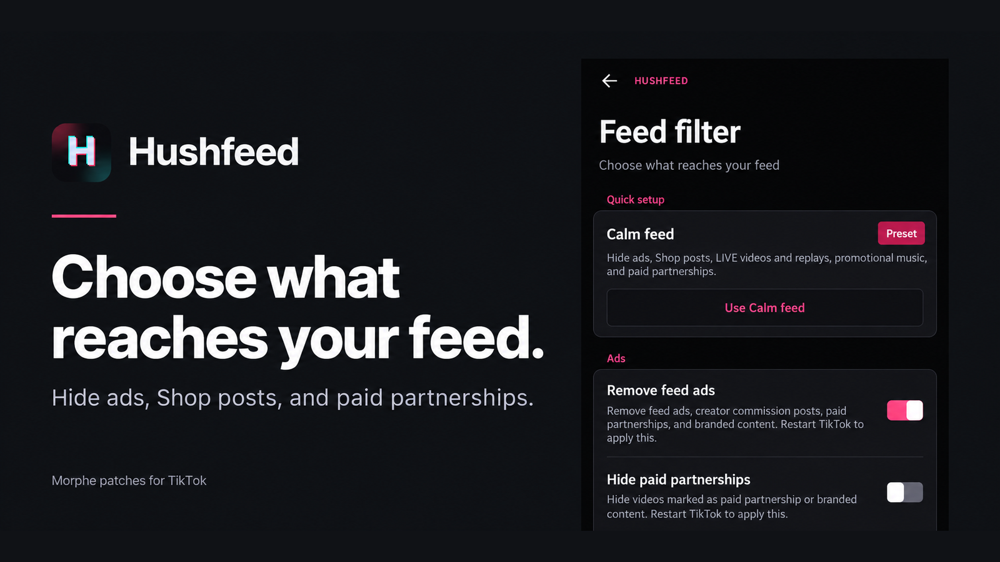

<p align="center">
  <a href="CHANGELOG.md"></a>
  <a href="LICENSE"></a>
  <a href="https://www.android.com/"></a>
  <a href="https://github.com/MorpheApp/morphe-manager"></a>
  <a href="https://github.com/SysAdminDoc/hushfeed/discussions"></a>
  <a href="https://www.apkmirror.com/apk/tiktok-pte-ltd/tik-tok-including-musical-ly/"></a>
</p>

<p align="center">
  <a href="https://ko-fi.com/X8K126YVER">
    
  </a>
</p>

<p align="center">
  <sub><em>If Hushfeed makes TikTok better for you, a coffee helps me keep testing patches and maintaining them as TikTok changes.</em></sub>
</p>

# Hushfeed

Hushfeed is a [Morphe](https://github.com/MorpheApp/morphe-manager) patch bundle for people who want TikTok to behave differently. It can cut feed clutter, guard risky taps, improve downloads and expose controls TikTok leaves buried or unavailable. Every selected patch is configured from one native settings screen inside the app.

**[Add Hushfeed to Morphe](https://morphe.software/add-source?github=SysAdminDoc%2Fhushfeed)** | [Download the latest bundle](https://github.com/SysAdminDoc/hushfeed/releases/latest) | [Tour the settings](#settings-tour) | [Browse the 130 source patches](#patches)

> [!IMPORTANT]
> Hushfeed targets the global TikTok package, `com.zhiliaoapp.musically`, version [47.1.4](https://www.apkmirror.com/apk/tiktok-pte-ltd/tik-tok-including-musical-ly/tiktok-47-1-4-release/tiktok-47-1-4-2-android-apk-download/). Use that exact APK when patching. See [Supported target](#supported-target) for the verified build details.

Hushfeed v0.69.0 contains 130 patches for TikTok 47.0.3, 47.1.3 and 47.1.4. New in this one: picture-in-picture, App lock, Lock the feed and Block popups, a fade for the controls over videos, a first video that waits for your tap, and What's new in your phone's language. It needs Morphe Manager 1.34.0 or newer.

The main branch contains 130 patches, the same set as v0.69.0.

## Pick what changes

- **Feed:** Start with the reversible Calm feed preset, or hide ads, Shop, livestreams, stories, photo posts, unwanted creators and videos matching your own rules. Remove feed ads also catches paid partnerships and creator commission posts, including location-affiliate videos. A profile you open only loses its ads, so your view and like limits never thin it out, and your own posts are never hidden. The LIVE feed you swipe through has its own filters too, for gaming, Shop and sponsored rooms, verified creators, categories you name and viewer or follower counts. TikTok can also open on Following, Friends, Inbox or Profile instead of For You.
- **Touch controls:** Add second-tap protection to Follow, Like, comment and story likes and quick reposts. Remap or disable long press and double tap, and keep For You in place when you tap Home or pull down. A long press on Comment, Share or Favorites can play at the hold speed instead of opening TikTok's menu. TikTok's own play and pause, previous and next buttons can sit on the feed too, the ones it otherwise keeps for screen reader users. In the share sheet, TikTok selects friends first and sends only when you tap Send.
- **Playback:** Choose speed and quality, stop loops, resume a video after scrolling or move to the next one automatically. Keep a video playing after you leave the app or turn the screen off.
- **Downloads:** Save watermark-free video, original photos, separate audio and SRT subtitles with filenames and folders you control. The save button also works on videos whose creator turned downloading off. A save of several files shows a running count with a Cancel, and the result says what landed.
- **Comments and inbox:** Filter comment text or accounts, translate comments and decide which Inbox rows appear. A creator's poll in the comments can show how the vote stands before you pick. Tapping more under a video can open its comments with the whole caption on top. Compact comment header removes the count, sort and close row and the suggestion area above it. Close comments with Back or a downward swipe. It's optional and needs a restart.
- **Privacy and diagnostics:** Turn off supported telemetry, hide view and typing reports, keep videos out of Watch history, back up settings and export a useful diagnostic report. TikTok can also sit behind your phone's fingerprint or PIN.

Compact comment header keeps headers that switch between different lists, so those tabs remain reachable.

**Easier comment likes**, under Comments, extends the heart's touch area into nearby blank space. The icon and row spacing don't change. Text and neighboring controls keep their own space. It's off by default and needs a restart.

Feed screen has separate options to hide the **Full screen button** and **location labels** over videos, including badges listing multiple places. They don't remove the videos or change location permissions.

**Hide effect and template tags**, on the same page, takes away the tags above a description that ask you to try an effect, a template, CapCut or an AI style. Film, drama and place tags stay, and so does the music line (its "Contains:" song credit has its own switch, Hide the music line). It's off by default and works without a restart.

Want to skip those videos entirely? Turn on **Filter location-tagged videos** under Feed filter > Kinds of post. It's independent of badge hiding and includes posts that aren't paid ads. These options are off by default and need a restart.

If one of the marker switches (Hide Series, say, or Hide playlist videos) empties three lists of five or more in a row, a banner names that switch and its button opens the row. A filter that has started matching everything shouldn't read as TikTok breaking. Nothing gets switched off for you.

**Hide the search bar below videos**, under Feed screen, removes the suggested-search strip above the bottom tabs. Video details and side controls can use its space. The top search button and comment suggestions have their own switches. This option is off by default and needs a restart.

**Hide the Tako bubble**, under Feed tabs, also covers the Tako bar TikTok draws above the comment list (the strip of suggested questions and image prompts) and the Ask Tako pill at the head of the search results tabs. Same switch, nothing extra to turn on. Restart TikTok after changing it.

Some regions get extras the rest never see. **Hide the Report button on videos**, under Feed screen, removes the flag button above the creator's picture. **Hide search rewards**, under App, removes the points banner under the search box and the coin counter floating over results. Both are off by default, and neither could be tried on our own phones, so reports on how they behave are welcome.

The settings screen comes in English, German, Spanish, Italian, Indonesian, Brazilian Portuguese, Russian, Turkish and Azerbaijani. It follows the language TikTok runs in, which is your phone's language unless you've picked another one for the app.

One-tap blocking skips to the next video as soon as TikTok confirms the block. A compact **Unblock** button appears at the top left for two seconds. You can also unblock later in TikTok's **Privacy > Blocked accounts**. A delayed response won't skip another video if you've already moved on.

The block, local hide, sound and Not interested controls, rendered in a local UI test:

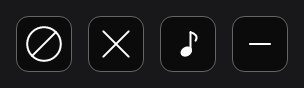

The compact Unblock action, also rendered from the actual control in a local UI test:

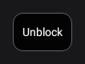

## Install

1. Get the TikTok 47.1.4 APK. Google Play only offers the newest build, so take it from APKMirror: [47.1.4](https://www.apkmirror.com/apk/tiktok-pte-ltd/tik-tok-including-musical-ly/tiktok-47-1-4-release/tiktok-47-1-4-2-android-apk-download/). When you pick that file in Morphe Manager on Android 11 or newer, Manager checks that TikTok's own key signed it and warns you if a different one did. That warning means the file was changed after TikTok published it, so download it again instead of patching it.
2. Use Morphe Manager 1.34.0 or newer. Manager refuses a bundle built against a patcher newer than its own, and this one is built against patcher 1.15.1, which Manager 1.34.0 was the first to ship. On anything older the bundle won't load.
3. Add Hushfeed as a source in Morphe Manager. The quickest way is this link on the phone: [Add Hushfeed to Morphe](https://morphe.software/add-source?github=SysAdminDoc%2Fhushfeed). Some in-app browsers block Android from handing a web link to another app. If **Open in Morphe** leaves you in the browser, open Morphe Manager, tap **Sources**, tap **+**, and paste `https://github.com/SysAdminDoc/hushfeed`. You can also download the `.mpp` file from the [latest release](https://github.com/SysAdminDoc/hushfeed/releases/latest) and load it as a local bundle.
4. Pick the patches. Simple mode in Morphe Manager selects 107 of the 130 Hushfeed patches, and every switch they add starts off, so TikTok looks and works as it ships until you turn something on in Hushfeed settings. You only need Expert mode in Manager settings for the other 23, and [Patches](#patches) says why each one stays out. Manager 1.34.0 shows all 130 Hushfeed patches in eleven categories that you can expand or collapse. Patch the original APK from step 1. Hushfeed stops with an error on an APK it has already patched. Keep the manager's existing signing key so TikTok stays logged in across updates. AMOLED dark theme rewrites TikTok's color resources, and patching with it on runs slower when the memory limit is low, so give the manager 768 MB or more when it's on. It still finishes at 640 MB, just slower. On a Galaxy S22 patching TikTok 47.1.3 with v0.69.0's smaller recommended set plus AMOLED took about 6 1/2 minutes at 640 MB and a little over 6 at 768 MB, and on a Galaxy S25 every patch at once took over an hour at 640 MB before Hushfeed's patches got faster. That smaller set alone fit in 640 MB, about 5 1/2 minutes on the S22, and recent Manager versions already start capable phones at 1,024 MB. Hide Play Store update offer also decodes the manifest, so raise the limit if that patch runs out of memory. A run that sits at 24 or 25 percent and never moves may also need more memory. Cancel it, raise the limit to at least 768 MB if it's lower and start again. If that still stalls, try 512 MB, which gives the patcher less to hold at once.
5. Install the patched APK. Google's 2026-09-30 verification rollout covers participating app stores in Brazil, Indonesia, Singapore and Thailand. Direct sideloads aren't included in that initial phase, and ADB installs are unchanged. See the [official Android FAQ](https://developer.android.com/developer-verification/guides/faq) for current requirements.
6. Open TikTok and go to Settings and privacy. Hushfeed is the first row. Tap it to find the switches for every patch you selected. If you're signed out, long-press **Home** on the bottom bar to open Hushfeed settings without going through Profile or signing in. Keep both **Settings** and **Feed tab navigation** selected when patching to use this shortcut.

Selected runtime controls activate when TikTok starts and can be changed in Hushfeed settings. Resource-removal options run while patching and can't be undone by Pause or a settings import. Read the [native-language recovery steps](#tiktok-stays-in-english-after-removing-language-packs) before removing languages. The Settings patch adds the entry point and is selected by default. Deselect it and the other patches still apply, but their switches have nowhere to live. `patches-bundle.json` in the repository root is the source index Morphe reads for the published bundle.

The Home shortcut starts on and keeps your choice during Pause, so you can return to settings and resume Hushfeed after closing the screen. Ordinary Home taps still work. If you turn off **Long-press Home for Hushfeed settings**, leave another settings entry available. A Home tab with its own TikTok long-press action keeps that action. This shortcut opens Hushfeed settings; TikTok still requires an account for its account-only features.

If Morphe reported "The remote metadata file is unavailable" for Hushfeed v0.51.0, refresh the source. The v0.52.0 source update corrects a timestamp that Manager couldn't read. You don't need to reinstall Manager, clear its data or change its signing key.

### Which managers can load it

Morphe Manager 1.34.0 or newer loads Hushfeed on the phone, and morphe-desktop does it from a computer. Universal ReVanced Manager can't import a Morphe bundle, so patches picked there never reach TikTok ([its issue #733](https://github.com/Jman-Github/Universal-ReVanced-Manager/issues/733)). Use Morphe Manager instead.

## Troubleshooting

### TikTok stays in English after removing language packs

Remove unused language packs keeps every native TikTok language until you change its Languages to keep option, and `all` or a blank option keeps them all. Before v0.67.0 the option started at `en` when you picked the patch, so if you patched with an older bundle, check that it says `all` or lists the languages you want. A list such as `en,tr` keeps English and Turkish; `en` keeps only English. English always stays as the fallback. Hushfeed's settings translations are separate from TikTok's native packs.

Pause Hushfeed and importing settings can't restore files removed at patch time. Repatch a clean official APK with every language kept, or with the missing language in the list. Match the installed package name, including the Clone app choice, and use the same signing key. The new version code must be at least the installed one. If you already applied Hide Play Store update offer, keep that patch selected so its raised code stays the same. Install over the existing app to preserve its stored account data.

### Logging in fails

Login trouble is the most common complaint about any patched TikTok. These are the fixes people report:

- Turn off Private DNS, AdGuard or any other ad blocker while you log in. They can block the addresses TikTok checks a login against.
- After several failed tries TikTok stops taking new ones for a while. Wait an hour, then try again.
- Facebook login can't work on a patched build. Facebook checks the app's signing key, and a patched TikTok carries your manager's key instead of TikTok's. Log in with your email or phone number and a code, or with Google.
- Since v0.67.0, Hide CAPTCHA popups isn't available and every verification challenge stays visible. Older builds still have the switch, so turn it off and restart TikTok when you're looking into a stalled login.

### Can Feature Gate Lab hide CAPTCHA popups?

Not today. A CAPTCHA is TikTok's servers asking you to prove you're a person, and none of the Lab's reviewed presets touch it. Hide CAPTCHA popups stays unavailable until it's been checked on a phone against a real challenge, so a hidden one can't quietly stop a login or a like.

What the Lab does is change values the app reads for its own features, the same flags other TikTok mods flip. To try one:

1. Open Hushfeed settings and search for Feature Gate.
2. Open the Lab's menu, choose Reviewed presets and pick one. The preview shows each value before you apply it.
3. Tap Apply, turn on the overrides switch and restart TikTok.

Undo last Lab change puts the old values back. A gate that isn't in a reviewed preset can break sign-in or the feed, so leave those alone unless you know what it does. Some features also need TikTok's servers to allow them for your account, and no Lab value changes that.

### A LIVE auction says bidding is unavailable

A bid from a patched TikTok can fail with "Bidding is temporarily unavailable", and other payments may be refused the same way. The likely cause is TikTok's security library, which signs the requests TikTok's network stack sends and reads the app's signing certificate while it does. A patched TikTok carries your manager's certificate instead of TikTok's, and Hushfeed doesn't pass itself off as TikTok's own signed app for payment checks. Bid and buy from the official app.

### A photo post saved as a video still has TikTok's watermark

On a post that's one photo with a sound, TikTok's Download asks whether you want a video or the image. That video isn't one TikTok's servers keep. The post only carries the photo and the sound, so TikTok builds the video on your phone and adds its logo, the creator's handle and an end card while it does. Hushfeed's watermark-free saving swaps in the clean copy the server holds for a real video, and there isn't one here. Choose Download image for a clean copy of the photo, and with Advanced downloads, Download original photos saves it at the full size TikTok received.

If you want the video without TikTok's marks, turn on **Save photo posts as a video** under **Hushfeed settings > Downloads**. Download video then makes the MP4 itself from the original photo and the post's sound. It adds no logo, handle or end card. On a post with several photos, Download asks whether you want the photos you picked as full-size originals or one video of them.

Turn on **Download original photos** under **Hushfeed settings > Downloads** to save the selected slides as separate source images. TikTok lists each of those photos as a HEIF copy first, a format plenty of galleries and computers can't open and some phones, Samsungs included, can't even decode. So on Android 9 and newer each photo is saved as a full-size JPEG instead, made from the WebP copy TikTok lists beside the HEIF. Video quality and Remove sound don't take over photo posts. A selected live photo saved as a motion clip keeps TikTok's native save. If the original images are unavailable, Hushfeed says so before letting the native save run.

### Patching stops at 24 or 25 percent

The manager has run short of memory. Step 4 of [Install](#install) says which limit to change and what to try if it still stalls.

### The file from APKMirror ends in .apkm

That's a split bundle. Morphe Manager merges it into one APK, and AMOLED dark theme works on that. The desktop CLI merges it differently, and the dark theme and Custom launcher icon refuse the result, which [Why you have to fetch that APK yourself](#why-you-have-to-fetch-that-apk-yourself) explains.

### Profile and Inbox are pure black, but I didn't pick AMOLED dark theme

That's TikTok. On TikTok 47.1.4 its own dark mode paints Profile and Inbox black, while comments, share and search stay dark gray. A build without AMOLED dark theme shows the same colors with Hushfeed paused, and its color table matches TikTok's original one for one. AMOLED dark theme is what turns those gray sheets black as well.

### Can I select every patch at once?

Yes. Every release is patched with all of them selected before it ships, so no two refuse to go in together. The one thing to watch is memory: with AMOLED dark theme selected, raise the manager's limit as step 4 of [Install](#install) says. Hide Play Store update offer, Change app name and Custom launcher icon also decode resources, so raise the limit if one of them runs out of memory. Mixing Hushfeed with another TikTok bundle is a different question, and [Moving from Kveld](#moving-from-kveld) covers the overlap we know about.

### A second TikTok beside the store app

Morphe's own patch bundle has Clone app, which gives the patched TikTok a new package name so Android installs it next to the one from the store. Keep its Update permissions and Update providers options on, or Android refuses the install. Clone app alone isn't enough for TikTok, though. The copy reports its new name when it registers your phone, TikTok's servers don't give it a device ID, and logging in fails. Select Run beside the store app from Hushfeed as well and the copy registers under TikTok's own name. Change app name helps tell the two icons apart. Each app keeps its own data and its own login.

Google and Facebook sign-in check the app's package name and signing key, so they can't work in the copy. Log in to the copy with your email or phone number and a code.

### Unfollowing a lot of accounts at once

TikTok already does this. Open your profile, tap Following, then Manage at the right end of the Sort by row. Every account gets a checkbox, and the Unfollow button at the bottom takes all the ticked ones. To find the accounts you followed longest ago, set Sort by to Date followed: latest and scroll to the end, where the oldest are. The 10,000 limit on how many accounts you can follow is checked by TikTok's servers, so no patch can raise it.

### Is it Hushfeed? Pause it and see

Hushfeed settings > App & advanced > Pause Hushfeed turns off supported runtime features from the next start. Your settings stay exactly as they were, and switching Pause off brings them back after a restart. A diagnostic export made while paused says so at the top.

Pause doesn't restore the original APK. The static changes below remain, and startup behavior can differ by Hushfeed version. If a problem persists while paused, compare with an identified official build before ruling out every patch.

Pausing also turns off your screen-time budget, so a day you've locked refuses it until the day starts over. App lock is the other way around: it stays on while Hushfeed is paused, so pausing can't be used to get past it.

A few patches change TikTok with no switch in front of them, and Pause can't reach those:

- Settings itself, which is how you get back to the switch.
- AMOLED dark theme, Hide Play Store update offer, Change app name and Custom launcher icon.
- Disable screen capture detection, Disable login requirement, Fix Google login, Enable voice comments and Stop on-device AI profiling.
- Skip the splash ad, Limit background traffic, Drop the animated image cache and Skip update checks.
- Block P2P video relay and the four patches that take files out of the app: Remove content credential and card scanner assets, Remove unused language packs, Remove creation tools and Remove LIVE extras.
- In Downloads, the folder and file name you picked still apply, as do the fallback to a clean video address and the save button on stickers.

While paused, TikTok's own bottom bar comes back, + button included. If Remove creation tools was patched in, the camera and editor behind that button still won't work, because their files were taken out when the app was patched.

Since v0.67.1, Limit background traffic keeps push setup intact unless you enable Skip push setup in that patch's options. The option starts off even when you select All. If you patched with v0.67.0 and selected this patch, repatch TikTok's original APK with v0.67.1 to get push setup back. Pausing Hushfeed leaves that change in place, so a fresh patch is the way back. If you'd rather have a switch you can turn back off, Notification controls has Turn off push notifications.

### TikTok closes right after it opens

If TikTok crashes within a minute of starting three times in a row, Hushfeed pauses itself on the next start. The top of Hushfeed settings then says why and offers Turn Hushfeed back on. Being swiped away or force-stopped doesn't count toward the three.

TikTok has a recovery of its own for this. On the third crash in a row at launch it clears most of what it has saved, so you may see its interest picker again. Hushfeed's settings are on the short list it keeps, so they're all still there when you turn Hushfeed back on.

If you can't reach the settings at all, create an empty file named `hushfeed-safe-mode` in `Android/data/com.zhiliaoapp.musically/files/`. From a computer with adb that's `adb shell touch /sdcard/Android/data/com.zhiliaoapp.musically/files/hushfeed-safe-mode`. Hushfeed stays paused for as long as the file is there, and Turn Hushfeed back on deletes it.

## Going back

### To plain TikTok

1. If you might come back, save your Hushfeed settings first: Hushfeed settings > Backup and restore > Back up settings. The file goes wherever you pick, so choose a folder you'll find again.
2. Uninstall the patched TikTok, then install TikTok from Google Play. Android won't put one over the other, because they're signed with different keys. Uninstalling clears the app's data, so you'll log in again afterwards.

### To an older Hushfeed

Download that release's `.mpp` from the [releases page](https://github.com/SysAdminDoc/hushfeed/releases) and load it in Morphe Manager as a local bundle, then patch and install as usual. As long as the manager signs with the same key, it installs over the current build and keeps your login and settings.

### Keeping the signing key

The manager signs every patched build with its own key, and Android only installs an update over the old app when both carry the same one. So don't reset that key, and remember it when you move to a new phone or reinstall the manager. A build signed with a new key means uninstalling first, which clears your login and data. Your settings come back from Backup and restore > Restore settings.

<br>

## Patches

Playback quality chooses among the video streams TikTok offers. It doesn't cap the video's frame rate. Keep the screen's refresh rate changes the display request, not the video frames.

Eleven patches that were optional and in the Performance group at the time were measured on a Galaxy S22 running TikTok 47.0.3, each added to what was then the recommended set plus Hide Play Store update offer, after a cold start and eight videos. None of them, alone or all together, moved TikTok's total memory use beyond the spread between runs of the same build, which was about 150 MB around a median of 1,040 MB. With all of them on, loaded code fell by about 13 MB and the APK got about 85 MB smaller. The five that remove files say in their rows how much storage they save. Most of TikTok's memory is its own code and libraries, and no patch shrinks those. Turn off screen transitions came later and wasn't part of that run.

Simple mode in Morphe Manager selects 107 of these patches. Each row below says what the patch changes, why you might want it, and whether its switch starts on or off and where to find it. Most switches start off, so TikTok looks and works the way it ships until you turn something on. The other 23 stay out of the default selection, and you pick them in Expert mode.

- Change app name, Custom launcher icon, Hide Play Store update offer, Look like the store app and Run beside the store app change the app's name, icon, signature, package or version code.
- AMOLED dark theme, Block P2P video relay, Remove content credential and card scanner assets, Remove creation tools, Remove LIVE extras and Remove unused language packs change TikTok's files while patching. Only a fresh patch takes that back.
- Drop the animated image cache, Enable voice comments, Limit background traffic, Skip the splash ad, Skip update checks, Stop on-device AI profiling and Trust user certificates change TikTok with no switch in front of them.
- Feature Gate Recorder, Hide the risk control CAPTCHA and Network request report only record what TikTok does, for research.
- Region spoof changes the region TikTok sees on every read, sign-in included. Skip first-launch setup only helps when it's picked before TikTok's first start, so its switch starts on.

| Patch | Description |
|---|---|
| `Advanced downloads` | Adds more ways to save: pick the video quality, save full-size photos, the sound on its own or a photo post as one video, and hold a profile picture or story to save it. Starts off. Turn it on in Hushfeed settings > Downloads. |
| `Allow Duet and Stitch` | Shows the Duet and Stitch buttons on videos whose creator turned them off, so you can still make one. TikTok may still refuse some videos or the upload. Starts off. Turn it on in Hushfeed settings > Share sheet. |
| `Allow screenshots and Circle to Search` | Lets screenshots, screen recordings and Circle to Search work on TikTok screens that would otherwise come out black. Starts off. Turn it on in Hushfeed settings > App, then restart TikTok. |
| `Always show publish date` | Shows the date a video was posted next to the creator's name, so you can tell how old it is. It can also show the exact time, or dates on profile grids. On by default. Turn it off in Hushfeed settings > Feed screen. |
| `Always upload in HD` | Posts every video you upload in HD, as if you'd turned on TikTok's own HD upload setting each time. Videos TikTok doesn't count as high quality post as usual. Starts off. Turn it on in Hushfeed settings > App. |
| `AMOLED dark theme` | Makes TikTok's dark mode backgrounds pure black, or a dark color you pick in this patch's options. Black lets OLED screens switch those pixels off. Light mode doesn't change. It's built in while patching, so only patching again without it undoes it. |
| `App lock` | Asks for your fingerprint, face or PIN before TikTok opens, and again when you come back after a time you pick, so nobody else can open it on your phone. Starts off. Turn it on in Hushfeed settings > Privacy. |
| `Automatic video advance` | Moves on to the next video by itself when one ends, so you can watch hands-free. It can also turn on TikTok's auto scroll in search results. Starts off. Turn it on in Hushfeed settings > Playback. |
| `Block author button` | Adds buttons on videos to block the creator, hide them only on your phone, or block the sound, so you can get rid of what you don't want in one tap. Starts off. Turn it on in Hushfeed settings > Feed screen. |
| `Block contact list access` | Gives TikTok an empty contact list when it tries to read your phone's contacts, so it can't use them to suggest friends. Starts off. Turn it on in Hushfeed settings > Privacy. |
| `Block installed app scanning` | Gives TikTok an empty list when it asks which apps are on your phone, so it learns less about you. Opening another app from TikTok still works. Starts off. Turn it on in Hushfeed settings > Privacy. |
| `Block P2P video relay` | Removes the files TikTok uses to pass videos on to other viewers through your phone's internet connection. The app gets about 3.5 MB smaller. It's built in while patching, so only patching again without it brings them back. |
| `Block popups` | Lets you stop TikTok's popups, like friend suggestions and offers. Each one joins a checklist after it first appears, and once ticked it won't come back. Sign-in, age and verification screens are never blocked. Starts off. Turn it on in Hushfeed settings > Feed screen. |
| `Block suggested video notifications` | Stops TikTok's "Videos you might like" notifications about popular videos it picked for you. Messages, comments, likes and posts from people you follow still come through. On by default. Turn it off in Hushfeed settings > Inbox. |
| `Camera and microphone indicator` | Shows a small mark in the top corner while TikTok is using the camera or microphone, so you always know when it is. Starts off. Turn it on in Hushfeed settings > Privacy. |
| `Change app name` | Shows a name you choose under the app icon, so the patched TikTok is easy to tell apart from another copy. Type the name in this patch's options. Inside the app it still says TikTok. |
| `Comment publish diagnostics` | Adds a note to Hushfeed's diagnostic report about how far a comment got when it fails to post, which helps track down comments that vanish without an error. Works as soon as you patch it in, with no switch. |
| `Comment send fix` | Fixes comments that TikTok sometimes drops without any message, so the comment you send actually posts. Works as soon as you patch it in, with no switch. |
| `Comment sort controls` | Shows TikTok's full comment sort menu on every video, with hot, newest, media and creator options, even when your account only got a cut-down version. Starts off. Turn it on in Hushfeed settings > Comments. |
| `Comment tools` | Hides comments with words you pick or from accounts you pick, and adds a search box for a video's comments. It can also make links tappable and show poll results before you vote. Starts off. Turn it on in Hushfeed settings > Comments. |
| `Confirm feed interactions` | Asks for a second tap before Follow, a like, or a quick repost goes through, so a stray tap doesn't count. Starts off. Turn it on in Hushfeed settings > Feed screen. |
| `Copy bio and IDs` | Lets you long-press a bio to copy it, and adds share sheet buttons that copy a username, user ID or video ID. On by default. Turn it off in Hushfeed settings > App. |
| `Copy comments without username` | When you copy a comment, you get just its text, without the username in front. On by default. Turn it off in Hushfeed settings > Comments. |
| `Custom launcher icon` | Gives TikTok's home screen icon a themed version that takes your wallpaper's color on Android 13 and up. The options can also make it black, plain or your own picture. Only patching again without it puts the old icon back. |
| `Custom offline videos limit` | Lets you pick how many videos TikTok saves for watching offline, from 1 to 10,000, and keep them until you delete them. Handy when you're often without internet. Starts off. Turn it on in Hushfeed settings > Downloads. |
| `Device privacy guard` | Stops TikTok reading what you copied, hides that you're on a VPN, and gives it a blank advertising ID so apps can't match you by it. Each has its own switch. Starts off. Turn it on in Hushfeed settings > Privacy. |
| `Diagnostic tools` | Adds logs and reports you can save or share when something goes wrong, so a problem is easier to report and fix. Starts off. Turn it on in Hushfeed settings > Diagnostics. |
| `Disable login requirement` | Stops TikTok from forcing you to sign in before you can keep browsing. Works as soon as you patch it in, with no switch. |
| `Disable screen capture detection` | Stops TikTok from noticing and reacting when you take a screenshot or record the screen. Works as soon as you patch it in, with no switch. |
| `Disable telemetry` | Stops TikTok sending usage statistics and crash reports to TikTok and the tracking services it uses, so less of what you do in the app leaves your phone. Starts off. Turn it on in Hushfeed settings > Privacy. |
| `Disable the long press quick share` | Stops a long press on Share from opening TikTok's quick share, so you don't send a video by accident. Starts off. Turn it on in Hushfeed settings > Feed screen. |
| `Disable the long press repost` | Stops a long press on Like from opening TikTok's repost option, so you don't repost by accident. Starts off. Turn it on in Hushfeed settings > Feed screen. |
| `Double-tap controls` | Lets a double tap on a video open its comments or do nothing, instead of liking it, so you don't like videos by accident. Starts off. Pick an action in Hushfeed settings > Feed screen. |
| `Downloads` | Saves videos and photos without TikTok's watermark, even when the creator turned downloads off. You can also choose the folders and file names. On by default. Turn it off in Hushfeed settings > Downloads. |
| `Drop the animated image cache` | Makes TikTok keep only the frame on screen for stickers and GIFs instead of every frame, so they use less memory and still play smoothly. It has no switch, so only patching again without it undoes it. |
| `Enable voice comments` | Turns on TikTok's voice comments, so you can record and post a spoken comment, for accounts that don't have them yet. It has no switch and hasn't been tried on a real account, so it may not work. |
| `Expand activity list` | Shows the whole Activity and New followers lists in the Inbox, so you don't have to tap View all. Starts off. Turn it on in Hushfeed settings > Inbox. |
| `Feature Gate Lab` | Adds an advanced page that lists the hidden settings TikTok uses to test features and lets you change them. It's for people who like to experiment. Starts off. Turn it on in Hushfeed settings > Diagnostics. |
| `Feature Gate Recorder` | Records which hidden TikTok settings the app reads while you use it, and which ones changed. It's a research tool and changes nothing in TikTok. Start a recording in Hushfeed settings > Diagnostics. |
| `Feed filter` | Hides ads in the feed, and lets you hide other things you don't want to see, like LIVEs, Shop posts, AI videos or videos with words, creators or sounds you pick. Hiding ads is on by default. Everything else starts off in Hushfeed settings > Feed filter. |
| `Feed tab navigation` | Lets you hide feed and bottom tabs you don't use, rename the bottom tabs, choose the tab TikTok opens on and stop For You reloading when you tap Home. Starts off, except holding Home to open Hushfeed settings. Find it in Hushfeed settings > Feed tabs. |
| `Feed text sizes` | Lets you make video descriptions and creator names bigger or smaller, so they're easier to read. Starts off. Pick a size in Hushfeed settings > Feed screen. |
| `Fit the video to the screen` | Shows the whole video instead of cutting off its sides on folding phones, squarer screens and split screen. A second switch does the opposite and fills the screen. Starts off. Turn it on in Hushfeed settings > Playback. |
| `Fix Google login` | Makes Sign in with Google work in the patched app, where it would otherwise fail. Works as soon as you patch it in, with no switch. |
| `Foldable split comment view` | On a folding phone or tablet, shows comments beside the video instead of over it when the screen is wide enough. Starts off. Turn it on in Hushfeed settings > App. |
| `Follow diagnostics` | Tells you when TikTok quietly turned down a follow, and why, since the app shows it as if it worked. With diagnostic logging on, the details go in the report too. Works as soon as you patch it in, with no switch. |
| `Ghost mode` | Stops TikTok telling people you viewed their story or profile, or that you're typing. What TikTok already recorded stays. A separate switch hides your online status. Starts off. Turn it on in Hushfeed settings > Privacy. |
| `Hide already seen videos` | Remembers the videos you've watched and hides them when the feed sends them again, so you only see new ones. The list stays on your phone. Starts off. Turn it on in Hushfeed settings > Feed filter. |
| `Hide CAPTCHA popups` | Notes in Hushfeed's diagnostic report when TikTok shows a verification puzzle. Its hide switch isn't available on this TikTok version, so every puzzle still shows. Works as soon as you patch it in. |
| `Hide comment popup ads` | Stops the brand animation that pops up over the comments when someone types a word or emoji an advertiser paid for. Starts off. Turn it on in Hushfeed settings > Comments. |
| `Hide feed follow button` | Removes the + follow button under creators' pictures on the feed, so you don't follow someone by accident. Starts off. Turn it on in Hushfeed settings > Feed screen. |
| `Hide feed LIVE button` | Removes the LIVE button and the side menu button from the top left of the feed, for a cleaner screen. Each has its own switch, and both start off. Turn them on in Hushfeed settings > Feed screen. |
| `Hide feed save button` | Removes the save button from the right side of the feed, for a cleaner screen. Starts off. Turn it on in Hushfeed settings > Feed screen. |
| `Hide feed search button` | Removes the search button from the top right of the feed, for a cleaner screen. Starts off. Turn it on in Hushfeed settings > Feed screen. |
| `Hide floating promotions` | Hides the floating promotion badges, coins and timers on the feed, and can hide the rewards button on your profile. Starts off. Turn it on in Hushfeed settings > Feed screen, and App for the rewards button. |
| `Hide inbox items` | Lets you hide Inbox rows you don't use, like message requests, TikTok Shop and the stories row, plus call buttons and suggested replies in chats. Each has its own switch. Starts off. Turn it on in Hushfeed settings > Inbox. |
| `Hide inbox stories` | Hides the row of stories at the top of the Inbox. It uses the same switch as Hide inbox items. Starts off. Turn it on in Hushfeed settings > Inbox. |
| `Hide comment typing suggestions` | Hides the emoji and sticker suggestions that pop up above the comment box while you type. The emoji and sticker buttons still work. Starts off. Turn it on in Hushfeed settings > Comments. |
| `Hide profile shortcuts` | Hides the shortcuts you pick from the row under a profile's bio, like TikTok Studio or Your orders, and can hide the Thoughts bubble. Starts off. Turn it on in Hushfeed settings > App, then restart TikTok. |
| `Hide search suggestions` | Hides the searches TikTok suggests before you type, and can hide the search rewards banner. Your own search history stays. Starts off. Turn it on in Hushfeed settings > App. |
| `Hide suggested accounts` | Hides TikTok's People you may like suggestions in the Inbox, on profiles, on the Friends tab and in the feed. It uses the same switch as Hide inbox items. Starts off. Turn it on in Hushfeed settings > Inbox. |
| `Hide the launcher shortcuts` | Empties the menu that pops up when you press and hold TikTok's icon on your home screen. Tapping the icon still opens the app. Starts off. Turn it on in Hushfeed settings > App. |
| `Hide Play Store update offer` | Stops the Play Store offering to swap the patched TikTok for the store version. The catch: a build with a lower version number won't install over it, and uninstalling to go back can erase TikTok's data on your phone. |
| `Hide the risk control CAPTCHA` | Notes in the diagnostic report when TikTok's account safety check decides to show a verification puzzle. It doesn't hide anything, so it's only useful for research. It sits on TikTok's account checks, which is why it isn't picked for you. |
| `Hide video overlays` | Lets you hide clutter over videos, like the caption, the music line, buttons on the right, surveys and location labels, so you see more of the video. Each has its own switch. Starts off. Turn it on in Hushfeed settings > Feed screen. |
| `Hold-and-slide 2x lock` | Turns on TikTok's own gesture where you hold a video, slide down and let go to keep it playing fast without holding. Starts off. Turn it on in Hushfeed settings > Feed screen. |
| `In-app browser privacy guard` | Stops websites you open in TikTok's built-in browser from reaching into the TikTok app. TikTok's own pages, like Watch history and checkout, keep working. Starts off. Turn it on in Hushfeed settings > Privacy. |
| `Keep a streak going` | Sends a daily message you choose to people you pick, at a time you set, so your message streaks keep going on days you don't open TikTok. Starts off. Turn it on in Hushfeed settings > Inbox. |
| `Keep playing in the background` | Keeps the video playing when you leave TikTok or turn the screen off, with a notification to pause it. Handy for music and talks. Starts off. Turn it on in Hushfeed settings > Playback, then restart TikTok. |
| `Keep pulled sounds` | Plays the sound on videos TikTok muted for copyright or because of where you live. TikTok may still say the sound isn't available. Starts off. Turn it on in Hushfeed settings > Playback. |
| `Keep the Favorites tab` | Keeps the Favorites tab and your saved videos on your profile when TikTok tries out a version of the app that hides them. On by default. Turn it off in Hushfeed settings > App. |
| `Keep the screen's refresh rate` | Stops TikTok slowing your screen down to the video's frame rate, so scrolling stays smooth on 90 or 120 Hz phones. Starts off. Turn it on in Hushfeed settings > App. |
| `Lift text length limits` | Lets you write longer comments, repost notes and bios than the app normally allows. TikTok can still refuse one that's too long. Starts off. Turn it on in Hushfeed settings > Comments. |
| `Limit background traffic` | Stops TikTok loading upcoming videos ahead of time, which uses less data in the background, but videos may take a moment longer to start. It has no switch, so only patching again without it undoes it. |
| `LIVE controls` | Stops a LIVE in the feed from opening by itself after a countdown, and can show a LIVE's exact viewer count instead of a rounded one. Starts off. Turn it on in Hushfeed settings > Playback. |
| `Location access governor` | Gives TikTok no location when it asks, so it can't see where you are from your phone's location services. Starts off. Turn it on in Hushfeed settings > Privacy. |
| `Long-press controls` | Lets a long press on a video do something else, like open the comments, copy the link, save the sound or the frame on screen, or set a sleep timer. Starts off. Pick an action in Hushfeed settings > Feed screen. |
| `Look like the store app` | Makes the patched app answer TikTok's checks as if it came from the Play Store, which can help when follows or likes undo themselves. TikTok has other checks, so it may not be enough. On once picked. Turn it off in Hushfeed settings > App. |
| `Mute feed videos` | Mutes feed videos without changing your phone's volume, so music from another app keeps playing. You can also add a mute button on videos. Starts off. Turn it on in Hushfeed settings > Playback. |
| `Network proxy` | Sends TikTok's feed, search and comments through a proxy server you set up. Videos and LIVEs still load directly, and other apps aren't affected. Starts off. Turn it on in Hushfeed settings > Region, then restart TikTok. |
| `Network request report` | Counts the requests TikTok sends to its servers and adds the totals to the diagnostic report. It changes nothing in TikTok, but it has no switch and most people don't need it. |
| `Not interested button` | Adds a button on videos that tells TikTok you're not interested in one tap, so it can show you fewer like it. Starts off. Turn it on in Hushfeed settings > Feed screen. |
| `Notification controls` | Lets you turn off new follower notifications and streak reminders, which TikTok has no switch for, or turn off TikTok's notifications altogether. Starts off. Turn it on in Hushfeed settings > Inbox. |
| `Open external links directly` | Opens website links from profiles and stories in your phone's own browser instead of TikTok's built-in one. On by default. Turn it off in Hushfeed settings > Privacy. |
| `Picture-in-picture` | Keeps the video playing in a small window when you leave TikTok, so you can keep watching while you use other apps. Starts off. Turn it on in Hushfeed settings > Playback. |
| `Play SDR instead of HDR` | Plays the normal version of HDR videos, so your screen doesn't suddenly jump to full brightness. Starts off. Turn it on in Hushfeed settings > Playback. |
| `Playback quality` | Lets you choose the video quality, like highest, lowest or 720p, and set a lower quality for mobile data to use less data. Starts off. Pick a quality in Hushfeed settings > Playback. |
| `Playback speed` | Remembers the speed you picked for the next video, and lets you set a default speed, add speeds up to 3x to the menu and choose the speed for press and hold. On by default. Turn it off in Hushfeed settings > Playback. |
| `Prefer H.264 playback` | Plays videos in an older format your phone decodes more easily, which can help older phones play smoothly and run cooler. Videos without it play as before. Starts off. Turn it on in Hushfeed settings > Playback. |
| `Region spoof` | Makes TikTok's region and time zone match the country you set for SIM spoof. It changes every region check, sign-in included, and its store region switch is experimental, so it isn't picked for you. Starts off. Turn it on in Hushfeed settings > Region. |
| `Remember clear display` | Keeps clear display, TikTok's mode that hides the buttons over a video, on as you swipe to the next video. It can also turn on by itself after a delay you pick, which starts off in Hushfeed settings > Feed screen. |
| `Remove avatar rings` | Takes the story and LIVE rings off profile pictures, so tapping a picture opens the profile instead of a story or LIVE. Starts off. Turn it on in Hushfeed settings > Feed screen. |
| `Remove content credential and card scanner assets` | Removes TikTok's built-in AI model files, payment card scanner and content credential files, saving about 19 MB of storage. Anything in TikTok that needs them may stop working. Only patching again without it brings them back. |
| `Remove creation tools` | Removes TikTok's camera, editing and effects files, saving about 40 MB of storage. The catch: the Create tab and every recording, editing and effects tool stop working. |
| `Remove LIVE extras` | Removes the files for LIVE co-hosting, matches, games and gift effects, so the app gets about 3 MB smaller. The catch: in LIVEs, battle scores and guest names can go missing, and co-hosting, games or animated gifts may stop working. |
| `Remove unused language packs` | Removes the app languages you don't list in this patch's options, saving up to about 26 MB of storage. English is always kept. With no list it keeps them all. Only patching again brings removed ones back. |
| `Repost diagnostics` | With diagnostic logging on, notes when you repost a video and what TikTok answered, to help track down reposts that don't stick. Works as soon as you patch it in, with no switch. |
| `Resource and battery governor` | Stops TikTok reading your phone's motion sensors, which it can use to identify your phone, and stops a background speed test that can use a lot of memory. Starts off. Turn it on in Hushfeed settings > Privacy. |
| `Resume videos after scrolling` | When you scroll back to a video, it picks up where you left off instead of starting over. On by default. Turn it off in Hushfeed settings > Playback. |
| `Run beside the store app` | Lets a renamed copy of TikTok, made with Morphe's Clone app patch, sign in while the regular TikTok stays installed. Pick it together with Clone app. Google and Facebook sign-in won't work in the copy, so use email or phone. |
| `Sanitize sharing links` | Removes the tracking codes from TikTok links you share, so the link carries less about you. It can also swap tiktok.com for another site. On by default. Turn it off in Hushfeed settings > Privacy. |
| `Settings` | Adds the Hushfeed settings page to TikTok, at the top of Settings and privacy. That's where you turn Hushfeed's features on and off. Works as soon as you patch it in, with no switch. |
| `Share sheet tools` | Lets you hide people, apps and buttons you don't use from the share sheet, and add apps you do use. Starts off. Turn it on in Hushfeed settings > Share sheet. |
| `Show author region` | Shows the country a video was posted from next to the creator's name. Starts off. Turn it on in Hushfeed settings > Feed screen. |
| `Show engagement rate` | Shows how many people liked, commented on, shared or saved a video compared with how many watched it, next to the creator's name. Starts off. Turn it on in Hushfeed settings > Feed screen. |
| `Show exact counts` | Shows likes, comments and other counts as full numbers, like 1,234,567 instead of 1.2M. Starts off. Turn it on in Hushfeed settings > Feed screen. |
| `Show follow status` | Shows on a profile whether that person follows you back, and marks accounts in your follow lists that don't. On by default. Turn it off in Hushfeed settings > App. |
| `Show LIVE search` | Adds TikTok's search button inside the LIVE section where TikTok supports it, so you can look for LIVEs. Starts off. Turn it on in Hushfeed settings > App. |
| `Show the progress bar` | Shows the progress bar on videos where TikTok hides it, so you can see how long a video is and skip around. On by default. Turn it off in Hushfeed settings > Playback. |
| `Show the progress bar thumbnail` | Shows a small preview picture while you drag the progress bar, so you can find the part you want. On by default. Turn it off in Hushfeed settings > Playback. |
| `SIM spoof` | Makes TikTok see the SIM country and carrier you choose. It may not change your region, since TikTok also goes by your internet connection and account. Starts off. Turn it on in Hushfeed settings > Region. |
| `Skip content warnings` | Plays videos without the warning screen you'd have to tap through first, and can hide the Check sources banner on unverified videos. Starts off. Turn it on in Hushfeed settings > Feed screen. |
| `Skip first-launch setup` | Skips TikTok's setup screens on a fresh install, like the interest picker and the swipe tutorial. Sign-in and age screens still show. Its switch is on once picked, since setup runs before you can reach settings. Turn it off in Hushfeed settings > App. |
| `Skip the splash ad` | Stops the full-screen ad TikTok can show while it starts up. It has no switch, so only patching again without it brings the ad back. |
| `Skip update checks` | Stops two background tasks TikTok uses to check for updates, one of them when your phone starts. Some in-app update prompts may stop. Play Store updates still work. It has no switch, so only patching again undoes it. |
| `Stay on the video in full screen` | When a video ends in TikTok's full screen view, it stays on that video instead of moving to the next one. Swiping still moves on. Starts off. Turn it on in Hushfeed settings > Playback. |
| `Stop on-device AI profiling` | Stops TikTok's built-in AI engine from starting, so it doesn't get a copy of everything TikTok logs about your use. TikTok works as if the engine weren't there. It has no switch, so only patching again without it undoes it. |
| `Stop recording watch history` | Stops TikTok adding the videos you watch to your Watch history. The catch: your views stop counting, and For You learns less about what you like. Starts off. Turn it on in Hushfeed settings > Privacy. |
| `Stop saving search history` | Stops TikTok saving your new searches on your phone. Older searches stay until you delete them, and TikTok's servers may keep their own record. Starts off. Turn it on in Hushfeed settings > Privacy. |
| `Stop search autoplay` | Stops videos in search results from playing by themselves. Each one shows its cover until you open it, so searching stays quiet. Starts off. Turn it on in Hushfeed settings > App. |
| `Stop video looping` | Stops a video at its end instead of playing it again. Starts off. Turn it on in Hushfeed settings > Playback. |
| `Story controls` | Lets a story replay when it ends instead of moving on, and keeps a photo story on screen until you tap or swipe. Starts off. Turn it on in Hushfeed settings > Playback. |
| `Subtitle tools` | Lets you make captions bigger, change their background and keep them in clear display, and save subtitle files with downloaded videos. Starts off. Turn it on in Hushfeed settings > Feed screen, and Downloads for subtitle files. |
| `Swipe-left controls` | Lets a left swipe on a video open its comments or do nothing, instead of opening the creator's profile. Starts off. Pick an action in Hushfeed settings > Feed screen. |
| `Translate comments` | Translates comments as they load, using TikTok's own translator, so you don't have to tap Translate on each one. Starts off. Turn it on in Hushfeed settings > Comments, where a second row lists languages TikTok's automatic translation should leave alone. |
| `Trust user certificates` | Lets TikTok trust security certificates you install yourself, so a tool like mitmproxy can show what the app sends. The risk: anyone who gets a certificate onto your phone can read TikTok's traffic too. Use it only on a test phone. |
| `Turn off haptics` | Stops the little vibrations TikTok makes when you tap or hold things. Your keyboard and your phone's own vibrations stay. Starts off. Turn it on in Hushfeed settings > App. |
| `Turn off screen transitions` | Opens and closes TikTok's screens without the sliding animation, so moving around feels quicker. Swipes still follow your finger. Starts off. Turn it on in Hushfeed settings > App. |
| `Use non-personalized search` | Shows search results that aren't tailored to your account. Starts off. Turn it on in Hushfeed settings > App. |
| `Use system font` | Shows TikTok's text in your phone's own font instead of TikTok's, and can use your phone's emoji too. Starts off. Turn it on in Hushfeed settings > App, then restart TikTok. |

## Settings tour

### Which search setting do I need?

| What you want to change | Setting and location |
| --- | --- |
| The `Search: ...` suggestion above a video's comments | Comments & inbox > Comments > **Hide search suggestions above comments**. Restart TikTok after changing it. |
| A box for finding text or usernames in loaded comments | Comments & inbox > Comments > **Search within comments**. This adds Hushfeed's own filter, not TikTok search. |
| Save the loaded comments and replies to a file | Comments & inbox > Comments > **Export comments**, then Export CSV or Export JSON under the search box. It needs **Search within comments**, and it saves the replies you've opened. |
| Recommended searches shown before typing on TikTok's search page | App & advanced > App > **Hide suggestions on the search page**. Search history stays. |
| New searches being added to your search history | Privacy > **Don't save new searches** (needs the Stop saving search history patch). Saved searches stay until you delete them on TikTok's search page, and TikTok may still keep its own record on its servers. |
| The magnifying glass at the top of the feed | Feed & layout > Feed screen > **Hide the search button on the feed**. |
| The magnifying glass at the top of Inbox | Comments & inbox > Inbox > **Hide the Inbox search button**. |
| A `Search this image` prompt over a video | Feed & layout > Feed screen > **Hide Search this image prompts**. |

Each switch controls its own surface. Turning one off doesn't change the others. The search field in Hushfeed settings only finds settings.

### Restore older backups

Watch-history import and the additional restore feedback below are available in source builds and await release.

App & advanced > Backup and restore > **Restore settings** accepts portable settings from an older Hushfeed or another TikTok version. A setting missing from the file keeps its current value. Keys this build can't restore are skipped, and the outcome reports their count separately from missing settings. TikTok's own preferences and local device records stay intact.

Feature Gate Lab rules are checked against the supported TikTok catalogs. Rules whose gates changed return turned off. A backup from a version without a catalog restores its portable settings and leaves the current Lab rules alone. **Undo last change** restores the settings and compatible Lab state from before the import.

### Import watch history

In source builds, **Undo clearing seen videos** restores only records that still fit the current retention period and 10,000-video limit. The result reports a partial restoration or explains when none can be kept. The merge runs in the background, and a storage error keeps Undo available.

Request [your TikTok data](https://support.tiktok.com/en/account-and-privacy/personalized-ads-and-data/requesting-your-data) in JSON format. Extract the downloaded archive, sign in to the account the export belongs to, then open Hushfeed settings > Feed & layout > Feed filter > Seen videos > **Import watch history** and choose the JSON file. The file must be at most 2 MB with at most 10,000 watch-history entries. TXT exports aren't supported yet.

The importer reads the reviewed **Your Activity > Watch History** export layout. It keeps the watch dates, using the phone's time zone at file choice for dates that don't name a zone. **Forget seen videos after** applies to imported history too. Set it to zero before importing if you want to keep older watches. Invalid links and dates, repeated entries, videos already recorded at the same or a newer date, and entries beyond the newest 10,000 videos are skipped. A banner gives the added and skipped counts. Choosing the same file again adds nothing. Links are read locally and never opened or downloaded.

The chosen account stays attached to the import, including when settings recreates while the picker is open. If you switch accounts before the write finishes, the import stops. An unsupported or damaged file leaves saved history unchanged and shows an error. An import that adds history ends Undo for an earlier clear and tells you in the banner. Failed imports and imports that add nothing keep that Undo available. Turn on **Hide videos you have already seen** to filter the imported videos from later feed batches.

To take your seen videos to another phone or account, use **Save seen history to a file** and **Restore seen history from a file** in the same Seen videos section. The file holds video IDs and when each was last seen. It doesn't name the account or carry any settings, but anyone who opens it can see that viewing history, so keep it somewhere private. Restore checks the whole file before it changes anything, takes up to 10,000 videos, and adds them to the account that chose the file. A video in both keeps the newer date, and the banner says how many were added and why any were left out. Switching accounts or stopping a slow file app before the merge leaves every account's history as it was.

### Pages and navigation

Source builds use a compact settings home. Hushfeed's status sits beside its name, with search directly below and seven groups for the controls. About Hushfeed sits at the bottom with build details and licenses. Tap the status to open App & advanced, where Pause and recovery controls live.

| Group | Pages and controls |
| --- | --- |
| Feed & layout | Feed filter, Feed tabs and Feed screen |
| Playback | Speed, quality and playback behavior |
| Privacy | Tracking, device access and links |
| Comments & inbox | Comments and Inbox |
| Downloads & sharing | Downloads and Share sheet |
| Screen time | Daily budgets, reminders and the hold |
| App & advanced | App, Region, Backup and restore, Diagnostics, Feature Gate Lab and Pause Hushfeed |

A group with no available pages stays hidden. Search finds any row by its translated title or description, jumps to it and keeps your search when you return. The Back button returns through the group you opened.

Inside a page, rows sit under headings that say what they are about. Feed filter starts with Calm feed, a reversible preset that hides ads, Shop posts, LIVE interruptions and paid promotions without changing ordinary content choices. The individual controls follow under Kinds of post, Limits, Creators and sounds, Words, countries and languages, LIVE feed, Seen videos and Advanced. The caption word and LIVE category editors have a sample box that shows which rule matches a line of text before you save. Feed screen starts with the right column, where one checklist row hides any of the six buttons and the counts. Buttons on videos comes next, with a switch for each control Hushfeed can draw on a video, and every one of them starts off. Video info, Around the video, Popups, Captions, Clear display and Gestures follow. Playback runs from Auto-advance through Staying on a video, Player and Speed to Quality, and App keeps the layout, search, profile and system switches. Screen time is the daily budgets, the reminder and the hold. Backup and restore is Back up, Restore, Reset and Undo.

The home page uses plain rows with small outline icons on an AMOLED background. Related controls keep their grouped pages, and search has a framed field above its results. Light mode follows TikTok's theme, including the space behind the system bars. Longer labels and larger text can wrap without squeezing the status into the title. Invalid values stay in the editor with an inline explanation and clear as soon as you type again. Undo, restart and a refused change's reason stay inside settings in a banner with a full-size button. It stays for at least ten seconds and respects Android's longer accessibility timeout. Feed Undo and Unblock also respect that setting. Changing font size or navigation mode keeps the settings page you were using and its Back history. If a page can't finish loading, Hushfeed replaces the half-built controls with a page that says so, with Retry as the way forward and Back as the way out. These screenshots come from native Android views rendered by the local test suite. Enabled controls and values are test fixtures.

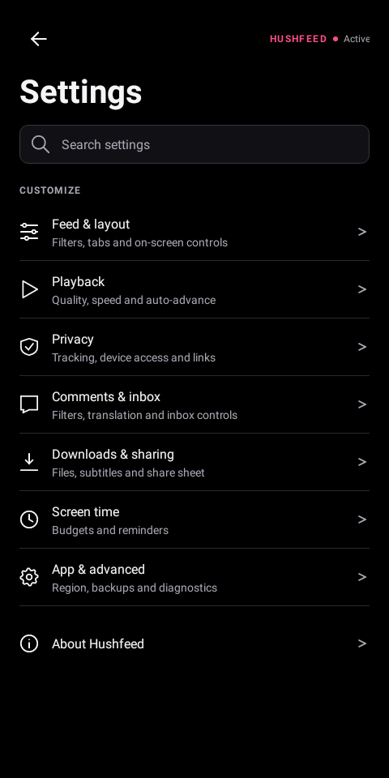 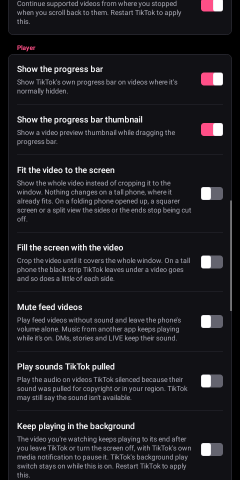 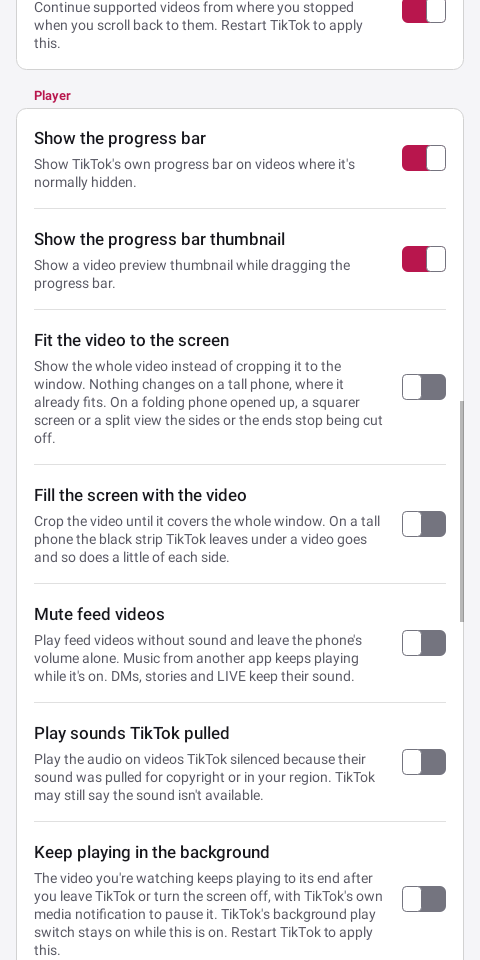

<details>
<summary>Every settings page</summary>

| Page | Screenshot |
|---|---|
| Feed filter | [View](assets/settings/feed_filter.png) |
| Local creator list | [View](assets/settings/creator-list.png) |
| Feed tabs | [View](assets/settings/feed_navigation.png) |
| Feed screen | [View](assets/settings/interface.png) |
| Playback | [View](assets/settings/playback.png) |
| Playback sound | [Dark](assets/settings/playback-sound.png), [light](assets/settings/playback-sound-light.png) |
| Screen time | [View](assets/settings/screen_time.png) |
| Comments | [View](assets/settings/comments.png) |
| Downloads | [View](assets/settings/downloads.png) |
| Share sheet | [View](assets/settings/share.png) |
| Inbox | [View](assets/settings/inbox.png) |
| Privacy | [View](assets/settings/privacy.png) |
| Region | [View](assets/settings/region.png) |
| App | [View](assets/settings/behavior.png) |
| Diagnostics | [View](assets/settings/diagnostics.png) |
| Backup and restore | [View](assets/settings/backup.png) |
| Settings search | [View](assets/settings/search.png) |
| Settings recovery | [View](assets/settings/settings-error.png) |
| Feature Gate Lab | [View](assets/settings/lab.png) |
| Gate details | [View](assets/settings/gate_details.png) |
| Gate recording | [View](assets/settings/gate_recording.png) |
| Twice the text size | [View](assets/settings/two-times-text.png) |
| Twice the text size, light | [View](assets/settings/two-times-text-light.png) |
| Mirrored layout at twice the text size | [View](assets/settings/rtl-large.png) |
| Mirrored layout, light | [View](assets/settings/rtl-large-light.png) |

</details>

The native choice dialogs keep one indicator at the leading edge. These renders cover selected and
unselected rows in both themes. The Included diagnostics images come from the shipped eight-choice
picker with its real Apply and Cancel actions:

| Dialog | Dark | Light |
|---|---|---|
| Single choice | [View](assets/settings/dialog-single-dark.png) | [View](assets/settings/dialog-single-light.png) |
| Included diagnostics | [View](assets/settings/dialog-multi-dark.png) | [View](assets/settings/dialog-multi-light.png) |


Hushfeed saves what the app already has. The download reads the addresses TikTok itself fetched for the video you are watching, on the session you are already signed in with, so there is no separate request pretending to be a browser and nothing to keep in step with the site. That is the difference between this and a scraper. Through August 2026 yt-dlp had to rewrite its TikTok extractor twice and re-implement browser impersonation, and it broke again on 1 September. Cobalt has not shipped since April. None of that is a promise that saving always works. TikTok can change what it hands the app, and when it does the saver changes with the patches. It just means the thing most likely to break in a scraper is not part of how this works.


Select `Subtitle tools` in the patcher, then enable subtitle downloads under Downloads & sharing > Downloads. Captioned videos and their SRT files share the same filename stem. Language names can use Unicode, and filename collisions keep separate tracks. Android 11 and later save the pair in Movies, and Android 10 uses Download. The selected subfolder still applies. A failed subtitle transfer leaves the saved video intact and reports the partial result.

Caption appearance and the clear display option are under Feed & layout > Feed screen:

Fade the video controls sets the opacity of the buttons, caption and tabs over the video from 0 to 100. Faded controls still take taps. At 0, the buttons and caption are hidden and the tabs stay at 10.

The clear-display caption is removed as soon as you turn its switch off. Turning it back on restores the current cue when its video is still on screen.

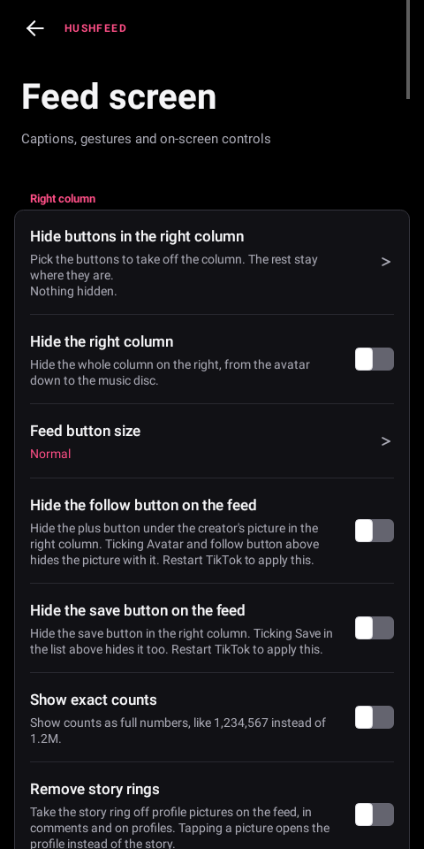 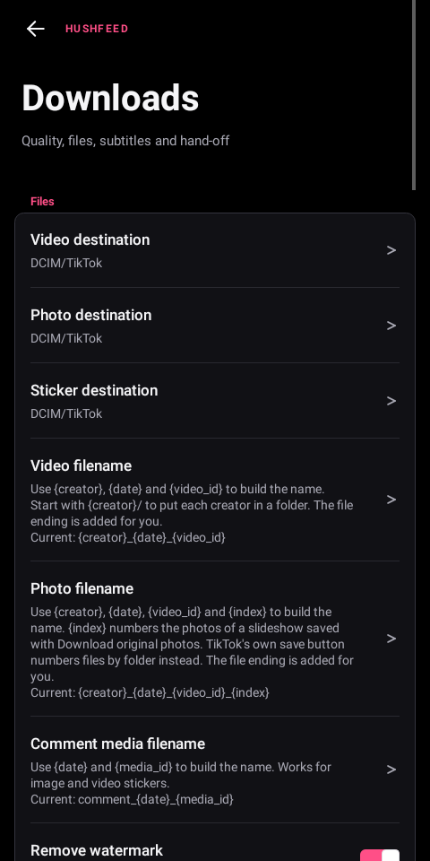

Inbox category switches identify New followers, Activity, Archive, Tako and Shop from native row data. They work with translated labels. Turning a switch off restores an already loaded row on the next layout.

TikTok sends pushes about popular videos it picked for you, like "25M+ people viewed" with a clip from someone you don't follow. With the Block suggested video notifications patch in, **Block suggested video notifications** under Comments & inbox > Inbox starts on and drops them before they reach your notification shade. Turn it off to get them back. It only matches TikTok's "Videos you might like" channel, so messages, comments, likes, new followers and videos from accounts you follow arrive as before.

**Turn off push notifications**, also under Comments & inbox > Inbox, goes further. It comes with the Notification controls patch and stays off until you turn it on. TikTok's push service isn't set up when the app starts, and nothing TikTok posts reaches the notification shade unless it's ongoing, like media controls. TikTok's wake locks are skipped too, apart from the ones for a LIVE you're hosting and for background work that shows its own notification. You won't hear about new messages until you open TikTok, and a notification dropped while it's on doesn't come back later. Push setup happens at startup, so the switch takes effect after a restart, and turning it off or pausing Hushfeed sets push up again the next time TikTok starts.

The Streak section on the Inbox page takes one or more usernames, separated by commas or new lines. Pick a time and the message (a 🔥 unless you change it). Each person must already have a chat with you. Hushfeed hands one message per chat to TikTok's own notification reply each day, even when TikTok stays closed. Repeated usernames and names that resolve to the same chat don't get a second message. A failed recipient retries independently, without repeating another chat's accepted message. Send it now attempts the remaining chats straight away. Turning it on or adding someone after the chosen time has passed starts that person's schedule the next day. It only uses the account you set it up on and checks that account again before each message.

TikTok's reply receiver doesn't confirm delivery. The status line says how many chats have an unconfirmed dispatch and when the next attempt is due. Those chats aren't retried that day, including after TikTok's process stops, because doing so could send a duplicate. Check the chats themselves to confirm arrival. It needs the Keep a streak going patch, which is off by default.

<br>

Playback has an optional default speed for every new video. A manual choice lasts until you change videos. To add 2.5x, enter it in Speed menu choices and restart TikTok. An empty list restores TikTok's menu.

Select `Automatic video advance` in the patcher, then turn on Auto-advance videos in Playback and restart. The option re-enables native auto-scroll if TikTok turns it off, and it puts TikTok's own Auto scroll action in the video actions panel, which otherwise only appears for accounts in that rollout. Auto-advance in search results, just below it, also turns on TikTok's own auto scroll for videos opened from search. Use the Playback switch to disable it.

Auto-advance session limit is zero by default. A positive value counts videos that finish while Hushfeed started scrolling, not prefetches or manual swipes. Recreating the feed or changing the limit starts a new count. Saving the same number, changing another setting or returning from the background keeps the existing count, including a reached limit. Hushfeed shows a brief notice when it stops.

Advanced downloads can send a sanitized TikTok link to another installed app. Enter its package name in `Send links to another app`. An empty value keeps TikTok's own save. The [YTDLnis](https://github.com/deniscerri/ytdlnis) package is recognized explicitly as `com.deniscerri.ytdl`, so its documented audio or video type and optional background mode are available. The profile controls stay disabled for every other package, and an uninstalled target falls back to TikTok's save.

Start **Video filename** with `{creator}/` to give each creator a folder under your chosen video destination. For example, `{creator}/{date}_{video_id}` keeps the date and video ID as the filename. Original photo downloads also understand this prefix in Photo filename. Templates without it keep saving directly in the chosen folder. While you type a template, the editor shows what a made-up post would be saved as, folder included, by Hushfeed's downloader and by TikTok's own, along with the sound, details and subtitle files you have turned on. An empty template keeps TikTok's own name in its downloader, and a word in braces that isn't a token is pointed out, since it's saved as typed. Nothing is saved or downloaded while you look.

With `Advanced downloads`, **Save details beside the video** writes a TXT file containing the caption, creator handle, source link and publication date. Android 10 and later put the video and its details in Download or Documents, keeping the chosen subfolder, because Android won't accept a TXT file in DCIM. Older Android versions keep the chosen video folder. Subtitles saved with a details file use that same folder. **Save details as JSON** writes that file as JSON instead, with the video's id beside the rest, for scripts and archive tools.

**Tag saved videos with their details** writes the same details into the MP4 itself. The caption's first line becomes the title and the whole caption the description, the creator goes in as the artist, and the link is kept as a comment beside the publication date. Media players and tools like ffprobe read them from there. If a video's layout is one the tags can't be written into, it's saved without them.

**Show download progress**, under Downloads & sharing > Downloads, adds a progress bar while a video saves. It shows a percentage when the video stream's size is known, then stays busy while the sound is fetched or the file is prepared and written. The switch starts off. It also works with Automatic quality. A save finished before the share sheet closes skips the progress row and shows its result. Screen readers hear the start once; changing percentages stay quiet.


**Save photo posts as a video** turns a photo post into one MP4. Each photo stays on screen for **Seconds per photo** (3 by default, anything from 1 to 10) and sits in the middle of the frame with black bars where its shape doesn't fill it. The post's sound plays under it, cut where the last photo ends or started again from the top when it's shorter. If the sound can't be fetched, the video still saves without it and the notice says so. It goes to your video destination and shows the same progress and banners as a video save. Live photos keep TikTok's own save. The switch starts off.

If TikTok closes while saves are still going, the next time you open it a banner names the ones that didn't finish, or that Hushfeed can't confirm, and how many of their files are missing. Files that already reached your gallery count as saved and are left alone. Nothing picks a save up again by itself, so save it again if you still want it. The note Hushfeed keeps for this stays inside TikTok's own storage and holds no links or tokens. On Android 9 and older, a file that's still being written is noted by its own path, which is the name it's saved under and can include the creator and the video ID, until it's confirmed. Each save's entry goes when the save ends or once the banner has named it.

**Check for already-saved videos** remembers up to 10,000 successful video saves made while it's on. Saving one again offers Open or Save again if the file is still available, even if TikTok no longer supplies its download link. Deleted files can be downloaded again. The record stays on the phone. Both switches start off and apply to Hushfeed's saves, including video stories, rather than links handed to another app. **Forget saved videos** empties that record and leaves the files and your settings alone, with Undo for as long as its notice shows. Turning the check off stops new entries but keeps the record, so the row is there either way.

**Mark saved videos** puts a ✓ before the view count of every video on a profile grid that's in that record, so you can see what you already have before you open it. In the feed, a saved video gets the mark before the time on its creator row, which shows where Always show publish date shows the time. It works only while the check is on, since that's the only time the record takes new saves, and it starts off. Photo posts never get the mark because the record doesn't take them, and a video you've deleted keeps it until you forget saved videos. The first profile you open right after TikTok starts can miss a mark or two until you scroll, while the record loads.

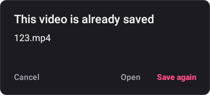 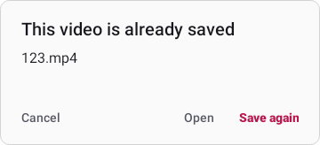

Photo filename templates can use `{index}`. TikTok's own Photo Mode saver numbers each image from 1 and starts over when the post has finished saving, including on Android versions that write straight to a shared folder.

Foldable controls are on the App page. Settings save immediately, including when an older settings page is still open. A banner offers Restart now when a change needs it, and a pinned row keeps the action available until TikTok restarts. With the split view on, unfolding past your width with TikTok already open refreshes the feed once so the side-by-side layout can take over, and folding back refreshes it again.

Numeric feed limits show their actual unit with language-aware singular and plural labels.

Native settings pickers use one radio indicator for a single choice and one checkbox for multiple choices. The selected state remains accessible and is saved through Android's native list adapter.

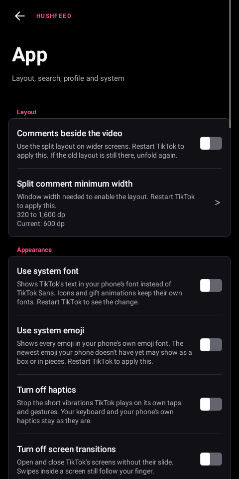

Region spoof requires Override SIM details plus Match locale and timezone to country on the Region page. Each built-in country preset supplies a timezone. Country codes must be two ASCII letters. Locale scripts and extensions are retained, including when a legacy variant needs fallback handling. Restart TikTok after changing these settings. Enable the separate store-region option only if needed, since it can affect search. Match region fields in requests goes one step further. Every request TikTok sends carries the region its servers last saved on the phone and the network's country code, and with this on both carry the preset too. The other region fields in a request already follow Match locale and timezone to country. GPS and the network address stay unchanged. None of these switches can change where TikTok thinks you are on its own: your IP address, the history on your account and the language you read in all say the same thing they said before, and any one of them is enough for TikTok to keep serving the region it already chose.

The Region page also carries the Network proxy section when that patch is in your bundle. Turn on Send TikTok through a proxy, pick HTTP or SOCKS5, enter the host and port and restart TikTok. The feed, search, comments and the rest of TikTok's API then go through the proxy, and so do plain Java connections. Videos and LIVE streams stay direct, because TikTok's player opens its own connections. TikTok's network stack can't sign in to a proxy, so use one that doesn't ask for a password. A user name and password only reach the Java connections. The password shows as dots and never goes into a settings backup. If the proxy doesn't answer when TikTok starts, a message tells you.

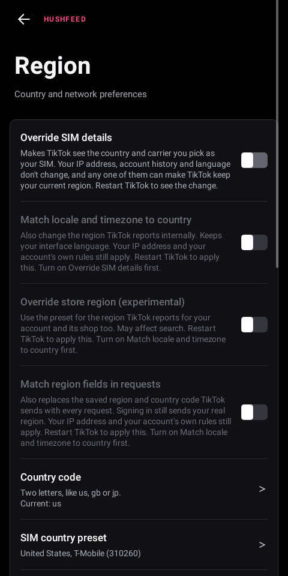

Playback has three switches for a feed that keeps going when nobody is watching it. One pauses the video while a comment sheet is open, and it plays on from the same spot when the sheet closes. The second holds the feed after you return to the app until you tap once, and leaves the tab bar alone so messages, a profile and search stay one tap away. The third, Don't start the first video, does the same once when you open TikTok from its icon, so the feed waits for a tap before the first video plays. A link, a notification or a shortcut that starts TikTok opens its page as usual, and a reopen from Recents plays as before. All three are off unless you turn them on. They ask for the audio focus and pause TikTok's player with the same pause the daily hold uses. A video you paused yourself is never started by any of them. Keep a paused video paused, beside them on the Screen time page, goes further for that video: TikTok plays it again as you come back to the app, and with the switch on it stays where you left it until you tap it. A video you left playing starts as usual.

The Screen time page carries a daily budget for the feed, on builds that include the block author patch, which is where the hook that knows which video is on screen comes from. It is off until you put a number in it, and until then nothing is counted at all. Set a video count, a number of minutes, or both, and Hushfeed says once that the day is used up. Set a hold too and the current player pauses behind a countdown for that many minutes, with a way through it on the countdown itself for the times you decide otherwise. It resumes only when the held video is still current, the feed is visible and audio focus permits playback. If another app holds focus past the countdown, Hushfeed waits for native focus to return before handing that video back. This also works when TikTok hasn't applied the queued pause yet. The panel follows the tab row as the screen layout changes. Messages, profiles and search are untouched, and so is the feed itself: nothing is dropped, so TikTok never refetches a batch it already sent. The day rolls over at four in the morning unless you move it, and the count and the hold both survive the app being killed. If a hold arriving out of nowhere is not what you want, there is a switch that fades the feed out over the last three quarters of a minute of a time budget, so you can see it coming. It needs a budget in minutes to follow and a hold to lead into, and it stays out of the way if you have turned system animations off. Let the last video finish goes the other way: when the budget runs out, the video on screen plays to its end before the hold comes, and the feed won't swipe to the next one until it does. So a budget of five videos means five, where the hold used to land on the fifth. Only the feed's swipe stops, and messages, profiles and search work the way they do under the hold. It waits three minutes at most, and a time budget the fade has already dimmed goes straight to the hold. Another switch, Wait a day to loosen the budget, holds back any change that loosens it until the day starts over. A higher number, a shorter hold or the switch itself going off then shows under its row with the time it applies, while a tighter budget still applies at once. A restored backup is held to the same rule, and on a locked day a restore leaves every budget setting as it is. While the switch is on, Start today over and Pause Hushfeed are refused, since each would take the budget off at once.

Lock the feed, at the top of the same page, is the quieter version for people who want the feed gone and keep TikTok for messages. With it on, For You, Following and the other feed tabs sit behind a calm panel and the feed won't swipe, while Inbox, profiles and search work as usual. The Friends tab's feed is covered as well, and clearing the controls doesn't lift the panel. A link to one video, from a message or another app, still opens that video, and the video after it is covered again. A link to a profile or a search doesn't count, so the feed stays shut. The app opens on Inbox instead of a feed you've shut, or on Profile when there's no Inbox. It uses the same panel and pause as the daily hold, it's off until you turn it on, and Pause Hushfeed turns it off. With Wait a day to loosen the budget on, turning Lock the feed off waits until the day starts over like any other loosening, and Pause is refused for the same reason it is for the budget.

Open shared videos alone, right under it, is for the video a friend sends you. With it on, a link to one video opens just that video, and the feed won't swipe past it, so there's no next video to fall into. Nothing covers the feed and the rest of TikTok works as usual. It swipes again once another video plays, like after a refresh or a tap on Following, or when you come back to TikTok after 10 minutes or more away, since by then you're probably back for TikTok itself. A quick trip to another app, say to answer the person who sent it, keeps it alone. Hushfeed's Auto-advance doesn't move on from it either. A link to a profile or a search isn't a shared video, so it opens as usual. The row needs the Block author button and Feed tab navigation patches, it's off until you turn it on, and Pause Hushfeed turns it off.

Backup and restore holds Back up settings, Restore settings and Reset settings, and it's there whichever patches you picked. Backups include patch preferences and Feature Gate Lab rules with their enabled state. Choose a JSON file through Android's file picker. Invalid files leave settings unchanged. Restore and reset keep one undo copy inside TikTok. An interrupted write can recover from its backup file, and a current Hushfeed copy always wins over a copy written under the project's earlier name. Export a backup first if you plan to clear app data or reinstall, since that removes the undo copy too. Restart after restoring or resetting. Show failures on screen decides whether a failure inside Hushfeed is also put in front of you while diagnostic logging is on. Turn it off and failures go to the report alone. Log diagnostics stays on until you turn it off, even after a restart. For one bug report, Log diagnostics for 15 minutes logs everything and then stops by itself. Restarting TikTok keeps the same end, setting the phone's clock back can't stretch it, and restarting the phone ends it. It never moves the Log diagnostics switch, and backups leave it out, so restoring one can't start logging again.

Backups record which settings they contain, so missing entries are rejected. A backup is a set of values to apply rather than a picture of the whole app, so anything it predates is left as you have it and the restore says how many that was. A backup from before the download destinations were split carries the one folder it knew about, and that fills in all three. If saving fails, recovery attempts both preference stores and keeps the undo copy available.

The Hook status row answers a question the patch list cannot. The patcher knows what it wrote into the APK, not whether a hook then found its anchor once TikTok was running, and TikTok renames things every release. When a hook loses its anchor the switch above it still reads on while nothing happens. Tap the row for a line per surface: how many lookups bound, how many did not, and the first thing that went missing. It hears from comments, comment translation, the inbox, the share sheet, the feed overlay, the bottom navigation and the story viewer, feed models, playback quality, sensitive warnings, CAPTCHA account state, external browser, sticker saves and story saves. The last four identify missing service calls, the sticker source adapters `LLILLIZIL` or `X.0UD5`, and the story chain `LLJIJIL`, `LLJIJIL`, `LL`, `getAweme`. "Everything found what it needed" means everything Hook status watches rather than every patch in the bundle. The same table goes into the exported diagnostic report, so it travels with a bug report.

The exported report also carries a feed filter table, and that one counts whether or not diagnostic logging is on. Several different routes can put a video on a profile page or in the feed, and a screenshot of an advert cannot say which one delivered it. The table gives a line per route: how many lists it was handed, how many videos were in them, how many it took out, and the last reason it gave. A route with no line has never run, which is the useful half, because a hook that never fired looks exactly like a filter that decided to keep everything.

When something on screen needs hiding and nobody can see it on their own phone, Record a screen's layout helps. Tap it, then go to that screen. Twenty seconds later Hushfeed notes how the screen is built: each view's class, its resource name, whether it's hidden and where it sits, for the screen and any sheet or popup over it. It reads none of the text. The next exported report ends with that layout, a quick copy included, and Clear diagnostic data removes it with everything else.

Capture the feed, under Clear diagnostic data, is for a feed problem that's easier to show than to describe. Tap it, scroll until the problem shows up, then come back and tap it again. Hushfeed saves a text file to Download/Hushfeed (the app's own Documents folder before Android 10) with a line for every list the feed filters handled while it ran. Each line says where the list came from and how many videos went in and came out, with the rules that were on. Under it every video gets its verdict and the rule that hid it. A list TikTok reads again unchanged is only counted. The file keeps about 4 MB of events. On a long capture the oldest go first, and the file says how many it dropped. Nothing is recorded until you start a capture. Videos and creators show up only as short codes made fresh for each capture, and the file has no captions, names, handles or web addresses. Read it before you share it anyway. If the file can't be written, the row keeps the capture and offers to save it again.

Build details is always under About Hushfeed. Copy or save it even when Diagnostic tools wasn't selected or there are no events to report. It lists the bundle's source identity, the patcher used to apply it and the choices made while patching, including the AMOLED color and retained native languages. Older APKs show unknown for facts they didn't record. Pause, settings imports and Clear diagnostic data can't change these APK facts. Automatic reports include them when there's matching diagnostic data. Reports stay local. Use an original TikTok APK when applying patches again.

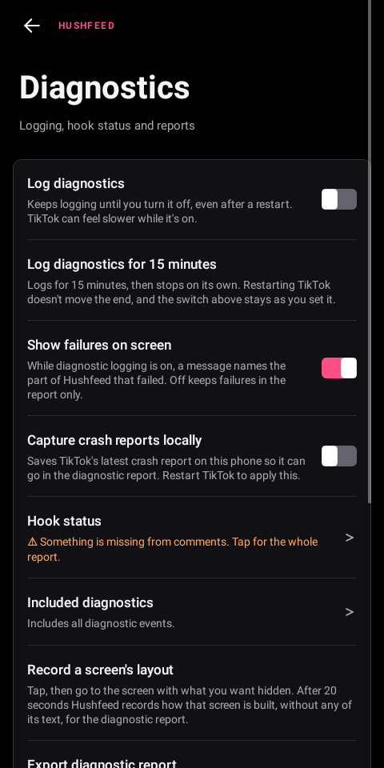 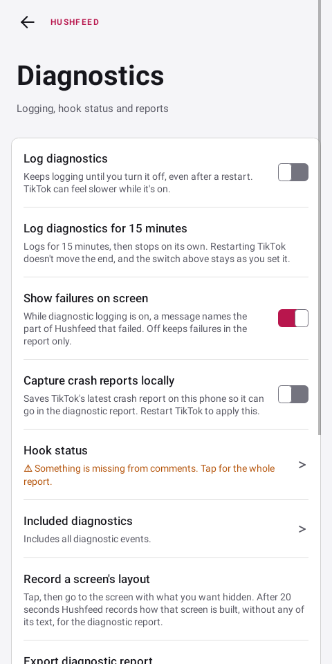

Feature Gate Lab saves its master switch immediately. Its menu can reset overrides while the switch is off, reset all Lab data, or undo the last reset or import. Imported values stay disabled. The Lab holds up to 1,024 saved rules, and it rejects a save or import that would exceed that limit before anything changes. Reset all Lab data can recover an older oversized store without clearing other Hushfeed settings. Changes run in the background and report their result with a notification. Every filtered list in settings, the hidden creator editor, the share checklist and the Lab shows and announces its current result count. Removing a hidden creator says which entry was removed and moves focus to the next action. The recorder discards an interrupted session before taking the next baseline. Copied recorder reports use Android's sensitive-content flag on supported versions. Reports above 60,000 characters stay off the clipboard and use Save report. The undo copy stores Lab configuration privately. Full-reset undo also restores captured observations during the same app run. Other patch preferences are unchanged.

The Lab can also bring back a missing See translation link. Open the Lab menu, choose Reviewed presets, then Show See translation. The preview lists both values before you apply them. Turn on the Lab's overrides switch and restart TikTok to use the preset. Undo last Lab change restores the previous rules. On the 47.1.3 test account, `feed_translation_reverse` and `cla_translate_button_weaken_v2` were both 1. Setting both to 0 brought the link back, and either one alone didn't.

The same menu has presets for features other TikTok mods turn on by flag: repost with a comment, the profile banner and new profile layout, live photo, camera and audio comments, comments saved to Favorites, comment sort and dislike styles, message bubble colors, the Inbox archive and sharing to more chats at once, Manage topics, visual search, AI Self, the long-press menu on every post, TikTok's own hold to speed up, background play and auto-scroll, and post dates in the feed. The list shows the presets for the TikTok version you have installed, and opening one checks its keys against that build before Apply is offered. Some of those features also need TikTok's servers to allow them for your account.

The Lab uses a compact toolbar so more gates fit on small screens. Tap the warning icon beside Apply overrides for the explanation and account warning. Source and view tabs scroll sideways when larger text needs more room.

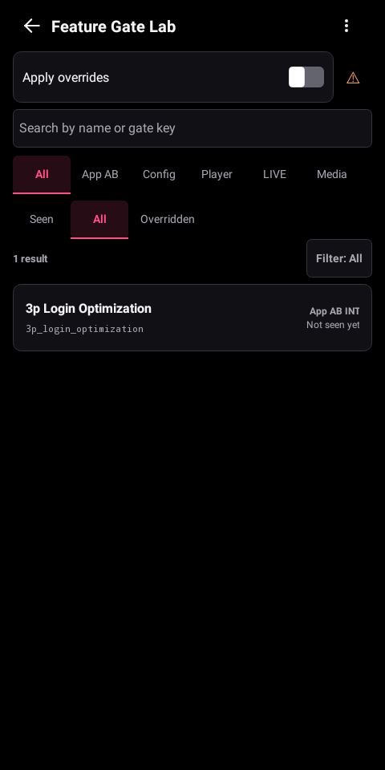
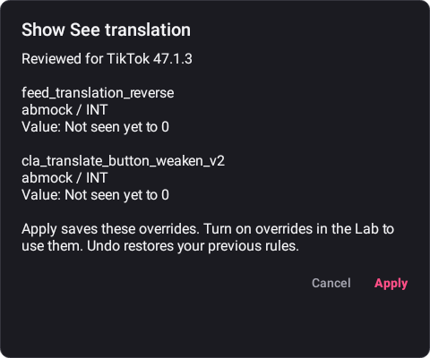

<br>

## Building from source

`tools/gen-release-notes.py` generates the in-app What's new text from published CHANGELOG entries starting at 0.60.0. It joins chunks at runtime so long notes and international text stay within Java's string-constant limit. Translated notes go in `extensions/tiktok/src/main/l10n/notes/<table>.txt`, one file per settings table in the CHANGELOG's own shape. A phone whose settings are translated reads a release in its own language when that file has it, and English otherwise. The generator refuses a release that's translated for some tables but not all of them, or whose bullet count doesn't match the CHANGELOG. Run `python -m unittest discover -s tools -p test_gen_release_notes.py` to check large notes through Java compilation and exact text round trips.

A release runs from `scripts/release/release.ps1`, one stage at a time: `prepare`, `preflight`, `build`, `publish` and `index`. Each stage checks that the one before it finished, so after a fix you rerun only that stage. The text work lives in `tools/release_text.py`. It cuts the CHANGELOG, checks the translated notes, writes the GitHub notes from the whole CHANGELOG section and points the index, README and bug form at the new release. Translate a bullet into every notes table when you add it under `## Unreleased`. `py -3.13 tools/release_text.py check-translations --unreleased` checks them, and the cut carries them into the release. `python -m unittest discover -s tools -p test_release_text.py` runs its tests.

The full `:patches:test` command includes `:patches:nativeTest` and `:patches:documentationTest`. README and artwork edits rerun the documentation checks while unchanged APK fixture results remain reusable. An edit to the Java extension reruns only the tests that read the extension, so the fingerprint checks against the fixtures are reused. Patch source, catalog, dependency and fixture changes still rerun the affected tests. Release validation checks all three result directories.

APK fixture tests reuse read-only DEX containers only while the file's content and requested opcode version match. File replacement invalidates the cache even when its size and timestamp stay unchanged. Cache entries can be reclaimed under heap pressure, and each patch application keeps its own mutable context. Every declared and historical fixture stays in the test set.

Use focused checks while editing and reserve the full suites and bundle build for a milestone. The configured `HUSHFEED_BUILD_WRAPPER` preserves spaced test filters, reports CPU and free memory, and runs with two workers at low priority. It bounds JVM heaps and reports low free memory as a warning. The build continues.

Use JDK 21 or newer and an Android SDK configured through `local.properties`. GitHub Packages needs `GITHUB_ACTOR` and a `GITHUB_TOKEN` with `read:packages` access for the Morphe dependencies.

For runtime tests on Windows, use JDK 25. The tested JDK 21 build couldn't replace an existing file through `File.renameTo`, which broke Android's atomic file writes in the tests. JDK 25 passes that replacement check.

Run the runtime and patch tests, then build the Morphe patch bundle and metadata. The patch tests read the vendor TikTok APKs from the folder `HUSHFEED_FIXTURE_DIR` names (see CONTRIBUTING.md), and the release check refuses a run in which any of them skipped:

```bash
./gradlew :extensions:tiktok:test
./gradlew :patches:test
./gradlew :patches:generatePatchesList
pwsh -File scripts/validate-release-facts.ps1
./gradlew :patches:buildAndroid
```

The bundle is byte reproducible: two clean builds of the same commit with the same toolchain and inputs produce the same file and SHA-256, so you can rebuild it yourself and check the published checksum against your own. The one field that would otherwise differ, the build timestamp in the bundle manifest, is pinned to the commit being built. Set `SOURCE_DATE_EPOCH` to override it. `buildAndroid` ends by copying the finished bundle to `patches/build/release/` and writing `bundle.sha256` beside it, so the checksum always describes the file next to it.

Run these tasks in this order. The Android build finishes with `verifyBundle`, which checks the patch list and all three DEX payloads against the checksum recorded by the Android build. You can also run `./gradlew :patches:verifyBundle` on its own to re-check the bundle this checkout built. It compares against a checksum only `buildAndroid` writes, so it will not verify a bundle from anywhere else.

A release tag can point to the tested commit already on the remote branch. The push check verifies that commit against the remote before treating the tag as a pointer-only change. New branches and tags with other targets still run the file-change checks. Publish the release asset before updating `patches-bundle.json`.

The device-only patch and verification helpers accept separate store and entry passwords. `-KeystorePassword` overrides `HUSHFEED_SIDELOAD_KEYSTORE_PASSWORD`. If neither is set, the store password is `sideload`, the local test-key password. `-KeyPassword` overrides `HUSHFEED_SIDELOAD_KEY_PASSWORD`. When both are unset, it uses the store password. An explicitly empty password stays empty. Leave `-KeystoreType` unset for the SDK's default format, or pass `BKS`, `JKS` or `PKCS12`. A `.jks` filename can also contain PKCS12 data.

Keep the signing key outside `-OutDir`. Both helpers resolve relative paths from PowerShell's working folder and reject key copies or aliases in generated outputs before rebuilding. The key stays locked against writes until the build and cleanup finish.

For an exported Manager key with an empty store password, set the entry password in the process environment and pass its alias and format to both helpers:

```powershell
scripts/patch-for-device.ps1 -Keystore $keyFile -KeystoreType BKS -KeyAlias $keyAlias -KeystorePassword ''
tools/verification-probe/build.ps1 -Keystore $keyFile -KeystoreType BKS -KeyAlias $keyAlias -KeystorePassword ''
```

`HUSHFEED_SIDELOAD_KEY_PASSWORD` must hold that key's entry password. Avoid putting password values in shell commands or saved scripts. Both helpers use SDK apksigner with temporary environment references, verify the output certificate against the key, and leave no converted key or password file behind. BKS uses the pinned Bouncy Castle provider from the Gradle cache, checked against `gradle/verification-metadata.xml`. Pass `-Sdk` if the SDK lives elsewhere. An in-place install checks the installed APK's certificate first. The verification probe also checks TikTok's certificate, because Android requires them to match. A mismatch stops before installation and leaves the installed app's data intact.

The probe rebuilds only empty or marked output folders containing its generated files after checking their paths, so use a fresh `-OutDir` for an older unmarked output folder or one with added files.

`patch-for-device.ps1` reads its package and version from `patches-list.json`. It patches with the bundle `:patches:buildAndroid` leaves in `patches/build/release`, and it stops if a patch or extension source was saved after that bundle was built. Pass `-AllowStaleBundle` to patch with it anyway. With `-Replace`, it removes TikTok only when the device returns an installed package path, after signing and verifying the new APK. This deletes TikTok's data. A clean phone goes straight to installation, while a failed device query stops the script. `pwsh -File scripts/test-apk-signing.ps1` exercises both builders with temporary BKS, JKS and PKCS12 keys, a tiny APK and fake device commands. It never contacts a phone.

Each release ships a provenance receipt beside the `.mpp`, `release-receipt-<version>.json`. A checksum tells you a file arrived unaltered. It cannot tell you which APK the patches were proved against, which commit built the bundle, or what patching did to the Android manifest, and those are the facts that decide whether the bundle you downloaded is the one the release notes describe. The receipt records the tag, the full commit and its timestamp, the bundle's size, hash and manifest stamp, every extension payload's hash, and for each retained TikTok fixture: the APK's package, version and SHA-256, a verdict for every patch in the catalog, and the stock-to-patched difference in requested permissions and exported components.

`scripts/build-release-receipt.ps1` writes it by patching each fixture with the Morphe desktop CLI. The verdicts come from the patcher's report. New receipts require the bundle's full source commit and matching clean source fingerprints captured before compilation and after the build. A dirty build stays ineligible after you restore its files. Setting `SOURCE_DATE_EPOCH` changes the reproducible timestamp, but can't override those source checks. Receipt creation also requires a clean working tree and the release's commit timestamp. Previously published receipts use a frozen archive of verified receipt bytes and bundle identities.

`validate-release-facts.ps1` checks the receipt on every run that has one and requires one for a release. It refuses permission or exported-component changes absent from `scripts/manifest-delta-allowlist.txt`. It lists three permissions, all from Keep a streak going, which asks for start at boot and exact alarms so its daily message goes out on time and survives a reboot. They're added only when that patch is selected, and no patch exports a component. Hide Play Store update offer changes only the manifest version code, which is separate from that allowlist. An entry the patches no longer produce fails the run too, so the list can't outlive the review it records.

`verify-injected-registers.ps1` compares the patched APK with the exact 47.1.4 vendor fixture. The static half rejects an injected instruction outside its method's register count, a removed host method, or a removed DEX file. The optional device half requires the clean and patched Android verifier messages to match by text and count. Each device run removes its uploaded APK and generated ART files, including after a failed command. Reviewed removals must be exact `method` or `dex` entries in `scripts/injected-register-removal-allowlist.txt`, and stale entries fail the run.

Gradle dependency verification is checked in at `gradle/verification-metadata.xml`. It records the reviewed release graph with SHA-256 checksums, so a changed cached artifact fails during dependency resolution. Every Bouncy Castle request in the build is rewritten to the reviewed 1.86 release, and two verification tasks check it: the TikTok extension tests check their own graph, and the patch tests check the build graph the Morphe patcher arrives on. Both read the request underneath the rewrite rather than the version it produced, so an unreviewed release stops the build instead of being quietly replaced. `mavenLocal()` is disabled by default, including the repository the Morphe settings plugin adds. Use `-PallowMavenLocal=true` only while developing a local plugin artifact, and leave it off for release builds. The wrapper distribution checksum in `gradle/wrapper/gradle-wrapper.properties` matches Gradle's published 9.7.1 binary.

The push hook runs script contracts before building when patch declarations, the catalog or its build pins change, even if no script changed. This checks unnamed bytecode and resource dependencies too. Each pushed ref is checked against its own committed catalog. Edits in another checkout cannot pass it. Documentation the checks don't consume keeps its existing narrow routing. Run `pwsh -File scripts/test-script-contracts.ps1` to exercise these gates locally.

Changes to runtime sources, native stubs, extension build files or consumed build pins also rebuild the release bundle and apply it to every declared TikTok APK. Tests and unconsumed documentation keep their narrower checks. Push source changes before updating the published index, which verifies the existing release artifact without rebuilding it.

To save offscreen screenshots, run `./gradlew :extensions:tiktok:test -PscreenshotDir=<absolute-directory>`. The suite opens every settings section in dark and light themes, saves a value through the native picker, and exercises Lab search and overrides. A German fixture checks larger text at 360 dp width, and a Spanish one checks the same page at twice the text size on a 320 dp screen.

Worker-backed settings and Feature Gate Lab tests drain their owned executors before asserting, reset per-sandbox state before each case, and keep the region semantics check separate from the API ICU cross-check. These assertions do not depend on screenshot output or polling sleeps.
Lab boundary tests reject malformed persisted scalars without replacing native values, keep imported rules disabled, clear runtime state across master and reset cycles, and hold recorder limits under concurrent calls. Translation batches expire before a visible fallback is retried, while SIM preset matching accepts missing values and keeps unsupported region fallbacks native.

Runtime tests cover feed marker and sound filters using both getter and field model shapes. Empty metadata and unrelated ids remain eligible, while matching markers and sound phrases are rejected by their enabled filters.
Shared resource lookup and global-layout ownership cover the feed, inbox and share hooks, with replacement, detach and failed-install fixtures for the host boundaries. A failed install also detaches the prior root before returning. Sticker publication tests keep collision protection on Android 9 and earlier.
Native boundary tests cover structured numeric coercion and overflow, URL scheme refusal, destination roots, media fallback and frame bounds, plus direct navigation, share, LIVE, sound and translation policy shapes. Codec playback and final container behavior remain native-device checks.
Deep feed tests cover all five count ranges through real responses, repeated response caching, late and final follow delivery, cached and offline fallback policy, hard-filter preservation and bounded probe rotation. The content fixtures reject swallowed runtime failures. Account-write challenge fixtures cover the supported follow, like, comment, repost and story routes found in TikTok 46.2.3. Follow tests drive all seven write routes through the refusal notice and verify that retained requests stop growing at the diagnostic limit. Direct and stream results consume their own request IDs, so a skipped request can't reuse an earlier one. Diagnostic account pseudonyms use HMAC-SHA-256 with an installation key. Deliberately broken routes and readers must fail their regression tests.
Video overlay traversals reuse their id, visibility and match buffers, so repeated layout passes do not rebuild the container lists. A synthetic 200-pass trace over 80 cells measured 57.68 ms before the change and 56.09 ms after it.
Legacy settings import tests cover complete JSON and older text fragments, rejecting invalid values before any preference changes.
Numeric tokens retain their precision until validation, and literal NUL characters cannot hide trailing data in imports or undo files.

The finished bundle is written to:

```text
patches/build/release/patches-<version>.mpp
```

Publish that file. `patches/build/libs` holds one with the same name, but any later Gradle task that rebuilds the jar (the patch tests do) turns it back into a plain jar with no DEX payload, and Morphe Manager then shows zero patches. Nothing in `scripts/` reads from there.

Morphe reads `patches-bundle.json` from this repository, downloads the `.mpp` release asset listed there, and loads the patch metadata from that bundle.

After uploading the bundle and a `SHA256SUMS.txt` file to the GitHub release, verify the published asset against the local build:

```bash
pwsh -File scripts/validate-release-facts.ps1 -VerifyPublishedAsset -ArtifactPath patches/build/release/patches-<version>.mpp
```

The check follows the indexed URL, compares its SHA-256 with the local artifact, checks the matching entry in `SHA256SUMS.txt`, and counts the patches inside the published bundle against the number the index advertises.

For an immutable release it also runs GitHub's release and asset attestation checks. Those checks bind the repository, tag, source commit and uploaded file hash. Rebuilding the bundle from that source remains a separate check. Add `-RequireImmutableRelease` when verifying a publication that must be immutable. Existing mutable releases keep the other checks and report that attestation verification was skipped.

An advertised signature must be `patches-<version>.sigstore.json` beside the release bundle and verify with the repository's `cosign.pub`. Verification requires stable Cosign 3.1.3 or newer, checks the public key and transparency proof, and stops on missing inputs or a bad signature. Add `-RequireBundleSignature` when a publication must be signed, or `-Cosign <path>` to name the executable. Both requirement switches need `-VerifyPublishedAsset`. The current release doesn't advertise a signature. Prepare the signing key and final release assets before enabling that requirement.

To verify a downloaded signed bundle directly, use:

```bash
cosign verify-blob --key cosign.pub --bundle patches-<version>.sigstore.json patches-<version>.mpp
```

For reviewed universal inputs, `scripts/verify-abi-apks.py` creates an ARM64-only APK, an ARMv7-only APK and an ARM64 copy with one altered P2P-library byte. It runs the complete patch and resource gate on both valid copies and requires the altered copy to be rejected. It preserves the original APK and writes hashes, reports and logs into a new output directory:

```bash
python scripts/verify-abi-apks.py --apk <universal.apk> --out <new-directory> --desktop-jar <desktop.jar> --bundle patches/build/release/patches-<version>.mpp
```

`verify-all-patches.ps1 -Force -ProbePackage <package>` qualifies an isolated candidate bundle without changing the production catalog. The candidate bundle must declare the package before the desktop CLI can select its patches. Force alone affects versions and doesn't select patches for an undeclared package. The gate rejects a zero-patch result and still checks every requested patch, actual output identity, resource and native language file. Supported targets need separate compatibility metadata and native acceptance.

That last one needs the Morphe desktop CLI. Set `HUSHFEED_DESKTOP_JAR` to the jar, or put `morphe-desktop-<version>-all.jar` under `HUSHFEED_WORKDIR` or `build/morphe-tools`, and it is found on its own. Without it the check stops rather than passing, because the count is the only part that reads what people actually download. The CLI wants a JDK 21 or newer, which is often not the `java` first on PATH: `HUSHFEED_JAVA` or `JAVA_HOME` says which one to use. When `-Java` names a directory, that directory must contain `bin/java.exe` or `bin/java`. An invalid explicit directory is reported instead of falling back to PATH.

### Adding a language to the settings screen

Quantity labels follow the language actually displayed. Android 6 uses compact integer rules from CLDR 48 for the shipped languages, so add that language's rule and API 23 coverage when adding a table. Android 7 and later keep their platform ICU rules. Extra forms use the other key followed by its category, such as `%1$d results|few`. If a row hasn't been translated, its English fallback still keeps the actual count.

The English text in the code is the key. Each language is one table under `extensions/tiktok/src/main/l10n/`, with the English on the left and the translation on the right. A language is kept in one of two forms, and the generator reads both. `de.tsv` is tab separated, one entry per line, `#` starting a comment. `in.csv` is the comma form Weblate hosts: a `source,target` header and a row per entry, quoting whatever needs it. Copy either one to `<language code>.tsv` or `<language code>.csv`, translate the right hand column, then run:

```bash
python scripts/gen-l10n.py
./gradlew :extensions:tiktok:test
```

The script writes two generated files, neither of them meant to be edited by hand. `L10nTranslations.java` is what the extension carries with its own code. `en.csv` is the list of source strings, which is the monolingual base a Weblate project points at, so a translator can work in Weblate and the export drops straight into `l10n/` as `<language code>.csv`. The tests fail on any settings text that has no entry, on a language missing one, and on a table whose values are not the ones in the generated class, so both a gap and a stale run of the script show up before anything ships. Name the file with the code Android reports, which for the three languages that have two is the older one: `in` rather than `id`. The generator makes the table answer to both. The translations used to go into TikTok's own resources, but merging a few hundred strings into a table of 74,765 pushed patching past the memory Morphe Manager allows by default.

<br>

<br>

## Supported target

- App: TikTok, the global package `com.zhiliaoapp.musically`
- Version: [47.1.4](https://www.apkmirror.com/apk/tiktok-pte-ltd/tik-tok-including-musical-ly/tiktok-47-1-4-release/tiktok-47-1-4-2-android-apk-download/), on APKMirror since 2026-09-28.
- Build: version code 2024701040, arm64-v8a and armeabi-v7a, nodpi, minSdk 23
- SHA-256 of the APK every patch was verified against: `4226ed5d3031b68208c29f62d80ac421b281fc74201bc4163d98e442d0991a40` (47.1.4)

A patched app inherits TikTok's target SDK, which is 36 on the reviewed APK. Android 17 raises that to 37, and the changes that come with it were audited against everything Hushfeed injects: nothing it adds loads code from a file, subclasses Thread, writes a static final field through reflection or keeps audio going without a foreground service, and a connection the platform refuses is reported with its reason rather than retried. Forcing those changes on a running build still needs an Android 17 device, which is why the audit says checked in source and not checked on a phone.

### Why you have to fetch that APK yourself

Google Play only ever serves the newest build it thinks your device can run, so the copy on your phone may not be 47.1.4, and there is no way to ask Play for a specific older build. Take the APK from APKMirror ([47.1.4](https://www.apkmirror.com/apk/tiktok-pte-ltd/tik-tok-including-musical-ly/tiktok-47-1-4-release/tiktok-47-1-4-2-android-apk-download/)), which serves the exact version, then patch that file rather than the installed app.

APKMirror also offers some TikTok releases as bundles, using an `.apkm` file. Morphe Manager merges one into a single APK and keeps TikTok's own file paths, so AMOLED dark theme can rebuild its resources without losing any. The desktop CLI's merge moves every resource file into a new folder, and rebuilding that loses about 1,400 files and makes TikTok crash at launch, so the dark theme refuses it with a message saying why. On a computer, patch the plain 47.1.4 APK if you want the dark theme.

### Why that version and not a newer one

Patches use named components where TikTok retains them and code patterns where names are stripped. Both can change between builds, so Hushfeed declares one target, the newest stable TikTok it's been checked against. On main that's 47.1.4. When a newer build is supported, the previous one is dropped in the same release, so every build and check runs against a single APK. All 130 patches apply to the reviewed APK. Another build can fail loudly when an anchor moves or, worse, accept the wrong shape.

Only the global package is declared in the compatibility metadata.

The four resource optimizers are off by default. Before changing the APK, they compare the complete target set with reviewed paths and SHA-256 digests taken from the 47.1.4 APK and its APKMirror bundle. An exact group that is already completely empty is accepted. A missing, extra, altered or partly emptied set stops patching. An APK split down to one ABI is checked against the same set without the other ABI's libraries, and what it kept still has to match. The checks cover both arm64-v8a and armeabi-v7a native libraries. Language packs also require a reviewed inventory, keep English, and preserve both Android aliases for Hebrew and Indonesian when either one is selected.

### Moving from Kveld

Hushfeed now contains the eight Kveld TikTok optimizers that were not already here. Kveld's `Feed Ad Blocker` behavior is covered by `Feed filter`, and its Npth startup coverage is part of `Disable telemetry`. Remove or disable Kveld's TikTok patches after updating Hushfeed. Keeping both current sources at their defaults activates all eight shared optimizer names because Kveld marks them on by default, even though the Hushfeed copies are optional.

| Bundle combination | Result from the recorded 46.2.3 migration test |
| --- | --- |
| Current Hushfeed source by itself | Supported. The eight optimizers stay off until selected. |
| Released Hushfeed 0.30.2 plus Kveld 1.23.1 | Migration-tested. Each Kveld TikTok root passed beside Hushfeed's 34 defaults. All 44 roots also passed in both source orders. |
| Current Hushfeed plus Kveld at defaults | Do not use this setup. Kveld's eight shared optimizers turn on automatically, and its separate feed and telemetry patches duplicate Hushfeed behavior. |
| Current Hushfeed plus Kveld with all ten Kveld TikTok roots disabled | The desktop CLI returns to the exact 34 Hushfeed defaults, but keeping the duplicate source provides no TikTok benefit. |

The migration matrix pinned Hushfeed 0.30.2 at `7645fb6dc8023ee445e623fa4ab83e9f76035916171fa00182a4e617a72101c4` and Kveld 1.23.1 at `28aa9a57c93b2e49482fd9b3f3bc359b0174c37ffb93cc9c5fc0155a8a65c7e1`. Both full-order outputs had 26,072 entries and the same uncompressed entry-content SHA-256, `2a9a786e86ad356985e795a99b1ca4f97962c4dad20b43c8c58aa6d0d6e5ab3d`. Neither order changed the 62 permissions, 648 named components or 66 exported components. Morphe desktop 1.15.0 applies an explicit duplicate name from the bundle supplied last, which is another reason to keep only one source for these patches.

<details>
<summary>Recorded one-at-a-time migration output hashes</summary>

These whole-file SHA-256 values identify the recorded 2026-09-13 runs. ZIP metadata can make a repeat produce a different whole-file hash, so the entry-content hash above is the stable full-order comparison.

| Kveld root beside Hushfeed defaults | Patched APK SHA-256 |
| --- | --- |
| Remove content credential and card scanner assets | `849334dae2ec808ec75c718e382defa93608849d299abf07288c18e7886beb15` |
| Feed Ad Blocker | `54a70673b12e00519e022e3a2e541f116a62b7b1a952d34e49058833a94c6a4e` |
| Skip the splash ad | `3f3cf431d3193ae21c828de5c7aa5f4fdfe3223c64eff8954138120161e95d6d` |
| Remove unused language packs | `5495eb30a61eaf5897d491c70286ff552c2d8f5513b7c908c13e955329687fb1` |
| Remove LIVE extras | `c9795096850a8d4ad719511372553bbaf2726714b5bf170007be30849ad5a6b2` |
| Limit background traffic | `cc12a76919de78573789914d8033d40cee064325e334c1db7658e17175473357` |
| Drop the animated image cache | `dd78aae02796a33ec510f077c91a7e2a3dc947a17b5bb9288f888679f5a1710d` |
| Remove creation tools | `a0696fc12f49fc900b5eafdffd55992f09d1f0958e0ff5865180979d1eaff711` |
| Unified Telemetry & Tracker Silencer | `a7b92689c1b31a71dee627ea1ff0a84b273995a3f4aa02af212aa7e6c6b477a2` |
| Skip update checks | `56031325e755f9c4523ee4c6330d3515beb0e20a108e21d7026147d025689e9c` |

</details>

<br>

## Project structure

- `patches/`: Kotlin patch definitions, fingerprints and shared patch utilities.
- `extensions/`: Java extension code the patches inject into TikTok, with the Robolectric tests beside it.
- `extensions/tiktok/src/main/l10n/`: the settings translation tables.
- [App and patch development map](concepts/patch-development.md): target boundary, source modules, factory install notes, and the workflow for adding patches.
- [TikTok app audit](concepts/tiktok-app-audit.md): ad routes, tracking controls, clean-install and signed-in observations, privacy controls, and patch opportunities.
- [Network and power measurements](concepts/runtime-observation.md): capture methods, attribution limits, battery comparisons, and the patch source behind each control.
- [Measured TikTok runtime](concepts/runtime-results-2026-10-09.md): physical-device traffic, CPU, sensor activity and battery observations, with the installed build and each measurement boundary recorded.
- `scripts/`: `gen-l10n.py` generates translations, `verify-all-patches.ps1` checks every patch against a fixture and then has `ResourceTableCheck.java` hold the patched resource table to TikTok's own, `patch-for-device.ps1` builds a signed APK for a named phone, `measure-patch-heap.ps1` checks selected memory limits, `time-patches.ps1` times each patch of one desktop CLI run and notes the heap it peaked at, and `validate-release-facts.ps1` checks the public version, patch facts, indexed URL and published bundle hash. `common.ps1` holds the helpers the rest of them share: the work-directory path guard, the cleanup that will not delete outside it, the version read, the release bundle's path with the check for sources newer than it, and the desktop CLI lookup. `test-script-contracts.ps1` covers all of those, the shared target reader and the guarded replacement step, which files a push runs which gate on, and that a released version keeps its changelog heading. It also checks that a first branch push examines the complete resulting tree, that phone input reads and targets the focused window on display 0, and that result reports can include declared patch dependencies without hiding a missing or unrelated patch.
- `tools/verification-probe/`: the test-only instrumentation a device check drives on a test phone. `record-markers.ps1` records the content-marker corpus, and `strip-hunt.ps1` tallies the kinds of caption strip and bottom banner a feed is served.
- `patches-list.json`: generated patch metadata.
- `patches-bundle.json`: the Morphe source index for the published bundle.

## Credits

Hushfeed stands on a lot of other people's work, and the licence asks that this stays visible.

- [icysymmetra/tiktok-patches-for-morphe](https://github.com/icysymmetra/tiktok-patches-for-morphe), the Metra patches this project was forked from. Most of the original patch set, the settings framework and the Feature Gate Lab come from there, as does the release history below 0.8.0 in the changelog.
- [kveld9/kveld-morphe-patches](https://github.com/kveld9/kveld-morphe-patches/tree/fcb1768620b8f98a6dd31e801074589ce9a63356) for the eight optional TikTok optimizer patches and the extra Npth telemetry coverage, adapted from v1.23.1 at commit `fcb1768620b8f98a6dd31e801074589ce9a63356`.
- [ReVanced](https://gitlab.com/revanced/revanced-patches), whose TikTok patches the whole lineage continues, and [RookieEnough/De-Vanced](https://github.com/RookieEnough/De-Vanced), which upstream was built from.
- [hxreborn/hxreborn-tiktok-patches](https://github.com/hxreborn/hxreborn-tiktok-patches) for the inbox injectors, the telemetry patch, the risk control CAPTCHA hook and several feed card filters.
- [BlueDragon4251/tiktok-patches-for-morphe](https://github.com/BlueDragon4251/tiktok-patches-for-morphe) for the seen video filter, the gate recorder and the download quality ideas.
- [eduardo3677-ai/tiktok-patches-for-morphe](https://github.com/eduardo3677-ai/tiktok-patches-for-morphe) for Ghost mode.
- [@lyyako](https://github.com/lyyako) for the sanitize sharing links hook, the seekbar patch, the anti-recording patch, `Open external links directly` and `Always show publish date`.
- [@oscski](https://github.com/oscski) for `Disable the long press repost`.
- The [Morphe](https://github.com/MorpheApp) team for the patcher, the manager and the patches template.

Files that came from another project keep their original notices, and files written here say so in their header. A test holds every source file the bundle ships to having one, so a file cannot arrive without saying where it came from.

The notices are also in the app, under Hushfeed settings > About Hushfeed > Licenses, because Morphe asks that they reach the person using the software and not just the person reading the source.

## Privacy

Hushfeed has no server of its own and collects nothing. Everything it adds runs inside TikTok on your phone.

It goes online by itself for one job. When you save a video, a photo, a sound, subtitles, a sticker or a profile picture, it downloads that file over HTTPS from the address TikTok's own data holds for it. It won't fetch from an address on your own network, and it gives up after five redirects. One switch, off unless you turn it on, uses that same path for something else: Copy the full link for short links opens a short vt.tiktok.com or vm.tiktok.com link you copy to see which TikTok page it leads to, and stops before reading the page. Network proxy, when you turn it on, also connects to the proxy you set, once when TikTok starts and again when TikTok comes back to the screen (at most every five minutes), to check that it answers. A SOCKS5 proxy just gets the opening greeting. An HTTP proxy is asked for a tunnel to www.tiktok.com, and Hushfeed hangs up after the first line of the reply without sending anything through it. Anything else Hushfeed does online, such as translating a comment or blocking a creator, goes through TikTok's own code to TikTok's servers, the way the app's own buttons do.

The only web addresses written into Hushfeed's code are github.com for this project, gitlab.com and gnu.org for licence texts, tiktok.com for the share links TikTok itself uses, and music.youtube.com for the search the Find the sound on YouTube Music long press hands to the YouTube Music app on your phone. A test fails the build if another one turns up, or if code outside that download path and the proxy check opens a connection.

The diagnostic report stays on your phone until you copy or save it. It leaves out web addresses, login tokens and cookies, device ids, the ids of videos, comments and messages, and creator names and handles. Read it through before you share it anyway.

A feed capture file follows the same rules. Video and creator ids go in as short codes that mean nothing outside that one file, and it never reads a caption.

## Notes

- Hushfeed is not affiliated with TikTok, ByteDance or Morphe. "For Morphe" describes compatibility, nothing more.
- Patching a client TikTok didn't ship is your call. Some accounts see CAPTCHA checks or find that follows don't land on patched builds. Follow diagnostics says so when it happens, and the CAPTCHA hide never touches a CAPTCHA raised over a follow, like, comment or repost.
- Everything Hushfeed adds runs inside TikTok, as TikTok. It has the permissions TikTok has and can reach the data TikTok can reach, so installing a patched build is the same trust decision as installing any app: you are trusting whoever produced the code. Read it before you run it. That is what the source is for.
- This repository and its [GitHub releases](https://github.com/SysAdminDoc/hushfeed/releases) are the only official source. Anything else offering a Hushfeed build, however similar the name or the site looks, was not made here.
- Bugs and concrete feature requests go in the [issue tracker](https://github.com/SysAdminDoc/hushfeed/issues). Include the TikTok version, the patch involved, and what you expected.
- Questions, half-formed ideas and general chat go in [Discussions](https://github.com/SysAdminDoc/hushfeed/discussions). Release news is posted there too, under Announcements.

<br>

## License

GPLv3, inherited from the projects Hushfeed was built on. See [LICENSE](LICENSE) and [NOTICE](NOTICE). The same notices are reachable on a patched phone under Hushfeed settings > About Hushfeed > Licenses.
