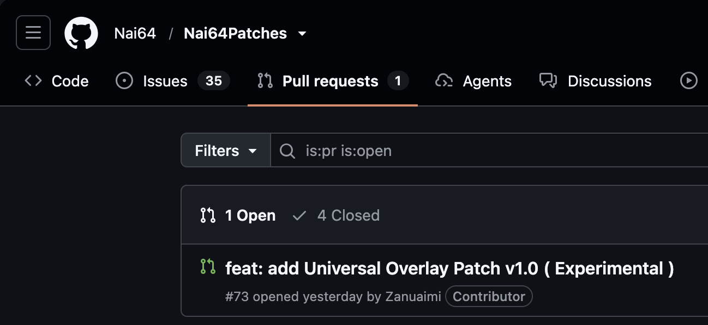

# UniPatches

Curated list of universal patches for [Morphe](https://morphe.software), including community-driven patches with enhancements and original patches, focusing on quality over quantity

## About

UniPatches brings together a concise selection of community-favorite universal APK target-level patches and contains some patches of my own. Community patches are selected from projects I find useful, including:

- [Entree](https://github.com/Entree3k/Morning-Entree-Patches)
- [Nai64](https://github.com/Zanuaimi/Nai64Patches)
- [Adobo](https://github.com/jkennethcarino/adobo)
- [kondratjev](https://github.com/kondratjev/morphe-patches)
- [MiguelNinja19](https://github.com/MiguelNinja19/miguel-morphe-patches)
- [BlazeFTL](https://github.com/BlazeFTL/FTL-Patches)
- [xob0t](https://github.com/xob0t/morphe-patches)
- [rushiranpise (Doom)](https://github.com/rushiranpise/morphe-patches)

These patches may be merged, refined, or enhanced where practical to improve compatibility, functionality, configuration, and usability.

### Enhanced patches

The following patch is an enhanced merge of community work rather than a direct copy:

- **PairIP Bypass Enhanced (Experimental)** — merges PairIP bypass approaches from [Nai64Patches](https://github.com/Nai64/Nai64Patches), [Entree](https://github.com/Entree3k/Morning-Entree-Patches), [kondratjev](https://github.com/kondratjev/morphe-patches), and [rushiranpise (Doom)](https://github.com/rushiranpise/morphe-patches). It combines coverage for common legacy, V2, and V3 protection layouts, organizes every strategy by risk level, and provides automatic selection that defaults to low- and medium-risk strategies. Users can disable automatic mode and test each strategy independently, including the high-risk strategies, with clearer configuration and failure reporting.

The Universal Overlay Patch has also been submitted as a pull request to [Nai64Patches](https://github.com/Nai64/Nai64Patches), one of the largest collections of universal Morphe patches. The version in Nai64Patches is intended for stable and major releases, while the version here is kept more up to date with ongoing improvements and changes. See the [Universal Overlay pull request](https://github.com/Nai64/Nai64Patches/pull/73).

The repository also includes my own patches. The patches without separate community credits are:

- Universal Overlay
- Graphics API Override
- Bypass Forced Online Checks
- Bypass Forced Updates
- Frame Rate Preference

Community contributions are credited in each patch description, and merged or enhanced patches retain attribution to the developers whose work influenced them.

### Add UniPatches to Morphe

Add UniPatches as a source inside the Morphe patcher.

| Method | Link |
| :--- | :--- |
| Deep link | [morphe.software/add-source?github=Zanuaimi/UniPatches](https://morphe.software/add-source?github=Zanuaimi/UniPatches) |
| Manual | `https://github.com/Zanuaimi/UniPatches` |

> [!TIP]
> Tap the deep link on a device that already has Morphe installed to add the source in one step.

### How to use these patches

After adding the source, select the patches you want from Morphe. Read each patch description and its options before applying it, especially experimental patches that modify app startup, licensing, integrity checks, or runtime behavior.

## 🩹 Patches list

<!-- PATCHES_START EXPANDED -->
> **[v1.4.0](https://github.com/Zanuaimi/UniPatches/releases/tag/v1.4.0)**&nbsp;&nbsp;•&nbsp;&nbsp;`main`&nbsp;&nbsp;•&nbsp;&nbsp;12 patches total

🌐 Universal&nbsp;&nbsp;•&nbsp;&nbsp;12 patches

 

| 💊&nbsp;Patch | 📜&nbsp;Description | ⚙️&nbsp;Options |
|----------|----------------|-----------|
| [Ads Free Rewards (Experimental)](#ads-free-rewards-experimental) | Get rewards without watching ads. Combine with No Ads for other formats, but keep No Ads' rewarded block off.  Credits: Nai64Patches from Nai64. | • Patch version • Reward Strategy • Instant reward • Fake ad availability |
| [Bypass Emulator Detection](#bypass-emulator-detection) | Hides emulator traces by spoofing Build info and related checks so apps cannot detect an emulator.  Credits: Nai64Patches from Nai64. | • Device profile • Hide Emulator Radio • Spoof Build Extras |
| [Bypass Forced Updates (Experimental)](#bypass-forced-updates-experimental) | Skip forced update screens and keep using the app. | • Bypass update gate • Make dialogs dismissible • Block update redirects • Prevent forced exit • Patch Play Core updates |
| [Custom App Resolution (Experimental)](#custom-app-resolution-experimental) | Set a custom resolution for the game  Credits: Nai64Patches from Nai64. | • Enable Custom Resolution • Resolution width (px) • Resolution height (px) |
| [Disable Forced Online Checks (Experimental)](#disable-forced-online-checks-experimental) | Lets the app start without internet. | • Auto mode • Common Android/network API • Unity strategy • Unreal strategy • Godot strategy • Generic bytecode strategy |
| [Frame Rate Preference (Experimental)](#frame-rate-preference-experimental) | Requests a preferred refresh rate like 60 or 90 Hz for the app window. The system may ignore it. | • Frame rate |
| [Free In-app Purchases (Experimental)](#free-in-app-purchases-experimental) | Get paid items for free. Best for offline games.  Credits: Nai64Patches from Nai64. |  |
| [Graphics API Override (Experimental)](#graphics-api-override-experimental) | Forces a Unity game to use Vulkan or OpenGL via launch argument. Only for supported Unity games. | • Graphics API |
| [No Ads (Experimental)](#no-ads-experimental) | Blocks ads by type. Pick what to block. For rewarded ads use Ads Free Rewards instead.  Credits: Nai64Patches from Nai64. | • Preset • Block Interstitials • Block Banners • Block App Open • Block MREC • Block Rewarded • Block Native |
| [PairIP Bypass Enhanced (Experimental)](#pairip-bypass-enhanced-experimental) | A merged experimental PairIP bypass for common legacy, V2, and V3 protection layouts.  Automatic mode applies compatible strategies up to the selected risk level. It defaults to Low and Med Risk Strategies; Low Risk applies only low-risk strategies, while Low, Med, and High Risk Strategies also enables the invasive high-risk strategies.  Turn off automatic mode to test the individual manual strategies. Manual selections are independent of the automatic risk-level setting, and every manual strategy is disabled by default.  This patch is experimental and app-dependent. It does not bypass server-side Play Integrity, server-side licensing, or other server-side enforcement.  This enhanced patch is a merged product of the PairIP bypass patches from the credited developers, with improvements for broader functionality, safer strategy selection, and usability.  Credits: Nai64Patches from Nai64, Entree, kondratjev, and rushiranpise (Doom). | • Automatic strategy selection • Automatic mode applying • Redirect PairIP Application (Low Risk) • Remove PairIP manifest entries (Low Risk) • UI - Suppress LicenseClient error dialog (Low Risk) • UI - Suppress LicenseActivity error dialog (Low Risk) • UI - Suppress logged error dialog (Low Risk) • Response - Remove repeated-check metadata (Low Risk) • V2 - Disable repeated checks (Low Risk) • V2 - Disable repeated-check flag (Low Risk) • UI - Suppress LicenseClient paywall (Medium Risk) • UI - Suppress LicenseActivity paywall (Medium Risk) • UI - Suppress LicenseActivity nnStart (Medium Risk) • UI - Suppress LicenseActivity onStart (Medium Risk) • UI - Suppress LicenseActivity closeApp (Medium Risk) • UI - Suppress LicenseActivity exitApp (Medium Risk) • UI - Suppress LicenseActivity closeapp (Medium Risk) • UI - Suppress LicenseActivity exitapp (Medium Risk) • UI - Suppress LicenseActivity closeAllTasks (Medium Risk) • Installer - Spoof local installer check (Medium Risk) • License Client - Bypass checkLicense (Medium Risk) • License Client - Bypass initializeLicenseCheck (Medium Risk) • License Client - Bypass service connection (Medium Risk) • License Client - Bypass processResponse (Medium Risk) • Response - Bypass helper validation (Medium Risk) • Response - Bypass helper signature (Medium Risk) • Response - Bypass validator validation (Medium Risk) • Response - Bypass validator signature (Medium Risk) • V3 - Bypass response validation (Medium Risk) • Application - Bypass attachBaseContext (High Risk) • Application - Bypass onCreate (High Risk) • Runtime - Bypass Application static initializer (High Risk) • Runtime - Bypass VMRunner.invoke (High Risk) • Runtime - Bypass StartupLauncher.launch (High Risk) • Runtime - Bypass StartupLauncher.pairip (High Risk) • V3 - Bypass LicenseClient activity (High Risk) • Installer - Spoof installer source (High Risk) • Integrity - Bypass signature integrity (High Risk) • Integrity - Bypass signature match (High Risk) • Provider - Bypass initialization (High Risk) • Provider - Bypass query (High Risk) • Provider - Bypass context provider (High Risk) • V2 - Bypass checkLicenseInternal (High Risk) • V2 - Bypass response signature (High Risk) • Advanced - External VMRunner call sites (High Risk) |
| [Skip Splash Screen (Experimental)](#skip-splash-screen-experimental) | Skip or shorten splash screen delays  Credits: Nai64Patches from Nai64. |  |
| [UniPatches Universal Overlay Patch v1.2 (Experimental)](#unipatches-universal-overlay-patch-v1-2-experimental) | Universal in-app overlay for Android apps and games. Optional modules include System Time, FPS, fullscreen, app brightness, and haptic controls. Modules are excluded and disabled by default; select them in Morphe settings before patching. Statistic modules show information, Activity modules control the current Activity, and Hook modules control internal app behavior, such as disabling animations, through best-effort runtime changes. A selected local image automatically replaces the legacy icon; empty or invalid image input falls back to the legacy icon. This is experimental and may not work on all apps. UI presets can save and reuse every General, UI, and Advanced setting, but intentionally exclude Modules and Settings to Modules because hook and module combinations can be app-specific.  The idea and initial works of this Universal Overlay Patch are from Zanuaimi / Noobite. | • Presets - Selected preset • Presets - Import UI preset • Presets - Export UI preset • Presets - Exported UI preset output name • General - Overlay title • General - Overlay description • General - Repository button text • General - Repository button URL • General - Overlay background color • General - Overlay Background Transparency (%) • General - Overlay outline color • General - Overlay text color • UI - Menu outline width (dp) • UI - Legacy icon text • UI - Legacy icon bold text • UI - Legacy icon text color • UI - Legacy icon text size (sp) • UI - Gradient background • UI - Legacy icon background 1 • UI - Legacy icon background 2 • UI - Legacy icon gradient angle (degrees) • UI - Icon outline • UI - Icon outline width (dp) • UI - Icon outline color • UI - Custom Overlay Button Icon ( Local Image ) • UI - Custom Overlay Button Icon Input ( String Handler ) • UI - Overlay button shape • UI - Overlay button size (dp) • UI - Overlay button idle opacity (%) • UI - Overlay button fully visible duration (seconds) • UI - Overlay button position • Advanced - Overlay Activity name override • Settings to Modules - Activate statistic modules on launch • Settings to Modules - Enable monitors for statistic modules on launch • Settings to Modules - Statistic monitor position • Settings to Modules - Monitor panel size • Settings to Modules - Monitor columns • Settings to Modules - Temperature stat format • Settings to Modules - System time format • Statistic modules - Device Information • Statistic modules - FPS • Statistic modules - Device Temperature • Statistic modules - System Time • Statistic modules - App Session Time • Statistic modules - Battery Status • Statistic modules - App Memory Usage • Statistic modules - Network Status • Activity modules - Keep screen awake • Activity modules - Fullscreen • Activity modules - Allow screenshots • Activity modules - App brightness • Activity modules - Rotation mode • Activity modules - App audio mute • Hook modules - Disable haptic feedback / vibrations • Hook modules - Disable app animations |

<!-- PATCHES_END -->

### 🛠️ Building locally

- Run `./gradlew buildAndroid`
- The built patches .mpp file is found in `patches/build/libs/patches-*.mpp`
- Patch the mpp file using [Morphe-Desktop](https://github.com/MorpheApp/morphe-desktop)
  like any other patch bundle.

See the [Morphe documentation](https://github.com/MorpheApp/morphe-documentation) for more information.

## Contributing

Suggestions, fixes, compatibility improvements, and carefully selected community patches are welcome. Contributions should preserve the repository’s quality-over-quantity goal, include appropriate credits, and use clear semantic commit messages such as `feat:`, `fix:`, or `chore:`.

See [CONTRIBUTING.md](CONTRIBUTING.md) for contribution guidance, including the Universal Overlay guide.

## License

UniPatches is licensed under the [GNU General Public License v3.0](LICENSE).
