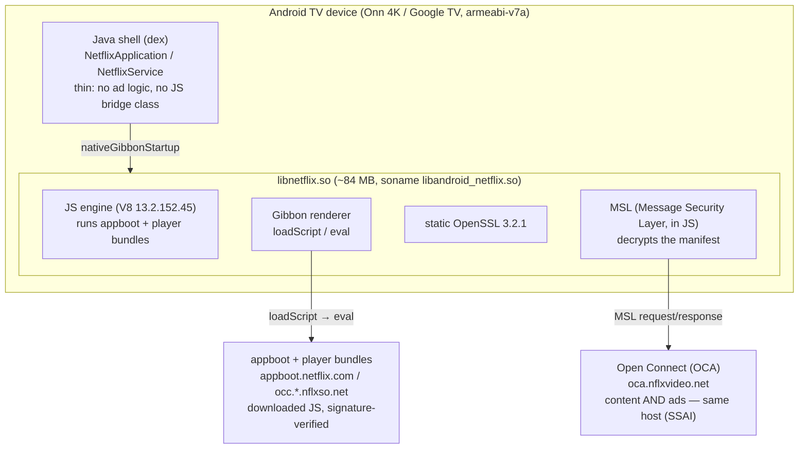

Netflix (Android TV) Ad & Playback System Design — A Reverse-Engineering Analysis
=================================================================================

> A reconstruction of how the Netflix Android TV app (`com.netflix.ninja`, `13.0.1 build 25028`, armeabi-v7a) delivers and schedules advertisements, and where that pipeline can be cut. It is derived from **on-device observation** on a retail **Onn 4K (Google TV, armeabi-v7a)**: static analysis of `libnetflix.so`, an in-process capture of the decrypted manifest from the JS-engine heap, `logcat` from the app's own runtime, and network captures across real ad breaks.
>
> Every claim below is grounded in something we watched on the device: a captured `ads:[…]` array, a `KILLMARK` self-stamp, a host footprint, a version string in the binary.
>
> This is a companion to the working ad-suppression patch in [morphe-androidtv-patches](https://github.com/ajstrick81/morphe-androidtv-patches) and a sibling to the [Prime Video](https://github.com/ajstrick81/morphe-androidtv-patches/blob/main/docs/PRIME_VIDEO_ATV_SYSTEM_DESIGN.md) and [Pluto TV](https://github.com/ajstrick81/morphe-androidtv-patches/blob/main/docs/PLUTO_TV_ATV_SYSTEM_DESIGN.md) teardowns. It documents *why* the patch works, and the several confident wrong turns that came first.

> **Scope and credit.** This is an **Android TV** teardown: a native monolith (`libnetflix.so`), an in-process JS engine, and an on-device byte-patch delivered through a cloned app. It is **not** the Netflix *web* app. The canonical web-architecture teardown is **sshh12's** [Netflix System Design, reverse-engineered from live network traffic](https://gist.github.com/sshh12/dda3a89514f850c459380b18b1f7eb7b) (Akira, Cadmium, Shakti, Pinot, MSL, FTL, Ichnaea…), and this analysis builds on that naming and the MSL model. Where the two overlap (MSL, the manifest, Pinot pages) we reuse sshh12's terms; the ATV-specific mechanism and the patch are our own.

> **Applies to** `com.netflix.ninja` `13.0.1 build 25028`, patches **v1.37.4**. Netflix's ad logic is **downloaded JavaScript**, re-minified server-side without an app update, so exact byte anchors drift (see §9); the shipped strip carries rename-tolerant fallbacks for exactly that reason.

---

## 0. TL;DR — the one-paragraph version

Netflix on Android TV is a thin Java shell over one large native library, `libnetflix.so` (~84 MB, soname `libandroid_netflix.so`), which embeds a JavaScript engine, a renderer (**Gibbon**), a static OpenSSL, and Netflix's **MSL** (Message Security Layer) in JS. The player, the manifest handling, and **all ad-break logic** are downloaded JavaScript (the *appboot* and player bundles), fetched at runtime and **RSA/ECDSA signature-verified** at rest. Ads are **pure same-host SSAI**: served from the same Open Connect hosts as the content, with no separate ad domain to block, and the ad schedule arrives inside the **decrypted manifest** as an `adverts.adBreaks[…]` / `ads:[…]` structure. That decryption happens *inside* the app, so the plaintext ad data and the ad-break code both live in the JS engine's heap at runtime — downstream of MSL and of the signature. The signature is a verify-on-**load** gate; it says nothing about the bundle once it is executing. So the strip runs **in-process**: a bundled frida-gadget (inside a cloned Netflix that passes both anti-tamper checks) applies one length-preserving edit, before playback, to the `getAdMetadata` ad-break builder so it returns an empty list — the same empty-break shape Netflix's own servers return most of the time, which the client already knows how to play cleanly.

---

## 1. Architecture Overview



| Role | Host |
|---|---|
| Appboot / player JS bundles | `appboot.netflix.com`, `occ.a.nflxso.net/genc/nrdp/…` |
| API / manifest (MSL) | `nrdp-cell*.prod.ftl.netflix.com` |
| Content **and ads** (SSAI) | `oca.nflxvideo.net` (Open Connect) — same hosts |
| Telemetry (only non-Netflix host seen) | `sessions.bugsnag.com` |

Two facts shape everything:

1. **The player is downloaded JavaScript, not compiled into the APK.** The dex is a thin shell; every `advert*` string in it is Bluetooth-LE casting or the Google advertising-ID, not video ads (proven by decompiling the BLE agent). The ad-break logic lives only in the bundles Gibbon loads at runtime via `loadScript → eval`.
2. **Ads are same-host SSAI.** A real pre-roll session touched 18 hosts; the only non-Netflix one was `sessions.bugsnag.com` (crash telemetry). The ad came from the same `oca.nflxvideo.net` Open Connect hosts as the content. **There is no ad host to block and no ad-free tier to unlock** — DNS filtering cannot help.

> **A note on the engine.** Early markers in the binary (`HERMESATOM`) suggested Hermes. The later, more rigorous **load-hook ABI decode** (issue #168, §10) proved the JS engine on this build is **V8 `13.2.152.45`** (32-bit, no pointer compression), by decoding its `FunctionCallbackInfo` ABI and reading V8 `String` objects live on device. The shipped strip does not depend on which engine it is — it scans process memory for plaintext JS *source* and edits it — but the load-hook does, so the engine identity mattered enough to pin down.

---

## 2. The at-rest walls (and why none of them is the wall)

Netflix protects the pipeline in three independent layers, all real:

```
TLS (Cronet / static OpenSSL)  →  MSL (Message Security Layer, in JS)  →  appboot RSA/ECDSA signature
```

- **TLS** is statically linked, so there is no system trust store to lean on for a network MITM.
- **MSL** encrypts the API/manifest exchange in JS, so the manifest is ciphertext on the wire.
- The **appboot bundle** (the player + ad JS) is **signature-verified** against a public key baked into `libnetflix.so` (`appboot_key` / SPKI / RSASSA), so a modified bundle at rest is rejected.

Each is a **verify-on-load / on-the-wire** gate. None of them survives execution:

- MSL must **decrypt** the manifest to play it, so the plaintext ad-break data exists as a JS-heap object at runtime.
- The signature check runs **once**, before execution; afterwards the player JS — including the ad-break builder **and its own empty-break branch** — is plaintext in the engine's heap.

We never modify the signed bytes at rest. The strip operates on the **runtime heap**, downstream of every at-rest check — exactly the Prime Video lesson (at-rest integrity is irrelevant once the plaintext is executing).

> **This was originally called unbeatable.** The first assessment concluded "not strippable" — correct about the network (nothing to block) and the at-rest layers, wrong about the conclusion, because it read a **load-time door** as a **runtime wall**. The tell was in its own data: **~6 of 7 titles played with no ad.** The same signed appboot ran its own graceful no-ad path most of the time. A "no-ads" path the client executes several times an hour, with the retail signature intact, is not hypothetical — it is the seam.

---

## 3. Getting a patchable process: the clone and two anti-tampers

On a retail TV, Netflix is a **preinstalled, Netflix-signed system app** that can't be replaced or uninstalled without root. So the patch installs as a **package-rename clone** (`com.netflix.ninja.clone`) that runs alongside stock. Renaming the package tripped two separate anti-tamper checks, both of which had to be defeated for the clone to run at all:

1. **DexGuard CertCheck (Java).** An obfuscated `Runnable.run()` reads the APK signing certificate and deliberately crashes when it isn't Netflix's (`CertCheck failed, crash!!!`). The **Disable Netflix CertCheck** patch prepends `return-void` to that method, anchored on the unique crash string so it survives DexGuard's name rotation.
2. **`RJni_SignatureCheck` (native).** `libnetflix.so` hardcodes `getPackageManager().getPackageInfo("com.netflix.ninja", GET_SIGNATURES)`. Under the renamed clone that is a cross-package query, which Android 11+ package visibility blocks → it returns null → `GetObjectClass(null)` → `SIGABRT` in `nativeGibbonStartup`. The fix is not a hook: the **Clone Netflix** patch injects `<queries><package android:name="com.netflix.ninja"/></queries>`, restoring visibility so the query returns **stock Netflix's genuine signature** and the native check passes.

This is why **stock Netflix must stay installed**: the clone's native anti-tamper reads the stock app's real signature. Log into the clone; leave stock installed and idle.

Getting this far — a renamed clone that boots past both tamper checks with the appboot JS live in the heap — is what turned "not strippable" back into a tractable problem.

---

## 4. The broken oracle (why early results were noise)

Netflix's server **does not serve an ad on every ad break.** Unpatched, ~2 of 3 titles play the pre-roll *marker* but no ad (empty fill). So "3 of 4 titles were clean!" at n=3–4 measured the server's own random fill, not the patch. Judging by whether an ad visibly played is meaningless here.

The reliable oracle is the **data**, captured read-only from the decrypted manifest in the heap during a confirmed ad:

```jsonc
// Real ad served (populated)
"adverts":{"adBreaks":[{"ads":[{"timedAdEvents":[{"event":"adProgress",...}], ...},{...}], ...}]}

// Server's own no-ad path (empty) — returned ~2/3 of the time
"adverts":{"adBreaks":[{"ads":[], "actionAdBreakEvents":{"start":{...},"stop":{...}}, ...}]}
```

`"ads":[{…}]` = a real ad; `"ads":[]` = no ad. Binary, readable in-process, independent of the screen. The shipped monitor turns this into two counters: `rawRealPods` (populated `ads":[{` still in memory) and `KILLMARK` (`__adkill`, stamped when the strip empties a populated break). `KILLMARK` rising with `rawRealPods` present is proof of a real kill; `KILLMARK=0` with `rawRealPods>0` is the drift alarm (§9).

---

[](https://ajstrick81.github.io/morphe-androidtv-patches/diagrams/netflix-ad-path.html)

> ▶ **[Explore the interactive diagram](https://ajstrick81.github.io/morphe-androidtv-patches/diagrams/netflix-ad-path.html)**. Step through four guided views: *Why in-heap*, *The kill*, *Clone + tamper* and *Drift + fallback*. Also in the repo as [`docs/diagrams/netflix-ad-path.html`](https://github.com/ajstrick81/morphe-androidtv-patches/blob/main/docs/diagrams/netflix-ad-path.html), a single self-contained file that works offline.

## 5. The removal seam — empty the ad breaks the way the server already does

### 5.1 What does *not* work (each fails a specific way)

- **Lie to the server** — `supportsAdBreakHydration=false`, `dropAdBreak=true`, `hasAds=false`. The playgraph expects the breaks it was told about → `tvq-pb-101` (server refuses playback).
- **Empty the reactive model** — force `MediaEventsAdBreaksModel.getAdBreaks()` → `[]`. That model only *records* breaks for the UI as they occur; the pre-roll still played. Wrong seam.
- **Re-patch in a loop** — a 4 s `setInterval` that rewrites JS source mid-load **corrupts the app** (intermittent `tvq-pb-101`). Rule, learned the hard way: apply **once, pre-playback**; never hammer live memory.
- **Native MSL-text transform** — rewriting the decrypted JSON at the OpenSSL boundary only covers the *compressed* pre-roll path; mid-roll **hydration** responses arrive uncompressed and would be missed. The JS object layer is the only convergence point for both.

### 5.2 What works: `getAdMetadata` → empty list (MASTER)

On 13.0.1 all ad breaks flow through one builder in the player JS:

```js
a.prototype.getAdMetadata = function (a) {
  var b, c, d = this.mediaEventsManager.getAds(a);
  if (d) { var e = …; b = d.map(function (a) { return new r.StatefulAdBreak(a, …) }) }
  else return;
  b = this.adBreakHydrator.enrichAds(b);
  b = this.adErrorHandler.enrichAds(a, b);
  b = this.enrichAdsWithEmbeddedExtension(a, …);
  return … b …
};
```

Two length-preserving edits, applied together and atomically:

- **M1:** `if(d)` → `if(0)` — skip building real `StatefulAdBreak`s.
- **M2:** `else return;` → `else b=[];` — `b` becomes a **valid empty array**, so every downstream `enrichAds()` is a `map` over `[]` and returns `[]`.

The result is the server's own empty-break shape, so the client runs its designed no-ad path (`emptyAdBreakComplete` → content plays), with no structural lie and no `tvq-pb-101`.

> **Why both edits, atomically.** An earlier build flipped only M1 (`if(d)`→`if(0)`), which hit `else return;` and returned **undefined** for ad titles while `getAds()` still returned real ads → state inconsistency → crash on Back/teardown. The rule: locate **both** sites before writing **either**; if only one is found, write nothing (the builder stays intact = crash-safe) and dump the region to re-anchor. Never return `undefined`; always a valid `[]`.

### 5.3 Defence in depth — the other hooks

`getAdMetadata` (MASTER) is the primary kill. The script also carries, all one-shot and length-preserving:

| Hook | Target | Effect |
|---|---|---|
| **ADV** | `adverts.adBreaks` normaliser (`ba.map` → `[].map`) | empties ad breaks at their single upstream source |
| **A** | legacy `metadata.ads[]` pod model | covers pre-refactor appboots (no-ops when absent) |
| **A2** | `_syncAdsLength` (`metadata.ads` → `metadata.axs`) | zero `AseAd` objects built, whatever populated the break |
| **DAI** | `applyDaiPrefetch` (`0!==e.size` → `0===e.size`) | returns content unchanged when DAI ads are present |
| **B** | pause overlay (`e.displayAd` → `void 0`) | no pause-screen ad opportunity |

Opt-in, default-off: **FP/GAID** (blank the reported local IP/MAC/SSID and advertising-ID) and **HH/MHU/CLCS** (suppress the household / "you're traveling" prompt — client-side only; the real detection is server-side and public-IP-driven, so a home-region VPN clears it too). The household seam was identified with reference to **Nikflix** (YidirK, GPL-3.0), credited in `NOTICE`; no code shared.

### 5.4 Delivery

The strip ships as a **frida-gadget in SCRIPT mode**, bundled into the clone's `lib/armeabi-v7a/` alongside the ad-kill script and a config that runs it at load. The gadget runs **inside Netflix's own process at launch** — no PC, no root, no frida server. Two patches, both default ON: **Remove Netflix ads (bundle engine)** (writes the gadget + script + config, flips `extractNativeLibs=true`) and **Remove Netflix ads (loader)** (injects `System.loadLibrary("gadget")`). The signature check ran before load, so operating post-load needs no signature fight.

---

## 6. Pause ads — a separate subsystem

The pause-screen ad (shown when you pause on the ad tier) is **not** a manifest ad break, so the `getAdMetadata` kill doesn't cover it. It is a client-rendered overlay driven by a GraphQL Pinot page (`PinotPlaymodePauseAdPage` vs `PinotPlaymodePauseNoAdPage`, the server's own no-ad variant). Hook **B** forces the display selector's `e.displayAd` to `void 0` so no ad opportunity is presented. This is a genuinely separate seam; a field report (#166) showed a server-pushed pause ad still slipping through on some builds, which is the drift class covered next.

---

## 7. The seams — where the design is patchable

| Hook | Layer | Effect |
|---|---|---|
| **MASTER** (`getAdMetadata` M1+M2) | player JS, in-heap | **the primary kill** — every break → empty list |
| **MASTERw** | player JS | rename-tolerant fallback (§9) |
| **ADV / ADVw** | manifest normaliser | empty `adverts.adBreaks` at source |
| **A / A2** | legacy pod model | cover pre-refactor / leaky legacy titles |
| **DAI** | dynamic ad insertion | don't stitch prefetched DAI ads |
| **B** | pause overlay | no pause-screen ad |
| **FP / GAID** *(opt-in)* | device signal | blank reported IP/MAC/SSID + advertising-ID |
| **HH / MHU / CLCS** *(opt-in)* | household gate | suppress the "you're traveling" prompt (client-side) |

Prerequisites (both default ON, both required for the clone to run): **Clone Netflix** and **Disable Netflix CertCheck** (§3).

---

## 8. Non-obvious findings (the expensive lessons)

1. **Signed ≠ sealed.** The appboot signature rejects a modified bundle *at rest*. After it passes, the ad code and the decrypted ad data are plaintext in the JS heap. Operate there.
2. **The client already ships a no-ad path.** The server empty-fills ~2/3 of breaks, so the app runs `emptyAdBreakComplete` constantly. Producing that exact empty shape beats fighting the ad path — and avoids `tvq-pb-101`, which fires whenever you lie to the server about breaks it scheduled.
3. **"Did an ad play" is a broken oracle.** Measure the data (`ads:[]` vs `ads:[{…}]`) with a self-stamp (`__adkill`) and a raw-pod counter, not the screen.
4. **Target the data chokepoint, not a reactive/display accessor.** `getAdBreaks` (records breaks after the fact) and the pause render gate both failed; `getAdMetadata` (builds every break before consumption) is the real one.
5. **Return a valid empty, never `undefined`.** Half-emptying `getAdMetadata` crashed on teardown. Atomic both-or-neither edits.
6. **Never re-patch live memory in a loop.** One pre-playback edit. A repeated rewrite corrupts the running bundle.
7. **Native transport isn't the convergence point.** Mid-roll hydration is uncompressed; only the JS object layer sees both pre-roll and mid-roll.
8. **SSAI has many shapes.** Prime Video buries scheduling in a native engine (patched at the `memcpy` boundary); Pluto exposes it as an un-obfuscated DASH parser (patched at `parse()`); Netflix exposes it as signature-locked downloaded JS (patched in-heap after the signature). The layer where the ad timeline becomes readable decides the whole approach.

---

## 9. Drift: downloaded JS re-minifies without an app update

Because the ad logic is **downloaded** JS, Netflix can re-minify it server-side at any time — no APK update, no version bump — and the exact byte anchors stop matching. That is not hypothetical: on 2026-09-10 the strip silently stopped (issue #166), `KILLMARK=0` while `rawRealPods>0`. The `getAdMetadata` MASTER anchor had drifted (`if(d)`→`if(e)`, a new middle branch, a newline before the enrich chain) and the ADV normaliser with it.

The response was **rename-tolerant fallbacks** (v1.36.0):

- **MASTERw / ADVw** re-anchor by *stable API tokens* (`getAds`, `adBreakHydrator`, the ad-normaliser's distinctive `.map(function(a,b){var ` callback shape) and wildcard the churny single-character locals, so a pure re-minify no longer breaks the kill. Still atomic, still reading the real accumulator variable before writing (never hardcoding `b`).
- A **`<<<DRIFT`** alarm and an **ANCHOR MAP** self-report make the next drift obvious at a glance.

On-device (#166), MASTERw re-anchored and killed the pre-roll with no crash and no DRIFT. Two smaller items surfaced in the same report — an ADVw over-match (benign; MASTER does the kill) and a pause-ad slipping through — and were folded into the hardening. This is the normal cost of a downloaded-JS target, and the reason the strip is built to degrade to a re-anchor rather than a silent miss.

---

## 10. The load-hook — the drift-proof endgame (researched, not yet shipped)

Heap byte-patching wins a race: our scanner must edit the source before the engine compiles and runs it. On a fast start the first title can keep its ads. The drift-proof fix is a **load-hook**: intercept the appboot/player JS **at the `loadScript → eval` boundary, before compilation**, and rewrite the ad-break builder in the source buffer. Then timing and re-minification both stop mattering (re-anchor once per shape, at the one point all source flows through).

Status of that work (issue #168):

- ✅ **Engine ABI solved.** V8 `13.2.152.45`, 32-bit, no pointer compression; the `eval` callback thunk and worker were located, and a V8 one-byte `String` was read live on device (chars at `+12`, length at `+8`).
- ✅ **Large bundles `eval` as plain source** (an ~8 MB appboot body was window-scanned end to end), so the hook can intercept and rewrite them — an earlier "code-cache blocks it" theory was tested and **retracted**.
- ⬜ **Remaining work is device-state, not RE.** Our anchors (`getAdMetadata`, the household module) live in **lazily loaded** modules that only `eval` when playback starts or a household challenge mounts — neither of which we could trigger on a household-gated test unit. Getting past the gate (a home-region VPN or a one-time verify) to catch the player bundle eval'ing is the next step, then the length-preserving source rewrite lands there.

Until then, the in-heap strip (with wildcard fallbacks) is what ships and works.

---

## 11. Practical reference — observe it yourself

* **Prove SSAI:** capture a session during a real ad; the only non-Netflix host is `sessions.bugsnag.com`. The ad arrives from the same `oca.nflxvideo.net` hosts as content. Nothing to block.
* **The data oracle:** read the decrypted manifest from the heap during a confirmed ad; `"ads":[{…}]` = ad, `"ads":[]` = no ad.
* **The shipped strip:** `adb logcat -s KILL` on the clone shows `OBS…: KILLMARK=… rawRealPods=… rawDisplayAd=…`, the `PATCH MASTER…/ADV…/A2/DAI/B` install lines, the `ANCHOR MAP` summary, and `<<<DRIFT` if an anchor stops matching.
* **Confirm the clone is healthy:** it boots past DexGuard CertCheck and `RJni_SignatureCheck` only with stock Netflix installed (it reads stock's genuine signature).

Named systems (Netflix's, per sshh12's web teardown, as they appear on ATV):

```
libnetflix.so (libandroid_netflix.so)  the native monolith
Gibbon           renderer + loadScript/eval          MSL       Message Security Layer (manifest crypto, in JS)
appboot          downloaded player/ad JS (signed)    Pinot     paged UI (incl. pause-ad pages)
getAdMetadata    the ad-break builder (MASTER seam)   adBreakHydrator   builds scheduled breaks pre-playback
adverts.adBreaks the manifest ad-break array          StatefulAdBreak   per-break state (metadata.ads)
OCA              Open Connect (oca.nflxvideo.net) — content AND ads (SSAI)
```

---

## 12. Scope

* **On-demand (pre-roll + mid-roll): removed** in-app, no DNS. The strip empties every ad break to the server's own no-ad shape; the app plays the empty break cleanly.
* **Pause-screen ad: removed** via a separate overlay seam (hook B).
* **Drift: expected and handled.** Downloaded JS re-minifies server-side; the wildcard fallbacks re-anchor, and the load-hook (§10) is the drift-proof endgame once device-state unblocks it.
* **Not a subscription bypass.** A valid, paid, ad-tier account is required; you log in normally. This removes ads and trims telemetry inside an app you already pay for.

---

## 13. References & acknowledgments

* **sshh12** — [Netflix System Design, reverse-engineered from live network traffic](https://gist.github.com/sshh12/dda3a89514f850c459380b18b1f7eb7b). The canonical **web** teardown; the source of the system names (MSL, Pinot, the manifest model) this ATV analysis reuses. Start there for the web architecture.
* **Nikflix** (YidirK, GPL-3.0; API-block contributor Buckibarnes17) — the CLCS interstitial-enforcement seam that informed the household-prompt suppression. Credited in `NOTICE`; no code shared (independent native-app byte-edit implementation).
* Companion teardowns in this repo: [Prime Video](https://github.com/ajstrick81/morphe-androidtv-patches/blob/main/docs/PRIME_VIDEO_ATV_SYSTEM_DESIGN.md) and [Pluto TV](https://github.com/ajstrick81/morphe-androidtv-patches/blob/main/docs/PLUTO_TV_ATV_SYSTEM_DESIGN.md).
* The reporter of issue #166, whose precise on-device oracle logs pinned the server-side re-minify and made the wildcard re-anchor a clean fix.
* Patch + source: `patches/…/netflix/` and `patches/src/main/resources/netflix/native/killads.js`; research in `experimental/netflix-native-adstrip/` and `experimental/netflix-household-loadhook/`.

---

## 14. Closing note

Netflix looked like the one that couldn't be done: TLS you can't MITM, MSL you can't read on the wire, an appboot bundle you can't modify at rest. Every one of those is true, and none of them is the wall — because each is a gate the app itself has to pass through to play anything. The TLS terminates in-process. MSL decrypts in-process. The signed bundle executes in-process. By the time the app knows which ads to play, the ad schedule is plaintext in its own heap, in code that carries a built-in "no ads" branch it already runs most of the time.

The honest part is that this one fights back. It is downloaded JavaScript, re-minified whenever Netflix likes, so the strip has to expect to be broken and re-anchor rather than fail silently — and the truly durable fix (the load-hook) is still ahead of us. But the shape of the answer never changed.

**The lock was only ever on the outside. The app was carrying the key the whole time; it has to, every time it plays.**

---

_Reverse-engineered from on-device observation for the [morphe-androidtv-patches](https://github.com/ajstrick81/morphe-androidtv-patches) project. No Netflix source, keys, or credentials are included. Findings reflect `com.netflix.ninja` `13.0.1 build 25028` as observed through September 2026 (patches v1.37.4); Netflix's downloaded ad JS changes without notice._

_Revision history: **r1** (2026-09-23) first edition — original Android TV teardown; builds on sshh12's web system-design analysis (credited)._
