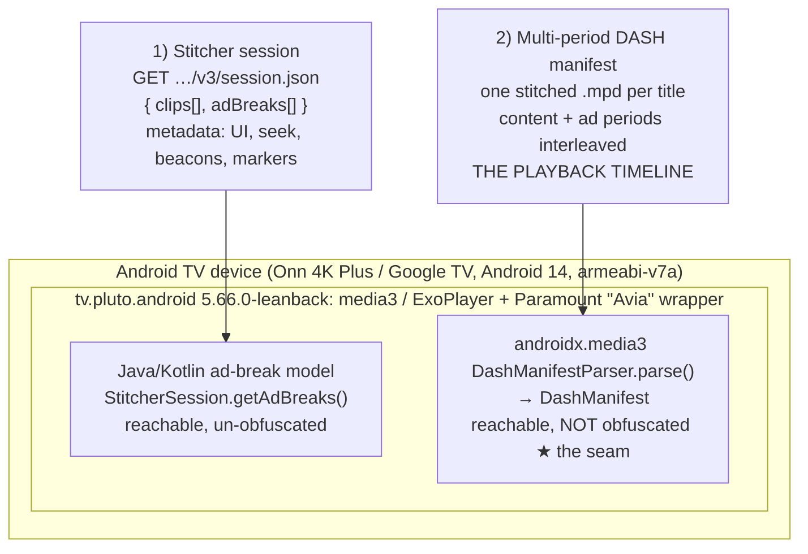

# Pluto TV (Android TV) Ad & Playback System Design — A Reverse-Engineering Analysis

> A ground-up reconstruction of how the Pluto TV Android TV app (`tv.pluto.android`, `5.66.0-leanback`) schedules and stitches advertisements into playback, and where that pipeline can be cut. It is derived entirely from **on-device observation** on a retail **Onn 4K Plus (Google TV, Android 14, armeabi-v7a)**: `logcat` from the app's own runtime, an AdGuard Premium filtering-log capture, a bytecode hook that logs the parsed DASH manifest, and static analysis of the shipped dex.
>
> Every claim below is grounded in something we actually watched happen on the device: a stripped response, a period count, a duration that changed on screen.
>
> This is a companion to the working ad-suppression patch in [morphe-androidtv-patches](https://github.com/ajstrick81/morphe-androidtv-patches). It documents *why* the patch works, and, just as usefully, the confident-looking approaches that **failed** before the real one landed.

> **Revision 2, 2026-09-23.** Applies to Pluto TV `5.66.0-leanback` with patches **v1.37.4**. Since the first edition (July 31, 2026), this revision:
> - **Corrects §5.1.** "Content is DRM'd, ads aren't" turned out to be wrong. Some shows serve un-DRM'd content, and one ad bumper *is* DRM'd. Ads are now detected positively by their creative URL (§5.1, issue #144).
> - **Corrects lesson 3.** `_ad/creative` is not a weak signal. Most ad URLs carry it **percent-encoded** (`_ad%2Fcreative`) (§5.1, §8).
> - Adds the strip's safety rails: live manifests pass through untouched, and an over-strip guard applies (§5.2).
> - Adds the **resume-bookmark remap**, so a shortened timeline doesn't break "Continue Watching" (§5.3, #147).
> - Adds **live TV masking**, black screen plus mute, and why the mute had to be stream-level (§5.4, #152).
> - Updates the Prime Video comparison: it is no longer "DNS-only" (§8).

---

## 0. TL;DR — the one-paragraph version

Pluto TV is server-side ad-stitched (SSAI), but, unlike most SSAI apps, the ad video is **not** welded into one opaque stream. A VOD title is delivered as a **multi-period DASH manifest**: a playlist of discrete `<Period>`s where content chunks and ad chunks sit **side by side** as separate periods, each pointing at its own media. media3 (ExoPlayer) fetches and parses that manifest, and this is the crux: **media3's DASH classes are not obfuscated in the Pluto build.** So the whole ad timeline is readable at `DashManifestParser.parse()`'s return, as a plain list of periods.

Every ad period's URL carries an ad-creative marker (`_ad/creative`, often percent-encoded, or `_ad_bumper`); content periods never do. Drop the ad periods, re-base the timeline so it stays gap-free, remap any resume bookmark into the shorter timeline, and the ads are **gone**, not skipped but *removed*. Verified: a 2:49:58 movie became **2:18:41** (its true runtime), mid-rolls gone, playback clean.

**Live** channels are different: the ad *is* the broadcast at that moment, so it can't be removed. Instead, an optional patch **masks** it with a black screen and mutes the audio for the break's duration.

---

## 1. Architecture Overview



| Role | Host |
|---|---|
| Stitcher session | `cfd-v4-service-stitcher-dash-use1-1.prd.pluto.tv` |
| Manifest | `service-manifest-generator-*.prd.pluto.tv` |
| Content media | `*.pluto.tv` (clip paths, DRM'd *or* not) |
| Ad media (two CDNs) | `siloh-ns1.plutotv.net/…/_ad/creative/…` and `…/head(…)/sign/v1/…` (with `_ad%2Fcreative` in the path) |

The single most important architectural fact: **the ad video and the content video are separate DASH periods in the same manifest.** The client stitches them into one timeline at playback time, from a manifest it must parse in order to play anything. Anything the client assembles at runtime, it assembles in a form its own code can read.

---

## 2. The stitcher session (`session.json`) — metadata, not the timeline

On play, the app fetches a ~1.7 MB JSON from the stitcher:

```
GET https://cfd-v4-service-stitcher-dash-use1-1.prd.pluto.tv/v3/session.json?clientTime=…
```

It contains two parallel arrays:

* **`clips[]`**: an ordered playlist of content and ad clips. Ad clips are tagged `type:"creative"` and carry an `adPodId`/`creativeID`; content clips are `type:"clip"`. Clips carry **no media URL** (only a thumbnail template) and are positioned by ISO `startTime`/`endTime`/`timelineStartAt`.
* **`adBreaks[]`**: the client-side ad-break timeline, with slot start/end and the VAST creatives and beacons for each break.

It is tempting to treat `clips[]` as the playlist and just delete the ad clips. **We tried. It does nothing to playback** (see §4.1). `session.json` drives the *seek bar*, the *ad markers*, the *beacons*, and the *pause/clickable-ad overlays*, i.e. the ad **experience**. It is **not** what media3 plays.

---

## 3. The two ad layers

Pluto's VOD ads live in two places, and conflating them is the trap:

| Layer | Where | What it controls | Reachable? |
| --- | --- | --- | --- |
| **A. Ad-break metadata** | `session.json` `adBreaks[]` → parsed into `StitcherSession.getAdBreaks()` | markers, seek-blocking, ID3 beacons, pause/clickable-ad overlays | **Yes**: a plain Java getter |
| **B. Ad video** | the stitched **multi-period DASH manifest** media3 fetches | the actual ad **frames** that play | **Yes**: media3 parser, un-obfuscated |

The shipped `Skip ads` patch originally hooked only **Layer A** (empty `getAdBreaks()`, reproducing AdGuard's `||pluto.tv/*/session.json$jsonprune=$.adBreaks.*`). That removes the ad *chrome* (markers, beacons, overlays), and it is genuinely useful. **But the ad video still played**, because the frames live in Layer B, which `adBreaks[]` never touches. Closing that gap is what this analysis is about.

---

## 4. The two dead ends (worth documenting — they look right)

### 4.1 Rewriting `session.json` `clips[]`

We injected an OkHttp interceptor at the stitcher-session client (`StitcherSessionJwtApiModule.buildStitcherSessionApi`) and rewrote the response to remove every ad clip and re-baseline the content clips contiguously. The log confirmed a perfect strip to the real 2:18:41 runtime. **On screen, the player still showed 2:49 and still played every ad.** A decisive follow-up stripped *all* clips, content included, and it still played the full ad-laden timeline (and broke the seek bar). Verdict: **`clips[]` is metadata; media3 plays from the DASH manifest, not the session JSON.**

### 4.2 Wrapping media3's DASH HTTP client

The obvious next move: hook the OkHttp client media3 uses to fetch the manifest (`AviaPlayerFactory.dataSourceFactory`'s `Call.Factory`) and rewrite the `.mpd` on the wire. **Adding *any* interceptor to that client black-screens playback.** media3 never even initialises, and no request ever reaches the interceptor. The streaming/network layer is the wrong seam: the fetch itself depends on it. This was confirmed by elimination: stock plays, the clip-strip build plays, and *every* build that wraps this client black-screens, regardless of what the interceptor does.

Both dead ends point at the same conclusion: don't touch the **transport**. Touch the **parsed result**.

---

## 5. The removal seam — DASH period surgery at the parser

media3 parses the downloaded manifest here:

```
androidx.media3.exoplayer.dash.manifest.DashManifestParser
    .parse(Uri, InputStream) : DashManifest
```

In the Pluto build these classes ship **un-obfuscated** (real names survive R8). So we hook the **return value**, after download and parse, and rewrite the `DashManifest` object before media3 builds its timeline from it. This never touches the streaming client (§4.2), so it cannot break the fetch.

### 5.1 What the parsed manifest looks like, and how to tell ads from content

A typical VOD title parses to **~69–76 periods**. Dumping every period's first `BaseUrl` shows content and ad periods interleaved:

```
P0  C  dur=985400ms  url=…/720pDRM/…445e24df/0-985403/dash/            ← content
P1  ad dur=30033ms   url=…/…)/head(0-982)/sign/v1/QpbK…=/              ← ad
P2  ad dur=30037ms   url=…/…)/head(0-961)/sign/v1/lqDe…=/              ← ad
P4  ad dur=30066ms   url=…siloh-ns1.plutotv.net/7_ad/creative/…_ad/…  ← ad
P7  C  dur=452133ms  url=…/720pDRM/…445e24df/985403-1437521/dash/      ← content
…
P75 C  url=…/720pDRM/…445e24df/7648441-end/dash/                       ← content
```

For "Angels & Demons" that was **14 content periods summing to exactly 2:18:41** and **62 ad periods summing to 31:17**. Content plus ads = 2:49:58, exactly what the unpatched app showed.

**The first classifier was wrong.** It kept a period only if its URL had a DRM rendition path (`720pDRM` / `1080pDRM`), on the theory that content is always DRM'd and ads never are. It worked on "Angels & Demons" and failed in the field (issue #144):
- *Supermarket Sweep* serves its real content **un-DRM'd** (`siloh…/627_Fremantle/clip/…_Supermarket_Sweep_Episode_1151/720p/…`), so every content period was dropped.
- The only DRM'd period on that title was a 10-second **ad bumper** (`…_ad_bumper_animation…/1080pDRM/`), so the rule kept the ad and threw away the show.
- The episode collapsed to a 10-second stub (`kept 1 content, newDurationMs=10000`), looped, and auto-advanced.

**The shipped classifier detects ads positively** and keeps everything else:

* **Ad spots** carry `_ad/creative` in the path. On the bulk `…/head(…)/sign/v1/…` flavor the `/` arrives **percent-encoded**, as `_ad%2Fcreative`. That is why the first edition thought this marker covered "only ~7 of 62" spots: it was matching the literal string, and most ads carried the encoded form.
* **The inter-pod bumper** carries `_ad_bumper`.
* **Content** clips (`…/clip/{id}_{Show}_{Episode}/…`) contain neither, DRM'd or not. **Any unrecognized period is kept.** At worst an unknown ad flavor plays; an episode is never lost.

Verified on-device: *Supermarket Sweep* went from 29:42 to 22:02 with no ads and no skip; *Workaholics* (DRM'd content) was also clean, now with the DRM'd bumper correctly removed.

### 5.2 The rewrite and its safety rails

For each parsed manifest:

1. **Live manifests are passed through untouched.** Linear channels use *dynamic* DASH (`manifest.dynamic == true`), a continuously re-issued manifest with a moving live edge and a wall-clock timeline. The first build stripped those too; re-basing a live timeline corrupted it, so channels looped and rebuffered on the same few seconds (reported on an Nvidia Shield). The strip now only runs on static (VOD) manifests (#89). Live is handled separately (§5.4).
2. Walk the periods; drop the ad periods (§5.1); keep the rest.
3. **Re-base** each kept period's `startMs` to run immediately after the previous one (`cursor += getPeriodDurationMs(i)`). This closes the gaps the removed ad periods leave; a gap would strand media3 on a missing period (the "ghost period" lesson carried over from Prime Video). Each period's segment timeline is period-relative, so re-basing `startMs` keeps its segments addressable.
4. **Over-strip guard.** If the result would keep less than **40%** of the original duration, the manifest passes through unchanged. Real titles keep about 70% or more; anything lower means the stitching changed, and it's safer to show ads than to lose the show.
5. Rebuild the `DashManifest` (`new DashManifest(...)`, `new Period(...)`) with the surviving periods and the shorter total duration.

It fails open by construction: on anything unexpected the **original** manifest is returned. In the worst case the ads remain; playback never breaks. On-device result (log tag `MORPHE-DASH-MF`):

```
STRIPPED 57 ad periods, kept 14 content, newDurationMs=8321564 (was 10137247)
```

`8321564 ms = 2:18:41`. On screen, the runtime dropped to 2:18:41, the mid-rolls were gone, and content played cleanly across every former ad seam.

### 5.3 Resume bookmarks in a shorter timeline (#147)

Removing ads shortens the timeline (e.g. 25:33 to 22:02), but Pluto's "Continue Watching" bookmark is stored in the **original, ad-inclusive** timeline. Avia bakes it into the media asset as ExoPlayer's start position (`AviaPlayer.startExoplayer` → `Player.seekTo`). A bookmark past the new, shorter end made ExoPlayer seek beyond the end, hit `STATE_ENDED`, and auto-advance to the next episode.

The fix: the strip records every removed ad period (original start plus duration). A sixth hook, just before the resume `seekTo(J)`, runs the position through `mapResumePosition`. If the position overshoots the stripped duration, it subtracts the ad time removed before it, landing on the true content position (clamped just inside the end). In-range resumes and fresh starts are unchanged. It also fails open: on anything unexpected, the original position is used.

### 5.4 Live TV: mask, don't remove (#152)

Live ads are real broadcast wall-clock time: the ad *is* the stream at that moment, so there is nothing to delete. The optional **Mask live ad breaks (black screen + mute)** patch hides them instead:

* **Detector:** Pluto's own ID3 ad-state flow. `ID3AdsBeaconTracker.consumeID3(ID3Tag)` fires **only while an ad is on screen** and stays silent during the show, so each call is an "ad tick". The first tick shows the mask; every tick re-arms a 6.5-second hide timer; the mask lifts when the ticks stop. It is event-driven, with no polling. It still works with `Skip ads` applied, because that patch neuters a different class (`BeaconTracker.fire`).
* **Where the mask lives:** `LeanbackMainHostActivity`, the stable single-activity host that covers the player for the whole session. The first attempt used the live-controls fragment, whose view is destroyed when the controls auto-hide, so the mask vanished mid-break.
* **Mute, twice.** Muting the content ExoPlayer (captured at `AviaPlaybackController.<init>`) wasn't enough. On some channels the ad audio comes from a *different* pipeline, so the screen went black but the ad was still audible. The fix adds a **stream-level** mute (`AudioManager.STREAM_MUSIC`) that silences whatever produces the sound. The exact volume is saved and restored, and a 15-minute failsafe plus teardown on activity destroy means a missed unmute can't leave the device muted.

Runtime switches (marker files in the app's external files directory): `slate_off` disables the mask; `pluto_slate_mode` = `black` or `mute` selects cover-only or mute-only.

---

## 6. Security & anti-tamper posture

* **Certificate pinning** exists but can be overridden in bytecode. The patch set ships an "Override certificate pinning" hook; it made the HTTPS session inspectable during analysis and is harmless to leave on.
* **No manifest hash-pinning** on the client for the stitched `.mpd`. Unlike Prime Video's hash-pinned, encrypted-at-rest JS bundle, Pluto hands media3 a plain DASH manifest and trusts its own parse. That trust is the opening.
* Content is often Widevine-DRM'd, but **not always**, and one ad bumper *is* DRM'd. DRM status is not an ad signal (§5.1).

---

## 7. The seams — where the design is patchable

[](https://ajstrick81.github.io/morphe-androidtv-patches/diagrams/plutotv-ad-path.html)

> ▶ **[Explore the interactive diagram](https://ajstrick81.github.io/morphe-androidtv-patches/diagrams/plutotv-ad-path.html)**. Step through four guided views: *VOD strip*, *Ad chrome*, *Resume fix* and *Live mask*. It is also in the repo as [`docs/diagrams/plutotv-ad-path.html`](https://github.com/ajstrick81/morphe-androidtv-patches/blob/main/docs/diagrams/plutotv-ad-path.html), a single self-contained file that works offline.

**`Skip ads` patch:**

| # | Hook | Layer | Effect |
| --- | --- | --- | --- |
| 1 | `BeaconTracker.fire(String, List)` → `return-void` | A | silences all SSAI tracking beacons |
| 2 | `PauseAdsImageBinder.showPauseAdImageAfterInactivity(...)` → `return-void` | A | kills the pause-screen ad |
| 3 | `ClickableAdsBinder.bind(...)` → disposed `Disposable` | A | kills interactive/clickable ad overlays |
| 4 | `StitcherSession.getAdBreaks()` → `emptyList()` | A | empties the ad-break timeline (markers, seek-block, ID3 beacons): AdGuard's `$jsonprune` in bytecode |
| **5** | **`DashManifestParser.parse(...)` return → strip ad `<Period>`s** | **B** | **removes the ad VIDEO: the real removal** (VOD only) |
| 6 | `AviaPlayer.startExoplayer(...)` → remap the resume `seekTo(J)` | B | keeps "Continue Watching" correct in the shortened timeline |

Hooks 1–4 remove the ad *experience*; hooks 5–6 remove the ad *frames* and keep the shorter timeline consistent.

**`Mask live ad breaks (black screen + mute)` patch (optional, live only):**

| Hook | Role |
|---|---|
| `ID3AdsBeaconTracker.consumeID3(ID3Tag)` | the detector ("ad tick") |
| `LeanbackMainHostActivity.onCreate` / `onDestroy` | register/unregister the host the mask is drawn in |
| `AviaPlaybackController.<init>` | capture the player for the ExoPlayer mute leg |

---

## 8. Non-obvious findings (the expensive lessons)

1. **`session.json` `clips[]` is a decoy playlist.** It looks exactly like the thing that drives playback, but it drives the *seek bar*. media3 plays from the DASH manifest. Prove which surface owns the timeline before building on it.
2. **You cannot wrap the streaming client.** Any interceptor on media3's manifest/segment OkHttp client black-screens playback before init. Operate on the *parsed result*, not the transport.
3. **Detect the thing you remove, and keep everything you don't recognize.** The first classifier inferred ads from an absence ("not DRM'd"), which breaks the moment content is un-DRM'd. The fix detects ads by a positive marker (`_ad/creative`, `_ad_bumper`), and an unknown period defaults to content.
4. **Check URL encoding before calling a marker weak.** `_ad/creative` looked like it tagged only ~10% of ads. Most carried it as `_ad%2Fcreative`. The signal was fine; the string match was naive.
5. **Removing periods requires closing the gap,** and **shortening the timeline breaks anything stored in the old one.** Re-base `startMs` so media3 doesn't stall on a hole, then remap resume bookmarks from the ad-inclusive timeline into the stripped one, or they seek past the end.
6. **Live is a different problem: mask it, don't remove it.** On live, the ad is the broadcast. The honest ceiling is to hide and silence it, and to mute at the *stream* level, because the ad's audio may not come from the player you hooked.
7. **media3 being un-obfuscated is the whole game.** The identical approach fails the moment a build minifies `androidx.media3.exoplayer.dash.manifest.*`; then you're back to fingerprinting renamed classes.
8. **SSAI is not one problem.** Prime Video builds its ad timeline inside a sealed native JS engine, so its patch works in-process at the native `memcpy` boundary ([Prime Video teardown](https://github.com/ajstrick81/morphe-androidtv-patches/blob/main/docs/PRIME_VIDEO_ATV_SYSTEM_DESIGN.md)). Pluto exposes its ad timeline twice: a Java ad-break model *and* an un-obfuscated DASH parser. Where the ad timeline is parsed decides which layer you fight on.

---

## 9. Practical reference — observe it yourself

* **The metadata layer:** an AdGuard Premium filtering-log export shows the suppression rule `||pluto.tv/*/session.json$jsonprune=$.adBreaks.*`, proof that the ad-break schedule is a discrete, prunable array.
* **The video layer:** hook `DashManifestParser.parse`'s return and log `manifest.getPeriodCount()` plus each `Period`'s first `Representation.baseUrls[0].url`. You'll see the content clip periods and the `_ad%2Fcreative` / `_ad/creative` / `_ad_bumper` ad periods interleaved, with durations summing to the on-screen runtime.
* **The shipped strip:** `adb logcat -s MORPHE-DASH-MF` shows `STRIPPED N ad periods, kept M content, newDurationMs=…` (the new duration should equal the title's true runtime), `dynamic (live) manifest -> untouched` on live channels, and `resume remap (#147): …` when a bookmark is remapped.
* **The live mask:** `adb logcat -s MORPHE-PLUTO-SLATE` shows the mask engaging on ad ticks, both mute legs, and the exact volume restore.

---

## 10. Scope

* **On-demand (VOD): fully removed.** Ad periods dropped, timeline re-based, runtime shrinks to the real length, and resume bookmarks land in the right place.
* **Live TV (linear channels): masked, not removed.** A black screen plus mute for the duration of each break (optional patch). Live ads are real broadcast time, the same fundamental limit as any live broadcast.

---

## 11. References & acknowledgments

* Patch + source: **morphe-androidtv-patches**: `patches/…/pluto/ads/SkipAdsPatch.kt` (hooks 1–6), `LiveSlatePatch.kt`, `extensions/…/pluto/ads/PlutoDashManifestProbe.java`, `PlutoLiveSlateHelper.kt`.
* Companion analysis: the [Prime Video ATV system design](https://github.com/ajstrick81/morphe-androidtv-patches/blob/main/docs/PRIME_VIDEO_ATV_SYSTEM_DESIGN.md), a very different SSAI design beaten at a very different layer.
* media3 / ExoPlayer DASH manifest model (`DashManifest`, `Period`, `AdaptationSet`, `Representation`, `BaseUrl`), AndroidX open source.
* The users whose field reports found what a single test device couldn't: the un-DRM'd-content break (#144), the resume skip (#147), and live ad audio surviving the mask (#152).
* Enormous thanks to the Morphe community, whose documented lessons made the dead ends cheap to rule out.

---

## 12. Closing note

Pluto "should" have been unbeatable: SSAI, the same class of stitched-ad problem that walls off most streaming apps. It wasn't, for one reason: the wall was a door the app has to walk through too. To play a title, media3 must be handed a manifest it can read, and that manifest spells out, in plain, un-obfuscated periods, exactly which chunks are content and which are ads.

The second half of the story taught humility about *how* you read that door. A signal that looked perfect ("content is DRM'd") was an assumption that held on one title and broke on the next. The durable version asks a narrower question (is this an ad creative?) and treats everything else as precious.

**The lock was only ever on the outside. The app was carrying the key the whole time; it has to, every time it plays.**

---

_Reverse-engineered from on-device observation for the [morphe-androidtv-patches](https://github.com/ajstrick81/morphe-androidtv-patches) project. Findings reflect Pluto TV `5.66.0-leanback` as observed through September 2026 (patches v1.37.4)._

_Revision history: **r1** (2026-07-31) first edition · **r2** (2026-09-23) ad-detection correction (#144), percent-encoding lesson, live passthrough and over-strip guard, resume remap (#147), live masking (#152), Mermaid diagram._
