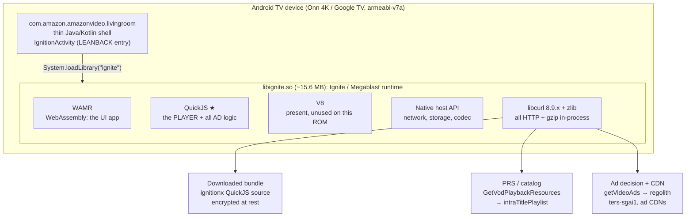
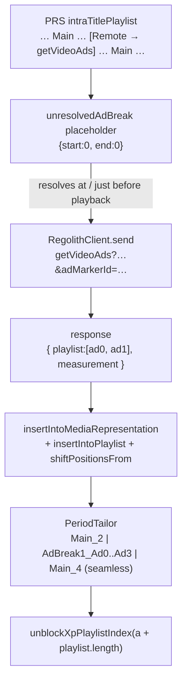

Prime Video (Android TV) Ad & Playback System Design — A Reverse-Engineering Analysis
=====================================================================================

> A ground-up reconstruction of how the Prime Video "living room" app (`com.amazon.amazonvideo.livingroom`) schedules, resolves, and stitches advertisements into on-demand playback. It is derived entirely from **on-device observation**: in-process memory capture at the `libignite.so` copy boundary, `logcat` from the app's own runtime, DASH-manifest dumps, and static analysis of the shipped binary.
>
> Every claim below is grounded in bytes we actually watched cross the wire or the heap on a retail **Onn 4K (Google TV)** box. Where we quote the app's own code, it is minified JavaScript recovered from memory, reproduced only as far as needed to explain the mechanism.
>
> This is a companion to the working ad-suppression patch in [morphe-androidtv-patches](https://github.com/ajstrick81/morphe-androidtv-patches). It documents _why_ the patch works, not just that it does.

> **Revision 2 — 2026-09-23.** Applies to Prime Video **`6.23.23` / engine `v15.5.x`** with patches **v1.37.4**. Since the first edition (early August 2026) this revision:
> - **Corrects §8.** The JS count-gate (seam 2) was prototyped and **rejected**. It never shipped (§8.2).
> - Adds the issue #14 **restart** lesson: why `getVideoAds`-backed `Remote` items must be left in place (§8.1, §10).
> - Adds **truncated ad responses** in high-ad regions and the two-layer salvage (§6.2, §8.4).
> - Adds **how the patch ships**: Morphe patches, CI-built `libpvhook.so`, and on-device self-stamps (§9).
> - Adds **known limits** (the rare large mid-roll freeze and its Back → Resume workaround) and the **v16 frontier** (§11).

* * *

0\. TL;DR — the one-paragraph version
-------------------------------------

Prime Video on Android TV is not a native player with a native ad engine. It is a **downloaded application** running inside a custom Amazon runtime (`libignite.so`) that embeds **three script engines**: WAMR for WebAssembly, QuickJS for JavaScript, and a native host API. The playback stack is **QuickJS JavaScript**: timeline, DASH handling, and _all_ ad scheduling. It is downloaded at launch and encrypted at rest, but necessarily **plaintext in memory** so the engine can run it. Ads are **not baked into the video**. They are **resolved at playback time** from ad-decision services (`getVideoAds` → _regolith_) and **dynamically spliced** into the media timeline by the app's own JavaScript.

That runtime resolution is the seam. The shipping patch never touches the player code itself. It edits the ad **data** in flight, same length and in place, at `libignite`'s own `memcpy` boundary. It blanks deferred ad pointers in the playback resources (movies) and empties the resolved ad-decision response (TV), so the app takes its **own built-in "no ads" path**.

* * *

1\. Architecture Overview
-------------------------



| Role | Host |
|---|---|
| Downloaded JS bundle | `cloudfront.xp-assets.aiv-cdn.net` |
| PRS | `*.aiv-delivery.net` / `api.amazonvideo.com` |
| Ad decision (SGAI) | `*.regolith.prime-video.amazon.dev` (`getVideoAds` / `getAds`) |
| Ad stitch / seam | `ters-sgai1.us-east-1.aiv-delivery.net` |
| Pause ads | `*.regolith.prime-video.amazon.dev` (`format=PAUSE_ADS_STATIC`) |

The single most important architectural fact: **the player is not compiled into the binary.** Static analysis of `libignite.so` finds the bootstrap framework (`MegablastLog`, `GetReactURI`, `appBootstrap`). It finds **zero** occurrences of the player and ad identifiers (`PeriodTailor`, `PRSResponseHandler`, `splitMainContent`, `resolveWithAdBreaks`, `AdBreakManager`, `intraTitlePlaylist`). Those live only in the **downloaded** bundle.

* * *

2\. The Runtime: Ignite / Megablast
-----------------------------------

`libignite.so` is Amazon's cross-platform app runtime, the same "Ignite" family seen on other Amazon living-room surfaces. Internally the app calls itself **Megablast**. Every log line the runtime emits is tagged `MegablastLog` and routed to Android `logcat` under two tags that reveal the execution split:

| logcat tag | engine | what runs there |
|---|---|---|
| `WASM` | WAMR (WebAssembly Micro Runtime) | the ignitionx **UI application** (Rust→WASM) |
| `SCRIPT` | **QuickJS** | the **player**: DASH, timeline, **ad scheduling** |

At startup the runtime logs its mode: _"Device runs Wasm execution mode but bootstrapRustClient was set to undefined."_ The UI is WASM; the media pipeline is JavaScript. This split is why earlier investigations of the WASM host-call RPC boundary (`wasmFuncName`/`argsJson`) hit a dead end for ads: only one function (`acm_store_update`) ever transits it. **On v15, ads are a QuickJS concern.** (v16 changes this; see §11.2.)

### 2.1 The player bundle (ignitionx)

*   It is fetched from `cloudfront.xp-assets.aiv-cdn.net` on every launch. The top-level object is `ATVUnfPlayerBundle` (minified UMD-style modules).
*   It is stored on disk under `files/persist/` as **hashed, encrypted blobs** (entropy ≈ 8.0 bits/byte, magic `cf ff ff 45`, device-bound key) and **hash-pinned** by an `igniteAssetsHash` resource. You cannot read it at rest, and you cannot hand the app a modified copy that survives the pin.
*   **But it must be decrypted to run.** QuickJS parses **plaintext JavaScript source** in memory. We confirmed this on-device: buffers containing the player source are 100% printable ASCII and flow through the runtime's own `memcpy` in 5–16 KB module-sized chunks. This observation made the analysis possible. The shipping patch does **not** edit this code, though (§8.2).

Every function in the bundle is wrapped in a helper named `freeOnUnref`. That is a reliable fingerprint for telling **code** buffers apart from **data** (JSON) buffers in memory.

* * *

3\. The Playback Resource pipeline (PRS)
----------------------------------------

Playback begins with a **PRS** call: `POST /cdp/catalog/GetVodPlaybackResources`. The response's `playlistedPlaybackUrls.value.intraTitlePlaylist` is an **ordered list of playlist items** that defines the content timeline and where ads may go:

```jsonc
// PRS intraTitlePlaylist — the timeline skeleton (abridged, field names verbatim)
"intraTitlePlaylist": [
  { "type": "Main",   "urls": { "manifest": { "url": "...dash.mpd", ... } } },
  { "type": "Remote",                         // ← a RESOLVE-LATER ad pointer
    "resolutionConstraints": {
      "maxMsInAdvance": 0,
      "mayResolveBeforePlayStart": true,       // preroll resolves before playback
      "timeoutInMs": 1750,
      "maxAttemptsPerUrl": 2
    },
    "urlsInPriorityOrder": [
      "/cdp/getVideoAds?version=v1&adDeliverySessionId=..._PBP_EXPL_...&adMarkerId=PRE_ROLL&failover=false",
      "/cdp/getVideoAds?...&adMarkerId=PRE_ROLL&failover=true"
    ]
  },
  { "type": "Main",   "urls": { ... } }
]
```

Key insight: a `type:"Remote"` item is **not an ad**. It is a **deferred pointer**, a promise that says "an ad break goes here; resolve it by calling `getVideoAds`." The timeline the player builds from this contains `Main` periods interleaved with **`unresolvedAdBreak`** placeholders of zero duration:

```jsonc
// The pre-resolution timeline (ContentMillis), from a real capture
[ { "contentId": "..._main",              "startTime": 0,      "endTime": 681960 },
  { "contentId": "..._unresolvedAdBreak_3c790e47-...", "startTime": 0, "endTime": 0 },  // placeholder
  { "contentId": "..._main",              "startTime": 681960, "endTime": 1330240 },
  { "contentId": "..._unresolvedAdBreak_078c5638-...", "startTime": 0, "endTime": 0 },  // placeholder
  { "contentId": "..._main",              "startTime": 1330240,"endTime": 2564000} ]
```

This is the crux of the design. The schedule of _where_ breaks occur is delivered up front (PRS), but _what plays_ in each break is resolved lazily. That is what lets Amazon serve different ads to different viewers for the same title, and it is also the runtime seam that makes ads removable.

The **positions** of those placeholders are load-bearing: the player reserves a slot for each one. §8.1 and §10 explain why removing a slot outright breaks playback.

`PRSResponseHandler` (QuickJS) validates and ingests this response. A sibling `XpError("prs.vod_playlisted_playback_urls.*")` taxonomy guards against missing or empty playlists and a missing `Main` item.

* * *

4\. The Ad-Scheduling engine — TWO independent paths
----------------------------------------------------

There is no single ad inserter. On-device evidence shows **two distinct JavaScript paths**, chosen by how the break is delivered. A complete ad suppression must cover **both**.

### 4.1 Path 1 — cuepoint / media-representation → `resolveWithAdBreaks`

This path handles breaks that arrive as **cuepoints** or a **media representation**. The class exposes two entry points that both funnel into one method:

```js
// recovered QuickJS source (minified), reproduced for analysis
e.prototype.resolveFromCuepoints = function (e) {
  var t = this.cuepointPlaylistProcessor.process(this.cuepoints, this.getMainContentDurationMs());
  return this.resolveWithAdBreaks(e, t);
};
e.prototype.resolveFromMediaRepresentation = function (e, t) {
  var n = this.mediaRepresentationProcessor.process(t);
  return this.resolveWithAdBreaks(e, n);
};
e.prototype.resolveWithAdBreaks = function (e, t) {      // t = array of ad breaks
  var n = this;
  if (0 === t.length) return jd.Promise.resolve([]);     // ★ COUNT-GATE: no breaks ⇒ no split
  var r = this.getMainContentDurationMs(),
      i = this.splitMainContent(t, r),                   // splits ONE content period into [main][ad][main]…
      o = new XC.XpAdPlaylistInterceptor(this.playerId, this.playlistEngine, this.titleIdView,
                                         this.mainContentView, this.mpPlayer, i);
  o.initialize();
  this.playlistEngine.registerOnPositionInterceptor(o);
  this.playlistEngine.registerSeekInterceptor(o);
  /* … VmapTrackingEventListener … */
  this.log.info("Playlist after inserting ad breaks:\n" + BC.formatPlaylist(this.playlistEngine));
  return jd.Promise.resolve(t);
};
```

`splitMainContent(breaks, durationMs)` iterates over the breaks. For each break it mutates the shared timeline **in place** via `mainContentView.update(...)`, carving one content period into `[Main][Ad][Ad][Main]…`. It builds `PlaylistedPeriod("AdBreak"+n+"_Ad"+p, …)` objects and attaches ad metadata via `createAdMetadata(...)`. It also has its **own** early exit that returns `[]` on a "Live ads already present" conflict. That proves `return []` (insert nothing) is a first-class, safe path the player already handles.

### 4.2 Path 2 — EXPL / SGAI `getVideoAds` → `AdBreakManager` (regolith)

This is the **dominant TV-show path**, and the one the `intraTitlePlaylist` `type:"Remote"` items feed. It is an entirely separate class, `AdBreakManager`, and it does **not** go through `resolveWithAdBreaks`:

```js
// recovered QuickJS source (minified), reproduced for analysis
e.prototype.resolveAndInsert = function (e, o, a, s, l, t) {
  var u = this,
      n = new NT.RegolithClient("Midroll", e.urlsInPriorityOrder,
            e.resolutionConstraints.maxAttemptsPerUrl,
            e.resolutionConstraints.timeoutInMs, /* … */);
  return this.adBreakCustomMetadataReporter.attachListenersForRegolithMetrics(t, n),
    n.send(o)
     .catch(function (err) {                       // resolve FAILED
       u.unblockXpPlaylistIndex(a); return null;   // ★ clean: unblock, insert nothing
     })
     .then(function (e) {                          // e = { playlist:[…ads…], measurement:{…} }
       if (o.throwIfRequested(), null != e) {
         u.log.info("Ad break " + s + " resolved with ad count " + e.playlist.length);
         var t = u.insertIntoMediaRepresentation(e, a, s);   // builds AdBreakN_AdP periods
         u.insertIntoPlaylist(e, t, a, s);                    // playlistEngine.insertAfter + shift
         u.flushContentSourceIfNeeded(a + e.playlist.length, l);
         0 < e.playlist.length                                // ★ the empty-break branch
           ? u.breakMeasurementBeaconReporter.sendAdBreakTrackingEvents(/* … */)
           : u.breakMeasurementBeaconReporter.sendEmptyAdBreakTrackingEvents(/* … */);
         u.unblockXpPlaylistIndex(a + e.playlist.length);
       }
     });
};
```

Every ad-period creation in this path loops over `e.playlist`, the **resolved regolith response**:
- `insertIntoMediaRepresentation` builds `new PlaylistedPeriod("AdBreak"+d+"_Ad"+p, …, "Remote", …)` for each resolved ad and calls `mediaRepresentation.insertBefore(…)`.
- `insertIntoPlaylist` → `createPlaylistItemsFromRegolithResponse` builds items via `RegolithAdPlaylistTransformer.transformAdPlaylistItemToSimplifiedAd`, then calls `playlistEngine.insertAfter(…)` and `shiftPositionsFrom(…)`.

The `RegolithClient` resolves the ad break over HTTP. The response wire format (captured decompressed, ~4.5 KB in a single buffer in the common case):

```jsonc
// getVideoAds / regolith RESPONSE
{
  "description": { "adDeliverySessionId": "..._PBP_EXPL_...", "adMarkerId": "PRE_ROLL" },
  "playlist": [                                   // ← the dynamic ad list (per-viewer)
    { "description": { "adId": "...", "contentType": "Ad",
                       "creativeId": "590218877460957102", "duration": "00:00:08.008" },
      "media": { "urls": [ { "url": "...", "cdn": "...", "consumptionId": "..." } ] },
      "uiFeatures": { /* adLabel, countdown, goAdFree */ } },
    { /* … ad 1 … */ }
  ],
  "measurement": { "errorUrls": [ "https://ters-sgai1.us-east-1.aiv-delivery.net/v2/re?..." ] }
}
```

In high-ad regions this response can be many times larger and arrive **split across copies**. See §6.2.

### 4.3 The two paths side by side

| | **Path 1** | **Path 2 (dominant for TV)** |
|---|---|---|
| Class / method | `resolveWithAdBreaks` / `splitMainContent` | `AdBreakManager.resolveAndInsert` |
| Break source | cuepoint / media representation | `intraTitlePlaylist` `type:"Remote"` → `getVideoAds` |
| Resolver | (local processors) | `RegolithClient.send()` (SGAI) |
| Ads live in | `t` (breaks array) | `e.playlist` (regolith response) |
| Period creation | `mainContentView.update` | `insertIntoMediaRepresentation` + `insertIntoPlaylist` |
| Built-in "no ads" path | `if (0===t.length) return []` | `0 < e.playlist.length ? … : sendEmptyAdBreakTrackingEvents` |
| adSystem | (varies) | `"Amazon"` (also `"ATVDraperSchedulingService"` = _Draper_) |

* * *

5\. Stitching & timeline tailoring (PeriodTailor)
-------------------------------------------------

Once ads are resolved and inserted, **`PeriodTailor`** (QuickJS) adjusts every period's boundaries so the interleaved timeline plays seamlessly. It logs each adjustment, which makes the entire ad schedule observable for free:

```
[PeriodTailor] >> Period Adbreak0_Ad0  end tailored:   8000 --> 8000
[PeriodTailor] >> Period Adbreak0_Ad1  start tailored:  8000; end: 24000
[PeriodTailor] >> Period Card_1        start: 24000; end: 30000     (bumper/interstitial card)
[PeriodTailor] >> Period Main_2        start: 30000; end: 711960
[PeriodTailor] >> Period AdBreak1_Ad0..Ad3   711960 … 792960        (a 4-ad mid-roll)
[PeriodTailor] >> Period Main_4        792960 … 1441240
[PeriodTailor] >> Period AdBreak2_Ad0..       1441240 …              (next mid-roll)
```

PeriodTailor's **extension** at a boundary is also the best health signal for any ad edit. Near zero (+0.58 ms) means the timeline stayed intact. A full ad length (+246,162 ms) means a slot was left with nothing to fill it (§10).

Supporting cast (all QuickJS, all observable):

*   **`FragmentBuffer`**: per-period media segment queries (`@@id@@` is the pre-resolution placeholder period id).
*   **`PrimarySegmentInfoProducer`**: reports sub-frame audio/video overlaps and gaps at period seams (e.g. `-24ms overlap between Main_2 and AdBreak1_Ad0`).
*   **`XpAdPlaylistInterceptor`**: the position/seek interceptor that does ad-view bookkeeping (`markAdBreakItemsAsWatched`, preroll handling). It has its own `if (0===o.length) this.adBreakInfos = []` empty guard.
*   **`VmapTrackingEventListener`** / **`BreakMeasurementBeaconReporter`**: fire VMAP and measurement beacons (`breakStart`/`breakEnd` URLs, and crucially `sendEmptyAdBreakTrackingEvents` for zero-ad breaks).

### 5.1 The lifecycle of one break



* * *

6\. Native transport layer
--------------------------

`libignite.so` statically links **libcurl 8.9.x** and **zlib**, so _all_ HTTP and gzip handling happens in-process. There is no OS-level socket or OkHttp seam to hook. Responses arrive **gzip-compressed** and are inflated inside the library. The decompressed JSON/JS is then moved around with libc `memcpy`/`memmove`, reached via an IFUNC that resolves to a Cortex-A55 variant such as `__memcpy_a55`.

That copy boundary is the one universal, content-visible seam in the whole stack. The patch swaps `libignite`'s **import slots** (PLT/GOT) for `memcpy`, `memmove`, `__memcpy_chk` and `__memmove_chk`. Each proxy performs the real copy, then inspects the **destination** buffer, which now holds decompressed plaintext. That seam sees every PRS body, every `getVideoAds` response, and even the decrypted player JavaScript.

Why the GOT and not an inline libc hook: libignite reaches `memcpy` through an IFUNC. Hooking a libc body means (a) guessing which of ~7 implementations the resolver picked (one session watched `memmove_a15`, which the ad buffers never touch, and saw zero hits), and (b) rewriting code that every thread runs, a plausible cause of an early playback-start SIGSEGV. A GOT slot swap has neither problem.

### 6.1 Hazard: power-of-two copies are decompression chunks

Editing a buffer whose size is a **power of two ≥ 4096** corrupts an in-flight zlib inflate window and yields `CURLE_BAD_CONTENT_ENCODING (61)` on the origin ("Something went wrong"). On-device on 2026-07-24, every corrupting copy was `n=4096` or `16384`, and every safe, effective one was an odd-sized assembled body. Real JSON bodies are effectively never an exact power of two, so a "skip power-of-two copies" rule avoids the corruption without missing real payloads.

### 6.2 Hazard: truncated copies, and the black-screen invariant

The same data is copied more than once, and not always whole. `intraTitlePlaylist` shows up in **truncated 4–16 KB chunk copies** as well as the one complete copy (~40–68 KB) we want. Blanking a truncated chunk mid-element (e.g. inside a giant `Main` URL) caused **black screens** in the original Frida bench. That produced the rule every edit in this project follows:

> **The black-screen invariant.** Parse from `[` to its matching `]` with a string- and escape-aware matcher (literal `[CONSUMPTIONID]` / `[ERRORCODE]` macros inside beacon URLs must not count). Only blank elements that are **complete** within the buffer. **Never** touch an element, string, or bracket that is cut off mid-body. Blank by overwriting with ASCII spaces: same length in, same length out, so the JSON stays valid and no offsets move.

Ad-decision responses truncate too. In aggressive-ad regions (India, EU) a mid-roll's `getVideoAds` response is large enough to split across copies, so `"playlist":[` never closes in any single buffer. A patch that only acts on complete arrays does nothing there. The ad either leaks, or its reserved slot has nothing to play. That is the region-dependent freeze described in §8.4 and §11.1.

* * *

7\. Security & anti-tamper posture
----------------------------------

*   **Encrypted, hash-pinned bundle.** The ignitionx JS is AES-ish encrypted at rest with a device-bound key and validated by `igniteAssetsHash`. You cannot persist a modified bundle; you can only mutate it **in memory** after decryption. In practice even that is off the table: see §8.2.
*   **Statically-linked TLS.** libignite bundles its own curl/TLS. The CA trust store ships in `assets/ignite-assets.tar` as ~215 hashed PEMs under `bin/certs/`. The host does **not** pin its own endpoints, which is what made an earlier MITM rig possible (by baking a CA into that tar).
*   **Device attestation** is present for playback authorization. The phone app (`com.amazon.avod.thirdpartyclient`) authorizes with far less friction, which is why running the phone app on TV was historically the ad-free shortcut.
*   **Not `debuggable` by default.** `run-as` is unavailable on the retail build; app-private storage is only reachable via a re-signed debuggable repack.

* * *

8\. The Seams — what we tried, and what ships
---------------------------------------------

[](https://ajstrick81.github.io/morphe-androidtv-patches/diagrams/primevideo-ad-path.html)

> ▶ **[Explore the interactive diagram](https://ajstrick81.github.io/morphe-androidtv-patches/diagrams/primevideo-ad-path.html)**. Step through four guided views: *Movies: strip Remote*, *TV: empty ad list*, *#14: why slots stay* and *Truncated responses*. It is also in the repo as [`docs/diagrams/primevideo-ad-path.html`](https://github.com/ajstrick81/morphe-androidtv-patches/blob/main/docs/diagrams/primevideo-ad-path.html), a single self-contained file that works offline.

The dynamic-resolution architecture concentrates all ad authority in a few decision points, each with a **built-in "no ads" path** the app already executes cleanly. Three seams were identified. Two ship; one was rejected.

> **Naming note.** The native code uses **PATH 1** for the movie strip (§8.1) and **PATH 2** for the regolith empty (§8.3). These are *not* the JavaScript Path 1 / Path 2 of §4.

### 8.1 Seam 1 — the PRS `intraTitlePlaylist` (ships: the movie strip, "PATH 1")

When the **complete** `intraTitlePlaylist` array is in a buffer, blank each `{"type":"Remote",…}` element, plus its separating comma, with spaces. Truncated copies are skipped entirely, per the black-screen invariant.

The shipped version has one crucial exception, added after issue #14: **`Remote` items whose URLs resolve via `/cdp/getVideoAds` are left in place** (`PV_SKIP_GVA_REMOTES`). Blanking those removed their slot from an already-assembled timeline, with the restart symptoms described in §10. Leaving them lets the app resolve them normally, and seam 3 empties the result.

### 8.2 Seam 2 — the JS count-gate (**prototyped, rejected, never shipped**)

The first edition of this document presented this as part of the fix. It isn't. The idea: because the player JS is plaintext in memory before QuickJS compiles it, a **same-length** rewrite of `resolveWithAdBreaks`' guard, `0===t.length` → `t.length>=-1` (always true), would force the empty-return branch so `splitMainContent` never runs.

In practice the class lives in the **gzip'd player bundle**. Editing its buffer, source *or* destination, corrupts the in-flight decompression, causing `CURLE_BAD_CONTENT_ENCODING (61)` and a **bundle refetch storm** at startup (confirmed on-device 2026-07-30). It also removed no ads that seam 3 didn't already remove. **Lesson: edit the ad *data* after it has been validated, not the *code* that consumes it.**

### 8.3 Seam 3 — the regolith response (ships: the TV path, "PATH 2")

Blank the interior of the regolith response's `"playlist":[…]` array to spaces, turning it into `"playlist":[ ]` (same length, matched brackets, string-aware). The buffer must look like a regolith response: it must contain `"playlist":[`, `adDeliverySessionId` and `"measurement"`, and must **not** contain `intraTitlePlaylist`, which rules out PRS. Then `e.playlist.length === 0` **everywhere, consistently**, so the app runs its _designed_ empty-break branch:
- no periods are built;
- `insertBefore([])` and `insertAfter([])` are no-ops;
- `sendEmptyAdBreakTrackingEvents` fires;
- `unblockXpPlaylistIndex(a + 0)` unblocks the **correct** index.

Because the slot resolves to an honest empty break, the timeline geometry is preserved. This is why the issue #14 fix routes `getVideoAds` items here instead of blanking them in seam 1.

### 8.4 Seam 3 for truncated responses (ships: the two-layer salvage)

When the regolith `playlist` array doesn't close within a buffer (§6.2), the whole-array empty can't run. Rather than bail, the hook salvages in two layers, both obeying the black-screen invariant:

1. **Mid-rolls (v1.37.4):** blank each **complete** ad object `{…}` (and its trailing comma) that closes inside the chunk. The truncated tail object is left intact so the JSON stays valid when reassembled.
2. **Pre-rolls (v1.37.2):** within that tail, blank every **complete** `media.urls` array, the interstitial `.mpd` URLs the player fetches to start the ad. Stop at the first `urls` array that is itself cut mid-body.

Layer 2 came from a tester's logcat. A pre-roll's response arrived truncated, but its `media.urls` list was complete well before the cut, so the player had everything it needed to play the ad. Verified byte-for-byte against the captured 10,274-byte payload: the URLs are emptied, the length is unchanged, and the truncated tail is identical.

### 8.5 Net effect

| | Movies | TV shows |
|---|---|---|
| Pre-roll | PATH 1 blanks non-`getVideoAds` `Remote` items in the complete PRS | PATH 2 empties the resolved regolith `playlist` (truncated: salvage §8.4) |
| Mid-roll | as above | PATH 2 (truncated, high-ad regions: salvage §8.4) |
| Timeline | intact: slots either never exist or resolve to empty breaks | intact: PeriodTailor extension ≈ +0 ms |

On-device result on v15: pre-rolls and mid-rolls don't play. The mid-roll _markers_ remain but resolve to empty breaks, and playback starts clean. For the residual high-ad-region case, see §11.1.

* * *

9\. How it ships
----------------

The analysis is delivered as ordinary [Morphe](https://github.com/MorpheApp) patches. The native code lives in `experimental/primevideo-libignite-native/jni/`; despite the path, it is production source.

| Patch | What it does |
|---|---|
| **Bundle native ad-strip hook** | packages `libpvhook.so` into the APK's `lib/armeabi-v7a/` |
| **Load native ad-strip hook** | injects `NativeHookLoader.load()` into `Application.onCreate`, so `JNI_OnLoad` swaps the GOT slots before the first playback session |
| **Skip ads** | Java-layer hooks (media3/exo ad schedule, metrics transport, Volley). On the v15 ATV build these never fire, because the work is native. Since v1.35.3 each hook is **optional**, so a missing fingerprint no longer aborts the patch (§11.2) |
| **Clone Prime Video** | installs side by side with a non-removable system copy |
| **Disable auto-updates** | keeps Amazon from silently moving you to v16 |
| **Override certificate pinning** | optional adjunct for inspecting the platform HTTPS stack |

**Build:** CI and the release workflow compile `libpvhook.so` from source (NDK r28c, `-DPV_EMPTY_REGOLITH=1 -DPV_SKIP_GVA_REMOTES=1`). They first build and run a host unit test (`test_remote_strip.cpp`) that covers the `Remote` strip and the truncated-salvage cases. The filter logic lives in header-only `pvfilter::` code, so the test and the shipping hook run identical code, and a stale prebuilt binary can no longer ship by accident.

**Observability:** the hook self-reports to `logcat` under the tag `PVNativeHook`, which is how testers confirm what happened on their device:

| Line | Meaning |
|---|---|
| `PVKILL path=movie blanked=N/M` | PATH 1 blanked N `Remote` items out of M |
| `PVKILL path=tv ads=N` | PATH 2 emptied a complete regolith response of N ads |
| `PVKILL path=tv-trunc blanked=N` / `urls=N` | truncated salvage, layer 1 / layer 2 |
| `[hb] …` | periodic heartbeat: copy counts, skipped power-of-two chunks, `rego_trunc` |
| `PVOBS movieBlanked= tvEmptied= tvTruncSalvaged=` | cumulative totals |

Diagnostic builds (`-DPV_DIAG=1`, `-DPV_DRY_RUN=1` parse-and-count only) exist for root-causing without shipping extra logging.

* * *

10\. Non-obvious findings (the expensive lessons)
-------------------------------------------------

*   **Ads are a JavaScript concern, not WASM (on v15).** Weeks were spent on the WASM host-call RPC boundary; it carries essentially no ad traffic. The player is QuickJS.
*   **There are two ad paths, not one.** A fix that only gates `resolveWithAdBreaks` silently misses the dominant SGAI/regolith path and looks like "works on some shows, not others."
*   **Edit data, not code.** The in-memory JS edit (§8.2) was elegant and wrong: the code arrives gzip'd, and touching it triggers CURL 61 and a refetch storm. The ad-decision *response* is decompressed, validated data, and safe to edit.
*   **Removing a slot is not the same as emptying it (issue #14).** Blanking `getVideoAds`-backed `Remote` items out of the assembled `intraTitlePlaylist` left PeriodTailor a **full-ad-length gap** (+246,162 ms on *Reacher*). It filled the gap with media that doesn't exist, so the show **restarted from the beginning while the progress bar kept advancing**, subtitles dropped, and seeking across the gap buffer-locked. Leaving the pointer and emptying its *resolution* brought the boundary extension to +0.58 ms. _Triggering the app's designed no-ad path beats fighting its ad path._
*   **The ghost period was a _consequence of the fix_, not the app.** Emptying ad _content_ after `splitMainContent` / `insertInto*` has already mutated the shared timeline leaves a zero-duration "ghost" period that corrupts the content-time window, so stop/resume loses position. The app's **own** empty-break paths avoid this by never splitting in the first place.
*   **Ads are regional, and so are bugs.** US ad breaks are small and arrive in one buffer, so the truncation freeze **never reproduced in the US**. It was found from Indian and German testers' logcats and finally reproduced locally by **routing the test device through a Mumbai VPN**. Test in the region that hurts.
*   **An occasional ad is fine; timeline damage is not.** When forced to choose, leave the buffer alone (an ad plays) rather than risk a restart, a black screen, or a buffer-lock.
*   **`Card_*` periods are bumpers/interstitials, not ads.** Don't over-strip.
*   **`regolith` is dual-purpose.** It serves SGAI mid-rolls _and_ pause ads (`format=PAUSE_ADS_STATIC`) _and_ next-up thumbnails (`format=NEXT_UP_ADS`). A blunt DNS block risks collateral UI damage.
*   **Power-of-two copies are decompression buffers** (§6.1), and **truncated copies are everywhere** (§6.2). Together these are the two safety rules for any in-memory edit here.
*   **The bundle re-downloads every launch and is hash-pinned**, so everything must happen live, in memory. There is no persistent file to patch.

* * *

11\. Known limits & the v16 frontier
------------------------------------

### 11.1 v15: the rare large mid-roll freeze

In heavy-ad regions an occasional mid-roll carries an unusually **large** ad list that the native engine assembles and reads **in place**, so the complete list never passes the copy boundary where the hook can see it. The player reserves an ad slot it can't fill, goes `PAUSED → BUFFERING` with `buffered position=0`, and shows a spinner or "Something went wrong."

*   **Workaround (verified by testers):** press **Back** to leave the episode, then **Resume**. On resume, the app fetches the ad decision again through a path the hook fully handles, and playback continues ad-free.
*   The freeze is **rare, intermittent, and fully recoverable**. A complete fix isn't reachable at the `memcpy` layer: the data never crosses it. That would need deeper native work inside the engine.

### 11.2 v16 (`6.24.x`, engine `v16.0.0.x`): the ad pipeline went native

Prime Video 6.24.x moved the remaining Java-reachable ad surface into the native engine. `setAdPlaybackStates`, the media3/exo SSAI source and `MetricsTransporter` are all gone from the dex, and `libignite.so` grew to ~20 MB. The new ad path surfaces in `logcat` only as Megablast lines such as:

```
[WASM:MegablastLog]   [InteractiveVideoAd] Field 'dtw' not found in ad metadata
[SCRIPT:MegablastLog] [InteractiveVideoAd] Field 'hl' not found in ad metadata
```

Current status:
- Since v1.35.3 the Java hooks are optional, so v16 **patches and installs cleanly** (clone, certificate override and disable auto-updates all apply).
- **Ads are not suppressed on v16.** The recommendation is to stay on `6.23.23` / v15.5 with auto-updates disabled.
- Re-solving v16 means native reverse-engineering, and the `InteractiveVideoAd` signature above is the starting point.

* * *

12\. Practical reference — how to observe this yourself
-------------------------------------------------------

Minimum toolkit to reproduce the analysis (no root needed, on a retail box):

| Goal | Method |
|---|---|
| Watch the ad schedule for free | `adb logcat -s WASM:* SCRIPT:*` → `PeriodTailor` / `Adbreak*` lines |
| Check an edit kept the timeline intact | PeriodTailor extension at the ad boundary ≈ 0 ms (not a full ad length) |
| See PRS / `getVideoAds` payloads | PLT/GOT `memcpy` import hook on `libignite.so`; dump decompressed buffers |
| Recover the player JS | same hook; scan for `freeOnUnref` (code) + a target identifier |
| Distinguish code vs data buffers | presence of `freeOnUnref` |
| Confirm the ads aren't baked in (SSAI) | DASH manifest dump: single-period on-demand, `ad_periods=0` |
| Map ad hosts | on-device VPN capture (PCAPdroid) → `regolith`, `ters-sgai1` |
| Confirm the shipped patch acted | `adb logcat -s PVNativeHook` → `PVKILL path=…`, `PVOBS …` |
| Reproduce region-specific ads | route the device through a VPN in a high-ad region (e.g. Mumbai) |

Named systems inventory (Prime Video's answer to Netflix's Cadmium/Shakti/etc.):

```
Ignite / Megablast   runtime (libignite.so)           WAMR                 WebAssembly engine
QuickJS              JS engine (player + ads)         PRS                  GetVodPlaybackResources
ignitionx            downloaded app bundle            PeriodTailor         timeline boundary tailoring
PRSResponseHandler   PRS ingest/validate              FragmentBuffer       per-period segment queries
AdBreakManager       SGAI ad resolve+insert           RegolithClient       getVideoAds HTTP client
regolith             SGAI ad-decision service         ters-sgai1           SGAI stitch/measurement host
XpAdPlaylistInterceptor  ad view bookkeeping          VmapTrackingEventListener  VMAP beacons
BreakMeasurementBeaconReporter  break beacons         PlaylistedPeriod     a timeline period
Draper (ATVDraperSchedulingService)  an ad scheduler  MediaTailor          AWS SSAI family (upstream)
InteractiveVideoAd   v16 native ad-metadata component (first signature of the v16 path)
```

* * *

13\. References & Acknowledgments
---------------------------------

Crediting prior art is essential: **none of this happened in a vacuum.** This teardown stands on the shoulders of patchers, reverse engineers and open-source projects whose techniques, reference implementations and hard-won lessons shaped both the analysis and the working patch.

*   **AmazOff** (`azoffshowy/AmazOff`): the most directly relevant prior art. Its client-side Prime Video ad removal (webOS) established the `intraTitlePlaylist` `type:"Remote"` strip and, decisively, the **count-gate pattern**: a player that short-circuits to an empty playlist when the resolved break count is zero. That reframed the fix from "delete ad content" (which leaves the ghost period) to "force the app's own no-ads path." §4 and §8 are AmazOff's insight applied to the Android/Ignite schema.
*   **hoodles** (`hoo-dles`): Prime Video phone-app **skip-ads-by-seek** over `ServerInsertedAdBreakState`, and the **ELF-symbol native-patching** technique (resolve a `.so` function by its exported symbol name and patch its entry bytes, surviving version bumps). Both shaped how we reason about native seams and client-side ad skipping.
*   **Morphe & ReVanced**: the bytecode-patching framework and lineage this repository is built on. Their patch / fingerprint / extension model makes this shippable rather than a one-off memory hack.
*   **TwitchAdSolutions**, **S0undTV**, **SmartTwitchTV**: portable SSAI ad-suppression patterns (manifest proxy, backup-context swap, blank filler, cascade guard) that shaped the general model of intercepting streaming ad stitching client-side.
*   **AdGuard**: the "de-identify the ad-decision request" approach and `$jsonprune=$.adBreaks.*` response pruning. It is the philosophical basis for **emptying an ad-decision response** rather than blocking a host (§8.3).
*   **Paresh** (`morphe-ai`): a multi-agent patch-pipeline study, and the Morphe **settings-injection technique** (hijacking an existing activity plus a `PreferenceScreen` to add custom settings).
*   **The ZEE5 / WZSE fork**: the media3 `ImaServerSideAdInsertionMediaSource.AdsLoader`-null factory-layer kill. A standing reminder to check the SDK layer before assuming hooks are exhausted.
*   **podwash**: a podcast ad remover whose **re-baselining** approach (keeping content contiguous after a cut) validated _why_ the ghost period matters and pointed at timeline contiguity as the real fix.
*   **The testers of issues #14 and #120**: @sun700, @Tbo29, @izhanrafiq, @bikram-agarwal, @Humbug007 and @mankoc. Their region-specific logcats (India, Germany, US) found the truncation bugs that a US test device could never have shown.

If your work is represented here and you'd like the credit worded differently, or removed, please reach out. Attribution should reflect how you'd want it.

* * *

14\. Closing note
-----------------

The thing that inspired this teardown was a simple observation: **ads are changeable.** Amazon does not, and cannot, play the same commercials to everyone all day. That means the ads must be _asked for_ and _assembled_ at runtime. Anything a client assembles at runtime, it assembles in a form its own code can read. The "impenetrable" native wall turned out to be a JavaScript player with its ad logic in plain sight and its own graceful "no ads" path built in.

Walls are usually not walls. The ones that look impenetrable are almost always load-bearing doors: the app has to pass through them too. "The native stack is sealed." "The bundle is encrypted." "The ads are baked into the video." Each of those was a wall, right up until we put a hand on it and it gave. It had to give, because a system can't wall out the very thing it depends on. Encryption that never decrypts can't run, obfuscation that never resolves can't execute, and an ad that stays hidden can't be shown.

The second half of the story taught the complementary lesson: **once you're through the door, walk carefully.** Two shortcuts made things worse. Editing the player code broke decompression, and deleting ad slots broke the timeline. What worked was the gentlest possible edit: leave every structure the app relies on intact, and let its own code conclude that there's nothing to play. v16 moved the door deeper into the engine. It's still a door.

**The lock was only ever on the outside. The app was carrying the key the whole time. It has to, every time it plays.**

* * *

_Reverse-engineered from on-device observation for the [morphe-androidtv-patches](https://github.com/ajstrick81/morphe-androidtv-patches) project. Code excerpts are minified fragments recovered from memory, reproduced only as needed for technical commentary. No Amazon source, keys or credentials are included. Findings reflect Prime Video `6.23.23` / engine `v15.5.x` as observed through September 2026 (patches v1.37.4). The bundle updates constantly, so expect drift._

_Revision history: **r1** (2026-08) first edition · **r2** (2026-09-23) count-gate correction, issue #14 restart lesson, truncated-response salvage, shipping and observability details, known limits, v16 status._
