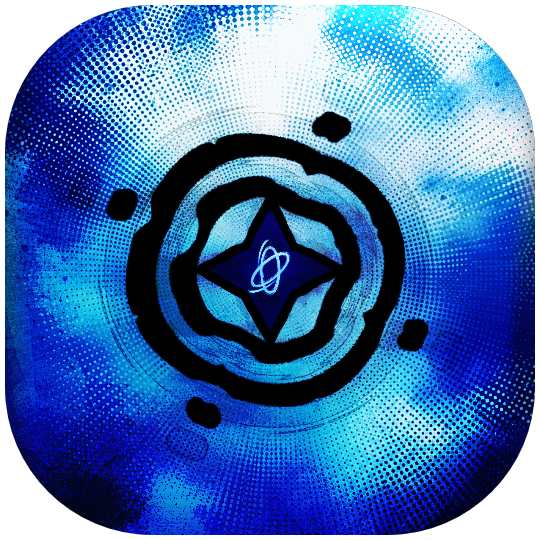

<p align="center">
  
</p>

<h1 align="center">✦ anxy's morphe patches</h1>

<p align="center">
  
  
  
  <a href="https://discord.gg/zpyTgS9Su"></a>
</p>

<br/>

> [!TIP]
> **One-Tap Morphe Import**: If you have **Morphe Manager** on your Android device, tap [**Add to Morphe Manager**](https://morphe.software/add-source?github=anxyis/anxy-patches) to automatically add this repository as a remote source!

<br/>

| App | Package | Patches |
|---|---|---|
| **Alight Motion** ◈ | `com.alightcreative.motion` | <ul><li>Premium Unlock (Complete Suite — 5.0.270)</li><li>PairIP License Bypass + Force-Update Suppression</li><li>Membership & Settings Gates Unlock</li><li>Device Capability Unlock (Max Res/Layers)</li><li>Encoder / Effect / Import Features Unlock</li><li>Effects Content Bundle (353 effects + thumbnails)</li><li>Dev Settings Extras + Home Declutter</li></ul> |

<br/>

◈ _Strict target version requirements (e.g. `5.0.273.1028426`, `5.0.273`, `5.0.270.1002578`)._\
⚙ _Includes native AArch64 code modifications targeting `arm64-v8a` CPUs._

<br/>

---

## FAQ ✦

#### How do I use this with Morphe Manager?
1. Open [**this link**](https://morphe.software/add-source?github=anxyis/anxy-patches) on your phone, or add `anxyis/anxy-patches` manually under **Morphe Manager** &rarr; **Settings** &rarr; **Sources**.
2. Pick your base APK (e.g. Alight Motion `5.0.270`).
3. Select your patches and hit **Patch**!

> [!NOTE]
> **Where to get the clean 5.0.270 APK:** grab **version `5.0.270.1002578`** directly from [APKMirror's Alight Motion uploads](https://www.apkmirror.com/uploads?appcategory=alight-motion-video-and-animation-editor) (not the latest one).

#### What does the Alight Motion suite actually do?
Unlocks the full pro feature set cleanly on `5.0.270.1002578` without needing sketchy pre-modded APKs:
- **Pro / Membership gates** — all pro-only UI, tools, and export toggles.
- **PairIP license bypass** — kills license checks, paywalls, and force-update screens.
- **Device capability unlock** — max export resolution and layer limits.
- **Encoder / effect / import features** — previously locked codecs and tools.
- **Effects content bundle** — 353 extra effect XMLs + thumbnails + banner.
- **Dev settings + cleaner home** — extra dev toggles, drops the tutorial clutter.

#### Will more apps be added?
Yeah! The repo is set up modularly so more apps can be added as patches get made.

#### What's in the works next? (o゜▽゜)o☆
- **Newer versions:** bringing the full unlock suite to newer base releases like `5.0.273+`.
- **Self-contained .zip project import / export:** normal XML exports kind of suck because they strip out all your media (music, video clips, images), while cloud project links force you into subscription accounts. Looking into building a custom .zip import/export patch so you can bundle the project XML and all media assets together into one portable file. That way you can share full projects anywhere (Google Drive, Telegram, local storage) without touching Alight's cloud infrastructure.

---

## Development & Local Builds

```bash
# Build the patch bundle (.mpp)
./gradlew :patches:build

# Run automated JUnit 5 regression tests
./gradlew test

# Generate patch metadata list
./gradlew generatePatchesList
```

---

## License

This project is licensed under the GNU General Public License v3.0 (GPL-3.0). See [LICENSE](LICENSE) for details.

---

## Credits

**Alight Motion extra effects** — effect XMLs and thumbnails bundled with these patches are credited to **Toji Motion** and **Tanryu**. All unlock behavior is original work; only the bonus effect content carries their credit.
