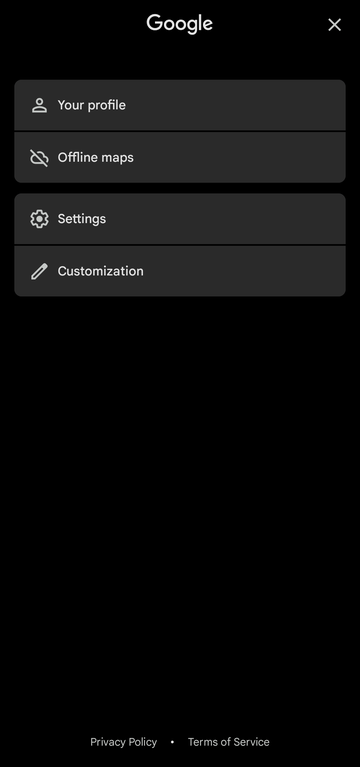
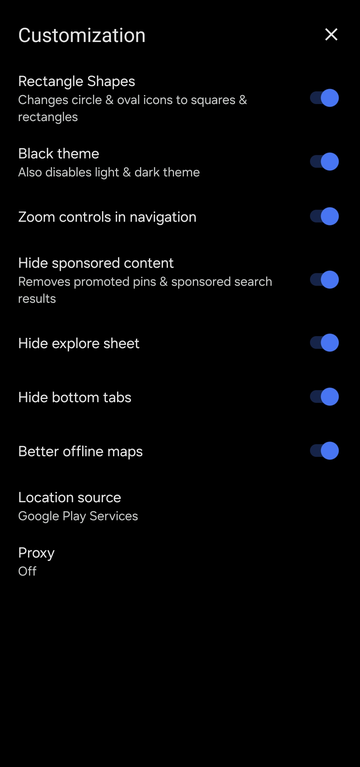
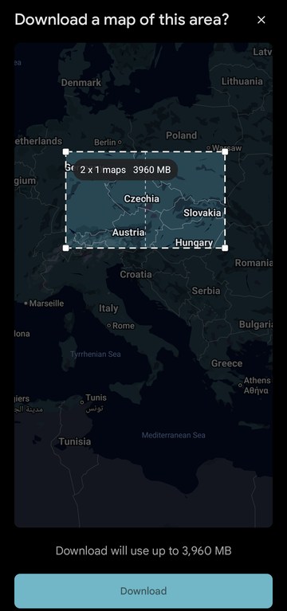
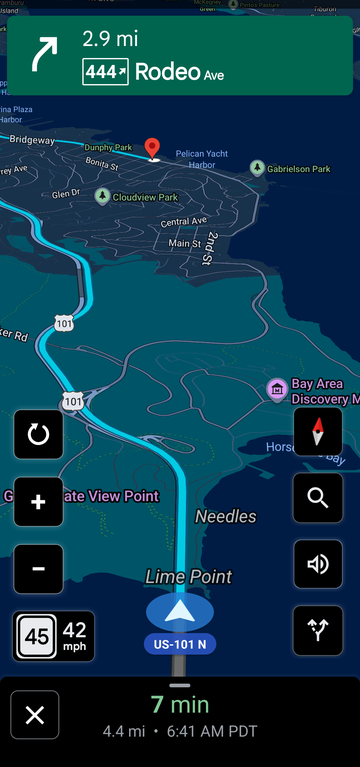
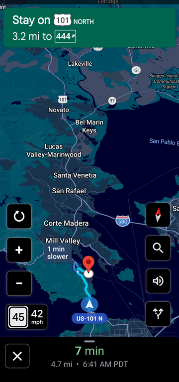

<h1> bearinmind patches</h1>

I'll continue to support patches for apps I use & apps that I get requests for (either for specific features or premium unlocking). Below is a short description of how to install my patches on morphe!

Install Morphe Manager if you have not yet: https://morphe.software

[Click here to add bearinmind patches to Morphe Manager](https://morphe.software/add-source?github=bearinmindcat/morphe-patches)

Select the app you want to patch inside Morphe Manager, follow all instructions shown.

## Patches

<!-- PATCHES_START -->
> **[v1.0.5](https://github.com/bearinmindcat/morphe-patches/releases/tag/v1.0.5)**&nbsp;&nbsp;•&nbsp;&nbsp;`main`&nbsp;&nbsp;•&nbsp;&nbsp;27 patches total

 Google Maps&nbsp;&nbsp;-&gt;&nbsp;&nbsp; Ungoogled Maps&nbsp;&nbsp;•&nbsp;&nbsp;27 patches

 

**Supported version(s):** 26.36.04.973607363

| Patch | Description | Options |
|----------|----------------|-----------|
| [Better offline maps](#better-offline-maps) | Reworks the offline area picker: zooming out really selects more instead of being shrunk to Google's size cap, the box can be resized by dragging its edges and corners, a large area is split into several downloads whose true total size is shown, and areas already downloaded are drawn on the map. Can be turned off on the Customization screen. |  |
| [Black theme](#black-theme) | AMOLED-black theme. Pins Maps' own dark mode and its separate navigation colour scheme, and remaps colour resources, drawable fills and draw-time paints so no surface is left grey. |  |
| [Blue pin](#blue-pin) | Chromium-coloured flat map pin on every in-app product logo and the search bar's leading icon. |  |
| [Bypass Play Services checks](#bypass-play-services-checks) | Makes Maps' bundled Play services signature and availability checks always pass, so it runs re-signed and with Play services disabled or absent. |  |
| [Change app name](#change-app-name) | Sets the launcher and in-app app name. | • App name |
| [Change package name](#change-package-name) | Installs alongside stock Google Maps under its own package name. On by default, because stock Maps comes built into most phones and cannot be replaced by a patched copy. | • Package name |
| [Customization screen](#customization-screen) | Adds a Customization row under Settings on the account sheet, with switches for the patches here that can be turned back off inside the app. Also applies Trim account menu, whose freed row builder it takes over. |  |
| [Hide ads](#hide-ads) | Hides promoted map pins and "Sponsored" search result rows. |  |
| [Hide explore feed](#hide-explore-feed) | Hides the home tab's Explore feed sheet ("Local vibe"). Can be switched back on on the Customization screen. |  |
| [Hide login promo](#hide-login-promo) | Hides the full-screen "Make it your map" page shown on first launch. |  |
| [Hide navigation tabs](#hide-navigation-tabs) | Hides the Explore / Contribute / You strip at the bottom of the home screen. Can be switched back on on the Customization screen. |  |
| [Hide section title](#hide-section-title) | Removes the "More from this app" label from the account sheet. |  |
| [Hide sign-in button](#hide-sign-in-button) | Removes the "Sign in" pill from the account sheet. |  |
| [Keep account sheet open](#keep-account-sheet-open) | Returning from Settings or Customization, or tapping "Your profile", leaves the account sheet open instead of dropping back to the map. |  |
| [Legacy icon](#legacy-icon) | Uses the flat multicolour pin Maps had before the 2025 gradient icon as the launcher icon. |  |
| [Location provider toggle](#location-provider-toggle) | Adds a Location source choice to the Customization screen: Android's own location providers, or Google Play services' fused provider. With Android, Play services is never asked for a location. Play services is never used while it is missing or disabled, so location keeps working on phones without it. | • Default to Play services location |
| [Network location fallback](#network-location-fallback) | Keeps the network (Wi-Fi/cell) location provider registered when no fused location provider answers, instead of GPS-only, so a fix does not go stale indoors. |  |
| [Proxy](#proxy) | Adds a Proxy screen to Customization that sends Maps' own traffic, map data included, through an HTTP proxy -- for example Orbot's (127.0.0.1:8118) to use Tor. Map data never falls back to a direct connection: if the proxy stops, Maps stops loading. Needs a recent Play services network engine (Cronet); Maps warns when it cannot take the proxy. |  |
| [Rectangle shapes](#rectangle-shapes) | Squares off rounded corners across the UI, including the two round navigation buttons. |  |
| [Remove permissions](#remove-permissions) | Removes permissions that only serve Google-account features or Google's data collection: background location, physical activity, contacts, microphone (voice search stops working), camera (Lens and Live View stop working), car speed, advertising ID, push messages and Google services settings. |  |
| [Remove sign-in promo](#remove-sign-in-promo) | Removes the "Tired of typing?" sign-in card from the search screen. |  |
| [Remove telemetry](#remove-telemetry) | Points the Firebase Installations and Play services compliance check-ins at an unresolvable host, stops every ad impression and click ping from being sent, and deregisters Google's logging, performance-monitoring, survey and Location History libraries and the on-device federated-learning services. |  |
| [Restore map data](#restore-map-data) | Lets a re-signed Maps load tiles, search and routing, by sending Google's own package and certificate in the identity headers the Maps backend checks, and by degrading instead of crashing when Play services rejects the re-signed app -- including skipping a view property that fails for that reason instead of crashing the screen. |  |
| [Sign-in toast](#sign-in-toast) | The "Sign in" pill shows a "Can't sign in" toast instead of failing silently. |  |
| [Trim account menu](#trim-account-menu) | Removes Your Timeline, Location sharing, Your data in Maps and Help & feedback from the account sheet. |  |
| [Your profile toast](#your-profile-toast) | Tapping "Your profile" shows a "Can't sign in" toast instead of opening nothing. |  |
| [Zoom controls in navigation](#zoom-controls-in-navigation) | Adds +, − and reset tiles during turn-by-turn that change the navigation zoom while the camera keeps following the car. |  |

<!-- PATCHES_END -->

## Building

To build bearinmind patches, follow the [Morphe documentation](https://github.com/MorpheApp/morphe-documentation).

## Want more patches & features?

Open up an issue request and I'll do my best to fulfil your feature ideas for any specific apps you ask for, I enjoy working on random things so just ask!

## Misc info for myself
Always use Semantic commit (https://kapeli.com/cheat_sheets/Semantic_Commits.docset/Contents/Resources/Documents/index) messages. 
To keep it simple use only 3 commit message types:
feat: / fix: / chore:
Commits of fix: and feat: will automatically generate new pre-releases and chore: will not create a new release.

feat:/fix: make pre-releases on dev, and stable releases on main.

