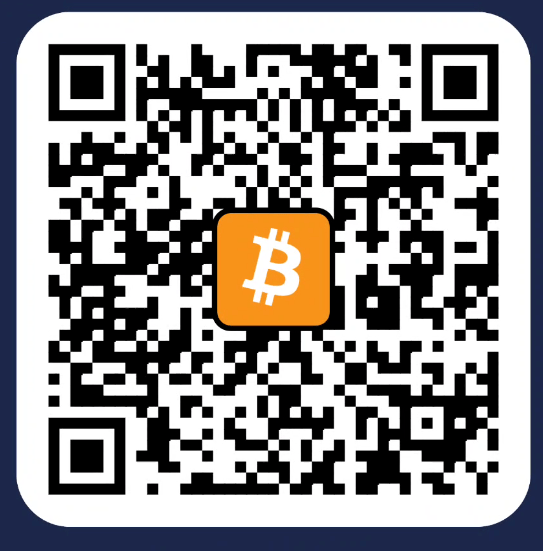
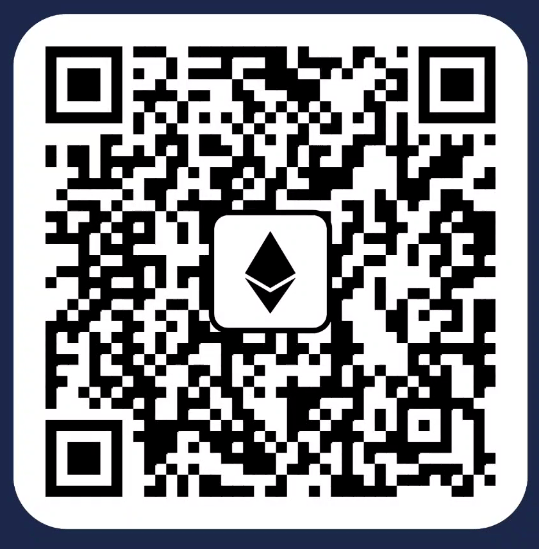

# Monero

Address: `monero:87MtvmLqAA4i5bsX6uvsKnXR1N4cvBwZQ6dr6ejqZEU7HT872cyKa6ZeaxZDnuDjCjNTXPpgVFgTzgTJAMaAeHjL36DuR5g`

# Bitcoin

Address: `bitcoin:bc1qd3u3wwg2lmwv677u5vm933lu894ugwk9aj6zmh?`

# Ethereum

Address: `ethereum:0x239973449eDDeeB8859A0758BA60EF9112da4652`

