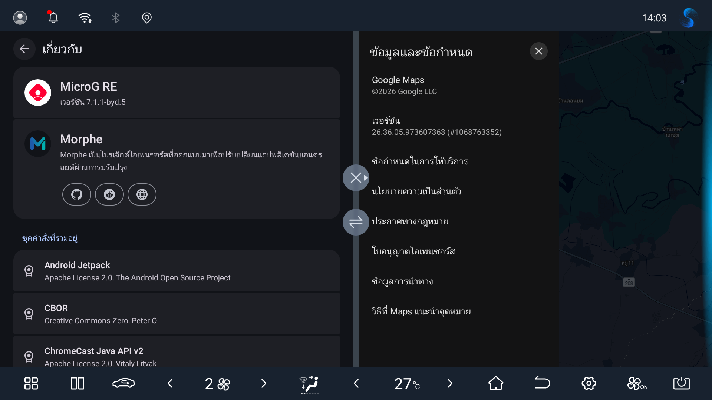

# Google Maps for MicroG-RE-BYD

Patch Google Maps with [Morphe Desktop](https://github.com/MorpheApp/morphe-desktop) to use it with [MicroG-RE-BYD](https://github.com/fangkampanat/MicroG-RE-BYD/releases/latest). Starting with 1.1.0, MicroG-RE-BYD is the only supported provider.

MicroG-RE-BYD improves sign-in and location support on BYD head units. It also works on Android phones with official Google Play services installed.

This repository provides `.mpp` patch bundles. You need your own Google Maps APK.

Google Maps 26.36.05 and MicroG-RE-BYD 7.1.1-byd.5 on a BYD Dolphin.

## Patches list

<!-- PATCHES_START EXPANDED -->
> **[v1.2.0](https://github.com/fangkampanat/gmaps-patches/releases/tag/v1.2.0)**&nbsp;&nbsp;•&nbsp;&nbsp;`main`&nbsp;&nbsp;•&nbsp;&nbsp;1 patch total

📦 Google Maps Morphe&nbsp;&nbsp;•&nbsp;&nbsp;1 patch

 

**🎯 Supported versions:**

| Any version |
| :---: |

| 💊&nbsp;Patch | 📜&nbsp;Description | ⚙️&nbsp;Options |
|----------|----------------|-----------|
| [Google Maps for MicroG-RE-BYD](#google-maps-for-microg-re-byd) | Connects supported Google Maps builds to MicroG-RE-BYD, with BYD navigation audio and compatibility with devices that also have official Google Play services. |  |

<!-- PATCHES_END -->

## Requirements

- A computer with Java 21 or newer
- The latest [Morphe Desktop](https://github.com/MorpheApp/morphe-desktop/releases/latest)
- A clean Google Maps APK for Android 9 or newer

The patch accepts any Google Maps version. It stops if required hooks cannot be identified safely. Compatibility with every Maps release is not guaranteed; the recorded runtime results below apply only to the listed versions and bundles.

## Tested devices and apps

Tests used Maps `26.36.05.973607363` and MicroG-RE-BYD `7.1.1-byd.5`. The phone passed with the final `1.2.0` bundle. BYD results remain from the earlier `1.0.13` bundle.

| Device | Results |
|---|---|
| BYD Dolphin, DiLink 3.0 / Android 10 | Navigation and Maps use after vehicle restart passed user testing. |
| Android phone with official Google Play services | Fresh installation, sign-in, online maps and real-GPS navigation passed. Reinstalling the same APK preserved the account and app state. |

Generic patch regression checks also covered Maps `26.29.02.946673643`, `26.35.04.969485213` and `26.37.05.977222275` beta. The local `1.1.2` bundle passed runtime tests on 26.29 and 26.37; 26.35 has static verification only. Release `1.2.0` retains the same patch and extension code.

The tester also reported that existing Morphe-patched YouTube Music and YouTube apps work normally with MicroG-RE-BYD.

One microG account-capability lookup logged `UNREGISTERED_ON_API_CONSOLE` during phone testing. The user confirmed that sign-in, online maps and GPS navigation worked. Timeline recording and backup have not been tested.

## Install MicroG-RE-BYD

For gmaps-patches 1.1.0 and newer, replace ReVanced GmsCore or upstream MicroG-RE with MicroG-RE-BYD. Older patch releases retain their original requirements.

1. Download the signed `arm64-v8a` APK from the [latest MicroG-RE-BYD release](https://github.com/fangkampanat/MicroG-RE-BYD/releases/latest).
2. If Android rejects an update from another provider because the signing key differs, uninstall that provider first. This removes its accounts and settings, so you will need to sign in again. **Keep official Google Play services installed.**
3. Install MicroG-RE-BYD, grant the requested permissions and allow it to run in the background.
4. Sign in and check Maps and your Morphe media apps. Compatible existing YouTube and YouTube Music APKs do not need to be patched again just to switch providers.

## Add the patch source

1. Open Morphe Desktop.
2. Click the patch source button at the top center of the window. It shows the current source name and Stable bundle version.
3. Click **Add Source** and select **Remote**.
4. Enter:

   | Field | Value |
   |---|---|
   | Name | `Google Maps for MicroG-RE-BYD` |
   | Repository URL | `https://github.com/fangkampanat/gmaps-patches` |

5. Click **Add**.
6. In **Patch Sources**, select the circle on the right side of this source to make it the active source.
7. Click **Done** and confirm the source name and Stable bundle version appear at the top center of the Home screen.

## Patch Google Maps

1. Confirm this repository's name and Stable bundle version appear at the top center of the Home screen.
2. Drop a clean, supported Google Maps APK onto **Drop APK here**, or click that area to browse for the file.
3. After the APK loads, confirm the screen shows **Google Maps Morphe** and **PATCHES 1 enabled**.
4. Click **PATCH WITH DEFAULTS**.
5. When patching finishes, install the resulting APK on the target device.

From bundle 1.2.0, Morphe Desktop uses `Google Maps Morphe` as the app name in its patching interface and output filenames, such as `Google-Maps-Morphe-26.36.05.973607363-patches-1.2.0.apk`. The installed app name is unchanged.

## Troubleshooting

### `VerifyException` at Rebuilding APK (Windows)

Some Windows date settings cause Java to write an invalid ZIP timestamp. If rebuilding fails with `com.google.common.base.VerifyException`:

1. Download [`_Start-Morphe.cmd`](./_Start-Morphe.cmd).
2. Put the script in the same folder as `morphe-desktop-*-all.jar`.
3. Double-click the script and patch the APK again.

The script finds the Morphe Desktop JAR automatically and applies the `en-US` locale only to that process. It does not change the Windows system locale.

## Credits

- [Morphe](https://github.com/MorpheApp) for Morphe Desktop, patching tools, and the upstream patch code this project builds upon.
- [Harvey843](https://github.com/Harvey843) for the generic Maps hook lookup introduced in [PR #7](https://github.com/fangkampanat/gmaps-patches/pull/7).

## Notes

- A `.mpp` file is a patch bundle, not an installable APK.
- The patched app uses package name `app.morphe.android.apps.maps`.
- The project is unofficial and is not supported or endorsed by Google, BYD, ReVanced, or Morphe.
- Source code is licensed under [GPL-3.0](LICENSE). Preserve [NOTICE](NOTICE) in source and derivative distributions.
