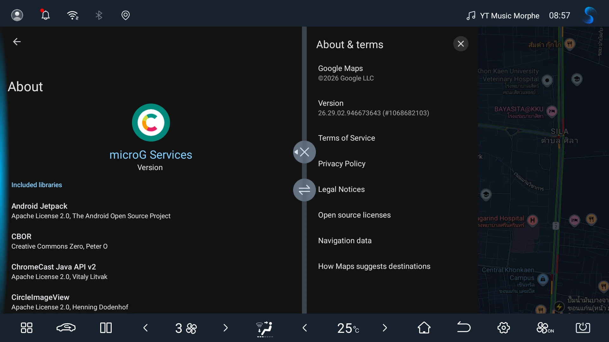

# Google Maps for ReVanced GmsCore

An unofficial `.mpp` patch source for using supported Google Maps APKs with [ReVanced GmsCore](https://github.com/ReVanced/GmsCore) (`app.revanced.android.gms`) through [Morphe Desktop](https://github.com/MorpheApp/morphe-desktop).

This repository does not distribute Google Maps APKs, whether original or patched.

## 🩹 Patches list

<!-- PATCHES_START EXPANDED -->
> **[v1.0.11](https://github.com/fangkampanat/gmaps-patches/releases/tag/v1.0.11)**&nbsp;&nbsp;•&nbsp;&nbsp;`main`&nbsp;&nbsp;•&nbsp;&nbsp;1 patch total

📦 Google Maps&nbsp;&nbsp;•&nbsp;&nbsp;1 patch

 

**🎯 Supported versions:**

| 26.32.06.958047303 | 26.33.02.961351034 |
| :---: | :---: |

| 💊&nbsp;Patch | 📜&nbsp;Description | ⚙️&nbsp;Options |
|----------|----------------|-----------|
| [Google Maps for ReVanced GmsCore](#google-maps-for-revanced-gmscore) | Routes supported Google Maps builds through ReVanced GmsCore using the patched Maps package and known Google Maps certificate spoof metadata. |  |

<!-- PATCHES_END -->

## Requirements

- A computer with Java 21 or newer (Google Maps is too large for practical patching on a phone or tablet)
- The latest [Morphe Desktop](https://github.com/MorpheApp/morphe-desktop/releases/latest)
- A clean Google Maps APK matching a version listed in the Patches list

## GmsCore setup and tested configurations

The patched APK requires ReVanced GmsCore for Google sign-in and related Google services. Use the configuration that matches the target device:

| Target device | GmsCore configuration | Validation |
|---|---|---|
| Official Google Play services installed | **User** variant of [ReVanced GmsCore v0.3.13.3.250932](https://github.com/ReVanced/GmsCore/releases/tag/v0.3.13.3.250932) (prerelease) | Tested on an Android tablet. This version includes [improvements for side-by-side installation](https://github.com/ReVanced/GmsCore/commit/776a8fb) with official Google services. |
| No official GMS | [ReVanced GmsCore v0.3.13.2.250932](https://github.com/ReVanced/GmsCore/releases/tag/v0.3.13.2.250932) | Tested on a BYD vehicle head unit. |

### Running on a BYD head unit

> **BYD DiLink3.0:** Use ReVanced GmsCore `v0.3.13.2.250932`. Do not install `v0.3.13.3.250932-user`; BYD blocks its background services and Maps appears signed out. Profile photos may show an initial with `v0.3.13.2`.

> **Not supported:** [Morphe MicroG-RE](https://github.com/MorpheApp/MicroG-RE) `v6.1.4` was tested but did not work with this patched APK. Google account token refresh failed with `INVALID_APPID`, leaving Maps offline.

Other GmsCore versions may work on non-BYD devices but have not been verified by this project.

## Add the patch source

The recommended workflow selects this repository as the active source before patching Google Maps. This keeps patches from other sources out of the Google Maps patch session.

1. Open Morphe Desktop.
2. Click the patch source button at the top center of the window. It shows the current source name and Stable bundle version.
3. Click **Add Source** and select **Remote**.
4. Enter:

   | Field | Value |
   |---|---|
   | Name | `Google Maps for ReVanced GmsCore` |
   | Repository URL | `https://github.com/fangkampanat/gmaps-patches` |

5. Click **Add**.
6. In **Patch Sources**, select the circle on the right side of this source to make it the active source.
7. Click **Done** and confirm the source name and Stable bundle version appear at the top center of the Home screen.

Only tested Stable bundles are published by this repository.

## Patch Google Maps

1. Confirm this repository's name and Stable bundle version appear at the top center of the Home screen.
2. Drop a clean, supported Google Maps APK onto **Drop APK here**, or click that area to browse for the file.
3. After the APK loads, confirm the screen shows **Google Maps** and **PATCHES 1 enabled**.
4. Click **PATCH WITH DEFAULTS**.
5. When patching finishes, install the resulting APK on the target device.

To patch an app from another source later, click the patch source button at the top center and select that source using the circle on the right. The other source does not need to be removed.

## Troubleshooting

### `VerifyException` at Rebuilding APK (Windows)

Cause: With some Windows locales, Java uses a Buddhist-calendar year that exceeds the ZIP timestamp range during rebuilding.

If Morphe Desktop fails with `com.google.common.base.VerifyException`:

1. Download [`_Start-Morphe.cmd`](./_Start-Morphe.cmd).
2. Put the script in the same folder as `morphe-desktop-*-all.jar`.
3. Double-click the script and patch the APK again.

The script finds the Morphe Desktop JAR automatically and applies the `en-US` locale only to that process. It does not change the Windows system locale.

## Credits

- [Morphe](https://github.com/MorpheApp) for Morphe Desktop, patching tools, and the upstream patch code this project builds upon.
- [ReVanced](https://github.com/ReVanced) for the original GmsCore support implementation and ReVanced GmsCore.

## Notes

- A `.mpp` file is a patch bundle, not an installable APK.
- The patched app uses package name `app.morphe.android.apps.maps`.
- The patch preserves Google Maps' original picture-in-picture declaration.
- The project is unofficial and is not supported or endorsed by Google, BYD, ReVanced, or Morphe.
- Source code is licensed under [GPL-3.0](LICENSE). Preserve [NOTICE](NOTICE) in source and derivative distributions.
