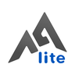

<div align="center">

# 🧩 hxreborn’s patches

**A collection of Android app patches for [Morphe](https://morphe.software).**

[](https://github.com/hxreborn/morphe-patches/releases/latest)
[](https://github.com/hxreborn/morphe-patches/releases/latest)
[](https://github.com/hxreborn/morphe-patches/releases/latest)
[](#-patches-list)

[](https://github.com/hxreborn/morphe-patches/actions/workflows/release.yml)
[](LICENSE)

<a href="https://morphe.software/add-source?github=hxreborn/morphe-patches" title="Add this source to Morphe">
  
</a>

</div>

&nbsp;
## ❓ About

I also accept [requests for other apps](https://github.com/hxreborn/morphe-patches/issues/new?template=app_request.yml).

Based on prior work by [ReVanced](https://github.com/ReVanced). Changes and their dates are
recorded in the Git history.

App icons in the patches list belong to their respective developers and are used only to
identify each app. They are not covered by this repository's licence. See
[the icon notice](.github/assets/icons/README.md).

&nbsp;
## 🩹 Patches list

<!-- PATCHES_START EXPANDED -->
> **[v1.28.0](https://github.com/hxreborn/morphe-patches/releases/tag/v1.28.0)**&nbsp;&nbsp;•&nbsp;&nbsp;`main`&nbsp;&nbsp;•&nbsp;&nbsp;63 patches total
<details open>
<summary>&nbsp;&nbsp;Cx File Explorer&nbsp;&nbsp;•&nbsp;&nbsp;3 patches</summary>
<br>

**🎯 Supported versions:**

| 2.7.8 |
| :---: |

| 💊&nbsp;Patch | 📜&nbsp;Description |
|----------|----------------|
| <a id="cx-file-explorer-amoled-dark-theme"></a>[AMOLED dark theme](patches/src/main/kotlin/app/morphe/patches/cx/misc/theme/AmoledThemePatch.kt) | Adds a pure black option to the dark theme. |
| <a id="cx-file-explorer-dark-theme"></a>[Dark theme](patches/src/main/kotlin/app/morphe/patches/cx/misc/theme/DarkThemePatch.kt) | Renders the app's dark theme and adds it to the settings. |
| <a id="cx-file-explorer-unlock-premium"></a>[Unlock premium](patches/src/main/kotlin/app/morphe/patches/cx/misc/premium/UnlockPremiumPatch.kt) | Unlocks premium and removes ads. |

</details>

<details open>
<summary>&nbsp;&nbsp;Kick&nbsp;&nbsp;•&nbsp;&nbsp;1 patch</summary>
<br>

**🎯 Supported versions:**

| Any version |
| :---: |

| 💊&nbsp;Patch | 📜&nbsp;Description |
|----------|----------------|
| <a id="kick-amoled-dark-theme"></a>[AMOLED dark theme](patches/src/main/kotlin/app/morphe/patches/kick/misc/theme/AmoledThemePatch.kt) | Replaces the dark theme background with pure black. Disables over-the-air updates that would restore the original background. |

</details>

<details open>
<summary>&nbsp;&nbsp;Perplexity&nbsp;&nbsp;•&nbsp;&nbsp;1 patch</summary>
<br>

**🎯 Supported versions:**

| 2.95.0 |
| :---: |

| 💊&nbsp;Patch | 📜&nbsp;Description |
|----------|----------------|
| <a id="perplexity-amoled-dark-theme"></a>[AMOLED dark theme](patches/src/main/kotlin/app/morphe/patches/perplexity/misc/theme/AmoledThemePatch.kt) | Replaces the dark theme background with pure black. |

</details>

<details open>
<summary>&nbsp;&nbsp;Proton Mail&nbsp;&nbsp;•&nbsp;&nbsp;7 patches</summary>
<br>

**🎯 Supported versions:**

| 7.11.5 | 7.10.4 |
| :---: | :---: |

| 💊&nbsp;Patch | 📜&nbsp;Description |
|----------|----------------|
| <a id="proton-mail-amoled-dark-theme"></a>[AMOLED dark theme](patches/src/main/kotlin/app/morphe/patches/protonmail/misc/theme/AmoledThemePatch.kt) | Replaces the dark theme background with pure black. |
| <a id="proton-mail-custom-accent-color"></a>[Custom accent color](patches/src/main/kotlin/app/morphe/patches/protonmail/misc/theme/AccentColorPatch.kt) | Changes the accent color. Choose a color in the patches menu. |
| <a id="proton-mail-hide-upgrade-promotions"></a>[Hide upgrade promotions](patches/src/main/kotlin/app/morphe/patches/protonmail/misc/upselling/HideUpgradePromotionsPatch.kt) | Hides the top-bar upgrade button, promotional sidebar rows and the auto-delete upgrade banner in Trash and Spam. Keeps the Empty trash and Empty spam buttons. |
| <a id="proton-mail-remove-sent-from-signature"></a>[Remove 'Sent from' signature](patches/src/main/kotlin/app/morphe/patches/protonmail/signature/RemoveSentFromSignaturePatch.kt) | Removes the 'Sent from Proton Mail' signature from emails. |
| <a id="proton-mail-remove-free-accounts-limit"></a>[Remove free accounts limit](patches/src/main/kotlin/app/morphe/patches/protonmail/account/RemoveFreeAccountsLimitPatch.kt) | Removes the limit for maximum free accounts logged in. |
| <a id="proton-mail-scheduled-trash-and-spam-deletion"></a>[Scheduled Trash and Spam deletion](patches/src/main/kotlin/app/morphe/patches/protonmail/misc/scheduleddeletion/ScheduledDeletionPatch.kt) | Deletes all messages in Trash and Spam on separate configurable schedules. Deleted messages cannot be recovered. |
| <a id="proton-mail-unlock-custom-time-picker"></a>[Unlock custom time picker](patches/src/main/kotlin/app/morphe/patches/protonmail/misc/scheduling/UnlockCustomTimePickerPatch.kt) | Enables picking a custom date and time when snoozing conversations and scheduling messages. |

</details>

<details open>
<summary>&nbsp;&nbsp;Proton Pass&nbsp;&nbsp;•&nbsp;&nbsp;3 patches</summary>
<br>

**🎯 Supported versions:**

| 1.40.3 |
| :---: |

| 💊&nbsp;Patch | 📜&nbsp;Description |
|----------|----------------|
| <a id="proton-pass-amoled-dark-theme"></a>[AMOLED dark theme](patches/src/main/kotlin/app/morphe/patches/protonpass/misc/theme/AmoledThemePatch.kt) | Replaces the dark theme background with pure black. |
| <a id="proton-pass-hide-promotional-messages"></a>[Hide promotional messages](patches/src/main/kotlin/app/morphe/patches/protonpass/misc/inappmessages/HidePromotionalMessagesPatch.kt) | Hides promotional banners, offers and pop-up messages. |
| <a id="proton-pass-hide-upgrade-promotions"></a>[Hide upgrade promotions](patches/src/main/kotlin/app/morphe/patches/protonpass/misc/upselling/HideUpgradePromotionsPatch.kt) | Hides the Upgrade buttons, upgrade prompts and the welcome offer after signing in. Plan limits still apply. |

</details>

<details open>
<summary>&nbsp;&nbsp;Realme Link&nbsp;&nbsp;•&nbsp;&nbsp;2 patches</summary>
<br>

**🎯 Supported versions:**

| 5.5.514.11421 |
| :---: |

| 💊&nbsp;Patch | 📜&nbsp;Description |
|----------|----------------|
| <a id="realme-link-amoled-dark-theme"></a>[AMOLED dark theme](patches/src/main/kotlin/app/morphe/patches/realmelink/theme/AmoledThemePatch.kt) | Replaces the light theme with a pure black dark theme. Requires Android 13 or later. |
| <a id="realme-link-bypass-session-expiry"></a>[Bypass session expiry](patches/src/main/kotlin/app/morphe/patches/realmelink/session/BypassSessionExpiryPatch.kt) | Stops the security prompt that signs the account out. |

</details>

<details open>
<summary>&nbsp;&nbsp;Showly&nbsp;&nbsp;•&nbsp;&nbsp;2 patches</summary>
<br>

**🎯 Supported versions:**

| 3.70.0 |
| :---: |

| 💊&nbsp;Patch | 📜&nbsp;Description |
|----------|----------------|
| <a id="showly-amoled-dark-theme"></a>[AMOLED dark theme](patches/src/main/kotlin/app/morphe/patches/showly/misc/theme/AmoledThemePatch.kt) | Replaces the dark theme background with pure black. |
| <a id="showly-unlock-premium"></a>[Unlock premium](patches/src/main/kotlin/app/morphe/patches/showly/misc/premium/UnlockPremiumPatch.kt) | Unlocks ad removal, light theme, custom images, list view types, quick ratings, and transparent widgets. The News feed is not included. |

</details>

<details open>
<summary>&nbsp;&nbsp;MovieBox&nbsp;&nbsp;•&nbsp;&nbsp;1 patch</summary>
<br>

**🎯 Supported versions:**

| 4.0.02.0828.03 | 4.0.02.0831.03 | 4.0.02.0903.02 | 4.0.03.0918.03 |
| :---: | :---: | :---: | :---: |

| 💊&nbsp;Patch | 📜&nbsp;Description |
|----------|----------------|
| <a id="moviebox-all-in-one"></a>[All-In-One](patches/src/main/kotlin/app/morphe/patches/moviebox/misc/allinone/AllInOnePatch.kt) | Enables video playback and downloads, removes ads and upsell prompts, bypasses the region block, and unlocks the hidden Laboratory menu. Requires Android 10 or later. |

</details>

<details open>
<summary>&nbsp;&nbsp;DWG FastView&nbsp;&nbsp;•&nbsp;&nbsp;3 patches</summary>
<br>

**🎯 Supported versions:**

| 5.19.4 | 5.19.6 | 5.20.0 | 5.21.0 |
| :---: | :---: | :---: | :---: |

| 💊&nbsp;Patch | 📜&nbsp;Description |
|----------|----------------|
| <a id="dwg-fastview-block-telemetry"></a>[Block telemetry](patches/src/main/kotlin/app/morphe/patches/gstarmc/misc/telemetry/BlockTelemetryPatch.kt) | Blocks the Umeng, ByteDance and ad network analytics endpoints. |
| <a id="dwg-fastview-hide-rating-dialog"></a>[Hide rating dialog](patches/src/main/kotlin/app/morphe/patches/gstarmc/misc/rating/HideRatingDialogPatch.kt) | Removes the prompt asking for a store review. |
| <a id="dwg-fastview-unlock-premium"></a>[Unlock premium](patches/src/main/kotlin/app/morphe/patches/gstarmc/misc/premium/UnlockPremiumPatch.kt) | Unlocks the paid drawing, annotation and measurement tools, and removes ads. |

</details>

<details open>
<summary>&nbsp;&nbsp;vpnify&nbsp;&nbsp;•&nbsp;&nbsp;2 patches</summary>
<br>

**🎯 Supported versions:**

| 2.2.9.9 | 2.3.0 |
| :---: | :---: |

| 💊&nbsp;Patch | 📜&nbsp;Description |
|----------|----------------|
| <a id="vpnify-disable-rating-prompt"></a>[Disable rating prompt](patches/src/main/kotlin/app/morphe/patches/vpnify/misc/review/DisableRatingPromptPatch.kt) | Stops the Google Play rating prompt from appearing. |
| <a id="vpnify-unlock-premium"></a>[Unlock premium](patches/src/main/kotlin/app/morphe/patches/vpnify/misc/premium/UnlockPremiumPatch.kt) | Unlocks premium, removes ads and the free session time limit. |

</details>

<details open>
<summary>&nbsp;&nbsp;RISE Sleep Tracker&nbsp;&nbsp;•&nbsp;&nbsp;3 patches</summary>
<br>

**🎯 Supported versions:**

| Android V1.78.49 | Android V1.78.47 |
| :---: | :---: |

| 💊&nbsp;Patch | 📜&nbsp;Description |
|----------|----------------|
| <a id="rise-sleep-tracker-disable-telemetry"></a>[Disable telemetry](patches/src/main/kotlin/app/morphe/patches/rise/misc/telemetry/DisableTelemetryPatch.kt) | Stops crash and error reports from reaching Sentry. |
| <a id="rise-sleep-tracker-disable-usage-tracking"></a>[Disable usage tracking](patches/src/main/kotlin/app/morphe/patches/rise/misc/telemetry/DisableUsageTrackingPatch.kt) | Stops app usage events from being uploaded. Local usage tracking remains enabled. |
| <a id="rise-sleep-tracker-unlock-premium"></a>[Unlock premium](patches/src/main/kotlin/app/morphe/patches/rise/misc/premium/UnlockPremiumPatch.kt) | Unlocks the energy schedule, habit tools, smart alarm and progress insights. Requires a RISE account. |

</details>

<details open>
<summary>&nbsp;&nbsp;MyMoveset&nbsp;&nbsp;•&nbsp;&nbsp;2 patches</summary>
<br>

**🎯 Supported versions:**

| 1.3.1 |
| :---: |

| 💊&nbsp;Patch | 📜&nbsp;Description |
|----------|----------------|
| <a id="mymoveset-disable-tracking"></a>[Disable tracking](patches/src/main/kotlin/app/morphe/patches/mymoveset/misc/tracking/DisableTrackingPatch.kt) | Stops the install identifier from reaching Expo and usage events from reaching Google. Disables OTA updates. |
| <a id="mymoveset-unlock-premium"></a>[Unlock premium](patches/src/main/kotlin/app/morphe/patches/mymoveset/misc/premium/UnlockPremiumPatch.kt) | Unlocks unlimited move views, goals and move cards, manual sync, earlier library updates and card customization. Disables OTA updates. |

</details>

<details open>
<summary>&nbsp;&nbsp;1Weather&nbsp;&nbsp;•&nbsp;&nbsp;4 patches</summary>
<br>

**🎯 Supported versions:**

| 13.1.0 | 12.9.3 |
| :---: | :---: |

| 💊&nbsp;Patch | 📜&nbsp;Description |
|----------|----------------|
| <a id="1weather-disable-tracking"></a>[Disable tracking](patches/src/main/kotlin/app/morphe/patches/oneweather/misc/telemetry/DisableTrackingPatch.kt) | Stops installs, sessions and in-app events from reaching AppsFlyer. |
| <a id="1weather-hide-shorts"></a>[Hide Shorts](patches/src/main/kotlin/app/morphe/patches/oneweather/misc/shorts/HideShortsPatch.kt) | Hides the 1Weather Shorts card from the Today screen. |
| <a id="1weather-hide-skyla"></a>[Hide Skyla](patches/src/main/kotlin/app/morphe/patches/oneweather/misc/skyla/HideSkylaPatch.kt) | Hides the Skyla AI assistant, its prompts and the Summarize buttons. |
| <a id="1weather-unlock-premium"></a>[Unlock premium](patches/src/main/kotlin/app/morphe/patches/oneweather/misc/premium/UnlockPremiumPatch.kt) | Unlocks premium and removes ads. |

</details>

<details open>
<summary>&nbsp;&nbsp;Projectivy Launcher&nbsp;&nbsp;•&nbsp;&nbsp;2 patches</summary>
<br>

**🎯 Supported versions:**

| 4.71 | 4.70 |
| :---: | :---: |

| 💊&nbsp;Patch | 📜&nbsp;Description |
|----------|----------------|
| <a id="projectivy-launcher-disable-tracking"></a>[Disable tracking](patches/src/main/kotlin/app/morphe/patches/projectivy/misc/tracking/DisableTrackingPatch.kt) | Disables analytics and crash reporting. |
| <a id="projectivy-launcher-unlock-premium"></a>[Unlock premium](patches/src/main/kotlin/app/morphe/patches/projectivy/misc/premium/UnlockPremiumPatch.kt) | Unlocks all premium features. |

</details>

<details open>
<summary>&nbsp;&nbsp;All-In-One Calculator&nbsp;&nbsp;•&nbsp;&nbsp;2 patches</summary>
<br>

**🎯 Supported versions:**

| 3.4.0 |
| :---: |

| 💊&nbsp;Patch | 📜&nbsp;Description |
|----------|----------------|
| <a id="all-in-one-calculator-gmscore-support"></a>[GmsCore support](patches/src/main/kotlin/app/morphe/patches/allinonecalculator/misc/gms/GmsCoreSupportPatch.kt) | Signs in through GmsCore instead of Google Play Services. Requires GmsCore to be installed. |
| <a id="all-in-one-calculator-unlock-premium"></a>[Unlock premium](patches/src/main/kotlin/app/morphe/patches/allinonecalculator/misc/premium/UnlockPremiumPatch.kt) | Grants the pro entitlement, which removes the ads and the paywalled tools. |

</details>

<details open>
<summary>&nbsp;&nbsp;Etsy&nbsp;&nbsp;•&nbsp;&nbsp;1 patch</summary>
<br>

**🎯 Supported versions:**

| 7.90.0 |
| :---: |

| 💊&nbsp;Patch | 📜&nbsp;Description |
|----------|----------------|
| <a id="etsy-hide-ads"></a>[Hide ads](patches/src/main/kotlin/app/morphe/patches/etsy/ads/HideAdsPatch.kt) | Removes promoted listings and the "with Ads" label from search results. |

</details>

<details open>
<summary>&nbsp;&nbsp;QR & Barcode Scanner&nbsp;&nbsp;•&nbsp;&nbsp;1 patch</summary>
<br>

**🎯 Supported versions:**

| 2.2.221 |
| :---: |

| 💊&nbsp;Patch | 📜&nbsp;Description |
|----------|----------------|
| <a id="qr-barcode-scanner-hide-ads"></a>[Hide ads](patches/src/main/kotlin/app/morphe/patches/gammascan/ads/HideAdsPatch.kt) | Disables banner, interstitial, and native ads. |

</details>

<details open>
<summary>&nbsp;&nbsp;Photo Editor Pro&nbsp;&nbsp;•&nbsp;&nbsp;5 patches</summary>
<br>

**🎯 Supported versions:**

| 1.791.265 |
| :---: |

| 💊&nbsp;Patch | 📜&nbsp;Description |
|----------|----------------|
| <a id="photo-editor-pro-hide-ads"></a>[Hide ads](patches/src/main/kotlin/app/morphe/patches/photoeditorpro/ads/HideAdsPatch.kt) | Adds an option to hide banner, interstitial, app-open and rewarded ads. |
| <a id="photo-editor-pro-inspect-ai-requests"></a>[Inspect AI requests](patches/src/main/kotlin/app/morphe/patches/photoeditorpro/diagnostics/TraceAiRequestsPatch.kt) | Shows the network calls an AI tool makes, such as HTTP requests and Firebase uploads, and keeps a log, so you can watch your photo fly to China or the US. |
| <a id="photo-editor-pro-show-ai-progress"></a>[Show AI progress](patches/src/main/kotlin/app/morphe/patches/photoeditorpro/aitools/ShowAiProgressPatch.kt) | Reads the current stage off the real network activity instead of the fake progress bar InShot ships. |
| <a id="photo-editor-pro-speed-up-ai-tools"></a>[Speed up AI tools](patches/src/main/kotlin/app/morphe/patches/photoeditorpro/aitools/SpeedUpAiToolsPatch.kt) | Shortens the AI tool wait by polling for the result more often and uploading the photo in larger chunks. |
| <a id="photo-editor-pro-unlock-premium"></a>[Unlock premium](patches/src/main/kotlin/app/morphe/patches/photoeditorpro/misc/premium/UnlockPremiumPatch.kt) | Adds an option to unlock the pro tools, remove the export watermark and hide the upgrade prompts. |

</details>

<details open>
<summary>&nbsp;&nbsp;Trainline&nbsp;&nbsp;•&nbsp;&nbsp;1 patch</summary>
<br>

**🎯 Supported versions:**

| 407.0.0.178994 |
| :---: |

| 💊&nbsp;Patch | 📜&nbsp;Description |
|----------|----------------|
| <a id="trainline-hide-ads"></a>[Hide ads](patches/src/main/kotlin/app/morphe/patches/trainline/ads/HideAdsPatch.kt) | Removes the adverts shown between search results. |

</details>

<details open>
<summary>&nbsp;&nbsp;Audible&nbsp;&nbsp;•&nbsp;&nbsp;2 patches</summary>
<br>

**🎯 Supported versions:**

| 26.30.05 |
| :---: |

| 💊&nbsp;Patch | 📜&nbsp;Description |
|----------|----------------|
| <a id="audible-hide-membership-upselling"></a>[Hide membership upselling](patches/src/main/kotlin/app/morphe/patches/audible/misc/upselling/HideMembershipUpsellingPatch.kt) | Hides the membership promotion on the Home screen and the free trial bottom sheet. |
| <a id="audible-open-library-on-launch"></a>[Open Library on launch](patches/src/main/kotlin/app/morphe/patches/audible/startup/OpenLibraryOnLaunchPatch.kt) | Opens the Library tab instead of Home on launch. Applies only while signed in. |

</details>

<details open>
<summary>&nbsp;&nbsp;ReadEra&nbsp;&nbsp;•&nbsp;&nbsp;1 patch</summary>
<br>

**🎯 Supported versions:**

| 26.05.20+2300 |
| :---: |

| 💊&nbsp;Patch | 📜&nbsp;Description |
|----------|----------------|
| <a id="readera-remove-nags"></a>[Remove nags](patches/src/main/kotlin/app/morphe/patches/readera/misc/nags/RemoveNagsPatch.kt) | Removes the rate this app dialog and the promotional dialogs shown on startup. |

</details>

<details open>
<summary>&nbsp;&nbsp;Ringtone Maker&nbsp;&nbsp;•&nbsp;&nbsp;2 patches</summary>
<br>

**🎯 Supported versions:**

| 1.01.99.0909 | 1.01.98.0831 | 1.01.98.0824 | 1.01.97.0818 | 1.01.96.0716 | 1.01.94.0602 | 1.01.90.0421 |
| :---: | :---: | :---: | :---: | :---: | :---: | :---: |

| 💊&nbsp;Patch | 📜&nbsp;Description |
|----------|----------------|
| <a id="ringtone-maker-remove-rating-prompts"></a>[Remove rating prompts](patches/src/main/kotlin/app/morphe/patches/ringtonemaker/misc/rate/RemoveRatingPromptsPatch.kt) | Removes the prompts asking for a rating. |
| <a id="ringtone-maker-unlock-premium"></a>[Unlock premium](patches/src/main/kotlin/app/morphe/patches/ringtonemaker/misc/premium/UnlockPremiumPatch.kt) | Unlocks premium, removes ads and skips the upgrade screens. |

</details>

<details open>
<summary>&nbsp;&nbsp;AlpineQuest&nbsp;&nbsp;•&nbsp;&nbsp;1 patch</summary>
<br>

**🎯 Supported versions:**

| 2.4.0e |
| :---: |

| 💊&nbsp;Patch | 📜&nbsp;Description |
|----------|----------------|
| <a id="alpinequest-unlock-full-version"></a>[Unlock full version](patches/src/main/kotlin/app/morphe/patches/alpinequest/misc/activation/UnlockFullVersionPatch.kt) | Unlocks the Off-Road Explorer features gated behind activation. |

</details>

<details open>
<summary>&nbsp;&nbsp;AtloMaps&nbsp;&nbsp;•&nbsp;&nbsp;1 patch</summary>
<br>

**🎯 Supported versions:**

| 1.0.6 |
| :---: |

| 💊&nbsp;Patch | 📜&nbsp;Description |
|----------|----------------|
| <a id="atlomaps-unlock-premium"></a>[Unlock premium](patches/src/main/kotlin/app/morphe/patches/atlomaps/misc/premium/UnlockPremiumPatch.kt) | Unlocks the custom map sources, navigation settings and backup restore. Premium map packages are not included. |

</details>

<details open>
<summary>&nbsp;&nbsp;atvTools&nbsp;&nbsp;•&nbsp;&nbsp;1 patch</summary>
<br>

**🎯 Supported versions:**

| 1.3.2 |
| :---: |

| 💊&nbsp;Patch | 📜&nbsp;Description |
|----------|----------------|
| <a id="atvtools-unlock-premium"></a>[Unlock premium](patches/src/main/kotlin/app/morphe/patches/atvtools/misc/premium/UnlockPremiumPatch.kt) | Unlocks all features and removes the ads. |

</details>

<details open>
<summary>&nbsp;&nbsp;BetterSleep&nbsp;&nbsp;•&nbsp;&nbsp;1 patch</summary>
<br>

**🎯 Supported versions:**

| 26.15 |
| :---: |

| 💊&nbsp;Patch | 📜&nbsp;Description |
|----------|----------------|
| <a id="bettersleep-unlock-premium"></a>[Unlock premium](patches/src/main/kotlin/app/morphe/patches/bettersleep/misc/premium/UnlockPremiumPatch.kt) | Unlocks all premium content and skips the free trial screen. |

</details>

<details open>
<summary>&nbsp;&nbsp;ForusApp&nbsp;&nbsp;•&nbsp;&nbsp;1 patch</summary>
<br>

**🎯 Supported versions:**

| 3.0.15 |
| :---: |

| 💊&nbsp;Patch | 📜&nbsp;Description |
|----------|----------------|
| <a id="forusapp-unlock-premium"></a>[Unlock premium](patches/src/main/kotlin/app/morphe/patches/forus/misc/premium/UnlockPremiumPatch.kt) | Unlocks all premium features. |

</details>

<details open>
<summary>&nbsp;&nbsp;Klassik Radio+&nbsp;&nbsp;•&nbsp;&nbsp;1 patch</summary>
<br>

**🎯 Supported versions:**

| p5.11.1 |
| :---: |

| 💊&nbsp;Patch | 📜&nbsp;Description |
|----------|----------------|
| <a id="klassik-radio-unlock-premium"></a>[Unlock premium](patches/src/main/kotlin/app/morphe/patches/klassikradio/misc/premium/UnlockPremiumPatch.kt) | Unlocks the premium music channels, on-demand playback and track skipping. Requires a signed-in account. |

</details>

<details open>
<summary>&nbsp;&nbsp;Quranify&nbsp;&nbsp;•&nbsp;&nbsp;1 patch</summary>
<br>

**🎯 Supported versions:**

| 2.2.8 |
| :---: |

| 💊&nbsp;Patch | 📜&nbsp;Description |
|----------|----------------|
| <a id="quranify-unlock-premium"></a>[Unlock premium](patches/src/main/kotlin/app/morphe/patches/quranify/misc/premium/UnlockPremiumPatch.kt) | Unlocks downloading every surah, lyrics and tafsir, Android Auto, background playback controls, and insights. |

</details>

<details open>
<summary>&nbsp;&nbsp;RateGlance&nbsp;&nbsp;•&nbsp;&nbsp;1 patch</summary>
<br>

**🎯 Supported versions:**

| 1.14.8 |
| :---: |

| 💊&nbsp;Patch | 📜&nbsp;Description |
|----------|----------------|
| <a id="rateglance-unlock-premium"></a>[Unlock premium](patches/src/main/kotlin/app/morphe/patches/rateglance/misc/premium/UnlockPremiumPatch.kt) | Unlocks all premium features. |

</details>

<details open>
<summary>&nbsp;&nbsp;Rubber Bands&nbsp;&nbsp;•&nbsp;&nbsp;1 patch</summary>
<br>

**🎯 Supported versions:**

| 3.9 |
| :---: |

| 💊&nbsp;Patch | 📜&nbsp;Description |
|----------|----------------|
| <a id="rubber-bands-unlock-premium"></a>[Unlock premium](patches/src/main/kotlin/app/morphe/patches/rubberbands/misc/premium/UnlockPremiumPatch.kt) | Unlocks running and logging workouts, progress tracking and personal records (AI workout generation is not included). |

</details>

<details open>
<summary>&nbsp;&nbsp;Symfonium&nbsp;&nbsp;•&nbsp;&nbsp;1 patch</summary>
<br>

**🎯 Supported versions:**

| 14.0.0 | 14.1.0 | 15.0.1 | 14.0.0 TV |
| :---: | :---: | :---: | :---: |

| 💊&nbsp;Patch | 📜&nbsp;Description |
|----------|----------------|
| <a id="symfonium-unlock-premium"></a>[Unlock premium](patches/src/main/kotlin/app/morphe/patches/symfonium/misc/premium/UnlockPremiumPatch.kt) | Unlocks all premium features. |

</details>

<details open>
<summary>&nbsp;&nbsp;VPN Super Unlimited Proxy&nbsp;&nbsp;•&nbsp;&nbsp;1 patch</summary>
<br>

**🎯 Supported versions:**

| 2.32.0 |
| :---: |

| 💊&nbsp;Patch | 📜&nbsp;Description |
|----------|----------------|
| <a id="vpn-super-unlimited-proxy-unlock-premium"></a>[Unlock premium](patches/src/main/kotlin/app/morphe/patches/vpnsuper/premium/UnlockPremiumPatch.kt) | Unlocks premium servers and removes ads, upgrade banners, the launch paywall and the Android TV sign-in screen. |

</details>

<details open>
<summary>&nbsp;&nbsp;Notesnook&nbsp;&nbsp;•&nbsp;&nbsp;1 patch</summary>
<br>

**🎯 Supported versions:**

| 3.4.12 |
| :---: |

| 💊&nbsp;Patch | 📜&nbsp;Description |
|----------|----------------|
| <a id="notesnook-unlock-pro"></a>[Unlock pro](patches/src/main/kotlin/app/morphe/patches/notesnook/misc/premium/UnlockProPatch.kt) | Unlocks task lists, callouts, app lock, and the notebook, tag, colour and reminder limits. Requires a signed-in account. The server still enforces storage, attachment size, monographs and SMS 2FA. |

</details>

<details open>
<summary>&nbsp;&nbsp;TikTok&nbsp;&nbsp;•&nbsp;&nbsp;separate bundle</summary>
<br>

**🎯 Supported versions:**

| 46.2.3 |
| :---: |

| 📦&nbsp;Bundle | 📜&nbsp;Description |
|----------|----------------|
| [hxreborn-tiktok-patches](https://github.com/hxreborn/hxreborn-tiktok-patches) | Not part of this bundle, so it has to be added to Morphe as its own patch source. Forked from [icysymmetra/tiktok-patches-for-morphe](https://github.com/icysymmetra/tiktok-patches-for-morphe). [Add to Morphe](https://morphe.software/add-source?github=hxreborn/hxreborn-tiktok-patches) |

</details>

<!-- PATCHES_END -->
&nbsp;
## 🌍 MovieBox region

MovieBox uses your SIM’s country code to choose your home feed and dubs, but rejects some
countries. The patch blanks it, so MovieBox falls back to your IP address.

To choose a country, open **Me → Settings → About us** and tap the version 7 times quickly. In
**Laboratory**, choose a country under **National information**.

If playback shows an update notice instead of the video, also set **HttpHost** to
`api3.aoneroom.com` and pick Greece or Netherlands under **National information**. Both are needed.

&nbsp;
## 📲 Installing

[Add this source](https://morphe.software/add-source?github=hxreborn/morphe-patches) to Morphe
Manager, then patch any app listed above.

&nbsp;
## 🛠️ Building

You need Java 21 and a GitHub token with `read:packages`:

```bash
./gradlew buildAndroid
```

The build writes the bundle to `patches/build/libs/`. See the
[Morphe documentation](https://github.com/MorpheApp/morphe-documentation) for setup instructions.

&nbsp;
## 📜 License

hxreborn’s patches are licensed under the [GNU General Public License v3.0](LICENSE), with
additional conditions under GPLv3 Section 7 inherited from Morphe:

- **Attribution (7b):** all original notices and disclaimers are preserved.
- **Name & branding (7c & 7e):** the **"Morphe"** name, logos, and trademarks are not used to
  brand this project, which is a third-party bundle *for use with* Morphe.

See [NOTICE](NOTICE) for the full conditions.
