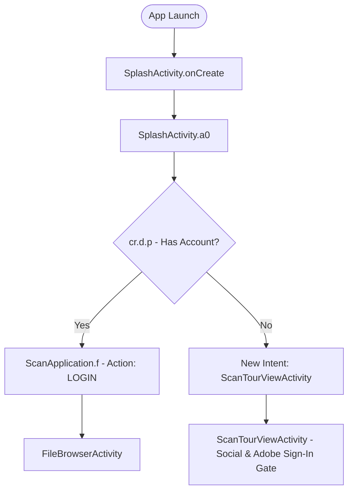
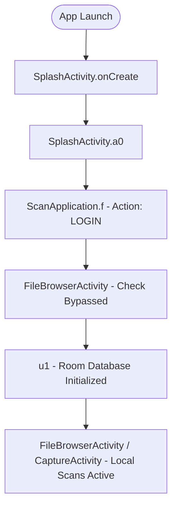

# Adobe Scan Architecture & Reverse Engineering Specification

## Overview

| Attribute | Specification |
|---|---|
| **Application Name** | Adobe Scan: PDF Scanner, OCR |
| **Package Name** | `com.adobe.scan.android` |
| **Supported Version** | `26.09.25` (Morphe Compatibility: `26.09.25`, `minSdk` 32) |
| **Analyzed Version Code** | `263063472` |
| **Target SDK** | `36` (Android 16) |
| **Minimum SDK** | `32` (Android 12L) |
| **APK Format** | APKM (`base.apk`, `split_config.arm64_v8a.apk`, `split_config.en.apk`, `split_config.xhdpi.apk`) |
| **Package Signing SHA-256** | `b6dd0562256487fcd6c98cde137858ef50d9adb9f9cd2f1ca58c5357efdf0faf` |
| **Architecture** | Native Kotlin/Java; Jetpack Compose, Room SQLite, Adobe Creative SDK (CSDK), DCMScan native image pipeline (`libDCMScanPDFEdit.so`), and arm64-v8a native libraries |

Adobe Scan is Adobe's document scanning and OCR client. By default, the application gates first launch behind an Adobe Identity Management System (IMS) or federated social account requirement (Google, Facebook, Apple). Without an active account token, the app prevents workspace entry, disallows saving scans, and purges the local database on unauthenticated state transitions.

---

## Technology Stack & Components

- **UI Framework**: AndroidX Activities/Fragments combined with Jetpack Compose (`androidx.compose`).
- **Cold-Start Entry Point**: `com.adobe.scan.android.SplashActivity` (exported launcher activity with `android.intent.action.MAIN`).
- **Main Document Workspace**: `com.adobe.scan.android.FileBrowserActivity` (`Home` recent scans and `Files` local scan repository).
- **Scanner & Camera Engine**: `com.adobe.dcmscan.CaptureActivity` (camera viewfinder, document boundary detection, multi-page batch scanning, and quick save).
- **Review & Image Processing**: `com.adobe.dcmscan.ReviewActivity` (crop, rotate, clean up, filters, reorder, adjust).
- **Native Document Pipeline**: In-process C++ native libraries (`libDCMScanPDFEdit.so`, `libt5ocrLib.so`) responsible for edge correction, page perspective flattening, and `%PDF-1.3` format generation.
- **Local Persistence**: Android Jetpack Room database (`ScanFileRoomDatabase`, backing table `ScanFilePersistentDataNew`) storing document UUIDs, local file paths, page counts, dimensions, and timestamps.
- **External Export**: Android Storage Access Framework (SAF) `DocumentsUI` ("Copy to device") allowing export of generated PDF files to device public directories (`/sdcard/Download/`).

---

## Cold-Start & Authentication Navigation Graph

### Stock Flow

1. On cold launch, `SplashActivity` executes startup initialization.
2. In `SplashActivity.a0`, the app checks `ScanApplication.C.f31344l.p()` (`cr.d.p()`).
3. Method `cr.d.p()` evaluates whether an Adobe IMS user session is active (`this.f41468o.z()`) or whether `skippedLogin` is true (`l.y()`).
4. In stock `26.09.25`, `skippedLogin` defaults to `false` and the UI contains no skip button. The app therefore constructs an `Intent` targeting `ScanTourViewActivity` with `FLAG_ACTIVITY_NEW_TASK` (`0x10000000`).
5. `ScanTourViewActivity` displays Compose-based federated sign-in buttons (Google, Facebook, Apple, and Adobe ID) and prevents back navigation to the workspace.

### Patched Flow

1. `SplashActivity.a0` is intercepted immediately after `SplashActivity$a` arguments are packaged.
2. The authentication check and `ScanTourViewActivity` intent construction are bypassed.
3. The method directly calls `ScanApplication.C.f(false, aVar, LoginActionType.LOGIN, null)`, starts `FileBrowserActivity`, and immediately calls `splashActivity.finish()`.
4. `FileBrowserActivity.onCreate` bypasses the unauthenticated exit gate by equalizing `v5` and `v11` before the `if-eq` comparison.
5. `FileBrowserActivity` proceeds through the normal startup flow, calling `u1(bundle)` to deserialize the Room database (`v0.g()`) and rendering all local scans.

---

## Local Document Lifecycle

1. **Capture**: `CaptureActivity` captures camera frames or imports gallery photos.
2. **Review & Adjust**: Users can crop, rotate, apply color filters, clean up, and rearrange pages without network connectivity.
3. **Local PDF Generation**: Tapping "Save PDF" invokes `CreatePDFViewModel.savePDF()`, triggering `localCreatePDF` in `com.adobe.dcmscan.o$c`. Native library `libDCMScanPDFEdit.so` synthesizes a valid `%PDF-1.3` binary on local disk.
4. **Database Registration**: The file is registered into `ScanFileRoomDatabase` via `ScanFileManager.createScanFile()` (`v0.d()`).
5. **Local Management & Export**: From `FileBrowserActivity`, users can view scans, rename files, duplicate pages, and tap "Copy to device" to export the binary PDF to any external storage folder via Android's native system file picker.

---

## Re-Entry Seams & Neutralization Surface

| Component | Target Descriptor / Anchor | Stock Behavior | Patched Behavior |
|---|---|---|---|
| **Cold-Start Gate** | `Lcom/adobe/scan/android/SplashActivity;->a0(...)V` | Bounces unauthenticated users to `ScanTourViewActivity`. | Unconditionally starts `FileBrowserActivity` via `ScanApplication.f` with `LoginActionType.LOGIN` and finishes splash. |
| **Workspace Auth Guard** | `Lcom/adobe/scan/android/FileBrowserActivity;->onCreate(Landroid/os/Bundle;)V` | Finishes activity and calls `ScanApplication.h` if user has no account. | Copies `v5` into `v11` at `SKIP_LOGIN` anchor, forcing branch to `:goto_d` and preserving normal `u1` database initialization. |
| **Direct Tour Entry** | `Lcom/adobe/scan/android/ScanTourViewActivity;->onCreate(Landroid/os/Bundle;)V` | Presents sign-in tour if launched via explicit intent. | Immediately redirects to `FileBrowserActivity` and calls `finish()`. |
| **Tour Launcher Helper** | `Lcom/adobe/scan/android/ScanApplication;->h(Lcom/adobe/scan/android/ScanApplication;)V` | Bounces to `ScanTourViewActivity` on auth failures. | Stubbed to `return-void`. |
| **External UI Banner** | `Lcom/adobe/scan/android/ScanApplication;->onCreate()V` (`Lqe/c1;->a:Lnt/a5;`) | Sets `ExternalUI` provider, causing "Sign in is required to save" banner and modal in camera. | Clears `Lqe/c1;->a = null` in `ScanApplication.onCreate`. |
| **Camera Save Interceptor** | `Lcom/adobe/dcmscan/CaptureActivity;->X2(Lcom/adobe/dcmscan/a$a;Z)V` | If `promptSignIn` (`p2`) is true, displays "Sign in to save changes" dialog instead of saving. | Forces `const/4 p2, 0x0` at index 0, guaranteeing immediate local PDF saving via `p2()`. |
| **Settings / Trial Limit** | `Lcom/adobe/scan/android/util/l;->S0(Lcom/adobe/scan/android/ScanApplication$c;)V` | Opens `ScanTourViewActivity` on account clicks or trial limit exhaustion. | Stubbed to `return-void`. |
| **Creative SDK Sign-In** | `Lcom/adobe/creativesdk/foundation/internal/auth/AdobeAuthSignInActivity;->onCreate(Landroid/os/Bundle;)V` | Presents web-based Adobe ID login screen. | Injects `invoke-virtual {p0}, Landroid/app/Activity;->finish()V \n return-void`. |
| **IMS Social Login** | `Lcom/adobe/libs/services/auth/SVServiceIMSLoginActivity;->onCreate(Landroid/os/Bundle;)V` | Base activity for Google, Facebook, Apple, Kakao, and Line login flows. | Injects `invoke-virtual {p0}, Landroid/app/Activity;->finish()V \n return-void`. |
| **Logout Database Purge** | `Lcom/adobe/scan/android/file/v0;->o()V` & `Lcom/adobe/scan/android/file/v0$d;->a()V` | Resets SQLite database and wipes local scans on unauthenticated transition. | Both stubbed to `return-void`, ensuring local scans persist across app launches and sign-out clicks. |
| **Settings Auth Components** | `Ljt/v2;->E(Ljava/lang/String;)V` | Displays user profile avatar icon at top and Sign out / Sign in options at bottom of Settings menu. | Sets `C(false)` (`setVisible(false)`) on `ScanProfilePreference` (`SETTINGS_PROFILE_KEY`), `SETTINGS_LOG_OUT_KEY`, and `SETTINGS_LOG_IN_KEY` after XML inflation when **Clean Up Auth Components** is enabled. |
| **Useless & Promotional Items** | `Ljt/v2;->E(...)V`, `Ljt/v2;->onCreate(...)V`, & `Lqt/u;->a(...)Lm90/b;` | Displays About Adobe Scan, Help, Rate app, Online support forum, and Share this app with a bottom category separator bar, and displays Fill & Sign Play Store redirect in File Options. | Sets `C(false)` on selected preferences and the bottom `PreferenceCategory` container, neutralizes Rate app's `onCreate` visibility logic, and forces `0x0` on the Fill & Sign branch guard when **Remove Useless/Promotional Items** is enabled. |

---

## Telemetry, Attribution & Advertising Surface

| Surface | Primary descriptors | Stock behavior | Patched behavior |
|---|---|---|---|
| Adobe Experience Platform and Target | `MobileCore`, `Target` | Tracks actions/states and retrieves Target mbox content. | Entry points return before dispatch or network access. |
| Document Cloud and Creative SDK analytics | `br.j`, `uc.f`, Creative SDK analytics `n` and `g` | Emits Scan analytics, Edge consent requests, and ETS uploads. | Dispatchers return immediately; opt-in is permanently `false`. |
| Banner and interstitial ads | `ar.k`, `ar.u`, `ar.x`, `ar.c`, `ar.s`, `InMobiSdk` | Determines eligibility, preloads and displays ads, and records impressions. | Eligibility is `false`; loaders, SDK initialization, and analytics are inert. |
| Attribution | `g90.e`, `g90.e0`, `g90.o0` | Observes activity lifecycle and sends Branch referral/deep-link requests. | Lifecycle observation and request enqueueing are disabled; Branch tracking is forced off. |
| Facebook App Events | `AppEventsLoggerImpl` | Queues app-event telemetry through Facebook's event logger. | Public logging and companion dispatch are inert. |
| Google advertising identifiers | `AdvertisingIdClient`, `AdvertisingIdClient$Info`, `yv.a` | Reads AAID and connects to Play Install Referrer. | AAID is zeroed, tracking is limited, and install-referrer connection is prevented. |
| Rating prompts | `util.l.z1`, `zq.ha` | Gates and displays Google Play review prompts. | Predicate is `false`; direct dialog construction immediately dismisses. |
| Crash reporting and usage settings | `util.l.r1`, `FirebaseCrashlytics`, `br.d`, `jt.d1.E` | Lets the user enable Crashlytics, dispatches analytics-monitoring broadcasts, and presents **Send usage info** / **Send crash info**. | Forces Crashlytics reporting to `Never`, makes analytics-monitoring broadcasts inert, and hides the complete `USAGE INFO` preference category when **Remove Settings** is enabled. |

---

## Typography Layer

Adobe Scan routes legacy XML, AppCompat, Spectrum, and Compose font requests through Adobe Clean resources `0x7f090000..0x7f09000b`, `Lp6/h;` (`ResourcesCompat.java`), and `Lod/e5;` (`ComposeFont.kt`). `CreativeSDKTextView` separately falls back to `fonts/AdobeClean-SemiLight.otf`.

The opt-in **Use System Font** patch injects `app.aidan.extension.adobescan.SystemFontBridge` into the APK. `Lp6/h;->b` returns the bridge's system typeface before resource decoding; the bridge derives light (300), medium (500), regular (400), bold (700), and italic variants from each resource entry name and supplied style bits. It dispatches the existing AndroidX callback on the main looper. `Lod/e5;->a` returns `FontFamily.Default`, and `CreativeSDKTextView.setTypeface` delegates to AppCompat rather than loading the Adobe Clean asset. These paths preserve the device typography choice across legacy views and Compose surfaces.
