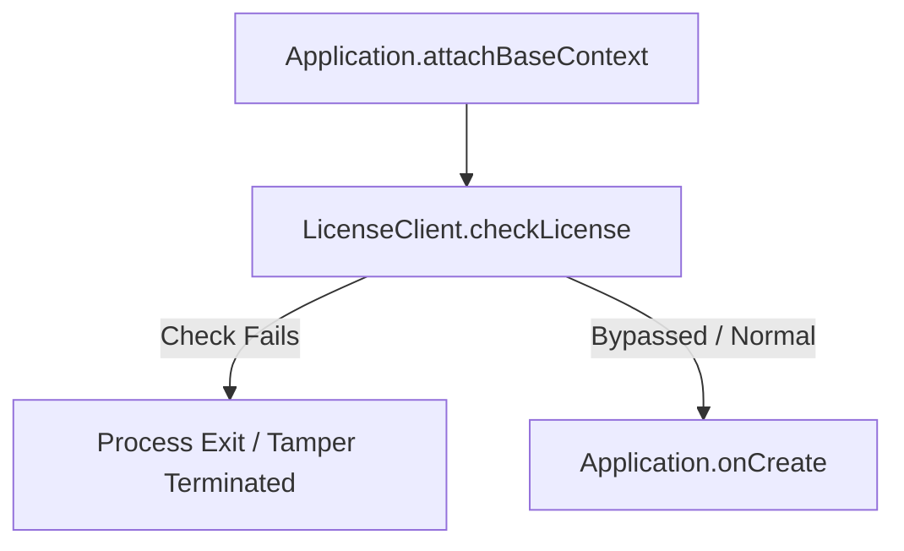
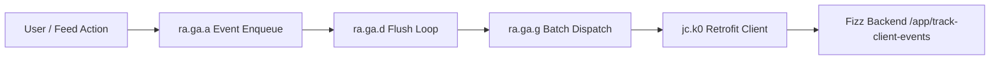
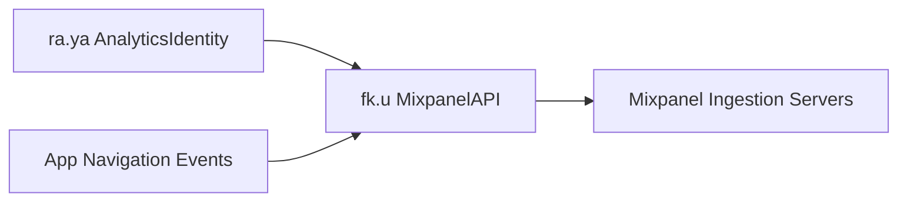

# Fizz Architecture & Reverse Engineering Specification

## Overview

| Attribute | Specification |
|---|---|
| **Application Name** | Fizz |
| **Package Name** | `com.ashtoncofer.Buzz` |
| **Supported Version** | `1.54.0` (Morphe Compatibility: `1.54.0`, `minSdk` 23) |
| **Analyzed Version Code** | `400032` |
| **Target SDK** | `36` (Android 16) |
| **Minimum SDK** | `23` (Android 6.0) |
| **APK Format** | APKM (`base.apk`, split configs) |
| **Package Signing SHA-256** | `622850867847ccb7a1371bc42c865b1137fa51bd19987dc81b53815c9a9817bf` |
| **Architecture** | Native Kotlin/Java; Jetpack Compose, Dagger/Hilt, Kotlinx Coroutines, Retrofit/OkHttp, Mixpanel, Airbridge, Adjust, Sentry, Google Play Integrity / PairIP |

Fizz is a college-centric anonymous social feed and messaging platform. The application incorporates extensive telemetry across first-party analytics pipelines, attribution services, third-party analytics SDKs, session crash reporting, and Google Play Integrity Protection (PairIP).

---

## Technology Stack

- **UI & Presentation**: Modern Jetpack Compose UI with declarative design components and Compose navigation.
- **Dependency Injection**: Dagger and Hilt manage dependencies for repositories, network clients, view models, and application lifecycles.
- **Networking**: Retrofit 2 and OkHttp handle RESTful endpoints for feed browsing, comments, direct messaging, client event tracking, and attribution syncing.
- **Coroutines & Asynchronous Work**: Kotlinx Coroutines run background jobs, batch uploads, and real-time state management.
- **Serialization**: Kotlinx Serialization parses incoming and outgoing API models.
- **Tamper Protection**: Google Play Automatic Integrity Protection / PairIP client (`com.pairip.licensecheck.LicenseClient`) verifies licensing and APK signature integrity at application startup.

---

## Telemetry & Anti-Tamper Architecture

### 1. Google Play Automatic Integrity Protection (PairIP)

The application embeds PairIP (`com.pairip.licensecheck.LicenseClient`) invoked early in `Application.attachBaseContext`. If signature mismatches or tampering are detected, the process terminates before initialization of main activities or user interactions.



### 2. First-Party Client Event Pipeline

User interactions (post impressions, votes, profile opens, community switching, comment expansion) are captured into event models (`ra.q9`) and dispatched through `ra.ga` (implementing `ra.v9`). `ra.ga` queues events locally in memory, flushes them periodically, and uploads serialized JSON payloads to the `/app/track-client-events` backend endpoint via `jc.k0`.



### 3. Mixpanel Product Analytics

Mixpanel (`fk.u`) tracks granular user flow, super properties, funnel analytics, and distinct user identities. In conjunction with `ra.ya` (which generates and persists random installation and device tracking UUIDs), events are aggregated and uploaded to Mixpanel ingestion endpoints.



### 4. Airbridge Measurement & Attribution

Airbridge (`co.ab180.airbridge.Airbridge`, wrapped in `sa.l0`) collects install attribution, deferred deep links, campaign parameters, and device hardware aliases. It hooks campaign intent triggers via `sa.l0.f`.

### 5. Adjust Mobile Attribution

Adjust (`com.adjust.sdk.Adjust`, wrapped in `sa.b`) tracks deep-link referrals, app sessions, advertising campaigns, and subscription measurement. `sa.b.g` manages initialization from application context.
### 6. Google Advertising Identifier (AAID)

The app queries Google Play Services `AdvertisingIdClient` to retrieve the device Advertising ID (AAID) and ad-tracking preferences. `sa.n0` registers this device identifier with backend services for cross-device user matching and targeted re-engagement campaigns.
### 7. Sentry Performance & Crash Reporting

Sentry Android (`io.sentry.android.core.s1`, initialized via `ec.p1.b`) monitors unhandled exceptions, ANRs, HTTP breadcrumbs, and UI transaction performance traces. Telemetry captures breadcrumbs of navigation, network requests, and device state.

### 8. Direct Message Screenshot Surveillance

In private direct messaging conversations, `ConversationViewModel` observes system screenshot events. When a screenshot is captured, `sd.a2` (a coroutine worker) triggers `jc.n2.q` to invoke `/chat/notify-screenshot`, alerting the chat counterpart that their private messages were captured.

```mermaid
flowchart LR
    SC[Android Screenshot Event] --> VM[ConversationViewModel]
    VM --> WK[sd.a2 Coroutine Worker]
    WK --> RP[jc.n2.q ChatRepository]
    RP --> API[POST /chat/notify-screenshot]
    API --> CP_NOTIF[Counterpart Notified]

---

## Typography & Emoji Subsystem

Fizz constructs its user interface exclusively using Jetpack Compose (`androidx.compose.ui.text`). Typography styling defaults to `Nunito` (`res/font/nunito_variable.ttf`), loaded at runtime via Compose's `AndroidFontLoader` (`hg.g`) and resolved through `FontFamilyResolverImpl`.

### 1. EmojiCompat Integration

The application registers `androidx.emoji2.text.EmojiCompatInitializer` with `androidx.startup.InitializationProvider`. When enabled:
1. `EmojiCompatInitializer.b` creates a `FontRequestEmojiCompatConfig` backed by Google Play Services downloadable fonts.
2. `AndroidParagraphIntrinsics` (`q4.c`) checks `EmojiCompat.isConfigured()` (`x5.i.c()`).
3. If initialized, `EmojiCompat.process(...)` scans incoming text and wraps emoji sequences in `TypefaceEmojiSpan` (`x5.u`), enforcing Google Noto emoji rendering.

```mermaid
flowchart TD
    A[Compose Text Component] --> B[AndroidParagraphIntrinsics]
    B --> C{EmojiCompat.isConfigured?}
    C -->|Yes / Default| D[EmojiCompat.process -> TypefaceEmojiSpan Google Noto]
    C -->|No / Patched| E[Raw Text -> Canvas.drawText with Custom Typeface]
    E --> F[Minikin Font Fallback Chain]
    F --> G[AppleColorEmoji.ttf iOS Emojis]
```

### 2. Custom Fallback Typeface Pipeline

When `EmojiCompat` is neutralized:
1. `EmojiCompatInitializer.b` immediately returns `Boolean.FALSE`, preventing `EmojiCompat` registration.
2. Compose leaves emojis as untransformed characters.
3. `hg.g.c` (`AndroidFontLoader.load`) intercepts `nunito_variable` resolution and delegates to `EmojiFontBridge.wrapTypeface`.
4. `EmojiFontBridge` instantiates `Typeface.CustomFallbackBuilder` with `Nunito` as the primary family and `assets/fonts/AppleColorEmoji.ttf` as the custom fallback.
5. `wj.a.t` (PlatformTypefaces) intercepts generic and platform font resolution, routing to `EmojiFontBridge.wrapPlatformTypeface`.
6. Minikin renders all emoji codepoints using the high-resolution CBDT/CBLC bitmap glyphs from `AppleColorEmoji.ttf`.

---

## Patch Targets

1. **`RemoveTrackingAndAnalyticsPatch.kt` (`bytecodePatch`)**:
   - Neutralizes PairIP signature verification (`LicenseClient.checkLicense`).
   - Stubs first-party event enqueuing and batch uploads (`ra.ga`, `jc.k0`, `ec.j`).
   - Disables Mixpanel tracking methods, resets, and forces tracking opt-out (`fk.u`, `ra.ya`).
   - Neutralizes Airbridge attribution methods and lifecycle initialization (`sa.l0`, `Airbridge`).
   - Neutralizes Adjust attribution methods and session hooks (`sa.b`, `Adjust`).
   - Zeroes the Google Advertising ID (`00000000-0000-0000-0000-000000000000`) and limits ad tracking (`AdvertisingIdClient`, `sa.n0`).
   - Configurable option `disableCrashReporting`: Disables Sentry initialization and reporting (`ec.p1`, `s1`).
   - Configurable option `silentScreenshots`: Disables screenshot detection alerts to chat counterparts (`sd.a2`, `jc.n2.q`).
2. **`ReplaceEmojiFontWithIosPatch.kt` (`rawResourcePatch` & `bytecodePatch`)**:
   - Bundles `AppleColorEmoji.ttf` into `assets/fonts/AppleColorEmoji.ttf` in target APK (`rawResourcePatch`).
   - Stubs `EmojiCompatInitializer.b` to return `Boolean.FALSE`, disabling Google Noto emoji replacement (`bytecodePatch`).
   - Wraps Compose font loader `hg.g.c` and platform font resolver `wj.a.t` with `EmojiFontBridge` custom fallback builder (`bytecodePatch`).
3. **`EnableDeveloperSettingsPatch.kt` (`bytecodePatch`)**:
   - Injects `DeveloperMenuBridge.init` into `MainActivity.onCreate`.
   - Injects developer mod menu button into Home Screen top bar composable (`td.v.a`).
   - Bypasses Mobile Studio drawer gating (`de.k1.invokeSuspend`).
4. **`RemoveAdsPatch.kt` (`bytecodePatch`)**:
   - Filters commercial feed advertisements (`sc.k`) and optional marketplace listing cards (`sc.t1`) from Home feed `displayItems` via `FeedFilterBridge` in `HomeFeedViewModel.l0`.
   - Preserves repository item models in `FeedRepository`, maintaining uninterrupted infinite scrolling without falsely triggering `endReached`.
