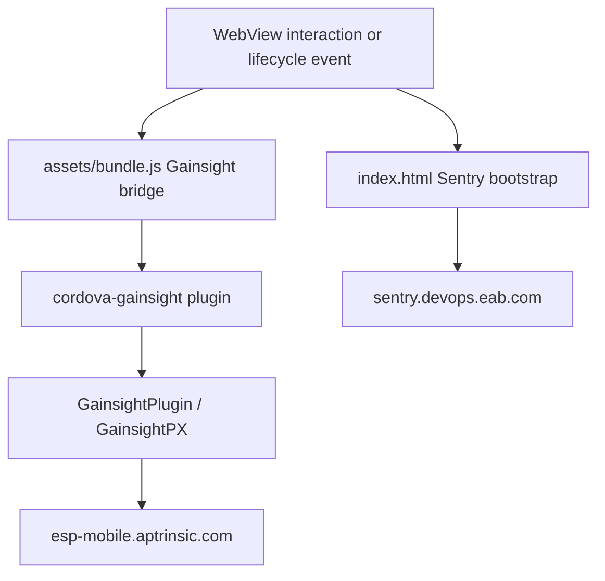

# Navigate360 Student Architecture & Reverse Engineering Specification

## 1. Overview

| Attribute | Specification |
|---|---|
| **Application Name** | Navigate360 Student |
| **Package Name** | `com.eab.se` |
| **Supported Version** | `26.19.22` (Morphe Compatibility: `26.19.22`, `minSdk` 31) |
| **Analyzed Version Code** | `26190220` (Derived from APK analysis; Constants specifies version string) |
| **Minimum SDK** | `31` (Android 12) |
| **Distribution Format** | APKM (`ApkFileType.APKM`); base APK plus language and density splits |
| **Package Signing SHA-256** | `7253620866df0a00048e7c1f43976992330e2fdb06f094d47fbf20045f56ec4b` |
| **Primary Icon Color** | `#0071CE` |

Navigate360 Student is a Cordova hybrid Android application. The native shell supplies Android and Cordova plugins, while the product UI and business flows are bundled in `assets/www/` and execute in an Ionic WebView.

---

## 2. Application Stack

### 2.1 Web Layer
- **Apache Cordova 12+** provides the native-to-WebView bridge.
- **Ionic WebView** hosts the frontend bootstrapped by `assets/www/index.html`.
- Product applications, microsites, static resources, and their JavaScript bundles are stored below `assets/www/`.
- Cordova plugin modules are registered from `assets/www/plugins/`.

### 2.2 Native Components
The APK includes native Cordova integrations for:
- Gainsight PX (`com.native360.gainsight.GainsightPlugin`)
- InAppBrowser and Safari View Controller
- Push notifications
- Calendar, files, sharing, local notifications, and device diagnostics
- Ionic deeplinks and network information

Firebase Cloud Messaging is retained for push delivery. Firebase Analytics and Google Measurement are not present as application telemetry targets and are not modified.

---

## 3. Telemetry Architecture

Two independent telemetry paths exist in the analyzed APK.

### 3.1 Gainsight PX Behavioral Analytics

Gainsight PX v1.13.5 is configured through the Cordova preference `GainsightApiKey` with value `AP-ANT1MXI6D1QH-3`.

- Native entry point: `Lcom/native360/gainsight/GainsightPlugin;`
- SDK: `Lcom/gainsight/px/mobile/GainsightPX;`
- Web bridge bundle: `assets/bundle.js`
- Cordova module: `assets/www/plugins/cordova-gainsight/www/gainsight.js`
- Backend: `https://esp-mobile.aptrinsic.com`

The plugin initializes the native SDK, attaches a JavaScript bridge to the WebView, and exposes Cordova commands. The SDK records lifecycle activity, tap events, screen views, custom events, account/user identity, and engagement state.

### 3.2 Sentry Error and Performance Telemetry

`assets/www/index.html` loads Sentry Browser v7.120.4 from `assets/www/bin/sentry.js`, initializes it with the EAB Sentry DSN, and registers lifecycle/network breadcrumbs.

- DSN host: `sentry.devops.eab.com`
- Browser reporting endpoint: `https://5a282e1f1a464673aa8fef5b0d51a633@sentry.devops.eab.com/51`
- CSP report group: `sentry-csp`

The bootstrap attaches device model, OS version, platform, and Cordova version tags after `deviceready`. It also emits Loading, Paused, Resumed, Offline, and Online breadcrumbs.
