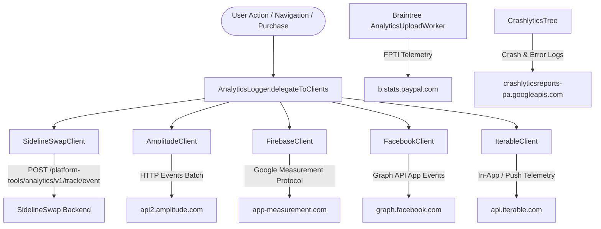

# SidelineSwap Architecture & Reverse Engineering Specification

## 1. Overview

| Attribute | Specification |
|---|---|
| **Application Name** | SidelineSwap: Buy & Sell Gear |
| **Package Name** | `com.sidelineswap.android` |
| **Supported Version** | `1.52.0` (Morphe Compatibility: `1.52.0`, `minSdk` 28) |
| **Analyzed Version Code** | `222` (Derived from APK analysis; Constants specifies version string) |
| **Target SDK** | `36` (Android 16; derived from APK analysis) |
| **Minimum SDK** | `28` (Android 9.0) |
| **Distribution Format** | XAPK (`ApkFileType.XAPK`) |
| **Architecture** | Pure Native Android (Kotlin & Java), Material Components, Jetpack Navigation, Dagger 2 |
| **Package Signing SHA-256** | `e434334ea79d8702a5d023ce7bfae4da9fa5539796cb9e0ba515cb471528697f` |
| **Primary Theme Color** | `#02c874` (`colorPrimary`) / `#009647` (`colorPrimaryDark`) |

SidelineSwap is a native Android marketplace application designed for buying and selling new and used sports gear. Unlike hybrid applications (e.g. React Native with Hermes bytecode), SidelineSwap is implemented entirely as a standard Dalvik/ART native Android app compiled with R8 shrinking and obfuscation.

---

## 2. Technology Stack & Key Libraries

### 2.1 Presentation & UI Layer
- **Android Jetpack Navigation**: Single-activity architecture hosting nested navigation graphs (`nav_graph.xml`, `AccountGraphXmlDirections`, `ItemGraphNavigationFragment`).
- **Material Components & Custom Theming**: `AppTheme` extending `Theme.MaterialComponents.Light.NoActionBar` with standard color attributes (`colorPrimary = #02c874`, `colorPrimaryDark = #009647`, `colorAccent = @color/colorPrimary`).
- **View Binding**: Android Jetpack ViewBinding across all Fragments and Activities.
- **Image Loading**: Glide (`com.bumptech.glide`) with custom transformations for product listings and user profile lockers.

### 2.2 Dependency Injection & Application Scope
- **Dagger 2**: Central dependency container configured via `ApplicationComponent` and `ApplicationModule`.
- `ApplicationModule` constructs singletons including:
  - `WebService` (Retrofit HTTP client)
  - `AnalyticsLogger` (Central analytics event dispatcher)
  - `AccountRepo`, `CartRepo`, `ItemRepo`, `LogRepo`, `SearchRepo`

### 2.3 Networking & Data Serialization
- **Retrofit 2**: REST API interfaces communicating with `https://api.sidelineswap.com/` and first-party backend services.
- **OkHttp 3**: Core HTTP transport pipeline configured with `AuthenticationInterceptor` (injecting JWT auth headers) and logging interceptors.
- **Moshi**: JSON serialization and deserialization adapter for data models.

### 2.4 Payments & Checkout Gateway
- **Braintree Android Drop-in SDK**: Facilitates card processing, PayPal checkout, and Venmo integration (`com.braintreepayments.api.DropInActivity`, `BraintreeClient`).
- **CardinalCommerce 3D-Secure**: Fraud assessment and 3DS verification (`com.cardinalcommerce.shared.userinterfaces.ChallengeNativeView`, `CCInitProvider`).
- **QuadPay / Zip BNPL**: Installment payment widgets and deep-link flows (`x5.c`).

### 2.5 Diagnostic & Crash Reporting
- **JakeWharton Timber**: Logging abstraction planted in `SidelineSwapApplication.onCreate`.
- **Firebase Crashlytics**: Custom `CrashlyticsTree` forwards warning and error logs (log priority > 4) to Google Firebase Crashlytics.

---

## 3. Reverse-Engineered Telemetry Architecture

SidelineSwap incorporates a multi-tier analytics and tracking pipeline without third-party display ad networks (no AdMob, AppLovin, Unity, or IronSource). Every user interaction funnels through a central dispatcher before broadcasting to multiple telemetry backends.



### Telemetry Surface Breakdown

| Layer | Component / Target | Class Descriptor | Neutralization Strategy |
|---|---|---|---|
| **1. Central Dispatcher** | `AnalyticsLogger` | `Lcom/sidelineswap/android/analytics/AnalyticsLogger;` | Inject `return-void` in `delegateToClients`; inject `return-object p0` in `addClient`. |
| **2. First-Party Telemetry** | `SidelineSwapClient` & `LogRepo` | `Lcom/sidelineswap/android/analytics/SidelineSwapClient;`<br>`Lcom/sidelineswap/android/repo/LogRepo;` | Inject `return-void` in `logEvent`; inject `const/4 v0, 0x0 \n return-object v0` in `trackEvent`. |
| **3. Amplitude Analytics** | Amplitude SDK | `Lcom/sidelineswap/android/analytics/AmplitudeClient;`<br>`Lp073j1/d;` | Inject `return-void` in client `logEvent`, synthetic `access$logEvent`, and SDK `d` method. |
| **4. Firebase Analytics** | Firebase Measurement & Perf | `Lcom/sidelineswap/android/analytics/FirebaseClient;`<br>`Lcom/google/firebase/analytics/FirebaseAnalytics;`<br>`Lcom/google/firebase/perf/FirebasePerformance;` | Inject `return-void` across client `logEvent`/`access$logEvent`, Firebase event logging, parameter setters, and performance collection. |
| **5. Crashlytics & Timber** | Timber Tree & Crashlytics | `Lcom/sidelineswap/android/log/CrashlyticsTree;`<br>`Lcom/google/firebase/crashlytics/FirebaseCrashlytics;` | Inject `return-void` in Timber error bridge and Crashlytics logging APIs. |
| **6. Facebook SDK** | AppEvents & Obfuscated Helpers | `Lp173v2/y;`<br>`Lcom/sidelineswap/android/analytics/FacebookClient;`<br>`Lp057h2/h;` | Inject `return-void` into obfuscated helper methods (`e` through `l`), all seven `FacebookClient` checkout/interaction methods, and `Lp057h2/h;->a`. |
| **7. Iterable Tracking** | Iterable In-App Telemetry | `Lcom/sidelineswap/android/analytics/IterableClient;`<br>`Lp159t5/C1123h;` | Inject `return-void` in `visitedLocker` and in-app interaction loggers (`d`, `e`, `f`, `g`). |
| **8. Braintree Gateway** | FPTI Analytics Workers | `Lcom/braintreepayments/api/AnalyticsUploadWorker;`<br>`Lcom/braintreepayments/api/AnalyticsWriteToDbWorker;`<br>`Lcom/braintreepayments/api/L;` | Return `ListenableWorker$a$c` (Success) in worker `g` methods to halt network uploads without retry loops; stub `b` and `c` in client `L`. |
| **9. Hardware Identifiers** | Google Play Advertising ID | `LY2/a;` (minified `AdvertisingIdClient`)<br>`AdvertisingIdClient$Info` | Return spoofed `LY2/a$a` with zeroed UUID and limit tracking `true`; stub direct `getId` to zeroed UUID and `isLimitAdTrackingEnabled` to `true`. |
---

## 4. Application Lifecycle & Startup Sequence

```
1. Application Process Creation
   ├── CardinalCommerce CCInitProvider.onCreate()
   └── SidelineSwapApplication.onCreate()
       ├── Timber.plant(CrashlyticsTree) [Logging redirected]
       ├── DaggerApplicationComponent initialization
       │   └── ApplicationModule.provideAnalyticsLogger()
       │       └── Adds Amplitude, Firebase, Facebook, SidelineSwap, Iterable clients
       └── Push notification channel configuration

2. MainActivity Launch
   ├── ViewBinding inflation (activity_main.xml)
   ├── NavController attached to R.id.nav_host_fragment
   └── Deeplink evaluation and bottom navigation routing
```
