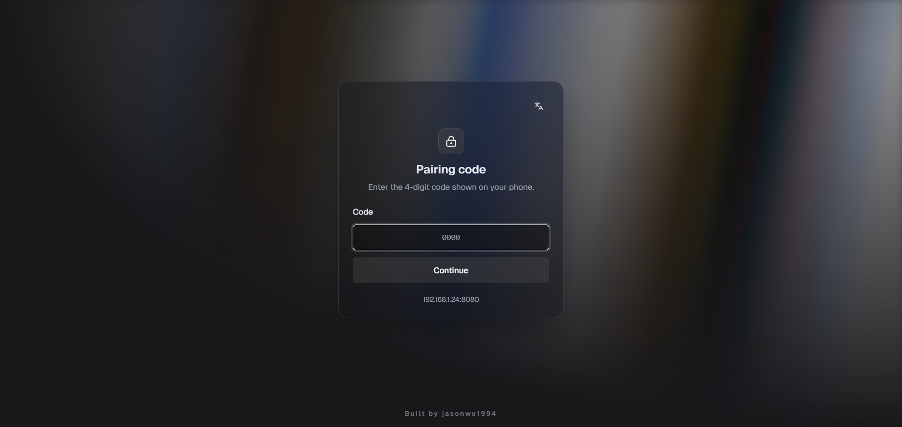
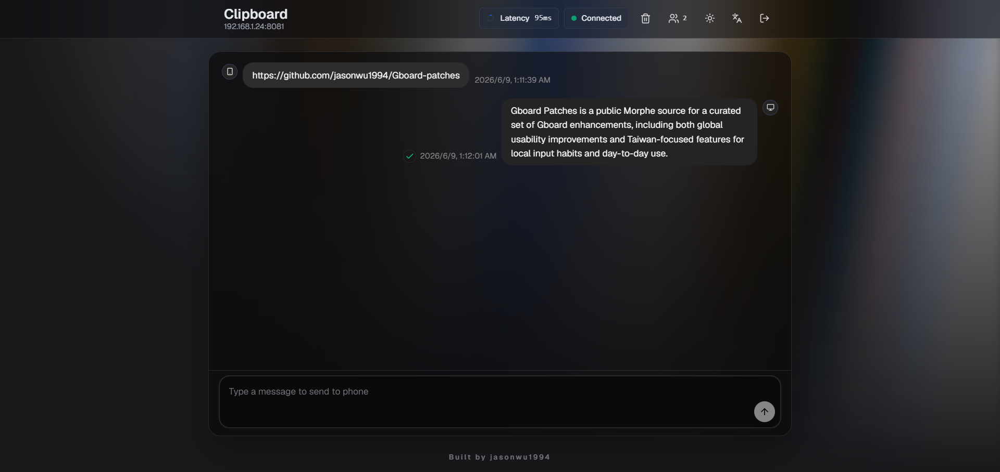

<h1 align="center">Gboard Patches</h1>

<p align="center">
  Morphe patches for Gboard with a mix of global improvements and Taiwan-focused enhancements.
</p>

<p align="center">
  <a href="https://github.com/jasonwu1994/Gboard-patches/releases/latest"></a>
  <a href="https://github.com/jasonwu1994/Gboard-patches"></a>
  <a href="https://morphe.software/add-source?github=jasonwu1994/Gboard-patches"></a>
  <a href="https://github.com/jasonwu1994/Gboard-patches"></a>
</p>

## Overview

Gboard Patches is a public Morphe source for a curated set of Gboard enhancements, including both global usability improvements and Taiwan-focused features for local input habits and day-to-day use.

## Included Patches

### Global Users

<details>
  <summary><code>AI Writing Tools</code></summary>

  Enables the <code>Text correction &gt; Writing tools</code> setting with support for all languages.
</details>

<details>
  <summary><code>Advanced Voice Typing</code></summary>

  Enable Advanced Voice Typing with automatic punctuation, and separately enable automatic punctuation for Traditional Chinese voice typing, which does not support Advanced Voice Typing.
</details>

<details>
  <summary><code>Clipboard Enhancements</code></summary>

  Lets you enhance clipboard retention time, item count limits, preview lines, countdown and creation-time labels, order index, grid columns, and optionally render only the first 1,000 characters on each clipboard card.
</details>

<details>
  <summary><code>Clipboard Custom Character Limit</code></summary>

  Lets you set the maximum number of characters stored for each text clipboard item, with Gboard's stock 20,000-character limit as the default.
</details>

<details>
  <summary><code>Web Clipboard</code></summary>

  Hosts a phone-powered Web Clipboard portal that lets desktop browsers sync with Gboard over the same LAN, with a pairing code gate and an optional Quick Settings Tile.

  Preview:

  

  

</details>

<details>
  <summary><code>Long-Press Editing Shortcuts</code></summary>

  Add Select all, Undo, Copy, Cut, Paste, and Redo long-press shortcuts to English QWERTY and Zhuyin.
</details>

<details>
  <summary><code>Incognito Mode Toggle</code></summary>

  Add an Incognito toggle to the Access Point toolbar and configure clipboard and voice typing availability while Incognito mode is active.
</details>

<details>
  <summary><code>Enable OCR / Scan Text</code></summary>

  Enable the OCR / Scan Text feature with Latin, Chinese, Japanese, Korean, and Devanagari recognition backends.
</details>

<details>
  <summary><code>Custom Symbols</code></summary>

  Adds a dedicated symbols tab and a quick access entry from the comma long-press popup.
</details>

<details>
  <summary><code>Swipeable Custom Top Row</code></summary>

  Lets you swipe the keyboard top row horizontally to open customizable text and JavaScript slots.
</details>

<details>
  <summary><code>Emojis, stickers & GIFs Tab Order</code></summary>

Customize the bottom tab order in Gboard's Emojis, stickers & GIFs panel with drag-and-drop reordering.
</details>

<details>
  <summary><code>English QWERTY Up-Flick Uppercase</code></summary>

  Flick up on the English QWERTY keyboard to toggle uppercase and lowercase.
</details>

<details>
  <summary><code>Enable Inline Autofill Suggestions</code></summary>

  Enables inline autofill suggestions in supported contexts.
</details>

<details>
  <summary><code>Grammar Checker</code></summary>

  Enables the <code>Text correction &gt; Grammar check</code> setting and its related rollout gate.
</details>

<details>
  <summary><code>Inline Suggestions</code></summary>

  Enables the <code>Text correction &gt; Smart Compose</code> setting and its related rollout gate.
</details>

<details>
  <summary><code>Key Shape Selection</code></summary>

  Enables the <code>Key shape</code> option inside theme details without forcing rounded keys by default.
</details>

<details>
  <summary><code>Latin Globe Key Ignore Interval</code></summary>

  Add an independent English globe key ignore interval override for post-typing language-switch delay.
</details>

<details>
  <summary><code>Use Bluetooth Microphone</code></summary>

  Enables the <code>Voice typing &gt; Use Bluetooth microphone</code> setting and its related rollout gate.
</details>

<details>
  <summary><code>Settings Homepage Override</code></summary>

  Lets you switch between the new and legacy Gboard settings homepage styles.
</details>

<details>
  <summary><code>Developer options</code></summary>

  Enable Developer options and the Flag Editor, allowing you to modify flag values.
</details>

<details>
  <summary><code>Package Rename</code></summary>

  Renames the patched package so it can be installed alongside the official Gboard app.
</details>

### Taiwan Users

<details>
  <summary><code>Zhuyin Slide Input</code></summary>

  On the Zhuyin keyboard, swipe up or down to enter English letters without switching to another keyboard layout.
</details>

<details>
  <summary><code>Zhuyin Quick Traditional/Simplified Toggle</code></summary>

  Swipe up on the Zhuyin <code>ㄥ</code> key to quickly toggle between Traditional and Simplified Chinese.
</details>

<details>
  <summary><code>Zhuyin Bottom Row Key Sizes</code></summary>

  Adjusts the seven bottom-row slot sizes on the Zhuyin keyboard, including <code>?123</code>, <code>，</code>, the globe key, space, <code>ㄦ</code>, backspace, and the IME action key.
</details>

## Install

Add this repository as a Morphe source:

- [Open in Morphe](https://morphe.software/add-source?github=jasonwu1994/Gboard-patches)
- Or manually add `https://github.com/jasonwu1994/Gboard-patches`

## Build

Before running Gradle locally, authenticate to Morphe's GitHub Packages registry with either:

- `gpr.user` and `gpr.key` in `~/.gradle/gradle.properties`
- `GITHUB_ACTOR` and `GITHUB_TOKEN` as environment variables

Build the Android patch bundle:

```powershell
.\gradlew.bat :patches:buildAndroid
```

Regenerate patch metadata:

```powershell
.\gradlew.bat generatePatchesList
```

Generated outputs:

- `patches/build/libs/*.mpp`
- `patches-list.json`
- `patches-bundle.json`

## License

Released under the [GNU General Public License v3.0](LICENSE).
