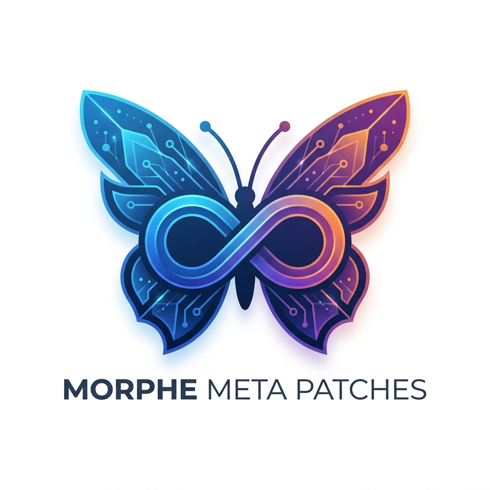

<p align="center">
  
</p>

<div align="center">

# Morphe-Meta-Patches

**A specialized collection of Android patches for Meta applications (Facebook, Instagram, and Messenger), built for the Morphe patcher ecosystem.**

<br>

[](https://www.gnu.org/licenses/gpl-3.0)
[](https://morphe.software)
[](https://kotlinlang.org)
[](https://android.com)
[](https://gradle.org)
[](#supported-apps--patches)

</div>

---

## About

**Morphe-Meta-Patches** provides high-quality, community-driven patches for Meta apps. These patches are ported and optimized for the [Morphe](https://morphe.software) patcher, ensuring a seamless and ad-free experience.

### Key Features

- **Ad-blocking**: Removes sponsored stories and commercial interruptions.
- **Privacy Enhancements**: Disables telemetry and tracking where possible.
- **Feature Unlocks**: Re-enables hidden or restricted functionality.

---

## Supported Apps & Patches

| App | Package | Patches |
| :--- | :--- | :--- |
| Facebook | `com.facebook.katana` | <ul><li>Hide Ads</li><li>Hide story ads</li></ul> |

---

## GPL Compliance

This project is fully compliant with the GNU General Public License v3.0:

- **Origin attribution**: Each file derived from ReVanced includes a permanent link to the exact source file at the top of the file, as required by GPL Section 5.
- **License**: All code is licensed under [GPL v3](LICENSE).

---

## Building

These patches are designed to work with [Morphe](https://morphe.software). To build:

1. Ensure you have the Morphe patcher and dependencies set up.
2. Run the Gradle build:

```bash
./gradlew build
```

---

## Credits

- **[ReVanced](https://github.com/ReVanced/revanced-patches)** — Original patches (GPL v3)
- **[Morphe](https://morphe.software)** — Patcher framework and ecosystem
- **Community contributors** — Migrations, fixes, and improvements

---

## License

This project is licensed under the [GNU General Public License v3.0](LICENSE). See the [NOTICE](NOTICE) file for Morphe's additional conditions under GPLv3 Section 7.
