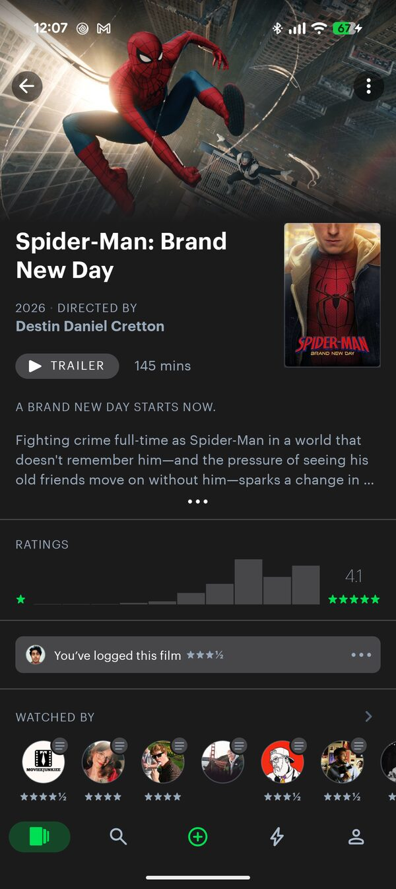
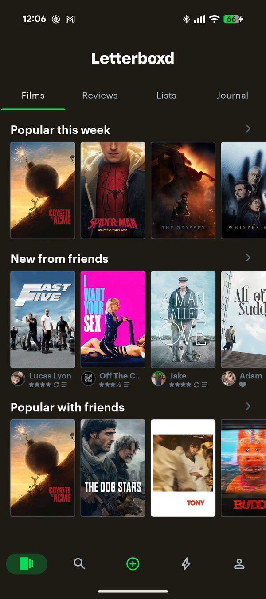
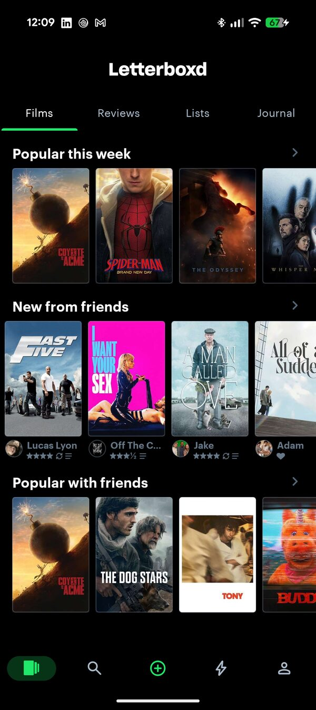
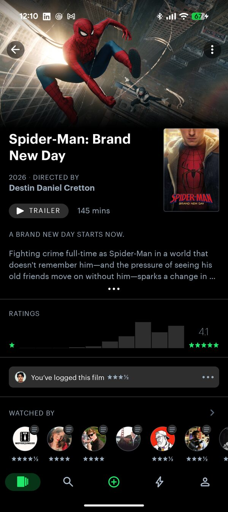
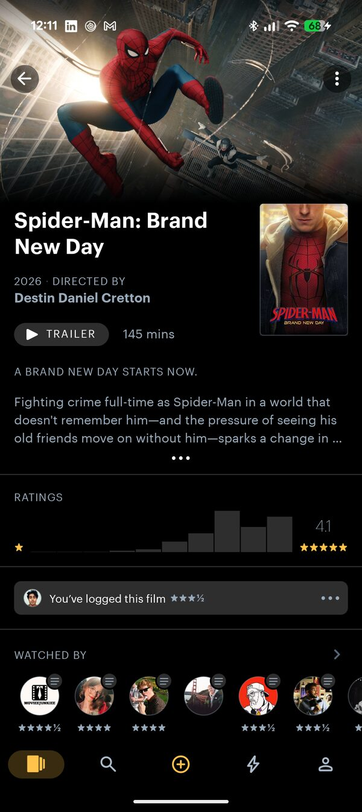
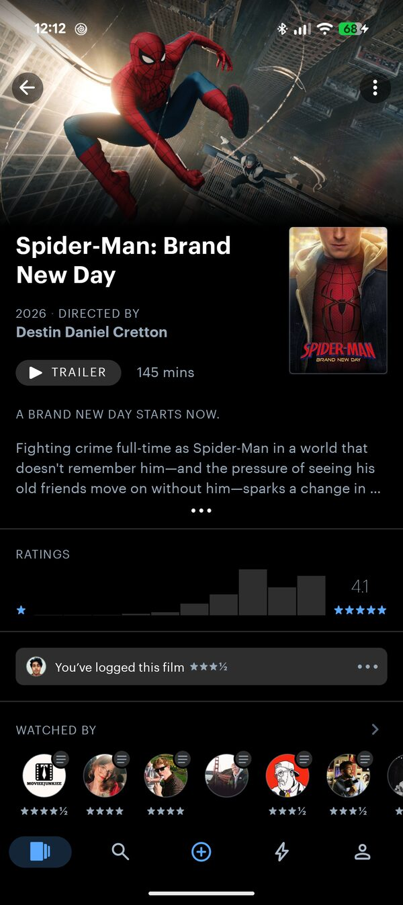
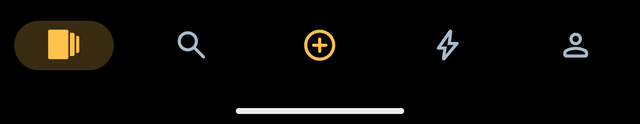
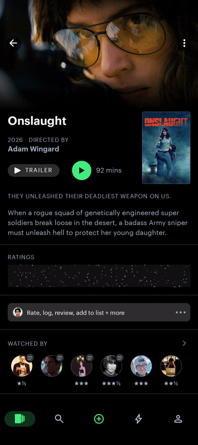

# Letterboxd Morphe Patches

<div align="center">

Patches for the **Letterboxd** Android app (`com.letterboxd.letterboxd`),
built for [Morphe](https://morphe.software).

[](https://www.gnu.org/licenses/gpl-3.0)
[](https://morphe.software)
[](https://android.com)


</div>

---

## About

A collection of patches for Letterboxd on Android. Theming, layout
tweaks, a few small conveniences.

Almost everything lives in one in-app screen, **Letterboxd Mods**, instead of
the patcher. Pick your patches once. Change styling, ratings behaviour, and
which sections show up, any time, from inside the app.

Not affiliated with Letterboxd or the Morphe project.

---

## The Mods screen

Long-press the **settings gear on your profile tab** to open **Letterboxd
Mods** (needs the **Mod settings** patch, on by default). A one-time note
points this out the first time you launch after patching. Some changes apply
right away, others need a restart, and you'll be prompted either way.

### Theme

- **Pure black (OLED)**: true-black surfaces. Elevated bits like cards and
  sheets stay a faint grey so the ratings histogram doesn't disappear into
  it. Needs Android 12+. Locked off while the separate **Material You theme**
  patch is on.
- **Match bottom nav to top bar**: paints the bottom nav bar black, matching
  the top bar.
- **Accent colour**: recolours the stars, rating indicators, and the
  selected bottom-nav icon:
  - Nine presets (Letterboxd green, amber, orange, coral, pink, violet, blue,
    teal, mono), plus a full HSV/hex picker.
  - **Material You** (Android 12+, only shows up once **Material You theme**
    is on): your wallpaper's own palette, as three tones: Material You,
    Material You 2, Material You 3. Picked automatically once it's available.
- **Bottom nav selected style**: *Stock*, *No pill*, *No pill + white icon*,
  *No pill + accent icon*, or *Accent pill*. The green **+** is never touched.

### Home

- **Hide Video Store**: removes the "Letterboxd Video Store" promo row from
  the Films tab. Off by default.
- **Hide Where to Watch**: removes the "Where to watch" section from a
  film's page. Off by default.

### Streaming

- **Open in player**: adds a small icon-only button beside Trailer on a
  film's page that opens it directly in **Stremio** or **Nuvio**, your pick.
  Off by default.

### Ratings

- **Hide ratings until watched**: covers a film's community rating (average
  + histogram) until you mark it watched. Resets every visit. Only the film
  page, ratings in lists and search are untouched. On by default.
  - **Cover**: what it looks like while hidden: *Frosted panel* (default),
    *Tap-to-show link*, *Shimmer*, or *Tap to burst*.
  - **Reveal animation**: how it disappears on tap, separate from the cover:
    *Pop* (default), *Crumble*, or *Confetti*.
  - **Confetti color**: only shows up once Confetti is picked: *Accent*,
    *Letterboxd colors* (default), or *Classic red*.
  - **Reveal haptic feedback**: a short vibration on reveal. On by default.

---

## Screenshots

A few of these were shot before things moved into the Mods screen. Same
settings, same look.

### Material You surface style

The two "Wallpaper tint" columns are two different device wallpapers: the dark
chrome tracks whatever palette Android hands it.

| | Wallpaper tint A | Wallpaper tint B | Pure black (OLED) |
| :--- | :---: | :---: | :---: |
| **Film page** |  |  |  |
| **Home** |  |  |  |

### Accent colour

Same film page, OLED surface: a preset swatch or any hex. Visible on the ratings
histogram and the selected bottom-nav tab.

| Letterboxd green | Amber | Blue |
| :---: | :---: | :---: |
|  |  |  |

### Bottom nav selected style

The green **+** button is untouched in every mode.

| Stock (grey pill, blue icon) | No pill, white icon |
| :---: | :---: |
|  |  |

| No pill, accent icon | Accent pill |
| :---: | :---: |
|  |  |

### Denser poster grid

| Cozy | Dense |
| :---: | :---: |
|  |  |

### Hide Video Store on home

| Before | After |
| :---: | :---: |
|  |  |

### Hide ratings until watched: cover

The film's community rating is fully covered until you tap.

| Confetti | Frosted panel | Tap to burst | Tap-to-show link |
| :---: | :---: | :---: | :---: |
|  |  |  |  |


---

## Install

1. On the device, open this link to add the source in Morphe Manager:
   <https://morphe.software/add-source?github=mvaishak/letterboxd-morphe-patches>
2. In the source settings, enable **pre-releases** for the newest (`dev`) builds,
   or leave it off for stable releases only.
3. Load a clean, unpatched Letterboxd APK from
   [APKMirror](https://www.apkmirror.com/apk/letterboxd/) or
   [Uptodown](https://letterboxd.en.uptodown.com/android). Not a file another
   tool has already patched or re-zipped.
4. Select the patches you want and patch.

> **Opening the Mods screen.** Almost everything configurable lives in one
> in-app screen. Long-press the **settings gear on your profile tab** to open
> it. A one-time note also shows on first launch after patching.

Any Letterboxd version should work. Morphe will warn you if something else
about your APK doesn't match.

---

## Patches

<!-- PATCHES_START EXPANDED -->
> **[v2.0.0](https://github.com/mvaishak/letterboxd-morphe-patches/releases/tag/v2.0.0)**&nbsp;&nbsp;•&nbsp;&nbsp;`main`&nbsp;&nbsp;•&nbsp;&nbsp;5 patches total
<details open>
<summary>Letterboxd&nbsp;&nbsp;•&nbsp;&nbsp;5 patches</summary>
<br>

| Patch | Description | Options |
|----------|----------------|-----------|
| [Appearance](#appearance) | In-app appearance controls, adjustable from the Letterboxd Mods screen without re-patching: a true-black OLED surface, a custom accent colour (presets or any hex), and the bottom-navigation selected style. Applied at runtime via resource overlays on Android 12 and later. Needs the "Mod settings" patch. If the separate "Material You theme" patch is also applied, its OLED and nav-bar-match switches are disabled here automatically — the two theming systems can't run at once. |  |
| [Brighter Watched-by stars](#brighter-watched-by-stars) | Other people's star ratings in a film's "Watched by" row use a very dark grey (#445566) that is hard to read, especially on a black theme. This switches them to the lighter grey (#99AABB) the rest of the app already uses for other people's ratings. A small legibility fix, on by default. |  |
| [Denser poster grid](#denser-poster-grid) | Tightens the spacing around posters in grids so they render larger and closer together. Does not change the number of columns. | • Grid density |
| [Material You theme](#material-you-theme) | Repaints Letterboxd's dark chrome — window background, surfaces, cards, the top bar, tab strip, bottom nav and sheets — from the device's Material You palette on Android 12+ (no effect below). No accent or OLED options here; those live in the "Mod settings" screen — but that screen's "Pure black (OLED)" and "Match bottom nav" switches turn themselves off while this patch is applied, since it already repaints those surfaces on its own. No effect on Jetpack Compose screens. |  |
| [Mod settings](#mod-settings) | HOW TO OPEN: long-press the settings gear on your profile tab. — This adds a "Letterboxd Mods" screen that collects the other patches' options (theme, accent, hide ratings, hide video store, hide where to watch, open in player, match bottom nav, etc.) so you can change them inside the app instead of re-patching. Some changes apply immediately, others after a restart, and you'll be prompted either way. | • Cover |

</details>

<!-- PATCHES_END -->


### Patch notes

**Mod settings** bundles a few behaviours that used to be separate patches:
hiding the Video Store row, hiding Where to Watch, Open in player, hiding
ratings until watched, matching the bottom nav. All of it lives in
[The Mods screen](#the-mods-screen) above.

**Appearance** (*on by default, Android 12+*): OLED, accent colour
(including Material You), and the bottom-nav selected style. Needs **Mod
settings**.

**Material You theme** (*opt-in, Android 12+*): repaints the app bar, tab
strip, bottom nav, cards, and sheets to your wallpaper palette. Different
from the Material You accent option above, this one repaints the whole
chrome, and needs a re-patch to change. Turning it on locks the OLED and
bottom-nav-match switches in Mod settings.

**Denser poster grid** (*opt-in*): tightens the spacing around posters so
they're bigger and closer together. Same column count. Density (Cozy /
Compact / Dense) is picked at patch time, not from Mod settings.

**Brighter Watched-by stars** (*on by default*): switches other people's
star ratings in a film's "Watched by" row to the lighter grey the rest of
the app already uses. Always on.

## Building

Requires a JDK 21 and the Android SDK (platform 36, build-tools 36).

```bash
./gradlew buildAndroid
```

The bundle is written to `patches/build/libs/patches-*.mpp`; apply it with
[Morphe Desktop](https://github.com/MorpheApp/morphe-desktop). See the
[Morphe documentation](https://github.com/MorpheApp/morphe-documentation) for more.

---

## Releasing

Handled by `release.yml` and semantic-release. Do not tag or upload releases by
hand, and do not edit the generated files (`patches-list.json`,
`patches-bundle.json`, `CHANGELOG.md`, or the patch table above).

- Work on the **`dev`** branch with
  [conventional commits](https://www.conventionalcommits.org): `feat:` and `fix:`
  cut a pre-release; `chore:` and `docs:` do not. A commit with a
  `BREAKING CHANGE:` footer (or a `!` after the type) cuts a **major** release
  regardless of type.
- Pushing to `dev` builds a pre-release and opens a `dev` to `main` pull request.
- Merge that pull request with a merge commit (not squash) to cut a stable
  release.

---

## Acknowledgements

The runtime `.arsc` resource-overlay theming technique behind **Appearance**
(Material You / OLED) is adapted from
[Piko](https://github.com/crimera/piko), a Morphe patches collection for
Twitter/X and Instagram. See [NOTICE](NOTICE) for the credit owed under
Piko's GPLv3 Section 7 terms.

## License

[GNU General Public License v3.0](LICENSE). See [NOTICE](NOTICE) for Morphe's
and Piko's additional conditions under GPLv3 Section 7.
