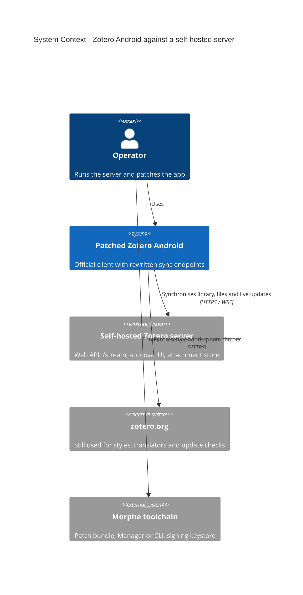
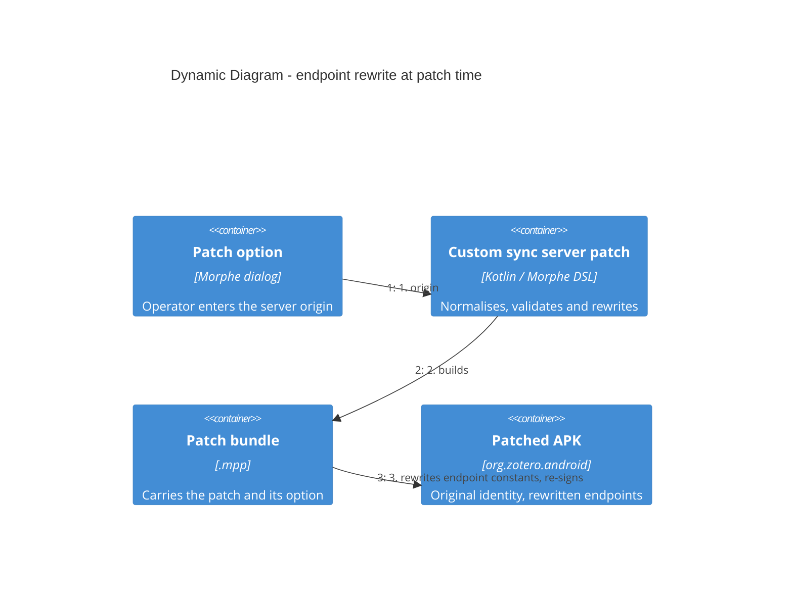

## Context

The target is the official Zotero Android app, pinned at 1.0.0 (build 247, universal APK,
`org.zotero.android`). Its service hosts are compiled in: `BuildConfig.BASE_API_URL`
(`app/build.gradle.kts:41`, 18 references across 14 Kotlin files) and a separate streaming
constant `wss://stream.zotero.org` (`websocket/WebSocketController.kt:93`). The app has no
runtime host setting, so a self-hosted server can only be reached from a patched client.
Evidence: `analysis/zotero/notes/sync-endpoint-research.md` (morphe-ai workspace), whose
claims were validated against the source at commit `1faa4de`.

Release builds are not obfuscated (`isMinifyEnabled = false`, empty `proguard-rules.pro`),
there is no certificate pinning, and the released APK targets SDK 35 (the source tree declares 36), so
cleartext HTTP is blocked by default while user-installed CAs are trusted.

### System context (C4)



### Container view of the patched app

```mermaid
C4Container
  title Container Diagram - patched Zotero Android

  Person(operator, "Operator")

  System_Boundary(app, "Patched Zotero Android") {
    Container(api, "API client", "Retrofit + OkHttp", "Metadata and item requests to the rewritten origin")
    Container(sync, "Sync engine", "Kotlin sync actions", "Builds request URLs from the rewritten base")
    Container(ws, "Streaming socket", "OkHttp WebSocket", "Live library updates and login push")
    Container(files, "Attachment pipeline", "Kotlin uploader/downloader", "Bytes to and from the server")
    Container(approval, "Approval WebView", "Android WebView", "Opens the server-provided approval page")
  }

  System_Ext(server, "Self-hosted Zotero server", "Web API, /stream, approval UI, attachment store")

  Rel(operator, app, "Uses")
  Rel(api, server, "Metadata requests", "HTTPS")
  Rel(sync, server, "Batch and version requests", "HTTPS")
  Rel(files, server, "Attachment transfer", "HTTPS")
  Rel(ws, server, "Live updates", "WSS /stream")
  Rel(approval, server, "Account approval", "HTTPS")
```

### Patch-time flow (C4 dynamic)



## Goals / Non-Goals

**Goals:**

- One patch, one option, that points the official client at an operator-run server and leaves
  the application otherwise identical.
- Correct in the artifact, not only in the source tree: the rewrite rules come from the
  release APK's smali, not from reading the Kotlin.
- Fail at patch time, with a message, for any address the patch cannot honour.

**Non-Goals:**

- Cleartext for the *API*: only the streaming endpoint may be cleartext, and only for the host
  the operator supplies (ADR-0003).
- Sub-path API origins (`https://host/zotero`); the streaming override is a full URL and may
  carry a path.
- The cosmetic zotero.org links (registration, settings, citations, styles, update checks).
- Server-side work, and any support for Zotero iOS.

## Decisions

- **D1 — Rewrite at patch time, not at runtime.** The address is known in the patch dialog, so
  no code needs to execute inside the app. Alternatives: a runtime extension reading a
  preference; external redirection (proxy/DNS/VPN). Chosen: patch-time rewrite (ADR-0001).
- **D2 — Keep the application's identity.** Only string constants change; the package name,
  version code and every class name stay as they are. Alternative: rename the package for a
  side-by-side install, rejected by the operator and incompatible with the app's own URIs
  (ADR-0002).
- **D3 — One required origin plus an optional streaming override.** The streaming endpoint cannot
  always be derived: the operator's server serves it over plain `ws://`, so a second *optional*
  option carries the full WebSocket URL and an empty value falls back to `wss://<origin>/stream`.
  The login/approval and attachment-upload URLs need no input (the server returns them).
- **D4 — HTTPS for the API, scoped cleartext for streaming.** The API origin must be HTTPS; the
  streaming override may be cleartext (`ws://`), in which case a `resourcePatch` adds exactly that
  host to the cleartext allowlist in `network_security_config.xml` (ADR-0003). Alternatives:
  require `wss://` (the operator's server does not serve the stream over TLS today) or allow
  cleartext generally (wider than needed — the API is already on TLS).
- **D5 — Two-pronged constant sweep.** Replace every `const-string` for the two endpoints *and*
  the `BuildConfig.BASE_API_URL` field initializer when present. Alternative: patch only the
  field (breaks if Kotlin inlined the Java constant) or only the literals (misses a field read).
  The two-pronged sweep is correct in either case; task 1.4 establishes which form the release
  APK uses.
- **D6 — Reject a path in the origin.** The API reaches Retrofit's `baseUrl`, which requires a
  trailing slash for a non-empty path; a self-hosted server is normally mounted at the origin.
  Alternative: accept and normalise a path; deferred.
- **D7 — Evidence before implementation.** Enumerate the rewrite sites in smali first (tasks
  1.3–1.4), so the patch is written against the artifact.
- **D8 — Cleartext only for the supplied streaming host.** When a cleartext streaming URL is given,
  the patch adds exactly that host to the cleartext allowlist — nothing else changes (ADR-0003).
- **D9 — Server-provided URLs are opened verbatim.** The app appends `"&app=1"` to the `loginURL` it is handed. Against a server whose login URL carries no query string that turns the path into `/login&app=1`, which the server answers `404` — measured against the operator's server: as returned `303`, with the app's append `404`, and `?app=1` `303`. The patch rewrites that literal to an empty string so the URL is opened exactly as returned. Alternative: rewrite it to `"?app=1"`, which is correct only for queryless URLs and wrong for any server that returns a query. Recorded as ADR-0004.

## Risks / Trade-offs

- [Const inlining is unknown until the DEX is inspected] → sweep both forms (D5), confirm the
  sites in 1.4.
- [The streaming scheme depends on the server] → the streaming URL is an explicit override with a
  derived `wss://<origin>/stream` default, so a cleartext server works without weakening the API.
- [A cleartext streaming host weakens transport security for that host] → the exception is scoped
  to the single host from the option (ADR-0003); prefer `wss://` where the server can offer it.
- [A resource patch edits compiled XML] → one `<domain>` entry is added to the existing cleartext
  `domain-config`; device verification (4.8) confirms it in the patched APK.
- [The app mutates a URL the server provided] → the `&app=1` append is neutralised (D9/ADR-0004); device verification 4.2 requires the approval page to load.
- **D10 — Correct the client's precondition header, consistently.** The app builds the deletion write with the misspelled header `If-Modified-Since-Version`, which no client or server defines; a server that enforces the v3 write precondition therefore sees no precondition and answers `428 Precondition Required`. The patch rewrites that literal **everywhere it appears** — the deletion write and the two read paths that carried the same typo (`LoadDeletionsSyncAction`, `SyncSettingsSyncAction`) — so the header has one documented spelling. The risk of newly asserting a precondition on a read was checked rather than assumed: the v3 protocol scopes the precondition to writes, and the strict server parses the header only in its write paths (`services/writes.py`), so the reads are unaffected. Alternative: fix only the write site, rejected — it leaves a latent typo that could regress silently. Verified in the pinned artifact: the misspelled literal occurs once per site in three classes, while the item/settings writes already send `If-Unmodified-Since-Version` — which is why updates worked and deletions did not.
- [Login compatibility depends on the server implementing the login-session protocol] → altero
  implements it; device verification (4.2) proves it end to end.
- [Installing over a Play-signed build fails on signature] → documented: uninstall the store
  build, or sign with the same keystore the Manager uses.
- [A wrong origin produces an app that cannot sync] → patch-time validation with clear messages,
  and the option is visible in the patch dialog.
- [Scope creep into cosmetic links] → out of scope; a spec scenario asserts non-sync hosts are
  untouched.

## Migration Plan

Not applicable: a new patch with no data migration. Rollback is re-patching the stock APK, or
reinstalling the store build; no server or account state is involved. Extending the option
reinstalling the store build; no server or account state is involved. Extending the *API* option
(sub-paths, a cleartext API origin) would be a new change that supersedes this one; the ADRs are
immutable once accepted.

## Open Questions

- The four grilling items (single option, static rewrite, path handling, cosmetic links) were
  confirmed by the operator; the two ADRs are `Accepted`.
- Whether `Compatibility` should pin `versionCodes` and ABI mappings, pending recon (task 1.2).
- The streaming override settles the separate-streaming-endpoint question; a sub-path API origin remains out of scope.
